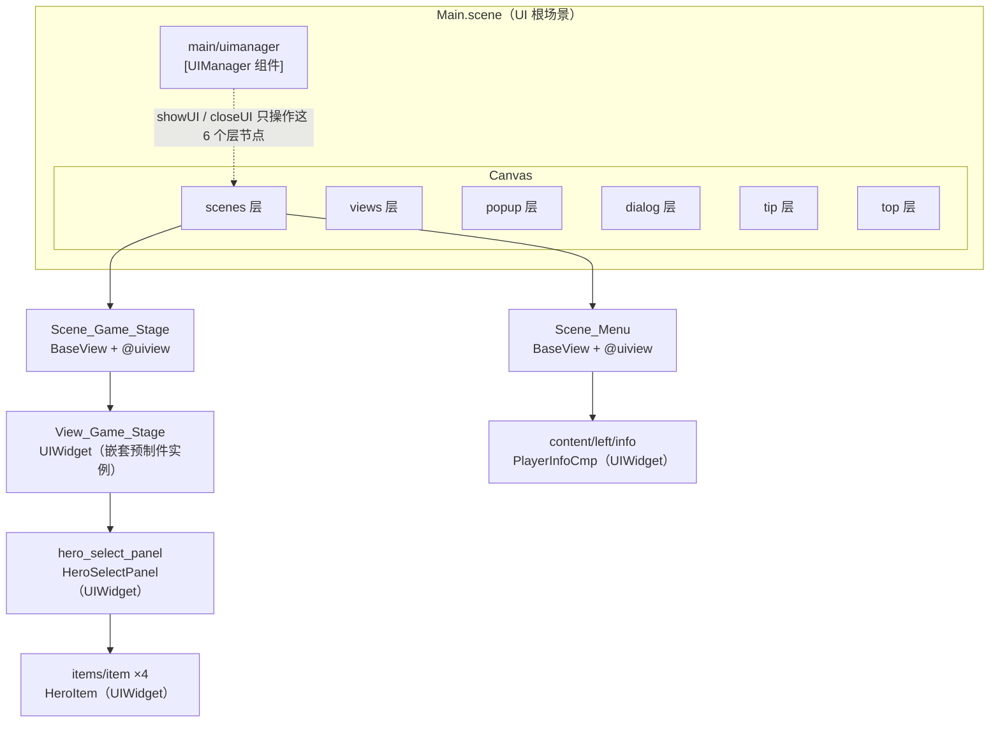
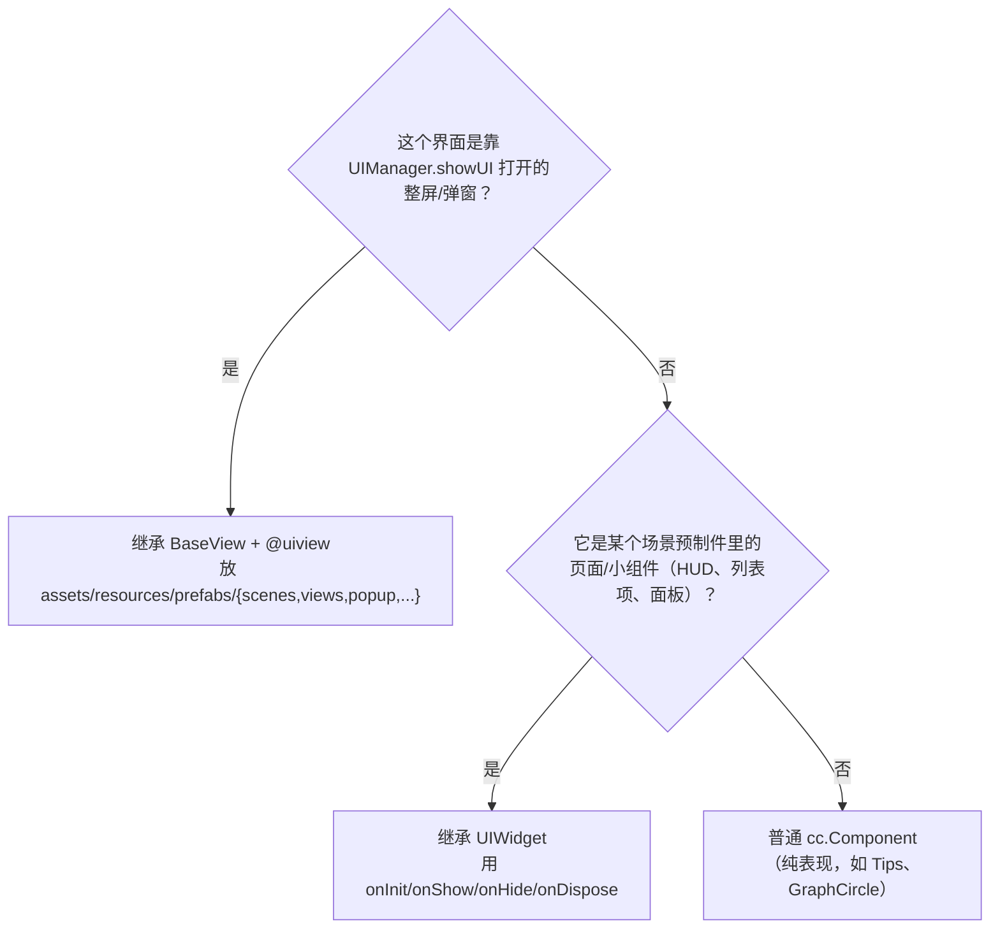
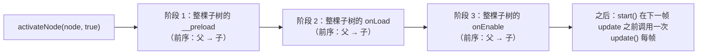
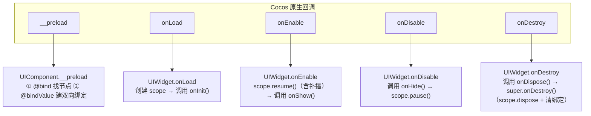
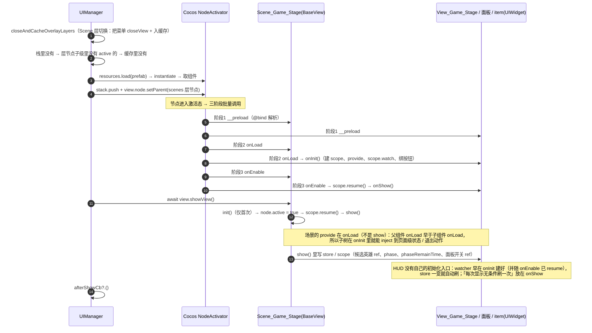
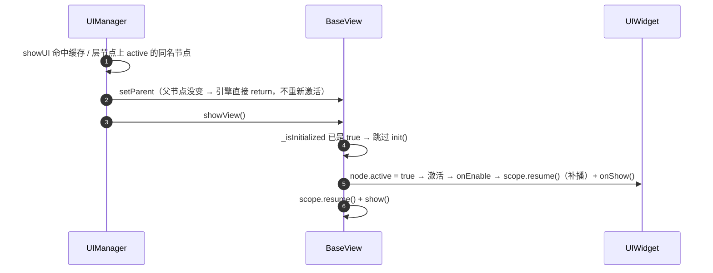
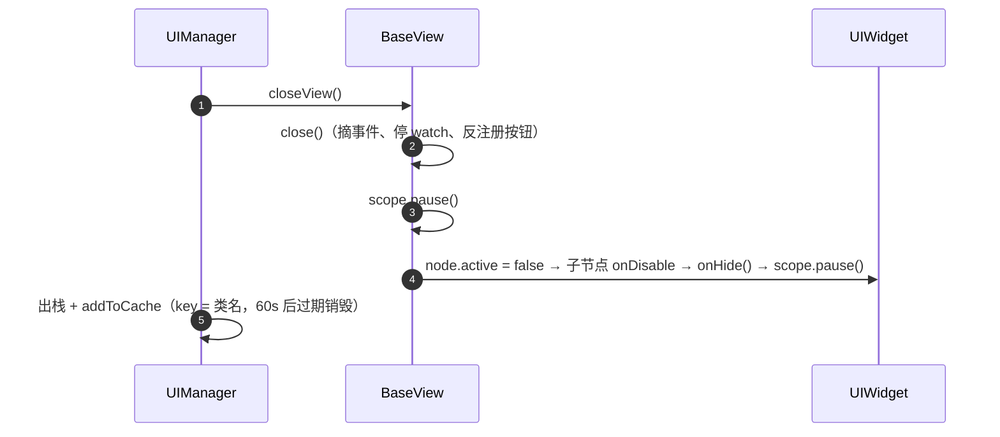
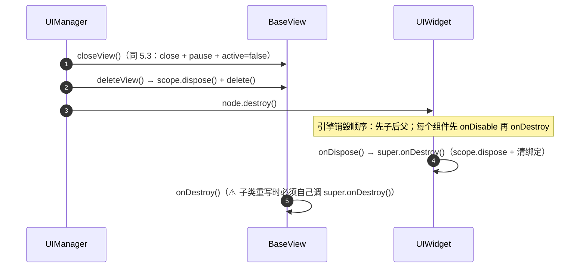
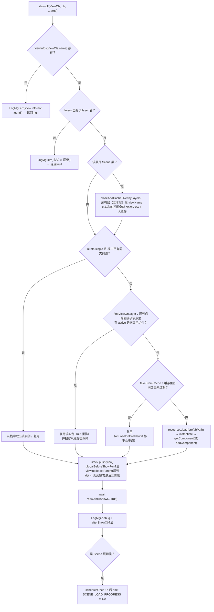
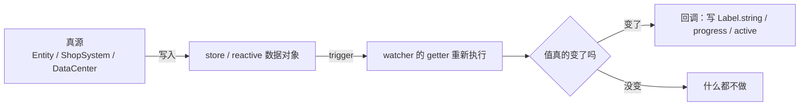

# 集合防御 · UI 框架使用说明

> 面向：新接手的客户端同学、要加界面的策划/程序。
> 目标：看完本文能独立写一个界面、知道每一步在什么时机发生、知道哪些写法一定会出问题。
>
> 文中所有生命周期顺序都来自**引擎源码 + 本项目序列化数据实测**，不是凭印象写的，依据见文末 [§12](#12-本文的事实依据)。

---

## 目录

1. [30 秒速览](#1-30-秒速览)
2. [两套 UI 体系：BaseView 与 UIWidget](#2-两套-ui-体系baseview-与-uiwidget)
3. [项目现状快照](#3-项目现状快照)
4. [生命周期：Cocos Node 与 UI 框架的完整对应关系](#4-生命周期cocos-node-与-ui-框架的完整对应关系)
5. [四条典型时序（首次 / 复用 / 关闭 / 销毁）](#5-四条典型时序首次--复用--关闭--销毁)
6. [UIManager 详解](#6-uimanager-详解)
7. [UI 通信规约：向下的状态、向上的通知、跨界面的 store](#7-ui-通信规约向下的状态向上的通知跨界面的-store)
8. [响应式自动刷新 UI](#8-响应式自动刷新-ui)
9. [典型用法配方（复制即用）](#9-典型用法配方复制即用)
10. [注意事项与已知坑（重点）](#10-注意事项与已知坑重点)
11. [新建一个界面的 Checklist](#11-新建一个界面的-checklist)
12. [本文的事实依据](#12-本文的事实依据)

---

## 1. 30 秒速览

记住三句话，80% 的问题都能自己判断：

| 你要做的事 | 用哪个东西 |
|---|---|
| 打开 / 关闭一个**整屏界面或弹窗**（挂在层节点下） | `UIManager.ins.showUI(XxxView)` / `closeUI(XxxView)`，视图类继承 **`BaseView`** + `@uiview` |
| 写**场景预制件里内嵌的页面/小组件**（战斗 HUD、列表项、信息条） | 继承 **`UIWidget`**，用 `onInit / onShow / onHide / onDispose`，**不要**加 `@uiview` |
| 让 UI **自动跟着数据变** | `this.scope.watch(() => 数据源.字段, () => 刷新())`；数据源是 store / reactive 数据模块，UI 只读不写 |

三条铁律（和 `AGENTS.md` 一致）：

1. **状态向下**（store / `scope.provide`）、**通知向上**（`scope.emit`）、**兄弟之间只认共同祖先的共享状态**。
2. **绝不横向 `getComponent`**（兄弟组件互相抓）；向下持有自己的子项（宿主 → item）是允许的。
3. **UIWidget 不要重写 Cocos 的 `onLoad/onEnable/onDisable/onDestroy`**，那会覆盖基类的 scope 生命周期。

整体骨架：



> 关键区分：**只有 `scenes~top` 这 6 个层节点的直接子节点归 UIManager 管**。
> `View_Game_Stage` 虽然在 `scenes` 层下面，但它是 `Scene_Game_Stage` 的**后代**而不是层节点的直接子节点，所以它归 `UIWidget` 体系、生命周期由 Cocos 原生的显示/隐藏驱动。

---

## 2. 两套 UI 体系：BaseView 与 UIWidget

### 2.1 对比表

| | **BaseView** | **UIWidget** |
|---|---|---|
| 源码 | `platform/ui/BaseView.ts` | `platform/ui/UIWidget.ts` |
| 谁管生命周期 | `UIManager.showUI / closeUI` | Cocos 原生节点激活/禁用/销毁 |
| 是否要装饰器 | **必须** `@uiview({prefabPath, layer, single})` | **禁止** `@uiview`（会在 `showUI` 时抛 `TypeError`，见 §10.1 第 2 条） |
| 节点挂在哪 | `scenes/views/popup/dialog/tip/top` 层节点的**直接子节点** | 任意位置（场景预制件内部任意深度） |
| 业务钩子 | `init()` / `show()` / `close()` / `delete()` | `onInit()` / `onShow()` / `onHide()` / `onDispose()` |
| Cocos 回调 | 可以随便重写 `onLoad/start/update/onEnable/onDisable/onDestroy`（重写 `onDestroy` 必须 `super.onDestroy()`） | **不要重写**，用上面 4 个钩子代替 |
| 首次时机 | 第一次 `showView()` 时调 `init()`，之后每次 `showView()` 只调 `show()` | `onInit` 只在节点第一次 `onLoad` 时；`onShow/onHide` 每次 |
| 典型例子 | `Scene_Menu`、`Scene_Game_Stage`、`Top_ChangeScene` | `View_Game_Stage`、`HeroSelectPanel`、`HeroItem`、`PlayerInfoCmp` |
| 自带能力 | `this.scope`（provide/inject/watch/局部事件）、`showArgs`、`uid`、`viewName` | 同左（都继承 `UIComponent`） |

### 2.2 怎么选（判断题）



判断小技巧：**你的节点是不是编辑器里层节点的直接子节点？** 是 → BaseView；不是 → UIWidget。

反过来，给 UIWidget 加 `@uiview` 不会「打不开就完事」，而是会在 `showUI` 里**炸**（详见 [§10.1](#101-一定会出错的写法红线) 第 2 条）：
`@uiview` 注册会成功，`showUI` 于是照常实例化预制件、把组件 push 进栈，最后执行 `await view.showView(...)` —— 而 `showView` 只存在于 `BaseView`，UIWidget 上是 `undefined`，抛 `TypeError: view.showView is not a function`。此时节点已经挂在层节点上了，栈里也留着一条脏记录。

---

## 3. 项目现状快照

UI 相关类清单（`assets/scripts`）：

| 类 | 基类 | 注册 | 预制件 | 层级 | 说明 |
|---|---|---|---|---|---|
| `Scene_Menu` | BaseView | `@uiview` single | `resources/prefabs/scenes/Scene_Menu` | `Scene` | 主菜单；`start()` 里绑进入战斗按钮 |
| `Scene_Game_Stage` | BaseView | `@uiview` single | `resources/prefabs/scenes/Scene_Game_Stage` | `Scene` | 战斗总控（刷怪/商店/胜负），同时是战斗 UI 子树的 `provide` 宿主 |
| `Top_ChangeScene` | BaseView | `@uiview` single | `resources/prefabs/ui/Top_ChangeScene` | `Top` | 转场动画视图（**当前无调用方**，见 [§10](#10-注意事项与已知坑重点)） |
| `View_Game_Stage` | UIWidget | — | 内嵌于 `Scene_Game_Stage.prefab`（嵌套实例） | — | 战斗 HUD；`onInit/onShow/onDispose` + `scope.watch`，只读 `useBattleStore`（无 `init(ctx)` / `unInit()`） |
| `HeroSelectPanel` | UIWidget | — | 战斗预制件内 `hero_select_panel` | — | 选英雄面板；`inject` 宿主的候选列表 / 面板开关，`provide` 选中态给 item 子树 |
| `HeroItem` | UIWidget | — | 面板内 `items/item` ×4 | — | 列表项；`inject` 选中态 + `emit` 通知面板 |
| `PlayerInfoCmp` | UIWidget | — | 菜单预制件内 `content/left/info` | — | 等级/名字/经验条，watch `DataCenter.playerInfo.data` |
| `Tabs` | UIWidget | — | 通用组件（挂在 **tab 与 content 的共同祖先**上） | — | 通用页签：维护 tab↔content 对应、选中互斥、内容显隐，`provide` 选中态给子树（见 [R9](#r9--通用页签tabs)） |
| `TabItem` | UIWidget | — | 通用组件（挂在**每个 tab 节点**上，可选） | — | 单个 tab 的状态载体 + **表现接口**（重写 `onSelectedChanged(selected)` 自己画：换图/改色/动画随你），由 `Tabs` **单向**驱动 |
| `Tips` | `cc.Component` | — | — | — | 原生组件，非 UI 体系 |

层节点（`assets/scenes/Main.scene` 的 `Canvas` 下，全部已挂到 UIManager 上且 active）：

| 层枚举 | 层节点名 | 有节点吗 |
|---|---|---|
| `ViewLayer.Scene` | `scenes` | ✅ |
| `ViewLayer.Bottom` | — | ❌ **没有对应节点，这一层当前不可用** |
| `ViewLayer.View` | `views` | ✅ |
| `ViewLayer.PopUp` | `popup` | ✅ |
| `ViewLayer.Dialog` | `dialog` | ✅ |
| `ViewLayer.Tip` | `tip` | ✅ |
| `ViewLayer.Top` | `top` | ✅ |

全局状态（跨界面共享）在 `game/stores/`：

| store | 内容 | 谁在用 |
|---|---|---|
| `useBattleStore` | **战斗真源的响应式投影**：hp/maxHp、phase/phaseRemainTime、gold、kills、level/exp、isPaused、enemiesAlive… | `Scene_Game_Stage` 写，`View_Game_Stage` / `ShopBuffItem` 读 |
| `StageScopeKeys`（scope provide） | **功能门面**：`HeroSelect` / `RelicShop` / `BuffShop` / `SkillSlots`（各功能类的**只读面** `XxxVM`，见 §7.2）、`ExitBattle`（退出动作） | 由 `Scene_Game_Stage` provide，子树 `inject` |

> **store 还是 scope？** 判据是「这个概念属于谁」而不是「现在谁在读」：只有本界面内部（HUD + 内嵌面板/item）读写的**功能页面状态**放 scope provide（值是功能门面）；会被**其它层视图**（popup 结算/商店、顶栏）读的**战斗真源投影**留 store —— 跨层节点 `inject` 不到（§7.1 第 2 条）。
| `useUIStore` | toasts、isLoading、activeModals、notification、currentScene | 预留（**当前 UI 未接入**） |

**启动链路**：`Loading.scene`（加载 `scripts` bundle + 配表）→ `director.loadScene('Main')` → `Main.onLoad` → `await TbRoot.ins.loadTbs()` → `UIManager.ins.showUI(Scene_Menu)`。
注意 `UIManager.ins` 在 UIManager 组件 `onLoad` 之前访问会**返回 null 并打错误日志**，所以任何 UI 调用都必须发生在 Main.scene 加载之后。

---

## 4. 生命周期：Cocos Node 与 UI 框架的完整对应关系

### 4.1 引擎的节点激活顺序（**这是最容易搞错的地方**）

Cocos Creator 3.8.6 的 `NodeActivator.activateNode()` 对一个节点树做**三阶段批量调用**，而不是「每个节点走完自己的一生再走下一个」：



推导出的四条硬结论（写代码时按这个来）：

1. **所有节点的 `__preload` 都先于任何节点的 `onLoad`**。
2. **父组件的 `onLoad` 早于子组件的 `onLoad`**（同一阶段内前序）。
3. **`__preload` 早于一切 `onLoad`** —— 所以 `@bind`/`@bindValue`（在 `UIComponent.__preload` 里解析）的字段在 `onLoad` 里一定可用。
4. 反激活（`node.active = false`）是**父组件先 `onDisable`、再递归子节点**；而**销毁是反过来的：子节点先销毁、父组件后销毁**（`_onPreDestroyBase` 先销毁 children，再销毁自己的 components）。

### 4.2 框架钩子挂在哪个原生回调上



`BaseView` **不覆写任何 Cocos 回调**，它只在 `showView/closeView/deleteView` 里编排自己的 `init/show/close/delete`：

```ts
// BaseView.showView（UIManager 在挂载后 await 它）
if (!this._isInitialized) { this._isInitialized = true; this.init(); }  // 只第一次
this.node.active = true;   // 从缓存恢复时：这一行触发子组件的 onEnable → onShow
this.scope.resume();       // 暂停期间被触发的 watcher 在这里补播
this.show();               // 每次显示都调
if (this.useAnimation) await this.playShowAnimation();
```

### 4.3 对应关系总表

| 事件 | Cocos 层 | BaseView | UIWidget | `this.scope` |
|---|---|---|---|---|
| 组件激活（首次） | `__preload` | （可用） | ❌ 禁止重写 | 尚未创建 |
| 组件激活（首次） | `onLoad` | （可用，**provide 推荐放这**） | `onInit()` | **创建**（惰性 `get()` 也在这时被触发） |
| 组件激活（每次显示） | `onEnable` | — | `onShow()` | `resume()`（**先 resume 再 onShow**） |
| 组件禁用（每次隐藏） | `onDisable` | — | `onHide()` | `pause()`（**先 onHide 再 pause**） |
| 组件销毁 | `onDestroy` | （可用，**必须 `super.onDestroy()`**） | `onDispose()` | `dispose()`（停 watcher / 清事件 / 撤销 provide） |
| 显示 | `showView()` | `init()`（一次）→ `show()`（每次） | —（内容随 onEnable 走） | `resume()` 在 `show()` **之前** |
| 隐藏 | `closeView()` | `close()` → `node.active=false` | 子节点 `onDisable`→`onHide()` | `pause()` 在 `close()` 之后、`active=false` 之前 |
| 销毁 | `deleteView()` | `delete()` | — | `dispose()` |

> ⚠️ 顺序细节，写代码时真的会用到：
> **`close()` 早于子组件的 `onHide()`**（`close()` → `scope.pause()` → `node.active = false` 才触发子节点 `onDisable`）；
> **子组件的 `onShow()` 早于父视图的 `show()`**（缓存复用时 `node.active = true` 在 `show()` 之前）。

### 4.4 `scope` 的 pause / resume / dispose 语义（Vue 3.5 同款）

| 操作 | 对 watcher 做了什么 |
|---|---|
| `pause()` | 给每个 effect 打 `PAUSED` 标记；此后数据变化**只在 effect 上记一笔**（`pausedQueueEffects`），回调**不执行** |
| `resume()` | 清标记；若暂停期间被触发过 → **立刻补跑一次回调**（发生在 `scope.resume()` 内部，此时 `show()/onShow()` 还没跑） |
| `dispose()` | `stop()` 掉所有 watcher（从依赖里摘除）、清空局部事件总线、撤销本节点的 `provide` |

两条因此而来的规则：

- **隐藏期间的数据变化不会丢**，重新显示时会补刷一次（前提是「值真的变了」）。
- **非响应式输入的变化不会被感知**（例如 `item.heroId = 3`）→ 每次显示仍要在 `onShow()` 里按当前状态**无条件刷一次**。项目里 `HeroItem.onShow()` 就是这么做的。

---

## 5. 四条典型时序（首次 / 复用 / 关闭 / 销毁）

以战斗场景为例：`Scene_Menu`（菜单）→ 点进入游戏 → `UIManager.showUI(Scene_Game_Stage)`。

### 5.1 首次打开一个运行时实例化的视图（Scene_Game_Stage）



**这里有两个必须知道的结论**：

1. **子组件的 `onInit()` 早于父视图的 `show()`**（因为激活发生在 `setParent` 那一刻）。
   → 所以 `provide` **不要写在 `show()` 里**：子组件那时早已跑完 `onInit`，拿不到值（要么**惰性 inject**，要么把 provide 提到 `__preload` / `onLoad`）。
   **本项目现在的做法**：`Scene_Game_Stage` 把**四套功能的门面**（`StageScopeKeys.HeroSelect` / `RelicShop` / `BuffShop` / `SkillSlots`）与退出动作统一在 **`onLoad`** 里 provide —— 父组件的 `onLoad` 一定早于子组件 `onLoad`（§4.1 结论 2），于是 `View_Game_Stage`、`HeroSelectPanel` 都能在 `onInit` 里直接 `inject`。
   如果想让子组件在 `onInit` 里就能拿到，请把 `provide` 提到视图的 `__preload` 或 `onLoad`。
2. `init()` / `show()` 是**框架方法**，和 Cocos 的 `onLoad` / `start` 没有继承关系；子类不要写 `init()` 之外的初始化入口。`Scene_Game_Stage` 把 `onLoad` 用来缓存 `uiViewNode` 的组件引用，把 `show()` 用来重置本局状态 + 订阅事件。

### 5.2 关闭后再次打开（命中缓存，`onLoad/init` **不会**再跑）



**结论**：`show()`/`onShow()` 是「每次显示」的地方，`init()`/`onInit()` 是「一辈子一次」的地方。
把「每次打开都要做」的事（重置列表、滚动到顶、复位选中态）写进 `init()` 是**错的** —— 第二次打开就没执行。

### 5.3 关闭（默认只暂停 + 缓存）



- `closeUI` 默认**不销毁**：节点只是 `active = false`，被缓存在 `UIManager.viewCache` 里；`DEFAULT_CACHE_TIME = 60000ms`，每 10s 扫一次过期。
- 缓存 key 是**类名**，所以**同一层级、同一个类同时只能缓存一份**（再入缓存会把旧的那份销毁）。
- `closeUI(view, { destroy: true })` 才立即销毁。

### 5.4 销毁



---

## 6. UIManager 详解

源码：`assets/scripts/platform/ui/UIManager.ts`（`ViewLayer` 在 `ViewInfo.ts`，`@uiview` 在 `UIDecorator.ts`）。

### 6.1 公开 API

| API | 说明 |
|---|---|
| `UIManager.ins` | 单例；UIManager 组件 `onLoad` 之前访问会返回 `null` 并打错误日志 |
| `showUI(viewType, afterShowCb?, ...args)` | `async`，返回视图实例（失败返回 `null`）。`...args` 会存到视图的 `showArgs` |
| `closeUI(viewOrType, { cb?, destroy? })` | 可以传实例或类；`destroy: true` 立即销毁，否则入缓存 |
| `closeAllByLayer(layerName, destroy = false)` | 关掉某层全部（默认入缓存） |
| `closeAllUI(excludeLayers = [])` | 关掉所有层（可排除若干层），默认入缓存 |
| `globalBeforeShowFun(layerNode, showView, stack)` | 全局钩子，每次 `showView` 前调用（**项目当前未使用**） |
| `changeSceneView` | 转场视图工厂，`showSceneTransition()` 里用；**项目当前未赋值**，所以切场景时走的是「无转场」路径 |
| `UIManager.viewInfos` | `@uiview` 注册表，key = **类名** |
| `UIManager.DEFAULT_CACHE_TIME` | 视图缓存时长，默认 60s |

### 6.2 `showUI` 完整决策流程



几个容易踩的推论：

- **`single` 的比较用的是 `view.viewName`，而 `viewName` 返回的是 `node.name`**（`BaseView` 的 getter），但 `showUI` 传进来的是**类名**。所以：**预制件的根节点名必须和类名一模一样**，否则单例判断失效、会不断新建实例。当前三个视图的预制件根节点名都对得上（`Scene_Menu` / `Scene_Game_Stage` / `Top_ChangeScene`）。
- **`findViewOnLayer` 只扫层节点的直接子节点，且跳过 `active === false` 的**。
- 视图预制件必须放在 `assets/resources/` 下（走 `resources.load`），`prefabPath` 是**不带扩展名**的相对路径，例如 `prefabs/scenes/Scene_Menu`。

### 6.3 ✅ 场景层切换会自动清场

`sceneLayerNames` 只包含 `Scene` 层。所以「打开一个 Scene 层视图」= 一次**全局清场**：其它层（views/popup/dialog/tip/top）以及 Scene 层里的其它视图，全部 `closeView()` + 入缓存。

这意味着：**弹窗/提示类 UI 不需要手动关**，切场景时会被自动收起（60s 内再打开还能复用）。

### 6.4 ⚠️ 编辑器预置实例：Main.scene 里已经放了三个视图

实测 `assets/scenes/Main.scene` 的层节点下**预置了预制件实例**（编辑器里直接拖进去的，不是运行时创建的）：

| 层节点 | 预置实例 | 根节点 `_active`（实测） | 运行时会发生什么 |
|---|---|---|---|
| `scenes` | `Scene_Menu` | **true** | Main 场景加载时就激活：`__preload/onLoad/onEnable` 同步跑完（含 `PlayerInfoCmp.onInit/onShow`），`start()` 在其后首个 tick 跑（仍早于 `Main._init` 里 `scheduleOnce` 的 `showUI`）；`showUI(Scene_Menu)` 会**复用它**（不重新实例化） |
| `scenes` | `Scene_Game_Stage` | **false** | `findViewOnLayer` 会跳过它 → 第一次 `showUI(Scene_Game_Stage)` 时**另建一份新实例**，这个预置节点成为不会被使用的死节点 |
| `top` | `Top_ChangeScene` | false | 同上（且 `changeSceneView` 未赋值，转场视图当前根本不会被打开） |

结论与建议：

- **预置实例必须 `active = true` 才会被 `showUI` 复用**；`active = false` 的预置节点等于白占内存。
- 想让视图由 UIManager 完整接管（`init()`/`show()` 时机可控），**最稳的做法是不要在 Main.scene 里预置**，删掉预置节点、让 `showUI` 运行时实例化（`Scene_Game_Stage` 现在实际走的就是这条路，只是多留了一个死节点）。
- 预置并且 `active = true` 的代价是：它的 `onLoad/onEnable/start` 在 **Main 场景加载时**就跑完了，早于 `Main._init()` 里的配表加载完成。所以这类视图的 `onLoad` 里**不要依赖配表**（`PlayerInfoCmp` 走的 `DataCenter` 就属于这种情况，取默认值即可）。

---

## 7. UI 通信规约：向下的状态、向上的通知、跨界面的 store

三层通道，按「共享范围」选：

```mermaid
flowchart TB
    subgraph GLOBAL["跨界面 / 跨层共享 → 全局 store（战斗真源的投影）"]
        BS["useBattleStore<br/>hp、gold、level、phase…"]
        DC["DataCenter（局外持久数据，reactive）"]
    end
    subgraph SCOPE["界面内部任意深度 → UIScope provide/inject"]
        SG["Scene_Game_Stage"] -->|provide('stage:exitBattle', 动作)| VGS["View_Game_Stage"]
        SG -->|provide('heroSelect:list' / 'heroSelect:panelVisible', ref)| HSP["HeroSelectPanel"]
        HSP -->|provide('heroSelect:selectedId', ref)| HI["HeroItem ×4"]
        HI -->|scope.emit('heroSelect:picked', heroId)| HSP
    end
    BS -.->|读 / 写| VGS
    BS -.->|读 / 写| HSP
    DC -.->|读| PI["PlayerInfoCmp（菜单）"]
```

> **哪些该放 scope（页面级）**：只有本界面内部读写的 UI 状态 —— 面板开关、面板要渲染的列表、界面私有的选中态。
> **哪些必须留 store**：会被其它层视图（popup 结算/商店、顶栏）读的战斗数据（hp / gold / level / phase），因为**跨层 inject 不到**。

| 场景 | 用什么 | 例子 |
|---|---|---|
| 跨界面 / 跨场景共享状态（战斗真源投影） | 全局 store | `useBattleStore().gold`、`battleStore.phase` |
| 局外持久数据（localStorage） | `DataCenter` 的 reactive 数据模块 | `DataCenter.ins.playerInfo.data.level` |
| **功能页面状态**：宿主 → 整棵子树（面板开关、候选列表） | `this.provide(key, 功能门面)` + 深层 `this.inject(key, fallback?)` | `Scene_Game_Stage` 注入 `HeroSelect` / `RelicShop` / `BuffShop` / `SkillSlots` 四个门面 |
| 宿主 → 子树任意深度共享状态（**面板私有**） | 同上 | 面板把「当前选中英雄 id」注入 item 子树 |
| 子树 → 宿主通知/命令 | `this.scope.on(type, fn)` / `this.scope.emit(type, ...)` | item 通知面板「英雄被点了」 |
| 兄弟之间 | **不直接通信**：状态提升到共同宿主（provide / store），各自 watch | 4 个 item 的互斥选中 |
| 宿主 → 自己的子项（持有引用） | ✅ 允许：`@property(Node)` + `getComponent(T)` | `HeroSelectPanel.heroItemListNode.children` → `HeroItem` |
| 横向 `getComponent`（兄弟互抓） | ❌ 禁止 | — |

### 7.1 `UIScope` 要点

- `provide` 的作用域是**本节点及其整棵子树**，与深度无关；`inject` 沿 `node.parent` 向上找，**不含自己这一层**（和 Vue 一致）。
- **不跨层节点**：`scenes/views/popup/dialog/tip/top` 互为兄弟，跨层互相 `inject` 不到 —— 跨界面请走 store。
- 每个 `UIComponent`（含 BaseView / UIWidget）自带一条**局部事件总线**，随 scope 销毁自动清空，所以 `emit/on` 不需要手写 `off`（但 `node.on(Button.EventType.CLICK, ...)` 这类**节点事件需要自己 off**）。
- **`emit` 会沿 `node.parent` 向上冒泡**（与 `inject` 同向）：先派发到自己的总线，再逐级派发到**每个祖先 UIComponent 的作用域**——
  所以「第 5 层的 item 通知第 2 层的面板」和「第 1 层通知第 2 层」写法完全一样，中间层不需要转发。
  **只向上**：不传给后代、也不传给兄弟（兄弟互斥仍走共同祖先 `provide` 的共享状态）。
- key 常量与**键→类型**集中放 `game/ui/scenes/scene_game_stage/cmps/StageScope.ts`，命名 `'域:用途'`。
  ⚠ **一个功能一个键 —— provide「功能门面（对象）」，不 provide「字段（裸 ref）」**：只给面板原料的话，
  面板拿不到规则就只能自己重算一份（本项目实测同一条「刷新按钮能不能点」被抄了 4 遍，见 AGENTS.md Notes「UI 页面数据分散」）。

```ts
export const StageScopeKeys = {
    ExitBattle: 'stage:exitBattle',      // Scene_Game_Stage 提供，战斗 UI 任意深度可用
    HeroSelect: 'heroSelect:vm',         // 选英雄功能门面（HeroSelectVM）
    RelicShop: 'relicShop:vm',           // 遗物/肉鸽商店门面（RelicShopVM）
    BuffShop: 'buffShop:vm',             // 击杀商店门面（BuffShopVM）
    SkillSlots: 'skillSlots:vm',         // 技能槽门面（SkillSlotsVM）
} as const;

/** 键 → 值类型（这一页的数据契约） */
export interface StageScopeMap {
    [StageScopeKeys.ExitBattle]: () => void;
    [StageScopeKeys.HeroSelect]: HeroSelectVM;
    // …
}

export const StageScopeEvents = {
    HeroPicked: 'heroSelect:picked',
} as const;
```

> **功能门面怎么写**：功能类自己 `export interface XxxVM { readonly panelVisible: Ref<boolean>; refreshGate(): RefreshGate }` ——
> 只声明「读什么」+「能问什么规则」，**动作（open/refresh/pick/buy/grant）不上门面**（UI 一律 `emit` 向上），
> 所以面板写 `vm.pick(...)` 会**编译报错**。宿主 `provide(StageScopeKeys.Xxx, 实例)`，面板
> `this.inject<XxxVM>(StageScopeKeys.Xxx, null)` 即可 —— 类型即约束，运行时还是同一个实例、零开销。

> **页面级状态就该这么走**：开关/列表的「真源」只在宿主这一份 ref 里 —— 开局由场景写 true，
> HUD 的按钮写 true，面板的关闭按钮写 false，节点显隐由 HUD 统一监听并写；谁都不去 `getComponent` 别人的节点。
> 传值记得用 `ref()`（普通值只能读到当场快照，watch 不到变化）。

### 7.2 watcher 一律用 `this.scope.watch(...)`

不要用裸 `watch()`（那样得自己保存 handle 并在销毁时 stop）。`scope.watch` 建出来的 watcher：

- 随界面隐藏/显示自动 `pause/resume`（隐藏时几乎零开销）；
- 随 scope 销毁自动回收；
- 返回值是 `WatchHandle`（也可手动 `stop()`，如 `ShopRelicsPanel` 这种仍是普通 `cc.Component`、靠自己存 `watchHandles` 数组的历史写法 —— UIWidget / BaseView 里请交给 scope 托管）。

---

## 8. 响应式自动刷新 UI

### 8.1 数据流



UI **只读不写**数据；写了也不会出错，但会绕过单一真源（例如 HUD 直接改 `battleStore.hp` 而不改 Entity，下一帧就会被 `syncHeroToStore` 覆盖回来）。

### 8.2 三种数据源的写法对照

```ts
// ① 全局 store（跨界面），HeroSelectPanel 的真实写法
this.scope.watch(() => this.battleStore.gold, () => this.checkRefreshGoldValueStatus());

// ② 局外持久数据（DataCenter 的 reactive 模块），PlayerInfoCmp 的真实写法
this.scope.watch(() => this.info.level, () => this.refreshLevel());
// 多字段同时依赖 → 传数组（升级会一次改掉 exp 与 expToNext）
this.scope.watch([() => this.info.exp, () => this.info.expToNext], () => this.refreshExp());

// ③ 界面内部共享状态：宿主 provide 一个**功能门面**，子孙 inject 后读它的 ref / 问它规则
//  宿主：this.scope.provide(StageScopeKeys.HeroSelect, this.heroSelect);   // 值是功能类实例，按 HeroSelectVM 声明类型
//  子孙：this.heroSelect = this.inject<HeroSelectVM>(StageScopeKeys.HeroSelect, null);
//        this.scope.watch(() => this.heroSelect.selectedId.value, () => this.applySelected());
//        // 规则也问门面要（别在 UI 里重算）：enabled = this.heroSelect.refreshGate().enabled
```

### 8.3 `watch` 语义速查（本项目 `platform/reactivity/watch.ts` 实现）

| 行为 | 本项目实际语义 |
|---|---|
| 回调时机 | **同步**！赋值后立刻执行回调（没有 Vue 的 pre-flush 队列/批处理） |
| 一次循环里改 3 个字段 | 回调会跑 3 次（`addExp` 升级一次会连着刷 exp/exp/level/exp 共 4 次）——UI 赋值便宜，可以忽略；真在意就自己加脏标记 |
| 写入相同的值 | **不触发**（`hasChanged` 判断） |
| 多源 | `watch([() => a, () => b], cb)`，任一变化都回调 |
| 整对象 deep | `this.scope.watch(() => someReactiveObj, cb, { deep: true })` |
| 首次立即执行 | `{ immediate: true }`（让 watcher 建立时先跑一次；「每次显示都要刷」的场景也可以写成在 `onShow()` 里显式刷一次，项目里 `View_Game_Stage` 就是这么做的） |
| getter 里没读到字段 | 收集不到依赖 → 永远不触发（**别提前解构**：`const lv = this.info.level` 是错的） |
| 隐藏期间变化 | `scope.resume()` 时补播一次（前提是值真的变了） |
| 非响应式字段 | 不感知（如 `HeroItem.heroId`、`item.selectType`）→ 在 `onShow()`/显式调用里刷 |

---

## 9. 典型用法配方（复制即用）

### R1 · 新建一个 UIManager 视图（整屏/弹窗）

```ts
// assets/scripts/game/ui/views/View_Bag.ts
import { _decorator, Button, Label, Node } from 'cc';
import BaseView from 'db://assets/scripts/platform/ui/BaseView';
import { uiview } from 'db://assets/scripts/platform/ui/UIDecorator';
import { ViewLayer } from 'db://assets/scripts/platform/ui/ViewInfo';
import UIManager from 'db://assets/scripts/platform/ui/UIManager';
import { useBattleStore } from '../../stores';

const { ccclass, property } = _decorator;

/** 背包界面（UIManager 管理 → BaseView + @uiview；**不要**继承 UIWidget） */
@uiview({
    prefabPath: 'prefabs/views/View_Bag',   // resources 下、不带扩展名
    layer: ViewLayer[ViewLayer.PopUp],
    single: true,                            // 同类只允许一个
})
@ccclass('View_Bag')
export class View_Bag extends BaseView {

    @property(Label)
    titleLabel: Label = null;
    @property(Node)
    closeBtn: Node = null;

    private store = useBattleStore();

    /** 只跑一次：建 watcher、绑事件（provide 也放这里/onLoad，别放 show） */
    protected init(): void {
        this.closeBtn?.on(Button.EventType.CLICK, this.onClose, this);
        this.scope.watch(() => this.store.gold, () => this.refreshGold());
    }

    /** 每次显示都跑：按当前状态刷一遍（缓存复用时 init 不会再跑） */
    protected show(): void {
        this.titleLabel.string = '背包';
        this.refreshGold();
    }

    /** 每次隐藏都跑：摘掉「每次显示都注册」的东西 */
    protected close(): void {
        // 如果是在 show() 里 on 的，就必须在这里 off；在 init() 里 on 的节点事件由组件销毁兜底
    }

    /** 真销毁（缓存过期或 closeUI 传 destroy:true）才跑 */
    protected delete(): void {
        this.closeBtn?.off(Button.EventType.CLICK, this.onClose, this);
    }

    private refreshGold(): void { /* ... */ }

    private onClose(): void {
        UIManager.ins.closeUI(View_Bag);                 // 入缓存（60s）
        // UIManager.ins.closeUI(View_Bag, { destroy: true }); // 立即销毁
    }
}
```

调用方：

```ts
await UIManager.ins.showUI(View_Bag);          // 也可以传参：showUI(View_Bag, null, data)
UIManager.ins.closeUI(View_Bag);               // 传类名即可关掉该层所有同类
UIManager.ins.closeAllByLayer(ViewLayer[ViewLayer.PopUp]);
```

### R2 · 新建一个内嵌 UIWidget

```ts
// 例：assets/scripts/game/game_stage/ui/xxx/Cmp_KillCounter.ts（import 深度按实际位置调整）
import { _decorator, Label } from 'cc';
import { UIWidget } from 'db://assets/scripts/platform/ui/UIWidget';
import { useBattleStore } from '../../../stores';

const { ccclass, property } = _decorator;

/** 战斗 HUD 上的一块（场景预制件内嵌 → UIWidget，**不加 @uiview**） */
@ccclass('Cmp_KillCounter')
export class Cmp_KillCounter extends UIWidget {

    @property(Label)
    countLabel: Label = null;

    private store = useBattleStore();

    /** 一辈子一次：watch / provide / 局部事件 / 常驻节点事件 */
    protected onInit(): void {
        this.scope.watch(() => this.store.kills, () => this.refresh());
    }

    /** 每次显示：非响应式输入的变化要靠这里补 */
    protected onShow(): void {
        this.refresh();
    }

    /** 每次隐藏 */
    protected onHide(): void { }

    /** 销毁：摘掉节点事件等 */
    protected onDispose(): void { }

    private refresh(): void {
        if (this.countLabel) this.countLabel.string = `击杀 ${this.store.kills}`;
    }
}
```

> ⛔ 千万不要在这个类里写 `onLoad/onEnable/onDisable/onDestroy`，也不要在节点上挂 `@uiview`。

### R3 · 宿主 → 子树：`provide` + `inject`（含**惰性注入**推荐写法）

```ts
// 宿主（场景 Scene_Game_Stage，BaseView）：在 onLoad 里 provide —— 父组件 onLoad 早于子组件 onLoad，
// 所以子树在 onInit 里就注入得到。
// ⚠ 一个功能一个键：provide 的是**功能门面（对象）**，不是逐条裸 ref ——
//   只给原料的话，面板拿不到规则就只能自己重算一份判据（本项目踩过，见 AGENTS.md Notes「UI 页面数据分散」）
onLoad(): void {
    this.scope.provide(StageScopeKeys.ExitBattle, () => this.exit());
    this.scope.provide(StageScopeKeys.HeroSelect, this.heroSelect);   // HeroSelectVM（实例本身）
    this.scope.provide(StageScopeKeys.RelicShop, this.relicShop);     // RelicShopVM
    this.scope.provide(StageScopeKeys.BuffShop, this.buffShop);       // BuffShopVM
    this.scope.provide(StageScopeKeys.SkillSlots, this.skillSlots);   // SkillSlotsVM
}

// 子孙（HUD / 面板 / item）：注入 + watch（任意深度写法完全一样）
protected onInit(): void {
    this.heroSelect = this.inject<HeroSelectVM>(StageScopeKeys.HeroSelect, null);
    if (this.heroSelect) {
        // 读状态：门面里的 ref
        this.scope.watch(() => this.heroSelect.candidates.value, () => this.refreshItems());
        // 用规则：问门面（判据只有一处，UI 不重算）
        this.scope.watch(
            () => refreshButtonKey(this.heroSelect.refreshGate(), this.heroSelect.refreshCost.value),
            () => this.refreshRefreshButton(),
        );
    } else {
        ezgame.warn('没注入到 HeroSelect 门面（不在 Scene_Game_Stage 子树下？）');
    }
}
```

**惰性注入**（`provide` 时机确实晚于子组件 `onInit` 时才需要；本项目已把 provide 提到 `onLoad`，一般用不上）：

```ts
exit(): void {
    // 用到时才 inject，不受 provide 的时机影响；inject 不到就回退到全局事件
    const exitBattle = this.inject<() => void>(StageScopeKeys.ExitBattle, null);
    if (exitBattle) { exitBattle(); return; }
    EventBus.emit(EventNames.BATTLE_EXIT, null);
}
```

### R4 · 子树 → 宿主：`scope.emit` / `scope.on`

```ts
// 子（HeroItem，深度任意）：只负责「通知」，不决定业务
// emit 会沿父链向上冒泡，宿主（HeroSelectPanel）注册的监听器能收到
this.scope.emit(StageScopeEvents.HeroPicked, this.heroId);

// 宿主（HeroSelectPanel）：统一决策
protected onInit(): void {
    this.scope.on(StageScopeEvents.HeroPicked, this.onHeroPicked, this);
}
```

⚠ **`emit` 只向上冒泡**（沿 `node.parent`）：兄弟组件收不到，需要互斥/共享就提升到共同祖先的 `provide`。
中间层不用做任何转发 —— 事件会逐级经过父链上每个 UIComponent 的作用域，谁注册了谁收到。

事件总线随 scope 销毁自动清空，**不需要 off**；但如果你在 `onInit` 里重复注册（比如视图被复用、`onInit` 又跑了一次）就会重复触发 —— `UIWidget.onInit` 一辈子只跑一次，所以安全。

### R5 · 跨界面共享：store

```ts
// 场景/系统侧写（单一真源）
this.battleStore.phase = this.stage;
this.battleStore.phaseRemainTime = this.stageRemainTime;

// UI 侧读（自动刷新）
this.scope.watch(
    [() => this.battleStore.phase, () => this.battleStore.phaseRemainTime],
    () => this.updateProgress(),
);
```

⚠️ store 的 action 里**不要写 `this.xxx.value = ...`**：store 返回的是 `proxyRefs` 代理，`this.xxx` 已经解包成值了，那样写是静默无效的（`useBattleStore` 的早期 `randomHeroes` 就踩过这个坑，代码里留了注释）。直接操作闭包里的 `ref`。

### R6 · 局外数据（DataCenter）自动刷新

见 `assets/scripts/game/scene/scene_prefab/menu/cmps/Cmp_PlayerInfo.ts`（挂在菜单预制件的 `content/left/info` 节点上）：

```ts
private get info(): IPlayerInfo { return DataCenter.ins.playerInfo.data; }   // 每次读都拿 reactive 代理

protected onInit(): void {
    this.scope.watch(() => this.info.name, () => this.refreshName());
    this.scope.watch(() => this.info.level, () => this.refreshLevel());
    this.scope.watch([() => this.info.exp, () => this.info.expToNext], () => this.refreshExp());
}
protected onShow(): void { this.refreshAll(); }
```

任何地方调 `DataCenter.ins.playerInfo.addExp(100)`，UI 自动更新，**数据层完全不需要知道 UI 的存在**。

### R7 · 按钮与节点事件

```ts
protected onInit(): void {
    this.closeBtn?.on(Button.EventType.CLICK, this.onClose, this);   // 节点事件要自己 off
}
protected onDispose(): void {
    this.closeBtn?.off(Button.EventType.CLICK, this.onClose, this);
}
```

- 第三个参数 `this` 是回调的 `this` 绑定，`off` 时必须传**同一个**回调 + 同一个 `this`。
- 想写在 `show()` 里（每次显示都绑）就必须在 `close()` 里成对 `off`，否则复用时会叠加重绑 —— 项目实例：`Scene_Game_Stage.show()` 里 `EventBus.on(...)`、`close()` 里 `EventBus.off(...)`。

### R8 · 列表项的「每次显示复位」

```ts
// HeroItem：heroId 是非响应式字段，setHeroInfo 写完要显式刷一次
setHeroInfo(heroId: number, selectType: number): void {
    this.heroId = heroId;
    this.selectType = selectType;
    this.applySelected();          // 不指望 watch
}

// 面板重新打开时，item 不会重跑 onInit → 在 onShow 里无条件复位
protected onShow(): void { this.applySelected(); }
```

### R9 · 通用页签（Tabs）

源码：`platform/ui/Tabs.ts`（决策方）+ `platform/ui/TabItem.ts`（单个 tab 的状态载体 + **表现接口**）。

**职责划分**：`Tabs` 是**唯一的选中态写入方**（选中互斥、内容显隐、`provide` 选中态、`emit` 事件都在它一处）；`TabItem` 只承载状态（`tabKey` / `tabIndex` / `selected`），**表现留给业务**（重写 `onSelectedChanged`），它**不认识 Tabs**（不 import、不绑点击）。所以兄弟互斥不需要任何互相引用。

> **框架不预设任何表现**：`TabItem` 基类的 `onSelectedChanged(selected)` 是**空实现** —— 换 Sprite、改 Label 颜色、切 `active`、缩放、播动画、联动 Toggle 都由你写。不同类型的 tab（图标型 / 文字型 / 带选中动效）就写**不同的子类**，各自挂在自己的 tab 节点上。

预制件结构（`Tabs` 挂在 **tab 与 content 的共同祖先**上；下面节点名取自菜单预制件，只是示意）：

```
content                 ← [Tabs]  tabBarNode = menus   contentBarNode = right
├── menus               ← tab 容器（子节点顺序 = 下标）
│   ├── game            ← [TabItem_Func] 表现写在 onSelectedChanged 里
│   ├── achivement      ← [TabItem_Text]
│   └── hero            ← [TabItem_Icon]
└── right               ← content 容器（子节点顺序与上面一一对应）
    ├── game            ← 内容（可继承 UIWidget，显隐靠 onShow/onHide 自动收尾）
    ├── achivement      ←
    └── hero            ←
```

- `tabNodes` / `contentNodes` **留空**时自动取 `tabBarNode.children` / `contentBarNode.children`；两个列表**按下标一一对应**（数量不一致会 warn，按较短的对齐）。
- 点击绑定由 `Tabs` 做：tab 节点（或它**子树任意一层**）有 `Button` → 听那个 Button 节点的 `Button.CLICK`；没有 Button → 听 tab 节点自己的 `Node.TOUCH_END`（节点触摸事件会沿父链冒泡，所以点在子节点上一样算）。**tab 节点/子类别再自己 `on` 一次点击**，会点一下切两次。
- **表现的两个接口**（二选一，不用混）：① 每个 tab 节点挂 `TabItem` 的**子类**，重写 `onSelectedChanged`（推荐，表现跟节点走）；② tab 组件不是 TabItem 子类（如 `Toggle` / 自定义 `MyTabBtn`）→ 重写 `Tabs.applyTabSelected(tab, index, selected)` 按自己的类型分发。两条都**不写**的话就是「只有逻辑没有表现」，不报错。

```ts
// ① 写 tab 的表现（框架默认什么都不做）
@ccclass('TabItem_Func')
export class TabItem_Func extends TabItem {
    @property(Node) activeBg: Node = null;
    @property(Label) title: Label = null;

    protected onSelectedChanged(selected: boolean): void {
        this.activeBg.active = selected;                                    // 换底图
        this.title.color = selected ? Color.WHITE : new Color(153,153,153);  // 换文字色
        // tween(this.node).to(0.1, { scale: selected ? 1.1 : 1 }).start();  // 想播动画也行
    }
}
// ⚠ onSelectedChanged 会被重复调（Tabs 的 onShow / refresh() 会整条重刷）→ 实现要幂等；
//    首次调用发生在 onLoad（TabItem 基类里），也就是你的 onInit 之后，时序是安全的

// ② tab 组件不是 TabItem 子类：在 Tabs 子类里按自己的类型分发
protected applyTabSelected(tab: Node, index: number, selected: boolean): void {
    tab.getComponent(MyTabBtn)?.setSelected(selected);
}

// ③ 业务里切换 / 查状态
tabs.select(1);                     // 按 下标 切（-1 = 全不选）
tabs.selectByKey('hero');           // 按 key 切（TabItem.tabKey 优先，留空时是节点名）
tabs.refresh();                     // 按当前选中项重刷表现（不改状态）
tabs.selectedIndex / tabs.selectedKey / tabs.selectedContentNode / tabs.tabCount

// ④ 监听（拿到 Tabs 实例就能注册；emit 沿父链冒泡，宿主祖先同样收得到）
tabs.scope.on(TabsScopeEvents.Changed, (index: number, key: string, prev: number) => { /* 切换 */ });
tabs.scope.on(TabsScopeEvents.Click, (index: number, key: string) => { /* 被点了（含重复点） */ });
tabs.scope.on(TabsScopeEvents.Reselect, (index: number, key: string) => { /* 重复点已选中的那个 */ });

// ⑤ 子类重写虚拟钩子（菜单里的 Cmp_FuncTabs 想接入就这么改：extends Tabs + 配好 tabBarNode/contentBarNode）
@ccclass('Cmp_FuncTabs')
export class Cmp_FuncTabs extends Tabs {
    protected onTabChanged(index: number, key: string, prevIndex: number): void {
        if (key === 'hero') this.refreshHeroList();
    }
    protected onTabReselect(index: number, key: string): void { this.refreshHeroList(); }
}

// ⑥ 内容节点（UIWidget 子类）读选中态：inject 两个 ref（Tabs 在自己的 onInit 里 provide，
//    父 onLoad 早于子 onLoad，所以子节点 onInit 里注入得到）
private selectedIndex: Ref<number> = null;
protected onInit(): void {
    this.selectedIndex = this.inject<Ref<number>>(TabsScopeKeys.SelectedIndex, null);
    if (this.selectedIndex) this.scope.watch(() => this.selectedIndex.value, () => this.onTabMaybeChanged());
}
// ⑦ 内容「被切到了」的另一种写法：节点上的组件实现 ITabContent（节点常驻 active、或想在被重选时刷新时用）
class MyContent extends UIWidget implements ITabContent {
    onTabShow(index: number, key: string): void { /* 每次可见（含重选） */ }
    onTabHide(index: number, key: string): void { /* 关闭节点之前 */ }
}
```

四条要点：

1. **content 必须在 `Tabs` 的子树内**才 `inject` 得到选中态（provide 只对子树可见；跨层/兄弟注不到）。
2. 内容显隐 = `contentNodes[i].active`，所以内容自己的 `UIWidget.onShow/onHide`（= `onEnable/onDisable`）就是「被切到 / 被切走」的钩子，**不要在 `onInit` 里做每次显示都要做的事**。
3. `switchOnInit`（默认开）会在 `onInit` 时切到 `defaultIndex`；`resetOnShow`（默认关）控制每次显示是否回到 `defaultIndex` —— 关掉就是「记住上次选中的 tab」。
4. 运行时动态增删 tab 后调 `tabs.rebuild()` 重新收集并重绑点击（会先把旧绑定摘干净）。
5. **tab 上没挂 `TabItem` 子类、也没重写 `applyTabSelected` = 逻辑正常但视觉不动**（框架不报错也不兜底），排查「点了没反应」时先看这一条。

---

## 10. 注意事项与已知坑（重点）

### 10.1 一定会出错的写法（红线）

| # | 错误写法 | 现象 | 正确做法 |
|---|---|---|---|
| 1 | UIWidget 里重写 `onLoad / onEnable / onDisable / onDestroy` | 覆盖基类实现，逐个后果：重写 `onLoad` → `onInit()` 永不执行（watcher / provide / 事件注册全部不发生）；重写 `onEnable/onDisable` → `scope.resume()/pause()` 不执行（watcher 不随显隐暂停，隐藏时的变化也不补播）；重写 `onDestroy` → `onDispose()` 不执行且 `scope.dispose()` 不执行（watcher 与 provide 泄漏） | 只用 `onInit/onShow/onHide/onDispose` 四个钩子 |
| 2 | 给 UIWidget 加 `@uiview` | `@uiview` 注册成功 → `showUI` 实例化预制件并 push 进栈 → `await view.showView(...)` 抛 `TypeError: view.showView is not a function`（`showView` 只在 `BaseView` 上）。因为是 async 函数，表现为**未处理的 Promise rejection**，而且节点已经挂到层节点上、栈里留了脏记录 | 内嵌 UI 一律不加；要 UIManager 管就改成 BaseView 并挂到层节点下 |
| 3 | 预制件根节点名 ≠ 类名 | `single` 失效、`closeUI(类名)` 关不掉、切场景清场漏掉它 → 图层叠加、重复实例 | 根节点名严格等于类名 |
| 4 | 在 `init()/onInit()` 里写「每次打开都要做」的逻辑 | 第二次打开（命中缓存）不执行 → 状态残留 | 每次显示的逻辑放 `show()/onShow()` |
| 5 | 横向 `getComponent` 抓兄弟 | 耦合、时序脆弱 | 状态提升到共同宿主：provide 或 store |
| 6 | 在 `onLoad` 里访问 `UIManager.ins` | Main.scene 的 UIManager 还没 onLoad → `UIManager.ins` 是 null，报「UIManager 还未初始化就进行获取」 | 一切 UI 调用放到 Main 场景加载之后（如 `Main._init` 或视图 `show()` 里） |
| 7 | `@uiview({layer: ViewLayer[ViewLayer.Bottom]})` | 报「未知 ui 层级：Bottom」 | Bottom 层当前没有层节点，改用 View/PopUp |
| 8 | 视图节点被挂到层节点的**孙级** | UIManager 找不到 / 不管理 | BaseView 的节点必须是层节点的直接子节点 |
| 9 | 视图类重复注册同名 | `@uiview` 直接 `throw`（注册表按类名去重） | 类名全局唯一 |

### 10.2 需要留意的边界与现状问题

| # | 问题 | 说明 / 建议 |
|---|---|---|
| A | **BaseView 子类重写 `onDestroy()` 没调 `super.onDestroy()`** | `UIComponent.onDestroy` 负责 `scope.dispose()` + 清理绑定。`Scene_Game_Stage.onDestroy()` 已补上 `super`（它 provide 了整棵子树的页面级状态，scope 必须能撤销）；`Top_ChangeScene.onDestroy()` 仍**没有** super 调用 → 该视图的 scope 永不 dispose（watcher 仍挂在响应式依赖上，provide 不撤销）。**建议同样补 `super.onDestroy()`**（UIWidget 的基类已代为处理，子类只需写 `onDispose`） |
| B | **视图自己 `node.active = false` / `this.destroy()`** | `Top_ChangeScene._startCompletion/_updateCompletion` 里这么做：绕过了 `UIManager.closeUI`，视图仍留在层栈里，而节点已隐藏/组件已销毁 → 后续清场会对已销毁对象操作、缓存与栈不一致。**视图不要自己销毁自己**，交给 `UIManager.closeUI` |
| C | **`sceneLayerNames` 只有 Scene 层** | 打开 Scene 层视图会清掉其它所有层的 UI。弹窗在切场景时自动收起是预期行为，但**如果你想保留某个常驻 UI（如网络状态条），它会一起被缓存** |
| D | 缓存 60s 后会被销毁 | 「复用」与「重建」两种路径都要能正确工作：状态刷新逻辑一定放 `show()/onShow()`，不要假设对象一直活着 |
| E | `provide` 写在 `show()` 里 | 此时子组件的 `onInit` 早已跑完（§5.1）→ 子组件要么**惰性 inject**，要么把 provide 提到 `__preload/onLoad`。项目现状：`Scene_Game_Stage` 已在 `onLoad` provide（✔），所以子树在 `onInit` 里直接 inject |
| F | `@bind` / `@bindValue` 装饰器**当前项目 0 处使用** | 它们要求节点名是 `&字段名`（装饰器会自动加 `&` 前缀），且找不到时会 `console.warn('字段绑定节点失败…')`。项目现用 `@property` 显式拖引用；若要用，先把节点改名成 `&xxx`，并注意 `@bindValue` 只支持 Label/EditBox/Slider/ProgressBar/Toggle/ToggleContainer |
| G | `@bindValue` 的两个小坑 | ① 初值是 `''`/`null` 时**不会**推给 UI（`syncToUI` 跳过 falsy）；② `onValueChange` 会调用 `on字段名Change(oldValue, newValue)` —— **参数顺序是「旧, 新」**，和 `watch` 的「新, 旧」相反 |
| H | `watch` 回调是同步的 | 一次循环改多个字段会连刷多次（§8.3）；`DataModule` 的自动存盘另有 100ms debounce，和 UI 无关 |
| I | `showArgs` 只是参数仓库 | `showUI(View, cb, a, b)` 的 `a,b` 存在 `view.showArgs`，**不会**作为形参传给 `init/show`；要用就自己读 `this.showArgs` |
| J | 切场景的转场动画当前是空转 | `UIManager.changeSceneView` 从未被赋值 → `showSceneTransition()` 什么都不做（`Top_ChangeScene` 也就不会被打开）。要启用就把工厂函数赋给 `UIManager.ins.changeSceneView` |
| K | `views` 层下有个没有脚本的 `View_Hero_Detail` 占位节点 | 不会被 UIManager 使用，属于美术占位；别误以为它是已实现的视图 |
| L | **功能页面状态塞进全局 store** | 单例状态会跨对局实例串味，且「谁负责重置」变得不明确。判据：只有本界面内部（HUD + 内嵌面板/item）读写的 → 宿主 `provide`（键见 `StageScope.ts`）；会被其它层视图读的战斗数据 → store。项目现状：四套功能的页面状态已全部搬到 `Scene_Game_Stage` 的 scope（provide 的是功能门面 `HeroSelectVM` / `RelicShopVM` / `BuffShopVM` / `SkillSlotsVM`）；旧的商店 WIP 字段（`relicsItemList` / `showRelicsPanel` / `refreshGold`）也已删除 |
| M | **provide 一堆裸 ref，而不是功能门面** | 面板只拿到「原料」拿不到「规则」，只能把判据在 UI 里重算一遍 → 同一条判据三份、口径漂移（实测「刷新按钮能不能点」被抄了 4 遍、`ShopBuffItem` 把 `max_stack` 缺省值算成了另一个数）。做法：功能类导出只读接口 `XxxVM`（ref + 派生查询方法），宿主 `provide(键, 实例)`，UI 只读 + `emit` 上报；**动作不上门面**，写 `vm.pick(...)` 直接编译不过 |

### 10.3 手工调试用的日志开关

`LogMgr` 控制 `UIManager` 的 debug 日志（`显示视图/关闭视图/视图缓存/缓存过期销毁/从缓存恢复视图`），排查「为什么打开了两份菜单」这类问题时先开它，几乎一眼定位是走了哪条分支。

---

## 11. 新建一个界面的 Checklist

- [ ] 选对基类：层节点直接子节点 → `BaseView`；场景内嵌 → `UIWidget`。
- [ ] `BaseView` 已加 `@uiview({prefabPath, layer, single})`，`prefabPath` 指向 `assets/resources/` 下、不带扩展名的路径，`layer` 是 `ViewLayer[ViewLayer.X]` 字符串。
- [ ] 预制件根节点名 **== 类名**。
- [ ] 组件挂在层节点的直接子级（运行时由 UIManager 挂，编辑器里不要预置，或预置且 `active = true`）。
- [ ] `UIWidget` 没有加 `@uiview`，没有重写 `onLoad/onEnable/onDisable/onDestroy`。
- [ ] 初始化逻辑分清了「一辈子一次」（`init/onInit`）与「每次显示」（`show/onShow`）。
- [ ] 所有 watcher 用 `this.scope.watch`，getter 里真的读了字段。
- [ ] 需要共享给子孙的状态用 `provide`（放 `__preload/onLoad/onInit`），或消费方惰性 `inject`。
- [ ] 按钮/节点事件有配对的 `off`（写在 `onDispose()`；若写在 `show()` 则必须在 `close()` 里 off）。
- [ ] 跨界面数据走 store / DataCenter，没有横向 `getComponent`。
- [ ] **功能页面状态**（面板开关、面板列表、界面私有选中态）走宿主 `provide`（**提供一个功能门面，不是一堆裸 ref**），没有塞进全局 store；provide 放在 `onLoad`/`onInit`（早于消费方 `onInit`）；UI 里的「置灰/可点」判据一律问门面要，不在 UI 里重算。
- [ ] BaseView 若重写了 `onDestroy()`，第一行/最后一行有 `super.onDestroy()`。
- [ ] 视图不自己 `destroy()`、不自己改 `active`（除了内部子节点显隐）。
- [ ] 在编辑器里跑一次：打开 → 关闭 → 再打开（验证缓存复用路径）→ 等 60s 再打开（验证重建路径）。

---

## 12. 本文的事实依据

| 结论 | 依据 |
|---|---|
| 激活三阶段（`__preload` 全部 → `onLoad` 全部 → `onEnable` 全部，阶段内前序父→子） | Cocos 3.8.6 引擎源码 `cocos/scene-graph/node-activator.ts`：`activateNode()` 收集到三个 invoker 后依序 `task.preload/onLoad/onEnable.invoke()`；`_activateNodeRecursively()` 先 `node._setActiveInHierarchy(true)`、再按组件、再递归子节点 |
| 反激活：父组件先 `onDisable`，再递归子节点 | `node-activator.ts` `_deactivateNodeRecursively()`：先遍历本节点组件 `disableComp`，再遍历 `children` 递归 |
| 销毁：子节点先销毁，父组件后销毁；组件销毁先 `onDisable` 再 `onDestroy` | `cocos/scene-graph/node.ts` `_onPreDestroyBase()`（先 `children[i]._destroyImmediate()`，再 `comps[i]._destroyImmediate()`）；`node-activator.ts` `destroyComp()`（先 `disableComp` 再 `internalOnDestroy`） |
| `setParent` 到同一父节点不会重新激活 | `node.ts` `setParent()`：`if (this._parent === value) return;`；`_onSetParent()`：仅当 `this._active && parent._activeInHierarchy` 变化时才 `activateNode` |
| `pause` 期间触发只记账、`resume` 时补播 | `platform/reactivity/effect.ts`：`pause()` 打 `PAUSED`；`trigger()` 在 PAUSED 时 `pausedQueueEffects.add(this)`；`resume()` 清除标记并 `this.trigger()` |
| watch 回调是同步的、同值不触发 | `platform/reactivity/watch.ts`：默认 `effect.scheduler = job`（无线程池/微任务队列），`job` 内用 `hasChanged` 判断 |
| UIManager 的全部行为（查找顺序、single、缓存 60s、10s 清理、Scene 层清场、层名映射、`viewName === node.name`） | `platform/ui/UIManager.ts` 逐行阅读 |
| `@bind` 需要 `&字段名` 节点、`@bindValue` 的参数顺序与 falsy 跳过 | `platform/ui/UIDecorator.ts`（自动加 `&` 前缀）、`platform/ui/UIComponent.ts`（`syncToUI` 的 falsy 判断、`onValueChange` 调用 `handler(oldValue, newValue)`） |
| Main.scene 里预置了三个视图实例、层节点清单、`Scene_Menu` 预置实例 `_active=true`、`Scene_Game_Stage` 预置实例 `_active=false` | 用 Node 脚本解析 `assets/scenes/Main.scene`：UIManager 组件的 `layerScenes…layerTop` 指向 `scenes/views/popup/dialog/tip/top`（均 active），层节点子级的 `cc.PrefabInfo.asset.__uuid__` 分别解析到 `Scene_Menu.prefab` / `Scene_Game_Stage.prefab` / `Top_ChangeScene.prefab`，`PropertyOverride` 中根节点的 `_active` 覆盖值分别为 true / false / false |
| 三个预制件根节点名与类名一致 | 解析 `*.prefab` 的第 2 个序列化对象的 `_name` |
| `Scene_Game_Stage.uiViewNode` 是 `View_Game_Stage.prefab` 的嵌套实例；`hero_select_panel`→`items/item`×4 的层级深度 | 解析 `Scene_Game_Stage.prefab` / `View_Game_Stage.prefab` 的节点树与 `PrefabInfo.asset.__uuid__` |
| 四套功能只 provide **一个门面**（19 键 → 5 键）、刷新判据只有 `evaluateRefreshGate` 一处 | 读 `Scene_Game_Stage.onLoad`、`cmps/StageScope.ts`、`battle/RefreshGate.ts`、三个面板的 `onInit`；`npx tsc --noEmit` 无新增错误 |
| `@bind`/`@bindValue` 0 处使用；`closeUI`/`closeAllUI` 无调用方；`changeSceneView` 未赋值 | 全仓 `grep`：`@bind|@bindValue|rebindAll`、`showUI\(|closeUI\(|closeAllByLayer|closeAllUI`、`changeSceneView` |
| `Scene_Game_Stage.onDestroy` 已补 `super`（页面级状态的 provide 需要随 scope 撤销）；`Top_ChangeScene.onDestroy` 仍未调用 `super`；`Top_ChangeScene` 自己 `active=false` + `destroy()` | 逐行阅读两个文件 |

> 修订建议：还剩两个小问题 —— `Top_ChangeScene` 的自销毁改走 `UIManager.closeUI`，并补 `super.onDestroy()`（`Scene_Game_Stage` 已补）。框架层面已就位：`Scene_Game_Stage` 的 provide 已从 `show()` 提到 `onLoad()`。
