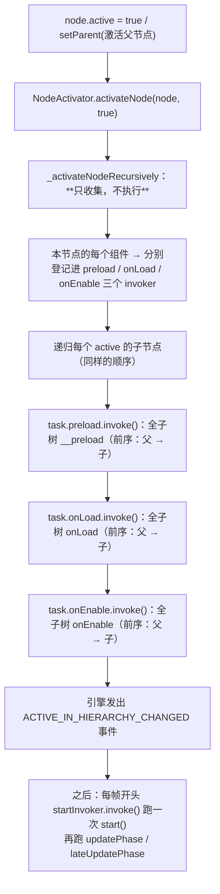
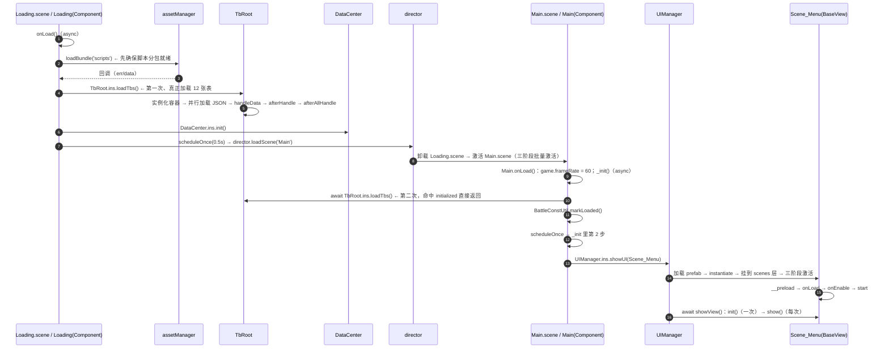
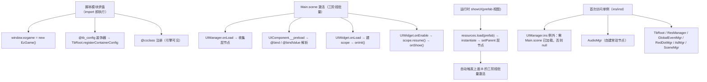
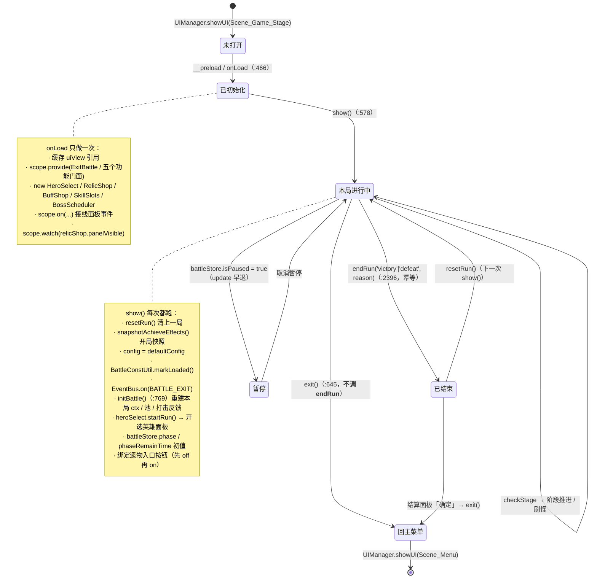
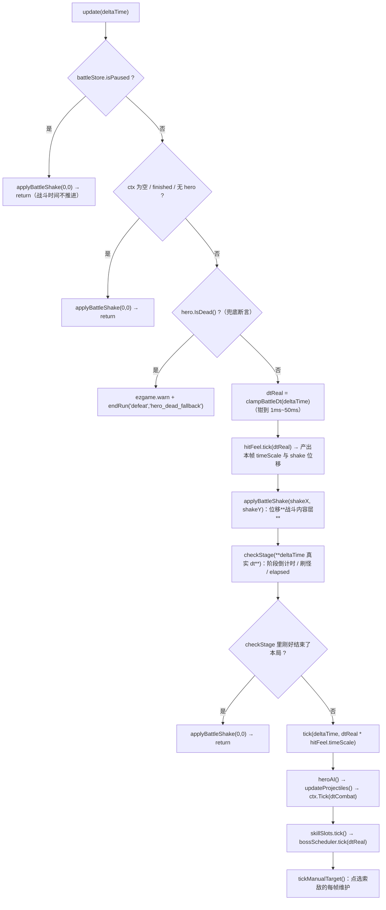

# 第 0 章 · 生命周期总纲：Cocos 3.8.6 × 平台层 × 一局对局

> 本章是全系列的地基。后面每一章的「§5 生命周期与流程图」「§6 与 Cocos 生命周期的关系」都回到这里。
> 事实来源：引擎源码 `C:\ProgramData\cocos\editors\Creator\3.8.6\resources\resources\3d\engine\cocos\`（本章标注了具体文件与行号）、工程源码 `assets/scripts/`。

---

## 1. 本章要回答的 5 个问题

| 问题 | 看哪节 |
|---|---|
| 一个节点被激活时，`__preload` / `onLoad` / `onEnable` / `start` 到底按什么顺序跑？ | §2 |
| 我用 `node.active = false` / `destroy()` 时，子节点和父组件谁先谁后？ | §2.3 |
| 游戏从 `Loading.scene` 到主菜单，谁在什么时候把什么准备好？ | §4 |
| 平台层的每个模块，是"挂在节点上被引擎驱动"还是"纯 TS 被手动调用"？什么时候创建、什么时候销毁？ | §5（**总表**） |
| 一局对局（选英雄 → 战斗 → 结算 → 换局）的生命周期边界在哪？ | §7 |

---

## 2. 引擎侧：节点与组件的生命周期

### 2.1 激活是"三阶段批量调用"，不是"一个节点走完一生再走下一个"

这是最容易搞错的一点。引擎源码 `scene-graph/node-activator.ts:158-171`：

```ts
// activateNode(node, true) 的真实实现（省略无关行）
this._activateNodeRecursively(node, task.preload, task.onLoad, task.onEnable);
task.preload.invoke();     // ← 阶段 1：整棵子树的所有 __preload
task.onLoad.invoke();      // ← 阶段 2：整棵子树的所有 onLoad
task.onEnable.invoke();    // ← 阶段 3：整棵子树的所有 onEnable
```

而 `_activateNodeRecursively`（同文件 `:249-286`）的顺序是**先收集本节点的组件，再递归子节点**：



由此得到四条硬结论（写代码时真的会踩）：

1. **所有节点的 `__preload` 都早于任何节点的 `onLoad`**。
2. **父组件的 `onLoad` 早于子组件的 `onLoad`**（同一阶段内是前序）。
   → 所以「父在 `onLoad` 里 `provide`，子在 `onInit`/`onLoad` 里 `inject`」是**成立的**；反过来（父在 `show()` 里 provide）就晚了。详见 `docs/UI框架使用说明.md` §5.1 与 §7。
3. **`onEnable` 也晚于整棵子树的 `onLoad`** —— 父的 `onEnable` 不会插在子的 `onLoad` 中间。
4. `start()` 由 `component-scheduler.ts:474-478`（注释 `// Start of this frame`）在**每帧开头**批量调用，位置在 `updatePhase()`（`:503`）**之前**；每个组件一辈子只跑一次。

### 2.2 组件的回调顺序与"能不能在这里做什么"

| 回调 | 触发时机 | 触发次数 | 此时什么已经就绪 | 常见误用 |
|---|---|---|---|---|
| `__preload` | 激活收集阶段的第一次调用 | 1 次 | 节点树已组装、`@property` 已反序列化 | 在这里访问子节点以外的场景对象 |
| `onLoad` | 整棵子树组装完成后 | 1 次 | 子节点存在、同级组件的 `__preload` 已完成 | —— 这里是**建立引用/注册**的推荐位置 |
| `onEnable` | 紧随 `onLoad` | **每次**激活 | 同上 | 把"只做一次"的初始化写这里（会被重复执行） |
| `start` | 首次 `update` 前（同一帧开头） | 1 次 | 所有节点的 `onLoad`/`onEnable` 都跑完了 | 依赖"比别人早"的逻辑 |
| `update(dt)` | 每帧 | 每帧 | —— | 忘了 `active=false`/`enabled=false` 时不会被调用 |
| `lateUpdate(dt)` | 每帧、在所有人 `update` 之后 | 每帧 | —— | —— |
| `onDisable` | 节点被反激活 / 组件被禁用 | **每次** | 组件仍活着，节点仍在树上 | 在这里销毁自己的子节点 |
| `onDestroy` | 节点真正销毁 | 1 次 | **在销毁队列里，别碰别的组件**（见铁律 4） | 在这里访问别的组件导致异常堵死销毁队列 |

**`update` 的驱动条件**（三者同时满足）：节点在层级中处于激活态（`activeInHierarchy`）、组件 `enabled === true`、`director` 未暂停。
所以「暂停战斗」有两种完全不同的做法：改 `isPaused` 让 `update` 早退（本项目做法，见 §9），或者把节点 `active=false`（会连带触发 `onDisable`，UI 的 `scope` 会 `pause()`）。

### 2.3 反激活与销毁的顺序**恰好相反**

| 操作 | 顺序 | 引擎证据 |
|---|---|---|
| `node.active = false` | **父组件先 `onDisable`，再递归子节点** | `node-activator.ts:288-323`（先 `disableComp` 本节点组件，第 300-311 行；再递归 children，第 312-323 行） |
| `node.destroy()` | **子节点先销毁，父组件后销毁** | `node.ts:1493-1544` 的 `_onPreDestroyBase`：先 `children[i]._destroyImmediate()`（第 1536 行），再 `comps[i]._destroyImmediate()`（第 1544 行） |

这条差异直接决定了 UI 层的一条语义：**关闭视图时父视图的 `close()` 早于子组件的 `onHide()`；而销毁时子组件先走**。
（源码见 `docs/UI框架使用说明.md` §4.3 的两条 ⚠️ 顺序细节；本项目框架钩子与原生回调的对应表也在那一节。）

---

## 3. 引擎侧：场景与全局

| 主题 | 事实 | 证据 |
|---|---|---|
| 切场景 | `director.loadScene()` 会卸载旧场景（旧场景节点树销毁 → 旧场景脚本 `onDestroy`）→ 激活新场景（三阶段批量激活） | 引擎 `director.ts`；工程里的实际调用是 `Loading.ts:16` |
| 预加载 | `director.preloadScene(name, onProgress, onLoaded)` 只加载不切换 —— `SceneMgr.enterScene` 就是用它在切换前拿进度（第 9 章 §5.1） | `SceneMgr.ts:69` |
| 主循环帧率 | 本项目在 `Main.onLoad()` 里设 `game.frameRate = 60`，理由是"浏览器/高刷屏不限帧会让空转吃满 CPU" | `Main.ts:18-20` |
| 引擎缓存的资源 | `resources.load` 出来的资源由 `assetManager` 持有，**换场景不会自动释放**；本项目配表（JSON）与音效因此跨场景常驻 | 第 8 章 §6、第 10 章 §6 |
| 常驻节点 | `director.addPersistRootNode(node)` 让节点跨场景存活 —— 本项目 `AudioMgr` 用它（自建节点 + 挂三路 `AudioSource`） | 第 11 章 §6 |

---

## 4. 应用启动时序（从首场景到主菜单）



**两条必须记住的启动期约束**：

1. **`UIManager.ins` 在 `UIManager` 组件 `onLoad` 之前访问会返回 `null` 并打错误日志** —— 所以任何 UI 调用都必须发生在 `Main.scene` 加载之后（`docs/UI框架使用说明.md` §3、§6.1）。
2. **配表容器必须在第一次 `loadTbs()` 之前完成注册**，靠 `Loading.ts` 先 `loadBundle('scripts')` + `Main.ts`/`configs` 的**副作用导入**两道保险；而 `loadTbs()` 是**一次性的**（第二次直接返回，不会补加载晚注册的容器）—— 第 10 章 §5.2 有完整推演。

---

## 5. 平台层模块 ↔ 生命周期总表（**本章最重要的交付物**）

### 5.1 分两类：`extends Component` 的 vs 纯 TS 的

以下 `class X extends Y` 全部按源码原文核对（grep 全 `platform/` 的类声明）：

| 模块 | 类声明（源码原文） | 需要挂节点吗 | 谁创建 / 谁驱动 | 什么时候销毁 |
|---|---|---|---|---|
| UI 管理器 | `UIManager extends Component` | ✅ 挂在 `Main.scene` 的 `Canvas` 上 | 编辑器预置；`onLoad` 里注册六个层节点并 `schedule(cleanupExpiredCache, 10)`（每 10s 清一次过期缓存），`UIManager.ts:87-93` | 随 `Main.scene` 销毁 |
| 视图基类 | `BaseView extends UIComponent` | — | 由 `UIManager` 运行时实例化（或编辑器预置） | `UIManager.closeUI(..., {destroy:true})` / 缓存过期（默认 60s） |
| 组件基类 | `UIComponent extends Component` | — | —— | 引擎 |
| 内嵌组件 | `UIWidget extends UIComponent` | ✅ 挂在预制件里的节点 | 编辑器预置（在预制件里） | 随宿主预制件 |
| 页签 | `Tabs extends UIWidget` / `TabItem extends UIWidget` | ✅ | 编辑器预置 | 随宿主 |
| 提示 | `Tips extends Component` | ✅ | 编辑器预置 | 随宿主 |
| 音频 | `AudioMgr extends Component` | ✅（但**节点由它自己 new 出来**） | 首次访问 `AudioMgr.ins` 时自建节点 + `director.addPersistRootNode` | **永不销毁**（常驻节点） |
| 定时器 | `TimeMgr extends Component` | ✅ 必须手动挂 | `onLoad` 里 `_ins = this` 并起一个每秒循环 | 随节点；未接线 |
| 新手引导 | `GuideManager extends Component` | ✅ 必须手动挂 | `onLoad` 里建遮罩/提示并把 `node.active = false` | 随节点；未接线 |
| 屏幕适配 | `ScreenAdapter extends Component` | ✅ | 只在 `start()` 跑一次 | 随节点；未接线 |
| 事件总线 | `BaseEventMgr` / `GlobalEventMgr extends BaseEventMgr` | ❌ **纯 TS** | 首次访问 `ins` 惰性 `new` | **永不销毁**（无 dispose，只有 `removeAll()`） |
| 配表 | `TbRoot` / `TbContainer` | ❌ 纯 TS | `TbRoot.ins` 惰性 `new`；`loadTbs()` 手动调 | 永不销毁（跨场景常驻） |
| 资源 | `ResManager` | ❌ 纯 TS 单例 | `ResManager.inst` | 永不销毁（资源引用计数由它管） |
| 分包 | `BundleManager` | ❌ 纯 TS | 按需 | 永不销毁 |
| 状态机 | `StateMachine<T>` / `HierarchicalStateMachine<T>` | ❌ 纯 TS | `new StateMachine(context)`，**每帧要自己调 `update(dt)`** | 需自己 `setEnabled(false)`/`reset()` 收尾；未接线 |
| 行为树 | `BTNode` 家族 / `BehaviorTree` / `BTLoader` | ❌ 纯 TS | 手动构建 + 手动 tick | 手动；未接线 |
| 状态管理 | `StoreInstance`（`store/Store.ts`） | ❌ 纯 TS | `defineStore` 注册 + 首次 `useXxxStore()` 创建 | 永不销毁 |
| 响应式 | `reactive`/`ref`/`watch`/`EffectScope` | ❌ 纯 TS | 手动 | `scope.stop()` 生效；UI 侧由 `UIComponent.onDestroy` 代管 |
| 对象池 | `ObjPool<T>` | ❌ 纯 TS | 手动 `new` | 手动 `clearPool()`；未接线 |
| 红点 | `RedDotMgr` / `RedDotNode` | ❌ 纯 TS | `ins` 惰性 | `removeNode(path)`；未接线 |
| 场景 | `SceneMgr` | ❌ 纯 TS（带 `@ccclass` 但不是 Component） | `ins` 惰性 | 永不销毁；未接线 |
| 广告 | `AdMgr` | ❌ 纯 TS | `inst` 惰性 + `setProvider` 注入 | 永不销毁；**未接真 SDK** |
| 日志 | `LogMgr` | ❌ 纯 TS 静态类 | 静态字段 | 永不销毁 |
| 全局门面 | `EzGame` + `window.ezgame = new EzGame()` | ❌ 纯 TS | **模块求值那一刻**（import 即建） | 永不销毁 |
| 数据（局外） | `GameDataMgr`（**空壳，勿用**） | ❌ 纯 TS | —— | —— |

### 5.2 一张图记住"谁在什么时机被创建"



---

## 6. UI 侧生命周期（速查 + 指针）

完整版在 `docs/UI框架使用说明.md` §4/§5（那里有 944 行的细节与 4 张时序图），这里只留**一张对照表**和三条最容易忘的规则：

| 原生回调 | `BaseView` | `UIWidget` | `this.scope` |
|---|---|---|---|
| `__preload` | （可用） | ❌ 禁止重写 | 尚未创建 |
| `onLoad` | （可用，**provide 推荐放这**） | `onInit()` | **创建** |
| `onEnable` | — | `onShow()` | `resume()`（**先 resume 再 onShow**） |
| `onDisable` | — | `onHide()` | `pause()`（**先 onHide 再 pause**） |
| `onDestroy` | （**必须 `super.onDestroy()`**） | `onDispose()` | `dispose()` |
| `showView()` | `init()`（一辈子一次）→ `show()`（每次） | — | `resume()` 在 `show()` **之前** |
| `closeView()` | `close()` → `node.active = false` | 子节点 `onDisable` → `onHide()` | `pause()` 在 `close()` 之后 |

三条规则：
1. **"一辈子一次"写 `init()/onInit()`，"每次打开都要做"写 `show()/onShow()`**（缓存复用时 `init` 不会再跑）。
2. **`provide` 放 `onLoad`（或 `__preload`），不要放 `show()`**（子组件的 `onInit` 早于父的 `show()`）。
3. **`onDestroy` 里绝不做跨组件操作**（铁律 4）。

---

## 7. 一局对局的生命周期（局内功能边界）

`Scene_Game_Stage` 既是 BaseView 也是这套流程的唯一宿主。所有关键节点的源码位置都在 `assets/scripts/game/ui/scenes/scene_game_stage/Scene_Game_Stage.ts`。



四条口径（都很容易记反）：

| 边界 | 规矩 |
|---|---|
| `show()` vs `onLoad()` | 前者是"每一局"，后者是"一辈子" —— 功能类只在 `onLoad` 创建一次，**但依赖全部用"延迟取"的闭包注入**（因为背包/商店随一局创建，见 `:477-478` 的注释） |
| 结束收口 | **`endRun(result, reason)` 是唯一收口**，且幂等（`if (this.finished) return`，`:2397`）；它负责解锁难度、上报任务/成就、`isGameOver = true`、`EventBus.emit(BATTLE_ENDED)`、弹结算面板 |
| 中途退出 | `exit()` **不算一局**（不调 `endRun`）—— 所以「完成 N 局」类任务不会把中途退出算进去（`:641-643` 注释） |
| 换局 | `resetRun()` 是**全项目唯一的换局入口**，必须作废上一局的英雄实体与 `finalBoss` 引用（`:696-697` 注释），否则上一局的结算面板会立刻又弹出来 |

---

## 8. 帧循环内部顺序（`Scene_Game_Stage.update`）

这一节解释"为什么平台层的暂停/顿帧不会改坏战斗节奏"。



**双时钟铁律**（`update` 里那条 `⚠` 注释，`:1132-1134`）：

- **顿帧/慢放只缩 `ctx.Tick` 的参数（`dtCombat`）**；
- **`checkStage` / `elapsed` / 阶段倒计时 / Boss 限时一律走真实 `deltaTime`**；
- 理由：刷怪节奏按 `elapsed` 索引节拍表、成就「闪电战」也按 `elapsed` 判定 —— 用缩放后的 dt 会让难度曲线被静默改掉。

> 这也是第 11 章（音频）、打击反馈（`docs/打击反馈设计.md`）与本章的交叉点：**"表现层可以变慢，规则层不行"**。

---

## 9. 生命周期铁律清单（写完代码前扫一眼）

1. **`onLoad` 建、`onDestroy` 拆**：注册（`on/addNotice/on/scope.watch`）与注销必须成对，且写在一起。
2. **`onEnable/onDisable` 会跑很多次**：只放"显示/隐藏"逻辑，不放一次性初始化。
3. **`provide` 放 `onLoad`/`__preload`，不放 `show()`**（子组件 `onInit` 早于父 `show()`）。
4. **`onDestroy` 里绝不碰别的组件**：抛异常会堵死引擎的销毁队列 → 画面永久卡住、回不到主界面。`UIComponent`/`UIWidget` 已各自兜住，子类照办（`Scene_Game_Stage.onDestroy()` 里那段"这里不调 `hitVfx.unbind()`"的注释就是这条铁律的实例，`:669-671`）。
5. **重写 `onDestroy` 必须 `super.onDestroy()`**（`UIComponent` 靠它 `scope.dispose()` / 清绑定；`Scene_Game_Stage.ts:677` 是标准写法）。
6. **表/资源/单例跨场景常驻**：`TbRoot`、`ResManager`、`GlobalEventMgr`、store 都不随 `loadScene` 清理 —— 别指望换场景"重置一切"。
7. **表现层可以吃顿帧，规则层不行**（§8 的双时钟）。
8. **"每一局"与"一辈子"要分清**：`show()`/`resetRun()` 是一局；`onLoad`/`init` 是一辈子（§7）。
9. **平台层多数模块是"手动挡"**：纯 TS 单例（事件总线、状态机、行为树、对象池、红点、场景管理）没有自动清理，用之前先确认**谁在什么时候销毁它们**（§5.1 表最后一列）。
10. **未接线的能力不要当"已在用"**：`TimeMgr` / `GuideManager` / `RedDotMgr` / `SceneMgr` / `ScreenAdapter` / `ObjPool` / `StateMachine` / 行为树 在当前工程里**没有任何调用方** —— 每章 §1/§2 都有 grep 证据。

---

## 10. 事实依据

**引擎源码**（`C:\ProgramData\cocos\editors\Creator\3.8.6\resources\resources\3d\engine\cocos\`）

1. `scene-graph/node-activator.ts:158-171` — `activateNode` 的三阶段 `invoke()`（preload → onLoad → onEnable）。
2. `scene-graph/node-activator.ts:249-286` — `_activateNodeRecursively`：先收本节点组件，再递归子节点（前序）。
3. `scene-graph/node-activator.ts:288-323` — `_deactivateNodeRecursively`：先禁用本节点组件，再递归子节点。
4. `scene-graph/node.ts:1493-1544` — `_onPreDestroyBase`：先销毁 children（1536），再销毁 components（1544）。
5. `scene-graph/component-scheduler.ts:474-478` — 每帧开头 `startInvoker.invoke()`；`:503` `updatePhase`；`:512` `lateUpdatePhase`。
6. `scene-graph/node-activator.ts:102-104` — `preload` 用 `UnsortedInvoker`，`onLoad`/`onEnable` 用 `OneOffInvoker`（一次性）。
7. `bin/.declarations/cc.d.ts:25660-25699` — `schedule` / `scheduleOnce` / `unschedule` 的官方语义。
8. `bin/.declarations/cc.d.ts:62773-62864` — `IEventified` 的 `on/once/off/emit` 语义（回调去重、`off` 的匹配规则、`emit` 返回 `void`）。

**工程源码**（`assets/scripts/`）

9. `game/scene/Loading.ts:10-34` — 首场景：`loadBundle('scripts')` → `TbRoot.loadTbs()` → `DataCenter.init()` → `director.loadScene('Main')`。
10. `game/scene/Main.ts:18-33` — `game.frameRate = 60`；`await TbRoot.ins.loadTbs()`；`BattleConstUtil.markLoaded()`；`showUI(Scene_Menu)`。
11. `platform/ui/UIManager.ts:35` — `UIManager extends Component`。
12. `platform/audio/AudioMgr.ts:7,11-36` — `AudioMgr extends Component` + 自建节点 + `addPersistRootNode`。
13. `platform/time/TimeMgr.ts:12,25-34` — `TimeMgr extends Component`，`onLoad` 里 `_ins = this` 并起每秒循环。
14. `platform/guide/GuideMgr.ts:37,50-57` — `GuideManager extends Component`，`onLoad` 建遮罩后把 `node.active = false`。
15. `platform/scene/SceneMgr.ts:6-7` — 带 `@ccclass` 但**不是** Component（`class SceneMgr`）。
16. `platform/event/GlobalEventMgr.ts:3-10` / `BaseEventMgr.ts:3` — 纯 TS 事件总线。
17. `platform/excel_table/TbRoot.ts:11-25` / `platform/resources/ResMgr.ts:25` / `platform/pool/ObjPool.ts:5` / `platform/red/RedDotMgr.ts:55` — 纯 TS 单例/容器。
18. `platform/fsm/fsm_core.ts:20` — `StateMachine<T>` 纯 TS，`update` 需外部调用（`:121-134`）。
19. `game/ui/scenes/scene_game_stage/Scene_Game_Stage.ts:466-576` — `onLoad`：provide 五个门面 + `scope.on` 接线 + `scope.watch`。
20. 同上 `:578-606` — `show()`：`resetRun` → `initBattle` → `heroSelect.startRun()` → 按钮重绑。
21. 同上 `:625-631` — `close()`：`EventBus.off` + `offNodeEvent` 成对摘除。
22. 同上 `:645-663` — `exit()`：打击反馈退订 + 池卸载 + `showUI(Scene_Menu)`，**不调 `endRun`**。
23. 同上 `:665-678` — `onDestroy()`：只断引用、不碰画布，最后 `super.onDestroy()`。
24. 同上 `:684-697` — `resetRun()`：换局唯一入口，作废上一局英雄实体。
25. 同上 `:1104-1148` — `update` 的顺序与双时钟注释。
26. 同上 `:1263-1291` — `tick(dtReal, dtCombat)` 的内部顺序。
27. 同上 `:2396-2425` — `endRun` 幂等收口。
