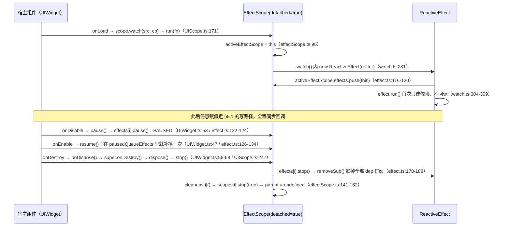

# 响应式系统（reactivity）

> 源码：`assets/scripts/platform/reactivity/` ｜ 平台层教程第 1 章

---

## 1. 一句话说明 / 什么时候用

**一句话**：这是从 `@vue/reactivity` 3.5 移植/裁剪出来的**纯 TypeScript** 响应式内核（16 个文件、**零 `cc` 依赖**，全目录 grep 不到 `from 'cc'`），只做三件事 —— **读时收集依赖**（`track`）、**写时通知订阅者**（`trigger`）、**把通知派发到 effect/watch/computed**。它没有自己的"帧"，全靠**赋值语句同步驱动**。

**什么时候用它 / 不用它**

| 场景 | 用什么 | 项目里的现成例子 |
|---|---|---|
| 单个值要跨模块/跨 UI 共享 | `ref()` | 战斗功能类 `RelicShop.slots` / `BossScheduler.slots`（`game/battle/RelicShop.ts:165`、`game/battle/BossScheduler.ts:127`） |
| 一整块结构化的**状态对象**（要自动落盘） | `reactive()` | `DataModule._data`（`game/data/DataModule.ts:138`）、`Store.$state`（`platform/store/Store.ts:149`） |
| UI 组件跟着数据刷新 | `this.scope.watch(...)` | `game/ui/scenes/scene_game_stage/cmps/View_Game_Stage.ts:267` |
| 派生值（缓存 + 懒计算） | `computed()` | store 的 getters（`platform/store/Store.ts:424`） |
| 战斗内**每帧**跑的逻辑（移动/索敌/伤害） | ❌ 不要用响应式 | 直接 `tick(dt)` 读写普通字段（`HitFeelDirector` 等纯 TS 类） |

判据很简单：**"值变了要通知别人"用响应式；"每帧都要算"用 tick。** 用 watch 驱动每帧逻辑会得到"回调同步执行 + 逐条重算"的双重开销，而且没有任何"帧"概念可依赖（见 §6）。

---

## 2. 源码地图

| 文件 | 职责 | 关键导出 |
|---|---|---|
| `index.ts` | **唯一出口**：全模块 97 行的 barrel，只有这里导出的东西外部才拿得到 | 见下方 API 表；未列出的（如 `Dep`/`targetMap`/`globalVersion`/`batch`）**外部不可达** |
| `reactive.ts` | `reactive`/`readonly` 及其 shallow 版；代理缓存表；类型判定与逃生舱 | `reactive` `shallowReactive` `readonly` `shallowReadonly` `isReactive` `isReadonly` `isShallow` `isProxy` `toRaw` `markRaw` `toReactive` `toReadonly` |
| `ref.ts` | `.value` 容器：`RefImpl`、`shallowRef`、`triggerRef`、ref↔对象的桥（`toRef`/`toRefs`）与解包工具 | `ref` `shallowRef` `isRef` `unref` `toValue` `toRef` `toRefs` `proxyRefs` `customRef` `triggerRef` |
| `computed.ts` | 派生值：`ComputedRefImpl` 自己就是一个 `Subscriber`，**懒求值** | `computed` `ComputedRefImpl` |
| `watch.ts` | `watch`（有 cb = 侦听器；无 cb = watchEffect 语义）、`traverse`、cleanup | `watch` `traverse` `getCurrentWatcher` `onWatcherCleanup` `WatchErrorCodes` |
| `effect.ts` | 订阅者基类 `ReactiveEffect`、`effect()` 运行器、批处理、追踪开关 | `effect` `stop` `ReactiveEffect` `EffectFlags` `enableTracking` `pauseTracking` `resetTracking` `onEffectCleanup` |
| `effectScope.ts` | 作用域：把一批 effect 打包，一次 `stop`/`pause`/`resume` | `effectScope` `EffectScope` `getCurrentScope` `onScopeDispose` |
| `dep.ts` | 依赖图本体：`Dep`、`Link`（双链表）、`track`、`trigger`、`targetMap`、全局版本号 | `track` `trigger` `ITERATE_KEY` `ARRAY_ITERATE_KEY` `MAP_KEY_ITERATE_KEY`（`Dep`/`targetMap` 定义了但**未从 index 导出**） |
| `baseHandlers.ts` | `Object`/`Array` 的 Proxy 陷阱：get/set/deleteProperty/has/ownKeys | `mutableHandlers` `readonlyHandlers` `shallowReactiveHandlers` `shallowReadonlyHandlers` |
| `collectionHandlers.ts` | `Map`/`Set`/`WeakMap`/`WeakSet` 的方法插桩 | `mutableCollectionHandlers` 等 4 个 |
| `arrayInstrumentations.ts` | 数组方法插桩：哪些要追 `ARRAY_ITERATE_KEY`、哪些要暂停追踪 | `arrayInstrumentations` `reactiveReadArray` `shallowReadArray` |
| `constants.ts` | 三个字符串枚举（便于调试器里读） | `TrackOpTypes` `TriggerOpTypes` `ReactiveFlags` |
| `warning.ts` | 3 行 `warn()`，前缀 `[Vue warn]` | `warn`（**实际调用点只剩死代码**，见 §8-11） |
| `shared/general.ts` | 类型判定与工具：`hasChanged`（`Object.is`）、`isIntegerKey`、`hasOwn`、`isMap/isSet`、`remove`、`def`、`toRawType`… | `hasChanged` `isArray` `isIntegerKey` `isObject` `isPlainObject` `isFunction` `isSymbol` `remove` `def` `toRawType` `makeMap` |
| `shared/makeMap.ts` | 逗号串 → 查表函数 | `makeMap` |
| `shared/typeUtils.ts` | 纯类型工具 | `IfAny` `Prettify` `LooseRequired` |

---

## 3. 快速上手

真实 import 路径有两种，项目里都在用（相对路径是按文件位置算的）：

```ts
// ① 相对路径（推荐，AGENTS.md 的约定）
import { ref, watch, effectScope } from '../../platform/reactivity';
// ② Cocos 的 db:// URL 写法（Scene_Menu.ts:10 就是这么写的）
import { ref } from 'db://assets/scripts/platform/reactivity';
```

最小可编译示例（**UI 组件内**，用项目约定的 `this.scope` 接线）：

```ts
import { _decorator, Label } from 'cc';
import { ref } from '../../platform/reactivity';
import { UIWidget } from '../../platform/ui/UIWidget';
const { ccclass, property } = _decorator;
@ccclass('DemoCounter')
export class DemoCounter extends UIWidget {          // ← 继承平台基类，自带 this.scope
    @property(Label) label: Label = null;
    private count = ref(0);                          // 真源：ref 可跨组件共享
    protected onInit(): void {                       // = onLoad 时机，只跑一次
        this.refresh();
        this.scope.watch(() => this.count.value, () => this.refresh());
    }
    private refresh(): void { this.label.string = `${this.count.value}`; }
    public add(): void { this.count.value++; }       // 赋值 → 回调**同步**执行
}
```

要点：**watch 建立时不会立刻回调**（`watch.ts:304-309`：默认只跑一次 getter 收集依赖），所以 `onInit` 里必须先手动刷一次。**不要**在子类里重写 `onLoad`/`onDestroy`（会盖掉基类的 scope 生命周期，`platform/ui/UIWidget.ts:31-33`）。

---

## 4. API 速查

### 4.1 你点名要的 14 个（**全部以 `index.ts` 真实导出为准**）

| 签名 | 参数 | 返回 | 备注 / 坑 |
|---|---|---|---|
| `reactive<T extends object>(target: T): Reactive<T>`<br>`reactive.ts:91-104` | `target` 原始对象 | 代理（**同 target 复用同一个代理**，`reactive.ts:282-291`） | 只接受 `Object/Array/Map/Set/WeakMap/WeakSet` 且必须 `Object.isExtensible`（`reactive.ts:43-62`）；`Date`、`cc.Node`、冻结对象**静默原样返回**。已是代理则原样返回（`reactive.ts:270-275`） |
| `ref<T>(value?: T): Ref<UnwrapRef<T>>`<br>`ref.ts:55-61, 98-103` | `value` 任意 | `Ref`（`.value` 读写） | 传进去的已经是 ref 就**原样返回**；`ref({})` 会把对象**深代理**（`ref.ts:119`）。`_rawValue` 存 `toRaw`，`set` 用 `hasChanged`（`Object.is`）判重 → **赋同值不触发**、**赋 NaN 不触发**（`ref.ts:118-140`、`shared/general.ts:144-145`） |
| `shallowRef<T>(value?: T): ShallowRef<T>`<br>`ref.ts:86-96` | 同上 | `Ref` | 只跟 `.value` 的**引用替换**：`useDirectValue` 分支下 `_value` 就是原对象本身，内部改动完全不经代理（`ref.ts:130-137`）。要触发只能换 `.value` 或 `triggerRef` |
| `triggerRef(ref: Ref): void`<br>`ref.ts:168-173` | 任意 ref | `void` | **只看 `ref.dep` 是否存在**（`ref.ts:170`）。`ref`/`shallowRef`/`customRef`/`toRef(obj,'k')` 都有 dep；`toRef(() => x)` 得到的 `GetterRefImpl` **没有 dep**（`ref.ts:344-353`）→ 对它调 `triggerRef` 是**空操作** |
| `computed<T>(getter, debugOptions?)` / `computed({get,set}, debugOptions?)`<br>`computed.ts:179-207` | 第 2 参 `debugOptions` **传了也没用**（`computed.ts:204` 注释：dev debugging 已删） | `ComputedRef` / `WritableComputedRef` | **懒求值**（初值 `flags = DIRTY`，`computed.ts:78`，读 `.value` 才 `refreshComputed`，`computed.ts:129-137`）；无 setter 时 `isReadonly = true`（`computed.ts:110`），**赋值静默无效**（`computed.ts:139-143`，不报错也不生效） |
| `watch(source, cb?, options?): WatchHandle`<br>`watch.ts:115-321` | `source`：ref / 计算属性 / getter / **reactive 对象** / 上面几种的数组；`cb` 省略即 watchEffect 语义；`options` 见 §4.3 | `WatchHandle`（本身是 stop 函数，另带 `pause`/`resume`/`stop`，`watch.ts:71-75, 316-320`） | 默认 **`immediate: false`**（不回调，只收集依赖）、**同步执行**（无 `flush` 选项）、`watch(reactiveObj)` **自动深度遍历且不看新旧值**（见 §8-3/8-4/8-5） |
| `watchEffect` | — | — | **未实现 / 无导出**。全模块只在类型别名 `WatchEffect`（`watch.ts:37`）和注释里出现过；真实实现是 `watch(sourceFn)`（**不传 cb**）：`watch.ts:169-196, 271-274, 313` |
| `effect<T>(fn, options?): ReactiveEffectRunner<T>`<br>`effect.ts:470-491` | `options`: `scheduler` / `allowRecurse` / `onStop`（`effect.ts:28-32`） | `runner`（一个函数，带 `.effect`） | **构造即执行一次**（`effect.ts:482-484`）；fn 抛错会自动 `stop()` 再 rethrow（`effect.ts:485-487`）；无 scheduler 时写操作**同步**重跑（`effect.ts:190-198`） |
| `effectScope(detached?: boolean): EffectScope`<br>`effectScope.ts:176-178` | `detached` 默认 `false` | `EffectScope`（`run`/`pause`/`resume`/`stop`/`on`/`off` + `active`/`effects`/`cleanups`） | 只有在 `scope.run(fn)` 内部新建的 **`ReactiveEffect`** 才会被收进 `scope.effects`（`effect.ts:116-120`）→ **`computed` 不进 scope** |
| `getCurrentScope(): EffectScope \| undefined`<br>`effectScope.ts:185-187` | — | 当前活动作用域 | `watch` 内部就是用它把 effect 挂到宿主 scope 的（`watch.ts:208-214`） |
| `onScopeDispose(fn, failSilently = false)`<br>`effectScope.ts:196-201` | `fn` 回调；`failSilently` 默认 `false` | `void` | 没有当前 scope 时**静默什么都不做**（`effectScope.ts:197-200`，警告代码已删） |
| `toRaw<T>(observed: T): T`<br>`reactive.ts:372-375` | 任意 | 原始对象（**递归剥到最内层**） | `toRaw(proxy) === 原对象`；在 watch getter 里读 raw 对象会**丢掉整条追踪**（`watch.ts:202-206` + `reactive.ts:372`，见 §8-9） |
| `isRef(r): r is Ref`<br>`ref.ts:43-46` | 任意 | `boolean` | 只看 `__v_isRef === true`，**不看是不是本模块造的** |
| `unref<T>(ref: MaybeRef<T> \| ComputedRef<T>): T`<br>`ref.ts:199-201` | ref 或普通值 | 拆包后的值 | 就是 `isRef(x) ? x.value : x`；`toValue` 是它的加强版（额外把 **getter 调用掉**，`ref.ts:219-221`） |

### 4.2 澄清：这些"你以为没有"的其实有 / 真的没有

| 名字 | 状态 | 依据 |
|---|---|---|
| `toRefs` / `toRef` | ✅ **有导出** | `index.ts:5,7`；`ref.ts:312-318`（`toRefs` 用 `for...in` + `ObjectRefImpl`），`ref.ts:400-441` |
| `readonly` / `shallowReactive` / `shallowReadonly` / `markRaw` | ✅ 有 | `index.ts:25,30,31,32` |
| `isReactive` / `isReadonly` / `isShallow` / `isProxy` / `toReactive` / `toReadonly` | ✅ 有 | `index.ts:26-35` |
| `customRef` / `proxyRefs` / `toValue` | ✅ 有 | `index.ts:5,6,9,10` |
| `track` / `trigger` / `ITERATE_KEY` / `ARRAY_ITERATE_KEY` / `MAP_KEY_ITERATE_KEY` | ✅ 有（底层） | `index.ts:68-74` |
| `reactiveReadArray` / `shallowReadArray` | ✅ 有 | `index.ts:81`；`arrayInstrumentations.ts:12-25` |
| `getCurrentWatcher` / `traverse` / `onWatcherCleanup` / `WatchErrorCodes` | ✅ 有 | `index.ts:83-97` |
| `onEffectCleanup` / `stop` / `pauseTracking` / `enableTracking` / `resetTracking` / `ReactiveEffect` / `EffectFlags` | ✅ 有 | `index.ts:52-67` |
| **`nextTick`** | ❌ **无导出、无实现**（全模块 grep 不到 `queueMicrotask` / `Promise.resolve` / `nextTick`） | 需要"下一帧"就用 Cocos 的 `this.scheduleOnce(fn, 0)` |
| **`flush: 'pre' \| 'post' \| 'sync'`** | ❌ **无此选项**（`WatchOptions` 里没有 `flush`，`watch.ts:49-67`）；要用异步/合并得自己给 `scheduler` | `watch.ts:53, 283-285, 310-314` |
| **`Dep` / `Link` / `targetMap` / `globalVersion` / `batch` / `startBatch` / `endBatch` / `activeSub` / `refreshComputed` / `getDepFromReactive`** | ❌ 文件里 `export` 了，但 **`index.ts` 没转出** → 外部拿不到，**没法自己遍历订阅表来调试** | `dep.ts:19,32,67,211`、`effect.ts:39,235,249,257,360` |

### 4.3 `WatchOptions` 的默认语义（重点）

| 选项 | 签名位置 | 不传时的真实行为 |
|---|---|---|
| `immediate` | `watch.ts:50, 304-309` | **`false`**：只 `effect.run()` 一次建依赖，**不调用 cb**；cb 第一次被调用时 `oldValue === undefined`（`watch.ts:255-259`） |
| `deep` | `watch.ts:51, 131-139, 202-206` | 取决于 source：① source 是 **reactive 对象** → 不传 = `traverse(source)` **全深度**；`false`/`0` = `traverse(source, 1)` **只跟根层**；`true` = `Infinity`；数字即深度（`deep === true ? Infinity : deep`）。② source 是 **ref / getter** → 不传 = **不遍历**（只跟 getter 里真正读到的东西） |
| `once` | `watch.ts:52, 216-222` | `false`。为 `true` 时首次 cb 后自动 `watchHandle()` 停掉 |
| `scheduler` | `watch.ts:53, 283-285` | **不传 = 同步调用 job**：`effect.scheduler = job`，写操作会在赋值语句里立刻走到 cb（`dep.ts:156-177` → `effect.ts:190-198`） |
| `onWarn` | `watch.ts:54` | 只在 `warnInvalidSource` 里用，而**该函数从未被调用**（`watch.ts:122`）→ 死选项 |
| `augmentJob` / `call` | `watch.ts:55-67` | 标注 `@internal`，供上层框架（如 Store）包装 job / 统一错误处理用 |
| `onTrack` / `onTrigger` | `effect.ts:23-26`（`DebuggerOptions`） | `WatchOptions` 继承了它，但**调用点已被删**（`dep.ts:151,165,199`、`effect.ts:426` 都是 "Removed development environment code"）→ **传了也不会被调用** |

---

## 5. 生命周期与流程图

### 5.1 一次"读 → 写 → 回调"的完整链路

```mermaid
flowchart TD
  R1["读：baseHandlers.get() / RefImpl.get value()"] --> R2["track() → Dep.track()<br/>dep.ts:227 / :106"]
  R2 --> R3["new Link() → addSub()<br/>dep.ts:32 / :180"]
  W1["写：MutableReactiveHandler.set() / RefImpl.set value()"] --> W2["hasChanged() 判重（= !Object.is）<br/>general.ts:144"]
  W2 -->|变了| W3["trigger() → Dep.trigger()：version++<br/>dep.ts:251 / :156"]
  R3 -. 订阅关系（Dep.subs 双向链表，dep.ts:77） .-> W3
  W3 --> C1["Dep.notify() → startBatch()<br/>dep.ts:162 / effect.ts:249"]
  C1 --> C2["ReactiveEffect.notify() → batch() → endBatch()<br/>effect.ts:139 / :235 / :257"]
  C2 --> D1["ReactiveEffect.trigger()<br/>effect.ts:190"]
  D1 -->|有 scheduler（watch 必走这条）| D2["job() → cb(newValue, oldValue, onCleanup)<br/>watch.ts:228 / :252"]
  D1 -->|无 scheduler| D3["runIfDirty() → isDirty() → run()<br/>effect.ts:203 / :337 / :151"]
  D3 --> D4["fn()：重跑 getter，cleanupDeps() 摘掉没再用的依赖<br/>effect.ts:308"]
```

两个必须记住的结论：① **全程同步**，`endBatch` 结束就回调，没有微任务/下一帧；② `REFImpl.set` 与 `baseHandlers.set` 都先判重（`hasChanged` = `!Object.is`），**赋同值不会触发任何回调**。

### 5.2 `effectScope` 与内部 effect 的联动



---

## 6. 与 Cocos 生命周期的关系

### 6.1 reactivity 是纯 TS、**没有自己的"帧"**

- 全目录零 `cc` 依赖（`grep "from 'cc'"` 无命中），因此它**不知道 `director.tick`、也不用 `update` 去 pump**。
- 驱动它的只有**赋值语句**：`dep.trigger()` → `notify()` → `startBatch/batch/endBatch` → `ReactiveEffect.trigger()` 全在同一个调用栈里跑完（`dep.ts:156-177`、`effect.ts:190-198, 235-294`）。
- `watch` 的 flush 时机**不是** `queueMicrotask`/`Promise.then`（全模块 grep 不到），也**没有 `flush` 选项**：`effect.scheduler = scheduler ? ... : job`（`watch.ts:283-285`）→ **默认同步**。项目里唯一的"延迟"是 `DataModule` 自己在回调里加 100ms `setTimeout` 做 debounce 落盘（`game/data/DataModule.ts:143-163`）。
- 需要"下一帧再执行"时，用 Cocos 的 `scheduleOnce` 或自己给 `scheduler`，**没有 `nextTick`**。

### 6.2 组件的正确接线顺序（UI 侧已被基类兜住）

| Cocos 时机 | 平台基类做的事 | 你该写的钩子 |
|---|---|---|
| `onLoad` | `this.scope` 惰性建句柄 → `onInit()`（`platform/ui/UIWidget.ts:40-44`） | **`onInit()`**：`provide`、`scope.on`、**`scope.watch` 全放这里**。先按当前状态手动刷一次，再建 watch（watch 建立时**不回调**） |
| `onEnable` | `scope.resume()` **然后** `onShow()`（`UIWidget.ts:46-49`） | **`onShow()`**：补刷"非响应式输入"造成的差异（普通字段的赋值不会被 watch 感知，`UIWidget.ts:74-80`） |
| `onDisable` | `onHide()` **然后** `scope.pause()`（`UIWidget.ts:51-54`） | **`onHide()`**：别自己 pause |
| `onDestroy` | `onDispose()`（`try/catch` 吞异常）→ `super.onDestroy()` → `_scope?.dispose()`（`UIWidget.ts:56-68`、`platform/ui/UIComponent.ts:589-611`） | **`onDispose()`**：摘节点事件等收尾；**不要**自己 stop scope 里的 watcher |

```ts
protected onInit(): void {                       // = onLoad 时机，只跑一次
    this.refreshAll();                           // ① 先无条件刷一次
    this.scope.watch(                            // ② 再建 watch（真源 → 刷新）
        () => this.shop.slots.value,
        () => this.refreshAll(),
    );
}
protected onDispose(): void {                    // = onDestroy 时机
    this.offNodeEvent(this.btn, Node.EventType.TOUCH_END, this.onClick, this);
    // ③ 不要 stop watcher：super.onDestroy() 会统一 dispose（UIComponent.ts:597）
}
```

**纯 TS 类（没有 Cocos 生命周期）必须自己收尾**：`DataModule.dispose()` 手动调 `_stopWatch()`（`game/data/DataModule.ts:166-175`）、`StoreInstance.dispose()` 调 `_stopPersisting()`（`platform/store/Store.ts:253-262`）。自己 `effectScope()` 建的 scope 同理。

**顺序为什么重要**：scope 的 `watch` 会挂在**当前活动作用域**上（`watch.ts:208`；effect 在构造时 push，`effect.ts:116-120`）。若在 `scope.run()` 之外建 watch（或宿主已 dispose），它就不归任何 scope 管 —— `UIScope.watch` 对已销毁的 scope 直接返回 `null` 并打日志（`UIScope.ts:167-170`），这是**唯一**一处会打出来的响应式相关警告。

---

## 7. 典型组合用法

下面 7 条全部来自项目真实代码。

**① 最常用：`scope.watch(getter, 刷新函数)`** —— 状态向下、watcher 由 scope 统一回收。

```ts
this.scope.watch(() => this.battleStore.gold, () => this.refreshGold());
this.scope.watch(() => this.battleStore.killPoints, () => this.refreshKills());
// View_Game_Stage.ts:267-268
```

**② 多源合并成一个回调**：source 传**数组**（`watch.ts:154-168`），任一变化都触发（`isMultiSource` 分支逐个 `hasChanged`）。

```ts
this.scope.watch(
    [() => this.battleStore.hp, () => this.battleStore.maxHp],
    () => this.refreshHp(),
);
// View_Game_Stage.ts:263-266；同样写法见 :270-273 / :277-280 / :283-286
```

**③ `ref` 存"整块快照数组" + 指纹去重** —— 用 ref 而不是 reactive，靠**换引用**触发（`BossScheduler.publish` 只在投影真变了时才 `slots.value = rows`）。

```ts
const key = rows.map(r => `${r.key}:${r.stock}:${r.alive}`).join('|');
if (!force && key === this.lastKey) return;   // 每帧都换新数组 → watcher 每帧醒
this.lastKey = key;
this.slots.value = rows;                      // BossScheduler.ts:334-337
```

```ts
this.scope.watch(() => this.bossScheduler.slots.value, () => this.refreshBosses());
// View_Game_Stage.ts:290（注释说明了为什么只需跟数组引用）
```

**④ 功能类暴露 ref，UI 侧建 watcher**（项目主推的分层：`game/battle/` 的纯 TS 功能类只管真源，谁的节点谁写）。

```ts
// 功能类（game/battle/RelicShop.ts:165-175）
readonly slots: Ref<ShopSlotVM[]> = ref<ShopSlotVM[]>([]);
readonly panelVisible: Ref<boolean> = ref(false);
// 宿主场景（Scene_Game_Stage.ts:569）—— 遗物面板节点在本场景名下，所以这里写
this.scope.watch(() => this.relicShop.panelVisible.value, () => this.applyRelicPanelVisible());
```

**⑤ 宿主 `provide` 一个 ref，任意深度后代 `inject` + `watch`**（`Tabs` 的选中态就是这么共享的）。

```ts
this._selectedIndexRef = this.provide<Ref<number>>(TabsScopeKeys.SelectedIndex, ref(-1));
// Tabs.ts:234-235；后代：const idx = this.inject<Ref<number>>(TabsScopeKeys.SelectedIndex, null)
```

**⑥ `reactive` + `deep: true` 自动落盘**（`DataModule` 的标准姿势；注意 getter 返回**代理本身**）。

```ts
this._data = reactive(defaults) as T;                       // DataModule.ts:138
this._stopWatch = watch(
    () => this._data,                                       // ← 不要 toRaw()
    () => { if (this._loading) return; this._scheduleSave(); },
    { deep: true },                                         // DataModule.ts:144-151
);
```

**⑦ `watch(fn)` 不带 cb = watchEffect 语义**（项目里暂无使用者，但这是"只想跟着跑一遍"的正解）：`watch.ts:169-196, 271-274, 313`。

---

## 8. 注意事项与坑

**1. 解构 `reactive` 对象后，页面再也不刷新**
- 现象：`const { gold } = store.state` 之后改 `store.state.gold`，用 `gold` 的地方不动。
- 原因：依赖收集发生在 **get 陷阱**里（`baseHandlers.ts:112-114` → `track(target, GET, key)`），解构只读了一次，拿到的是**值快照**，与代理再无关系。
- 正确做法：保留对象引用；或 `toRefs(state)`（`ref.ts:312-318`，返回的每个 ref 通过 `ObjectRefImpl` 的 `dep` getter 反查 Dep，`ref.ts:339-341`）／`toRef(state, 'gold')`（`ref.ts:400-441`）。

**2. 给 `reactive` 对象"整体赋值"后，响应式全失效**
- 现象：`let s = reactive({a:1}); s = {a:2};` 之后所有依赖 `s` 的地方都不动了。
- 原因：`reactive()` 只在**建代理那一刻**做转换，且同 target 复用同一代理（`reactive.ts:257-292`）。给变量赋新对象 = 变量指向了**普通对象**，旧代理失联。`DataModule` 里那段"如果已有响应式对象，直接覆盖属性以保持引用"的注释就是这个坑（`game/data/DataModule.ts:132-139`）。
- 正确做法：`Object.assign(s, fresh)`；或把真源改成 `ref`，用 `r.value = fresh` 换引用（`ref.ts:128-140`）。**注意区分**：替换代理**内部的属性**（`s.nested = other`）是合法的，set 陷阱会触发且在读回时自动代理化（`baseHandlers.ts:126-131, 142-186`）。

**3. `watch(reactive 对象, cb)` 太敏感：任何深层改动都触发，且完全不看新旧值**
- 现象：父字段、孙子字段、甚至"看起来没变"的赋值都会进回调；`oldValue` 和 `newValue` 经常是同一个对象。
- 原因：source 是 reactive 对象时 `forceTrigger = true`（`watch.ts:151-153`），而 `deep` 不传 → `traverse(source)` **全深度**遍历（`watch.ts:131-139`）；job 里 `forceTrigger` 为真就直接进 cb，**跳过 `hasChanged` 判断**（`watch.ts:238-244`）。
- 正确做法：只关心根层就给 `{ deep: false }`（→ `traverse(source, 1)`，`watch.ts:135-136`）；只关心某几个字段就用 getter（`View_Game_Stage.ts:263-266`）；要精确就去掉对象源、改 ref/字段源。

**4. `watch(装了对象的 ref, cb)` 改内部字段不触发（与第 3 条正好相反）**
- 现象：`const r = ref({n: 0}); watch(r, cb); r.value.n++` → cb 不跑。
- 原因：ref 源的 getter 只有一行 `() => source.value`（`watch.ts:148-150`），它只订阅 **ref 自己的 dep**（`ref.ts:123-126`）；深层属性的 dep 没有任何订阅者。
- 正确做法：`{ deep: true }`（此时 `watch.ts:202-206` 会把 getter 包成 `traverse(baseGetter(), Infinity)`），或直接写 `() => r.value.n`。

**5. 以为回调"晚一拍" / 想要 `flush: 'post'`**
- 现象：想等这一帧数据都写完再刷新 DOM/Label，发现根本没法控制时机。
- 原因：**没有 `flush` 选项**（`watch.ts:49-67`），默认路径就是同步：`Dep.trigger → notify → endBatch → ReactiveEffect.trigger → scheduler()=job() → cb`（`dep.ts:156-177`、`effect.ts:190-198, 257-294`）。回调执行时，**外层那次赋值的语句还没结束**。
- 正确做法：给 `scheduler`（`watch.ts:53, 283-285`）自己决定何时跑 job，或在 cb 里做 debounce（`DataModule` 的 100ms `setTimeout`，`DataModule.ts:155-163`）；Cocos 侧也可以 `scheduleOnce`。**别找 `nextTick`，它不存在。**

**6. 写 `watch` 回调时又改了同一份数据 → 递归/重复触发**
- 现象：cb 里 `store.a = store.b + 1` 导致 cb 被反复唤醒。
- 原因：同步执行 + 每次写都真的触发（只要 `hasChanged` 为真）。`ReactiveEffect.notify` 只挡"自己正在跑时被自己通知"（`flags & RUNNING`，`effect.ts:139-149`），挡不住间接环。
- 正确做法：cb 里只读不写；确实要回写就加幂等判断（值相等则 `return`，`hasChanged` 用的就是 `Object.is`），或用 `once: true`（`watch.ts:216-222`）跑完即停。

**7. `shallowRef` 改了内部对象没反应**
- 现象：`const r = shallowRef({n:0}); r.value.n++` → 什么都不会发生。
- 原因：shallow 模式下 `_value` 存的就是原对象（`ref.ts:130-137` 的 `useDirectValue` 分支），内部改动根本不经代理。
- 正确做法：整个换 `.value`（`r.value = { ...r.value, n: 1 }`），或改完手动 `triggerRef(r)`（`ref.ts:168-173`）。**注意**：`triggerRef` 只对**带 `dep` 的 ref** 生效，`toRef(() => expr)`（`GetterRefImpl`，`ref.ts:344-353`）没有 dep，调了等于没调。

**8. 数组"改了但没触发" / "没改却触发了"**
- 现象 A：`arr.length = 0`、`arr.splice(0)`、`arr[i] = x` 都能触发（✅）。现象 B：`arr = []`（换变量）不触发；`arr.slice()`/`flat()`/`flatMap()`/`keys()` **没有被专门插桩**。
- 原因：下标/`length` 的赋值走 `MutableReactiveHandler.set`（`baseHandlers.ts:142-186`），`trigger` 里对 `key === 'length'` 有专门分支（触发所有 `>= newLength` 的键 + `length` + `ARRAY_ITERATE_KEY`，`dep.ts:282-292`），下标变更还会追 `ARRAY_ITERATE_KEY`（`dep.ts:300-302`）。`push/pop/shift/unshift/splice` 走 `noTracking`：暂时 `pauseTracking()` 以免 `length` 被追踪造成自触发，但 set 陷阱照常触发（`arrayInstrumentations.ts:317-327`）。而 `slice`/`flat`/`flatMap`/`keys` 源码里明确留了注释说"没做插桩"（`arrayInstrumentations.ts:89, 110, 159`），它们只追到实际读过的 `length`/下标。
- 正确做法：要"任何结构性变化都触发"，用被插桩的方法（`forEach/map/filter/find/some/every/reduce/entries/values/Symbol.iterator/concat/join` + `toReversed/toSorted/toSpliced`，`arrayInstrumentations.ts:30-194`），或改用 `{ deep: true }`。`includes/indexOf/lastIndexOf` 有 raw 兜底（`searchProxy`，`arrayInstrumentations.ts:296-313`），所以 `arr.includes(toRaw(item))` 也能找到。

**9. getter 里 `toRaw()` 会把整条追踪悄悄掐断** `[推断]`
- 现象：某个 `watch(...)` 的 cb **永远不执行**，也没有任何报错。
- 原因：`deep: true` 时 watch 会 `traverse(baseGetter(), depth)`（`watch.ts:202-206`），`traverse` 用普通属性读取递归（`watch.ts:323-359`）；如果 getter 返回的是 `toRaw()` 出来的**原始对象**（`reactive.ts:372-375`），递归读的全是原始对象，**一次 `track` 都不会发生** → effect 零依赖 → `isDirty` 恒 false → job 直接 return（`watch.ts:229-234`、`effect.ts:337-354`）。**项目里的 `platform/store/Store.ts:242-250` 正是 `watch(() => toRaw(this.$state), cb, { deep: true })` 这个写法**；对照组 `DataModule.ts:144-151` 用的是代理本身。

**10. `Map/Set` 的支持面与"静默"**
- 现象：`Map` 混用 raw 与 reactive 版本的对象当 key，读到的东西不符合直觉，而控制台一片安静。
- 原因：集合走 `collectionHandlers`，插桩方法只有 `get` / `size` / `has` / `forEach` / `add` / `set` / `delete` / `clear` + `keys/values/entries/[Symbol.iterator]`（`collectionHandlers.ts:94-247`）；插桩**只在 `hasOwn(instrumentations, key) && key in target` 时生效**（`collectionHandlers.ts:265-271`）。专门用来警告"raw/reactive 混用当 key"的 `checkIdentityKeys` **定义了却从未被调用**（`collectionHandlers.ts:292-308`）。`WeakMap/WeakSet` 虽然被归进 COLLECTION（`reactive.ts:48-52`），但 `size` getter 读的是 `target.size`（`collectionHandlers.ts:119-123`）→ 对 WeakMap 是 `undefined`，也没有迭代语义。
- 正确做法：集合里**只放一种形态**的 key（统一放 reactive 版本，或干脆 `markRaw` 掉当 key 的对象，`reactive.ts:401-406`）。

**11. 出错是静默的：整模块的开发期警告已被删干净**
- 现象：写错了没有任何提示 —— 给只读 computed 赋值、`reactive(cc.Node)`、`toRefs` 用错、`watch` 传了非法 source，全都无声无息。
- 原因：唯一的 `console.warn` 在 `warning.ts:2`，而它的**唯一调用点**在从未被调用的 `checkIdentityKeys` 里（`collectionHandlers.ts:300`）；`watch.ts:122` 的 `warnInvalidSource` 同样从未被调用；各处分支都留了"移除了开发环境的警告代码"（`baseHandlers.ts:225,230`、`reactive.ts:265`、`effect.ts:170,548`、`effectScope.ts:102,200`、`collectionHandlers.ts:79`、`watch.ts:166,199,301`）。`onTrack`/`onTrigger` 类型还在，但调用点被替换成了 "Removed development environment code"（`dep.ts:103,151,165,199`、`effect.ts:426`）。
- 正确做法：别指望警告，用 §9 的 `isRef/isReactive/toRaw` 判型 + 断点自证。另外 `readonly` 代理的写入是**静默 `return true`**（`baseHandlers.ts:224-232`），无 setter 的 `computed` 赋值也是**静默忽略**（`computed.ts:139-143`）。

**12. `effectScope` 忘了 `stop()` → 依赖链永久持有回调闭包**
- 现象：面板销毁后，改数据仍然会走到已经该消失的回调（若回调里还抓着 Cocos 节点，就是"访问已销毁节点"的间歇性报错 + 内存泄漏）。
- 原因：scope 只是**登记簿** —— `ReactiveEffect` 在构造时把自己 push 进当前 scope（`effect.ts:116-120`），真正的解绑发生在 `scope.stop()` → `effects[i].stop()` → `removeSub()` 摘掉 dep 订阅（`effectScope.ts:132-164`、`effect.ts:178-188`）。不 stop，`Dep.subs` 双向链表就还挂着这个 effect，它又强引用着 cb 闭包。
- 正确做法：UI 侧交给 `UIComponent.onDestroy` → `UIScope.dispose()`（`UIComponent.ts:597`、`UIScope.ts:242-252`）；**非组件**的宿主必须自己 `scope.stop()`。另外注意：**`computed` 不会被收进 `scope.effects`**（只有 `ReactiveEffect` 会 push，`effect.ts:116-120`）—— 别指望 `scope.stop()` 会"停掉"计算属性。

**13. `pause()` 期间的变化只"补播一次"，且只补响应式那部分**
- 现象：界面隐藏期间数据被改了 10 次，重新显示时 watcher 只跑 1 次；而且**非响应式字段**（外部直接赋值的普通属性）的变化完全不会被感知。
- 原因：暂停期间被触发的 effect 记进 `pausedQueueEffects`，`resume()` 时只 `trigger()` 一次（`effect.ts:191-192, 126-134`）。项目把这条写进了基类注释（`platform/ui/UIWidget.ts:74-80`）。
- 正确做法：`onShow()` 里按当前状态**无条件刷一次**（项目所有面板都是这个套路）。

**14. `reactive(Object.freeze(x))` / `reactive(new Date())` / `reactive(cc.Node)` 静默不响应**
- 现象：拿到的对象跟原对象行为一样，没有代理、没有追踪。
- 原因：`getTargetType` 只认 `Object/Array/Map/Set/WeakMap/WeakSet`，且要求 `Object.isExtensible`；不满足就 `TargetType.INVALID` → 直接返回原值（`reactive.ts:43-62, 277-280`）；非对象输入同样原样返回（`reactive.ts:264-267`）。
- 正确做法：Cocos 对象/第三方实例用 `markRaw` 明确排除（`reactive.ts:401-406`）后塞进状态里，或干脆用普通字段/`Map` 存它们。

---

## 9. 调试手段

**先说结论：这个模块没给你现成的调试钩子**（`onTrack`/`onTrigger` 是空壳，`warn` 是死代码，见 §8-11）。可用的只有这些"自证"手段：

**① 判型三件套** —— 先确认你手里到底是不是代理。
```ts
isReactive(x)            // reactive.ts:312-317（readonly 会递归查 raw）
isRef(x)                 // ref.ts:43-46
isProxy(x)               // reactive.ts:345-347（只看有没有 __v_raw）
toRaw(x) === x           // true = 已经是原始对象 → 不会有任何追踪
isShallow(x) / isReadonly(x)   // reactive.ts:330-336
```

**② 断点打在这四行**，链路一眼看穿（顺序就是 §5.1 的执行顺序）：
`Dep.trigger()`（`dep.ts:156`）→ `ReactiveEffect.trigger()`（`effect.ts:190`）→ `watch` 的 `job()`（`watch.ts:228`）→ 你的 cb（`watch.ts:252`）。想在"谁订阅了"上停，打 `addSub()`（`dep.ts:180`）。

**③ 手动打印订阅链** —— `Link` 是双链表，`effect.deps` 是头（`dep.ts:32-62`）。`ReactiveEffect.deps / depsTail / flags` 都是 `@internal` 但**运行期可直接读**：

```ts
const runner = effect(() => store.gold);
// 注意：Dep/Link/targetMap 未从 index 导出，只能看 effect 这一侧
let l: any = (runner.effect as any).deps, n = 0;
while (l) { n++; l = l.nextDep; }
console.log('该 effect 订阅了', n, '个 dep', (runner.effect as any).flags);
```

`effect.ts:217-229` 里原作者留了一个被注释掉的 `printDeps()`，结构完全一致，可以照抄。

**④ `getCurrentWatcher()`** —— 只在**回调执行期间**有值（`watch.ts:83-90, 249-251, 267-269`），用于在 cb 里反向确认"这次是谁唤醒我的"；`getCurrentScope()`（`effectScope.ts:185-187`）确认当前有没有作用域在接话（返回 `undefined` 就说明这个 watch 不会被自动回收）。

**⑤ 版本号快路径** —— computed 是否真的重算了，看 `globalVersion`（`dep.ts:19`）与 `computed.globalVersion`（`computed.ts:82`）以及 `refreshComputed` 的两处 early return（`effect.ts:360-388`）：版本号没变就直接返回旧值。怀疑"computed 不更新"时先看这里。

**⑥ 数组迭代追踪** —— 手写循环（`for (const x of arr)` 走 `Symbol.iterator`，`arrayInstrumentations.ts:30-32` → 追 `ARRAY_ITERATE_KEY`）与你以为的方法是否一致，可用 `reactiveReadArray(arr)` / `shallowReadArray(arr)`（`arrayInstrumentations.ts:12-25`，`index.ts:81` 有导出）对照。

**⑦ 排查"watch 永远不触发"的标准动作**：把 getter 临时改成 `() => { const v = 原表达式; console.log('getter ran', v); return v; }` —— 打印次数告诉你依赖有没有建起来；**一次都不打印**基本就是 §8-9 那类问题（getter 里读了原始值）。再确认 `effect.dirty`（`watch.ts:229-234` 的早退条件）。

---

## 10. 事实依据

**入口与地图**
1. `assets/scripts/platform/reactivity/index.ts:1-97` —— 全模块导出清单（97 行，**没有 `watchEffect`、没有 `nextTick`**；`toRefs` 见 `:7`）。
2. `index.ts:52-67`（effect 族）、`:68-74`（dep 侧只导出 `track/trigger` + 三个符号键，**`Dep`/`targetMap`/`globalVersion`/`batch`/`getDepFromReactive` 未转出**）、`:83-97`（watch 族）。
3. `assets/scripts/platform/reactivity/warning.ts:1-3` —— 全模块唯一的 `console.warn`。

**reactive / 代理**
4. `reactive.ts:91-104` `reactive()`；`:257-292` `createReactiveObject()`（`:282-291` 按 target 复用代理）。
5. `reactive.ts:43-62` `targetTypeMap` / `getTargetType`（非 `Object/Array/Map/Set/Weak*`、或不可扩展 → `INVALID` → 原样返回）；`:264-267` 非对象原样返回；`:277-280` INVALID 原样返回。
6. `reactive.ts:312-317` `isReactive`；`:330-347` `isReadonly`/`isShallow`/`isProxy`；`:372-375` `toRaw`（递归）；`:401-406` `markRaw`。
7. `baseHandlers.ts:55-134` `get`（`:112-114` track GET；`:120-124` ref 解包，数组整数键不解包；`:126-131` 嵌套对象惰性 reactive 化）。
8. `baseHandlers.ts:142-186` `set`（`:155-162` 旧值是 ref 就写进 ref；`:167-170` `hadKey`；`:178-184` 分 ADD/SET 触发）；`:224-232` readonly 的 `set`/`deleteProperty` **静默 `return true`**。
9. `baseHandlers.ts:188-216` `deleteProperty`/`has`/`ownKeys`（`ownKeys` 追 `length` 或 `ITERATE_KEY`）。

**ref**
10. `ref.ts:98-103` `createRef` 已是 ref 就原样返回；`:108-141` `RefImpl`（`:118-119` `toRaw`/`toReactive`；`:123-126` get→`dep.track()`；`:128-140` set→`hasChanged` 后 `dep.trigger()`）。
11. `ref.ts:86-96` `shallowRef`；`:168-173` `triggerRef`（只看 `ref.dep`）；`:312-318` `toRefs`；`:320-342` `ObjectRefImpl`（`:339-341` `dep` getter 反查）；`:344-353` `GetterRefImpl`**无 dep**；`:400-441` `toRef`。
12. `ref.ts:43-46` `isRef`；`:199-221` `unref`/`toValue`。

**effect / 调度**
13. `effect.ts:87-120` `ReactiveEffect`（`:116-120` 构造时 push 进 `activeEffectScope.effects`）；`:122-134` `pause`/`resume`（`:129-132` `pausedQueueEffects` 补播）；`:139-149` `notify`；`:151-176` `run`；`:178-188` `stop`（`removeSub`）；`:190-207` `trigger`/`runIfDirty`；`:235-294` `batch`/`startBatch`/`endBatch`；`:337-354` `isDirty`；`:470-491` `effect()`（`:485-487` 抛错先 stop）。
14. `dep.ts:106-154` `Dep.track`（`:111-124` 建 Link + `addSub`）；`:156-177` `Dep.trigger`/`notify`；`:180-203` `addSub`；`:227-241` `track()`；`:251-335` `trigger()`（`:282-292` `length` 专门分支，`:300-302` 下标追 `ARRAY_ITERATE_KEY`）；`:19` `globalVersion`；`:211` `targetMap`；`:32-62` `Link`。
15. `computed.ts:47-144` `ComputedRefImpl`（`:78` 初值 DIRTY；`:110` `isReadonly = !setter`；`:129-137` get 才 `refreshComputed`；`:139-143` 无 setter 时 set **静默忽略**）；`:179-207` `computed()`（`:204` dev 调试选项已删）。

**watch**
16. `watch.ts:49-67` `WatchOptions`（**没有 `flush`**；`immediate`/`deep`/`once`/`scheduler`/`onWarn`/`augmentJob`/`call`）；`:71-75` `WatchHandle`；`:115-321` `watch()`。
17. `watch.ts:131-139` `reactiveGetter`（`deep` 不传 → 全深度 `traverse`；`false/0` → `traverse(source, 1)`）；`:148-153` ref 源只读 `.value`、reactive 源 `forceTrigger = true`；`:154-168` 数组源；`:169-196` 无 cb = watchEffect 语义；`:202-206` `deep` + `cb` → `traverse(baseGetter(), deep===true?Infinity:deep)`；`:208-214` 捕获 `getCurrentScope()`；`:216-222` `once`；`:228-275` `job`（`:229-234` 早退条件；`:238-244` `forceTrigger` 跳过 `hasChanged`；`:255-259` 首次 `oldValue = undefined`）；`:281-287` `effect.scheduler = scheduler ? … : job`；`:304-314` 初始运行（`:311` 有 scheduler 时 `scheduler(job.bind(null,true), true)`）；`:323-359` `traverse`。
18. `watch.ts:83-90` `getCurrentWatcher`；`:103-113` `onWatcherCleanup`；`:122-129` `warnInvalidSource`（**从未被调用**）。
19. `effectScope.ts:57-70` `pause`；`:75-90` `resume`；`:92-104` `run`；`:132-164` `stop`（`:154-161` 从父 scope 摘除）；`:176-187` `effectScope`/`getCurrentScope`；`:196-201` `onScopeDispose`。

**数组与集合**
20. `arrayInstrumentations.ts:12-25` `reactiveReadArray`/`shallowReadArray`；`:30-194` 插桩表（`:89` `flat/flatMap` 未插桩、`:110` `keys` 未插桩、`:159` `slice` 未插桩）；`:296-313` `searchProxy`（raw 兜底）；`:317-327` `noTracking`（`pauseTracking` + `startBatch/endBatch`）。
21. `collectionHandlers.ts:94-151` `get`/`size`/`has`/`forEach`；`:153-233` `add`/`set`/`delete`/`clear`；`:235-244` `iteratorMethods`；`:249-273` 插桩 getter（`:265-271` 需 `hasOwn && key in target`）；`:292-308` `checkIdentityKeys`（**从未被调用**）。
22. `constants.ts:4-24` `TrackOpTypes`/`TriggerOpTypes`/`ReactiveFlags`。

**项目侧真实用法**
23. `game/data/DataModule.ts:18`（import）、`:132-139`（保持引用式重载）、`:143-163`（`deep: true` + 100ms debounce）、`:166-175`（`dispose` 停 watch）。
24. `game/ui/scenes/scene_game_stage/cmps/View_Game_Stage.ts:251-293`（11 处 `scope.watch`，含多源数组、整块快照）。
25. `game/battle/BossScheduler.ts:127, 296-338`（ref 快照 + 指纹去重）；`game/battle/RelicShop.ts:165-175`（功能类暴露 ref）。
26. `game/ui/scenes/scene_game_stage/Scene_Game_Stage.ts:569`（面板显隐 watch 归宿主）、`:558-565`（`scope.on` 与本模块无关但同属 scope 体系）。
27. `platform/ui/UIScope.ts:119-129`（`effectScope(true)` + 局部总线）、`:162-172`（`scope.watch` 走 `_effects.run`）、`:232-252`（pause/resume/dispose）。
28. `platform/ui/UIWidget.ts:40-68`（onLoad/onEnable/onDisable/onDestroy 与 scope 的先后顺序）、`:74-87`（onShow/onHide/onDispose 语义）。
29. `platform/ui/UIComponent.ts:20-25`（惰性 scope）、`:589-611`（onDestroy 统一 `_scope?.dispose()`）。
30. `platform/store/Store.ts:149`（`reactive(rawState)`）、`:242-250`（`watch(() => toRaw(this.$state), …, { deep: true })`）、`:424`（getters → `computed`）。
31. `platform/ui/Tabs.ts:234-235`（`provide` 两个 ref，后代 `inject` + watch）。
32. `game/stores/useBattleStore.ts:43-124`（store 里大量 `ref`）。
33. 全目录 `grep "from 'cc'"` → 无命中（纯 TS，无引擎依赖）；`grep "queueMicrotask|Promise.resolve|nextTick|flush"` → 无命中（同步调度，无 flush 选项）。

---

### 下一页预告

第 2 章 `store`（`defineStore` / `storeToRefs`）—— 它是本模块的**上层封装**：`$state = reactive(...)`（`Store.ts:149`）、getters = `computed`（`Store.ts:424`）、`battleStore.gold` 这类"ref 自动解包"来自 `proxyRefs`（`ref.ts:247-253`）。
