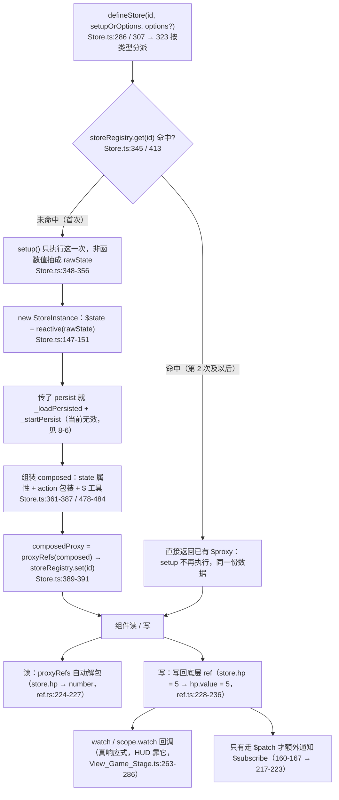
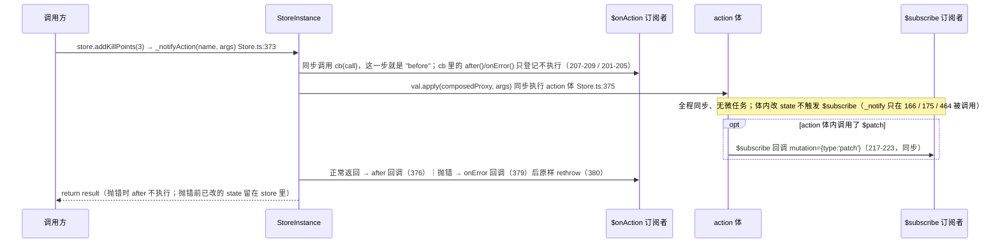

# 状态管理（store）

> 源码：`assets/scripts/platform/store/` ｜ 平台层教程第 2 章

## 1. 一句话说明 / 什么时候用

`store` 是建在 `platform/reactivity` 之上的 **Pinia 风格全局单例容器**：`defineStore(id, setup)` 定义一个 store，`useXxxStore()` 拿到的永远是**同一个对象**（模块级 `Map` 注册表，`Store.ts:131`、`Store.ts:345`），用来让**互不可见的层**（场景、HUD、popup 结算面板、FSM 状态）读写同一份响应式数据。

它**不落盘、不挂节点、不随场景销毁**（见 §6）。所以「什么时候用」的真判据是**这个概念的生命周期属于谁**，项目里已经有现成的三分法（`useBattleStore.ts:6-17`、`StageScope.ts:16-19`）：

| 你的数据是… | 用什么 | 判据（一句话） | 项目参考 |
|---|---|---|---|
| 只有本界面内部读写（面板开关、本次抽到的 4 个候选、界面私有选中态） | `UIScope`（`provide`/`inject` + `scope.watch`） | **删掉那个控件，这个值就没有意义了** | `StageScope.ts:16-19` |
| 跨界面 / 跨层共享、生命周期 = 一次运行或一局 | `store` | 只有一部分界面能读到（popup 层注不到 scope），或这份数据本身就是场景逻辑的运算对象 | `useBattleStore.ts:11-17` |
| 需要关掉游戏还记得（存档、进度、图鉴） | `DataModule`（见 §7） | 关掉进程后还该记得 → 落盘 | `LevelData.ts:41-52` |

`store` 与 `DataModule` 的详细取舍见 **§7「store vs DataModule 怎么选」**。

## 2. 源码地图

| 文件 | 职责 | 关键导出 |
|---|---|---|
| `assets/scripts/platform/store/Store.ts` | 全部实现：注册表、`StoreInstance`、`defineStore`（两个重载）、`storeToRefs`、dispose/查询工具 | `defineStore`（`Store.ts:286` setup 重载 / `Store.ts:307` options 重载）、`storeToRefs`（`Store.ts:499`）、`disposeStore`（`Store.ts:516`）、`disposeAllStores`（`Store.ts:527`）、`hasStore`（`Store.ts:537`），以及类型 `StoreOptions`/`MutationPayload`/`ActionCall` 等（`Store.ts:76-125`） |
| `assets/scripts/platform/store/index.ts` | 门面 barrel：只做再导出（`index.ts:26-32` 值，`index.ts:34-42` 类型） | 同上（业务侧一律从这里 import） |

游戏侧现有 store（`assets/scripts/game/stores/`）：

| 文件 | store id | 大致存什么 | 谁在用 |
|---|---|---|---|
| `game/stores/useBattleStore.ts` | `'battle'`（`useBattleStore.ts:43`） | 局内运行状态 + 战斗真源的**响应式投影**：`hp/maxHp/heroId/heroSkills`、`phase/phaseRemainTime/phaseTotalTime/maxPhase/enemiesAlive/isPaused/isGameOver`、`kills/killPoints/damageDealt/damageTaken/gold`、`relicBag`、`level/exp/expToNext`、`difficulty`（`useBattleStore.ts:45-124`）；actions：`onEnemyKilled/addKillPoints/spendKillPoints/reset/togglePause`（`useBattleStore.ts:127-178`） | `Scene_Game_Stage.ts:408`、`View_Game_Stage.ts:175`、`ShopBuffItem.ts:51`、`BattleState.ts:14`、`PauseState.ts:11`；另经依赖注入被 `HeroSelect`/`RelicShop`/`BuffShop` 门面读货币（`Scene_Game_Stage.ts:480-513`） |
| `game/stores/useUIStore.ts` | `'ui'`（`useUIStore.ts:37`） | 全局 UI 态：`toasts` 队列、`isLoading/loadingMessage`、`activeModals` 栈、`notification`（含 `onConfirm/onCancel`）、`currentScene`（`useUIStore.ts:39-68`）；actions：`showToast/removeToast/showLoading/hideLoading/showModal/closeModal/showConfirm/hideNotification/setCurrentScene`（`useUIStore.ts:74-127`） | **实际无消费者**：只被 `stores/index.ts:9` 导出，全工程没有 `import { useUIStore }` 的调用点（属于预留/未接线） |

## 3. 快速上手

**先确认支持哪种写法**：`Store.ts` **两种都支持** —— `defineStore` 有两个重载（`Store.ts:286-290` setup 风格、`Store.ts:307-315` options 风格），运行时用 `typeof setupOrOptions === 'function'` 分派（`Store.ts:323-327`）。但**本项目只用 setup 风格**：`useBattleStore.ts:43`、`useUIStore.ts:37` 都是 setup；options 风格在当前实现下有读写分裂问题（见 §8 第 5 条），**不要用**。

定义一个 store（照抄 `useBattleStore.ts` 的骨架）：

```ts
// assets/scripts/game/stores/useCounterStore.ts
import { defineStore } from '../../platform/store'   // 路径同 useBattleStore.ts:32
import { ref, computed } from '../../platform/reactivity'

export const useCounterStore = defineStore('counter', () => {
  const count = ref(0)
  const double = computed(() => count.value * 2)
  function add(n = 1) { count.value += n }
  return { count, double, add }   // 非函数值 = state，函数 = action（Store.ts:351-356 / 369-384）
})
```

登记到 barrel（惯例，`stores/index.ts:8-9`）：

```ts
export { useCounterStore } from './useCounterStore'
```

在组件 / 场景 / FSM 状态里用（读 → `store.xxx` 已自动解包 ref；联动 → `scope.watch`）：

```ts
import { useCounterStore } from '../../../../stores'   // 路径同 View_Game_Stage.ts:2

const counter = useCounterStore()        // 首次调用创建，之后永远命中缓存（Store.ts:345-346）
counter.count                            // → 0（proxyRefs 自动解包，Store.ts:389 + ref.ts:224-227）
counter.add(2)                           // 调 action（会先通知 $onAction 订阅者，Store.ts:373）

// UI 里唯一的推荐联动方式：scope.watch（随组件销毁自动回收，UIScope.ts:159-171 / 242-246）
this.scope.watch(() => counter.count, (v) => this.refreshCount(v))
```

## 4. API 速查

| API | 源码位置 | 真实语义（以源码为准） | 项目里有没有人用 |
|---|---|---|---|
| `defineStore(id, setup, options?)` | `Store.ts:286-290`、`334-397` | 定义 setup 风格 store；返回 `useStore` 闭包并挂 `useStore.$id`（`Store.ts:395`）。`setup()` **只在首次 `use` 时执行一次**（`Store.ts:344-348`） | ✅ `useBattleStore.ts:43`、`useUIStore.ts:37` |
| `defineStore(id, {state,getters,actions})` | `Store.ts:307-315`、`399-476` | options 风格：getters 变 `computed`（`Store.ts:420-425`）。⚠ 当前实现下 store 代理与 `$state` 是**两个互不相通的世界**（见 §8-5） | ❌ 无调用点 |
| `storeToRefs(store)` | `Store.ts:499-509` | 遍历 store 的 key，跳过函数与 `$` 开头的键（`Store.ts:505`），`isRef(val) ? val : ref(val)`（`Store.ts:506`）。⚠ 对**基本类型** state 拿到的是**一次性快照 ref**，不是「保持响应式连接」（注释 `Store.ts:491` 与实现不符，见 §8-2） | ❌ 全工程零调用点 |
| `$id` | `Store.ts:479`（`composed.$id`）、`Store.ts:395`/`474`（`useStore.$id`） | store 的字符串 id，两侧都能读 | ✅ 隐式（注册表按它查） |
| `$state` | `Store.ts:480`、`149` | `reactive(rawState)` 本体：读 `$state.hp` 会自动解包 ref，写会写回 ref（经 reactive 的 get/set 语义）。**不是** store 代理本身（`store.$state !== store`） | ✅ 场景直接读写 `battleStore.xxx`（`Scene_Game_Stage.ts:1692-1695`） |
| `$patch(obj \| fn)` | `Store.ts:160-167` | 批量改：函数形式收到 `$state`；两种形式最后都 `_notify('patch')` | ❌ 业务无调用点（仅测试/调试可用） |
| `$reset()` | **setup 风格：未实现**（`_attachUtils` 只挂 `$id/$state/$patch/$subscribe/$onAction`，`Store.ts:478-484`；`StoreInstance.$reset` 虽在 `170-176` 定义却无任何调用点）；options 风格：`Store.ts:458-466` 另写了一份，且只重置 `composedProxy` 上的键 | setup 风格 store 上 `store.$reset` 是 `undefined`，调用即 TypeError。项目用**自定义 `reset()` action** 代替（`useBattleStore.ts:152-174`） | ✅ 间接：`Scene_Game_Stage.ts:716` 调 `battleStore.reset()` |
| `$subscribe(cb)` | `Store.ts:179-185`、通知点 `Store.ts:217-223` | **只在 `$patch` / options 风格的 `$reset` 时**同步回调（`_notify` 的调用点只有 `Store.ts:166`、`175`、`464` 三处）。直接赋值、action 内部改 state **不会**触发。返回退订函数 | ❌ 业务零调用点 |
| `$onAction(cb)` | `Store.ts:188-194`、`Store.ts:197-215` | action 调用前**同步**回调一次（回调本身即 "before"，源码没有单独的 before 字段）；`call.after(cb)` / `call.onError(cb)` 登记回调（`Store.ts:201-205`），分别在 action 体正常返回后（`Store.ts:376`）/ 抛错时（`Store.ts:379`）同步执行；订阅者抛异常被吞掉（`Store.ts:208`）。返回退订函数 | ❌ 业务零调用点 |
| `persist?: boolean \| {key?}` | `Store.ts:76-84`、`339-342`/`404-406`、`229-251` | 默认 key = `store_<id>`（`Store.ts:225-227`）。⚠ **当前实现写不进 localStorage**（两处原因见 §8-6） | ❌ 无调用点 |
| `disposeStore(id)` / `disposeAllStores()` / `hasStore(id)` | `Store.ts:516-522` / `527-532` / `537-539` | 手动从注册表摘掉实例（清订阅数组，`Store.ts:258-262`）；`hasStore` 只查表 | ❌ 全工程零调用点（调试/热重载可用） |
| Mutation 类型 `'action' \| 'set'` | 类型声明 `Store.ts:91` | 这两个取值**从未被发出**（`_notify` 只有 `'patch'`、`'reset'` 两个实参） | — |

## 5. 生命周期与流程图

### 5.1 注册 → 首次创建 → 命中缓存 → 读写 → 订阅（`flowchart TD`）



图里最关键的一条：**响应式来自 `reactivity` 的 dep 系统（`watch`），不是来自 `$subscribe`**。`$subscribe` 只是一个「被 `$patch` 手动敲一下」的通知器。

### 5.2 一次 action 调用的时序（`sequenceDiagram`，顺序与源码一致——**全程同步，无微任务**）



对应实测：`before → after`（正常）、`before → onError → 异常继续往外抛`（抛错）；`async` action 的 `after` 在**第一个 await 之前**就跑完了（`Store.ts:375-376` 同步执行，不等 Promise）。

## 6. 与 Cocos 生命周期的关系

**它不是节点，是纯 TS 模块级单例。** `Store.ts` 只 import `../reactivity`（`Store.ts:58-69`），**完全不 import `cc`**；`platform/reactivity` 同样不依赖 `cc`。所有状态都活在模块作用域的 `storeRegistry = new Map()` 里（`Store.ts:131`）和 `useStore` 的闭包变量里。

**`director.loadScene` 换场景后，store 数据还在。** `loadScene` 销毁的是节点树与组件，不会重新求值 ES 模块，注册表与闭包变量都原封不动，`useBattleStore()` 仍返回同一个对象（`Store.ts:345-346`）。所以：

* 换场景**不会**帮你清状态——项目是**显式重置**的：开局走 `Scene_Game_Stage.resetRun()` → `this.battleStore.reset()`（`Scene_Game_Stage.ts:716`），并且顺序有讲究：`difficulty` 必须写在 `reset()` **之后**（否则被 reset 归 1，`Scene_Game_Stage.ts:717-723`）。
* 数据常驻带来的好处正是选它的理由：`Scene_Game_Stage`（场景）、`View_Game_Stage`（HUD）、`BattleState`/`PauseState`（FSM）、`ShopBuffItem`（商店格子）分属不同对象树层级，靠同一个 store 才共享到同一份数据（`Scene_Game_Stage.ts:408`、`View_Game_Stage.ts:175`、`BattleState.ts:14`、`PauseState.ts:11`、`ShopBuffItem.ts:51`）。
* 前提条件（本工程成立）：脚本所在目录是 Cocos bundle（`assets/scripts.meta:9` → `"isBundle": true`），由首场景 `Loading.loadscripts()` 用 `assetManager.loadBundle("scripts")` 加载（`Loading.ts:22`），而全工程**没有任何 `releaseBundle` 调用点**（`BundMgr.ts:232` 只定义、无人调用）→ 模块不会被重新求值。[推断] 若将来释放并重新加载 `scripts` bundle，模块会被重新执行，`storeRegistry` 会回到空表 —— 那才是"store 数据丢了"的唯一路径。

**UI 组件 `onDestroy` 要不要手动退订？**

* 用 `$subscribe` / `$onAction` 就必须手动退订：它们返回退订函数（`Store.ts:179-185` / `188-194`），`StoreInstance.dispose()` 也会清空订阅数组（`Store.ts:258-262`），但 `disposeStore` 全工程无人调用 → 不退订就是永久泄漏（回调持有已销毁组件的闭包）。
* **项目的实际做法是根本不用 `$subscribe`/`$onAction`**：HUD 一律 `this.scope.watch(() => store.xxx, cb)`（`View_Game_Stage.ts:263-286`）。`UIScope` 内部用 detached `effectScope` 托管这些 watcher，`dispose()` 时统一停止（`UIScope.ts:159-171`、`242-246`），界面隐藏时还会 `pause()`、显示时补播（`UIScope.ts:228-236`）。**写 store 订阅请照这个套路走。**
* [推断] 不要在 store 里存 `Node`/`Component`/`Entity` 这类引擎对象引用：store 比场景活得久，换场景后那些引用会变野。

## 7. 典型组合用法

### 7.1 store vs DataModule 怎么选

两者都能"跨界面共享 + 响应式"，差别只在**落盘与生命周期**：

| 维度 | `store`（`platform/store`） | `DataModule`（`game/data/DataModule.ts`） |
|---|---|---|
| 形态 | `defineStore` 工厂 + 模块级注册表，纯 TS（`Store.ts:131`） | 抽象基类，实例挂在 `DataCenter` 单例的字段上（`DataCenter.ts:65-88`） |
| 落盘 | **不落盘**。`persist` 选项当前实现写不进去（§8-6） | 自动落盘：`watch` 深度监听 → **100ms debounce** → `StorageUtil`（`DataModule.ts:143-163`），键带命名空间 `jihe_defence_`（`StorageUtil.ts:10`） |
| 生命周期 | 进程级常驻，换场景不重置（§6） | 进程级 + **跨启动**（读档在构造里完成，`DataModule.ts:60-64`、`124-140`） |
| 清空手段 | 自定义 `reset()` action（`useBattleStore.ts:152-174`） | `DataModule.reset()`（`DataModule.ts:90-96`）、`DataCenter.resetAll()`（`DataCenter.ts:292-301`） |
| 数据演进 | 无 | `mergeDeep` 只合并默认数据里**已有**的 key（新增字段自动补默认值、脏字段被丢弃，`DataModule.ts:26-42`） |
| 导入导出 / 云存档 | 无 | `serialize/deserialize`（`DataModule.ts:99-114`）+ `DataCenter.exportAll/importAll`（`DataCenter.ts:309-330`） |
| 约定写法 | 谁都能写；局内约定「**场景写、UI 只读**」（`useBattleStore.ts:14-17`） | 只从 `DataCenter` 的业务入口写（`DataCenter.ts:214-277`） |

**判据（按顺序问自己）**：

1. 关掉游戏再打开，这个值该记得吗？ → **该** = `DataModule`（举例：难度选择 `LevelDataModule` 的 `cleared/selected/lastPlayed`，`LevelData.ts:41-52`、`119-142`）；**不该** = `store`。
2. 它的生命周期是"永久/账号级"还是"一局/一次运行"？ → 一局 = `store`（`hp`/`phase`/`gold`…，`useBattleStore.ts:63-124`）。
3. 需要 schema 演进、深合并、云存档吗？ → 需要 = `DataModule`（`DataModule.ts:26-42`、`DataCenter.ts:309-330`）。
4. 是不是要给"注入不到 scope 的层"读（popup 结算面板、商店弹窗）？ → 是 = `store`（`StageScope.ts:16-19`）。
5. 它是**真源**还是**投影**？ → 真源（`Entity`/场景字段/存档）不动它；要给别人读的那份**投影**放 `store`。

**两者并存的真实案例（教科书）**：难度档位。真源是落盘的 `DataCenter.ins.levelData`；开局时场景读一次、写进 `battleStore.difficulty` 供 HUD 显示（`Scene_Game_Stage.ts:721-723`，注释里明确写了"投影值，真源在 `DataCenter.ins.levelData`"，`useBattleStore.ts:72-79`）。**别把两者混起来用**：不要在 `store` 里存需要落盘的东西，也不要用 `DataModule` 装每帧都在变的一局态（那会变成 100ms 一次的写盘）。

**真实使用了 store 的文件清单**（`battleStore` 的读写点）：`Scene_Game_Stage.ts:408`（字段）、`480-513`（注入给功能门面读货币）、`599-601`/`1174-1197`（回写阶段 → HUD）、`716-723`（换局 reset）、`1565-1598`（存活数/击杀）、`1692-1712`（`syncHeroToStore` 投影 hero 真源）、`1105`/`2108`/`2366-2369`（暂停）、`2420`（`isGameOver`）；`View_Game_Stage.ts:175` + `263-286`（HUD 订阅）；`ShopBuffItem.ts:51`/`66`；`BattleState.ts:14`/`21-30`；`PauseState.ts:11`。

### 7.2 三种常见组合

**① 场景写、UI 读（投影模式）**：真源在 `Entity`，场景在关键事件后投影过来（`Scene_Game_Stage.ts:1692-1695`：`hp/maxHp/gold/heroId`；`1703`：`heroSkills`；`1712`：`relicBag`），HUD 只订阅不写（`View_Game_Stage.ts:263-268`）。

**② store 当"依赖注入的读数"**：功能类不直接 import store，宿主把 `getGold: () => this.battleStore.gold` 这类读数注入进去（`Scene_Game_Stage.ts:480-492`、`510-513` 的 `getKillPoints`/`spendKillPoints`）。好处是功能类是纯 TS、可单测；`ShopBuffItem.ts:66` 则把 `battleStore.killPoints` 当**触发重算**的源。

**③ FSM 状态跨层共享**：`BattleState.onUpdate` 读 `phaseRemainTime` 并在归零时 `phase + 1`（`BattleState.ts:21-30`），HUD 从 store 读到同一个 phase（`View_Game_Stage.ts:277-280`）——不需要任何事件广播。

## 8. 注意事项与坑

### 8-1 解构 store 丢响应性

* **现象**：`const { hp } = useBattleStore()`，之后 hp 永远停在解构那一刻的值。
* **原因**：`proxyRefs` 只在**每次属性访问**时把 ref 解包（`ref.ts:223-227`），解构拿到的是一次求值结果，和 store 不再有关系。
* **正确做法**：持整个 store 对象（`private store = useBattleStore()`，如 `View_Game_Stage.ts:175`），联动交给 `this.scope.watch(() => this.store.hp, cb)`（`View_Game_Stage.ts:263-266`）。

### 8-2 `storeToRefs` 对基本类型是「快照 ref」，不是「保持响应式连接」

* **现象**：`const { hp } = storeToRefs(useBattleStore())`；之后 `store.hp = 30`，`hp.value` 还是旧值；反过来改 `hp.value` 也不会回写 store。
* **原因**：`storeToRefs` 取的是 `store[key]` —— 这个值**已经被 `proxyRefs` 解包过**，基本类型上是普通数字，于是 `isRef(val)` 为假，走 `ref(val)` **新建**一个不相干的 ref（`Store.ts:503-507` + `ref.ts:98-103`）。源码注释"保持响应式连接"（`Store.ts:491`）与实现不符。
* **补充**：对象/数组型 state 因为拿到的是同一个 reactive 代理，`ref(同一个对象)` 之后仍表现为联动 —— 但那是巧合，别依赖。
* **正确做法**：本工程**不用** `storeToRefs`（零调用点），一律 `scope.watch(() => store.xxx)`。

### 8-3 `$subscribe` 不会因为「state 变了」而回调

* **现象**：`$subscribe` 挂上了，`store.hp = 0`（或某个 action 里改了 state）却一声不响。
* **原因**：`_notify` 的调用点只有三处：`$patch`（`Store.ts:166`）、`StoreInstance.$reset`（`Store.ts:175`）、options 风格 `$reset`（`Store.ts:464`）。直接赋值与 action 内部改动都不经过它。
* **正确做法**：要监听数据变化用 `watch` / `scope.watch`（真响应式）；`$subscribe` 只适合"审计批量改动"，用它时必须**同时**保证所有写入都走 `$patch`（本工程没这么做，所以它无人使用）。

### 8-4 setup 风格 store 没有 `$reset`

* **现象**：`store.$reset()` → `TypeError: store.$reset is not a function`。
* **原因**：`_attachUtils` 只挂了 `$id/$state/$patch/$subscribe/$onAction`（`Store.ts:478-484`）；`$reset` 只在 options 分支生成（`Store.ts:458-466`）。
* **正确做法**：像 `useBattleStore` 那样写一个 `reset()` **action**，把每个 state 显式写回初值（`useBattleStore.ts:152-174`），换局时显式调用（`Scene_Game_Stage.ts:716`）；注意"reset 之后再写不被 reset 覆盖的字段"的顺序（`Scene_Game_Stage.ts:717-723`）。

### 8-5 options 风格 store：`store.count` 与 `store.$state.count`/getters 是两个世界

* **现象**：`c.count = 10` 后 `c.$state.count` 仍是 0、`c.double` 仍是 0；`c.$state.count = 20` 后 `c.count` 仍是 10；`c.add()` 只改 `c.count` 不改 getters；`c.$reset()` 只把 `c.count` 归零、getters 不变。
* **原因**：options 分支把 `state` 的**值拷贝**放进 `composed`（`Store.ts:431-433`），而 getters/`$state` 读的是另一个对象 `reactive(rawState)`（`Store.ts:417-424`）。只有 setup 分支抽出来的才是 ref（`Store.ts:351-356`），`proxyRefs` 的 set 才会写回原 ref（`ref.ts:228-236`）。
* **正确做法**：只用 **setup 风格**（本工程的实际选择）。要用 options 风格必须先修 `_createOptionsStore`。

### 8-6 `persist` 静默失效（写不进 localStorage）

* **现象**：`defineStore('x', setup, { persist: true })` 后改 state，localStorage 里始终没有 `store_x`，控制台也没有任何报错。
* **原因（两条路径都不通）**：
  * setup 风格：`_startPersist` 写的是 `JSON.stringify(toRaw(this.$state))`（`Store.ts:242-247`）。raw state 里装的是 `RefImpl`，`RefImpl.dep → Link → ReactiveEffect.deps` 构成环 → `JSON.stringify` 抛 `TypeError: Converting circular structure to JSON` → 被 `Store.ts:246-247` 的空 catch 吞掉（watch 本身是回调了的）。
  * options 风格：raw state 是普通值，但深度 watch 遍历的是**非响应式的 raw 对象**，压根不建立依赖 → 回调从不触发。
* **正确做法**：要落盘一律用 `DataModule` + `StorageUtil`（`DataModule.ts:79-82` 用 `toRaw(this._data)` 序列化、数据是纯值所以能过 JSON）。**不要**依赖 store 的 `persist`。

### 8-7 自定义 store 引用与订阅不清理 → 泄漏

* **现象**：界面销毁后回调还在跑（改了不存在的 Label / 报 `Cannot read property of null`）。
* **原因**：`$subscribe`/`$onAction` 把回调塞进 `StoreInstance` 的数组里（`Store.ts:180`、`189`），只有退订函数或 `dispose()` 能摘掉；`disposeStore` 全工程无人调用。
* **正确做法**：用 `scope.watch`（`UIScope` 自动回收，`UIScope.ts:242-246`）；若必须用 `$subscribe`，在 `onDestroy` 里调用它返回的退订函数。

### 8-8 同名 id 冲突：后定义的 setup 永远不执行

* **现象**：新写一个 `defineStore('battle', ...)`，拿到的却是老 store，新字段全是 `undefined`。
* **原因**：注册表**只按 id 查**（`Store.ts:345-346`、`413-414`），第二个 `defineStore` 只是返回了另一个闭包，`use` 时命中已有实例就把新 setup 丢掉了。
* **正确做法**：id 全局唯一并加模块前缀；新增 store 前 `hasStore(id)` 自检（`Store.ts:537-539`），或先 `disposeStore(id)`。

### 8-9 `$onAction` 是同步的，别拿它做异步收尾

* **现象**：`async` action 里 `after` 回调在 action 真正做完之前就跑了。
* **原因**：`callbacks.after()` 紧跟在 `val.apply(...)` 之后同步执行（`Store.ts:375-376`），不等 Promise；`onError` 同理（`Store.ts:378-380`）。
* **补充**：订阅者抛异常会被 `try/catch` 吞掉（`Store.ts:208`），不会打断 action，也不影响其它订阅者。
* **正确做法**：异步收尾写在 action 体内部（`await` 之后）；`$onAction` 只用来打日志/埋点。

### 8-10 [推断] store 比场景活得久，别存引擎对象

* **现象/风险**：把 `Node`/`Component`/`Entity` 塞进 store，换场景后拿到的是已销毁对象的引用。
* **原因**：store 是模块级常驻（`Store.ts:131`），`director.loadScene` 只销毁节点树。
* **正确做法**：store 只存**数据**（数字/字符串/数组/纯对象）；引用关系放场景或 `UITransform` 那侧。

## 9. 调试手段

1. **先确认拿的是哪个实例**：`useBattleStore.$id`（`Store.ts:395`）与 `store.$id`（`Store.ts:479`）应一致；`hasStore('battle')`（`Store.ts:537`）查注册表。
2. **直接打印 store 是安全的**：`JSON.stringify(useBattleStore())` 会给出 `{"hp":…,"$id":"battle","$state":{…}}`（函数键被 JSON 忽略；代理上 ref 已被 `proxyRefs` 解包，所以不会撞上 §8-6 的循环引用）。反过来 `JSON.stringify(store.$state)` 也能用（reactive 会解包 ref），但 **`JSON.stringify(toRaw(store.$state))` 会抛循环引用**——这正是 persist 失效的现场。
3. **store 自身不打任何日志**：`Store.ts` 全文没有一行 `console.*`，所有异常都被静默吞掉（`Store.ts:208`、`221`、`238`、`246`、`248`）。排错只能外部打点。
4. **临时审计改动**：挂一个 `$subscribe` 只能看到 `$patch`（§8-3）；要看"谁改了哪个字段"，用 `watch(() => store.xxx, (nv, ov) => console.log(ov, '→', nv))`，或直接 `$onAction` 打 action 名（`call.name` / `call.args`，`Store.ts:98-103`）。
5. **换局残留排查**：换场景前后各打印一次 `store.$state`；确认对应场景有没有调用过 `reset()`（局内是 `Scene_Game_Stage.ts:716`）。
6. **强制回到初始态**（热重载 / 测试）：`disposeStore('battle')`（`Store.ts:516`）或 `disposeAllStores()`（`Store.ts:527`）；下一次 `useBattleStore()` 会重新跑 setup 得到干净数据。注意它**不影响** `DataModule` 的存档。
7. **看谁在消费**：`grep -rn "useBattleStore()" assets/scripts` —— 本工程 5 个调用点（`Scene_Game_Stage.ts:408`、`View_Game_Stage.ts:175`、`ShopBuffItem.ts:51`、`BattleState.ts:14`、`PauseState.ts:11`）。

## 10. 事实依据

平台层源码：

1. `assets/scripts/platform/store/Store.ts:131` — `const storeRegistry = new Map<string, StoreInstance<any>>()`：注册表在**模块作用域**（所以换场景不丢）。
2. `assets/scripts/platform/store/Store.ts:58-69` — 只 import `../reactivity`，**不 import `cc`**（纯 TS，不挂节点）。
3. `assets/scripts/platform/store/Store.ts:147-151` — `StoreInstance` 构造：`$state = reactive(rawState)`、`$proxy = proxyRefs($state)`。
4. `assets/scripts/platform/store/Store.ts:160-167` — `$patch` 两种形式 + `_notify('patch')`。
5. `assets/scripts/platform/store/Store.ts:170-176` — `StoreInstance.$reset(initialState)`：定义了但**全文件没有任何调用点**（`_attachUtils` 不挂它，options 分支的 `$reset` 是另写的一份闭包 `459-465`）→ 属于死代码，也是 setup 风格没有 `$reset` 的另一半证据。
6. `assets/scripts/platform/store/Store.ts:179-185` / `188-194` — `$subscribe` / `$onAction` 均**返回退订函数**。
7. `assets/scripts/platform/store/Store.ts:197-215` — `_notifyAction`：先同步调用订阅者（`207-209`，订阅者异常被吞 `208`），再把 `after`/`onError` 数组包成回调返回（`211-214`）。
8. `assets/scripts/platform/store/Store.ts:217-223` — `_notify`：同步遍历 `$subscribe` 订阅者，异常被吞。
9. `assets/scripts/platform/store/Store.ts:166` / `175` / `464` — 全文 `_notify(` 的调用点只有这三处 → `mutation.type` 实际只可能是 `patch` / `reset`（类型里声明的 `action`/`set` 从未被发出，`Store.ts:91`）。
10. `assets/scripts/platform/store/Store.ts:225-227` — persist 键名默认 `store_<id>`（或 `options.persist.key`）。
11. `assets/scripts/platform/store/Store.ts:241-251` — `_startPersist`：`watch(() => toRaw(this.$state), …, {deep:true})` + `JSON.stringify`，异常被 `246-247` 空 catch 吞掉（persist 失效现场）。
12. `assets/scripts/platform/store/Store.ts:258-262` — `dispose()` 停 persist watch 并清空两个订阅数组。
13. `assets/scripts/platform/store/Store.ts:286-290` / `307-315` / `323-327` — `defineStore` 的两个重载与 `typeof … === 'function'` 分派（**两种风格都支持**）。
14. `assets/scripts/platform/store/Store.ts:344-346` / `412-414` — `useStore` 里 `storeRegistry.get(id)` 命中即返回已有 `$proxy`（**第二次调用不重跑 setup** = 单例）。
15. `assets/scripts/platform/store/Store.ts:348-356` — setup 结果里**非函数值**抽成 `rawState`（ref/computed 都算 state）。
16. `assets/scripts/platform/store/Store.ts:369-384` — action 被包装：`_notifyAction` → `val.apply(composedProxy, args)` → `after()`，catch 里 `onError(error)` 后 `throw`（原样抛出）。
17. `assets/scripts/platform/store/Store.ts:386-392` — `_attachUtils` + `proxyRefs(composed)` + `storeRegistry.set(id, instance)`。
18. `assets/scripts/platform/store/Store.ts:395` / `474` — `useStore.$id = id`。
19. `assets/scripts/platform/store/Store.ts:420-425` / `431-437` — options 风格：getters → `computed`，state 以**值拷贝**放入 `composed`（与 `$state` 分裂的根因）。
20. `assets/scripts/platform/store/Store.ts:458-466` — options 风格的 `$reset` 只写 `composedProxy` 上的键。
21. `assets/scripts/platform/store/Store.ts:478-484` — `_attachUtils` **没有 `$reset`**（setup 风格无 `$reset` 的直接证据）。
22. `assets/scripts/platform/store/Store.ts:499-509` — `storeToRefs`：跳过函数与 `$` 前缀键（`505`）、`isRef(val) ? val : ref(val)`（`506`）。
23. `assets/scripts/platform/store/Store.ts:516-539` — `disposeStore` / `disposeAllStores` / `hasStore`（三者在本工程均无调用点）。
24. `assets/scripts/platform/store/index.ts:26-32` — 平台层的公开门面（值导出）。
25. `assets/scripts/platform/reactivity/ref.ts:223-237` — `shallowUnwrapHandlers`：`get` 走 `unref`（`224-227`），`set` 在旧值是 ref 时写回 `oldValue.value`（`228-236`）→ 「读自动解包、写回到 ref」。
26. `assets/scripts/platform/reactivity/ref.ts:98-103` — `createRef`：只有入参本身是 ref 才复用，否则 `new RefImpl`（`storeToRefs` 快照行为的根因）。
27. `assets/scripts/platform/reactivity/ref.ts:247-253` — `proxyRefs` 实现。

Cocos 生命周期与工程接线：

28. `assets/scripts.meta:9` — `"isBundle": true`（`assets/scripts` 是 Cocos bundle）。
29. `assets/scripts/game/scene/Loading.ts:22` — 首场景 `assetManager.loadBundle("scripts")`；`Loading.ts:16` — `director.loadScene("Main")`。
30. `assets/scripts/platform/resources/BundMgr.ts:219`/`232` — `releaseBundleRes`/`releaseBundle` **只有定义、无调用点**（所以脚本模块不会被重新求值）。
31. `assets/scripts/platform/ui/UIScope.ts:159-171` — `scope.watch` 由 detached `effectScope` 托管；`UIScope.ts:228-236` — 隐藏 `pause` / 显示补播；`UIScope.ts:242-246` — `dispose()` 统一停掉 watcher。

游戏侧真实用法：

32. `assets/scripts/game/stores/useBattleStore.ts:43` — `defineStore('battle', () => {…})`；`useBattleStore.ts:45-124` state；`127-149` actions（含 `spendKillPoints` 唯一扣费口）；`152-174` 自定义 `reset()`；`180-190` return。
33. `assets/scripts/game/stores/useBattleStore.ts:6-17` — 三分法判据原文（什么放 store、什么放 UIScope）。
34. `assets/scripts/game/stores/useUIStore.ts:37` + `39-68` + `119-127` — `'ui'` store 的完整内容；`assets/scripts/game/stores/index.ts:9` 导出，但全工程无 `import`（`useUIStore` 仅此两处出现）。
35. `assets/scripts/game/ui/scenes/scene_game_stage/Scene_Game_Stage.ts:408` 字段、`716` `battleStore.reset()`、`717-723` difficulty 必须在 reset 之后、`1692-1712` `syncHeroToStore` 投影、`480-513` 注入给功能门面读货币。
36. `assets/scripts/game/ui/scenes/scene_game_stage/cmps/View_Game_Stage.ts:175` 持 store、`263-286` 全部用 `this.scope.watch(() => this.battleStore.xxx, cb)`。
37. `assets/scripts/game/game_stage/states/BattleState.ts:14`/`21-30`、`assets/scripts/game/game_stage/states/PauseState.ts:11` — FSM 状态直接持有同一个 store。
38. `assets/scripts/game/ui/scenes/scene_game_stage/cmps/shop_buff/ShopBuffItem.ts:51`/`66` — 组件读 `battleStore.killPoints`。
39. `assets/scripts/game/ui/scenes/scene_game_stage/cmps/StageScope.ts:16-19` — "跨界面共享只走 store"的项目口径。
40. `assets/scripts/game/data/DataModule.ts:44`/`60-64`/`79-82`/`90-96`/`124-140`/`143-163` — 落盘侧：构造即读档、`toRaw` 后写 `StorageUtil`、100ms debounce。
41. `assets/scripts/game/data/StorageUtil.ts:10`/`16-36` — 存档命名空间 `jihe_defence_` 与读写实现。
42. `assets/scripts/game/data/DataCenter.ts:65-88`（单例 + 7 个模块）、`116-135`（`init`）、`280-289`（`saveAll`）、`292-301`（`resetAll`）。
43. `assets/scripts/game/data/funcs/LevelData.ts:41-52`（键名 `level_progress` + 默认数据）、`119-142`（三个写入口）—— store 里 `difficulty` 的真源。

**运行时验证方式（本机）**：把 `assets/scripts/platform/store/Store.ts` 与 `assets/scripts/platform/reactivity/` 用工程自带 `tsc` 编译到系统临时目录，再跑最小用例脚本（stub `localStorage`），验证了：单例/二次调用、`$reset` 缺失、`storeToRefs` 快照行为、`$subscribe` 触发面与退订、`$onAction` 的 `before→after` / `before→onError→外抛` 顺序、async action 的 `after` 时机、options 风格读写分裂、`persist` 两条路径都写不进、`disposeStore` 后重建新实例、同名 id 的 setup 被忽略。**未改动仓库内任何源码。**
