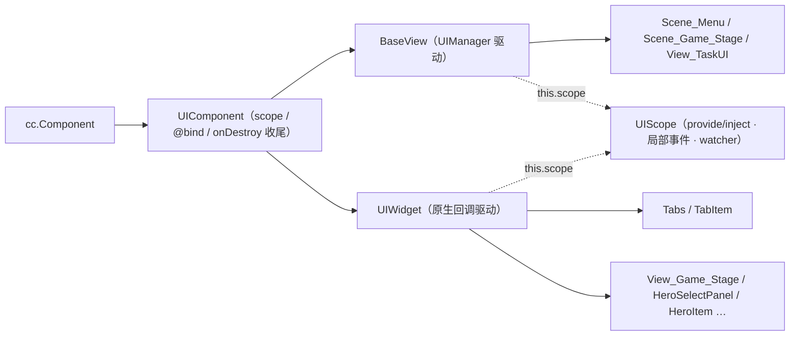
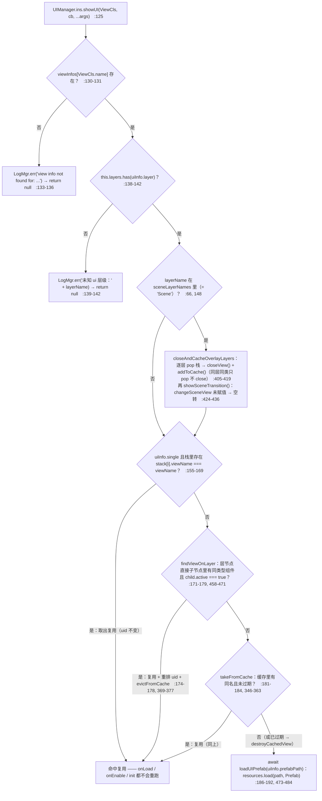
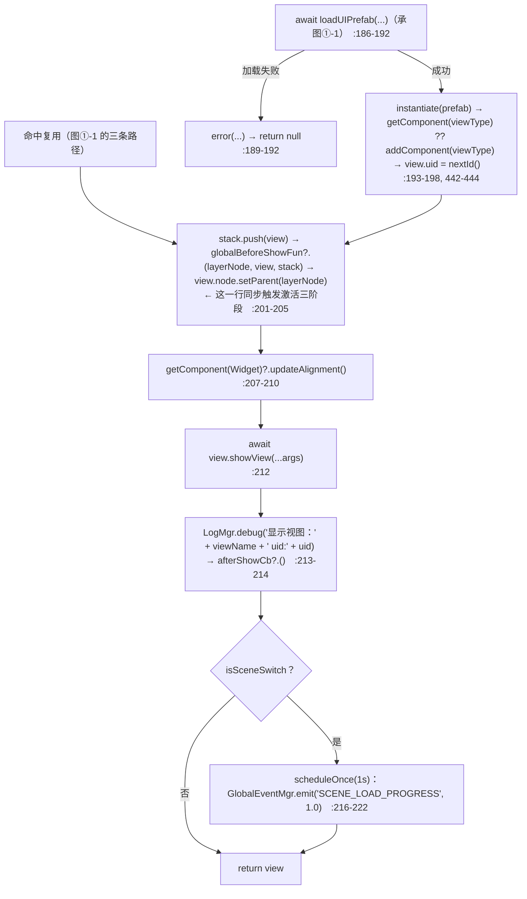
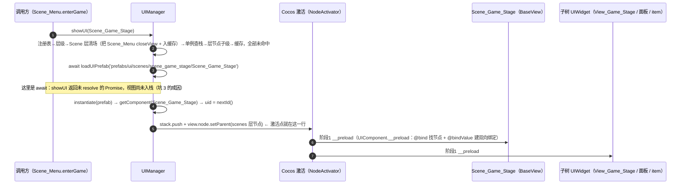
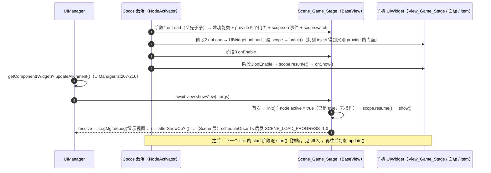
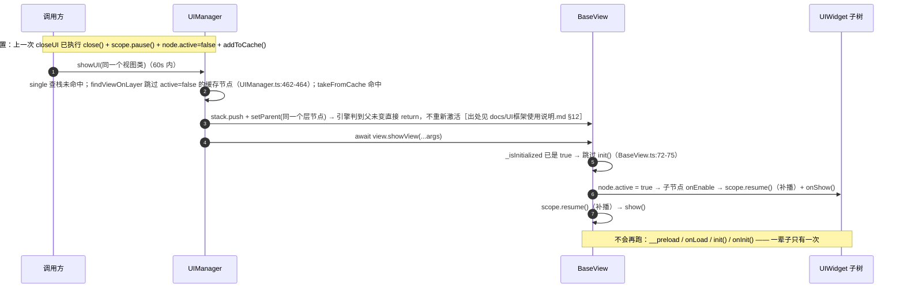
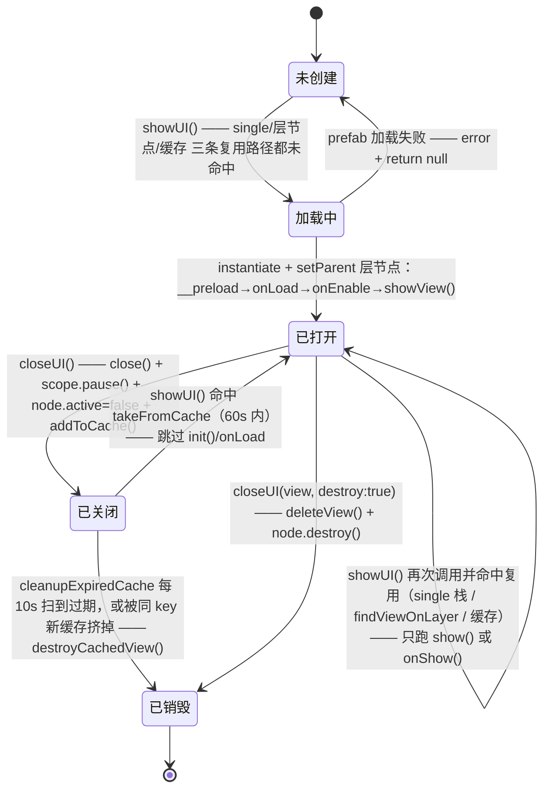

# UI 核心层：UIManager · BaseView · UIWidget · UIScope

> 源码：`assets/scripts/platform/ui/` ｜ 平台层教程第 3 章 ｜ 深度阅读：`docs/UI框架使用说明.md`
>
> 本文是「精简版 + 生命周期流程图版」：每个结论都带 `文件:行号`；旧文档已经讲透的部分一律用一行指针带过；**生命周期与流程图在本文重画**。
> 所有顺序/方法名都来自源码逐行阅读，未在源码注释里找到依据的条目已显式标注 `[推断]`。

---

## 1. 一句话说明 / 什么时候用

`platform/ui/` 把「界面的打开 / 关闭 / 缓存 / 销毁」收进一个单例（`UIManager`），把「界面内部任意深度的通信」收进一个作用域对象（`UIScope`），
业务只继承两个基类之一、写几个固定钩子：

- **`BaseView`**：由 `UIManager.showUI/closeUI` 驱动生命周期的视图（场景 / 弹窗），必须配 `@uiview`（`BaseView.ts:8-27`、`UIDecorator.ts:9-28`）。
- **`UIWidget`**：**不经过 `UIManager`** 的内嵌 UI（场景预制件里的 HUD / 面板 / 列表项），生命周期就是 Cocos 原生回调 + 四个钩子（`UIWidget.ts:1-33`）。
- **`UIScope`**：每个 `UIComponent`（含上面两者）自带一个，提供 `provide/inject`（向下）、`on/emit`（向上冒泡）、`watch`（随显隐暂停/恢复）与 `dispose`（`UIScope.ts:1-42`）。

### 1.1 我该继承谁（判断表）

| 判据 | `BaseView` | `UIWidget` | 普通 `cc.Component` |
|---|---|---|---|
| **节点是不是运行时由 `UIManager` 实例化/挂载的？** | ✅ 是。节点必须是 `scenes/views/popup/dialog/tip/top` 六个层节点的**直接子节点**，运行时由 `showUI` 用 `setParent` 挂上去（`UIManager.ts:201-205`） | ❌ 不是。节点在某个场景预制件**内部任意深度**，编辑器摆好、随父节点一起被实例化 | 无所谓 |
| 谁驱动生命周期 | `UIManager.showUI/closeUI`（`init/show/close/delete`） | Cocos 原生 `onLoad/onEnable/onDisable/onDestroy`（映射到 `onInit/onShow/onHide/onDispose`） | Cocos 原生，自己写 |
| 要不要 `@uiview` | **必须**，否则 `showUI` 直接 `LogMgr.err('view info not found')` 返回 `null`（`UIManager.ts:133-136`） | **禁止**。注册会成功，然后 `showUI` 在 `await view.showView(...)` 处抛 `TypeError: view.showView is not a function`（`UIWidget.ts:9-11`） | — |
| 要不要 `scope` | 要（宿主通常要 provide 给子树） | 要（消费/冒泡的一侧） | 不需要就别继承（`scope` 是惰性建的，`UIComponent.ts:20-25`） |
| 项目里的例子 | `Scene_Menu`、`Scene_Game_Stage`、`View_TaskUI`、`Top_ChangeScene` | `View_Game_Stage`、`HeroSelectPanel`、`HeroItem`、`Tabs`/`TabItem`、`Cmp_Difficulty` | `Tips`（`platform/ui/Tips.ts`） |
| 一句话判据 | 「**它是不是层节点的直接子节点**」 | 「**它的生死跟父节点走吗**」 | 「只是画个东西，不参与通信」 |

> 三选一的实操顺序：先问「是不是 `UIManager.showUI` 打开的整屏/弹窗」→ 是就 `BaseView`；不是就问「它在某个预制件里、需要 provide/inject 或随显隐收尾吗」→ 是要 `UIWidget`；都不是就 `cc.Component`。
> 反向验证：`BaseView` 的预制件根节点名必须 == 类名（见 §8 坑 2），`UIWidget` 的节点名随便叫。

---

## 2. 源码地图

| 文件 | 行数 | 职责 | 关键符号（行号） |
|---|---|---|---|
| `UIManager.ts` | 494 | 单例；`@uiview` 注册表 + 6 个层节点的栈 + 60s 缓存 + 场景层清场 | `ins`(78) `showUI`(125) `closeUI`(234) `closeAllByLayer`(301) `closeAllUI`(318) `viewInfos`(72) `DEFAULT_CACHE_TIME`(69) `globalBeforeShowFun`(63) `changeSceneView`(74) |
| `BaseView.ts` | 125 | UIManager 管理的视图基类；编排 `init/show/close/delete` 与作用域 | `viewName`(43) `init/show/close/delete`(48/53/58/63) `showView`(68) `closeView`(86) `deleteView`(95) |
| `UIWidget.ts` | 89 | 内嵌 UI 基类；把原生回调翻译成 4 个钩子 | `onLoad`(40) `onEnable`(46) `onDisable`(51) `onDestroy`(56) `onInit/onShow/onHide/onDispose`(71/79/83/87) |
| `UIComponent.ts` | 612 | 两者的共同父类：`scope` 惰性句柄、`@bind/@bindValue` 解析、`offNodeEvent`、`onDestroy` 收尾 | `scope`(20) `provide/inject`(28/33) `offNodeEvent`(55) `__preload`(62) `onDestroy`(589) |
| `UIScope.ts` | 277 | 作用域：provide/inject、局部事件总线（向上冒泡）、watcher 托管、pause/resume/dispose | `provide`(147) `inject`(152) `watch`(162) `on/once/off`(176/181/186) `emit`(200) `pause/resume/dispose`(232/237/242) `getScope`(258) |
| `UIDecorator.ts` | 105 | `@uiview` 注册与校验；`@bind` / `@bindValue`（**项目 0 处使用**） | `uiview`(9) `bindValue`(30) `bind`(70) |
| `ViewInfo.ts` | 17 | 层枚举与视图元数据接口 | `ViewLayer`(1) `ViewInfo`(12) |

继承关系（只有一条链）：



> `ViewLayer` 有 7 个值（`ViewInfo.ts:1-9`），但 `Bottom` **没有对应层节点**，用它会得到 `未知 ui 层级`（`UIManager.ts:139-142`，实测 `Main.scene` 里只有 `scenes/views/popup/dialog/tip/top`）。

---

## 3. 快速上手

### 3.1 例①：一个 `BaseView` 子类（整屏/弹窗）

（顶部 import：`BaseView` 来自 `platform/ui/BaseView`，`uiview` 来自 `platform/ui/UIDecorator`，`ViewLayer` 来自 `platform/ui/ViewInfo`）

```ts
@uiview({
    prefabPath: 'prefabs/ui/views/task/View_TaskUI', // resources 相对路径、不带扩展名
    layer: ViewLayer[ViewLayer.View],
    single: true,
})
@ccclass('View_TaskUI')
export class View_TaskUI extends BaseView {
    @property(Label) title: Label = null;
    protected init(): void { this.scope.watch(() => this.fingerprint(), () => this.refresh()); } // 一辈子一次
    protected show(): void { this.refresh(); }   // 每次显示都跑（缓存复用时 init 不再跑）
    protected close(): void { }                  // 每次隐藏
    protected delete(): void { }                 // 仅在真销毁
    private fingerprint(): string { return ''; }
    private refresh(): void { }
}
```

- 调用：`UIManager.ins.showUI(View_TaskUI)`（`async`，失败返回 `null`）；关：`UIManager.ins.closeUI(View_TaskUI)`（默认入缓存）。
- 真实样例：`View_TaskUI.ts:35-95`（`@uiview` → `init` 建 watcher → `show` 每次对齐周期 → `closeUI` 关闭）。

### 3.2 例②：一个 `UIWidget` 子类（预制件内嵌，带 provide + 冒泡）

（顶部 import：`UIWidget` 来自 `platform/ui/UIWidget`；`StageScopeKeys/Events` 是页面作用域契约，见 §7.1）

```ts
@ccclass('HeroSelectPanel')                   // ⚠ 内嵌 UIWidget：不要加 @uiview
export class HeroSelectPanel extends UIWidget {
    @property(Node) refreshBtnNode: Node = null;
    private vm: HeroSelectVM = null;          // 宿主（场景）在 onLoad 里 provide 的门面
    protected onInit(): void {                // 一辈子一次 = onLoad
        this.vm = this.inject<HeroSelectVM>(StageScopeKeys.HeroSelect, null);
        this.refreshBtnNode?.on(Button.EventType.CLICK, this.onClickRefresh, this);
    }
    protected onShow(): void { this.refresh(); }               // 每次显示 = onEnable
    protected onDispose(): void {                              // 销毁 = onDestroy
        this.offNodeEvent(this.refreshBtnNode, Button.EventType.CLICK, this.onClickRefresh, this);
    }
    private onClickRefresh(): void { this.scope.emit(StageScopeEvents.HeroRefresh); } // 向上冒泡
    private refresh(): void { }
}
```

- 真实样例：`HeroSelectPanel.ts:51-124`（`inject` 门面 + `scope.watch` + `emit` + `onDispose` 成对 `off`）；冒泡的接收方在宿主：`Scene_Game_Stage.ts:556-557`。
- 想 **provide 给子孙**（而不是消费）就写 `this.provide(key, value)`（`UIComponent.ts:28-30`），键一律 `'域:用途'`（`UIScope.ts:52`、`StageScope.ts:46-67`）。

---

## 4. API 速查

### 4.1 `UIManager.ins` 全部公开成员（以源码为准）

| 成员 | 签名/位置 | 说明 |
|---|---|---|
| `ins`（静态 getter） | `UIManager.ts:78-83` | 单例；组件 `onLoad` 之前访问会返回 `null` **并打错误日志**（`UIManager.ts:80`） |
| `showUI` | `UIManager.ts:125-225` | `async showUI<T extends BaseView>(viewType, afterShowCb?, ...args): Promise<T>`。`...args` 只存进 `view.showArgs`（`BaseView.ts:69-71`），不传给 `init/show` |
| `closeUI` | `UIManager.ts:234-298` | 可传**实例或类**；`{ cb?, destroy? }`，`destroy !== true` 时入缓存（`UIManager.ts:287-294`）。按类关会关掉**该层所有同类**（`UIManager.ts:268-273`） |
| `closeAllByLayer` | `UIManager.ts:301-315` | `closeAllByLayer(layerName, destroy = false)` |
| `closeAllUI` | `UIManager.ts:318-323` | `closeAllUI(excludeLayers = [])`，逐层调 `closeAllByLayer(layer, false)` |
| `fullSizeViewNode` | `UIManager.ts:486-489` | 把节点 UITransform 撑到 `view.getVisibleSize()` |
| `onResize` | `UIManager.ts:491-493` | 空实现，屏幕适配扩展点 |
| `globalBeforeShowFun` | `UIManager.ts:63` | 字段：`(layerNode, showView, stack) => void`，每次 `setParent` 之前调用（`UIManager.ts:204`）。**项目当前未赋值** |
| `changeSceneView` | `UIManager.ts:74` | 字段：转场视图工厂。**项目当前未赋值** → `showSceneTransition()` 空转（`UIManager.ts:427-428`） |
| `viewInfos`（静态） | `UIManager.ts:72` | `@uiview` 注册表，key = **类名** |
| `DEFAULT_CACHE_TIME`（静态） | `UIManager.ts:69` | 视图缓存时长，`60000` ms；`addToCache` 用它算过期时间（`UIManager.ts:337`） |

> ⚠ **本文件里没有 `getUI()` / `preload()` / `destroyUI()` / `getView()`** —— 全类只有上表这 11 个公开成员（`private` 的 `initLayers/addToCache/takeFromCache/destroyCachedView/cleanupExpiredCache/closeAndCacheOverlayLayers/showSceneTransition/findViewOnLayer/loadUIPrefab` 一律不可用）。
> 别照抄「网上常见版 UIManager」的方法名。要拿视图实例，用 `showUI` 的返回值，或走 `ezgame.ui`（`platform/ezgame.ts:10`）。

### 4.2 `BaseView` 的框架钩子与公开面（真实名字是 `init/show/close/delete`）

| 成员 | 位置 | 调用时机 |
|---|---|---|
| `init()`（protected，可重写） | `BaseView.ts:48-50` | **只在第一次 `showView()`**（`_isInitialized` 守卫，`BaseView.ts:72-75`） |
| `show()`（protected，可重写） | `BaseView.ts:53-55` | **每次 `showView()`**（`BaseView.ts:79`） |
| `close()`（protected，可重写） | `BaseView.ts:58-60` | 每次 `closeView()`，**早于** `scope.pause()` 与 `node.active=false`（`BaseView.ts:87-93`） |
| `delete()`（protected，可重写） | `BaseView.ts:63-65` | 仅在真销毁：`deleteView()` 里 `scope.dispose()` 之后（`BaseView.ts:95-99`） |
| `showView(...args)` | `BaseView.ts:68-83` | `UIManager` 在挂载后 `await` 它。顺序：存 `showArgs` → 首次 `init()` → `node.active = true` → `scope.resume()` → `show()` →（可选动画） |
| `closeView()` | `BaseView.ts:86-94` | 顺序：`close()` → `scope.pause()` →（可选动画）→ `node.active = false` |
| `deleteView()` | `BaseView.ts:95-99` | `scope.dispose()` → `delete()` |
| `uid` / `showArgs` | `BaseView.ts:31 / 41` | `uid` 由 `UIManager.nextId()` 分配（`UIManager.ts:198/442-444`） |
| `useAnimation` / `animationShowFunc` / `animationCloseFunc` | `BaseView.ts:38-40` | 动画开关；默认 `false`，开了才 `await` 0.3s 缩放动画（`BaseView.ts:102-124`） |
| `viewName`（getter） | `BaseView.ts:43-45` | **返回 `this.node.name`**，不是类名 —— 这是坑 2 的根源 |

> ⚠ 没有 `onInit/onOpen/onClose/onRelease` 这些名字。`BaseView` 的钩子只有 `init/show/close/delete`；带 `on` 前缀的四个钩子属于 `UIWidget`。

### 4.3 `UIWidget` 的钩子

| 钩子 | 位置 | 对应原生回调 |
|---|---|---|
| `onInit()` | `UIWidget.ts:71-72` | `onLoad`（`UIWidget.ts:40-44`） |
| `onShow()` | `UIWidget.ts:79-80` | `onEnable`（`UIWidget.ts:46-49`，**先 `scope.resume()` 再 `onShow()`**） |
| `onHide()` | `UIWidget.ts:83-84` | `onDisable`（`UIWidget.ts:51-54`，**先 `onHide()` 再 `scope.pause()`**） |
| `onDispose()` | `UIWidget.ts:87-88` | `onDestroy`（`UIWidget.ts:56-68`，被 `try/catch` 包住） |

> 子类**禁止**重写 `onLoad/onEnable/onDisable/onDestroy`（会盖掉基类的 scope 生命周期，`UIWidget.ts:31-32`）。

### 4.4 `UIScope` 的方法（`UIScope.ts`）

| 方法 | 位置 | 语义 |
|---|---|---|
| `provide(key, value)` | 147-149 | 对**本节点及整棵子树**可见，返回 `value`（便于 `x = this.provide(...)`） |
| `inject(key, fallback?)` | 152-154 | 沿 `node.parent` 向上找，**不含自己这一层**；找不到且无 `fallback` 时打 warn（`UIScope.ts:97-100`） |
| `watch(source, cb, options?)` | 162-172 | watcher 交给作用域托管（`effectScope(true)`）；已 `dispose` 时返回 `null` + warn（167-170） |
| `on(type, listener, caller?)` | 176-179 | 注册到本作用域的总线 |
| `once(type, listener, caller?)` | 181-184 | 只收一次 |
| `off(type, listener, caller?)` | 186-189 | 摘掉（作用域销毁会自动清空，一般不必手写） |
| `emit(type, ...args)` | 200-218 | **先派发本作用域，再沿 `node.parent` 逐级向上**派发到每个祖先 `UIComponent` 的作用域；不向下、不横向 |
| `dispatchLocal(type, ...args)` | 221-223 | 只派发本作用域（不冒泡），供 `emit` 逐级使用 |
| `pause()` / `resume()` | 232-234 / 237-239 | 暂停/恢复全部 watcher；暂停期间的触发在 `resume()` 时**补播一次** |
| `dispose()` | 242-252 | 停 watcher + 清总线 + 撤销本节点 provide + 注销登记（可重复调用，`_disposed` 守卫） |
| `host` / `node` / `disposed` | 118 / 132-134 / 137-139 | 只读属性 |
| 自由函数 `getScope(host)` / `provide(node, …)` / `inject(node, …)` | 258-267 / 270-272 / 275-277 | 只拿到 `Node` 没有组件实例时用 |

`UIComponent` 另外给的便利（`UIComponent.ts`）：`scope` getter(20-25)、`provide/inject`(28/33)、`offNodeEvent(node, type, handler, target)`(55-60，**安全摘节点事件**)、`rebindAll/rebind`(564/574)、`@bind`(66-97) 与 `@bindValue`(157-166) 的实现（**项目 0 处使用**）。

### 4.5 视图元数据

```ts
export enum ViewLayer { Scene, Bottom, View, PopUp, Dialog, Tip, Top }   // ViewInfo.ts:1-9
export interface ViewInfo { prefabPath: string; layer: string; single?: boolean; [key: string]: any }  // ViewInfo.ts:12-17
```

`@uiview` 的三条校验（`UIDecorator.ts:9-28`）：① 必须继承 `BaseView`，否则 `throw TypeError`(12-14)；② 同类名重复注册 `throw Error`(15-18)；③ `single` 缺省被改写成 `false`(19-21)。

---

## 5. 生命周期与流程图

> 本节是本文重点：**6 张图**回答「`showUI` 怎么决策（图①-1 / ①-2）」「首次打开到底按什么顺序跑（图②-1 / ②-2）」「缓存复用少了哪些钩子（图③）」「一个视图实例的一生（图④）」。
> 图①②各拆成前后半段，只是为了让每张图都短到一眼看得完，读的时候按序连起来看。

### 5.1 图①：`UIManager.showUI(name)` 的完整决策流程

> 下面两张图是**同一条流程**的前后半段（拆开只为每张图都一眼看得完）。图中 `:N-M` 均指 `assets/scripts/platform/ui/UIManager.ts` 的行号。





两条容易看漏的分支语义：

- **`single` 命中的是「栈」，`findViewOnLayer` 命中的是「层节点上活着的节点」，缓存命中的是「已关闭 60s 内的节点」** —— 三种复用路径彼此独立，`showUI` 会按 `single → 层节点 → 缓存 → 新建` 的顺序短路（`UIManager.ts:155-199`）。
- 缓存 key 是**构造器名**（`UIManager.ts:446-448`），且同 key 再入缓存会**先把旧的那份销毁**（`UIManager.ts:330-335`）。

### 5.2 图②：首次打开一个运行时实例化的视图（真实顺序，前半段 / 后半段）

以 `Scene_Menu.enterGame()` → `UIManager.ins.showUI(Scene_Game_Stage)`（`Scene_Menu.ts:130-139`）为例：





核心事实（都能回源码）：

1. **挂载（`setParent`）就是激活点** —— `onLoad/onEnable` 全部发生在 `UIManager.ts:205` 那一刻，**早于 `await view.showView()`（212 行）**。源码注释原话：「子组件的 `onLoad` 在 `setParent` 激活时就同步跑完（早于 `BaseView.showView()`）」（`UIScope.ts:35-36`）。
2. **父视图的 `onLoad` 早于子树 UIWidget 的 `onLoad`**，所以 `provide` 写在 `onLoad` 里，子树在 `onInit` 里就 `inject` 得到（`Scene_Game_Stage.ts:469-474` 与 `471-472` 的注释；消费侧 `View_Game_Stage.ts:210-214`、`HeroSelectPanel.ts:52`）。
3. **子组件的 `onShow()` 早于父视图的 `show()`**：`showView` 里 `node.active = true`(76) 在 `show()`(79) 之前 → 缓存复用时子节点先 `onEnable`。这条被真实踩过并写进注释（`View_Game_Stage.ts:296-300`）。
4. **`start()` 在 `showView` 之后**：`Scene_Game_Stage` 甚至留了个空的 `start()`（`Scene_Game_Stage.ts:633-635`）。

### 5.3 图③：关闭后再打开（命中缓存 —— 哪些钩子**不会**再跑）



因此**「每次打开都要做」的事只能写在 `show()/onShow()`**：重置列表、复位选中态、跑一次数据对齐（`View_TaskUI.ts:73-77`、`View_Game_Stage.ts:301-308`、`Scene_Menu.ts:204-209` 都是这么写的）。
而 `init/onInit` 里放的是「建 watcher、provide、注册常驻事件」（`Scene_Menu.ts:163-189`）。

### 5.4 图④：一个视图实例的状态机



对应源码：`加载中` = `UIManager.ts:188`；`已打开` = 201-212；`已关闭` = 283-294；`已销毁` = 380-386（`destroyCachedView`）与 389-398（`cleanupExpiredCache`，由 `onLoad` 里的 `schedule(...,10)` 驱动，`UIManager.ts:92`）。

---

## 6. 与 Cocos 生命周期的关系

### 6.1 对应关系总表

| Cocos 原生回调 | `BaseView` 侧 | `UIWidget` 侧 | `this.scope` | 触发时机 | 在这里能安全做什么 / 不能做什么 |
|---|---|---|---|---|---|
| `__preload` | 无框架钩子（子类可重写） | **禁止重写** | 未创建 | 节点首次激活的最早阶段；**所有节点的 `__preload` 都早于任何 `onLoad`** | `UIComponent.__preload` 干两件事：`@bind` 找节点 + `@bindValue` 建双向绑定（`UIComponent.ts:62-65`）。宿主也可以在这里 `provide`（`UIScope.ts:36`）。**不能**假设子节点已 `onLoad` |
| `onLoad` | 子类可直接用（`Scene_Game_Stage.ts:466`） | 映射为 `onInit()`（`UIWidget.ts:40-44`） | **创建**（`UIWidget.onLoad` 里 `this.scope` 被提前触发，`UIWidget.ts:41-42`） | 组件首次激活，**只一次**；**父先于子** | ✅ `provide` / `scope.watch` / `scope.on` / 常驻节点事件 / `inject` 父的门面；❌ 依赖配表（预置实例的这个回调早于 `Main` 的配表加载）、❌ 写「每次显示」的逻辑 |
| `onEnable` | — | `scope.resume()` → `onShow()`（`UIWidget.ts:46-49`） | `resume()`（**先 resume，再 onShow**） | 每次从 `inactive` 变 `active`（含被父节点带活） | ✅ 按当前状态**无条件刷一次**；❌ 假设数据没变（`resume` 会补播暂停期间的触发） |
| `start` | 子类可直接用（`Scene_Game_Stage.ts:633-635` 是空实现） | 可用 | 已创建 | 激活后**第一个 tick 的 start 阶段**，一次 `[推断]`（源码注释未覆盖；依据见 `docs/UI框架使用说明.md` §4.1） | ✅ 需要「一帧后」才做的事 |
| `update` / `lateUpdate` | 可用 | 可用（基类**没有** `update`，写了不覆盖任何东西，`View_Game_Stage.ts:684`） | — | 每帧 | ✅ 纯表现推进；❌ 在里面大量写 store |
| `onDisable` | — | `onHide()` → `scope.pause()`（`UIWidget.ts:51-54`） | `pause()`（**先 onHide，再 pause**） | 每次隐藏 | ✅ 摘「每次显示才注册」的东西；❌ 以为对象被销毁了（它还在缓存里，`BaseView.ts:88`） |
| `onDestroy` | 子类可重写，**必须 `super.onDestroy()`** | 映射为 `onDispose()`（被 `try/catch` 包住）→ `super.onDestroy()`（`UIWidget.ts:56-68`） | `dispose()`（在 `UIComponent.onDestroy` 里，`UIComponent.ts:596-600`） | 节点真销毁（子节点先销毁、父组件后销毁） | ✅ 只摘**自己的**节点事件，用 `offNodeEvent`（`UIComponent.ts:55-60`）；❌ **碰别的组件 / 抛异常**（会堵死引擎销毁队列，见坑 4） |

`BaseView` 另有一条**不由 Cocos 回调驱动**的轴（由 `UIManager` 驱动）：

| 框架调用 | 效果 | 位置 |
|---|---|---|
| `showView()` | 首次 `init()` → `node.active=true`（带活子树 `onEnable/onShow`）→ `scope.resume()` → `show()` | `BaseView.ts:68-83` |
| `closeView()` | `close()` → `scope.pause()` → `node.active=false`（子树 `onDisable/onHide`） | `BaseView.ts:86-94` |
| `deleteView()` | `scope.dispose()` → `delete()` | `BaseView.ts:95-99` |

### 6.2 `scope` 的 `pause/resume/dispose` 挂在哪个原生回调上

| 基类 | `resume()` | `pause()` | `dispose()` |
|---|---|---|---|
| `UIWidget` | `onEnable`（`UIWidget.ts:47`） | `onDisable`（`UIWidget.ts:53`） | `onDestroy` → `super.onDestroy()` → `UIComponent.onDestroy`（`UIWidget.ts:67` → `UIComponent.ts:597`） |
| `BaseView` | `showView()`（`BaseView.ts:78`） | `closeView()`（`BaseView.ts:89`） | `deleteView()`（`BaseView.ts:97`） |

> 注意差异：**`BaseView` 的 `onDisable`/`onDestroy` 没有任何框架动作** —— 它的 `pause/dispose` 完全由 `UIManager` 调 `closeView/deleteView` 触发。
> 所以视图**自己**把 `node.active = false`（绕过 `closeView`）时，视图自己的作用域**不会暂停**（子树的 `UIWidget` 仍会正常暂停，因为原生回调照常）。项目里 `Top_ChangeScene` 就是这么干的（`Top_ChangeScene.ts:250`、`344-345`），属已知问题（坑 8）。

### 6.3 引擎节点激活顺序（有源码注释依据的三条 + 一条 `[推断]`）

1. **父先于子**（`onLoad`）：源码注释原话「父组件的 `onLoad` 一定早于子组件的 `onLoad`（引擎三阶段激活是前序）」（`Scene_Game_Stage.ts:471-472`）；`:469-473` 说明这正是 `provide` 放 `onLoad` 而不是 `show` 的原因。
2. **挂载即激活，早于 `showView()`**：「子组件的 `onLoad` 在 `setParent` 激活时就同步跑完（早于 `BaseView.showView()`）」（`UIScope.ts:35-36`）。
3. **`active = false` 的节点不跑 `onLoad/onEnable`，且不会重跑**：「`closeUI` 默认会把视图放进缓存（节点仅 `active=false`），复用时不再走 `onLoad`」（`BaseView.ts:88`）；`findViewOnLayer` 明确「跳过已关闭/未激活的节点，避免取到已缓存的视图」（`UIManager.ts:462-464`）。
4. **销毁顺序：子节点先销毁、父组件后销毁**：「节点销毁时引擎先销毁子节点、再销毁本节点自己的组件，而每个被销毁的对象都会跑 `CCObject._destruct()`（对象字段一律置 null）」（`UIComponent.ts:40-45`）；`onDestroy` 由 `director.tick` 的 `CCObject._deferredDestroy()` 逐个调用（`UIWidget.ts:57-59`）。
5. **`onLoad` → `onEnable` → `start` → `update` 的相对次序**：源码注释未覆盖，标 `[推断]` —— 其中「`__preload` 全部早于任何 `onLoad`」「`start` 在激活后首个 tick 的 start 阶段」两条依据是引擎 `node-activator.ts`，见 `docs/UI框架使用说明.md` §4.1 与 §12 的出处行。

---

## 7. 典型组合用法

### 7.1 场景（`BaseView`）当宿主 + HUD（`UIWidget`）当消费者

```
Scene_Game_Stage（BaseView，scenes 层）
└── uiViewNode → View_Game_Stage（UIWidget）
    ├── hero_select_panel → HeroSelectPanel（UIWidget）→ items/item ×4 → HeroItem（UIWidget）
    └── shopBuffPanel / bosses / skill_details …
```

- 宿主在 `onLoad` 里 `provide` 6 条键（`ExitBattle` + 5 个功能门面，`Scene_Game_Stage.ts:474, 549-553`；键表见 `StageScope.ts:46-67`），并 `scope.on` 接子树冒泡上来的事件（`Scene_Game_Stage.ts:556-565`）。
- 子树在 `onInit` 里 `inject`（`View_Game_Stage.ts:210-214`、`HeroSelectPanel.ts:52`、`HeroItem.ts:44`），向上用 `scope.emit`（`HeroItem.ts:82`、`HeroSelectPanel.ts:116`）。
- **谁持有节点谁写 `active`**：面板开关状态在功能类的 `panelVisible`（`ref`），节点显隐由持节点的那一层 `watch` 后写（`View_Game_Stage.ts:346-360`、`Scene_Game_Stage.ts:569`、`applyRelicPanelVisible`；归属表见 `StageScope.ts:133-149`）。
- 完整规约（哪些放 scope、哪些必须放 store）指向 `docs/UI框架使用说明.md` §7；可复制配方见同文 §9 R3/R4/R5。

### 7.2 弹窗（`BaseView`）里嵌 `UIWidget` 面板，事件冒泡回弹窗宿主

`Scene_Menu`（BaseView）持有 `ui_difficulty` 节点上的 `Cmp_Difficulty`（UIWidget）：

- 弹窗只用 `scope.emit(DifficultyScopeEvents.Confirm/Close)` 通知，**不落盘、不跳场景**（`Scene_Menu.ts:100-105` 的 `scope.on`）。
- 宿主负责落盘 + 开战，且顺序不能换：先 `selectLevel` 再 `showUI(Scene_Game_Stage)`（`Scene_Menu.ts:124-139` 的注释与实现）。
- 节点显隐由**持有节点的宿主**写（`Scene_Menu.ts:115-122`），弹窗自己不动自己的 `active` —— 与 §7.1 同一条口径。

### 7.3 跨界面共享只走 store

`useBattleStore` 由场景写、HUD 读（`View_Game_Stage.ts:263-286` 里针对 store 的 7 组 `scope.watch`：hp/maxHp、gold、killPoints、level/exp、difficulty、phase/phaseRemainTime、heroId/heroSkills）。理由：**层节点互为兄弟，`inject` 跨不过去**（`UIScope.ts:33-34`）。详见 `docs/UI框架使用说明.md` §7。

### 7.4 通用页签 `Tabs` / `TabItem`

`Tabs` 是 `UIWidget` 子类、是**唯一**的选中态写入方，在自己的 `onInit` 里 `provide` 选中态给内容子树（`Tabs.ts:231-235`），并在 `select()` 里 `scope.emit`（`Tabs.ts:300`）。用法与四条要点见 `docs/UI框架使用说明.md` §9 R9。

---

## 8. 注意事项与坑

> 每条按「现象 → 原因（带行号）→ 正确做法」写。坑 1~5 是**红线**（照抄会直接出事故），坑 6~10 是**只在源码里才看得见的边界**，坑 11~12 是**与旧文档不一致、以源码为准**的地方。

### 坑 1：`@uiview({prefabPath})` 写成了带 `assets/resources/` 前缀或带扩展名 → 打不开

- **现象**：`showUI` 返回 `null`，控制台 `加载预制件失败: xxx`。
- **原因**：`loadUIPrefab` 走的是 `resources.load(prefabPath, Prefab, cb)`（`UIManager.ts:473-484`），路径必须是 **`resources` 相对路径、不带扩展名**；失败分支打 `error` 并返回 `null`（`UIManager.ts:189-192`）。
- **正确做法**：照抄真实视图的写法 —— `'prefabs/ui/scenes/scene_menu/Scene_Menu'`（`Scene_Menu.ts:26`）、`'prefabs/ui/views/task/View_TaskUI'`（`View_TaskUI.ts:36`）。**挪预制件目录必须同步改这里**。

### 坑 2：重复 `showUI` 时 `single` 不生效，越开越多

- **现象**：明明 `single: true`，反复打开却叠出多份视图；`closeUI(类名)` 关不干净。
- **原因**：`single` 分支比较的是 `stack[i].viewName === viewName`，而 `viewName` 这个 getter 返回的是 **`this.node.name`**（`UIManager.ts:160` + `BaseView.ts:43-45`），传进来的 `viewName` 却是**类名**（`UIManager.ts:130`）。两者不相等 → 单例判断永远落空。
- **正确做法**：**预制件根节点名必须严格等于类名**。同理 `closeUI` 按类关时也靠这个相等关系收集（`UIManager.ts:268-273`）。

### 坑 3：异步加载期间又关了界面 → 「关了它自己又弹出来」

- **现象**：连点两次（或加载中点了返回），界面最终仍然出现。
- **原因**：`showUI` 是 `async`，`await loadUIPrefab(...)`（`UIManager.ts:188`）期间视图**还没入栈**；此时 `closeUI` 收集不到任何实例，直接 `if (!toClose.length) return;` 早退（`UIManager.ts:281`）——「关」是空操作。`showUI` 恢复后照常 `stack.push` + `setParent` + `showView`（`UIManager.ts:201-212`）。
- **正确做法**：调用方自己守一个「本次打开是否已作废」的标志（或在 `afterShowCb` 里按当前状态立刻 `closeUI`）；**不要**指望在加载窗口里 `closeUI` 能拦住它。（本条由源码路径推导，非注释原文。）

### 坑 4：在 `onDestroy` / `onDispose` 里碰别的组件 → 画面永久卡死

- **现象**：控制台每帧刷同一条 `Uncaught TypeError: Cannot read properties of null (reading 'off')`，画面再也不绘制、回不到主界面。
- **原因**：销毁顺序是「子节点先销毁、再销毁本节点组件」，且每个被销毁对象都会跑 `CCObject._destruct()` 把字段置 null（`UIComponent.ts:40-45`）；`onDestroy` 由 `director.tick` 的销毁队列逐个调用，**抛异常会让该队列不清空**（`UIWidget.ts:57-60`）。
- **正确做法**：摘节点事件一律用 `offNodeEvent`（对已销毁节点自动跳过，`UIComponent.ts:55-60`）；子类钩子写成"只做收尾、不依赖别的组件"。真实样例：`View_Game_Stage.ts:310-325`、`HeroSelectPanel.ts:76-80`。
- 指针：`docs/UI框架使用说明.md` §10.1 与 `AGENTS.md`「表现层 `onDestroy`」一条。

### 坑 5：给 `UIWidget` 加了 `@uiview`

- **现象**：`showUI` 抛未处理的 Promise rejection：`TypeError: view.showView is not a function`；层节点上留下一个脏节点、栈里留一条脏记录。
- **原因**：`@uiview` 只校验「必须继承 `BaseView`」（`UIDecorator.ts:12-14`）—— 注册会成功；然后 `showUI` 照常实例化、入栈，最后 `await view.showView(...)`（`UIManager.ts:212`）而 `showView` 只定义在 `BaseView`（`BaseView.ts:68`）。`UIWidget.ts:9-11` 的注释把后果写全了。
- **正确做法**：内嵌 UI 一律不加 `@uiview`；要 `UIManager` 管就改成 `BaseView` 并把节点挂到层节点下。

### 坑 6：`init/onInit` 里写「每次打开都要做」的事 → 第二次打开状态残留

- **现象**：第一次打开正常，关掉再开（60s 内）列表没复位 / 还停在上次滚动位置。
- **原因**：命中缓存时 `_isInitialized` 已是 `true`，`init()` 被跳过（`BaseView.ts:72-75`）；`onLoad` 也不会重跑（`BaseView.ts:88` 注释）。
- **正确做法**：一次性的事（建 watcher / provide / 常驻事件）放 `init/onInit`；每次显示的事放 `show/onShow`（`View_TaskUI.ts:73-77`、`View_Game_Stage.ts:301-308`）。非响应式字段（如 `HeroItem.heroId`，`HeroItem.ts:37, 95`）的变化 `watch` 感知不到，必须在 `onShow` 里无条件刷一次。

### 坑 7：`provide` 写在 `show()` / 消费方在 `onInit` 里 `inject` 不到

- **现象**：`UIScope 注入失败：key=… 向上的父链上没有提供者`（`UIScope.ts:97-100`），面板拿到的全是 `null`。
- **原因**：子组件的 `onLoad`（`onInit`）在 `setParent` 那一刻就跑完了，**早于** `BaseView.showView()`（`UIScope.ts:35-36`）→ `show()` 里的 `provide` 永远晚一步。
- **正确做法**：宿主把 `provide` 提到 `__preload` 或 `onLoad`（项目现状：`Scene_Game_Stage.ts:474, 549-553` 全在 `onLoad`）；确实晚了的场景用**惰性注入**（用到时才 `inject`，见 `View_Game_Stage.ts:755-762` 的 `exitBattle`）。

### 坑 8：视图自己 `node.active = false` / `this.destroy()` → 栈与缓存不一致

- **现象**：切场景清场时报错、`closeUI` 关不掉、同一个视图出现两份。
- **原因**：绕过了 `UIManager.closeUI`，视图仍留在层栈里，而节点已隐藏/组件已销毁（`Top_ChangeScene.ts:250` 与 `344-345` 就是这么写的；视图自己的 `scope` 也**不会**被 `pause/dispose`，见 §6.2）。
- **正确做法**：视图不要自己销毁自己、不要自己改自己的 `active`（内部子节点显隐例外），一律交给 `UIManager.closeUI`。
- 指针：`docs/UI框架使用说明.md` §10.2 B。

### 坑 9：`BaseView` 子类重写 `onDestroy` 忘了 `super.onDestroy()`

- **现象**：该视图的 `provide` 不撤销、`watch` 仍挂在响应式依赖上（隐藏时还在跑）。
- **原因**：`scope.dispose()` + 绑定清理都写在 `UIComponent.onDestroy`（`UIComponent.ts:589-611`）。现状：`Scene_Menu.ts:197-202` 与 `Scene_Game_Stage.ts:665-678` 都调了 `super`；**`Top_ChangeScene.ts:199-201` 没有**（仍未修）。
- **正确做法**：BaseView 子类重写 `onDestroy` 时最后一行 `super.onDestroy()`；`UIWidget` 子类不用管（基类已代为处理，写 `onDispose` 即可）。
- 指针：`docs/UI框架使用说明.md` §10.2 A。

### 坑 10：编辑器预置实例 vs 运行时实例化 —— 预置且 `active=false` 等于白占内存

- **现象**：`showUI` 每次都新建一份实例；场景里那个预置节点永远不显示、也永远不被回收。
- **原因**：`findViewOnLayer` 只扫层节点的**直接子节点**且**跳过 `active === false`**（`UIManager.ts:458-471`），所以未激活的预置实例命中不了复用分支。
- **实测快照（本次复核，`assets/scenes/Main.scene`）**：层节点 `scenes` 下 2 个预置实例 = `Scene_Menu.prefab`（根 `_active` 覆盖为 `true`）与 `Scene_Game_Stage.prefab`（根 `_active` 覆盖为 `false`）；`views` 下除了 `View_Hero_Detail` 占位节点（`_active: false`）还有 **`View_TaskUI.prefab` 的预置实例（根 `_active` 覆盖为 `false`）**；`top` 下是 `Top_ChangeScene.prefab`（根 `_active` 覆盖为 `false`）。也就是说 **4 个预置实例里有 3 个是永远不会被复用的死节点**。
- **正确做法**：想让 `UIManager` 完整接管生命周期就别预置（删掉预置节点）；非要预置就必须把根节点设成激活态。
- ⚠ **与 `docs/UI框架使用说明.md` §6.4 不一致**：旧文档的表只有 3 个预置实例（`Scene_Menu` / `Scene_Game_Stage` / `Top_ChangeScene`），漏了 `views` 下的 `View_TaskUI`。**以源码/场景文件为准。**

### 坑 11（与旧文档不一致）：`StageScopeKeys` 已是 **6 条**键，不是 5 条

- `docs/UI框架使用说明.md` §3 的表格与 §7.1 的代码块都写「19 键 → **5** 键」（`ExitBattle` + 4 个门面）。**源码现在是 6 条**：多了 `BossScheduler: 'bossScheduler:vm'`（`StageScope.ts:62-66`），宿主也真的多 provide 了一条（`Scene_Game_Stage.ts:553`），HUD 侧多注入一条（`View_Game_Stage.ts:214`）。
- 结论：键表以 `StageScope.ts:46-80` 为准。

### 坑 12（与旧文档不一致）：`@uiview` 注册的视图是 **4 个**、`closeUI` 已有调用方

- 旧文档 §3 的视图清单只有 3 个（`Scene_Menu` / `Scene_Game_Stage` / `Top_ChangeScene`），且 `prefabPath` 写的是 `resources/prefabs/scenes/Scene_Menu` 这种**旧目录**；§12 还写「`closeUI`/`closeAllUI` 无调用方」。
- 实测：注册了 4 个视图（多了 `View_TaskUI`，`View_TaskUI.ts:35-41`），4 条 `prefabPath` 全部是 `prefabs/ui/...` 新目录；`closeUI` 至少有 1 处调用方（`View_TaskUI.ts:94`，入口在 `Scene_Menu.ts:73`）。**以源码为准。**

---

## 9. 调试手段

### 9.1 先打开 `UIManager` 的 debug 日志

`UIManager` 的所有分支都打了 `LogMgr.debug`。默认 `LogMgr.logLevel = logLevel.Info`（`LogMgr.ts:16`），Info(2) > Debug(1) 会被过滤掉，所以要先降级：

```ts
import { LogMgr, logLevel } from 'db://assets/scripts/platform/log/LogMgr';
LogMgr.logLevel = logLevel.Debug;   // 1；或 LogMgr.logOpen = false 全关
```

打开后能直接看到「走了哪条分支」的日志点：

| 日志 | 位置 | 含义 |
|---|---|---|
| `显示视图：<名> uid:<n>` | `UIManager.ts:213` | `showView` 已 `await` 完成 |
| `关闭视图：<名> uid:<n>（已缓存）` | `UIManager.ts:293` | 走了缓存分支 |
| `销毁视图：<名> uid:<n>` | `UIManager.ts:290` | 走了 `destroy: true` 分支 |
| `视图缓存：<类名> uid:<n> 将于 60s 后销毁` | `UIManager.ts:342` | 入缓存时刻 |
| `从缓存恢复视图：<名>` | `UIManager.ts:352` | **命中缓存**（说明 `init/onLoad` 不会重跑） |
| `从缓存中移除视图引用：<名>` | `UIManager.ts:373` | `findViewOnLayer` 命中后摘掉缓存引用 |
| `缓存过期销毁：<key> uid:<n>` | `UIManager.ts:393` | 10s 定时清理扫到 |
| `UIManager 层级节点缺失：<层名>` | `UIManager.ts:109` | 编辑器里层节点没挂到 `@property` 上 |
| `未知 ui 层级：<layer>` | `UIManager.ts:140` | 用了没有层节点的 `ViewLayer`（如 `Bottom`） |
| `view info not found for: <类名>` | `UIManager.ts:134` | 忘了 `@uiview`，或类名与注册名不一致 |
| `UIManager 还未初始化就进行获取！` | `UIManager.ts:80` | 在 `UIManager` 组件 `onLoad` 之前访问了 `ins` |

### 9.2 作用域/通信问题的排查

| 症状 | 先看哪里 |
|---|---|
| `UIScope 注入失败：key=… 向上的父链上没有提供者`（`UIScope.ts:99`） | 是不是 `provide` 写晚了（坑 7）？消费方真的在那棵子树里吗？（跨层节点注不到，`UIScope.ts:33-34`） |
| `UIScope 已销毁，watch 被忽略：<组件名>`（`UIScope.ts:168`） | 在已销毁的作用域上又建了 watcher —— 通常是在 `onDispose` 之后还调了刷新方法 |
| `UIScope 向上通知「…」时，节点「…」的监听器抛错`（`UIScope.ts:212`） | 某一层 `scope.on` 的回调抛异常（不会影响其它层，逐层 try/catch） |
| 面板显隐/内容不刷新 | 项目里给每处 `inject` 都配了兜底 warn：`View_Game_Stage.ts:255/260/292`、`HeroSelectPanel.ts:54`、`HeroItem`/`Scene_Menu` 的 `ezgame.warn`。看到这条就说明**没注入到门面**（通常是节点被挪出了宿主子树） |

### 9.3 手工验一遍四条路径

1. 打开 → 关闭 → 再打开：验证**缓存复用**（不该有 `init` 的日志/watcher 重复注册）。
2. 等 60s 再打开（或把 `UIManager.DEFAULT_CACHE_TIME` 临时改成 2000）：验证**过期重建**路径。
3. 切场景（`showUI(Scene_Game_Stage)`）：验证 Scene 层**自动清场**（旧视图应打印「关闭视图…（已缓存）」）。
4. 反复进出 3~5 次后看内存：预置的死节点不会自己消失（坑 10），要确认没有每局新增一份常驻实例。

---

## 10. 事实依据

| # | 结论 | 依据 |
|---|---|---|
| 1 | `showUI` 的完整分支顺序：注册表 → 层级 → Scene 层清场 → `single` 查栈 → 层节点直接子级 → 缓存 → 新建；失败各返回 `null` | `assets/scripts/platform/ui/UIManager.ts:125-225`（133-136 / 138-142 / 148-153 / 155-169 / 171-184 / 186-199） |
| 2 | `setParent` 是激活点，`await view.showView()` 在其后；之后才 `afterShowCb` 与场景层 1s 进度事件 | `UIManager.ts:201-222` |
| 3 | `findViewOnLayer` 只扫层节点直接子节点并跳过 `active === false` | `UIManager.ts:458-471`（尤其 462-464 注释） |
| 4 | 缓存 60s、每 10s 清理、key = 构造器名、同 key 新缓存会先销毁旧的 | `UIManager.ts:69, 92, 328-343, 389-398, 446-448` |
| 5 | `closeUI` 可传实例或类；`destroy !== true` 入缓存；不在栈里直接早退 | `UIManager.ts:234-298`（281 / 287-294） |
| 6 | Scene 层清场会关掉所有层（同层同类只 pop 不 close）；`changeSceneView` 未赋值 → 转场空转 | `UIManager.ts:66, 405-419, 424-436` |
| 7 | `BaseView` 四个钩子真实名字是 `init/show/close/delete`；`showView` 顺序 = 存 `showArgs` → 首次 `init` → `active=true` → `scope.resume()` → `show()` | `assets/scripts/platform/ui/BaseView.ts:48-65, 68-83` |
| 8 | `closeView` = `close()` → `scope.pause()` →（动画）→ `active=false`；`deleteView` = `scope.dispose()` → `delete()` | `BaseView.ts:86-99` |
| 9 | `viewName` 返回 `node.name`（不是类名）→ 与 `showUI` 传类名比较时 `single` 会失效 | `BaseView.ts:43-45` + `UIManager.ts:160` |
| 10 | `UIWidget` 把 4 个原生回调映射为 `onInit/onShow/onHide/onDispose`；`onLoad` 里先建 `scope` 再 `onInit`；`onDestroy` 里 `onDispose` 被 try/catch 包住再 `super` | `assets/scripts/platform/ui/UIWidget.ts:40-68` |
| 11 | `UIWidget` 禁止重写原生 4 回调；给 `UIWidget` 加 `@uiview` 会在 `await view.showView` 处抛 `TypeError` | `UIWidget.ts:9-11, 31-32` |
| 12 | `scope` 的 `resume` 在 `onEnable`、`pause` 在 `onDisable`、`dispose` 在 `UIComponent.onDestroy` | `UIWidget.ts:47, 53, 67` + `assets/scripts/platform/ui/UIComponent.ts:589-611` |
| 13 | `emit` 先派发本作用域再沿 `node.parent` 逐级向上（不向下、不横向），逐层 try/catch | `assets/scripts/platform/ui/UIScope.ts:200-223` |
| 14 | `inject` 沿 `node.parent` 向上、不含本层；找不到且无 fallback 时打 warn | `UIScope.ts:87-102, 152-154` |
| 15 | `dispose` 停 watcher、清总线、撤销 provide、注销节点登记 | `UIScope.ts:242-252` |
| 16 | 子组件 `onLoad` 在 `setParent` 激活时同步跑完、早于 `BaseView.showView()`；宿主应在 `__preload/onLoad` provide | `UIScope.ts:33-41`（尤其 35-37） |
| 17 | 父组件 `onLoad` 早于子组件 `onLoad`，因此 `provide` 放 `onLoad`；功能类与 5 个门面都在 `onLoad` provide | `assets/scripts/game/ui/scenes/scene_game_stage/Scene_Game_Stage.ts:466-576`（471-474, 549-553） |
| 18 | `StageScopeKeys` 现有 6 条键（含 `BossScheduler`）；面板归属表「谁持有节点谁写 `active`」 | `assets/scripts/game/ui/scenes/scene_game_stage/cmps/StageScope.ts:46-80, 133-149` |
| 19 | HUD 在 `onInit` 里 inject 宿主注入的 5 项（退出动作 + `HeroSelect`/`BuffShop`/`SkillSlots`/`BossScheduler` 四个门面）、建 10 组 watcher（其中 7 组读 store）；`onShow` 里做「非响应式部分」的复位；`onDispose` 里用 `offNodeEvent` 成对摘 | `assets/scripts/game/ui/scenes/scene_game_stage/cmps/View_Game_Stage.ts:208-325`（210-214, 252-293, 301-308, 310-325） |
| 20 | 面板/子组件冒泡与消费写法：`inject` 门面 + `scope.watch` + `emit`；item 的 `heroId` 是非响应式字段 | `cmps/hero_select/HeroSelectPanel.ts:51-124`、`cmps/hero_select/HeroItem.ts:37-95` |
| 21 | `BaseView` 真实调用方：`@uiview` 注册 4 个视图、`prefabPath` 全为 `prefabs/ui/...`、`closeUI` 有调用方 | `Scene_Menu.ts:25-29, 73, 138`；`Scene_Game_Stage.ts:256-262`；`View_TaskUI.ts:35-41, 94`；`assets/scripts/game/ui/top/Top_ChangeScene.ts:55-59` |
| 22 | `Top_ChangeScene` 自己写 `active=false` / `destroy()`，且 `onDestroy` 未调 `super`（scope 不 dispose） | `Top_ChangeScene.ts:199-201, 250, 344-345` |
| 23 | `Main.scene` 层节点与预置实例（4 个实例的 `_active` 覆盖值；`View_Hero_Detail` 占位节点 `_active:false`；无 `bottom` 层节点） | `assets/scenes/Main.scene`：`scenes` 子级 = `Scene_Menu`(`_active`→true) / `Scene_Game_Stage`(`_active`→false)；`views` 子级 = `View_Hero_Detail`(false) / `View_TaskUI`(false)；`top` 子级 = `Top_ChangeScene`(false)；四个 prefab uuid 分别对上 `assets/resources/prefabs/ui/**/*.prefab.meta` |
| 24 | `UIManager` 公开面只有 `ins/showUI/closeUI/closeAllByLayer/closeAllUI/fullSizeViewNode/onResize/globalBeforeShowFun/changeSceneView/viewInfos/DEFAULT_CACHE_TIME`；**无 `getUI`/`preload`** | `UIManager.ts:63, 69, 72, 74, 78-83, 125, 234, 301, 318, 486, 491`（全文件检索 `getUI|preload|destroyUI` 无命中） |
| 25 | `@uiview` 三条校验；`@bind/@bindValue` 项目 0 处使用 | `UIDecorator.ts:9-28`；全仓 grep `@bind(|@bindValue(` 仅命中定义文件 `UIComponent.ts:564`（`rebindAll`） |
| 26 | `LogMgr` 需降到 `logLevel.Debug` 才能看到 `UIManager` 的 debug 分支日志 | `platform/log/LogMgr.ts:3-8, 16-31` |
