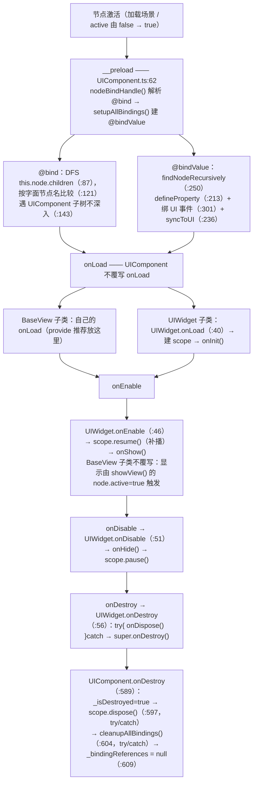
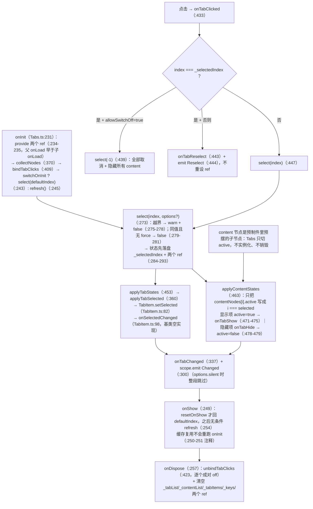
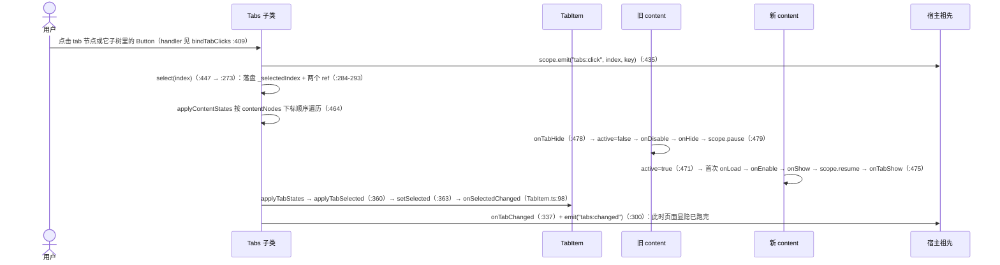

# UI 组件与控件（UIComponent · 装饰器 · Tabs · Tips）

> 源码：`assets/scripts/platform/ui/` ｜ 平台层教程第 4 章 ｜ 相关：`03-ui-core.md`

本章只讲「**这个类有哪些 API、什么时候跑、节点契约长什么样**」。
界面该怎么选基类、生命周期与 Cocos 的完整对应表、UIScope 通信规约，已在 `docs/UI框架使用说明.md` 讲透 —— 对应位置本章只给一行指针，不重复。

---

## 1. 一句话说明 / 什么时候用

| 想做的事 | 用谁 | 一句话 |
|---|---|---|
| 写一个**内嵌在场景预制件里**的页面/小组件（不经 UIManager） | `UIWidget`（extends `UIComponent`） | 四个钩子 `onInit/onShow/onHide/onDispose` + `this.scope`；**禁止**加 `@uiview`、**禁止**重写 `onLoad/onEnable/onDisable/onDestroy`（`UIWidget.ts:31`） |
| 写一个由 **UIManager** 管的整屏视图/弹窗 | `BaseView`（extends `UIComponent`，`BaseView.ts:28`） | 必须配 `@uiview`；生命周期挂在 `showView/closeView/deleteView` 上 |
| 按**节点名**自动抓节点/自动双向绑定 | `@bind` / `@bindValue`（`UIDecorator.ts:70` / `:30`） | ⚠ **本工程 0 处使用，且工程里没有一个节点名符合它的契约** —— 现状一律用 `@property` 拖引用（见 §4.2） |
| 一组互斥页签（点击切 content 显隐） | `Tabs`（extends `UIWidget`）+ `TabItem` | 挂在 tab 与 content 的**共同祖先**上；选中态唯一真源在 `Tabs` 一份 |
| 屏幕顶部飘一条提示（1.5 秒后自己消失） | `Tips`（extends **`Component`**，`Tips.ts:7`） | ⚠ 独立的孤儿组件：不走 `UIComponent`、没有 `scope`、**工程里既无调用方也无预制件实例**（见 §4.4） |

**判断顺序**：先问「这段 UI 归不归 UIManager 管」→ 选 `BaseView` 还是 `UIWidget`（判据见 `docs/UI框架使用说明.md` §2.2）；再问「是不是一组互斥页签」→ 用 `Tabs` 而不是自己写 `active` 互斥。

---

## 2. 源码地图

| 文件 | 职责 | 关键导出 / 装饰器 |
|---|---|---|
| `UIComponent.ts`（24 KB，本章重点） | 所有 UI 组件的根基类。`__preload` 里解析 `@bind`/`@bindValue`；双向绑定（getter/setter + UI 事件回流）；`this.scope` 门面；`offNodeEvent` 安全摘节点事件 | `class UIComponent extends Component`（`:7`）；`get scope`（`:20`）、`provide`（`:28`）、`inject`（`:33`）、`offNodeEvent`（`:55`）、`rebindAll`（`:564`）、`rebind`（`:574`）、`nodeBindHandle`（`:66`，public） |
| `UIDecorator.ts` | 三个装饰器的**定义**（文件名不叫 UIBinder） | `uiview(options)`（`:9`）、`bind(cmpType=Node, name="")`（`:70`）、`bindValue(cmpType=Node, name="")`（`:30`） |
| `UIWidget.ts` | 场景预制件里内嵌 UI 的基类；把 Cocos 原生回调转成 4 个框架钩子 | `class UIWidget extends UIComponent`（`:38`）；`onLoad/onEnable/onDisable/onDestroy`（`:40/:46/:51/:56`）+ 空钩子 `onInit/onShow/onHide/onDispose`（`:71/:79/:83/:87`） |
| `BaseView.ts` | UIManager 管的视图基类（本章只作为「另一个 UIComponent 子类」出现） | `class BaseView extends UIComponent`（`:28`，default export）；`showView/closeView/deleteView`（`:68/:86/:95`） |
| `Tabs.ts`（23 KB） | 通用页签：选中态唯一真源 + content 显隐 + 向下 provide 选中态 + 向上 emit 事件 | `class Tabs extends UIWidget`（`:117`）；`TabsScopeKeys`（`:79`）、`TabsScopeEvents`（`:87`）、`ITabContent`（`:101`）、`ITabSelectOptions`（`:109`） |
| `TabItem.ts` | **一个页签节点**的状态载体（`tabKey`/`tabIndex`/`selected`）+ **表现接口** `onSelectedChanged` | `class TabItem extends UIWidget`（`:42`）；`setSelected`（`:82`，由 `Tabs` 调）；`onSelectedChanged`（`:98`，基类空实现） |
| `Tips.ts` | 顶部提示条：设文案/设颜色 + 进场位移 tween + 1.5 s 后自隐 | `class Tips extends Component`（`:7`）；`setText`（`:14`）、`setStatus`（`:18`）、`onEnable`（`:29`）、公开字段 `moveTween`（`:12`） |
| `双向绑定ai代码.md` | **历史设计记录**（文件头 `:1-10` 自己声明「勿当现状读」）。里面的 `BindableComponent`／`onLoad` 建绑定／`cleanupBindingEvents`／`getBindingStatus` 都**不是**现状 | — |
| （相邻模块）`UIScope.ts` / `UIManager.ts` / `ViewInfo.ts` | `Tabs` 与 `UIComponent` 都建在 `UIScope` 上；`@uiview` 的注册表在 `UIManager.viewInfos` | 见 `03-ui-core.md` |

---

## 3. 快速上手

### ① 用 `@bind` / `@bindValue` 的组件（照写能用，但⚠ 本工程 0 处使用）

```ts
// ⚠ 现状：本工程 0 处使用（grep「@bind(|@bindValue」只命中注释与文档）。契约见 §4.2
@ccclass('DemoBind')
export class DemoBind extends UIWidget {
    @bind(Node)                 // 找 name === "&closeBtn"（"&" + 字段名，UIDecorator.ts:95-102）
    closeBtn: Node = null;
    @bindValue(Label, 'title')  // 找 name === "title"（显式 name 不加 &，:50-53）
    title: string = '';

    protected onInit(): void {
        this.closeBtn?.on(Node.EventType.TOUCH_END, this.onClose, this);
    }
    protected onDispose(): void {
        this.offNodeEvent(this.closeBtn, Node.EventType.TOUCH_END, this.onClose);
    }
}
```

- 两个装饰器都在 **`__preload`**（`UIComponent.ts:62-65`）里生效，**早于所有 `onLoad`** → 字段在 `onInit` 里一定可用。
- 初始值是 `''` / `null` / `undefined` 时**不会**推给 UI（`syncToUI` 跳过 falsy，`:367`）。
- 字段名与节点名对不上时只 `console.warn`，**不抛错、不阻断**（`:93`）。

### ② 一个 Tabs 配置（真实字段名 + 工程里真实的两个使用者）

工程里只有两处用 `Tabs`，**都靠继承**（`extends Tabs`），没有一处直接给节点挂 `Tabs` 组件。
下面这段的完整出处是 `assets/scripts/game/ui/scenes/scene_menu/cmps/Cmp_OuterRelics.ts:43`：

```ts
@ccclass('Cmp_OuterRelics')
export class Cmp_OuterRelics extends Tabs {
    protected onInit(): void {
        super.onInit();   // ⚠ 不调 = 不 provide / 不收集 / 不绑点击，页签完全不工作（Tabs.ts:231）
    }
    protected onShow(): void {
        super.onShow();   // 父类负责 resetOnShow + refresh（Tabs.ts:249-255）
        this.rebuildAll();
    }
    // 框架默认实现转发给 TabItem；本页 tab 没挂它 → 自己写表现（Tabs.ts:360）
    protected applyTabSelected(tab: Node, _index: number, selected: boolean): void {
        const bg = tab.getChildByName('active_bg');
        if (bg) bg.active = selected;
    }
}
```

编辑器里两个组件实例的**真实配置值**（`Scene_Menu.prefab`）：

| 组件 | 挂在 | `tabBarNode` | `contentBarNode` | `tabNodes` / `contentNodes` | 其余 4 个开关 |
|---|---|---|---|---|---|
| `Cmp_FuncTabs`（左侧菜单） | 菜单 `content` 节点 | `menus`（`prefab:9134` → 节点 `:4572`） | `right`（`prefab:9151` → 节点 `:9223`） | **显式各拖 4 个**（`prefab:9120` / `:9137`） | `defaultIndex=0`、`switchOnInit=true`、`resetOnShow=false`、`allowSwitchOff=false`（`prefab:9154-9157`） |
| `Cmp_OuterRelics`（遗物页） | `content/right/outer_relics`（节点 `:7861`） | `tabs`（`prefab:23381` → 节点 `:18495`） | `pages`（`prefab:23385` → 节点 `:19527`） | **都留空** → 自动取 `tabBarNode.children` / `contentBarNode.children`（`prefab:23380`/`:23384`） | 同上四个默认值（`prefab:23388-23391`） |

- 两个使用者收集到的 tab 节点**都没有挂 `TabItem`**（全工程无 `TabItem` 子类、无实例）→ 表现全部由 `applyTabSelected` 覆写承担；`_keys` 因此 = **tab 节点名**（`Tabs.ts:398`），`selectByKey('game')` 这类按节点名工作。
- `Cmp_OuterRelics` 页面内层实际结构见 `Cmp_OuterRelics.ts:18-27`（`tabs` 下 `tab_overview`/`tab_attr`，`pages` 下 `overview`/`attrs`）。
- 完整机制、节点摆法图示、7 种写法配方：`docs/UI框架使用说明.md` §R9。

### ③ `Tips` 的调用方式（⚠ 工程里无任何调用方）

```ts
// 节点契约：本节点下必须有名为 "text" 的子节点且挂 Label（Tips.ts:16）；
//          父节点必须有 UITransform（Tips.ts:30）
const tips = tipsNode.getComponent(Tips);
tips.setText('金币不足');
tips.setStatus(1);          // 0 黑 / 1 黄(255,174,0) / 2 红（Tips.ts:20-26）
tips.node.active = true;    // 靠 onEnable 触发：回位 → 0.2s 位移 → 1.5s 后自己 active=false
```

- 重复弹同一条：**不要**再调 `setText` 就完事 —— 节点已在 active 时不会再触发 `onEnable`，动画与 1.5 s 自动隐藏都不会重来。现成写法是 `active = false` 再 `= true`（`Tips.ts:29-39`）。
- `UIManager.layerTips`（`UIManager.ts:50/104`）是 **`ViewLayer.Tip` 的层节点**，与 `Tips` 类**没有关系**，别顺着名字去找。

---

## 4. API 速查

### 4.1 `UIComponent` 全部公开成员（以源码为准）

| 成员 | 位置 | 说明 |
|---|---|---|
| `extends Component` | `:7` | 直接继承 `cc.Component`（不是 `BaseView`/`UIWidget` 之间加的一层） |
| `get scope(): UIScope` | `:20` | 惰性创建；`UIScope` 是 provide/inject + watcher 回收 + 局部事件总线（`UIScope.ts:115`） |
| `provide<T>(key, value): T` | `:28`（protected） | 向本节点及整棵子树提供值 |
| `inject<T>(key, fallback?): T` | `:33`（protected） | 沿父链向上注入（**不含自己这一层**） |
| `offNodeEvent(node, type, handler, target?)` | `:55`（protected） | 安全摘节点事件：`node` 为 null 或 `!isValid` 时直接跳过。**必须用它**——组件 `onDestroy` 里对已被 `_destruct` 过的后代节点调 `off()` 会抛 `Cannot read properties of null (reading 'off')`，可选链挡不住（`:37-54`） |
| `__preload()` | `:62`（protected） | 覆写 Cocos 的 `__preload`：**先** `nodeBindHandle()`（`@bind`），**再** `setupAllBindings()`（`@bindValue`） |
| `nodeBindHandle()` | `:66`（**public**） | 重扫 `__binds` 抓节点；已抓到的字段不会被覆盖，重复同名节点会告警（`:123-132`）。可手动再调，但**不会**先清空旧值 |
| `rebindAll(): void` | `:564` | `cleanupAllBindings()` + `setupAllBindings()` —— **只重做 `@bindValue`，完全不碰 `@bind`** |
| `rebind(propertyKey): boolean` | `:574` | 只重绑 `__bindValues` 里的一个字段；配置不存在时 warn 并返回 `false` |
| `onDestroy(): void` | `:589` | `_isDestroyed = true` → `this._scope?.dispose()`（try/catch）→ `cleanupAllBindings()`（try/catch）→ `_bindingReferences = null`。每一步各自兜住，因为 `onDestroy` 抛异常会**堵死引擎的销毁队列**（`:594-610`） |
| 其余 protected/private | `:98/:157/:174/:250/:279/:301/:366/:377/:456/:467/:483/:530/:553` | `findNode`、`setupAllBindings`、`setupTwoWayBinding`、`findNodeRecursively`、`findChildNodeByName`**（死代码）**、`setupUIEvents`、`syncToUI`、`updateUIComponent`、`isComponentValid`、`onBoundNodeDestroyed`、`cleanupBinding`、`cleanupAllBindings`、`onValueChange` |

`UIComponent` **没有** `start` / `update` / `onLoad` / `onEnable` / `onDisable` 的重写 —— 它只在 `__preload` 和 `onDestroy` 两个点上介入。

### 4.2 `@bind` / `@bindValue` 的参数与解析规则（精确版）

**签名**：`bind(cmpType = Node, name = "")`（`UIDecorator.ts:70`）、`bindValue(cmpType = Node, name = "")`（`:30`）。

**① 节点名的解析顺序：`自定义名` 优先，其次 `字段名`；`&` 只是一个字符串前缀，不是"去/加"的标记。**

| 装饰器 | 有 `name` | 无 `name`（用字段名） |
|---|---|---|
| `@bind` | `name` 不以 `&` 开头则**加上** `&`（`:87-89`） → 节点名 = `&<name>` | 字段名不以 `&` 开头则加上 `&`（`:96-98`） → 节点名 = `&<字段名>` |
| `@bindValue` | **原样使用，不加 `&`**（`:50-53`） → 节点名 = `<name>` | 字段名不以 `&` 开头则加上 `&`（`:52`） → 节点名 = `&<字段名>` |

两条因此而来的硬结论：

1. **`@bind` 的节点名永远带 `&`** —— 无论传不传 `name`。而 TS 字段名里不能写 `&`，所以用 `@bind` 就只能把**节点真的命名为 `&xxx`**。
2. **`@bindValue` 显式传 `name` 时节点名不带 `&`** —— 这是唯一"不改节点名就能绑上"的写法（例：`@bindValue(Label, 'title')` 找名为 `title` 的节点）。旧文档「两者都按 `&字段名` 解析」在 `@bindValue` + 显式 name 这一支上不成立。
3. `UIComponent.ts:279-293` 的 `findChildNodeByName` 里确实写了「以 `&` 开头就去掉再找、否则加上 `&` 再找」的容错 —— 但**它是死代码**：唯一调用点 `:180` 被注释掉了，而 `@bind` 走的是 `findNode`（`:87`），`@bindValue` 走的是 `findNodeRecursively`（`:181`），两者都只做**字面相等**比较（`:121` / `:263`）。所以**没有**任何"`&` 容错"。

**② 查找范围与顺序**（两者都**不含 `this.node` 自身**）：

- `@bind` → `findNode(this.node.children, …)`（`:87`）：对子节点列表 `forEach`，每个节点遍历所有未命中的 key 逐个按节点名比较（`:117-140`）；**遇到任何挂着 `UIComponent` 的子节点就不再往下递归**（`:143-145`，"作用域边界"）；抓满 `keyNum` 个就提前返回（`:109`）。
- `@bindValue` → `findNodeRecursively(this.node, …)`（`:181` → `:250`）：前序遍历，**同样跳过挂着 `UIComponent` 的子树**（`:254-259`），先比名字再递归（`:263-269`）。

**③ 解析时机**：两者都在 `__preload()`（`:62-65`）里跑 —— 属于引擎激活三阶段的第一阶段，**早于任何节点的 `onLoad`**（推导依据见 `docs/UI框架使用说明.md` §4.1）。

**④ `@bindValue` 的类型白名单**：`EditBox` / `Slider` / `Toggle` / `ToggleContainer` / `Label` / `ProgressBar`（`:40-46`，**`Label` 在列**）；类不是 `Component` 子类时抛 `TypeError`（`:35-37`）。注意 `:47` 那条报错文案**漏写了 `Label`** —— 文案比代码旧，以代码为准。

**⑤ `@bind` 的守卫是空操作**：`:75` 写的是 `if (cmpType != Node && Component.prototype.isPrototypeOf(cmpType)) throw`。语言语义上 `Component.prototype.isPrototypeOf(Button)`（传**类**而不是实例）恒为 `false`（本机实测）—— 与同文件 `bindValue` `:35`、`uiview` `:12` 都正确写的 `.prototype` 相比，这里漏了 `.prototype`。所以那条 `@bind 只支持绑定Node或Component的子类!` 的报错**实际上不会因传 Component 子类而触发**，`@bind(Button, 'x')` 会正常走 `getComponent`。`[推断]`（结论依赖 ES6 类的静态原型链语义，未在引擎里实跑）

**⑥ `@bindValue` 的运行时行为**（`setupTwoWayBinding`，`:174`）：

| 步骤 | 位置 | 说明 |
|---|---|---|
| 先 `cleanupBinding` | `:177` | 重绑前先摘干净 |
| 找节点 + 挂 `NODE_DESTROYED` 一次性监听 | `:181` / `:194` | 节点销毁 → `onBoundNodeDestroyed`（`:467`）→ `cleanupBinding` |
| 存组件引用 | `:204` | `this[\`_${propertyKey}Component\`]` |
| `Object.defineProperty` 装访问器 | `:213-232` | 值存到 `_${propertyKey}`；setter 里 `newValue != oldValue` 时才推 UI + 调回调 |
| 绑 UI→字段 事件 | `:234` → `setupUIEvents`（`:301`） | EditBox `EDITING_DID_ENDED`→`string`；Slider `"slide"`→`progress`；Toggle `TOGGLE`→`isChecked`；ToggleContainer `"toggle-changed"`→**选中项下标**（`:339-340`） |
| 初始同步 | `:236` → `syncToUI`（`:366`） | **跳过 falsy**：`''`/`null`/`undefined`/`NaN` 不推（`:367`；`0` 与 `false` 会推） |
| 字段→UI 写回 | `updateUIComponent`（`:377`） | Label/EditBox→`String(v)`；Slider/ProgressBar→数字（非 number 记 `0`）；Toggle→`!!v`；ToggleContainer→下标（先把所有 toggle 置 `false` 再置目标 `true`）；其它类型 warn `未处理的组件类型` |
| 字段变化回调 | `onValueChange`（`:553`） | 调 `on<字段名首字母大写>Change(oldValue, newValue)` —— **旧值在前**，与 `watch` 的「新, 旧」相反 |

### 4.3 `Tabs` 全部公开 API 与配置字段

**编辑器配置（`@property`，全部可在面板上拖/勾）**

| 字段 | 类型 / 默认值 | 位置 | 说明 |
|---|---|---|---|
| `tabNodes` | `Node[]` = `[]` | `:122-123` | tab 节点列表（顺序即下标）；**留空 → 取 `tabBarNode.children`**（`:371-373`） |
| `tabBarNode` | `Node` = `null` | `:126-127` | tab 容器 |
| `contentNodes` | `Node[]` = `[]` | `:130-131` | content 节点列表，与 tab **按下标一一对应**；留空 → 取 `contentBarNode.children`（`:374-376`） |
| `contentBarNode` | `Node` = `null` | `:134-135` | content 容器 |
| `defaultIndex` | `number` = `0` | `:140-141` | 初始选中下标，`-1` = 开局都不选 |
| `switchOnInit` | `boolean` = `true` | `:144-145` | 初始化时就切到 `defaultIndex`；关掉则只 `refresh()` |
| `resetOnShow` | `boolean` = `false` | `:148-149` | 每次显示是否回到 `defaultIndex`；关掉 = 记住上次选中项 |
| `allowSwitchOff` | `boolean` = `false` | `:152-153` | 再点已选中的 tab 是否取消选中（默认只发 `Reselect`） |

**只读查询**

| 成员 | 位置 | 说明 |
|---|---|---|
| `selectedIndex: number` | `:178-180` | `-1` = 都没选 |
| `selectedKey: string` | `:183-185` | 没选中为 `''` |
| `tabCount: number` | `:188-190` | = tab 数量（content 数量的上限） |
| `tabs: readonly Node[]` / `contents: readonly Node[]` | `:193-200` | 收集结果只读视图 |
| `selectedTabNode` / `selectedContentNode` | `:203-210` | 没选中为 `null` |
| `getTabNode(i)` / `getContentNode(i)` | `:212-218` | 越界返回 `null` |
| `getTabKey(i)` / `indexOfKey(key)` | `:220-227` | key **大小写敏感**；找不到返回 `-1`；key = `TabItem.tabKey` 优先，否则**节点名**（`:398`） |

**动作**

| 方法 | 位置 | 语义 / 返回值 |
|---|---|---|
| `select(index, options?)` | `:273` | `-1` = 全部取消 + 隐藏所有 content。越界 → warn + `false`；下标没变且没传 `force` → `false`；切换成功 → `true`。先落盘状态（含两个 down-ref）**再**刷表现（`:287-296`），最后 `onTabChanged` + `emit(Changed)`（`:298-302`） |
| `options.force` | `:110-111` | `true` = 下标没变也重新应用一遍 |
| `options.silent` | `:112-113` | `true` = 不发 `Changed`、不调 `onTabChanged`（静默切换） |
| `selectByKey(key, options?)` | `:307` | 内部 `indexOfKey`，找不到 → warn + `false` |
| `refresh()` | `:317` | 按当前选中项把 tab 表现 + content 显隐**重写一遍**（不改状态、不发事件） |
| `rebuild()` | `:323` | 运行时动态增删 tab 后调：先 `unbindTabClicks()` 再重新收集 + 重绑；下标越界则夹回 `tabList.length - 1` |

**虚拟钩子（子类重写点）**

| 钩子 | 位置 | 说明 |
|---|---|---|
| `onTabChanged(index, key, prevIndex)` | `:337` | 选中项真的变了（`silent` 时不调） |
| `onTabReselect(index, key)` | `:341` | 又点了已选中的 tab（状态没变，适合借机刷新内容） |
| `applyTabSelected(tab, index, selected)` | `:360` | **选中态的唯一表现入口**（`select`/`refresh`/`onShow` 都只走它）。默认转发给该 tab 节点上的 `TabItem`；没有 `TabItem` 就什么都不做，**不报错也不兜底**。覆写时不要再自己写第二套 |
| `onInit` / `onShow` / `onDispose` | `:231/:249/:257` | 来自 `UIWidget`；**子类覆写必须 `super.xxx()`** |

**模块导出**

| 导出 | 位置 | 内容 |
|---|---|---|
| `TabsScopeKeys` | `:79-84` | `SelectedIndex: "tabs:selectedIndex"`（`Ref<number>`，`-1` = 都没选）、`SelectedKey: "tabs:selectedKey"`（`Ref<string>`） |
| `TabsScopeEvents` | `:87-94` | `Click: "tabs:click"`（index, key）、`Changed: "tabs:changed"`（index, key, prevIndex）、`Reselect: "tabs:reselect"`（index, key）。都是 `scope.emit`，沿父链冒泡 |
| `ITabContent` | `:101-106` | 可选 `onTabShow?(index, key)` / `onTabHide?(index, key)`；**鸭子类型**广播（`:485-499`），节点上任意组件有这个方法就会被调 |
| `ITabSelectOptions` | `:109-114` | `force?` / `silent?` |

### 4.4 `TabItem` 的职责 ／ `Tips` 的 API

**`TabItem`（一个页签节点的状态载体 + 表现接口）**

| 成员 | 位置 | 说明 |
|---|---|---|
| `@property tabKey: string = ""` | `:45-46` | 业务标识，可空；留空时用**节点名**当 key |
| `tabIndex: number = -1` | `:49` | 由 `Tabs` 收集时写入（`:394-396`）；`-1` = 还没被任何 `Tabs` 接管 |
| `get selected(): boolean` | `:52-54` | **只读语义** —— 唯一写入方是 `Tabs` |
| `setSelected(selected)` | `:82` | **由 `Tabs` 调用**；幂等（同值也会再走一遍表现）；若本组件还没 `onLoad`，只先记住状态（`:84-86`） |
| `onSelectedChanged(selected)` | `:98` | **基类空实现** —— 框架不预设任何表现（换图/改色/缩放/动画随你）；会被**重复调用**（`onShow`/`refresh` 会整条重刷）→ 实现要幂等 |
| `onLoad()` | `:70` | 覆写 `UIWidget.onLoad`：`super.onLoad()`（跑 `onInit`）→ `_loaded = true` → 补画一次。**⚠ 子类绝不能重写它**（`:68`） |

它**不认识 `Tabs`**：不 import、不持有引用、**不自己绑点击**（`:28-29`）。

**`Tips`（独立的孤儿组件，`extends Component`）**

| 成员 | 位置 | 说明 |
|---|---|---|
| `setText(text)` | `:14-17` | 写 `this.text` + `node.getChildByName("text").getComponent(Label).string` |
| `setStatus(status)` | `:18-27` | `0` → 黑 `color(0,0,0)`；`1` → 黄 `color(255,174,0)`；**其它一律**红 `color(255,0,0)` |
| `moveTween: Tween<Node> \| null` | `:12` | 公开字段；`onEnable` 里会先 `stop()` 上一个（`:31-33`） |
| `onEnable()` | `:29-40` | 读**父节点** `UITransform.height` → `setPosition(0, h/2 - 250, 0)` → 0.2 s tween 到 `(0, h/2 - 150, 0)` → `scheduleOnce(…, 1.5)` 把 `node.active = false` |
| 无 `onDisable`/`onDestroy` | — | 整个文件**没有任何 `unschedule`** —— `scheduleOnce` 排下的定时器不会被取消 |

---

## 5. 生命周期与流程图

### ① `UIComponent` 从激活到销毁（含装饰器绑定的真实时机）



阶段划分（`__preload` 全部 → `onLoad` 全部 → `onEnable` 全部，阶段内前序父→子）的依据：`docs/UI框架使用说明.md` §4.1（引引擎 `node-activator.ts`）。

**结论：绑定发生在 `onLoad` 之前**（`__preload` 阶段），所以 `@bind` 的字段在 `onInit`/`onLoad` 里一定已经可用；反过来，**在 `__preload` 里读别的 `@bind` 字段是不可靠的**（`nodeBindHandle` 与 `setupAllBindings` 是两步，且全部靠节点名扫描）。

### ② `Tabs` 的页签生命周期（注册 → 复用 → 切换 → 关闭清理）



**「是否缓存页签内容」—— 明确的答案：`Tabs` 既不实例化也不销毁任何 content 节点。**

- content 就是**预制件里预先摆好的子节点**（`collectNodes` 只是 `slice()` 出一个数组，`:370-376`），切换只写 `active`（`:470-480`）。
- 因此 `active=false` 的内容**组件仍然存在**：走 `UIWidget.onDisable → onHide() → scope.pause()`；**再 `active=true` 时 `onLoad`/`onInit` 不会再跑**，只有 `onEnable → onShow()`。
- 所以「每次显示都要做一次」的刷新逻辑必须写在 `onShow()` 里（`Cmp_OuterRelics.onShow` 就是这么做的，`Cmp_OuterRelics.ts:76-81`）。
- 真正会"重复实例化"的只可能是**业务自己在 `onShow` 里克隆行节点**（`Cmp_OuterRelics.rebuildAll`）。那里有两条必须做对的口径：只清自己生成的前缀行、且**先 `removeFromParent()` 再 `destroy()`**（`Cmp_OuterRelics.ts:183-200`）—— `destroy()` 是帧末延迟执行的，只调它会让这一帧内新旧行同时存在，`Layout` 按双倍行数算高度、画出重叠列表。

### ③ 一次页签切换的时序（点 tab → 事件 → 回调 → 页面显隐 → 页面钩子）



三条从图里读出来的、写代码时会踩的时序事实：

1. **新旧内容的钩子顺序取决于下标，不取决于"先旧后新"**：`applyContentStates` 是按下标顺序 `forEach`（`:464`），所以旧内容下标更小时先 `onTabHide`、旧内容下标更大时新内容先 `onTabShow`。
2. **状态落盘会先于一切表现**：`_selectedIndex` 与两个 down-ref 在 `applyTabStates`/`applyContentStates` **之前**写入（`:284-293`），所以子树里 `scope.watch(() => ref.value, …)` 的回调**早于** tab 表现与页面显隐；反过来，宿主收到 `Changed` 时页面显隐与页面钩子都已经跑完（`:295-301` 在 `applyContentStates` 之后）。
3. **`onTabShow` 在"显示项本来就 active"时也会被调**（`:470-475` 的显示分支没有 `active` 判断包裹通知）。首次 `select(defaultIndex)` 发生在 `Tabs.onInit` 里（父组件 `onLoad` 阶段），而 content 子组件的 `onLoad` 还没跑 —— 所以 `ITabContent.onTabShow` **有可能早于该组件自己的 `onInit`**，实现里别假设 `onInit` 已经建好了东西。`[推断]`（结论依赖引擎激活阶段的前序顺序，见 `docs/UI框架使用说明.md` §4.1；源码这一支是确定的）

---

## 6. 与 Cocos 生命周期的关系

**继承链**（全部逐行核对过）：

```
cc.Component
├── Tips                 （Tips.ts:7 —— 本章唯一的"圈外人"）
└── UIComponent          （UIComponent.ts:7）
    ├── BaseView         （BaseView.ts:28，default export，需 @uiview）
    │   ├── Scene_Game_Stage / Scene_Menu / View_TaskUI / Top_ChangeScene …（游戏侧）
    └── UIWidget         （UIWidget.ts:38，内嵌 UI）
        ├── Tabs         （Tabs.ts:117）
        │   └── Cmp_FuncTabs / Cmp_OuterRelics（游戏侧，仅这两处）
        └── TabItem      （TabItem.ts:42，⚠ 工程里无子类、无实例）
```

| 问题 | 答案 |
|---|---|
| `UIComponent` 继承自 Cocos 的什么类？ | `cc.Component`，直接继承（`UIComponent.ts:1` 的 import + `:7` 的 `extends Component`）。中间**没有**额外的框架层 |
| `Tabs` / `TabItem` 继承自？ | 都是 `UIWidget` → `UIComponent` → `Component`（`Tabs.ts:117`、`TabItem.ts:42`） |
| `Tips` 继承自？ | `Component`，**不是** `UIComponent`（`Tips.ts:7`）—— 没有 `scope`、不进 `@bind` 的作用域边界、没有 `onDestroy` 的兜底 |
| 装饰器绑定与 Cocos 序列化/属性系统的关系 | **完全无关**。`@bind`/`@bindValue` 只往 `constructor.prototype["__binds"]`（`:80-103`）和 `["__bindValues"]`（`:56-65`）写一个普通对象；它们**不是** `@property`，不参与序列化、不显示在编辑器属性面板、不进 `.meta`。运行时靠**字段名赋值**（`this[key] = n`，`:134`/`:136`）生效 —— 也就是说**绑定是纯运行期约定，编辑器既看不到也拦不住**，写错了只有 console.warn |
| 那为什么工程现状用 `@property`？ | 因为 `@property` 是 Cocos 原生的、编辑器可见可控的引用方式，而 `@bind` 要求节点名形如 `&closeBtn`（§4.2）—— 工程里**一个这样的节点名都没有**，且改名会让节点名与美术/其它代码的约定脱节 |
| 两者同时用会怎样？ | `@property` 的值先被反序列化（早于 `__preload`），`setupTwoWayBinding` 随后用 `Object.defineProperty` **把实例上的这个字段替换成访问器**（`:213`）。初值仍能取到（`:211` 读的就是刚反序列化的值），但从这一刻起字段的读写都走绑定逻辑；编辑器里再改这个字段的初值只影响"下一次实例化后第一次 `__preload` 时的初值" |
| `Tabs` 有 `update` 驱动点吗？ | **没有。`Tabs` 全文没有 `update` / `start`**（也没有 `schedule`）。它是纯事件 + 生命周期驱动：点击来自节点事件回调（`:409-421`），显示/重刷来自 `UIWidget.onEnable → onShow()`（`:249`）与业务显式调用 `select/refresh/rebuild`；向下的 `_selectedIndexRef.value = index`（`:288-293`）是给**响应式子树**用的推点，不需要每帧轮询 |
| `UIComponent` 有 `update` 吗？ | 没有 —— 它只在 `__preload`（`:62`）和 `onDestroy`（`:589`）介入，其余全部交给子类 |

---

## 7. 典型组合用法

**A. 最优组合：`Tabs`（逻辑）+ `applyTabSelected`（表现）+ `UIWidget` content（页面钩子）**

工程现状正是这一套（两个使用者都重写了 `applyTabSelected`，都没挂 `TabItem`）。页面想"被切到了"就用 content 节点自己的 `UIWidget.onShow/onHide` —— 因为显隐就是 `active`（`Tabs.ts:470-480`），无需额外接线。

**B. `Tabs` + `TabItem` 子类（框架推荐路线，工程里还没人用）**

表现跟节点走：每个 tab 节点挂不同的 `TabItem` 子类，只重写 `onSelectedChanged`（`TabItem.ts:98`）；此时 `Tabs` 一行代码都不用改，默认 `applyTabSelected` 会自动转发（`Tabs.ts:360-365`）。同一条 `Tabs` 树上可以挂多种 `TabItem` 子类（`getComponent(TabItem)` 认子类，`:392`）。

**C. 内容节点想读选中态：`inject` + `scope.watch`**

```ts
// 内容节点（UIWidget 子类）的 onInit
private sel: Ref<number> = null;
protected onInit(): void {
    this.sel = this.inject<Ref<number>>(TabsScopeKeys.SelectedIndex, null);
    this.scope.watch(() => this.sel?.value, () => LogMgr.debug(`now ${this.sel?.value}`));
}
```

`provide` 只对**子树**可见（`Tabs.ts:30`）→ content 必须在 `Tabs` 的子树内；跨层/兄弟注不到。`Tabs` 在自己的 `onInit` 里 provide（`:234-235`），父 `onLoad` 早于子 `onLoad`，所以子树的 `onInit` 里就能 inject 到。

**D. 宿主侧监听切换（不改子类）**

```ts
this.tabs.scope.on(TabsScopeEvents.Changed, (index: number, key: string, prev: number) => {
    if (key === 'hero') this.refreshHeroList();
});
this.tabs.scope.on(TabsScopeEvents.Reselect, (index: number, key: string) => this.refreshHeroList());
```

`scope.emit` 沿父链冒泡，所以**宿主的祖先**也收得到（`Tabs.ts:8`）。用 `onTabChanged` 覆写还是 `scope.on`，取决于这个 `Tabs` 是不是你自己的子类。

**E. 反面参照：工程里**没有**用 `Tabs` 的两处"手搓页签"**

| 位置 | 做法 | 代价 |
|---|---|---|
| `View_TaskUI.ts:152-165` | 自己在 `applyTabs()` 里逐个 `applyTab(btn, label, active)`，还把 `btn.transition` 设成 `NONE` 防止 Button 的 normalColor 冲掉选中色 | 切换判据、互斥、显隐、事件全在业务里各写一份 |
| `Cmp_Achievement.ts:45` 附近的注释 | 明确写了「分类条选中态**不走第二套 `Tabs` 框架**」 | 同上；同一个界面里存在两套页签写法，改样式要改两处 |

→ 新增页签时优先 `extends Tabs`；要统一，就把这两处也收敛过来（属于 `docs/UI框架使用说明.md` §R9 的适用范围）。

---

## 8. 注意事项与坑

### 8.1 现象 → 原因 → 正确做法

| # | 现象 | 原因（源码位置） | 正确做法 |
|---|---|---|---|
| 1 | 控制台刷 `字段绑定节点失败:clazzName:X key:k nodeName:&k cmpType:Node`，字段一直是 `null` | `@bind` 把节点名解析成 `&<字段名>`（`UIDecorator.ts:95-102`），而 `findNode` 只做**字面相等**比较（`UIComponent.ts:121`）。工程里**没有任何节点名以 `&` 开头**（全 prefab/scene 实测） | 要么把节点真的改名为 `&closeBtn`（或 `&<显式 name>`），要么——**工程现状**——改用 `@property` 显式拖引用。注意 `findChildNodeByName`（`:279`）里那段"`&` 容错"是**死代码**（唯一调用点 `:180` 已注释） |
| 2 | 字段绑上了，但绑到了**另一个**同名节点 | `findNode` 按名字匹配，先到先得；第二个同名节点命中时因 `this[key]` 已有值而跳过并 `LogMgr.warn("绑定节点名重复：…oldPath/nowPath")`（`:123-132`） | 同一棵 UI 树内节点名唯一；`@bindValue` 更要注意（`findNodeRecursively` 同样是先到先得，`:263-269`） |
| 3 | 明明在子节点里，`@bind` 却找不到 | 搜索**遇到任何挂着 `UIComponent` 的子节点就不再往下**（`:143-145`；`@bindValue` 同理 `:254-259`）—— 这是"作用域边界"，防止父组件捅进子组件内部 | 把字段声明到**那个子组件自己**身上；或者用 `provide`/`inject`（`UIComponent.ts:28/33`）把值传下去。另注意搜索**不含 `this.node` 自身**（`:87`/`:181`），绑自己节点的组件要显式传父节点下的名字 |
| 4 | 所有 `@bind`/`@bindValue` 一起失效，且**没有任何报警** | 子类重写了 `__preload()` 但没调 `super.__preload()`（`UIComponent.ts:62`） | 要插自己的 `__preload` 逻辑就写成 `protected __preload() { super.__preload(); … }`；或者干脆别碰 `__preload`，用 `onInit`/`onLoad` |
| 5 | 绑定的节点被改名/被移走后再也不更新 | 节点定位**只在 `__preload` 跑一次**；`rebindAll()`（`:564`）与 `rebind()`（`:574`）读的都是 `__bindValues`，**只重做 `@bindValue`，完全不重做 `@bind`** | 改名/搬节点后 `@bind` 字段只能靠手动再调一次 public 的 `nodeBindHandle()`（`:66`，注意它**不会先清旧值**，旧值还在时会走"重名告警"分支）。更稳的做法是别在运行期改这些节点的名字/父级 |
| 6 | 值明明设了，UI 没变 | `syncToUI` 跳过 falsy：`''` / `null` / `undefined` / `NaN` 不推给 UI（`:367`，`0` 与 `false` 会推）；setter 也只在 `newValue != oldValue`（宽松比较）时才推（`:222`） | 想让"空字符串/无值"也体现在 UI 上，就别依赖初始同步——在 `onInit/onShow` 里显式给 UI 组件赋值，或把字段初值设成非 falsy 的占位 |
| 7 | `on字段Change(old, new)` 里把参数用反了 | `onValueChange` 调的是 `handler(oldValue, newValue)`（`:555-558`）—— **旧值在前**；而 `watch` 回调是「新, 旧」 | 记住这两套顺序不同；签名写清楚 `(oldValue, newValue)` |
| 8 | `@bindValue(ToggleContainer)` 的绑定"清理不干净" | `setupUIEvents` 里 EditBox/Slider/Toggle 都把 off 闭包 `push` 进了 `eventHandlers`，**ToggleContainer 的 `"toggle-changed"` 监听没有 push**（`:342`，那段 push 被注释掉了 `:345-356`）→ `cleanupBinding`/`onDestroy` 摘不掉它 | 这是源码里唯一的**真实监听泄漏点**；用到 `ToggleContainer` 双向绑定的话，`onDispose` 里自己 `node.off("toggle-changed", …)`，或直接用 `@property` + 手动监听 |
| 9 | 点了 tab 完全没反应（连日志都没有） | `Tabs` 子类重写了 `onInit/onShow/onDispose` 却没调 `super.*`（`Tabs.ts:231/249/257`）：`super.onInit()` 才有 provide + `collectNodes` + `bindTabClicks` | 子类钩子第一行一律 `super.xxx()`（工程里的 `Cmp_OuterRelics.onInit/onShow` 就是这么写的，`Cmp_OuterRelics.ts:68-81`） |
| 10 | 切换逻辑正常，但 tab 的视觉一动不动，且**不报错** | tab 节点上没挂 `TabItem`（含子类），也没重写 `applyTabSelected` → 默认实现在 `_tabItems[index]` 为 `null` 时什么都不做（`Tabs.ts:360-365`），框架不预设任何表现 | 二选一：① 每个 tab 节点挂 `TabItem` 子类写 `onSelectedChanged`；② 在 `Tabs` 子类里重写 `applyTabSelected`（工程现状：两处都走 ②） |
| 11 | tab 的选中表现再也不出现了（连第一次都没有） | tab 节点上那个 `TabItem` 子类重写了 `onLoad()` 却没调 `super.onLoad()` → `_loaded` 永远 `false` → `setSelected` 只记状态、不再转发给 `onSelectedChanged`（`TabItem.ts:70-88`） | **绝不要重写 `TabItem.onLoad`**（基类注释 `:68` 明写）；需要初始化就写 `onInit` |
| 12 | 控制台 `Tabs「x」tab(3) 与 content(4) 数量不一致`，第 4 个 tab 点了没反应 | 两个列表按下标一一对应，数量不一致只 warn 并**按较短的对齐**（`Tabs.ts:381-383`），多出来的永远不会被切换 | 补齐/显式拖 `tabNodes`/`contentNodes` 数组（想排除某些子节点只能显式拖），让两边数量相等 |
| 13 | 列表行**重叠**、`Layout` 高度算成了双倍 | 业务在 `onShow` 里克隆行（`Tabs` 本身不实例化任何东西，只切 `active`）。`destroy()` 是**帧末延迟**执行的，只调它的话这一帧内新旧行同时是 `Layout` 的子节点 | 先 `removeFromParent()`（立即生效）再 `destroy()`；并且只清自己生成的前缀行（`Cmp_OuterRelics.ts:183-200`，那里同时踩过这两条） |
| 14 | 界面能开，但**一关就永久卡死**（画面冻住、回不到主界面） | `onDestroy`/`onDispose` 里抛异常 → 引擎 `_deferredDestroy()` 的销毁队列不清空，此后每帧都不再绘制（`UIWidget.ts:57-60`）。典型触发是在 `onDestroy` 里对本组件之外的组件/后代节点做清理 | 收尾只写在 `onDispose()` 里，且只做"自己的事"；摘**节点事件**一律走 `this.offNodeEvent(...)`（`UIComponent.ts:55`，它对已销毁节点自动跳过——可选链 `node?.off()` **挡不住** `_destruct` 过的空壳）。`UIComponent`/`UIWidget` 已各自 try/catch 兜住，**子类照办** |
| 15 | 一个预制件上同时挂 `Tips`，报 `Cannot read properties of null (reading 'string')` 之类 | `Tips` 硬编码了节点契约：本节点下必须有名为 `text` 的 `Label` 子节点（`Tips.ts:16/21/23/25`），父节点必须有 `UITransform`（`:30`）。名字不对时 `getComponent` 返回 `null`，直接抛；而 `onEnable` 抛异常会打断整条激活链 | 节点契约照抄（`text` + 父级 `UITransform`）；或在 `setText/setStatus` 前自查。`Tips` 是 `Component` 不是 `UIComponent`，**没有任何兜底** |
| 16 | 连续弹两条 `Tips`，第二条被提前关掉 | `onEnable` 每次都 `scheduleOnce(…, 1.5)`，而整个文件**没有任何 `unschedule`**（`Tips.ts:37-39`）→ 每次重新显示都多排一个定时器，先排的那个到点就把当前这条关掉（`moveTween` 有 `stop()`，定时器没有） | 别在 1.5 s 内重复启用同一个 `Tips`；要频繁复用就改造成"每次显示前 `unscheduleAllCallbacks()`"，或换成自带生命周期管理的做法 |
| 17 | 复用同一个 `Tips`，颜色跟上次不一样 | `setText` **只改文案不改颜色**；颜色只在 `setStatus` 里设置（`Tips.ts:18-27`），而 `status` 字段没有重置入口 | 每次显示都显式 `setStatus(...)`，不要假设默认是 `0`（黑） |
| 18 | 找不到"提示层"，顺手把 `UIManager.layerTips` 当成了 `Tips` 的宿主 | `layerTips` 是 `ViewLayer.Tip` 对应的**层节点**（`UIManager.ts:50/104`），与 `Tips` 类无任何代码关系 | 层节点是给 `UIManager.showUI` 用的；`Tips` 目前是孤儿组件，要用得自己在场景里给节点挂 |

### 8.2 现状速查：哪些是真的在用、哪些是死代码

| 东西 | 现状 | 证据 |
|---|---|---|
| `UIComponent`（含 `scope`/`provide`/`inject`/`offNodeEvent`/`onDestroy` 兜底） | ✅ **在用**，全部 UI 组件的地基 | `UIWidget.ts:38`、`BaseView.ts:28` |
| `@bind` | ❌ **死代码**（0 处使用）；且工程里**没有一个节点名以 `&` 开头**，即便用了也绑不上 | 全仓 grep `@bind(` 只命中注释/文档；全 `*.prefab`/`*.scene` 无 `"_name": "&…"` |
| `@bindValue` | ❌ **死代码**（0 处使用） | 同上 |
| `UIComponent.findChildNodeByName` | ❌ **死代码**（唯一调用点被注释） | `UIComponent.ts:279`，调用点 `:180` 注释 |
| `双向绑定ai代码.md` 里的一切（`BindableComponent`、`onLoad` 建绑定、`cleanupBindingEvents`、`getBindingStatus`、`ownerView`/`BaseCtl`） | ❌ 历史草案，文件头自己声明"勿当现状读" | `双向绑定ai代码.md:1-10` |
| `Tabs` | ✅ **在用**（2 个子类），但**从未作为组件直接挂在节点上** | `Cmp_FuncTabs.ts:10`、`Cmp_OuterRelics.ts:43`；`Scene_Menu.prefab:9109` / `:23369` |
| `Tabs` 的 `TabItem` 路线 | ❌ **死代码**：全工程**没有 `TabItem` 子类**、没有任何预制件实例，两个使用者都改走 `applyTabSelected` 覆写 | `Tabs.ts:360-365` 的默认分支在两个使用者上都不会走到 |
| `Tabs.tabNodes` / `contentNodes` 显式数组 | ✅ 用在 `Cmp_FuncTabs`（各 4 个）；`Cmp_OuterRelics` 用留空自动收集 | `prefab:9120`/`:9137` vs `prefab:23380`/`:23384` |
| `Tabs` 的 `Reselect` / `allowSwitchOff` / `resetOnShow` / `silent` / `force` / `rebuild()` / `ITabContent` | ⚠ **未接线**：两个使用者都没用（`resetOnShow=false`、`allowSwitchOff=false`，无 `scope.on` 注册） | `prefab:9154-9157`、`prefab:23388-23391`；`Cmp_FuncTabs.ts` / `Cmp_OuterRelics.ts` 全文 |
| `Tips` | ❌ **完全的孤儿**：无代码调用方、无预制件/场景实例 | 全仓 grep `Tips` 只命中自身 + `layerTips`（层名，无关） |

---

## 9. 调试手段

**① 先开日志等级**：`LogMgr.logOpen` / `LogMgr.logLevel`（`LogMgr.ts:16-17`；`debug`/`info`/`warn`/`err` 四个门面在 `:25/:39/:53/:68`）。

**② `Tabs` 自己会说话 —— 把下面这些文案当"症状词"用（复制到源码里搜定位）**：

| 文案（原样） | 出处 | 意味着 |
|---|---|---|
| `Tabs「x」没收集到 tab 节点：请拖 tabNodes，或拖 tabBarNode（会取它的子节点）` | `Tabs.ts:379` | 两个来源都空 |
| `Tabs「x」tab(3) 与 content(4) 数量不一致：按下标一一对应，多出来的不会被切换` | `Tabs.ts:382` | 两边数量不等（按短的走） |
| `Tabs「x」select(9) 越界：共 4 个 tab` | `Tabs.ts:276` | `select` 传了非法下标，返回 `false` |
| `Tabs「x」selectByKey('hero') 找不到：现有 key = [game, achivement, hero]` | `Tabs.ts:310` | **这行直接把全部 key 打出来**，是查"key 到底是什么"最快的手段（key 默认是节点名） |
| `Tabs「x」切换：0 → 1（hero）` | `Tabs.ts:301` | `LogMgr.debug` 级；确认切换真的发生了 |
| `Tabs「x」通知内容节点「y」的 onTabShow 出错：…` | `Tabs.ts:496` | 内容节点实现了 `ITabContent` 但回调抛了异常（被框架吞掉） |

**③ `UIComponent` 的绑定相关告警**：

| 文案 | 出处 | 意味着 |
|---|---|---|
| `字段绑定节点失败:clazzName:X key:k nodeName:&k cmpType:Node` | `UIComponent.ts:93` | `@bind` 没找到节点（**工程里必然出现**，因为无 `&` 节点名） |
| `绑定节点名重复：<name> 视图：<node> 字段：<key> oldPath:… nowPath:…` | `UIComponent.ts:130` | 同名节点，第二个被忽略；日志里有**两条节点路径**，一眼看出谁赢了 |
| `双向绑定时未找到节点: <name>, 类: X, 字段: k` | `UIComponent.ts:189` | `@bindValue` 没找到节点 |
| `未找到组件: Label, 节点: title` | `UIComponent.ts:199` | 节点找到了但上面没有目标组件 |
| `更新UI组件时组件无效: <key>` | `UIComponent.ts:382` | 绑定目标已销毁（`_isDestroyed` 或 `node.destroyed`，见 `:456-461`） |
| `未处理的组件类型: <Type>, 属性: k` | `UIComponent.ts:442` | 该类型不在 `updateUIComponent` 的写回分派里 |
| `绑定节点已被销毁: <key>, 类: X` | `UIComponent.ts:472` | 绑定目标节点被销毁，绑定已自动清理 |

**④ 运行时只读探针（不改状态）**：`tabs.selectedIndex` / `selectedKey` / `tabCount` / `tabs` / `contents` / `getTabKey(i)` / `indexOfKey(key)`（`Tabs.ts:178-227`）。
典型用法：`selectedIndex` 对了但画面没跟 → 问题在表现层（`applyTabSelected` / `TabItem`）；`selectedIndex` 本身就不对 → 问题在收集或点击绑定（查 ② 的告警 + `tabBarNode` 是否拖了）。

**⑤ 只重刷表现、不改状态**：`tabs.refresh()`（`Tabs.ts:317`）。反复调它是**幂等**的（`applyTabSelected` 只是重写同一批属性），所以可以当"我改的表现代码到底有没有被执行"的探针；反之若 `refresh()` 能刷对、点击却刷不对，就去看点击绑定（`bindTabClicks`，`:409`：tab 节点或子树里有没有 `Button`）。

**⑥ 动态增删 tab 之后**：必须 `tabs.rebuild()`（`:323`）—— 它会先摘旧点击绑定再重收集，并把越界下标夹回范围。

**⑦ 重绑（仅 `@bindValue`）**：`rebind('title')` 单字段（`:574`）、`rebindAll()` 全部（`:564`）。**对 `@bind` 无效**，见 §8.1 #5。

**⑧ 编辑器侧自查清单**：`Tabs` 的 `tabBarNode`/`contentBarNode` 是否拖了（`tabNodes`/`contentNodes` 允许留空）；tab 与 content 的**子节点顺序**是否一一对应（顺序即下标，`:371-376`）；tab 节点是不是 `TabItem` 子类，或宿主有没有重写 `applyTabSelected`（两个都没有 = 只有逻辑没有表现）。

---

## 10. 事实依据

| 结论 | 依据（文件:行号） |
|---|---|
| `UIComponent extends Component`，只介入 `__preload` 与 `onDestroy` | `assets/scripts/platform/ui/UIComponent.ts:1`、`:7`、`:62`、`:589` |
| 装饰器绑定的**实际发生时机**是 `__preload`（早于所有 `onLoad`）：先 `@bind` 后 `@bindValue` | `UIComponent.ts:62-65`；引擎三阶段依据见 `docs/UI框架使用说明.md` §4.1（引 `node-activator.ts`） |
| `@bind` 的节点名解析：显式 `name` 不以 `&` 开头则加 `&`；无 `name` 用字段名并加 `&` | `assets/scripts/platform/ui/UIDecorator.ts:86-103` |
| `@bindValue` 的节点名解析：显式 `name` **原样使用（不加 `&`）**；无 `name` 用字段名并加 `&` | `UIDecorator.ts:49-53` |
| `@bindValue` 类型白名单 = EditBox/Slider/Toggle/ToggleContainer/Label/ProgressBar（`Label` 在列），报错文案 `:47` 漏写 `Label` | `UIDecorator.ts:40-48`（对比 `:44` 与 `:47`） |
| `@bind` 的类型守卫是空操作：`Component.prototype.isPrototypeOf(cmpType)` 传**类**时恒为 `false`（本机 node 实测），而同文件 `:35`、`uiview` `:12` 都写的 `.prototype` | `UIDecorator.ts:75` vs `:35` vs `:12`；实测：`class A{}; class B extends A{}; A.prototype.isPrototypeOf(B) === false` |
| `@bind` 用 `findNode`（DFS，遇 `UIComponent` 子树不深入，抓满即停，同名后者被忽略并告警） | `UIComponent.ts:87`、`:109`、`:121`、`:123-132`、`:143-145` |
| `@bindValue` 用 `findNodeRecursively`（前序，同样跳过 `UIComponent` 子树） | `UIComponent.ts:181`、`:250-272`（跳过分支 `:254-259`） |
| `findChildNodeByName`（含 `&` 容错）是死代码：唯一调用点被注释 | `UIComponent.ts:279-293`；调用点 `:180`（注释状态） |
| `@bindValue` 的运行时链路：`cleanupBinding` → 找节点 → 挂 `NODE_DESTROYED` → 存组件 → `defineProperty` 装访问器 → 绑 UI 事件 → `syncToUI` | `UIComponent.ts:174-242`（各步 `:177`/`:181`/`:194`/`:204`/`:213-232`/`:234`/`:236`） |
| `syncToUI` 跳过 `''`/`null`/`undefined`/`NaN`（`0` 与 `false` 会推）；setter 仅在 `newValue != oldValue` 时推 UI | `UIComponent.ts:367`、`:222` |
| `onValueChange` 调用 `on<字段名>Change(oldValue, newValue)`，**旧值在前** | `UIComponent.ts:553-558` |
| `updateUIComponent` 覆盖 Label/EditBox/Slider/ProgressBar/Toggle/ToggleContainer 六种；其它类型 warn | `UIComponent.ts:386-444`（分派 `:388-440`，兜底 `:441-443`） |
| `ToggleContainer` 的 `"toggle-changed"` 监听**没有**进 `eventHandlers`（其余三种都 push 了）→ 清理不干净 | `UIComponent.ts:301-358`；ToggleContainer 分支 `:333-357`（push 段被注释 `:345-356`），对比 EditBox `:312`、Slider `:322`、Toggle `:331` |
| `rebindAll()` / `rebind()` 只读 `__bindValues`，**不重做 `@bind`**；`nodeBindHandle()` 是 public 但不清旧值 | `UIComponent.ts:564-567`、`:574-587`、`:66-97` |
| `UIComponent.onDestroy`：`_isDestroyed=true` → `scope.dispose()`（try/catch）→ `cleanupAllBindings()`（try/catch）→ `_bindingReferences=null` | `UIComponent.ts:589-611` |
| `offNodeEvent` 的存在理由与用法（可选链挡不住 `_destruct` 过的空壳） | `UIComponent.ts:37-60` |
| `UIWidget extends UIComponent`；`onLoad/onEnable/onDisable/onDestroy` → `onInit/onShow/onHide/onDispose`；`onDispose` 异常被吞以保住引擎销毁队列 | `assets/scripts/platform/ui/UIWidget.ts:38`、`:40-68`（try/catch `:61-65`）、`:31` |
| `BaseView extends UIComponent`，`showView/closeView/deleteView` 分别对应 `scope.resume/pause/dispose` | `assets/scripts/platform/ui/BaseView.ts:28`、`:68-99` |
| `Tabs extends UIWidget`，8 个 `@property` 配置字段及其默认值 | `assets/scripts/platform/ui/Tabs.ts:117`、`:122-153` |
| `Tabs` 公开查询与动作（`selectedIndex/selectedKey/tabCount/tabs/contents/selectedTabNode/selectedContentNode/getTabNode/getContentNode/getTabKey/indexOfKey/select/selectByKey/refresh/rebuild`） | `Tabs.ts:178-332` |
| `Tabs.onInit`：provide 两个 ref → `collectNodes` → `bindTabClicks` → `switchOnInit ? select(defaultIndex) : refresh()` | `Tabs.ts:231-247` |
| `Tabs.onShow`：`resetOnShow` 才回到 `defaultIndex`，之后**无条件** `refresh()` | `Tabs.ts:249-255` |
| `Tabs.onDispose`：`unbindTabClicks` + 清 4 个缓存数组 + 两个 ref 置 null | `Tabs.ts:257-265` |
| `select` 的顺序：越界/同值判断 → 落盘 `_selectedIndex` + 两个 ref → `applyTabStates` → `applyContentStates` → `onTabChanged` + `emit(Changed)`（`silent` 跳过） | `Tabs.ts:273-304` |
| `applyContentStates`：只 `active = (i === selected)`；显示分支先 `active=true` 再 `onTabShow`（**无 active 判断包裹**），隐藏分支先 `onTabHide` 再 `active=false`；按 `contentNodes` 下标顺序遍历 | `Tabs.ts:463-482`（`:470-475` 显示、`:476-479` 隐藏） |
| `notifyContent` 是鸭子类型广播（节点上任意组件有 `onTabShow/onTabHide` 就会被调，异常被吞并 warn） | `Tabs.ts:484-499` |
| `collectNodes`：`tabNodes` 空则取 `tabBarNode.children`；`getComponent(TabItem)` 认子类并写回 `tabIndex`；`_keys` = `tabItem.tabKey || node.name`；数量不一致只 warn | `Tabs.ts:370-400`（`:371-376`、`:392-398`、`:378-383`） |
| `bindTabClicks` 优先认 `Button`（含子树任意一层），否则退回该 tab 节点的 `TOUCH_END` | `Tabs.ts:402-421` |
| `onTabClicked`：先 `emit(Click)`；同下标时 `allowSwitchOff` → `select(-1)`，否则 `onTabReselect` + `emit(Reselect)`（不重设 ref） | `Tabs.ts:432-448` |
| `applyTabSelected` 是选中态的**唯一表现入口**，默认转发给 `TabItem.setSelected`，没有 `TabItem` 就什么都不做 | `Tabs.ts:344-365`（默认实现 `:360-365`） |
| `TabItem` 契约：`tabKey`（`:45`）、`tabIndex`（`:49`，`Tabs` 写入）、`selected` 只读（`:52`）、`setSelected` 由 `Tabs` 调（`:82`）、`onSelectedChanged` 基类空实现且会被重复调用（`:98`）、`onLoad` 覆写用于把首次表现推迟到 `onInit` 之后（`:70-75`）、**不认识 `Tabs`、不自己绑点击**（`:28-29`） | `assets/scripts/platform/ui/TabItem.ts` 上述各行 |
| `TabsScopeKeys` / `TabsScopeEvents` 的实际字符串值 | `Tabs.ts:79-84`、`:87-94` |
| `ITabContent` / `ITabSelectOptions` 定义 | `Tabs.ts:101-106`、`:109-114` |
| 工程里只有 2 处使用 `Tabs`，且都是继承（`Cmp_FuncTabs` / `Cmp_OuterRelics`），两处都重写 `applyTabSelected` 而不挂 `TabItem` | `assets/scripts/game/ui/scenes/scene_menu/cmps/Cmp_FuncTabs.ts:10`、`:16-26`；`.../Cmp_OuterRelics.ts:43`、`:87-92`、`:68-81` |
| 两个 `Tabs` 实例的真实编辑器配置（`Cmp_FuncTabs` 显式拖 4+4、`Cmp_OuterRelics` 留空自动收集；四个开关全为默认值） | `assets/resources/prefabs/ui/scenes/scene_menu/Scene_Menu.prefab:9109`（`tabNodes` `:9120`／`tabBarNode` `:9134`／`contentNodes` `:9137`／`contentBarNode` `:9151`／`defaultIndex` `:9154`／`switchOnInit` `:9155`／`resetOnShow` `:9156`／`allowSwitchOff` `:9157`）；`:23369`（`tabNodes: []` `:23380`／`tabBarNode` `:23381`／`contentNodes: []` `:23384`／`contentBarNode` `:23385`／四个开关 `:23388-23391`） |
| `Cmp_FuncTabs` 的 `tabBarNode` = 节点 `menus`、`contentBarNode` = 节点 `right`；`Cmp_OuterRelics` 的 `tabBarNode` = 节点 `tabs`、`contentBarNode` = 节点 `pages` | 同 prefab：`menus` `:4572`、`right` `:9223`、`outer_relics` `:7861`、`tabs` `:18495`、`tab_overview` `:18552`、`tab_attr` `:19001`、`pages` `:19527`、`overview` `:19584`、`attrs` `:20115` |
| 全工程 **0 处** `@bind(` / `@bindValue` 使用 | 全仓 grep `@bind\(|@bindValue`：仅命中 `双向绑定ai代码.md`（草案）与 `UIWidget.ts:13`、`UIDecorator.ts:36/:47`（注释/报错文案） |
| 全工程 **没有任何节点名以 `&` 开头**（17 个 `*.prefab`/`*.scene` 全查） | 对 `assets/**/*.prefab`、`assets/**/*.scene` grep `"_name": "&"` → 0 命中 |
| `TabItem` 无子类、无实例：全仓无 `extends TabItem`；`TabItem` 脚本 uuid 的压缩形式（`3b9a1…`）在所有序列化资产中 0 命中 | 全仓 grep `TabItem`（仅 `Tabs.ts` import/使用、`TabItem.ts` 自身、注释）；`assets/scripts/platform/ui/TabItem.ts.meta` 的 uuid → 压缩 uuid 全资产 grep 0 命中；对照法：`Cmp_FuncTabs`/`Cmp_OuterRelics` 的压缩 uuid 分别命中 `Scene_Menu.prefab:9109` / `:23369` |
| `Tips` 是孤儿：全仓无调用方、无预制件/场景实例（`Tips` 脚本 uuid 在序列化资产中 0 命中） | 全仓 grep `Tips`（`.ts` 只命中 `Tips.ts` 自身；其余是 `UIManager.ts:50/104` 的 `layerTips` 层名）；`Tips.ts.meta` 的 uuid → 压缩 uuid 全资产 0 命中 |
| `Tips` 的实现细节：`extends Component`、硬编码 `text` 子节点、`status` 三色、`onEnable` 的位移 tween 与 1.5 s 自隐、**全文无 `unschedule`** | `assets/scripts/platform/ui/Tips.ts:7`、`:14-17`、`:18-27`、`:29-40`、`:31-33`（`moveTween.stop()`）、`:37-39`（`scheduleOnce`） |
| 没走 `Tabs` 的两处手搓页签：`View_TaskUI.applyTabs/applyTab`（还把 `Button.transition` 设成 `NONE`）；`Cmp_Achievement` 明写"不走第二套 `Tabs` 框架" | `assets/scripts/game/ui/views/task/View_TaskUI.ts:152-165`、`:129-132`；`assets/scripts/game/ui/scenes/scene_menu/cmps/Cmp_Achievement.ts:45` |
| `Cmp_OuterRelics` 的清行两条口径：只清 `ROW_PREFIX` 前缀行、**先 `removeFromParent()` 再 `destroy()`**（`destroy()` 帧末延迟 → `Layout` 会按双倍行算高度） | `assets/scripts/game/ui/scenes/scene_menu/cmps/Cmp_OuterRelics.ts:183-200`、`:174-181` |
| `双向绑定ai代码.md` 是历史草案（文件头自声明），文中 `BindableComponent`/`onLoad` 建绑定/`cleanupBindingEvents`/`getBindingStatus` 都不是现状 | `assets/scripts/platform/ui/双向绑定ai代码.md:1-10`（对比现状 `UIComponent.ts:62` 的 `__preload`） |
| `LogMgr` 的日志开关（`logOpen` / `logLevel`） | `assets/scripts/platform/log/LogMgr.ts:16-17`、`:25/:39/:53/:68` |
| `UIScope` 的 `provide/inject/watch/on/emit/pause/resume/dispose` 与 `ScopeKey` 类型 | `assets/scripts/platform/ui/UIScope.ts:53`、`:115-256`、`getScope` `:258` |

---

> **本章的边界**：`UIManager` / `BaseView` 的注册与缓存、`UIScope` 的通信规约、Cocos 生命周期的完整对应表，都在 `03-ui-core.md` 与 `docs/UI框架使用说明.md`（§2 两套体系、§4 生命周期、§7 通信规约、§R7 按钮与节点事件、§R9 通用页签、§10.2 已知边界）里，本章不重复。
