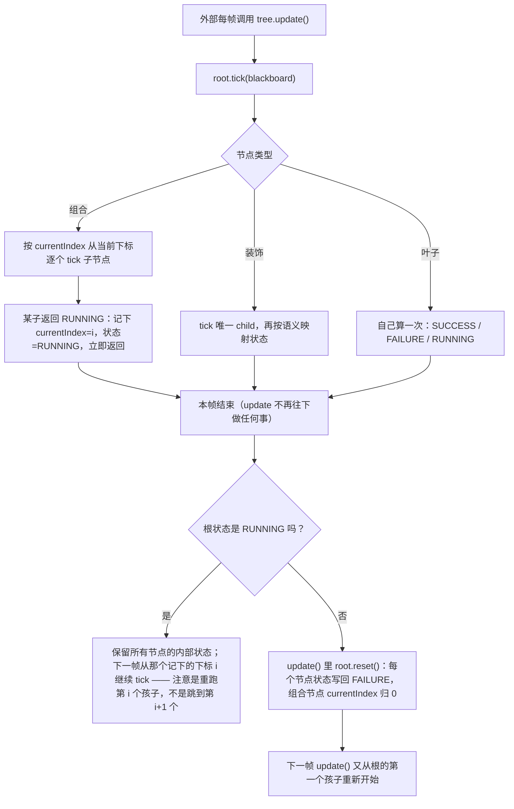
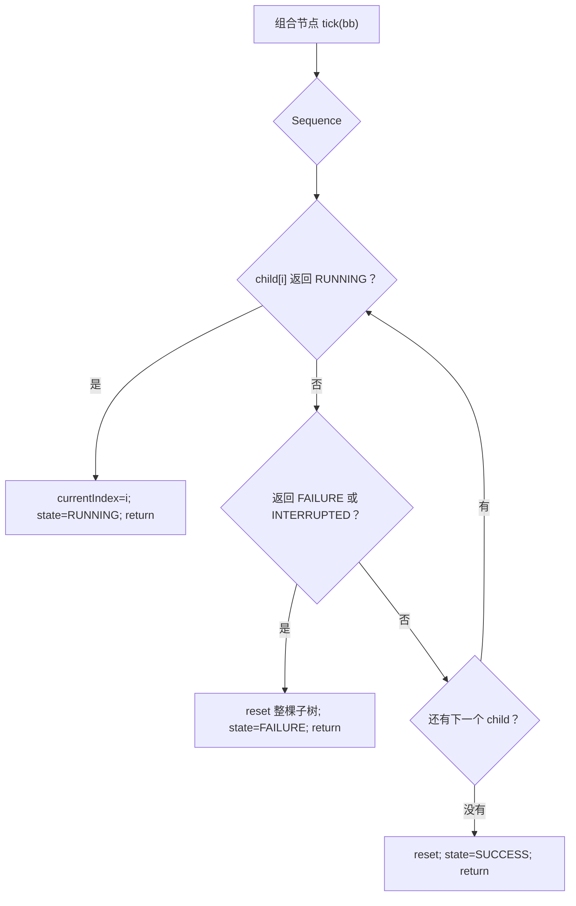
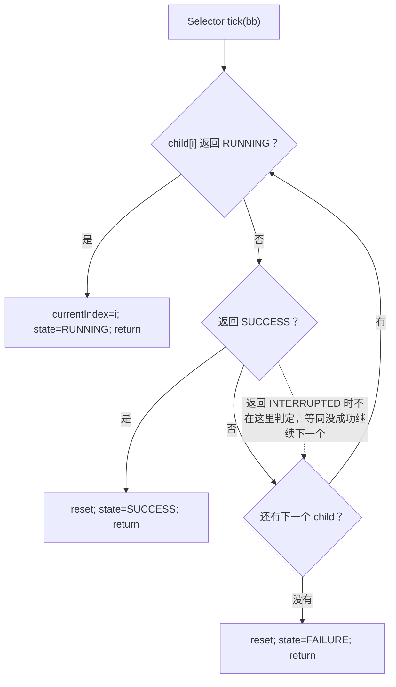
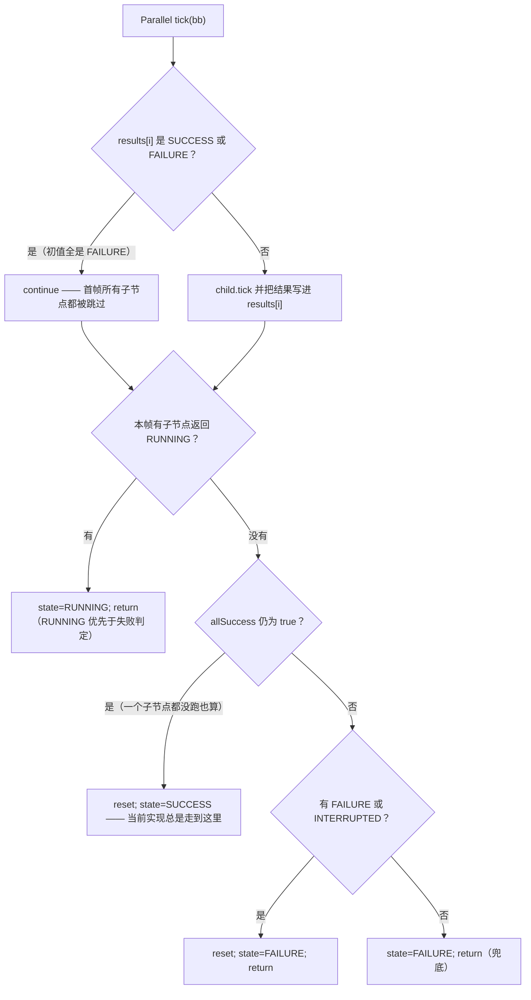
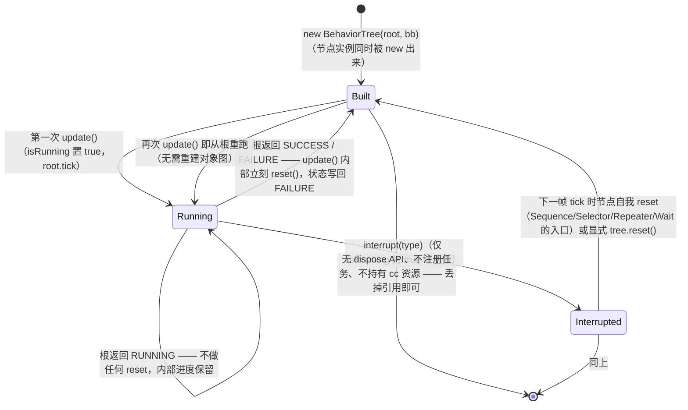

# 行为树（behavior）

> 源码：`assets/scripts/platform/behavior/` ｜ 平台层教程第 5 章

## 1. 一句话说明 / 什么时候用

行为树把「每帧该做什么决策」拆成一棵**组合节点 / 装饰节点 / 叶子节点**组成的树：每帧从根 `tick` 一次，叶子节点返回 `SUCCESS` / `FAILURE` / `RUNNING` 三种状态并沿树向上传播，由组合节点决定「继续下一个兄弟 / 立即返回 / 记住进度下次接着来」（`BTNode.ts:16`、`BTState.ts:2-7`）。

适合用的场景：

- 决策天然是「分优先级尝试」的：先试 A，A 不成立再试 B（`Selector.ts:9`）。
- 决策天然是「一串有先后顺序的步骤」：靠近 → 起手 → 收招（`Sequence.ts:9`）。
- 需要**跨帧持续**的行为：一次 tick 做不完，返回 `RUNNING`，下次接着做（`Wait.ts:24-37`）。
- 想让 AI/流程**从 JSON 配置**搭出来，而不是写死在代码里（`BTLoader.ts:16-35`、`BTLoader.ts:80-89`）。

不适合用的场景：

- 只有两三个状态互相跳转 —— 用 `platform/fsm/` 更直白（对比见 `docs/fsm-tutorial.md:935`）。
- 需要**随时抢占**当前行为（技能打断、嘲讽切目标）—— 这套实现的"抢占"只有 `interrupt()` 一条路径，且必须在树处于运行中调用（`BehaviorTree.ts:33-38`），详见 §8。
- 需要并行分支 —— `Parallel` 目前**一次都不会执行子节点**（`Parallel.ts:15` + `Parallel.ts:31`，实测见 §8 第 2 条）。

> ⚠️ **先读这一句再往下**：本工程里行为树**没有被任何游戏逻辑使用**，是平台层「备而未用」的能力。工程里的怪物 AI 是 `assets/scripts/game/battle/ai/` 的一套**独立实现**，两者目前**互不相干**（证据与 grep 结论见 §6）。

## 2. 源码地图

| 文件 | 行数 | 职责 |
|---|---|---|
| `BTNode.ts` | 33 | 节点基类：`tick` / `interrupt` / `reset` 三个抽象方法 + `getState` / `getName` |
| `BTState.ts` | 7 | 状态枚举 `SUCCESS` / `FAILURE` / `RUNNING` / `INTERRUPTED`（字符串枚举） |
| `InterruptType.ts` | 7 | 中断类型枚举 `NONE` / `CONDITIONAL` / `PRIORITY` / `FORCED` |
| `Blackboard.ts` | 29 | 黑板：`Map<string, any>` + `set/get/has/delete/clear` |
| `BehaviorTree.ts` | 58 | 树本体：`update()` / `interrupt()` / `reset()` / `getBlackboard()` / `isTreeRunning()` / `getRootState()` |
| `composite/CompositeNode.ts` | 24 | 组合节点基类（`children` + `addChild` + 递归 `reset`） |
| `composite/Sequence.ts` | 62 | 顺序：依次跑，全成功才成功；记住 `currentIndex` |
| `composite/Selector.ts` | 62 | 选择：跑到第一个成功；记住 `currentIndex` |
| `composite/Parallel.ts` | 97 | 并行：**当前实现有缺陷**，见 §4.2 与 §8 |
| `decorator/DecoratorNode.ts` | 17 | 装饰节点基类（`child` + 递归 `reset`） |
| `decorator/Inverter.ts` | 40 | 取反：`SUCCESS`↔`FAILURE`，`RUNNING`/`INTERRUPTED` 透传 |
| `decorator/Repeater.ts` | 76 | 重复 N 次或无限次 |
| `decorator/SubTree.ts` | 46 | 子树：持有一整棵 `BehaviorTree` |
| `action/Action.ts` | 22 | 动作基类：只给 `interrupt`/`reset` 默认实现，`tick` 仍要自己写 |
| `action/Wait.ts` | 54 | 等待节点（用 `Date.now()` 墙钟计时） |
| `condition/Condition.ts` | 34 | 条件节点：构造时传一个 `(bb) => boolean` 谓词 |
| `BTLoader.ts` | 266 | JSON → 树的加载器 + 条件/动作两个静态注册表 |
| `demo.ts` | 323 | 5 个可跑示例 + 3 个示例动作 + 模块级注册（**没有被打包引用**） |

目录里**没有 `index.ts` 统一导出**，也没有挂 `@ccclass` 的组件 —— 全部按相对路径显式 import。

## 3. 快速上手

### 3.1 手写一棵最小树

第一步：写一个自定义 Action。继承 `Action` 就只需实现 `tick`（`interrupt` / `reset` 有默认实现，`Action.ts:13-21`）：

```ts
// assets/scripts/game/xxx/MyMoveAction.ts
import { Action } from '../../platform/behavior/action/Action';
import { Blackboard } from '../../platform/behavior/Blackboard';
import { BTState } from '../../platform/behavior/BTState';

export class MyMoveAction extends Action {
    constructor(name: string, private speed = 1) { super(name); }
    tick(bb: Blackboard): BTState {
        const t = bb.get<{ x: number }>('target');
        if (!t) return (this.state = BTState.FAILURE);
        if (Math.abs(t.x) <= 1) return (this.state = BTState.SUCCESS);
        t.x -= this.speed;
        return (this.state = BTState.RUNNING);
    }
}
```

> `this.state` 在基类里是 `protected`（`BTNode.ts:8`），子类可以直接写。**返回值必须与 `this.state` 一致** —— 父节点读的是 `tick` 的返回值，而 `BehaviorTree.update()` 读的是 `getState()`（`BehaviorTree.ts:23-26`），两者不一致会得到互相矛盾的结论。

第二步：组装 `Selector → Sequence → Condition / Action`（`new` 节点时就把实例组装好，树一旦建成结构不变）：

```ts
import { BehaviorTree } from '../../platform/behavior/BehaviorTree';
import { Blackboard } from '../../platform/behavior/Blackboard';
import { Condition } from '../../platform/behavior/condition/Condition';
import { Sequence } from '../../platform/behavior/composite/Sequence';
import { Selector } from '../../platform/behavior/composite/Selector';
import { MyMoveAction } from './MyMoveAction';
```

```ts
const bb = new Blackboard();
bb.set('target', { x: 10 });

const root = new Selector('Root', [
    new Sequence('Attack', [                             // 分支 1：有目标 → 靠近
        new Condition('HasTarget', b => !!b.get('target')),
        new MyMoveAction('Move', 2),
    ]),
    new Condition('Idle', b => !b.get('target')),        // 分支 2：没目标 → 直接成功
]);
const tree = new BehaviorTree(root, bb);
```

第三步：驱动。**模块内没有任何调度器**（见 §6），必须你自己每帧调：

```ts
// 在某个 Cocos 组件的 update 里（见 §6 的驱动方案）
update(dt: number): void {
    this.bb.set('dt', dt);     // tick 签名里没有 dt，需要就从黑板取（BTNode.ts:16）
    this.tree.update();
}
```

`update()` 的行为是：`root.tick(bb)` → 若根状态不是 `RUNNING` 就 `reset()` 整棵树（`BehaviorTree.ts:18-30`）。所以**一棵会结束的树天然每帧从根重来**，不需要你在外部重建（实测：连续两次 `update()`，叶子动作各被 tick 一次）。

自定义 `Condition` 有两种写法：直接 `new Condition(name, bb => boolean)`（`Condition.ts:10-16`，谓词没法序列化），或把谓词注册进 `BTLoader` 按名字引用（见 3.2）。

### 3.2 用 `BTLoader` 从 JSON 加载同一棵树

先注册上面的自定义 Action（工厂函数签名固定为 `(name, params) => BTNode`，`BTLoader.ts:47`）：

```ts
BTLoader.registerAction('MyMoveAction', (name, params) =>
    new MyMoveAction(name, params.speed ?? 1));
BTLoader.registerCondition('hasTarget', bb => bb.get('target') !== undefined);
```

JSON 顶层**必须直接是节点对象**（`BTLoader.ts:80-89` 里 `parseNode(json)` 直接吃顶层）：

```json
{
  "type": "Selector",
  "name": "Root",
  "children": [
    { "type": "Sequence", "name": "Attack", "children": [
      { "type": "Condition", "name": "HasTarget", "expression": "target != null" },
      { "type": "Action", "name": "Move", "actionClass": "MyMoveAction",
        "actionParams": { "speed": 2 } }
    ]},
    { "type": "Condition", "name": "Idle", "expression": "!target" }
  ]
}
```

```ts
const tree = BTLoader.fromJson(json, bb);      // 也有 fromJsonString(str, bb)
tree.update();
```

> ⚠️ `demo.ts:267-294` 里的示例把 JSON 包成了 `{ "root": { ... } }`，**这与 `fromJson` 期望的形状不符**：顶层对象没有 `type` 字段 → 走 `BTLoader.ts:122-125` 的 default 分支 → 打一条 `未知的行为树节点类型: "undefined"` 并降级成一个永远 `FAILURE` 的 `Condition`。实测该示例树两次 `update()` 都返回 `FAILURE`。请照上面的形状写。

`BTJsonNode` 支持的字段（**逐字段照 `BTLoader.ts:16-35` 列全**）：

| 字段 | 类型 | 适用 `type` | 说明 |
|---|---|---|---|
| `type` | string | 全部（必填） | 白名单 9 种：`Sequence` / `Selector` / `Parallel` / `Inverter` / `Repeater` / `Condition` / `Wait` / `Action` / `SubTree`；未知值报错并降级（`BTLoader.ts:95-125`） |
| `name` | string | 全部（必填） | 节点名，只用于日志与 `getName()` |
| `children` | `BTJsonNode[]` | `Sequence` / `Selector` / `Parallel` | 缺省 `[]`（`BTLoader.ts:98-102,128-141`） |
| `child` | `BTJsonNode` | `Inverter` / `Repeater` | 缺了报错并用 dummy `Condition(false)`（`BTLoader.ts:143-159`） |
| `milliseconds` | number | `Wait` | 缺省 `0`（`BTLoader.ts:114`） |
| `conditionName` | string | `Condition` | 优先按注册表查；未注册则往下走 `expression`（`BTLoader.ts:161-166`） |
| `expression` | string | `Condition` | 见下方一段的运算符清单（`BTLoader.ts:169-190`） |
| `repeatCount` | number | `Repeater` | 缺省 `0` —— **0 次意味着子节点一次都不跑**（`BTLoader.ts:158` + `Repeater.ts:31-34`） |
| `infinite` | boolean | `Repeater` | 缺省 `false`；为 `true` 时忽略 `repeatCount`（`Repeater.ts:31,42`） |
| `actionClass` | string | `Action` | 必填，查 `actionRegistry`；未注册报错降级（`BTLoader.ts:232-246`） |
| `actionParams` | object | `Action` | 原样传给工厂函数（`BTLoader.ts:245`） |
| `subTree` | `BTJsonNode` | `SubTree` | **内联子树**，唯一可用的子树写法（`BTLoader.ts:249-253`） |
| `subTreePath` | string | `SubTree` | ⚠️ **未实现**：报「暂未支持，需要配合 resources.load」并换成 dummy（`BTLoader.ts:256-260`） |

`expression` 支持的写法（`BTLoader.ts:197-230`）：`key ==值`、`!=`、`>`、`<`、`>=`、`<=`（值支持 `null` / `true` / `false` / 整数与小数）、`!!key`、`!key`，以及裸 `key`（等价 `!!key`）。字符串值不支持（正则只把数字字面量转成 `number`），要比较字符串请用 `conditionName` 注册评估器。

## 4. API 速查

### 4.1 `BTNode` 基类契约（`BTNode.ts:6-33`）

| 成员 | 签名 | 说明 |
|---|---|---|
| `tick` | `abstract tick(blackboard: Blackboard): BTState` | 每次被 tick 调用一次；**返回值必须与 `this.state` 一致** |
| `interrupt` | `abstract interrupt(blackboard: Blackboard, type: InterruptType): void` | 只有正在 `RUNNING` 的节点会真正响应（各实现里都是 `if (this.state === BTState.RUNNING)`） |
| `reset` | `abstract reset(): void` | 状态归位。**没有** `onStart` / `onEnd` / `onEnter` / `onExit` 钩子 —— 需要"进入/退出"语义就自己用 `state !== RUNNING` 判断 |
| `state` | `protected state: BTState = BTState.FAILURE` | 初值是 `FAILURE`（不是 `NONE`） |
| `name` | `protected name: string` | 构造时传入 |
| `interruptType` | `protected interruptType: InterruptType = InterruptType.NONE` | ⚠️ **死字段**：全工程只有这一处出现（grep `interruptType` 仅命中 `BTNode.ts:9`），没有任何节点读写它 |
| `getState()` / `getName()` | `BTState` / `string` | 唯一的公开读取口 |

关于 `InterruptType`（`InterruptType.ts:2-7`）：4 个枚举值目前**只是标签**。节点只是把 `type` 原样往子节点传（`Sequence.ts:48-56`、`Parallel.ts:80-90`、`Inverter.ts:34-38`），**没有任何形态判断**（grep `InterruptType.` 只命中 `BTNode.ts:9` 的默认值与 `BehaviorTree.ts:33` 的默认参数）—— `CONDITIONAL` / `PRIORITY` / `FORCED` 的行为差别**尚不存在**。

### 4.2 组合节点：`Sequence` / `Selector` / `Parallel`

共同点：都继承 `CompositeNode`，都持有 `children: BTNode[]`、有 `addChild()`、`reset()` 会把自己的状态写回 `FAILURE` 并递归 `reset` 每个子节点（`CompositeNode.ts:7-23`）。

| | `Sequence`（全成功才成功） | `Selector`（首个成功即成功） | `Parallel`（并行，**有缺陷**） |
|---|---|---|---|
| 循环起点 | `currentIndex`（`Sequence.ts:23`） | `currentIndex`（`Selector.ts:23`） | 从 0 开始，跳"已完成"的（`Parallel.ts:29-33`） |
| 子返回 `RUNNING` | 记住 `currentIndex = i`，状态 `RUNNING`，立即返回（`Sequence.ts:28-32`） | 同左（`Selector.ts:28-32`） | 记进 `results[i]`，继续 tick 后面的兄弟（`Parallel.ts:36-42`） |
| 子返回 `SUCCESS` | 继续下一个兄弟 | `reset()` + 状态 `SUCCESS` 立即返回（`Selector.ts:35-39`） | 记进 `results[i]` |
| 子返回 `FAILURE` | `reset()` + 状态 `FAILURE` 立即返回（`Sequence.ts:35-39`） | 继续下一个兄弟 | 记进 `results[i]`，**不立即返回** |
| 子返回 `INTERRUPTED` | 与 `FAILURE` 同等对待（`Sequence.ts:35`） | **不判断**：当"没成功"处理，继续下一个兄弟（`Selector.ts:35` 只认 `SUCCESS`）—— 与 `Sequence` 口径不一致 | 与 `FAILURE` 同等对待（`Parallel.ts:45`） |
| 全部跑完 | `reset()` + `SUCCESS`（`Sequence.ts:43-45`） | `reset()` + `FAILURE`（`Selector.ts:43-45`） | 见下 |
| `interrupt()` | 透传给 `children[currentIndex]`，自身 `INTERRUPTED`（`Sequence.ts:48-56`） | 同左（`Selector.ts:48-56`） | 透传给所有 `results[i] === RUNNING` 的子节点（`Parallel.ts:80-90`） |

**`Parallel` 的成功/失败判据（源码 + 实测）**：判定顺序是「任一 `RUNNING` → `RUNNING`」（`Parallel.ts:56-59`）→「本帧 tick 过的子节点全 `SUCCESS` → `SUCCESS`」（`Parallel.ts:62-66`）→「任一 `FAILURE`/`INTERRUPTED` → `FAILURE`」（`Parallel.ts:69-73`）。**但真正的行为是：它一次都不会 tick 子节点，永远直接返回 `SUCCESS`**：

- 构造与 `reset` 时 `results` 被填满 `BTState.FAILURE`（`Parallel.ts:15`、`Parallel.ts:94`）；
- 而 `FAILURE` 同时又是"已完成、跳过"的哨兵（`Parallel.ts:31`）；
- 于是**首帧所有子节点都命中 `continue`**，`allSuccess` 保持初始值 `true`（`Parallel.ts:25`），直接落到 `Parallel.ts:62-66` 返回 `SUCCESS` 并 `reset`（`results` 又被填回 `FAILURE`）→ 每帧如此。

实测（两个子节点分别返回 `RUNNING` / `FAILURE`，连 tick 两帧）：两次都返回 `SUCCESS`，两个子节点的 `tick` 调用次数均为 **0**。另外 `allFinished`（`Parallel.ts:11`、`Parallel.ts:95`）是只在构造/重置里被写的**死字段**。**结论：当前版本不要使用 `Parallel`。**

### 4.3 装饰节点：`Inverter` / `Repeater` / `SubTree`

基类 `DecoratorNode`（`DecoratorNode.ts:5-17`）：持单个 `child`，`reset()` 把自己的状态写回 `FAILURE` 并递归 `reset` 子节点（**不清理子类自己的字段**，所以 `Repeater` 覆写了 `reset`）。

| 节点 | 构造参数 | 语义 |
|---|---|---|
| `Inverter` | `(name = "Inverter", child: BTNode)` | `SUCCESS`↔`FAILURE` 互换；`RUNNING` / `INTERRUPTED` 原样透传（`Inverter.ts:16-29`） |
| `Repeater` | `(name = "Repeater", child: BTNode, repeatCount = 0, infinite = false)` | 见下 |
| `SubTree` | `(name: string, childTree: BehaviorTree)` | 持有一整棵 `BehaviorTree`（`SubTree.ts:8-14`）；**注意它是直接继承 `BTNode`，不是 `DecoratorNode`** |

`Repeater` 的真实语义（`Repeater.ts:24-63`）：

- 入口先查 `!infinite && currentCount >= repeatCount` → 直接 `SUCCESS`，**不 tick 子节点**（`Repeater.ts:31-34`）。所以 `repeatCount = 0`（JSON 缺省值）时子节点**永远不会执行**；
- 子返回 `SUCCESS` → `currentCount++`；达到次数则 `SUCCESS`，否则 `RUNNING`（`Repeater.ts:39-47`）；
- **每帧最多推进一次重复**，所以 `infinite: true` 不会把一帧卡死（实测：无限重复每帧 tick 子节点 1 次、恒返回 `RUNNING`）；
- 子返回 `FAILURE` → 直接 `FAILURE`（`Repeater.ts:49-51`）；`RUNNING`/`INTERRUPTED` 透传（`Repeater.ts:53-59`）；
- 到达次数返回 `SUCCESS` 后 **不会自动清零** `currentCount`，要继续用必须依赖父节点的 `reset()` 链（`Repeater.ts:72-75`）。

`SubTree` 的真实语义（`SubTree.ts:16-33`）：

- `tick` 里调用 `this.childTree.update()`，然后把子树根的状态当作自己的状态返回（`SubTree.ts:25-32`）；
- **黑板只有在自己被中断过之后才会被换成父黑板**：`if (this.state === BTState.INTERRUPTED) { ...; this.childTree["blackboard"] = blackboard; }`（`SubTree.ts:18-22`，用的是硬写私有字段的写法，没有公开的 `setBlackboard`）。正常路径下子树用的是它自己的空黑板 → **父黑板的键在子树里读不到**（实测：父黑板有 `target` 时，子树里的 `expression: "target != null"` 仍判 `FAILURE`）。正确做法是构造子树时就把黑板传进去：`new BehaviorTree(subRoot, sharedBB)`。

### 4.4 叶子节点：`Action` / `Wait` / `Condition`

- `Action`（`Action.ts:7-21`）：抽象基类，`tick` 仍需子类实现；只把 `interrupt`（`RUNNING` → `INTERRUPTED`）与 `reset`（→ `FAILURE`）做成了默认实现。**它没有任何"动作回调""持续时间"之类的内置字段** —— 要进度就自己加字段并在 `reset` 里清干净。
- `Wait`（`Wait.ts:9-53`）：**直接继承 `BTNode`，不是 `Action`**（所以 `Wait` 不是 `Action` 的子类型，`instanceof Action` 判不出它）。构造 `(name = "Wait", waitTime: number)`，单位毫秒；首帧启动计时并返回 `RUNNING`（`Wait.ts:24-29`），到期返回 `SUCCESS`（`Wait.ts:31-34`）；计时用 `Date.now()` **墙钟**（`Wait.ts:25`、`Wait.ts:31`），因此**不受游戏暂停 / 顿帧影响**。
- `Condition`（`Condition.ts:7-33`）：`(name, condition: (bb: Blackboard) => boolean)`；只返回 `SUCCESS`/`FAILURE`，永不 `RUNNING`；`interrupt` 是空实现（`Condition.ts:27-29`）。

### 4.5 `Blackboard`（`Blackboard.ts:2-29`）

| 方法 | 签名 | 说明 |
|---|---|---|
| `set` | `<T>(key: string, value: T): void` | 写入 |
| `get` | `<T>(key: string): T \| undefined` | 读取，未设置返回 `undefined`（`has` 与 `get !== undefined` 等价，`BTLoader.ts:173-188` 的表达式就是按这个口径判的） |
| `has` | `(key: string): boolean` | 存在性 |
| `delete` | `(key: string): void` | 删除 |
| `clear` | `(): void` | 清空 |

就是一个 `Map<string, any>`（`Blackboard.ts:3`）：**无类型约束、无命名空间、无作用域隔离**，所有共享同一实例的节点都读写同一批键。`SubTree` 默认还各持一份（见 §4.3）。

### 4.6 `BehaviorTree`（`BehaviorTree.ts:7-58`）

| 成员 | 签名 | 说明 |
|---|---|---|
| `constructor` | `(root: BTNode, blackboard: Blackboard = new Blackboard())` | 黑板可选；不传就自建一个（`BehaviorTree.ts:12-15`） |
| `update` | `(): void` | `root.tick(bb)`；若根状态非 `RUNNING` 则 `reset()`（`BehaviorTree.ts:18-30`）。**无返回值**，且**内部 tick 频率由调用方决定** |
| `interrupt` | `(type: InterruptType = InterruptType.FORCED): void` | 仅当 `isRunning === true` 时生效：`root.interrupt` + `isRunning = false`（`BehaviorTree.ts:33-38`）。**首次 `update()` 之前调用是空操作** |
| `reset` | `(): void` | `root.reset()` + `isRunning = false`（`BehaviorTree.ts:41-44`） |
| `getBlackboard` | `(): Blackboard` | 只读口，**没有 `setBlackboard`** |
| `isTreeRunning` | `(): boolean` | 上次 `update()` 留下的是否运行中 |
| `getRootState` | `(): BTState` | ⚠️ `update()` 内部已 `reset` 掉非 `RUNNING` 的结果，所以**它只会返回 `RUNNING` 或 `FAILURE`**（实测：根成功的那一帧，`update()` 之后读到的也是 `FAILURE`） |

### 4.7 `BTLoader` 的注册与节点工厂机制（`BTLoader.ts:49-89`）

- 两个**静态**注册表：`conditionRegistry: Map<string, (bb) => boolean>`（`BTLoader.ts:50`）与 `actionRegistry: Map<string, (name, params) => BTNode>`（`BTLoader.ts:51`）。
- `registerCondition(name, evaluator)` / `unregisterCondition(name)`（`BTLoader.ts:54-64`）；`registerAction(className, factory)` / `unregisterAction(className)`（`BTLoader.ts:67-77`）。重复注册会 `LogMgr.warn("... 已注册，将被覆盖")` 并**直接覆盖**（`BTLoader.ts:55-58`、`BTLoader.ts:68-71`）。
- 静态表意味着它是**进程级全局状态**：注册一次，所有树共享；测试或换局时若不 `unregister`，上一次的工厂会残留。
- 解析时的降级策略（**全部只打日志，不抛异常**）：未知 `type` → `Condition(name, () => false)`（`BTLoader.ts:122-125`）；`Action` 缺 `actionClass` 或未注册 → 同上（`BTLoader.ts:232-246`）；`Condition` 既无 `conditionName` 也无 `expression`、或表达式不匹配 → 打 `warn` + `false`（`BTLoader.ts:192-194`）；`Inverter`/`Repeater` 缺 `child`、`SubTree` 缺 `subTree` → 用 dummy 兜住（`BTLoader.ts:143-159`、`BTLoader.ts:248-265`）。
- 因此**配置写错不会报错崩，只会静默变成"永远失败"** —— 调试时先看控制台有没有上面这些 `Error`/`Warning`（§9）。

## 5. 生命周期与流程图

### 5.1 单次 `tick` 的状态传播：Running 时下次从哪继续



**「下次从哪继续」的准确答案**：`Sequence` 与 `Selector` **确实保存执行位置**（各自的 `currentIndex`，`Sequence.ts:10`、`Selector.ts:10`），恢复时**重新 tick 那个返回过 `RUNNING` 的子节点本身**（`Sequence.ts:23`、`Sequence.ts:29`），而不是跳过它、也不是从它的下一个开始。叶子节点**不保存任何位置**——它只是被再调一次，进度得自己保管（`Wait` 靠 `isWaiting` + `startTime`，`Wait.ts:11-12`）。`Parallel` 名义上用 `results[]` 记"已结束"，但实际一次都不 tick 子节点（§4.2）。

### 5.2 三种组合节点的判定分支







### 5.3 整棵树的生命周期



要点：**没有"启动 / 停止"概念**，`update()` 既启动也推进；**没有销毁流程**（整个模块不 import `cc`、不 `schedule`、不持有 `Node`，见 §6）；**`isRunning` 只在 `update()` 里被置 `true`、在 `interrupt()`/`reset()` 里被置 `false`**（`BehaviorTree.ts:19-21`、`BehaviorTree.ts:36`、`BehaviorTree.ts:43`），所以它的语义其实是"上一次 update 后根是不是还在 RUNNING"。

## 6. 与 Cocos 生命周期的关系

**① 纯 TS，完全不依赖 `cc`。** 在 `assets/scripts/platform/behavior/` 下 grep `from "cc"` → **0 命中**。整个目录唯一的目录外依赖是 `BTLoader.ts:13` 的 `import { LogMgr } from "../log/LogMgr"`，而 `LogMgr.ts` 自身也没有 import `cc`（只用 `window.console`）。所以这棵树可以脱离引擎跑（本文的实测就是在 Node 里直接跑的）、可以在纯逻辑单测里跑。

**② 没有内置调度器 —— 必须外部每帧驱动。** 在该目录下 grep `schedule` / `setInterval` / `director.getScheduler` → **0 命中**。`BehaviorTree` 只暴露 `update()`（`BehaviorTree.ts:18`），谁调、多久调一次由你决定。可选的驱动点：

| 方案 | 写法 | 代价 |
|---|---|---|
| 组件 `update(dt)` | 在某个 `@ccclass` 组件里 `this.tree.update()` | 跟帧率走；受 `director` 暂停影响。工程的战斗就是这样驱动的（`Scene_Game_Stage.ts:1104` 的 `update`） |
| `TimeMgr` 定时循环 | `TimeMgr.ins.startLoop(cb, interval)`（`platform/time/TimeMgr.ts:37-42`） | 组件级 `schedule`，间隔固定、与帧不同步；`TimeMgr.ins` 在组件 `onLoad` 前是 `null`（`TimeMgr.ts:14-19`） |
| 自己按 dt 累加 | 在组件 `update` 里累加 dt，够一个固定步长再 `tree.update()` | 逻辑帧率与渲染解耦，但要自己防"一帧补多步" |

注意 `tick(blackboard)` 的签名里**没有 `dt`**（`BTNode.ts:16`），而 `Action.ts` 也没有任何时间字段 —— 需要时间的节点只能自己从黑板取 `dt`（外部每帧 `bb.set('dt', dt)`），或者像 `Wait` 那样直接用墙钟（`Wait.ts:25`）。

**③ 结论：行为树目前是平台层备而未用的能力 —— 工程里的怪物 AI 是 `game/battle/ai/` 的独立实现。**

grep 证据（全工程 `.ts`，模式 `BTLoader|BehaviorTree|BTNode|Blackboard|BTState|InterruptType`）：共 **246 处匹配，全部落在 `assets/scripts/platform/behavior/` 目录内**，目录外**一处都没有**。补充佐证：

- 跨目录 import 检索（模式含 `platform/behavior`、`behavior/`）在 `.ts` 里**0 命中**；命中的只有文档（`docs/游戏开发术语速查手册.md:667`、`docs/fsm-tutorial.md:948`）和编辑器工具配置（`settings/tool-manager.json`）。
- `demo.ts` 导出的 5 个工厂函数（`createSampleBehaviorTree` / `createComplexBehaviorTree` / `createTreeWithSubTree` / `createTreeFromJson` / `createTreeWithExpression`）在 `behavior/` 目录外**没有任何引用**（grep 命中全部在 `demo.ts` 自身）。
- 该目录没有 `index.ts` barrel，也没有 `@ccclass` 组件，所以场景/预制件也不可能通过挂脚本的方式用到它。

**④ 和 `game/battle/ai/` 是什么关系：并存，但目前互不相干（不是替代关系）。** 两套东西的对照：

| | `platform/behavior/`（行为树） | `game/battle/ai/`（怪物 AI） |
|---|---|---|
| 形态 | 节点树 + 黑板 + JSON 加载器 | 一个抽象基类 + 5 个脚本类 + 一张注册表 |
| 基类/入口 | `BTNode`（`BTNode.ts:6`） | `MonsterAI`（`MonsterAI.ts:26`，抽象方法只有 `update(dt)`） |
| 注册机制 | `BTLoader.registerAction/registerCondition`（静态 Map） | `AIRegistry.registerAI`（静态 Map，`AIRegistry.ts:25-31`） |
| 配置来源 | 节点树 JSON（`BTLoader.ts:16-35`） | `units.json` 的 `"ai": { "type": "chase", "params": {...} }`（`AIRegistry.ts:10-14`） |
| 每帧驱动 | **没有人调用** `update()` | `Scene_Game_Stage.update`（`Scene_Game_Stage.ts:1104`）→ `ctx.Tick`（`Scene_Game_Stage.ts:1275`）→ `Entity.Tick` → `this.ai?.update(dt)`（`Entity.ts:478`） |
| 实例化 | 无 | `BattleContext.CreateEntityFromDef` → `AIRegistry.create(...)`（`Entity.ts:158`） |
| 注册调用点 | 无 | `initializeAI()`（`game/battle/ai/index.ts:17-23`），由 `Scene_Game_Stage.ts:40` 导入调用 |

也就是说：怪物 AI 走的是「**AI 脚本对象 + 数据表 type 字段**」这条路，完全没有经过行为树。`MonsterAI` 提供的工具方法是 `findTarget` / `moveToward` / `tryAttack`（`MonsterAI.ts:63`、`MonsterAI.ts:109`、`MonsterAI.ts:138`），AI 子类在 `update(dt)` 里手写 if-else 决策。

如果以后要**用行为树接管某类怪物**，最小改法是新增一个 `MonsterAI` 子类（例如 `BTAI extends MonsterAI`），在 `update(dt)` 里把 `dt` 与目标写进黑板再 `tree.update()`，然后 `AIRegistry.registerAI('bt', BTAI)`、`units.json` 里给对应怪物写 `"ai": {"type": "bt"}` —— 这条路径**不需要**改行为树本身，但**目前工程里没有这份代码**（`[推断]`：这是"并存接入"的推荐姿势，不是既有事实）。

**⑤ 旁证**：平台层另一套 AI 决策模块 `platform/fsm/` 同样没人用，源码里已经写明了这一点（`assets/scripts/game/game_stage/states/HeroSelectionState.ts:8-9`：「本状态机当前**没有任何调用方**（`fsm_core` 只被 `fsm_hierarchical` 引用，后者无人使用），保留仅为 FSM 框架示例」）。所以"平台层备而未用"在本工程是有先例的常态，别看到目录存在就以为它在跑。

## 7. 典型组合用法

### 7.1 `demo.ts` 里有什么（5 个可跑示例）

| 示例 | 位置 | 结构 | 备注 |
|---|---|---|---|
| `createSampleBehaviorTree()` | `demo.ts:15-43` | `Selector( Attack: Sequence[HasTarget, MoveTo→target, Attack→target] , Patrol: Sequence[Patrol, Wait 2000ms] )` | 最贴近"打怪 or 巡逻"的骨架；黑板一开始是空的 |
| `createComplexBehaviorTree()` | `demo.ts:150-197` | `Selector( 低血: Sequence[IsLowHealth, Selector[Flee, Heal] ], 交战: Sequence[HasTarget, MoveTo, Attack], 巡逻: Sequence[Patrol, Wait] )` | 三段优先级；黑板预置 `health = 100`、`safeLocation = "Base Camp"`（`demo.ts:194-195`） |
| `createTreeWithSubTree()` | `demo.ts:237-248` | `Selector( CombatSeq, SubTree(巡逻子树) )` | ⚠️ 子树是用 `new BehaviorTree(patrolSeq)` 建的（`demo.ts:233`），**拿到的是自己的空黑板**（`SubTree.ts:19-21` 只在被中断时才同步父黑板） |
| `createTreeFromJson()` | `demo.ts:267-294` | 用 `BTLoader.fromJsonString` 加载 `Selector(低血/交战)` | ⚠️ JSON 被包成 `{root: {...}}`，形状错了（§3.2），实际解析成"未知类型"降级节点 |
| `createTreeWithExpression()` | `demo.ts:297-323` | `Selector( Flee: 条件 health < 30 , Pursue: 条件 enemyCount > 0 )` | 同样有 `{root:...}` 问题；另外它引用的 `MoveToAction` 读的是黑板键 `target`（`demo.ts:56`），而这个示例从没往黑板写 `target` → 即使形状对了也会 `FAILURE` |

另外注意三点：

- 三个示例动作（`MoveToAction` / `AttackAction` / `PatrolAction`，`demo.ts:45`、`demo.ts:80`、`demo.ts:113`）都是**直接 `extends BTNode`**，各自手写了一遍一模一样的 `interrupt` / `reset`（`demo.ts:68-77`、`demo.ts:101-110`、`demo.ts:136-146`）；只有 `Wait` 里 `import { Action }`（`demo.ts:1`）却**没被用到**（`Wait` 继承的是 `BTNode`）。
- 模块被 import 时会**立刻执行注册副作用**：`BTLoader.registerAction(...)` × 3、`registerCondition(...)` × 2（`demo.ts:253-265`）。也就是说你只要 import 这个文件，全局注册表就被写入了。
- 自测函数 `testBehaviorTree()` 的调用被注释掉了（`demo.ts:224` 的 `// testBehaviorTree();`），所以**没有任何示例会自动跑**。

### 7.2 从 demo 到实战该怎么改

1. **换基类**：示例动作把 `interrupt`/`reset` 抄了三遍，实战里应当 `extends Action`（`Action.ts:7-21`）只写 `tick`，需要额外清理再覆写 `reset`。
2. **黑板里放"引用 + 每帧快照"，不要放值**：`target` 这类每帧会变的东西必须每帧刷新（外部驱动时 `bb.set('target', currentTarget)`），别指望节点的构造参数能追上变化。
3. **别把决策写进节点构造期**：节点构造发生在建树那一刻，`Condition` 的谓词是运行时求值（`Condition.ts:19`），但 `Condition` 的**字符串参数**（如 `targetKey`）是构造期固定的，配置化时用 `actionParams` 传。
4. **配置外置**：把树写成 JSON 放 `assets/resources/`，用 `BTLoader.fromJsonString` + 启动时 `registerAction/registerCondition`（`demo.ts:253-265` 就是这套骨架，只是注册点应在你的初始化流程里而不是 demo 模块里）。注意 JSON 顶层必须是节点对象。
5. **接上每帧驱动**：按 §6 选一个驱动点；要有 `dt` 就先 `bb.set('dt', dt)`。
6. **别用 `Parallel`，别依赖 `getRootState()` 判成败**（§4.2、§4.6）。
7. **子树共享黑板**：`new SubTree(name, new BehaviorTree(subRoot, sharedBB))`，别依赖 `SubTree` 内部那次只在中断路径发生的黑板替换。

## 8. 注意事项与坑

**1. 现象：`RUNNING` 的节点每帧被重跑，副作用重复触发。**
原因：`BehaviorTree.update()` 每帧无条件 `root.tick(...)`（`BehaviorTree.ts:23`），而 `Sequence`/`Selector` 恢复时**重跑那个还在 `RUNNING` 的子节点**（`Sequence.ts:23-32`）。所以任何"只应发生一次"的副作用（播动画、喊话、扣蓝）只要写在 `tick` 顶部就会每帧触发 —— `demo.ts:63` 的 `MoveToAction` 每帧打一条 "Moving to target" 就是这个现象。
正确做法：把进度与"是否已经启动过"放进节点自己的字段，并在 `tick` 入口按状态分支（`Wait.ts:24-29` 是标准写法：`if (!this.isWaiting) { 启动; return RUNNING; }`）；或把一次性副作用放在第一次返回 `RUNNING` 之前的分支里。

**2. 现象：`Parallel` 永远返回 `SUCCESS`，子节点一次都没执行。**
原因：`results` 在构造与 `reset` 里被填成 `BTState.FAILURE`（`Parallel.ts:15`、`Parallel.ts:94`），而 `FAILURE` 同时是"已完成、跳过"的哨兵（`Parallel.ts:31`）→ 首帧全部 `continue` → `allSuccess` 保持 `true`（`Parallel.ts:25`）→ 直接 `SUCCESS`（`Parallel.ts:62-66`）。实测：两个子节点 `RUNNING`/`FAILURE`，两帧都返回 `SUCCESS`，子节点 tick 次数为 0。
正确做法：**不要用 `Parallel`**。真需要并行语义就自己写一个组合节点（把初值改成 `RUNNING`，或另加一个独立的 `finished: boolean[]` 记录"是否结束"），或者把"并行"拆成由 `Sequence` 每帧依次驱动的两个短动作。

**3. 现象：`SubTree` 里读不到父级的黑板键（条件恒 `false`）。**
原因：`SubTree.tick` 只在 `this.state === BTState.INTERRUPTED` 时才 `this.childTree["blackboard"] = blackboard`（`SubTree.ts:18-22`）；正常路径下子树用的是自己 `new BehaviorTree(root)` 自带的空黑板（`BTLoader.ts:252` 内联子树也是这么建的）。实测：父黑板有 `target`，子树内 `expression: "target != null"` 仍判 `FAILURE`。
正确做法：构造子树时就传入共享黑板 `new BehaviorTree(subRoot, sharedBB)`；同时注意共享黑板意味着**键名会互相踩**（`Blackboard` 没有命名空间），子树与父树请用不同前缀的键。

**4. 现象：`Repeater` 的子节点一次都不执行（配了 `"type": "Repeater"` 就卡住）；或 `infinite` 之后整棵树永远不结束。**
原因：`repeatCount` 在 JSON 里缺省是 `0`（`BTLoader.ts:155`、`BTLoader.ts:158`），而 `Repeater.tick` 开头就是 `if (!infinite && currentCount >= repeatCount) → SUCCESS`（`Repeater.ts:31-34`），0 次直接成功且**不 tick 子节点**（实测：子节点调用次数 0）。另一半是 `infinite: true` 时子节点每次 `SUCCESS` 都返回 `RUNNING`（`Repeater.ts:42-47`），树就永远没有"完成"这一帧。
正确做法：永远显式写 `repeatCount`；无限重复只放在**根节点**（没有父节点需要它结束），或者用 `interrupt()` 从外部收尾。顺带一个好消息：`Repeater` 每帧最多推进一次，所以 `infinite` **不会把一帧卡死**（实测：每帧只 tick 子节点 1 次）。

**5. 现象：同一个动作实例挂到两处（或第二局复用同一棵树），行为诡异、状态残留。**
原因：节点全是**有状态对象**（`BTNode.ts:8` 的 `state`、`Sequence.ts:10` / `Selector.ts:10` 的 `currentIndex`、`Repeater.ts:10` 的 `currentCount`、`Wait.ts:11-12` 的计时字段），而"清理"的唯一入口是 `reset()`；更麻烦的是**父节点每帧完成时就会递归 `reset` 子节点**（`Sequence.ts:36`、`Sequence.ts:43`、`CompositeNode.ts:20-23`），所以你的 `reset()` 会在你没预期的时机被调。
正确做法：**一个节点实例只属于一棵树**；每次重建/换局整棵重建（`new` 一遍，成本极低）；自定义节点的所有跨帧字段都必须在 `reset()` 里清零。（实测：用一个"内部计数到 2 才返回 `SUCCESS`"的自定义节点，同一个实例先被 A 树 tick 一次得到 `RUNNING`，再被另一棵 B 树 tick 一次就直接 `SUCCESS` 了。）

**6. 现象：用 `getRootState()` 判断"这次成功了吗"，永远拿到 `FAILURE`。**
原因：`update()` 在根状态非 `RUNNING` 时立即 `reset()`（`BehaviorTree.ts:26-29`），而 `reset()` 把节点状态写回 `FAILURE`（`CompositeNode.ts:21`、`Condition.ts:32`、`Action.ts:20`）。实测：根返回 `SUCCESS` 的那一帧，`update()` 之后 `getRootState()` 读到的仍是 `FAILURE`、`isTreeRunning()` 为 `false`。
正确做法：结果不要靠轮询根状态，改成「叶子动作自己把结果写进黑板 / 触发回调 / 发事件」，外部只读那个结果；`getRootState()` 只在**树正在跑的时候**（`RUNNING`）有意义。

**7. 现象：运行中的分支"粘住"，前面的条件不再复检 —— 目标出现了也不切分支。**
原因：`Selector`/`Sequence` 用 `currentIndex` 记住位置（`Selector.ts:23`、`Selector.ts:28-32`），恢复时从该下标继续，**不再回头 tick 前面已经失败过的兄弟**。实测两件事：① 一个 `Selector(恒失败条件, 恒 RUNNING 动作)` 连跑 3 帧，条件只被 tick 了 **1** 次；② 用 `demo.ts` 的示例树，先无目标跑一帧（进入巡逻分支、`Wait 2000ms` 返回 `RUNNING`），随后往黑板设 `target` 再跑两帧，`MoveTo` 触发次数仍是 **0**；等到 `Wait` 到期那一帧也还是 0，**再下一帧**才切到攻击分支。
正确做法：把条件放在 `Selector` 前部、把分支做**短**（不要把几十秒的等待挂在分支里）；需要"随时抢占"就用 `interrupt()` + 外部重新决策（注意必须在树运行中调用，`BehaviorTree.ts:34`），或者让长动作以短周期返回并在条件变化时主动返回 `FAILURE` 退出分支。

**8. 现象：游戏暂停 / 顿帧时，`Wait` 照样到期。**
原因：`Wait` 用 `Date.now()` 墙钟计时（`Wait.ts:25`、`Wait.ts:31`），完全不看游戏时间；而 `tick` 签名里根本没有 `dt`（`BTNode.ts:16`）。
正确做法：需要受暂停影响的等待，自己写一个 dt 累加的动作节点，`dt` 由驱动方每帧 `bb.set('dt', dt)` 注入；用 `Wait` 时要知道它认的是真实时间。

**9. 现象：控制台出现 `未知的行为树节点类型: "undefined"` / `未注册的自定义动作`，树看起来"什么都不做"。**
原因：`BTLoader` 所有失败路径都是**记日志 + 降级成永远 `FAILURE` 的 `Condition`**，不抛异常（`BTLoader.ts:122-125`、`BTLoader.ts:232-246`、`BTLoader.ts:192-194`）。最常见的两种触发：JSON 顶层被包了一层（`demo.ts:268-292` 的 `{root: ...}` 就是反例），或忘了 `registerAction`。
正确做法：树"没反应"先看日志有没有这几条 `Error`/`Warning`；配置检查顺序 = `type` 拼写 → 顶层形状 → 节点所需字段（`child` / `children` / `actionClass`）→ 注册表是否已注册。

**10. 现象：`Selector` 对子节点 `INTERRUPTED` 的处理和 `Sequence` 不一样。**
原因：`Sequence` 把 `INTERRUPTED` 与 `FAILURE` 同等对待（`Sequence.ts:35`），而 `Selector` 只判 `RUNNING` 和 `SUCCESS`（`Selector.ts:28`、`Selector.ts:35`），子节点返回 `INTERRUPTED` 时它**继续尝试下一个兄弟**，既不重置也不失败。
正确做法：不要依赖 `INTERRUPTED` 在组合节点之间的传播语义；中断后统一由外部 `tree.reset()` 收尾，或自己实现组合节点时统一口径。（`[推断]`：这更像实现遗漏而非设计约定，因为 `Sequence`/`Selector` 两份代码除此以外完全对称。）

## 9. 调试手段

1. **先看日志。** `BTLoader` 的每条降级路径都留了痕迹（`BTLoader.ts:123`、`BTLoader.ts:145`、`BTLoader.ts:153`、`BTLoader.ts:185`、`BTLoader.ts:192`、`BTLoader.ts:235`、`BTLoader.ts:241`、`BTLoader.ts:257`、`BTLoader.ts:262`），重复注册也会 `warn`（`BTLoader.ts:55-58`、`BTLoader.ts:68-71`）。"树没反应"八成是这里先报过。
2. **读状态**：`node.getName()` + `node.getState()`（`BTNode.ts:25-32`）就是全部公开信息；`BehaviorTree` 侧只有 `getRootState()` 与 `isTreeRunning()`（`BehaviorTree.ts:52-57`），而它们**在树跑完那一帧都会是 `FAILURE`/`false`**（§4.6）—— 别拿它当"结果"。
3. **打黑板快照**：`tree.getBlackboard()`（`BehaviorTree.ts:47-49`）拿到实例后 `has/get` 逐键打印（`Blackboard.ts:11-18`）。排查"条件为什么假"最快的一步就是它。
4. **加计数哨兵**：临时写一个 `class Probe extends BTNode { tick(){ this.calls++; ... } }`（`BTNode.ts:6-33` 的三个抽象方法都实现掉），插到可疑位置，用调用次数回答"这个分支到底有没有执行"。本文 §4.2 / §8 的几处结论就是这么测出来的（`Parallel` 的子节点计数是 0）。
5. **在 Node 里脱离引擎跑**：整个模块不依赖 `cc`（§6），所以可以用 TypeScript 的 `transpileModule` 把它编译进内存直接 `require` —— 无需 Cocos 编辑器就能复现"接不接得住状态"的问题（`npx tsc --noEmit` 只做类型检查，验不出这些运行期语义）。
6. **驱动侧打点**：因为没有任何内置调度器，`update()` 的调用次数完全由你控制 —— 在驱动处加计数，能立刻区分"树逻辑错"和"根本没人驱动它"。
7. **想遍历整棵树做可视化**：`children` / `child` 都是 `protected`（`CompositeNode.ts:7`、`DecoratorNode.ts:6`），模块里**没有** `getChildren()` 之类的访问口。真要打印整棵树，得自己写一个包在树内部的递归函数，或对节点做类型断言后读私有字段（会破坏封装，`[推断]`：不推荐，建议用哨兵节点定位）。

## 10. 事实依据

1. `assets/scripts/platform/behavior/BTState.ts:2-7` —— 4 个状态：`SUCCESS` / `FAILURE` / `RUNNING` / `INTERRUPTED`（字符串枚举）。
2. `assets/scripts/platform/behavior/BTNode.ts:6-33` —— 抽象基类，只有 `tick` / `interrupt` / `reset` 三个抽象方法 + `getState()` / `getName()`；**没有 `onStart`/`onEnd` 之类的钩子**。
3. `assets/scripts/platform/behavior/BTNode.ts:8` —— `protected state: BTState = BTState.FAILURE`（初值是 FAILURE）。
4. `assets/scripts/platform/behavior/BTNode.ts:9` —— `interruptType` 字段；grep 全工程仅此一处命中，是死字段。
5. `assets/scripts/platform/behavior/BTNode.ts:16` —— `abstract tick(blackboard: Blackboard): BTState`（**没有 dt 参数**）。
6. `assets/scripts/platform/behavior/InterruptType.ts:2-7` —— `NONE` / `CONDITIONAL` / `PRIORITY` / `FORCED`；grep `InterruptType.` 全工程只有两处：`BTNode.ts:9`（字段默认值）与 `BehaviorTree.ts:33`（方法默认参数），**没有一处按类型分支**。
7. `assets/scripts/platform/behavior/Blackboard.ts:2-29` —— `Map<string, any>` + `set` / `get` / `has` / `delete` / `clear`。
8. `assets/scripts/platform/behavior/BehaviorTree.ts:12-15` —— 构造 `(root, blackboard = new Blackboard())`。
9. `assets/scripts/platform/behavior/BehaviorTree.ts:18-30` —— `update()`：`root.tick(bb)`，根状态非 `RUNNING` 就 `reset()`。
10. `assets/scripts/platform/behavior/BehaviorTree.ts:33-38` —— `interrupt(type = FORCED)` 只在 `isRunning` 为真时生效。
11. `assets/scripts/platform/behavior/BehaviorTree.ts:41-44` —— `reset()`：`root.reset()` + `isRunning = false`。
12. `assets/scripts/platform/behavior/composite/Sequence.ts:23-45` —— 从 `currentIndex` 续跑；`RUNNING` 记住下标并返回；`FAILURE`/`INTERRUPTED` → reset + FAILURE；全成功 → reset + SUCCESS。
13. `assets/scripts/platform/behavior/composite/Selector.ts:28-45` —— `RUNNING` 记住下标返回；`SUCCESS` → reset + SUCCESS；否则继续下一个；全失败 → FAILURE（**不判 `INTERRUPTED`**）。
14. `assets/scripts/platform/behavior/composite/Parallel.ts:15` 与 `:31` 与 `:62-66` —— `results` 初值 `FAILURE` 同时是"已完成"哨兵 → 首帧全跳过 → `allSuccess` 恒真 → 直接 SUCCESS。
15. `assets/scripts/platform/behavior/composite/Parallel.ts:11`、`:95` —— `allFinished` 死字段。
16. `assets/scripts/platform/behavior/composite/CompositeNode.ts:20-23` —— `reset()` 把自己写回 `FAILURE` 并递归 reset 所有子节点。
17. `assets/scripts/platform/behavior/decorator/Inverter.ts:16-29` —— `SUCCESS`↔`FAILURE`，`RUNNING`/`INTERRUPTED` 透传。
18. `assets/scripts/platform/behavior/decorator/Repeater.ts:31-34` —— `repeatCount` 为 0 时首帧即 `SUCCESS` 且不 tick 子节点；`:39-47` 每帧只推进一次重复。
19. `assets/scripts/platform/behavior/decorator/SubTree.ts:18-22` —— 只有自身 `INTERRUPTED` 时才把父黑板硬写进子树；`:8` 它继承的是 `BTNode` 而不是 `DecoratorNode`。
20. `assets/scripts/platform/behavior/action/Action.ts:13-21` —— `Action` 只提供 `interrupt` / `reset` 默认实现，`tick` 仍抽象。
21. `assets/scripts/platform/behavior/action/Wait.ts:9` 与 `:25` 与 `:31` —— `Wait extends BTNode`（不是 `Action`），用 `Date.now()` 墙钟计时。
22. `assets/scripts/platform/behavior/condition/Condition.ts:10-16` 与 `:27-29` —— 构造传 `(bb) => boolean`；`interrupt` 空实现。
23. `assets/scripts/platform/behavior/BTLoader.ts:16-35` —— `BTJsonNode` 的全部字段（`type` / `name` / `children` / `child` / `milliseconds` / `expression` / `conditionName` / `repeatCount` / `infinite` / `actionClass` / `actionParams` / `subTreePath` / `subTree`）。
24. `assets/scripts/platform/behavior/BTLoader.ts:49-77` —— 两个静态注册表 + 注册/注销 + 重复注册 `warn` 后覆盖。
25. `assets/scripts/platform/behavior/BTLoader.ts:80-89` —— `fromJson` / `fromJsonString`：**顶层直接是节点对象**。
26. `assets/scripts/platform/behavior/BTLoader.ts:92-126` —— 9 种 `type` 白名单；未知类型报错并降级为 `Condition(() => false)`。
27. `assets/scripts/platform/behavior/BTLoader.ts:151-159` —— `Repeater` 的 `repeatCount ?? 0`、`infinite ?? false`。
28. `assets/scripts/platform/behavior/BTLoader.ts:161-194` —— 条件解析优先级 `conditionName` → `expression` → 警告 + `false`。
29. `assets/scripts/platform/behavior/BTLoader.ts:197-230` —— 表达式支持的运算符与 4 条正则（裸 `key` 等价 `!!key`）。
30. `assets/scripts/platform/behavior/BTLoader.ts:232-246` —— `Action` 必须注册 `actionClass`，否则报错降级。
31. `assets/scripts/platform/behavior/BTLoader.ts:248-265` —— `SubTree` 只支持内联 `subTree`；`subTreePath` 明确"暂未支持"。
32. `assets/scripts/platform/behavior/demo.ts:15-43` / `:150-197` / `:237-248` / `:267-294` / `:297-323` —— 5 个示例树；`:253-265` 模块级注册副作用；`:224` 自测调用被注释。
33. `assets/scripts/platform/behavior/demo.ts:268-292` —— 示例 JSON 的 `{root: {...}}` 包裹（与 `BTLoader.ts:80-95` 期望形状不符）。
34. grep `BTLoader|BehaviorTree|BTNode|Blackboard|BTState|InterruptType`（全工程 `*.ts`）→ 246 处匹配**全部在 `assets/scripts/platform/behavior/` 内**，目录外 0 处；grep `platform/behavior` / `behavior/` 在 `.ts` 里 0 命中（仅 `docs/游戏开发术语速查手册.md:667`、`docs/fsm-tutorial.md:948`、`settings/tool-manager.json`）。
35. 目录内 grep `from "cc"` → 0 命中；唯一的目录外依赖是 `BTLoader.ts:13` 的 `../log/LogMgr`，`LogMgr.ts` 自身也无 `cc` 依赖。
36. 目录内 grep `schedule` / `setInterval` / `director.getScheduler` → 0 命中（无内置调度器）。
37. `assets/scripts/game/battle/ai/MonsterAI.ts:26-50` —— 怪物 AI 基类：`onAttach` / `onDetach` / `abstract update(dt)`。
38. `assets/scripts/game/battle/ai/AIRegistry.ts:25-44` —— `registerAI` / `create`（按 `units.json` 的 `ai.type` 造实例）。
39. `assets/scripts/game/battle/ai/index.ts:17-23` —— `initializeAI()` 注册 `chase` / `wander` / `orbit` / `attack_stop` / `boss`。
40. `assets/scripts/game/battle/Entity.ts:158` 与 `:478` —— 实体创建时 `AIRegistry.create` 挂 AI；`Entity.Tick` 里每帧 `this.ai?.update(dt)`。
41. `assets/scripts/game/ui/scenes/scene_game_stage/Scene_Game_Stage.ts:40`、`:1104`、`:1275` —— `initializeAI` 的导入，以及每帧 `update` → `ctx.Tick` 的驱动链。
42. `assets/scripts/game/game_stage/states/HeroSelectionState.ts:8-9` —— 平台层 FSM 同样"没有任何调用方"的既有先例。
43. `assets/scripts/platform/time/TimeMgr.ts:14-19`、`:37-42` —— `TimeMgr.ins` 与 `startLoop`（可选的另一种驱动方式）。
44. 运行期实测（本次用 TypeScript `transpileModule` 在 Node 内存里直接跑该目录源码）：`Sequence` 三帧 `RUNNING,RUNNING,SUCCESS` 且 `RUNNING` 的子节点被 tick 3 次、后继子节点只在最后一帧被 tick 1 次；`Selector(失败条件, RUNNING 动作)` 三帧后失败条件只被 tick 1 次；`Parallel` 两帧都 `SUCCESS` 且子节点 tick 0 次；`Repeater(count=0)` 子节点 tick 0 次；父黑板有 `target` 时 `SubTree` 内条件仍 `FAILURE`；`demo.ts` 的 `{root:...}` JSON 经 `fromJsonString` 得到恒 `FAILURE` 的树并打出"未知的行为树节点类型: undefined"；`Wait(30ms)` 隔 40ms 墙钟后由 `RUNNING` 转 `SUCCESS`。
