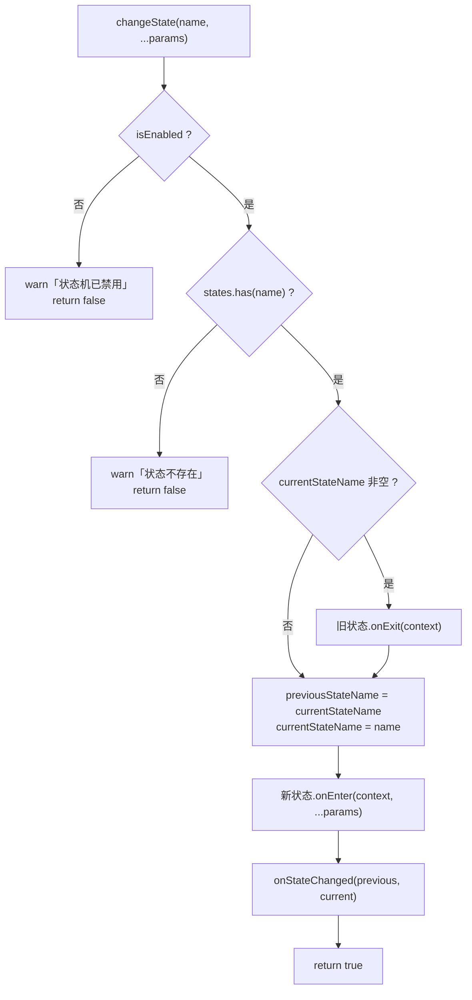
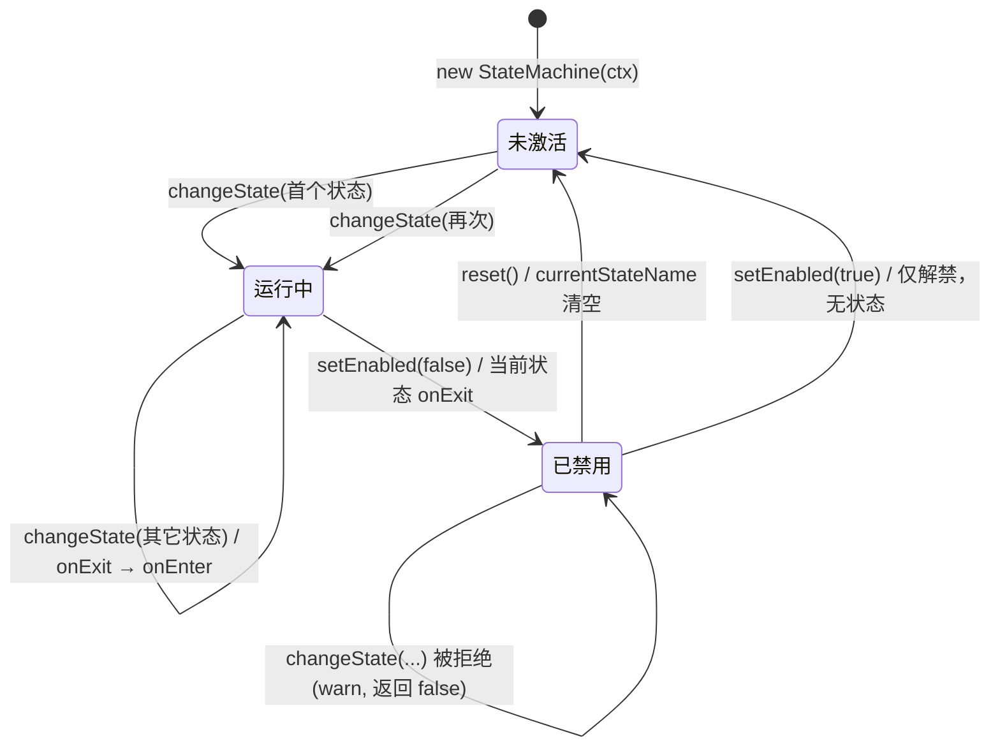
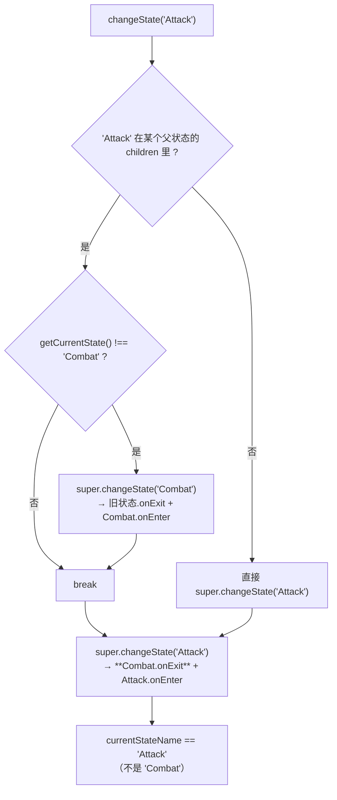

# 有限状态机（fsm）

> 源码：`assets/scripts/platform/fsm/` ｜ 平台层教程第 6 章
> 相关：`docs/fsm-tutorial.md`（**教学向长文**：从 if-else 一路讲到层级状态机，33KB）、`docs/agent-notes/技能与战斗系统.md`
> ⚠ **现状先说**：`StateMachine` 在本工程里**没有任何调用方**（源码注释 + 全工程 grep 双重证据，见 §1.2）。本章既讲"怎么用"，也讲清"为什么现在没人用"。

---

## 1. 一句话说明 / 什么时候用

`StateMachine<T>` 是一个**泛型 + 上下文（context）对象**的通用有限状态机：状态是对象（`IState<T>` 的实现），状态机持有一个 `context`（通常是某个 Cocos 组件），状态切换时调 `onEnter/onExit`，每帧由**外部**调用 `update(dt)` 转发给当前状态的 `onUpdate`。

**什么时候用**：
- 一个对象的行为随少数（3~8 个）**互斥**的大阶段整体改变，且每个阶段有自己的进入/退出副作用（进入战斗要开始刷怪、退出战斗要清场）；
- 这些阶段之间的迁移条件是**集中、可读**的（`if (hp <= 0) changeState('Dead')` 比散落各处的 `if` 好）。

**什么时候不要用**：
- 阶段多且转移矩阵稠密（→ 用行为树或表驱动）；
- 只是"每帧做不同的事"而没有进入/退出副作用（一个 `switch` 就够了）；
- 需要"同时处于多个状态"（→ 那是 ECS / 组件 / 标签系统）。

### 1.1 三个概念（`fsm_type.ts`）

| 概念 | 类型 | 说明 |
|---|---|---|
| 状态 | `IState<T>` | 三个**全是可选**的方法：`onEnter(context, ...params)` / `onUpdate(context, dt)` / `onExit(context)` |
| 可更新状态 | `IUpdatableState<T>` | `onUpdate` 变**必填** |
| 可输入状态 | `IInputState<T>` | 额外加可选 `onInput(context, inputType, data)` |
| 上下文 | 泛型 `T` | 状态机构造时传入，之后每个回调都把它传回去 —— 状态本身**不持有** context，所以状态可以被复用/无状态化 |

### 1.2 ⚠ 现状：这套状态机当前是"备而未用"

两条独立证据：

1. `assets/scripts/game/game_stage/states/HeroSelectionState.ts:7-13` 的注释原文：
   > ⚠ 本状态机当前**没有任何调用方**（`fsm_core` 只被 `fsm_hierarchical` 引用，后者无人使用），保留仅为 FSM 框架示例。
2. 全工程 grep：`StateMachine` / `changeState` / `registerState` / `HierarchicalStateMachine` 只出现在 `platform/fsm/*.ts` 里；`game/game_stage/states/{BattleState,HeroSelectionState,PauseState}.ts` **只 import 了 `fsm_type` 的 `IState` 接口**（实现接口不需要状态机）。

也就是说：**游戏侧的三个"状态类"只是实现了 `IState` 接口的形状，从来没有被任何状态机注册或驱动**。
局内阶段流转的真实实现在别处（`game/battle/` 的各个功能类 + `Scene_Game_Stage` 的 tick）。

> 结论：把这一章当**框架能力说明书**读；要真正启用，必须先在 `Scene_Game_Stage` 里把 `new StateMachine(this, [...])`、`sm.update(dt)` 和 `changeState(...)` 三件事接上（§7.1 给了完整配方）。

---

## 2. 源码地图

| 文件 | 职责 | 关键导出 |
|---|---|---|
| `fsm/fsm_type.ts` | 纯接口定义（29 行） | `IState<T>` / `IUpdatableState<T>` / `IInputState<T>` |
| `fsm/fsm_core.ts` | 状态机主体（206 行） | `StateMachine<T>`、`StateConfig<T>` |
| `fsm/fsm_hierarchical.ts` | 层级状态机（42 行） | `HierarchicalStateMachine<T>` |
| `game/game_stage/GameStateType.ts` | 游戏侧状态名枚举 + 上下文类 | `GameStateType`、`GameStageContext` |
| `game/game_stage/states/*.ts` | 三个示例状态实现 | `BattleState` / `HeroSelectionState` / `PauseState` |

⚠ `fsm_core.ts:4-5` 还**反向 import 了游戏侧**的 `GameStateType` 与 `HeroSelectionState`（且全文都没用到这两个符号）—— 这是平台层对业务层的一次多余依赖，见 §8。

---

## 3. 快速上手

```ts
import { StateMachine } from '../platform/fsm/fsm_core';
import { IState } from '../platform/fsm/fsm_type';

// 1) 上下文：状态之间共享的一切（通常是组件本身）
class Ctx { hp = 100; log: string[] = []; }

// 2) 状态：只实现需要的方法，context 每次都由状态机传进来
const Idle: IState<Ctx> = {
    onEnter: (c) => c.log.push('idle:enter'),
    onUpdate: (c, dt) => { if (c.hp <= 0) sm.changeState('Dead'); },
    onExit: (c) => c.log.push('idle:exit'),
};
const Dead: IState<Ctx> = {
    onEnter: (c) => c.log.push('dead:enter'),
};

// 3) 建机 + 注册 + 切换
const ctx = new Ctx();
const sm = new StateMachine<Ctx>(ctx);
sm.registerState('Idle', Idle);          // 重载 2：位置参数
sm.registerState({ name: 'Dead', state: Dead }); // 重载 1：配置对象
sm.changeState('Idle');

// 4) 每帧驱动（关键：状态机自己不会动）
update(dt: number) { sm.update(dt); }    // 放在组件的 update 里
```

在 Cocos 组件里落地时，`context` 一般就是组件自己：

```ts
@ccclass('Enemy')
export class Enemy extends Component {
    private sm!: StateMachine<Enemy>;
    onLoad() {
        this.sm = new StateMachine<Enemy>(this);
        this.sm.registerState('Chase', chaseState);
        this.sm.changeState('Chase');
    }
    update(dt: number) { this.sm.update(dt); }
    onDestroy() { this.sm.setEnabled(false); }  // 触发当前状态的 onExit
}
```

---

## 4. API 速查

### `StateMachine<T>`

| 签名 | 参数 | 返回 | 备注 |
|---|---|---|---|
| `new StateMachine(context, initialStates?)` | `context: T`；`initialStates?: StateConfig<T>[]` | — | 传了 `initialStates` 会立刻批量注册（`fsm_core.ts:32-37`）；**此时不会自动进入任何状态**，`currentStateName` 仍是 `''` |
| `registerState(config: StateConfig<T>)` | `{name, state, autoUpdate?}` | `void` | `autoUpdate` 缺省 `true`；显式 `false` 才关（`fsm_core.ts:67`） |
| `registerState(name, state, autoUpdate?)` | 位置参数版 | `void` | 重载实现见 `fsm_core.ts:52-78` |
| `registerStates(configs)` | `StateConfig<T>[]` | `void` | 循环调 `registerState` |
| `changeState(name, ...params)` | 状态名 + 任意参数 | `boolean` | `true` = 切成功；机被禁用或状态不存在时返回 `false` 且**只 warn 不抛错**（`fsm_core.ts:91-119`） |
| `update(dt)` | 秒 | `void` | 只在 `isEnabled && currentStateName` 且该状态 `autoUpdate !== false` 时调用 `onUpdate`（`fsm_core.ts:124-134`） |
| `handleInput(type, data?)` | 自定义输入类型 | `void` | 转发给当前状态的 `onInput`（该方法**不在 `IState` 接口里**，靠 `'onInput' in currentState` 运行时探测，`fsm_core.ts:139-146`） |
| `getCurrentState()` / `getPreviousState()` | — | `string` | 上一个状态名只在 `changeState` 里更新（`fsm_core.ts:109`） |
| `isState(name)` / `hasState(name)` | — | `boolean` | 前者比当前名，后者查注册表 |
| `setEnabled(bool)` | — | `void` | 置 `false` 时**会调用当前状态的 `onExit`**（`fsm_core.ts:179-185`）；再置 `true` **不会**自动回到任何状态 |
| `reset()` | — | `void` | 先 `onExit` 当前状态，再清空当前/上一个状态名，并把 `isEnabled` 恢复为 `true`（`fsm_core.ts:190-198`） |
| `getAllStateNames()` | — | `string[]` | 注册表 key 列表 |
| `onStateChanged` | 公开字段 `(from, to) => void`，默认 `null` | — | **在 `onEnter` 之后**触发（`fsm_core.ts:114-116`） |

`StateConfig<T>`：`{ name: string; state: IState<T>; autoUpdate?: boolean }`（`fsm_core.ts:11-15`）。

### `HierarchicalStateMachine<T>`

| 签名 | 说明 |
|---|---|
| `new HierarchicalStateMachine(context, parentSM?)` | `parentSM` 只被保存，**全类没有任何地方使用它**（`fsm_hierarchical.ts:9,14`） |
| `setParentChildRelation(parentState, childStates[])` | 声明"哪些子状态属于哪个父状态" |
| `changeState(name, ...params)` | 覆写：若 `name` 是某个父状态的子状态，则**先** `super.changeState(parent)`，**再** `super.changeState(child)` |

⚠ 这套层级语义有实现问题，见 §8 第 1 条。

---

## 5. 生命周期与流程图

### 5.1 一次 `changeState` 的完整链条



要点：
- **首次** `changeState` 时 `currentStateName` 为空 → **不会**调用任何 `onExit`（`fsm_core.ts:103` 的 `if (this.currentStateName)`）。
- `onStateChanged` 在 `onEnter` **之后**（`fsm_core.ts:116`），此时 `getCurrentState()` 已是新状态。
- `onExit` / `onEnter` 都是**同步**执行的；在 `onEnter` 里再 `changeState` 会**递归**切换（没有防重入，容易写死循环 —— §8 第 4 条）。

### 5.2 每帧驱动与状态自身的状态图

```mermaid
sequenceDiagram
    autonumber
    participant U as 组件.update(dt)
    participant SM as StateMachine
    participant S as 当前 IState
    U->>SM: update(dt)
    SM->>SM: isEnabled 且 currentStateName 非空 ?
    SM->>SM: autoUpdateMap.get(current) == false ?
    SM->>S: onUpdate(context, dt)
    Note over S: 状态的 onUpdate 里通常会调用<br/>sm.changeState(...) 触发迁移
    S->>SM: changeState('Next')
    SM->>S: onExit(context)
    SM->>SM: previous = current; current = 'Next'
    SM->>SM: 新状态.onEnter(context, ...)
    SM->>SM: onStateChanged(previous, 'Next')
    SM-->>U: 本次 update 结束（新状态要下一帧才 onUpdate）
```

注意时序细节：**切换发生在 `onUpdate` 内部时，同一帧不会再调用新状态的 `onUpdate`**（`update()` 里已经取好了 `currentState` 局部变量，`fsm_core.ts:127`），新状态最早在**下一帧**开始 update。



### 5.3 层级版本的真实流转（**与直觉不符，务必看**）

`setParentChildRelation('Combat', ['Chase', 'Attack'])` 之后：



两个后果：
1. 父状态的 `onEnter` 与 `onExit` 会在**同一次调用里**紧挨着执行（进入父状态只是为了立刻被 `onExit` 掉），父状态**不会**保持在激活位置。
2. 由于 `currentStateName` 最终是子状态，`update()` 只会驱动**子状态**的 `onUpdate`，**父状态的 `onUpdate` 永远不会跑**。

---

## 6. 与 Cocos 生命周期的关系

| 问题 | 答案 | 证据 |
|---|---|---|
| 状态机依赖 cc 吗？ | 只依赖 `warn` 一个函数（`fsm_core.ts:2` 从 `cc` import）。**它不是 Component，没有 onLoad/onEnable** | `fsm_core.ts:1-6` |
| 谁驱动它？ | **没人自动驱动**。`update(dt)` 必须由持有者在组件的 `update` 里显式调用；`handleInput` 同理 | `fsm_core.ts:121-123` 注释：「需要在外部调用，通常在组件的update中」 |
| 节点被 `active=false` 时？ | 组件的 `update` 不再被引擎调用 → **状态机的时钟随之冻结**，但 `currentStateName`、`onEnter` 的副作用（比如已启动的 schedule/tween）**不会自动清理** |
| 组件销毁时？ | 状态机**不会被通知**：没有 `onDestroy` 钩子。需要你自己在 `onDestroy` 里 `setEnabled(false)` 或 `reset()` 让当前状态收尾（否则它的定时器/监听会残留） |
| 状态里可以往 context 上挂节点吗？ | 可以（`T` 就是组件），但**状态对象本身不要持有节点**，否则节点销毁后状态仍被 `states` Map 引用 → 泄漏 |

> **与 Cocos 3.8 的 "生命周期" 呼应**：引擎的 `update` 是「节点激活 + 组件 enabled」才跑；状态机的 `update` 是「被调用才跑」。二者叠加时，
> **反激活 → 组件 update 停 → 状态机停在中途的半状态**。需要在 `onDisable` 里显式 `setEnabled(false)` 才能保证 `onExit` 一定被调到。

---

## 7. 典型组合用法

### 7.1 配方：把状态机真正接进 `Scene_Game_Stage`（当前工程未接）

```ts
// Scene_Game_Stage.onLoad()（伪代码，字段名以现有类为准）
this.fsm = new StateMachine<Scene_Game_Stage>(this);
this.fsm.registerStates([
    { name: GameStateType.HeroSelection, state: new HeroSelectionState(), autoUpdate: false },
    { name: GameStateType.Battle,        state: new BattleState() },        // 需要每帧
    { name: GameStateType.Pause,         state: new PauseState() },
]);
this.fsm.changeState(GameStateType.HeroSelection);

// 现成的 tick 里转发（注意：BattleState.onUpdate 已经在改 battleStore.phase，
// 接上之前要确认它和 Scene_Game_Stage 现有的阶段推进逻辑不会重复推进）
this.fsm.update(dt);

// 收尾
onDestroy() { this.fsm?.setEnabled(false); }
```

### 7.2 只借用接口、不用状态机

现有 `BattleState` / `PauseState` **就是这么干的**：它们 `implements IState<Scene_Game_Stage>`，
`battleStore = useBattleStore()` 在字段初始化时取（`BattleState.ts:14`、`PauseState.ts:11`），
逻辑由你自己在场景里直接调用 `onEnter/onUpdate`。这样做的代价是**没有注册表、没有迁移合法性检查**，好处是不用引入一个没人维护的调度层。

### 7.3 层级状态机的替代做法

既然 `HierarchicalStateMachine` 的父状态不会保持激活（§5.3），如果真需要层级语义，推荐：
- **嵌套两台机**：父机管大阶段，父状态的 `onEnter` 里创建/启动子机，`onExit` 里 `setEnabled(false)` 子机；
- 或者**把"父状态"降级为上下文上的一个字段**（`ctx.combatSubState`），父状态只做转发 —— 这就是现在 `Scene_Game_Stage` 的做法。

---

## 8. 注意事项与坑

1. **`HierarchicalStateMachine` 的父状态是"一次性"的**
   **现象**：`setParentChildRelation('Combat', ['Chase'])` 后 `changeState('Chase')`，`Combat.onEnter` 跑了一次，紧接着 `Combat.onExit` 也跑了，且 `Combat.onUpdate` 永远不执行。
   **原因**：覆写的 `changeState` 先进父状态、再进子状态，而 `super.changeState` 每次都会 `onExit` 当前状态（`fsm_hierarchical.ts:32-40`），`currentStateName` 最后落在子状态。
   **正确做法**：不要依赖父状态的存活；需要层级语义请用 §7.3 的替代方案。

2. **`registerState` 同名状态是"静默覆盖"**
   **现象**：重复注册同一个名字，只有一个生效，行为与预期不符。
   **原因**：`states.set(name, ...)` 直接覆盖，只打一条 `warn`（`fsm_core.ts:71-77`）。
   **正确做法**：注册集中在 `onLoad` 一处；需要热更就用显式 `hasState()` 判断。

3. **状态机不会自己收尾**
   **现象**：组件销毁后，某个状态启动的 `schedule`/监听仍在跑。
   **原因**：`StateMachine` 没有 `onDestroy` 概念，`setEnabled(false)`/`reset()` 才触发 `onExit`。
   **正确做法**：持有它的组件在 `onDestroy`（或 `onDisable`）里显式调用；状态的 `onExit` 里清自己开的东西。

4. **`onEnter` 里递归 `changeState` 无保护**
   **现象**：某个状态进入条件恒成立时，`changeState` 无限递归 → 栈溢出。
   **原因**：`changeState` 没有"切换中"标记，`onExit → onEnter → changeState → ...` 可以互相触发（`fsm_core.ts:102-118`）。
   **正确做法**：在 `onEnter` 里只做初始化；迁移判断放在 `onUpdate`（下一帧生效）；必要时自己加一个 `_switching` 守卫。`[推断]`（源码中确实没有守卫，但未见真实事故）

5. **`onUpdate` 里切换状态，新状态晚一帧**
   **现象**：切换后"新状态的第一帧"逻辑好像少跑了一帧。
   **原因**：`update()` 在方法开头就取好了 `currentState`，切换不会重新取（`fsm_core.ts:127-133`）。
   **正确做法**：把"进入即要做的事"放进 `onEnter`，不要指望同一帧的 `onUpdate`。

6. **`handleInput` 的 `onInput` 不在接口里**
   **现象**：状态实现了 `onInput` 但 TS 没提示、拼错方法名也不报错。
   **原因**：靠 `'onInput' in currentState` 运行时探测（`fsm_core.ts:143`），接口是 `IInputState<T>`（`fsm_type.ts:27-29`）才声明。
   **正确做法**：实现 `IInputState<T>` 以获得类型检查。

7. **平台层反向依赖业务层**
   **现象**：单独复用 `platform/` 到别的项目时编译失败。
   **原因**：`fsm_core.ts:4-5` import 了 `../../game/game_stage/GameStateType` 与 `.../HeroSelectionState`，两个符号在文件里**都没被使用**（纯死 import）。
   **正确做法**：新代码不要照抄；这一处可以直接删（本次未改动源码）。

8. **`setEnabled(true)` 不会重新 `onEnter` —— 解禁后是"半状态"**
   **现象**：`setEnabled(false)` 之后又 `setEnabled(true)`，`onUpdate` 确实又开始跑了，但 `onEnter` 没有配套地跑第二次，状态内部（例如已经退掉的定时器、已置空的引用）与代码假设不一致。
   **原因**：`setEnabled` 只改 `isEnabled` 布尔值；`setEnabled(false)` 会调 `onExit`，但**不清空** `currentStateName`（`fsm_core.ts:179-185`），而 `update` 只看 `currentStateName` 非空（`fsm_core.ts:124-134`）→ 解禁后继续驱动原来那个状态。
   **正确做法**：要么别用 `setEnabled` 做"暂停/恢复"（那是 `autoUpdate: false` 的用途），要么恢复时显式 `changeState(当前状态名)` 再走一遍 `onExit → onEnter`；要彻底归零用 `reset()` + `changeState(初始状态)`。

---

## 9. 调试手段

- **看状态**：`sm.getCurrentState()` / `sm.getPreviousState()` / `getAllStateNames()`；建议在状态机外面套一层日志：
  ```ts
  sm.onStateChanged = (from, to) => ezgame.debug(`[FSM] ${from || '(none)'} → ${to}`);
  ```
- **看注册**：`hasState(name)` 在 `changeState` 前断言一次，可以把"名字拼错导致静默 warn"变成显式失败。
- **断点**：`fsm_core.ts` 的 `changeState`（第 91 行）、`update`（第 124 行）、`setEnabled`（第 179 行）三处断点足以覆盖全部迁移。
- **自查"到底有没有被用"**：`grep -r "StateMachine" assets/scripts --include=*.ts` —— 当前答案：只有 `platform/fsm` 自己。

---

## 10. 事实依据

1. `assets/scripts/platform/fsm/fsm_type.ts:8-15` — `IState<T>` 的三个可选方法。
2. `assets/scripts/platform/fsm/fsm_type.ts:20-29` — `IUpdatableState` / `IInputState`。
3. `assets/scripts/platform/fsm/fsm_core.ts:11-15` — `StateConfig<T>` 字段与 `autoUpdate` 注释。
4. `assets/scripts/platform/fsm/fsm_core.ts:32-37` — 构造函数注册 `initialStates`，不自动进入状态。
5. `assets/scripts/platform/fsm/fsm_core.ts:52-78` — `registerState` 两种重载 + 同名覆盖 warn。
6. `assets/scripts/platform/fsm/fsm_core.ts:91-119` — `changeState` 的禁用/不存在/首次无 onExit/onStateChanged 时机。
7. `assets/scripts/platform/fsm/fsm_core.ts:124-134` — `update` 的 `autoUpdate` 判定与逐帧转发。
8. `assets/scripts/platform/fsm/fsm_core.ts:139-146` — `handleInput` 的运行时 `'onInput' in currentState` 探测。
9. `assets/scripts/platform/fsm/fsm_core.ts:179-185` — `setEnabled(false)` 触发 `onExit`。
10. `assets/scripts/platform/fsm/fsm_core.ts:190-198` — `reset()` 语义。
11. `assets/scripts/platform/fsm/fsm_core.ts:1-6` — 只从 cc 引入 `warn`；并反向引入 game 侧两个未使用符号。
12. `assets/scripts/platform/fsm/fsm_hierarchical.ts:12-15` — `parentStateMachine` 被保存但从未使用。
13. `assets/scripts/platform/fsm/fsm_hierarchical.ts:27-41` — 覆写的 `changeState` 双次 `super.changeState`。
14. `assets/scripts/game/game_stage/states/HeroSelectionState.ts:7-13` — 「本状态机当前没有任何调用方」注释。
15. `assets/scripts/game/game_stage/states/BattleState.ts:14,20-38` — 仅实现接口、自行读写 `useBattleStore`。
16. `assets/scripts/game/game_stage/states/PauseState.ts:11-25` — 同上；`adTime` 到 0 后置 `999999` 并留 TODO。
17. `assets/scripts/game/game_stage/GameStateType.ts:2-23` — 8 个状态名枚举 + `GameStageContext`。
