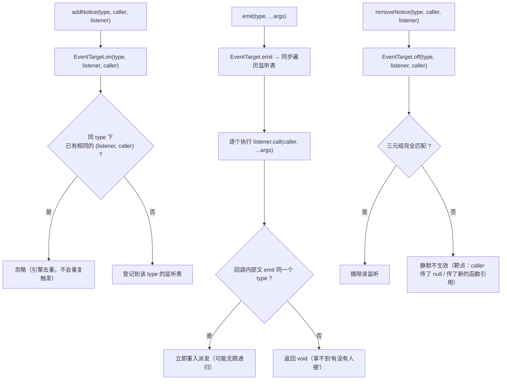
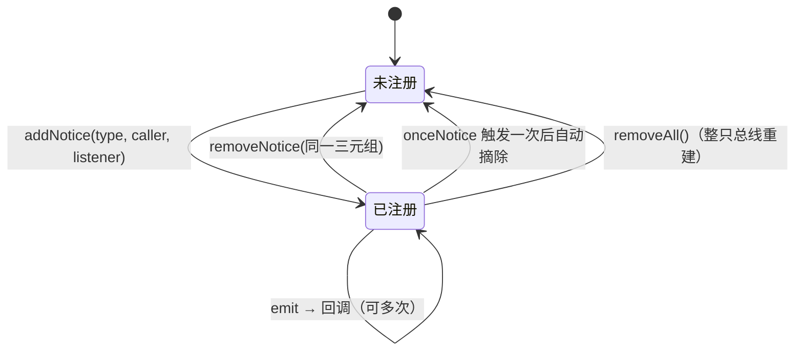

# 全局事件（event）

> 源码：`assets/scripts/platform/event/` ｜ 平台层教程第 7 章
> 相关：`docs/agent-notes/UI与表现层.md`（UI 通信规约）、`game/battle/core/EventBus.ts`（**战斗侧的另一个事件总线，不要混用**）

---

## 1. 一句话说明 / 什么时候用

`GlobalEventMgr` 是一个**进程级（全局单例）的字符串事件总线**，内部就是 Cocos 的 `cc.EventTarget`：

```ts
GlobalEventMgr.ins.emit('某事件', a, b);
GlobalEventMgr.ins.addNotice('某事件', this, this.onSomeEvent);   // 注意方法名：addNotice，不是 on
```

**什么时候用**：两个**互不认识**的模块需要一个信号通路，且这个信号**跨界面/跨层**（例：`UIManager` 播转场进度 → 转场视图接收），用直接引用会造成循环依赖。

**什么时候不要用**（本工程的铁律，见 `docs/UI框架使用说明.md` §7）：
- 父子/祖先-后代之间传状态 → 用 `UIScope` 的 `provide/inject`（向下）、`scope.emit/on`（向上）；
- 跨界面共享**数据** → 用 store；跨场景要落盘 → 用 `DataModule`；
- 战斗内部的 combat 事件 → 用 `game/battle` 的 `EventBus`（另一套，见 §7.3）。

> 一句话判据：**"这件事和 UI 层级无关、和战斗时序无关，但需要有人听见" → GlobalEventMgr。**

---

## 2. 源码地图

| 文件 | 职责 | 关键导出 | 行数 |
|---|---|---|---|
| `event/BaseEventMgr.ts` | 对 `cc.EventTarget` 的薄封装，定义 5 个方法 | `BaseEventMgr`（**default 导出**） | 29 |
| `event/GlobalEventMgr.ts` | 继承它 + 静态单例 | `GlobalEventMgr`（**具名导出**） | 11 |

工程内**真实**的收发点（全工程只有这一对）：

| 角色 | 位置 | 事件名 | 说明 |
|---|---|---|---|
| 发送方 | `platform/ui/UIManager.ts:219` | `'SCENE_LOAD_PROGRESS'` | 转场完成时 `emit(..., 1.0)` |
| 发送方 | `platform/ui/UIManager.ts:432` | `'SCENE_LOAD_PROGRESS'` | 转场开始时 `emit(..., 0)` |
| 接收方 | `game/ui/top/Top_ChangeScene.ts:196` | `'SCENE_LOAD_PROGRESS'` | `addNotice(..., this, this.onProgress)` |
| 接收方 | `game/ui/top/Top_ChangeScene.ts:200` | `'SCENE_LOAD_PROGRESS'` | `onDestroy` 里 `removeNotice(...)` |

⚠ 也就是说：**这套总线目前只服务转场进度这一件事**，而转场视图 `Top_ChangeScene` 当前**没有调用方**（见 `docs/UI框架使用说明.md` §3 与 §10）。所以从"实际在用"的角度看，`GlobalEventMgr` 目前是一条**备而未用的通路**。

另有 `game/game_stage/states/*.ts` 里 `import { GlobalEventMgr }` 的三处 —— **只 import 了类，没有任何调用**（`BattleState.ts:1`、`HeroSelectionState.ts:1`、`PauseState.ts:1`，三个文件全文都没有 `GlobalEventMgr.ins.*`）。

---

## 3. 快速上手

```ts
import { GlobalEventMgr } from '../platform/event/GlobalEventMgr';

/** 1) 定义事件名（建议统一放常量文件，见 §8 第 6 条） */
export const GameEvents = {
    PlayerDied: 'GAME_PLAYER_DIED',
} as const;

/** 2) 监听方：target 一定要传（通常是 this），否则退订会因为 target 不匹配而失效 */
@ccclass('HudController')
export class HudController extends Component {
    onLoad() {
        GlobalEventMgr.ins.addNotice(GameEvents.PlayerDied, this, this.onPlayerDied);
    }
    onDestroy() {
        GlobalEventMgr.ins.removeNotice(GameEvents.PlayerDied, this, this.onPlayerDied);
    }
    private onPlayerDied(reason: string) { /* ... */ }
}

/** 3) 发送方：任意位置，同步派发 */
GlobalEventMgr.ins.emit(GameEvents.PlayerDied, 'hp_zero');
```

---

## 4. API 速查

`BaseEventMgr`（`GlobalEventMgr` 原样继承，**没有新增任何方法**）：

| 签名（源码原文） | 参数 | 返回 | 备注 |
|---|---|---|---|
| `emit(type: string \| number, ...args: any[])` | 事件名 + 任意个参数 | `void` | 直接转发 `EventTarget.emit`，**同步**执行所有回调（`BaseEventMgr.ts:10-12`） |
| `addNotice(type, caller, listener)` | `caller` = 回调里的 `this` | `void` | 内部是 `EventTarget.on(type, listener, caller)`（`BaseEventMgr.ts:14-16`） |
| `removeNotice(type, caller, listener)` | 必须与 `addNotice` **同样的三元组** | `void` | 内部 `EventTarget.off(type, listener, caller)`（`BaseEventMgr.ts:18-20`） |
| `onceNotice(type, caller, listener)` | 同上 | `void` | 内部 `EventTarget.once(...)`：触发一次后自动摘除（`BaseEventMgr.ts:22-24`） |
| `removeAll()` | — | `void` | ⚠ **直接 `this._ed = new EventTarget()`** —— 把整只总线换掉，清空全部事件的全部监听（`BaseEventMgr.ts:26-28`） |

`GlobalEventMgr`：

| 成员 | 说明 |
|---|---|
| `GlobalEventMgr.ins` | 静态 getter，首次访问时 `new GlobalEventMgr()`（`GlobalEventMgr.ts:5-10`）。**没有 `ins` 之外的实例化入口，也没有销毁入口** |

### 4.1 底层 `cc.EventTarget` 的权威语义（来自引擎声明文件）

引擎自带声明文件 `C:\ProgramData\cocos\editors\Creator\3.8.6\resources\resources\3d\engine\bin\.declarations\cc.d.ts`（项目内 `temp/declarations/cc.d.ts` 只是指向它的 stub）里写得很清楚：

- `on(...)` 的参数注释原文：**"The callback is ignored if it is a duplicate (the callbacks are unique)."** → **同一 (type, callback) 重复注册不会重复触发**（第 62791 行）。
- `off(type, callback?, thisArg?)` 注释原文：**"if it's not given, only callback without target will be removed"**（第 62828 行）→ **退订时 `target` 必须与注册时一致**，否则删不掉。
- `off(type)` 只传事件名 → 删掉该类型的**全部**监听（第 62822-62824 行）。
- `emit(...)` 在 3.8.6 的声明里返回 **`void`**（第 62864 行），**不要**用返回值判断"有没有人接"。

---

## 5. 生命周期与流程图

### 5.1 注册 / 派发 / 退订



### 5.2 真实链路：转场进度的收发时序

```mermaid
sequenceDiagram
    autonumber
    participant U as UIManager
    participant G as GlobalEventMgr(单例)
    participant T as Top_ChangeScene(BaseView)

    Note over T: T 所在节点被实例化 → 组件 onLoad/start
    T->>G: addNotice('SCENE_LOAD_PROGRESS', this, this.onProgress)
    Note over G: 仅登记，不回调（没有"注册即回调"的语义）
    U->>G: emit('SCENE_LOAD_PROGRESS', 0)
    G->>T: onProgress(0)
    T->>T: tween(_progressProxy) → 更新 Label
    U->>G: emit('SCENE_LOAD_PROGRESS', 1.0)   // UIManager.ts:219
    G->>T: onProgress(1.0)
    T->>T: _startCompletion() → 播完动画后 this.node.active = false; destroy()
    Note over T: onDestroy
    T->>G: removeNotice('SCENE_LOAD_PROGRESS', this, this.onProgress)
```

**这条链路演示了两个使用要点**：
1. 监听方在 `doInit()`（`Top_ChangeScene.ts:196`）里注册，**只有在视图被真正使用时才会注册** —— 没有调用方时这条链路是断的。
2. 退订写在 `onDestroy`（`Top_ChangeScene.ts:199-201`），与注册严格成对。

### 5.3 监听者的状态图



---

## 6. 与 Cocos 生命周期的关系

| 问题 | 答案 | 证据 |
|---|---|---|
| 依赖 cc 吗 | 依赖 `cc.EventTarget`（唯一的引擎依赖），但 `GlobalEventMgr` **不是 Component**，没有 onLoad/onDestroy | `BaseEventMgr.ts:1,7` |
| 什么时候创建 | 第一次访问 `GlobalEventMgr.ins` 时（惰性单例），**不依赖任何场景或节点** | `GlobalEventMgr.ts:5-10` |
| 什么时候销毁 | **永不**。它是模块级静态单例，`director.loadScene()` 不会清它，也没有 dispose 接口（只有 `removeAll()` 换掉内部 EventTarget） | `GlobalEventMgr.ts:4-9`、`BaseEventMgr.ts:26-28` |
| 谁驱动 | 没人驱动，**同步派发**：`emit` 当场执行所有回调（与帧无关，也不受顿帧/暂停影响） | `BaseEventMgr.ts:10-12` |
| 与节点销毁的关系 | **没有关系** —— 节点销毁**不会**自动摘掉它的监听。忘了 `removeNotice` 的监听会在下次 `emit` 时**打到已销毁的组件上** | §8 第 2 条 |

> 与 UI 框架的对照：`UIScope`（`platform/ui/UIScope.ts`）**自带局部事件总线并随 scope.dispose 自动清空**；
> `GlobalEventMgr` 没有这层保护，属于"手动挡"。所以**界面内部通信不要用它**。

---

## 7. 典型组合用法

### 7.1 配方：需要跨层通知时的最小写法

```ts
// 约定：事件名走常量，target 一律传 this，注册与退订写在同一个文件里
onLoad()  { GlobalEventMgr.ins.addNotice(EVT.Refresh, this, this.refresh); }
onDestroy() { GlobalEventMgr.ins.removeNotice(EVT.Refresh, this, this.refresh); }
```

### 7.2 用 `onceNotice` 做"等一个信号"

```ts
// 等加载完成再开界面：比 Promise 更"便宜"，但只适合一次性点火
GlobalEventMgr.ins.onceNotice('SCENE_LOAD_PROGRESS', this, () => this.openPanel());
```

### 7.3 ⚠ 三套事件系统不要混用

| 系统 | 位置 | 作用域 | 谁负责清理 | 典型用途 |
|---|---|---|---|---|
| `GlobalEventMgr` | `platform/event/` | 进程级 | **你自己** | 转场进度这类跨层信号 |
| `EventBus` | `game/battle/core/EventBus.ts` | 战斗局内 | 战斗侧自己 | `combat:*` 命中/击杀/治疗 |
| `UIScope` 的 `on/emit` | `platform/ui/UIScope.ts` | 单个界面子树 | `scope.dispose()` 自动清 | 子组件 → 祖先的冒泡（例：列表项点一下，父面板处理） |

选错系统的代价：用 `GlobalEventMgr` 做界面内部通信 → 界面关了监听还在，下次开界面收到两份通知（因为 `UIScope` 会自动清、它不会）。

### 7.4 `EventKeys` 是什么关系

`assets/scripts/game/common/EventKeys.ts` 只是**事件名常量表**（`BattleState`/`HeroSelectionState`/`PauseState` 都 import 了它但没用到）。
常量表和总线是两件独立的事：**总线不校验事件名**，字符串写错不会报错，只会静默收不到。所以"事件名是否集中管理"完全靠约定。

---

## 8. 注意事项与坑

1. **`removeNotice` 的 `caller` 必须与 `addNotice` 一致**
   **现象**：写了 `removeNotice` 但下次 `emit` 回调还在跑（甚至报"访问已销毁节点"）。
   **原因**：底层 `off(type, callback, target)` 要三元组匹配；`target` 不传时引擎只删"没有 target 的"监听（cc.d.ts 第 62828 行）。
   **正确做法**：`caller` 一律传 `this`；注册与退订尽量写在同一个类里，紧邻。

2. **节点销毁不会自动退订 → 全局总线上最常见的内存泄漏**
   **现象**：来回切几次界面后，一次 `emit` 触发了 N 次回调，或者报访问已销毁节点的错。
   **原因**：`GlobalEventMgr` 是纯 TS 单例，生命周期与场景无关（§6）；它持有的 `caller` 引用会阻止对象被 GC。
   **正确做法**：`addNotice` 与 `removeNotice` **成对**写在 `onLoad/onDestroy`（本项目 `Top_ChangeScene.ts:196,200` 就是标准写法）；不要在 `onEnable/onDisable` 里成对（重复 enable 会因为引擎去重而"只加一次"，但你的代码会以为自己加了多次）。

3. **同一 `(type, callback, caller)` 重复注册不会重复触发（引擎去重）**
   **现象**：因为"加了两次"，期望回调跑两次，实际只跑一次；退订一次就彻底没了。
   **原因**：`cc.d.ts:62791` —— "the callbacks are unique"。
   **正确做法**：需要多次触发就注册不同的 callback（例如箭头函数包一层）；想"加一层保险"式的重复注册没有意义。

4. **`removeAll()` 的语义与 cc 的同名方法不同**
   **现象**：以为只清当前事件类型，结果全工程所有事件监听都没了。
   **原因**：`BaseEventMgr.removeAll()` 无参数，直接 `this._ed = new EventTarget()`（`BaseEventMgr.ts:26-28`）；而 cc 的 `EventTarget.removeAll(typeOrTarget)` 是按类型或按 target 清。
   **正确做法**：调用前想清楚作用域；它只在"整局结束、彻底重置"时合适 —— 而当前工程**没有任何地方调用它**。

5. **`emit` 是同步的，会重入**
   **现象**：回调里又 `emit` 同一个事件 → 递归；或者在回调里销毁了发事件的节点。
   **原因**：`emit` 直接遍历监听表同步执行（`BaseEventMgr.ts:10-12`），没有队列、没有延迟。
   **正确做法**：回调里要再触发同一事件，先设个标记下一帧再发（`scheduleOnce`），或者改成状态变更 + 让接收方自己读状态。

6. **事件名是裸字符串，写错不报错**
   **现象**：发了但没人收，没有任何日志。
   **原因**：`type: string | number`，没有枚举/常量校验。
   **正确做法**：事件名集中定义（`EventKeys` 或各模块自己的常量对象），并在注册处统一打一条 debug 日志（§9）。

7. **参数数量与类型完全没有约束**
   **现象**：接收方拿到 `undefined`。
   **原因**：`...args: any[]` 透传。
   **正确做法**：事件载荷用**一个对象**而不是多个位置参数（方便未来加字段不断旧接收方）；引擎声明里 `emit` 只声明到 `arg4`，超长参数列表在类型层面也不优雅。

8. **三个 UI 状态类里的 `import { GlobalEventMgr }` 是死导入**
   **现象**：以为局内阶段流转走的是全局事件，实际上什么都没有发生。
   **原因**：`BattleState.ts:1` / `HeroSelectionState.ts:1` / `PauseState.ts:1` 只 import 未使用。
   **正确做法**：读这几个文件时以"它其实没有发任何事件"为准。

---

## 9. 调试手段

- **列出所有收发点**（这是排查"谁在监听"最快的方式）：
  ```powershell
  Select-String -Path (Get-ChildItem assets\scripts -Recurse -Filter *.ts) -Pattern "GlobalEventMgr\.ins\.(addNotice|removeNotice|emit|onceNotice)"
  ```
  当前输出只有 5 条（`UIManager.ts:219,432`、`Top_ChangeScene.ts:196,200`，外加一行被注释掉的 `UIManager.ts:426`）。
- **在封装层加日志**：`BaseEventMgr.emit` 是唯一派发口，临时加一行 `console.log('[Event]', type, args)` 就能看到全部流量（**改完记得还原**，这是平台层文件）。
- **运行期自查监听数**：`GlobalEventMgr.ins` 继承来的 `hasEventListener(type, cb, target)` 可以直接用来断言"我到底注册上没有"：
  ```ts
  ezgame.debug(GlobalEventMgr.ins.hasEventListener(EVT.Refresh, this.refresh, this));
  ```
- **对症排查"回调跑多次"**：先在 `onDestroy` 里打日志确认退订是否执行到；再看是否用了箭头函数导致 `listener` 引用对不上。

---

## 10. 事实依据

1. `assets/scripts/platform/event/BaseEventMgr.ts:1` — `import { EventTarget } from "cc"`。
2. `assets/scripts/platform/event/BaseEventMgr.ts:7` — 构造时 `new EventTarget()`。
3. `assets/scripts/platform/event/BaseEventMgr.ts:10-12` — `emit` 透传。
4. `assets/scripts/platform/event/BaseEventMgr.ts:14-16` — `addNotice` → `on(type, listener, caller)`。
5. `assets/scripts/platform/event/BaseEventMgr.ts:18-20` — `removeNotice` → `off(type, listener, caller)`。
6. `assets/scripts/platform/event/BaseEventMgr.ts:22-24` — `onceNotice` → `once`。
7. `assets/scripts/platform/event/BaseEventMgr.ts:26-28` — `removeAll()` 重建 EventTarget。
8. `assets/scripts/platform/event/GlobalEventMgr.ts:3-10` — 继承 + `ins` 惰性单例，无其它成员。
9. `assets/scripts/platform/ui/UIManager.ts:219` — `emit('SCENE_LOAD_PROGRESS', 1.0)`。
10. `assets/scripts/platform/ui/UIManager.ts:426` — 被注释掉的 `emit('SCENE_Change')`。
11. `assets/scripts/platform/ui/UIManager.ts:432` — `emit('SCENE_LOAD_PROGRESS', 0)`。
12. `assets/scripts/game/ui/top/Top_ChangeScene.ts:196` — `addNotice('SCENE_LOAD_PROGRESS', this, this.onProgress)`。
13. `assets/scripts/game/ui/top/Top_ChangeScene.ts:199-201` — `onDestroy` 里 `removeNotice`。
14. `assets/scripts/game/game_stage/states/BattleState.ts:1` / `HeroSelectionState.ts:1` / `PauseState.ts:1` — 仅 import，全文无调用。
15. `cc.d.ts`（引擎声明，路径见 §4.1）第 62791 行 — 回调去重；第 62822-62828 行 — `off` 的匹配规则；第 62864 行 — `emit` 返回 `void`。
