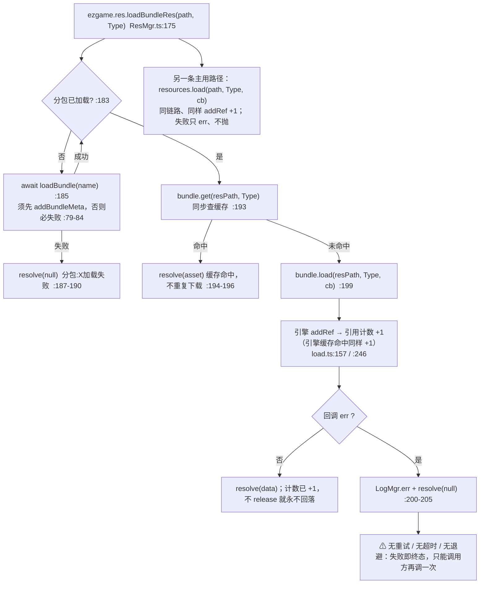
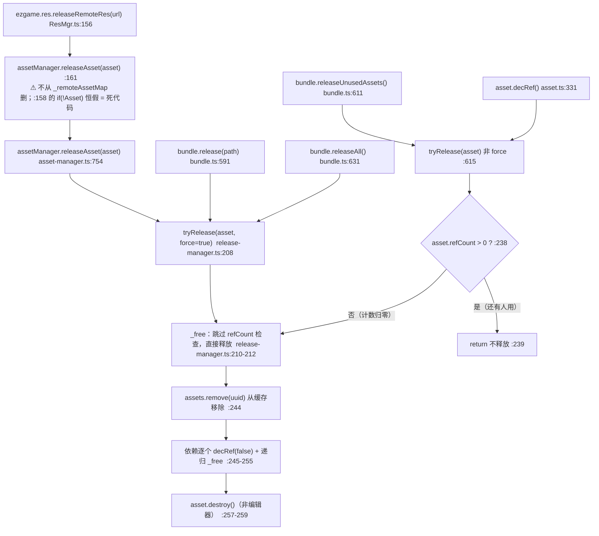
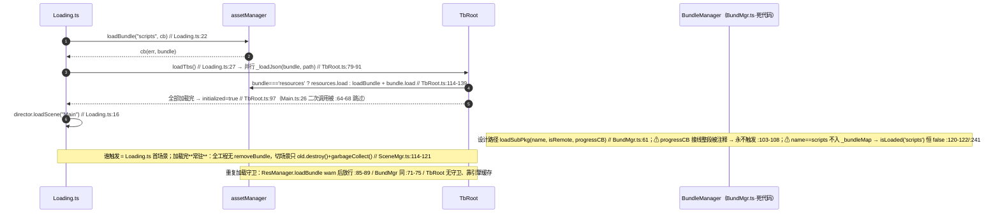

# 资源与分包管理（resources）

> 源码：`assets/scripts/platform/resources/` ｜ 平台层教程第 8 章

---

## 1. 一句话说明 / 什么时候用

`platform/resources/` 只有两个文件：`ResMgr.ts`（类名 `ResManager`，827 行）和 `BundMgr.ts`（类名 `BundleManager`，244 行）。

**一句话**：本工程的**资源加载事实上不走这两个文件** —— 真正在跑的是 `resources.load(...)` 直调（`cc` 引擎 API）+ 各消费方自己的缓存（`AtlasIcon` / `EntityViewPool` / `AudioMgr` / `TbRoot`）。`ResManager` 在本工程里只剩两个活着的入口：`ezgame.res.loadRemoteFrame`（远程 URL 图标）和 `ezgame.res.loadBundleRes`（音频兜底）；`BundleManager`（`BundMgr.ts`）是**移植遗留的死代码**，`Global` / `EnumBundle` / `MDebug` 三个标识符全工程都不存在，`tsc` 报 14 条 `TS2304`（见 §8-9）。

**什么时候用哪条路**（按用途选，别按"平台层应该有封装"选）：

| 你要的东西 | 走哪条 | 理由（源码） |
|---|---|---|
| `resources` 包内的 prefab | `resources.load(path, Prefab, cb)` | `UIManager.ts:475`、`EntityViewPool.ts:181`、`ProjectileViewPool.ts:149` |
| `resources` 包内的碎图 | `resources.load(path + '/spriteFrame', SpriteFrame, cb)` | `HeroCard.ts:426`、`HeroItem.ts:121`、`RefreshButtonView.ts:100` |
| 图集（`.plist` + `.png`）里的帧 | `AtlasIcon.loadIconFrame(icon)` | `AtlasIcon.ts:44`，三级降级 + 缓存 |
| 配表 JSON | `TbRoot.ins.loadTbs()` / `getTbContainer(X)` | `TbRoot.ts:62`、`:112`；12 张表全走 `resources` |
| 音频 | `AudioMgr.ins.playSFX` / `preloadSfx` | `AudioMgr.ts:170`、`:195` |
| 远程 URL 图（只剩 7 件遗物） | `ezgame.res.loadRemoteFrame(url)` | `ResMgr.ts:695`，调用点 `ShopRelicsItem.ts:279` |
| `scripts` 分包 | `assetManager.loadBundle("scripts", cb)` | `Loading.ts:22`（`assets/scripts.meta` 里 `isBundle: true`） |

**结论**：写新代码时**不要**指望 `ezgame.res.loadBundleRes` 能加载 `resources` 里的东西 —— 它必然返回 `null`（§8-1 给了完整推导）。

---

## 2. 源码地图

| 文件 | 职责 | 关键导出（`文件:行号`） |
|---|---|---|
| `assets/scripts/platform/resources/ResMgr.ts` | 单例资源管理器。**已实现且可用**：远程资源批量加载 / 释放、远程图 → `SpriteFrame`、`bundle` 路径解析式加载。**已实现但无调用方**：prefab 缓存删除、spine 材质、二进制。**整段被注释掉**：prefab 加载、animation、spine、json 数组、文本 | `export interface BundleMeta`（`ResMgr.ts:4`）<br>`export class ResManager`（`ResMgr.ts:25`）<br>`public static get inst`（`ResMgr.ts:28`）<br>公开方法共 **18** 个（含 `static get inst`）+ 1 个公开字段 `iconAtlasMap`（`ResMgr.ts:802`） |
| `assets/scripts/platform/resources/BundMgr.ts` | 设计意图是"管理 bundle 中资源"（`BundMgr.ts:4`）。**当前不可编译、无任何调用方** —— 依赖的 `Global` / `EnumBundle` / `MDebug` 在本工程不存在（`BundMgr.ts:66`、`:67`、`:72` 等） | `export class BundleManager`（`BundMgr.ts:6`）<br>`public static get inst`（`BundMgr.ts:8`）<br>公开方法共 **11** 个（含 `static get inst`、`get subResUrls` 两个访问器） |
| 门面 | 把单例挂到 `window.ezgame` | `ezgame.res` → `ResManager.inst`（`ezgame.ts:12-14`）；`declare global { const ezgame }`（`ezgame.ts:48-53`） |

### `inst` 还是 `ins`？—— 是 **`inst`**

去源码确认过，两个类都用 `inst`、`_inst`，**不是 `ins`**：

```ts
// ResMgr.ts:27-33   —— 注意大小写：inst / _inst
private static _inst: ResManager;
public static get inst() {
    if (!this._inst) { this._inst = new ResManager(); }
    return this._inst;
}
```

- `ResManager.inst`（`ResMgr.ts:28`）、`BundleManager.inst`（`BundMgr.ts:8`）—— 都用 `inst`。
- `ezgame.ts:13` 返回的正是 `ResManager.inst`，所以 `ezgame.res === ResManager.inst`。
- ⚠ **本工程的单例命名不统一**，别类推：`TbRoot.ins`（`TbRoot.ts:20`）、`UIManager.ins`、`AudioMgr.ins` 是 `ins`；`DataCenter.ins`；而 `ResManager` / `BundleManager` / `SceneMgr` 是 `inst`。写新代码前先看类的静态 getter，别背。

---

## 3. 快速上手

> 下面 5 个示例都只依赖 `cc` + 本工程已有文件，可直接粘进任意 `Component`。**示例里的 `release` 用的都是引擎 API** —— 因为 `ResManager` **根本没有释放本地资源的封装**（全文只有 `releaseRemoteRes` 一处 release 调用，`ResMgr.ts:161`），这是本工程最需要知道的一条。

### 3.1 加载 Prefab（`resources` 包）

```ts
import { _decorator, Component, Prefab, instantiate, resources } from 'cc';
const { ccclass } = _decorator;
@ccclass('DemoPrefab')
export class DemoPrefab extends Component {
    private path = 'prefabs/monster/slime';        // resources 内相对路径，不带扩展名
    private prefab: Prefab | null = null;
    load(): void {
        resources.load(this.path, Prefab, (err, prefab) => {
            if (err || !prefab) { console.error('加载失败', this.path, err); return; }
            this.prefab = prefab;
            this.node.addChild(instantiate(prefab));    // 节点归你自己管
        });
    }
    release(): void { resources.release(this.path, Prefab); }  // 引擎 Bundle.release(path, type)
}
```

工程内等价实现：`UIManager.ts:473-484`（UI 走这条路）、`EntityViewPool.ts:175-190`（带 JS 层缓存）。

### 3.2 加载图集里的某个 SpriteFrame

配表里的 `icon` 列是**不带扩展名的相对路径**（`textures/relics/quelling_blade`），帧名取路径主干，图集路径由目录反推（`AtlasIcon.ts:106-127`）。**唯一正确入口是 `AtlasIcon`**：

```ts
import { _decorator, Component, Sprite } from 'cc';
import { AtlasIcon } from '../../game/common/AtlasIcon';
const { ccclass, property } = _decorator;

@ccclass('DemoAtlas')
export class DemoAtlas extends Component {
    @property(Sprite) icon: Sprite = null!;

    start(): void {
        // 全失败 resolve(null)，永不 reject —— 由调用方决定留占位图还是报错（AtlasIcon.ts:37-38）
        AtlasIcon.loadIconFrame('textures/skills/split_shot').then((sf) => {
            if (sf && this.icon?.isValid) this.icon.spriteFrame = sf;   // 异步回来要判 isValid
        });
    }
}
```

**释放写法：不要释放。** `AtlasIcon` 故意把图集本体与帧都缓存在静态 Map 里且从不清除（`AtlasIcon.ts:90-99`），因为列表类 UI 每次重建都会重新请求同一批图；手动 `releaseAsset(atlas)` 会让所有已经贴在 `Sprite` 上的帧集体变白（§8-3）。

### 3.3 加载 JSON

**配表一律走 `TbRoot` 管线**，不要自己 `resources.load` JSON：

```ts
import { TbRoot } from '../../platform/excel_table/TbRoot';
import { UnitCfgContainer } from '../../game/excel_table/Tb_UnitConfig';

// 加载（全工程 12 张表一起，只需一次）
await TbRoot.ins.loadTbs();                              // TbRoot.ts:62
// 查询（同步，容器未加载会 throw，TbRoot.ts:53-55）
const cfg = TbRoot.ins.getTbContainer(UnitCfgContainer).getCfgById(1000);
```

一次性 JSON（不是配表）才用引擎 API：

```ts
import { JsonAsset, resources } from 'cc';
resources.load('configs/foo', JsonAsset, (err, asset) => {
    const data = asset?.json;                             // 释放：resources.release('configs/foo', JsonAsset)
});
```

### 3.4 加载音频

音效统一放主包 `assets/resources/sfx/`，**先 `resources.load` 再退回 bundle**（顺序不能反，`AudioMgr.ts:188-194` 有实测记录）：

```ts
import { AudioMgr } from '../../platform/audio/AudioMgr';

// 预加载（进战斗时一次性喂进来；playSFX 是"先加载再播"，不预热会晚半拍）
await AudioMgr.ins.preloadSfx(['hit_light', 'kill_light']);     // AudioMgr.ts:170
// 播放
AudioMgr.ins.playSFX('hit_light', 0.8);
```

释放：音频被 `AudioMgr.clipCache` 常驻持有（`AudioMgr.ts:197`），缓存字段是私有的 → **外部没有正规释放口**。真要回收只能 `resources.release('sfx/hit_light', AudioClip)`，但缓存里仍留着已销毁的引用，下一次 `playSFX` 会拿到失效 clip。`[推断]` 结论：**别在战斗中释放音效**。

### 3.5 按目录批量加载（`ResManager` 没有 `loadDir`）

`ResManager` **没有** `loadDir` / `loadResArr` / `preload` 这些方法（见 §4 的"不存在"清单）。工程里"按目录"只有两处真实用法，都在引擎 API 层：

```ts
import { assetManager, Prefab, SpriteAtlas } from 'cc';

// ① 分包整体预热：ResManager.loadBundle 内部就是这么干的（ResMgr.ts:94-98）
assetManager.loadBundle('scripts', (err, bundle) => {
    if (err) return;
    bundle.preloadDir('', null, null, () => console.log('分包预热完成'));   // 只进缓存，拿不到数组
});

// ② 真批量加载（要拿到资源数组）：引擎 Bundle.loadDir
assetManager.loadBundle('scripts', (err2, bundle2) => {
    bundle2.loadDir('ui', SpriteAtlas, (e, list: SpriteAtlas[]) => {
        // 释放：逐个 bundle2.release(路径)，或 bundle2.releaseAll()
    });
});
```

`resources.loadDir(...)` 同理可用（引擎 `bundle.ts:358-362` 是它的重载签名，`resources` 就是一个 `Bundle`）。

---

## 4. API 速查

### 4.1 `ResManager`（`ResMgr.ts`）—— 全部 18 个公开方法 + 1 个公开字段

| 签名 | 参数 | 返回 | 有引用计数？ | 备注（`文件:行号`） |
|---|---|---|---|---|
| `static get inst(): ResManager` | — | 单例 | — | 懒创建，`ResMgr.ts:28`。**不是 `ins`** |
| `init(): void` | — | `void` | — | 空实现（只有一句 `//`），`ResMgr.ts:53-55`。全工程无调用方 |
| `addBundleMeta(name: string, meta: BundleMeta): void` | 包名、`{name, remote, ...}` | `void` | — | `ResMgr.ts:65-67`。**全工程只有定义、0 调用** → 见 §8-1 |
| `loadBundle(name: string): Promise<void>` | 包名 | `Promise<void>`（失败 **reject**） | 否 | `ResMgr.ts:77-106`。先查元数据（`:79`）→ 已加载则 warn 并放行（`:85-89`）→ `assetManager.loadBundle`（`:90`）→ `remote` 时 `preloadDir` 预热（`:95`）。**只有 `loadBundleRes` 会调它**（`ResMgr.ts:185`） |
| `loadRemoteResArr(urls: string[], type: any): Promise<any>` | url 数组、类型 | `{ [url]: asset }`；失败项为 `null` | 否 | `ResMgr.ts:133-150`。注释明说"如果有加载失败会停止下载后面资源"（`:130`）—— 实际是失败项也计数、只要 `res.length == urls.length` 就 resolve，**失败不会中断**，注释与实现不符。**0 调用方** |
| `releaseRemoteRes(url: string): void` | 远程 url | `void` | 否（force 释放） | `ResMgr.ts:156-162`。`assetManager.releaseAsset(asset)`（`:161`）。**两个坑**：`if (!Asset)` 把类当变量判空、永远不报警（`:158`）；释放后**不从 `_remoteAssetMap` 删除**（`:157-161` 无 `delete`） |
| `loadBundleSprite(path: string): Promise<SpriteFrame>` | `分包名/资源路径` | `Promise<SpriteFrame \| null>` | 否（但内部加载会 +1） | `ResMgr.ts:163-168`。自动补 `/spriteFrame`（`:164-166`）。⚠ **本工程永远返回 `null`**：调用方传的是 `textures/xxx`，首段 `textures` 被当分包名（`HeroCard.ts:420-421`、`HeroItem.ts:104-105` 有记录）。全工程 0 个真实调用（只剩两条解释性注释） |
| `loadBundleRes(path, type?): Promise<any>` | `分包名/资源路径`、类型 | `Promise<asset \| null>` | 否（内部 `bundle.load` 会 +1） | `ResMgr.ts:175-208`。**本文件唯一"完整"的加载器**：路径首字符是 `/` 直接报错返回 `null`（`:176-180`）→ 拆首段为分包名（`:181-182`）→ 分包未加载则 `await loadBundle`（`:184-191`）→ 先 `bundle.get` 命中缓存（`:193-197`）→ 未命中 `bundle.load`（`:199`）；失败只 `LogMgr.err` 并 `resolve(null)`，**无重试、无超时**（`:200-205`）。真实调用点：`AudioMgr.ts:202` |
| `loadSpineMaterial(): Promise<Material>` | — | `Promise<Material>` | 否（内部 `resources.load` 会 +1） | `ResMgr.ts:319-326`。**固化了 `shader/spineMaterial` 路径**（`:321`），走 `loadLocalRes`。**0 调用方**（工程无 spine） |
| `delBundelPrefabs(bundle: string): void` | 分包名 | `void` | 否 | `ResMgr.ts:452-454`。只 `_prefabMap.delete(bundle)`；而 `_prefabMap` 的唯一写入点在**被注释掉的** `loadPrefab` 里（`:366-391`）→ 实际无意义。**0 调用方** |
| `loadSpriteFrame(icon: string): Promise<SpriteFrame>` | icon 路径 | `Promise<SpriteFrame \| null>` | 否 | `ResMgr.ts:671-688`。⚠ **实现有 bug**：`loadBundleRes` resolve 的是资源本身，这里却写 `data[icon]`（`:679`）→ `texture.image = undefined`。**0 调用方** |
| `loadRemoteFrame(icon: string): Promise<SpriteFrame>` | **http(s) URL** | `Promise<SpriteFrame>`（失败 `null`） | 否（远程资源**不进 bundle 引用计数**） | `ResMgr.ts:695-710`。内部 `loadRemoteRes` 返回 `[url, data]` 元组，这里取 `data[1]`（`:698`）。**活着的 API**，调用点 `ShopRelicsItem.ts:279`（7 件远程遗物图标） |
| `loadBinary(url: string): void` | url | **`void`（无返回、无 Promise）** | 否 | `ResMgr.ts:712-723`。⚠ `console.error` 写在**成功分支**里（`:715`）、错误分支才去 `DataView`（`:716-718`）→ 逻辑整体是错的。**0 调用方** |
| `loadSound(url, bundleType?): Promise<AudioClip>` | url、分包名（**未被使用**） | `Promise<AudioClip>` | — | ⚠ `ResMgr.ts:752-768`：函数体**整段被注释**，`new Promise` 里**没有任何 `resolve` 调用** → **返回的 Promise 永不 settle**，`await` 会永久挂起。**0 调用方**（音频实际走 `AudioMgr`） |
| `getJosn(url: string): any` | url | 缓存里的 json 对象 | 否 | `ResMgr.ts:793-795`。只读 `_jsonMap`；唯一写入点 `loadJsonArr` 整段被注释（`:725-750`）→ **永远 `undefined`**。唯一调用方 `ExcelConfigDecorator.ts:13`，而该文件本身也失效（`TbRoot.registryContainer` 不存在，tsc `TS2339`） |
| `iconAtlasMap: Map<string, SpriteAtlas>` | — | — | 否 | 公开字段，`ResMgr.ts:802`。**全工程只有它自己的读取者**，无写入方 → 一直为空 |
| `getBoardItemSpriteFrame2(itemId: number, icon: string): SpriteFrame` | 数字 id、图集名 | `SpriteFrame \| null` | 否 | `ResMgr.ts:803-811`。从 `iconAtlasMap` 取（`:805`）→ 空 Map → **恒返回 `null`**。**0 调用方** |
| `getAtlasByName(name: string)` | 图集名 | `SpriteAtlas \| undefined` | 否 | `ResMgr.ts:815-817`。读 `_atlasMap`，其唯一写入点 `loadNativeAtlas`（`ResMgr.ts:224-242`，private）**0 调用方** → 一直为空。**0 调用方** |
| `loadNativeAtlasImg(atlasName, imgName): SpriteFrame` | 图集名、帧名 | `SpriteFrame \| null` | 否 | `ResMgr.ts:819-825`。同上，恒 `null`。**0 调用方** |

**私有成员（写扩展时要读的）**：`loadRemoteRes`（`:115-127`，`assetManager.loadRemote` + 写 `_remoteAssetMap`）、`loadNativeAtlas`（`:224-242`）、`createAtlas`（`:272-292`，plist+png 手工建图集）、`loadLocalRes`（`:301-312`，`resources.load`）。后三个都**无调用方**。

### 4.2 `BundleManager`（`BundMgr.ts`）—— 全部 11 个公开方法（**当前不可编译**）

| 签名 | 参数 | 返回 | 有引用计数？ | 备注（`BundMgr.ts:行号`） |
|---|---|---|---|---|
| `static get inst(): BundleManager` | — | 单例 | — | `:8` |
| `get subResUrls(): string[]` | — | 已登记 url 数组 | — | `:18`，返回私有数组本体（外部可改） |
| `pushSubResourceUrls(urls: string[]): void` | url 数组 | `void` | — | `:21-29`，带去重 |
| `loadJsonRes(): Promise<boolean>` | — | `Promise<boolean>` | — | `:35-51`。⚠ 有 url 时**两条分支都不 settle**（成功分支只有注释 `:45-47`，失败分支 `return` 而不 resolve `:41-44`）→ 永久挂起 |
| `loadSubPkg(name, isRemote?, progressCB?)` | 包名、是否远程、进度回调 | `Promise<void>` | 否 | `:61-110`。已加载则 warn 放行（`:71-75`）；远程包 `preloadDir`（`:81`）。⚠ 引用不存在的 `Global` / `EnumBundle`（`:66-67`）→ 不可编译；⚠ `progressCB` 的接线**整段被注释**（`:103-108`）→ **进度回调永远不触发** |
| `loadBundleRes(name, url, type?)` | 包名、**包内独立参数**、类型 | `Promise<asset \| null>` | 否 | `:137-159`。⚠ 分包未加载**直接 warn + `null`，不会自动加载**（`:138-142`）—— 与 `ResMgr.loadBundleRes:184-186` 行为相反 |
| `loadBundleResArr(name, urlArr, type?)` | 包名、url 数组、类型 | `Promise<any[]>` | 否 | `:167-183`。**全工程唯一的批量 bundle 加载器** |
| `getBundleRes(name, url): any` | 包名、url | 同步取缓存 | 否 | `:205-212`。只 `bundle.get`，不触发加载 |
| `releaseBundleRes(name, url): void` | 包名、url | `void` | **force 释放** | `:219-226` → `bundle.release(url)`（引擎 `bundle.ts:591-595`，走 `tryRelease(asset, true)`） |
| `releaseBundle(name): void` | 包名 | `void` | **force 释放全部** | `:232-239` → `bundle.releaseAll()`（引擎 `bundle.ts:631-638`，逐条 `tryRelease(asset, true)`） |
| `isLoaded(name): boolean` | 包名 | `boolean` | — | `:241-243`。⚠ 与 `loadSubBundle:120-122` 配合有个洞：**`scripts` 包加载成功后故意不入 `_bundleMap`** → 加载完了 `isLoaded('scripts')` 仍返回 `false` |

### 4.3 ❌ 不存在的方法（**源码里没有，别写**）

任务里点名的这些名字，在 `ResMgr.ts` / `BundMgr.ts` 里**一个都没有**：

| 常见猜测名 | 存在吗 | 实际该用什么 |
|---|---|---|
| `load` / `loadRes` / `loadResArr` | ❌ | `resources.load(path, Type, cb)`；批量用 `bundle.loadDir` / `BundleManager.loadBundleResArr` |
| `loadDir` / `preload` / `preloadDir` | ❌（`ResManager` 没有；引擎 `Bundle` 有 `loadDir`/`preloadDir`） | `bundle.loadDir(...)`（`assetManager` 的 `Bundle`，签名见引擎 `bundle.ts:358-362`）；`ResManager.loadBundle` 内部用 `preloadDir` 预热（`ResMgr.ts:95`） |
| `loadRemote` | ❌（`ResManager` 无公开方法） | `ezgame.res.loadRemoteFrame(url)`（`ResMgr.ts:695`）；批量 `loadRemoteResArr`（`ResMgr.ts:133`，无调用方） |
| `release` / `releaseRes` / `releaseDir` | ❌ | `resources.release(path, Type)` / `resourceMgr.releaseAll()`；单实例 `assetManager.releaseAsset(asset)`；远程 `ezgame.res.releaseRemoteRes(url)` |
| `getRes` | ❌ | `resources.get(path, Type)`；分包 `BundleManager.getBundleRes(name, url)`（`BundMgr.ts:205`） |
| `getResByUrl` / `getAsset` | ❌ | — |

**这一条本身就是本模块最大的事实**：`ResManager` 提供的 18 个公开成员里，**只有 4 个在本工程被真正调用过**（`inst`、`loadBundleRes`、`loadRemoteFrame`、`getJosn`-但失效），其余 14 个是死代码或被注释掉的历史。

---

## 5. 生命周期与流程图

### 5.1 一次加载的完整路径（含缓存命中与失败分支）

以 `ezgame.res.loadBundleRes('bund/path', Type)` 为例（`ResMgr.ts:175-208`），把工程层与引擎层画在一条链上：



**三条要记住的**：

1. **每次成功加载都 +1，命中缓存也 +1**（引擎 `load.ts:155-161`：缓存命中同样 `addRef()`）。所以 `load` 两次 = 计数 2，只 release 一次仍然不释放。
2. **失败是终态**：`ResMgr.ts` 与 `BundMgr.ts` 里**没有任何重试 / 超时 / 退避逻辑**（全文件无 `setTimeout`、无 `retry`）。要重试只能调用方重新调一次。
3. **失败的表现不统一**：`loadBundle` reject（`ResMgr.ts:82`、`:102`）、`loadBundleRes` resolve(null)（`:189`、`:204`）。`await ezgame.res.loadBundleRes(...)` 不会抛，只会拿到 `null` —— 忘了判 `null` 就是空指针。

### 5.2 一次释放的路径

工程层只有一条 release 调用（远程资源，`ResMgr.ts:156-162`），其余全靠引擎 API：



**关键差异（选错 API 就是坑）**：

| 调用 | 是否检查 `refCount` | 后果 |
|---|---|---|
| `bundle.releaseUnusedAssets()`（`bundle.ts:615`）、`asset.decRef()`（`asset.ts:336`） | ✅ 检查 | 有人用就**不动**它 —— 安全 |
| `assetManager.releaseAsset(asset)`（`asset-manager.ts:755`） | ❌ **force** | 缓存项被删 + `destroy()`，哪怕还有 `Sprite` 在用 |
| `bundle.release(path)`（`bundle.ts:594`）、`bundle.releaseAll()`（`bundle.ts:635`） | ❌ **force** | 同上，且 `releaseAll` 是整包横扫 |

**依赖（dependAssets）一起走**：`_free` 会把该资源记录过的依赖逐个 `decRef(false)` 并**递归 `_free`**（`release-manager.ts:245-255`）。所以释放图集本体时，从它 `getSpriteFrame` 出来的帧、以及帧背后的 `Texture2D`，都会被同一条链带走。这就是"图集/依赖资源要一起放"的引擎侧真相 —— 反过来也成立：**你以为只放了一张帧，其实动了整个图集链**。

### 5.3 分包加载时序（`BundMgr` 设计路径 + 工程实际路径）



**四个被问到的点，答案是**：

- **谁触发**：`Loading.ts:20-34`（首场景唯一入口）→ 引擎 `assetManager.loadBundle`；`TbRoot` 在每个自定义 bundle 的表上再触发一次 `loadBundle`（`TbRoot.ts:124`）。
- **进度回调**：`BundleManager.loadSubPkg` 有 `progressCB` 形参（`BundMgr.ts:61`），但**触发它的代码整段被注释**（`BundMgr.ts:103-108`）→ 传了也不会被调。真正能拿到进度的是 `director.preloadScene`（`SceneMgr.ts:69-72`，项目自己在用）和 `Bundle.loadDir/load` 的 `onProgress`。
- **加载完是否常驻**：**常驻**。bundle 一旦 `assetManager.loadBundle` 成功就进 `assetManager` 的包表，**没有任何代码 removeBundle**（`SceneMgr.ts:114-121` 切场景只 `old.destroy()` 场景节点 + `sys.garbageCollect()`）；`ResManager._bundleMap`（`ResMgr.ts:50`）与 `BundleManager._bundleMap`（`BundMgr.ts:15`）也只是 Map，从不清理。
- **重复加载怎么办**：三处守卫，行为**不一致**：① `ResManager.loadBundle`：已加载 → `LogMgr.warn` + resolve，**不重复下载**（`ResMgr.ts:85-89`）；② `BundleManager.loadSubPkg`：同样 warn + resolve（`BundMgr.ts:71-75`）；③ `TbRoot._loadJson`：**没有守卫**，靠引擎 `assetManager.loadBundle` 自身的缓存（`TbRoot.ts:124`），重复调用会重复走一遍回调但不会重复下载。`[推断]`：引擎对已加载 bundle 的二次 `loadBundle` 走缓存，不产生网络请求。

---

## 6. 与 Cocos 生命周期的关系

### 6.1 四层各在哪

| 层 | 位置 | 本工程的接触点 |
|---|---|---|
| `assetManager` | `cc` 引擎全局单例 | `Loading.ts:22`（`loadBundle`）、`TbRoot.ts:124`、`ResMgr.ts:90`、`ResMgr.ts:117`（`loadRemote`）、`ResMgr.ts:161`（`releaseAsset`）、`ResMgr.ts:713`（`loadAny`） |
| `Bundle` | `assetManager.loadBundle` 的产物；`resources` 本身就是一个 Bundle | `ResMgr.ts:193/199`（`bundle.get` / `bundle.load`）、`ResMgr.ts:95`（`preloadDir`）、`BundMgr.ts:225/238`（`release` / `releaseAll`） |
| `resources` | 引擎预置的 "resources 包"，对应 `assets/resources/` | 全工程 12 处直调：`TbRoot.ts:115`、`UIManager.ts:475`、`EntityViewPool.ts:181`、`ProjectileViewPool.ts:149`、`AtlasIcon.ts:154/171`、`HeroCard.ts:426`、`HeroItem.ts:121`、`RefreshButtonView.ts:100`、`SkillSlot.ts:407`、`View_Game_Stage.ts:217/221/582`、`AudioMgr.ts:195`、`BundMgr.ts:40` |
| `director.preloadScene` | 场景切换层 | `SceneMgr.ts:69`（带进度回调 `:71-72`）→ `director.loadScene`（`SceneMgr.ts:105`）。**与资源加载是两条独立的路**：preloadScene 预热场景，`resources.load` 预热资源 |

`assets/` 下的 bundle 边界（`*.meta` 的 `userData.isBundle`）：

| 目录 | `isBundle` | 说明 |
|---|---|---|
| `assets/resources` | `true`（`assets/resources.meta`） | 引擎预置包，`resources.load` 的根 |
| `assets/scripts` | `true`（`assets/scripts.meta`） | 工程自定义包，名字就是 `scripts`，`Loading.ts:22` 加载它 |
| `assets/prefabs` / `assets/scenes` | 无该字段 | 普通目录，不是 bundle |

> `settings/v2/packages/builder.json` 里**没有**任何 bundle 相关配置（grep 无命中）→ bundle 归属完全由目录 `.meta` 的 `isBundle` 决定。

### 6.2 自动释放 vs 手动释放的边界

**引擎侧事实**：

1. 切场景时 `director` 会调 `releaseManager._autoRelease(oldScene, scene, persistRootNodes)` —— 但**只在非编辑器环境**（`director.ts:448-454`）。
2. `_autoRelease` 只遍历**该场景序列化数据里记过依赖的资源**：`dependUtil.getDeps(oldScene.uuid)`（`release-manager.ts:167-173`），并且用的是 `asset.decRef(oldScene.autoReleaseAssets)` —— 而 `Scene.autoReleaseAssets` **默认 `false`**（`scene.ts:65`），即非 TEST 构建下传进去的是 `false` → `decRef(false)` 只减计数、**不触发 `tryRelease`**（`asset.ts:335-337`）。
3. `resources` 包**不会**因为切场景被整体释放：没有任何代码对 `resources` 调 `releaseAll` / `releaseUnusedAssets`（全工程 grep 无命中）。
4. 引擎 API 注释把边界说得很直白：`assets` 是"已加载资源的集合，你能通过 `releaseAsset` 来移除缓存"（`asset-manager.ts:166-169`）。

**工程侧佐证**：`SceneMgr.ts:114-121` 自己在切场景后手动清理：

```ts
// SceneMgr.ts:114-121
if (oldSceneName) {
    let oldScene = this.sceneInfoFunc(oldSceneName)
    if (oldScene && !oldScene.isMainScene) {
        old.destroy()          // 只销毁场景节点树
    }
}
sys.garbageCollect()           // 只回收 JS 堆
```

**结论（这就是"加载了却没释放"的根因）**：运行时 `resources.load(...)` 拿到的资源，其依赖关系**不会被登记到任何场景的依赖表**里，因此切场景时既不减计数也不进 `_free`；而账面上它已经被 `addRef` 过一次并且**没有任何代码会 `decRef` 它**（`ResManager` 18 个公开成员里只有 `releaseRemoteRes` 一处释放，`ResMgr.ts:161`）。`[推断]`：`sys.garbageCollect()` 只回收 JS 堆对象，不释放 GPU 纹理，所以显存曲线只涨不掉。

**该不该手动释放**：

| 资源 | 建议 | 依据 |
|---|---|---|
| UI prefab（`UIManager` 加载） | 不释放（视图可能被复用/重开），靠 `UIManager` 的 `single` 语义控数量 | `UIManager.ts:475`、`findViewOnLayer:458-471` |
| 实体/弹道 prefab | 每局结束清 **JS 缓存**即可，资源本体不释放 | `EntityViewPool.ts:153-165`（只 `pools.clear()` / `prefabCache.clear()`） |
| 图集帧 | **绝不释放** | `AtlasIcon.ts:90-99` |
| 音效 | 战斗中不释放 | `AudioMgr.ts:197` 的 `clipCache` 常驻 |
| 配表 JSON | 不释放（全程要用） | `TbRoot.ts:17` 的 `containers` 常驻，`initialized` 守卫 `:64-68` |
| 远程 URL 图（仅 7 件遗物） | 有 `releaseRemoteRes` 可放，但注意它不从 Map 里删（`ResMgr.ts:157-161`） | — |

### 6.3 加载完的节点/资源挂在谁身上

| 产物 | 挂载点 | 谁负责销毁/释放（`文件:行号`） |
|---|---|---|
| UI prefab 实例节点 | `UIManager` 的层级节点 `children` | `UIManager`（`findViewOnLayer` 遍历 `layerNode.children`，`UIManager.ts:458-471`） |
| 实体 prefab 实例节点 | `EntityViewPool` 的 `pools` / `activeViews` | `releasePrefabs()` → `pools.clear()` + `view.node.destroy()`，`EntityViewPool.ts:153-165` |
| 弹道实例节点 | `ProjectileViewPool` | `ProjectileViewPool.ts:149` 附近 |
| 图集 / SpriteFrame | `AtlasIcon.atlasPromises` / `framePromises`（**静态 Map，全进程常驻**） | 无释放口（故意），`AtlasIcon.ts:90-99` |
| AudioClip | `AudioMgr.clipCache`（私有 Map） | 无释放口，`AudioMgr.ts:197` |
| 配表 JSON 数据 | `TbRoot.containers`（私有 Map，常驻） | 无释放口，`TbRoot.ts:17` |
| **`ResManager` 自己的 5 个缓存 Map** | `_remoteAssetMap` / `_atlasMap` / `_jsonMap` / `_textMap` / `_prefabMap`（`ResMgr.ts:36-41`、`:359`） | **本工程里除 `_remoteAssetMap` 外全是空的**：`_atlasMap` 的唯一写入点 `loadNativeAtlas` 无调用方（`ResMgr.ts:224`）；`_jsonMap` 的唯一写入点被注释（`ResMgr.ts:725-750`）；`_textMap` 无写入点（`ResMgr.ts:770-791` 全注释）；`_prefabMap` 只有删除方（`ResMgr.ts:452-454`）。`_remoteAssetMap` 由 `loadRemoteRes` 写入（`ResMgr.ts:123`），经 `loadRemoteFrame` → `ShopRelicsItem.ts:279` 真正被用到 |

---

## 7. 典型组合用法

> 下面 9 条都是**游戏侧真实调用点**（grep `ResManager` / `resources.load` / `ezgame.res` / `BundMgr` 的结果），不是示例代码。

| # | 调用点 | 场景 | 关键源码 |
|---|---|---|---|
| 1 | `Loading.ts:20-34` `loadscripts()` | **启动顺序**：先 `assetManager.loadBundle("scripts")`，回调里才 `TbRoot.ins.loadTbs()`，最后 `director.loadScene("Main")`。这是全工程唯一保证"分包 → 配表 → 场景"顺序的地方 | `Loading.ts:22`、`:27`、`:16` |
| 2 | `TbRoot.ts:112-141` `_loadJson(bundle, path)` | **双分支加载**：`bundle === 'resources'` 走 `resources.load`（`:115`），否则 `assetManager.loadBundle` + `bundleAsset.load` 两段（`:124`、`:130`）。路径格式由 `@tb_config(':tb/units')` 决定（`TbConfigDecorator.ts:28-39`），**本工程 12 张表全是 `:tb/xxx` = resources**（`Tb_UnitConfig.ts:88`、`Tb_RelicConfig.ts:104` 等） | `TbRoot.ts:114-139` |
| 3 | `UIManager.ts:473-484` `loadUIPrefab()` | **所有 UI 预制件**都从 `resources` 加载（`@uiview({prefabPath})` 是 resources 相对路径），失败 `error(err)` 后 resolve(null)，**不抛** | `UIManager.ts:475-482` |
| 4 | `EntityViewPool.ts:175-190` + `:153-165` | **实体/子弹 prefab 池**：`getPrefab` 先查 `prefabCache`（`:176-180`），未命中才 `resources.load(path, Prefab)`（`:181`）；每局结束 `releasePrefabs()` 只清 JS 层缓存，**不调引擎释放** | `EntityViewPool.ts:176`、`:181`、`:156-159` |
| 5 | `AtlasIcon.ts:44-76` + `:146-185` | **图标三级降级**（图集本体 → 帧子资源 → 旧碎图），每层都列候选按序试，并把"命中了哪条路"打进日志（`reportHit`，`:192-197`）；加载中/失败都缓存 promise，避免 300+ 图标反复重试（`:90-99` 注释） | `AtlasIcon.ts:154`、`:171`、`:184` |
| 6 | `RefreshButtonView.ts:88-111` `loadFrame()` | **并发合并范例**：同一个路径并发请求只发一次 `resources.load`，其余回调挂 `framePending` 数组里等（`:94-99`）；失败**不进缓存**、留待下次重试（`:78` 注释 + `:103-107`）；回调回来还要比对 `wantPath` 防闪烁（`:127-129`） | `RefreshButtonView.ts:94-110` |
| 7 | `ShopRelicsItem.ts:262-295` `loadIcon()` | **本地/远程双口径**：`/^https?:\/\//i` 走 `ezgame.res.loadRemoteFrame`（`:279`，7 件远程遗物），否则走 `AtlasIcon`（`:285`）；按 icon 值缓存（`:266-270`），失败只报错不清空已有图 | `ShopRelicsItem.ts:278`、`:285` |
| 8 | `AudioMgr.ts:180-213` + `Scene_Game_Stage.ts:793-796` | **音效预加载**：`initBattle` 里 `preloadSfx(hitFeelSfxKeys())` 并把 `playSFX` 注入打击反馈导演（`:793-796`）；`loadAudioClip` **先 `resources.load` 再退 `ResManager.loadBundleRes`**（`:195` → `:202`），注释记着反过来的代价 | `AudioMgr.ts:188-194`、`Scene_Game_Stage.ts:796` |
| 9 | `HeroItem.ts:119-128` / `HeroCard.ts:424-433` | **碎图标准写法** `resources.load(\`${path}/spriteFrame\`, SpriteFrame, cb)` + `target.isValid` 守卫；两处注释都写明**不能用 `loadBundleSprite`**（会把首段当分包名） | `HeroItem.ts:121`、`HeroCard.ts:426` |

---

## 8. 注意事项与坑

> 每条都是「现象 → 原因 → 正确做法」，并给到源码行。标 `[推断]` 的是我没有实测、由源码推导的结论。

### 8-1 现象：`ezgame.res.loadBundleRes('textures/heros/huoqiang', SpriteFrame)` 永远返回 `null`

**原因链**（四步，全在源码里）：
1. `loadBundleRes` 把**路径首段**当分包名：`name = path.substring(0, index)`（`ResMgr.ts:181-182`）→ `name = 'textures'`。
2. `_bundleMap` 里没有 `textures` → 调 `loadBundle('textures')`（`ResMgr.ts:184-186`）。
3. `loadBundle` 第一步查 `bundleMetas.get(name)`（`ResMgr.ts:79`）→ **本工程从未调用过 `addBundleMeta`**（`ResMgr.ts:65` 是唯一定义处，全工程 0 调用）→ 直接 `LogMgr.err("未找到bundle元数据：textures")` 并 **reject**（`ResMgr.ts:80-84`）。
4. `bundle` 仍取不到 → `LogMgr.err("分包:textures加载失败")`，`resolve(null)`（`ResMgr.ts:187-190`）。

**正确做法**：`resources` 包内的东西一律直调 `resources.load`；碎图加 `/spriteFrame`（`HeroItem.ts:121`、`HeroCard.ts:426`、`RefreshButtonView.ts:100`）。工程里已经有两处注释专门记着这条（`HeroItem.ts:104-105`、`HeroCard.ts:420-421`）。**顺带**：`AudioMgr.ts:190-192` 的注释描述的就是这个现象（"每次首次加载都会先打印一条 `分包:sfx加载失败`，再降级到 `resources.load` 才成功"）—— 所以 `AudioMgr` 才把顺序反过来。

### 8-2 现象：加载了却没释放，内存/显存只涨不掉

**原因**：`ResManager` 里**没有任何释放本地资源的 API** —— 全文件对引擎释放接口的调用只有一处 `assetManager.releaseAsset`（`ResMgr.ts:161`，且只服务于远程资源）；`EntityViewPool.releasePrefabs()` 叫"释放"，实际只 `pools.clear()` + `prefabCache.clear()`（`EntityViewPool.ts:156-159`），一个引擎释放调用都没有。而每次成功的 `load` 都让引擎 `refCount +1`（引擎 `load.ts:157`、`:246-248`），**没有对应减回去的代码**。

**正确做法**：想真回收只有三条引擎口 —— `resources.release(path, Type)`（按路径）、`assetManager.releaseAsset(asset)`（按实例）、`bundle.releaseUnusedAssets()`（**唯一检查 `refCount` 的安全口**，`bundle.ts:611-618`）。别用 `releaseAll`（整包 force 横扫，`bundle.ts:631-638`）。

### 8-3 现象：图集里的 `SpriteFrame` 贴上去过一会儿变成白图/花屏

**原因**：从图集 `getSpriteFrame(name)` 拿到的帧，其 `texture` 指向图集共用的大图；`_free` 会把该图集的依赖（帧、`Texture2D`）逐个 `decRef(false)` 并**递归销毁**（引擎 `release-manager.ts:245-255`）。而 `assetManager.releaseAsset(atlas)` 与 `bundle.release(path)` 都是 **force**（`asset-manager.ts:755`、`bundle.ts:594`）→ **跳过 `refCount` 检查**（`release-manager.ts:210-212`），哪怕界面上还有 20 个 `Sprite` 在用它也会把缓存项删掉并 `destroy()`。

**正确做法**：图集与帧一律**不手动释放**，交给 `AtlasIcon` 的静态缓存（`AtlasIcon.ts:90-99`）。真要回收就换局/换界面这种"确定没有人在用"的时刻，并优先用 `releaseUnusedAssets()`。`[推断]`："白图/花屏"这一具体表现在本工程未实测，是引擎 `destroy()` 语义（`release-manager.ts:257-259`）的推论。

### 8-4 现象：同一个资源 `load` 两次，释放一次却还是不走

**原因**：**命中缓存也会 `addRef`**。引擎 `load.ts:155-161`：`if (!options.reloadAsset && assets.has(uuid))` 分支里明确写着 `item.content = asset.addRef()` —— 也就是说"从缓存拿"和"新下载"对引用计数的贡献**完全一样**。`ResManager` 也没有自己的去重层（对比 `RefreshButtonView.ts:94-99` 的 `framePending` 合并，那是工程里唯一做了并发合并的地方）。

**正确做法**：① 需要"引用多少次减多少次"，就在自己的封装里对称记账；② 更省事的做法是**在应用层去重**（path → Promise 缓存，如 `AtlasIcon.framePromises`、`RefreshButtonView.frameCache`），让同一资源在进程内只 `load` 过一次；③ 回收时优先 `releaseUnusedAssets()`（检查计数）而不是 `release`（force）。

### 8-5 现象：`release` 传错东西 —— 传了路径字符串给 `releaseAsset`，或传了实例给 `bundle.release`

**原因**：三个释放 API 的参数口径**完全不同**，而且没有类型保护：

| API | 要什么 | 源码 |
|---|---|---|
| `assetManager.releaseAsset(asset)` | **`Asset` 实例**（不是路径） | 引擎 `asset-manager.ts:754-755`；本工程唯一调用 `ResMgr.ts:161` |
| `bundle.release(path, type?)` | **包内相对路径字符串**（内部自己 `get(path, type)`） | 引擎 `bundle.ts:591-595` |
| `ResManager.releaseRemoteRes(url)` | **`_remoteAssetMap` 里那个远程 url** | `ResMgr.ts:156-162` |

`ResManager.releaseRemoteRes` 自己还有两个问题：`if (!Asset)` 判的是导入的**类**而不是 `asset` 变量，恒为 falsy 取反 → **warn 分支是死代码**（`ResMgr.ts:158-160`）；释放后**不从 `_remoteAssetMap` 删除**（`:157-161` 没有 `delete`）→ 第二次调用会对**已经 `destroy()` 过的资产**再 `releaseAsset` 一次。`[推断]`：对已销毁资源重复 `releaseAsset` 在引擎里是 `isValid(asset, true)` 判空后 `return`（`release-manager.ts:235`），大概率只是空操作，但 Map 里的悬空引用会一直占着内存。

**正确做法**：按路径释放用 `resources.release(path, Type)`；按实例释放用 `assetManager.releaseAsset(asset)`；远程资源用 `releaseRemoteRes(url)` 但**只调一次**。

### 8-6 现象：把远程 URL 当成本地路径写，或反过来

**原因**：两条路的语义完全不同：

| | 本地 | 远程 |
|---|---|---|
| 入口 | `resources.load(path, Type, cb)` / `bundle.load` | `assetManager.loadRemote(url, cb)`（`ResMgr.ts:117`） |
| 路径形态 | 包内相对路径，**不带扩展名**；子资源用 `/spriteFrame` | 完整 `http(s)://` URL，**要带扩展名**，且远程图片要显式给 `ImageAsset` 类型（`ResMgr.ts:673` 注释、`ShopRelicsItem.ts:278` 的正则判定） |
| 回调载荷 | 就是资源本身 | `ResMgr.loadRemoteRes` 包成了 **`[url, data]` 元组**（`ResMgr.ts:120`、`:122`），所以调用方要取 `data[1]`（`ResMgr.ts:698`） |
| 引用计数 | 引擎按 bundle 缓存管理 | **不进 bundle 缓存**，只有 `ResMgr._remoteAssetMap` 记着（`ResMgr.ts:123`） |
| 释放 | `resources.release` / `releaseUnusedAssets` | `releaseRemoteRes(url)`（`ResMgr.ts:156`） |

**正确做法**：只认 `ShopRelicsItem.ts:278-283` 那一份现成实现 —— `if (/^https?:\/\//i.test(path))` 走 `ezgame.res.loadRemoteFrame`，否则走 `AtlasIcon.loadIconFrame`。配表里的 `icon` 列**本地值不带扩展名**（`AtlasIcon.ts:9-10` 注释）。

### 8-7 现象：加载回调里访问已经关掉/销毁的节点，报红字或图贴到了不该贴的地方

**原因**：`resources.load` / `bundle.load` 回调都是**异步**的（`UIManager.ts:475`、`EntityViewPool.ts:181`），而 UI 可能在这期间已经被关掉。工程里两种处理并存：

- **`isValid` 守卫**（标准写法）：`if (target.isValid) target.spriteFrame = spriteFrame`（`HeroItem.ts:126`、`HeroCard.ts:431`）。
- **"最后想要的值"比对**（更强）：`if (wantPath.get(sprite) !== path) return;`（`RefreshButtonView.ts:128`）—— 防止异步回来把已经改成别的图标又刷回去。

⚠ **反面例子**：`View_Game_Stage.loadSpriteFrame`（`View_Game_Stage.ts:580-589`）本身**没有**任何 `isValid` 保护，只把 `sf` 交给 `onLoaded`；它的调用点（`:390-392`）只判了 `this.head_icon` 存在、**没判 `isValid`**。`[推断]`：场景销毁瞬间回来的头像加载可能写到一个已销毁的 `Sprite` 上。

**正确做法**：异步回调里一律 `node?.isValid` / `target?.isValid` 守卫；"同一目标会被多次刷图"的场景要加"想要的路径"比对（抄 `RefreshButtonView` 的 `wantPath`）。

### 8-8 现象：分包还没加载就去取资源，静默拿到 `null`

**原因**：`bundle.get()` 只查**已加载**的缓存，不会触发加载（`BundMgr.ts:205-212` 的 `getBundleRes` 就是这样）。而两个"带加载的取资源"方法行为**相反**：

- `ResManager.loadBundleRes`：分包没加载 → **自动** `await this.loadBundle(name)`（`ResMgr.ts:184-186`）。
- `BundleManager.loadBundleRes`：分包没加载 → **直接 `MDebug.warn` + `Promise.resolve(null)`**，不加载（`BundMgr.ts:138-142`）。

`BundleManager` 还有个更隐蔽的洞：`loadSubBundle` 在 `name == EnumBundle.scripts` 时**故意不把 bundle 存进 `_bundleMap`**（`BundMgr.ts:120-122`）→ `scripts` 包明明加载成功了，后续 `loadBundleRes('scripts', ...)` 和 `isLoaded('scripts')`（`BundMgr.ts:241`）都会说不存在。

**正确做法**：① 用 `ResManager.loadBundleRes` 时**必须先 `addBundleMeta`**（本工程没做，所以等价于不可用，§8-1）；② 用 `BundleManager` 时必须自己保证 `await loadSubPkg(name)` 在前，并且**别用 `isLoaded('scripts')` 判断 scripts 包**；③ 工程的既有做法最省事：在启动流程里一次性把顺序做死（`Loading.ts:20-34`）。

### 8-9 现象：`await ezgame.res.loadSound(url)` 永久挂起、`getJosn` 永远 `undefined`、`loadJsonRes()` 永不 settle

**原因**：这三个方法的 Promise 里没有 `resolve`。

- `ResManager.loadSound`（`ResMgr.ts:752-768`）：函数体**整段注释**，`new Promise(resolve => { ... })` 里没有任何 `resolve(...)` 调用 → **永不 settle**。
- `ResManager.getJosn`（`ResMgr.ts:793-795`）：只读 `_jsonMap`，而写入它的 `loadJsonArr` 整段被注释（`ResMgr.ts:725-750`）→ 恒 `undefined`。唯一调用方 `ExcelConfigDecorator.ts:13` 所在的文件本身也已经失效（用了不存在的 `TbRoot.registryContainer`，tsc 报 `TS2339`，见 §10）。
- `BundleManager.loadJsonRes`（`BundMgr.ts:35-51`）：有 url 时，成功分支只有注释（`:45-47`）、失败分支 `return` 而不 `resolve`（`:41-44`）→ **两条路都不 settle**。

**正确做法**：音频走 `AudioMgr.ins.playSFX` / `preloadSfx`（`AudioMgr.ts:170`、`:195`）；JSON 走 `TbRoot` + `@tb_config`（`TbRoot.ts:62`、`:112`）；永远不要 `await` 这三个方法 —— `await` 一个永不 settle 的 Promise 会**静默吃掉整段后续逻辑**（没有报错、没有日志）。

### 8-10 现象：`BundMgr.ts` 一改就报一堆红字

**原因**：它是移植残留的死代码，引用三个本工程不存在的标识符，`tsc --noEmit` 报 **14 条 `TS2304`**（`BundMgr.ts:66`、`:67`、`:72`、`:78`、`:82`、`:87`、`:120`、`:125`、`:140`、`:154`、`:170`、`:178`、`:208`、`:222`、`:235` —— 其中 `EnumBundle` 2 处、`MDebug` 11 处、`Global` 1 处）。全工程**没有任何文件 import 它**（`BundleManager` 只在自身文件出现）。作为对照：**`ResMgr.ts` 一条类型错误都没有**。

**正确做法**：新代码写 `resources.load` / `TbRoot`，**不要**去修 `BundMgr.ts`（修它要先造出 `Global` / `EnumBundle` / `MDebug` 三个全局，等于把另一套框架搬进来）；要复用它的批量加载思路，就照 `loadBundleResArr`（`BundMgr.ts:167-183`）自己写 10 行。

---

## 9. 调试手段

### 9.1 日志（最有效）

`ResManager` / `BundleManager` 每个失败分支都有日志，直接按字符串搜：

| 日志字符串 | 位置 | 含义 |
|---|---|---|
| `未找到bundle元数据：X` | `ResMgr.ts:81` | 没调 `addBundleMeta` → §8-1 的根因，**看到这条就说明这条路走不通** |
| `分包:X加载失败` | `ResMgr.ts:188` | 上一条的后果，最终 `null` |
| `分包资源已经被加载` | `ResMgr.ts:86` | 重复 `loadBundle`（warn，不影响正确性） |
| `加载bunble包 suc: X` / `预加载远程bundle资源完成 suc: X` | `ResMgr.ts:92` / `:96` | bundle 加载/预热成功 |
| `加载X bundle中资源Y错误:Z` | `ResMgr.ts:203` | `bundle.load` 失败（无重试） |
| `没有缓存资源释放:X` | `ResMgr.ts:159` | ⚠ **死代码**，永远不会打（`if (!Asset)` 恒 false，§8-5） |
| `[图标] 图标命中路径：图集本体/图集帧子资源/旧碎图（路径）｜首个帧名：key` | `AtlasIcon.ts:196` | **唯一能观察到真实资源路径表的办法**：全走「图集本体」= 图集生效；出现「旧碎图」= 图集没生效或该图本来就不在图集里（`:188-190` 注释） |
| `[图标] 图集已加载：路径（N 帧）` | `AtlasIcon.ts:156` | 确认图集本体路径（`<base>` vs `<base>.plist` 哪个命中） |
| `[图标] 图集没取到：X（改走直取帧 / 旧碎图路径）` | `AtlasIcon.ts:149` | 该图集两条候选路径全失败（只警告一次） |

日志开关：`ezgame.setLogLevel(logLevel.Debug)` / `ezgame.setLogOpen(true)`（`ezgame.ts:33-44`）；`LogMgr.logLevel` 默认 `Info`、`logOpen` 默认 `true`（`LogMgr.ts:16-17`）。

### 9.2 看缓存与引用计数

```ts
import { assetManager, resources } from 'cc';

// ① 已加载资源总表（引擎注释：可用 releaseAsset 移除缓存，asset-manager.ts:166-169）
assetManager.assets.forEach((a: any) => console.log(a.constructor.name, a._uuid, a.refCount));

// ② 单个资源：refCount 是公开 getter（引擎 asset.ts:301）
resources.get('textures/relics/relics', SpriteAtlas)?.refCount;

// ③ 只看某个前缀（定位"图集链"到底谁还活着）
assetManager.assets.forEach((a: any) => {
    if (String(a._uuid)) console.log(a.name, a.refCount);
});
```

- **`refCount` 不降** = 有人在 `load` 之后没有释放（§8-4）；**`refCount` 降到 0 但资源还在** = 还没到 `_free`（`tryRelease` 把任务丢到下一 tick，`release-manager.ts:215-220`）。
- 想"一键清干净"看基线：`app.assetManager.releaseUnusedAssets()` —— 唯一检查 `refCount` 的安全口（`asset-manager.ts:768-770`）。

### 9.3 静态检查（本项目特异性最高的手段）

```pwsh
# 全工程类型检查：ResMgr.ts 应保持 0 错误；BundMgr.ts 目前 14 条 TS2304（§8-10）
node node_modules\typescript\bin\tsc --noEmit -p tsconfig.json 2>&1 | Select-String "platform/resources|platform/excel_table"
```

- **查"这个方法有没有人用"**：全工程只出现在自己文件里 = 死代码。本模块的死代码清单见 §4.1 的"0 调用方"标记。
- **查"路径写对没有"**：`resources` 内的路径是**相对于 `assets/resources/`、不带扩展名**；碎图子资源要 `/spriteFrame`。用 `glob`/`Get-ChildItem assets\resources` 对照实际文件树最靠谱。

### 9.4 资产树快速核对

```pwsh
# 哪些目录是 bundle（.meta 里 userData.isBundle = true）
Get-ChildItem assets -Filter *.meta | ForEach-Object {
  $j = Get-Content $_.FullName -Raw | ConvertFrom-Json
  if ($j.userData.isBundle) { "$($_.Name) -> isBundle=true" }
}
```

本工程结果：`resources` 与 `scripts` 是 bundle（`assets/resources.meta`、`assets/scripts.meta`），`prefabs` / `scenes` 不是。

---

## 10. 事实依据

### 10.1 本工程源码

1. `assets/scripts/platform/resources/ResMgr.ts:25` —— 类名是 `ResManager`（不是 `ResMgr`），单例 getter 是 **`inst`**（`:28`），不是 `ins`。
2. `assets/scripts/platform/resources/ResMgr.ts:65` —— `addBundleMeta` 的定义；全工程**仅此一处**出现该标识符 → `bundleMetas` 永远为空 → `loadBundle` 必然在 `:79-84` reject。
3. `assets/scripts/platform/resources/ResMgr.ts:175-208` —— `loadBundleRes` 全貌：首字符 `/` 报错返回（`:176-180`）、按首段拆分包名（`:181-182`）、分包未加载则自动加载（`:184-186`）、`bundle.get` 命中缓存（`:193-197`）、失败只 `err` + `resolve(null)`（`:200-205`）。
4. `assets/scripts/platform/resources/ResMgr.ts:156-162` —— `releaseRemoteRes`；`:158` 的 `if (!Asset)` 判的是导入的类（恒不成立）→ warn 分支死代码；释放后不删 Map 条目。
5. `assets/scripts/platform/resources/ResMgr.ts:752-768` —— `loadSound` 的 Promise 体内**没有任何 `resolve`** → 永不 settle。
6. `assets/scripts/platform/resources/ResMgr.ts:725-750` —— 写入 `_jsonMap` 的 `loadJsonArr` 整段被注释 → `getJosn`（`:793-795`）恒返回 `undefined`。
7. `assets/scripts/platform/resources/ResMgr.ts:161` —— 全文件唯一一处引擎释放调用（`assetManager.releaseAsset`）。
8. `assets/scripts/platform/resources/BundMgr.ts:66`、`:67`、`:72` —— 引用不存在的 `Global`、`EnumBundle`、`MDebug`；`tsc --noEmit` 对该文件报 14 条 `TS2304`（`ResMgr.ts` 0 条）。
9. `assets/scripts/platform/resources/BundMgr.ts:103-108` —— `progressCB` 的接线整段被注释 → `loadSubPkg` 的进度回调永不触发。
10. `assets/scripts/platform/resources/BundMgr.ts:120-122` —— `name == EnumBundle.scripts` 时刻意不入 `_bundleMap` → `isLoaded('scripts')`（`:241`）会误报未加载。
11. `assets/scripts/game/scene/Loading.ts:22`、`:27`、`:16` —— 启动顺序：`assetManager.loadBundle("scripts")` → `TbRoot.ins.loadTbs()` → `director.loadScene("Main")`。
12. `assets/scripts/platform/excel_table/TbRoot.ts:114-139` —— `_loadJson` 的 `resources` / 自定义 bundle 双分支；`:82` 是并行加载入口；`:64-68` 的 `initialized` 守卫让第二次 `loadTbs()`（`Main.ts:26`）直接跳过。
13. `assets/scripts/platform/excel_table/TbConfigDecorator.ts:10-13`、`:28-39` —— `bundle:path` 路径格式与默认 `resources`；`assets/scripts/game/excel_table/Tb_UnitConfig.ts:88` 等 12 处全是 `:tb/xxx`。
14. `assets/scripts/platform/audio/AudioMgr.ts:188-194` —— "先 `resources.load`，再退回 bundle"的实测理由；`:202` 是 `ResManager.loadBundleRes` 的唯一真实调用点；`:197` 的 `clipCache` 是音效的常驻持有者。
15. `assets/scripts/game/common/AtlasIcon.ts:90-99`、`:146-185`、`:192-197` —— 图集/帧的静态缓存（含失败）、三级降级实现、命中路径日志。
16. `assets/scripts/game/ui/scenes/scene_game_stage/cmps/RefreshButtonView.ts:88-111`、`:127-129` —— 同路径并发只发一次 `resources.load`；失败不入缓存；`wantPath` 防闪烁。
17. `assets/scripts/platform/excel_table/ExcelConfigDecorator.ts:13`（用了失效的 `ResManager.getJosn`）、`:30`、`:38`（`TbRoot.registryContainer` / `registryDecoder` 不存在，tsc `TS2339`）—— `ResManager.getJosn` 的唯一调用方所在文件也已失效。
18. `assets/scripts/platform/scene/SceneMgr.ts:114-121` —— 切场景后项目手动 `old.destroy()` + `sys.garbageCollect()`（自己不依赖引擎自动释放资源）；`:69-72` 是 `director.preloadScene` 带进度回调的唯一用法。
19. `assets/scripts/game/ui/scenes/scene_game_stage/cmps/View_Game_Stage.ts:580-589`（`loadSpriteFrame` 无 `isValid` 保护）、`:390-392`（调用点只判存在性）。
20. `assets/resources.meta` / `assets/scripts.meta` —— `userData.isBundle = true`（`scripts` 是工程自定义 bundle）；`assets/prefabs.meta`、`assets/scenes.meta` 无该字段。

### 10.2 Cocos Creator 3.8.6 引擎源码（本机安装路径，用于引用计数与释放语义）

21. `.../3d/engine/cocos/asset/asset-manager/load.ts:155-161` —— **缓存命中也会 `addRef()`**；`:183-185` 与 `:246-248` 是新加载路径的 `addRef`，`:200-202` 是临时引用的归还。
22. `.../3d/engine/cocos/asset/assets/asset.ts:301`（`refCount` getter）、`:316-319`（`addRef`）、`:331-339`（`decRef`，`autoRelease` 为真才 `tryRelease`）。
23. `.../3d/engine/cocos/asset/asset-manager/asset-manager.ts:754-755` —— `releaseAsset(asset)` → `tryRelease(asset, true)`（**force**）；`:768-770` 是 `releaseUnusedAssets()`（非 force）。
24. `.../3d/engine/cocos/asset/asset-manager/bundle.ts:591-595` —— `release(path, type)` → `tryRelease(asset, true)`（**force**）；`:611-618` `releaseUnusedAssets` 非 force；`:631-638` `releaseAll` 逐条 force。
25. `.../3d/engine/cocos/asset/asset-manager/release-manager.ts:208-221`（`tryRelease`，`:215` 延迟到下一 tick）、`:231-259`（`_free`：`:238-241` 非 force 且 `refCount > 0` 时不释放；`:244` 从缓存移除；`:245-255` **依赖逐个 `decRef` 并递归 `_free`**；`:257-259` `asset.destroy()`）。
26. `.../3d/engine/cocos/asset/asset-manager/release-manager.ts:165-189` —— `_autoRelease` 只遍历 `dependUtil.getDeps(oldScene.uuid)`，且 `decRef(oldScene.autoReleaseAssets)`；`.../cocos/scene-graph/scene.ts:65` —— `autoReleaseAssets = false` 默认；`.../cocos/game/director.ts:448-454` —— 只在**非编辑器的构建**里调 `_autoRelease`。

### 10.3 本次验证命令

27. `node node_modules\typescript\bin\tsc --noEmit -p tsconfig.json` —— 全工程 231 条错误；其中 `platform/resources/BundMgr.ts` **14 条 `TS2304`**、`platform/resources/ResMgr.ts` **0 条**、`platform/excel_table/ExcelConfigDecorator.ts` 2 条 `TS2339`（其余错误来自引擎 `.d.ts` 与 `extensions/dsh_chat`，与本模块无关）。
28. 全工程标识符计数（`Get-ChildItem -Recurse -Filter *.ts | Select-String`）：`addBundleMeta` → 1 处（仅定义）；`loadRemoteResArr` / `releaseRemoteRes` / `loadSpineMaterial` / `delBundelPrefabs` / `loadBinary` / `loadSound` / `getBoardItemSpriteFrame2` / `getAtlasByName` / `loadNativeAtlasImg` → 各 1 处（仅定义，**0 调用方**）；`loadRemoteFrame` → 4 处（1 定义 + 1 调用点 + 2 注释）；`loadBundleRes` → 10 处（7 定义/内部 + `AudioMgr.ts:190` 注释 + `AudioMgr.ts:202` 调用）。

### 10.4 不确定 / 本次未验证的地方

- `[推断]` 运行时 `resources.load` 出来的资源"不进场景依赖表"这一条，是从 `_autoRelease` 只读 `dependUtil.getDeps(scene.uuid)`（`release-manager.ts:167-173`）反推的，**没有实跑验证**场景切换后的 `refCount` 变化。
- `[推断]` §8-3 的"白图/花屏"、§8-5 的"重复 `releaseAsset` 已销毁资源只是空操作"、§8-7 的"场景销毁瞬间回调写已销毁 Sprite"都是源码推导，未实测。
- **未验证**：`assets/scripts` 目录被标记为 `isBundle: true` 后，`Loading.ts`（自己就在该目录内）为何仍能在主包引导阶段运行 —— 本工程把它当"脚本分包"用（`Loading.ts:22` 先加载再 `loadTbs`），但工程内没有文档说明这一配置的语义，`settings/v2/packages/builder.json` 里也没有 bundle 相关配置（grep 无命中）。**这一条留给熟悉 Cocos 脚本分包机制的人确认。**
- **未验证**：`ResManager._remoteAssetMap` 在 `releaseRemoteRes` 后残留悬空引用的实际影响（内存占用 / 二次 release 行为）。
- **未找到**：`ResManager` / `BundleManager` 里任何**重试、超时、退避**逻辑 —— 全文件无 `setTimeout` / `retry` / `timeout`，所以 §5.1 的流程图里"失败"是终态分支，没有重试回路。
