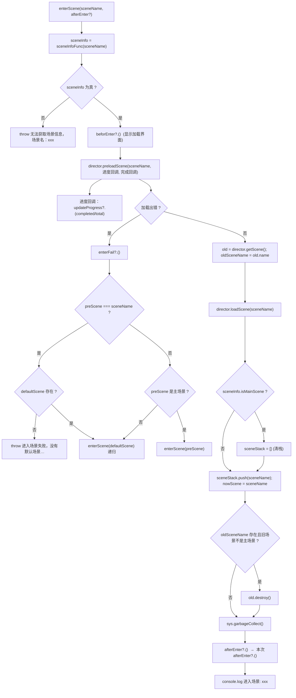
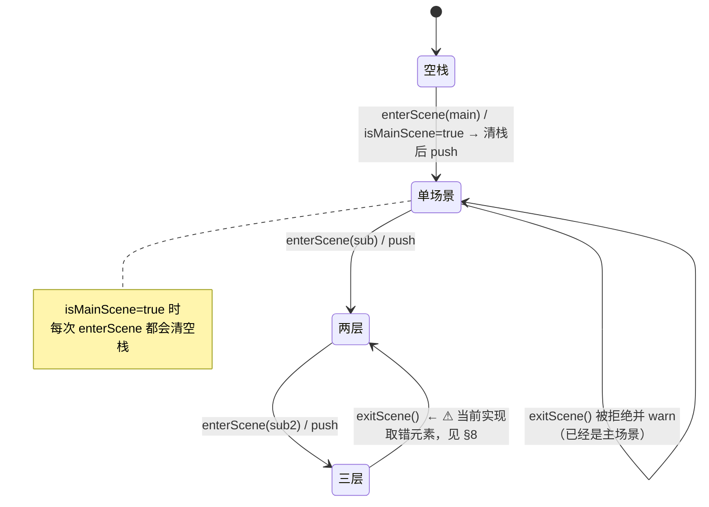
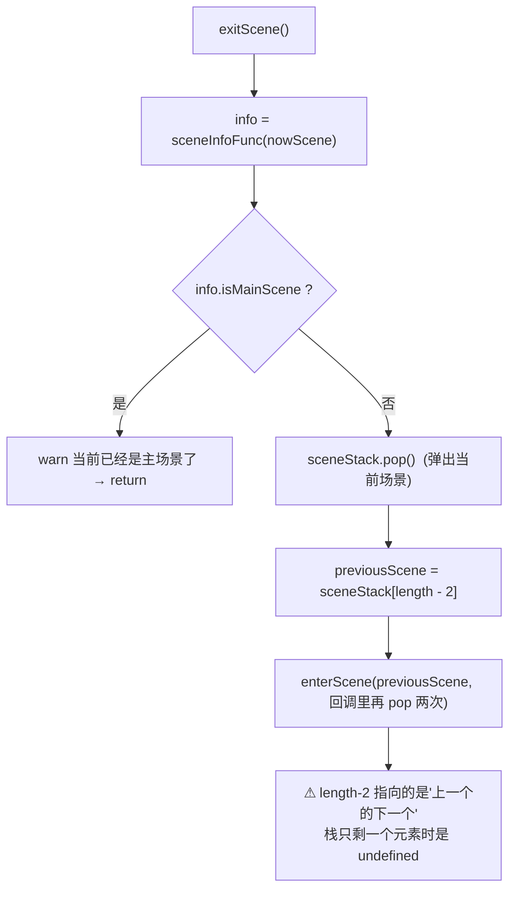
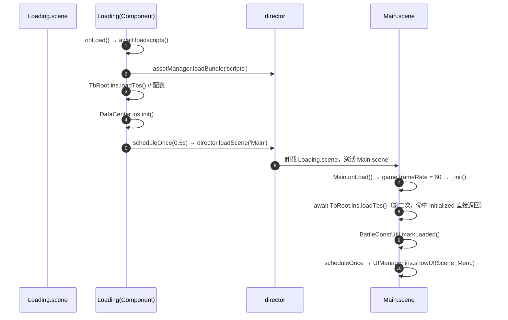

# 场景切换（scene）

> 源码：`assets/scripts/platform/scene/`（`SceneMgr.ts` 170 行 + `SceneInfo.ts` 4 行）｜ 平台层教程第 9 章
> 相关：`platform/ui/UIManager.ts`（场景层清场 `closeAndCacheOverlayLayers`、转场视图 `changeSceneView`）、`docs/UI框架使用说明.md` §6.3

---

## 1. 一句话说明 / 什么时候用

`SceneMgr` 想解决的是**"带加载进度 + 场景栈（能退回上一个场景）"**的场景切换：调用方注册 4 个回调（取场景信息 / 进入前 / 进度 / 进入后），然后 `enterScene(name)`。

⚠ **必须知道的三件事（都能在源码里核实）**：

1. **它当前没有被任何代码使用**：全工程 grep `SceneMgr` 只有它自己（`assets/scripts/platform/scene/SceneMgr.ts`）。真正的场景切换是 `Loading.ts:16` 直接调的 `director.loadScene("Main")`。
2. **它的失败兜底路径是死的**：`defaultScene` 字段**没有任何赋值入口**（170 行里只有读取，没有写入），所以一旦加载失败且需要退默认场景，会抛 `"进入场景失败，没有默认场景，无法进入默认场景！"`（`SceneMgr.ts:82-84`）。
3. **`exitScene()` 的退栈算法是错的**（§8 第 1 条）。

所以本章的定位是：**读源码用（框架能力说明书）**，要真用得先按 §7.1 修三处。

**本工程的场景现状**：只有 2 个 `.scene`（`assets/scenes/Loading.scene` 为首场景、`assets/scenes/Main.scene`），其余"页面"全是 `UIManager` 管的预制件视图 —— 也就是说**这个项目基本不需要场景切换管理器**，这也是它一直没被接线的根本原因。

---

## 2. 源码地图

| 文件 | 职责 | 关键导出 | 行数 |
|---|---|---|---|
| `scene/SceneInfo.ts` | 场景元信息接口 | `SceneInfo { name: string; isMainScene: boolean }` | 4 |
| `scene/SceneMgr.ts` | 切换 + 场景栈 + 进度回调 | `SceneMgr`（`@ccclass` 装饰但**不是 Component**） | 170 |

`SceneMgr` 的私有状态（`SceneMgr.ts:10-17`）：

| 字段 | 用途 | 注意 |
|---|---|---|
| `defaultScene` | 兜底场景名 | **从未被赋值** → 兜底路径必抛错 |
| `nowScene` | 当前场景名 | 只在 `enterScene` 成功分支写；`exitScene` 读它做判断 |
| `sceneStack` | 场景栈 | `isMainScene` 为真时清空后再 push |
| `sceneInfoFunc` | `(sceneName) => SceneInfo` | **必须注册**，否则 `enterScene` 直接抛错 |
| `beforEnter` | 进入前回调 | 注意源码里拼写是 `beforEnter`（少个 e） |
| `updateProgress` | `(p: number) => void` | 由 `preloadScene` 的进度回调驱动 |
| `afterEnter` | 进入后回调 | 内部 `director.loadScene` 之后同步调用 |
| `enterFail` | 失败回调 | 只在 `preloadScene` 出错分支调用 |

---

## 3. 快速上手

```ts
import { SceneMgr } from '../platform/scene/SceneMgr';
import { SceneInfo } from '../platform/scene/SceneInfo';

// 1) 五件事的注册（缺 sceneInfoFunc 会直接 throw）
const INFOS: Record<string, SceneInfo> = {
    Main: { name: 'Main', isMainScene: true },
    Battle: { name: 'Battle', isMainScene: false },
};
SceneMgr.ins.setSceneInfoFun((name) => INFOS[name]);
SceneMgr.ins.setBeforeEnterFun(() => { /* 关掉所有 UI、显示加载界面 */ });
SceneMgr.ins.setUpdateProgressFun((p) => { /* p = completed/total，0~1 */ });
SceneMgr.ins.setAfterEnterFun(() => { /* 新场景已 loadScene，可以开界面了 */ });
SceneMgr.ins.setEnterFailFun(() => { /* 提示"加载失败" */ });

// 2) 切场景
SceneMgr.ins.enterScene('Battle', () => {
    // 本次调用的私有回调，在 afterEnter 之后再执行（SceneMgr.ts:124-125）
});

// 3) 读状态
SceneMgr.ins.getCurrentSceneName();   // 栈顶
SceneMgr.ins.clearSceneStack();
```

一次性想全的写法（放在某个常驻组件的 `onLoad` 里）：

```ts
onLoad() {
    SceneMgr.ins.setSceneInfoFun((n) => SCENE_INFOS[n]);
    SceneMgr.ins.setUpdateProgressFun((p) => this.loadingBar.progress = p);
    SceneMgr.ins.setAfterEnterFun(() => this.loadingNode.active = false);
}
```

---

## 4. API 速查

| 签名 | 参数 | 返回 | 备注 |
|---|---|---|---|
| `SceneMgr.ins` | — | `SceneMgr` | 惰性单例，私有构造（`SceneMgr.ts:19-27`）。**不是 Component**，没有节点也不占场景 |
| `setSceneInfoFun(func)` | `(sceneName: string) => SceneInfo` | `void` | 返回 `null`/`undefined` 时 `enterScene` **抛异常**（`SceneMgr.ts:61-63`） |
| `setBeforeEnterFun(func)` | `() => void` | `void` | 在 `preloadScene` **之前**调用（`SceneMgr.ts:67`），适合"关 UI + 开加载界面" |
| `setUpdateProgressFun(func)` | `(progress: number) => void` | `void` | `progress = completedCount / totalCount`（**未做 0 除保护**，`SceneMgr.ts:71`） |
| `setAfterEnterFun(func)` | `() => void` | `void` | 在 `director.loadScene` 与 `garbageCollect` 之后调用（`SceneMgr.ts:121-124`） |
| `setEnterFailFun(func)` | `() => void` | `void` | 只在 preload 的错误分支调用（`SceneMgr.ts:74-76`） |
| `enterWithProgressScene(sceneName, afterEnter?)` | — | `void` | ⚠ **空实现**（函数体没有任何语句，`SceneMgr.ts:48-50`） |
| `enterScene(sceneName, afterEnter?)` | 场景名 + 可选回调 | `void` | 全流程见 §5.1；**不返回 Promise**，成功与否只能靠回调感知 |
| `exitScene()` | — | `void` | ⚠ 退栈算法有 bug（§8 第 1 条），当前不可用 |
| `getCurrentSceneName()` | — | `string` | 返回 `sceneStack` 栈顶（**不是** `nowScene`） |
| `clearSceneStack()` | — | `void` | 清空数组（`nowScene` 不变） |

---

## 5. 生命周期与流程图

### 5.1 `enterScene` 全流程



四个关键点：
1. **`preloadScene` + `loadScene` 两段式**：进度是 `director.preloadScene` 给的，`loadScene` 之后没有进度概念。
2. **主场景会清空场景栈**（`SceneMgr.ts:108-110`）—— 所以"主场景"语义 = "栈的根，不能从它退出去"。
3. **`sys.garbageCollect()`**（`SceneMgr.ts:121`）是平台层少数显式触发 GC 的地方，会对帧率造成一次可见的抖动。
4. **`old.destroy()` 只对"旧场景不是主场景"时执行**（`SceneMgr.ts:115-120`）—— 主场景不销毁，这是刻意的（要留着当根）。

### 5.2 场景栈的语义



### 5.3 `exitScene()` 的真实行为（**不要照这份实现用**）



举例：栈为 `[Main, Shop, Battle]`，`nowScene = 'Battle'`：

| 步骤 | 结果 |
|---|---|
| `pop()` | 栈变 `[Main, Shop]` |
| `previousScene = stack[length-2]` | `stack[0]` = **`'Main'`**（期望是 `'Shop'`） |
| 若栈本来只有 `[Main, Battle]` | `pop()` → `[Main]`；`stack[-1]` = `undefined` → `sceneInfoFunc(undefined)` → 抛 `"无法获取场景信息，场景名：undefined"` |

---

## 6. 与 Cocos 生命周期的关系

| 问题 | 答案 | 证据 |
|---|---|---|
| 依赖 cc 吗 | 依赖 `director` / `Scene` / `SceneAsset` / `sys`，且带 `@ccclass('SceneMgr')` 装饰 —— 但它 **`extends` 的是 `Object`**，不是 `Component` | `SceneMgr.ts:2,6-7` |
| 需要挂节点吗 | **不需要**，`ins` 直接 `new` 出来（`SceneMgr.ts:19-24`），所以它也不会收到任何 Cocos 生命周期回调 |
| 谁驱动 | 调用方。`ins` 只保证单例，**不会**在引擎启动时自动初始化任何东西 |
| 与 `director` 的关系 | 内部用 `director.preloadScene`（带进度）→ `director.loadScene`（真正切换）→ `director.getScene()`（切换前取旧场景） | `SceneMgr.ts:69,101,105` |
| **引擎自己的场景生命周期** | `director.loadScene()` 会触发：旧场景节点树 `_destroy` → 旧场景脚本 `onDestroy` → 新场景 `onLoad` → `onEnable` → `start`。`SceneMgr` 的 `afterEnter` 回调注册在 `loadScene` **之后**，因此**在新场景脚本 `onLoad` 之前还是之后是不确定的**（取决于 `loadScene` 是否同步完成，源码注释假定"已返回新场景"）`[推断]` | `SceneMgr.ts:100-124` |
| 与 UI 的关系 | 切场景时 UI 的清场由 `UIManager` 负责（`closeAndCacheOverlayLayers`，见 `docs/UI框架使用说明.md` §6.3），**不是** `SceneMgr` 的职责 | `UIManager.ts` 未 import `SceneMgr` |

> **重要**：`SceneMgr` 与 `UIManager` **互不知道对方存在**。如果两者都用（`SceneMgr.enterScene` + `UIManager.showUI`），
> 你必须自己在 `setBeforeEnterFun` 里关 UI，否则旧界面的节点会跨场景残留（`UIManager` 的视图栈挂在场景节点上，会被 `loadScene` 连带销毁，
> 但 `UIManager` 的**内部栈与缓存表**不会自动清 —— 这是接场景切换前必须先解决的一致性问题）。

---

## 7. 典型组合用法

### 7.1 配方：把 `SceneMgr` 修到能用（三处最小改动）

1. **给 `defaultScene` 加一个 setter**（现在完全没有写入点）：
   ```ts
   public setDefaultScene(name: string) { this.defaultScene = name; }
   ```
2. **修 `exitScene()` 的取栈**：`pop()` 之后上一个场景应该是**新的栈顶**：
   ```ts
   this.sceneStack.pop();
   const previousScene = this.sceneStack[this.sceneStack.length - 1];  // 不是 length - 2
   ```
   同时注意 `afterEnter` 里那两次额外 `pop()`（`SceneMgr.ts:149-152`）是为了抵消 `enterScene` 的 `push`，
   修完取栈逻辑后要重新推演一遍栈内容（**这段逻辑没有测试覆盖，改动前请先写脚本推演**）。
3. **`afterEnter` 的时机**：改用在 `director.loadScene(name, onLaunched)` 的 `onLaunched` 回调里触发，才能保证新场景已经就绪（现在是在 `loadScene` 返回后同步调用，语义不明确）。

### 7.2 本工程实际怎么切场景



也就是说：**本工程的"切场景"只有启动那一次**（Loading → Main），其余全是 `UIManager` 的视图切换。
如果要加"返回主菜单"这类功能，推荐直接 `director.loadScene('Main')`（或 `UIManager.closeAllUI()` + 重开 `Scene_Menu`），
不要为了它去接一个没人维护的 `SceneMgr`。

### 7.3 与转场动画的关系

`UIManager.showSceneTransition()`（`UIManager.ts:424-436`）走的是**另一条路**：它用一个可注入的视图工厂 `UIManager.changeSceneView`（`UIManager.ts:74`，**当前未赋值**）来创建转场视图，并用 `SCENE_LOAD_PROGRESS` 事件播进度。
也就是说：**转场动画不属于 `SceneMgr`** —— 它归 `UIManager`。两者都"想做场景切换"，但只有 `UIManager` 那条链是活的（虽然 `changeSceneView` 还没接）。

---

## 8. 注意事项与坑

1. **`exitScene()` 退错场景 / 单层栈直接抛错**
   **现象**：从子场景返回时回到了**再上一个**场景，或者报 `"无法获取场景信息，场景名：undefined"`。
   **原因**：`pop()` 之后用 `sceneStack[length - 2]` 取上一个场景，足足多减了一（`SceneMgr.ts:143-147`）。
   **正确做法**：改成 `sceneStack[sceneStack.length - 1]`；修之前**不要调用 `exitScene()`**。

2. **`defaultScene` 没有赋值入口 → 兜底路径必抛错**
   **现象**：某次场景加载失败时，报 `"进入场景失败，没有默认场景，无法进入默认场景！"` 而不是优雅回退。
   **原因**：`private defaultScene: string = null`（`SceneMgr.ts:10`）在全文件里**只有读取**（第 82/85/88/93 行）。
   **正确做法**：加 setter 并在启动时设置（§7.1 第 1 条）。

3. **`enterWithProgressScene` 是空函数**
   **现象**：调了它，什么都没发生，也没有报错。
   **原因**：函数体为空（`SceneMgr.ts:48-50`）。
   **正确做法**：直接用 `enterScene`（它本身就走 `preloadScene`，进度是有的）。

4. **进度回调可能得到 `NaN`**
   **现象**：进度条/百分比显示 `NaN`。
   **原因**：`progress = completedCount / totalCount`，没有对 `totalCount === 0` 的保护（`SceneMgr.ts:71`）。
   **正确做法**：在 `setUpdateProgressFun` 的回调里自己钳一次：`p = Number.isFinite(p) ? Math.min(1, Math.max(0, p)) : 0`。

5. **`sceneInfoFunc` 抛错是"硬失败"**
   **现象**：场景名拼错时直接抛异常中断流程。
   **原因**：`if (!sceneInfo) throw new Error(...)`（`SceneMgr.ts:61-63`）。
   **正确做法**：`sceneInfoFunc` 实现里对未知名字返回一个带日志的默认值，或在外层 try/catch。

6. **成功路径不清理"上一个场景"以外的副作用**
   **现象**：切完场景后旧界面的监听/定时器仍在跑。
   **原因**：`SceneMgr` 只做 `old.destroy()`（且仅当旧场景非主场景）+ `sys.garbageCollect()`（`SceneMgr.ts:115-121`），**不碰 `UIManager`、不碰任何单例**。
   **正确做法**：把"关 UI、清计时器、取消监听"写进 `setBeforeEnterFun`；全局单例（`GlobalEventMgr`、store、`TbRoot`）本来就不该被场景切换清掉。

7. **`old.destroy()` 与引擎自身的场景释放可能重复**
   **现象**：偶发"资源被重复释放"类报错或日志噪声。`[推断]`
   **原因**：`director.loadScene` 本身会负责旧场景的卸载；这里又对非主场景额外 `old.destroy()`。
   **正确做法**：接这套之前先验证一次真实切换（本项目当前**没有**任何调用方，等于没有验证过这条路径）。

8. **`@ccclass('SceneMgr')` 是历史遗留**
   **现象**：编辑器里能"找到" `SceneMgr` 这个类名，但它不是组件，拖不到节点上。
   **原因**：`SceneMgr.ts:6` 有 `@ccclass` 装饰，但类 `extends` 的不是 `Component`（`SceneMgr.ts:7`）。
   **正确做法**：不要试图把它挂节点；它就该是个纯单例。

---

## 9. 调试手段

- **确认它到底有没有被用**（当前结论：没有）：
  ```powershell
  Select-String -Path (Get-ChildItem assets\scripts -Recurse -Filter *.ts) -Pattern "SceneMgr"
  ```
- **打印栈**：临时在 `enterScene`/`exitScene` 末尾打 `console.log(SceneMgr.ins.getCurrentSceneName(), this.sceneStack)` —— 注意 `sceneStack` 是私有字段，调试时可直接 `console.log` 打包后的对象，或加一个临时 `public debugStack()`。
- **验证回调顺序**：四个回调都打时间戳（`performance.now()`），特别要看 `afterEnter` 与新场景脚本 `onLoad` 的先后（§6 里那条 `[推断]`）。
- **转场链路**：与 `SceneMgr` 无关，看 `UIManager.showSceneTransition()` + `GlobalEventMgr` 的 `SCENE_LOAD_PROGRESS`（第 7 章 §5.2）。

---

## 10. 事实依据

1. `assets/scripts/platform/scene/SceneInfo.ts:1-4` — `SceneInfo` 只有 `name` 与 `isMainScene`。
2. `assets/scripts/platform/scene/SceneMgr.ts:6-7` — `@ccclass('SceneMgr')` 但 `class SceneMgr`（非 Component）。
3. `assets/scripts/platform/scene/SceneMgr.ts:10` — `defaultScene` 初值 `null`。
4. `assets/scripts/platform/scene/SceneMgr.ts:19-27` — 惰性单例 + 私有构造。
5. `assets/scripts/platform/scene/SceneMgr.ts:31-45` — 5 个回调注入 API（注意 `beforEnter` 拼写）。
6. `assets/scripts/platform/scene/SceneMgr.ts:48-50` — `enterWithProgressScene` 空实现。
7. `assets/scripts/platform/scene/SceneMgr.ts:61-63` — 取不到 `SceneInfo` 就 throw。
8. `assets/scripts/platform/scene/SceneMgr.ts:67` — `beforEnter` 在 preload 之前调用。
9. `assets/scripts/platform/scene/SceneMgr.ts:69-72` — `preloadScene` 与 `completed/total` 进度。
10. `assets/scripts/platform/scene/SceneMgr.ts:74-97` — 失败分支（含用到 `defaultScene` 的兜底，以及没有默认场景时 throw）。
11. `assets/scripts/platform/scene/SceneMgr.ts:100-105` — 先取旧场景再 `director.loadScene`。
12. `assets/scripts/platform/scene/SceneMgr.ts:108-112` — 主场景清栈 + push + `nowScene`。
13. `assets/scripts/platform/scene/SceneMgr.ts:115-121` — 非主场景才 `old.destroy()`；随后 `sys.garbageCollect()`。
14. `assets/scripts/platform/scene/SceneMgr.ts:143-152` — `exitScene` 的 `length - 2` 取栈错误与额外两次 `pop`。
15. `assets/scripts/game/scene/Loading.ts:15-17` — 工程真实切场景：`director.loadScene("Main")`。
16. `assets/scripts/game/scene/Main.ts:18-33` — Main 场景启动链（`game.frameRate = 60` → `loadTbs` → `showUI(Scene_Menu)`）。
17. `assets/scripts/platform/ui/UIManager.ts:74` — `changeSceneView` 字段（当前为 `null`）。
18. `assets/scripts/platform/ui/UIManager.ts:424-436` — `showSceneTransition` 用 `scheduleOnce(0) + emit('SCENE_LOAD_PROGRESS', 0)`。
