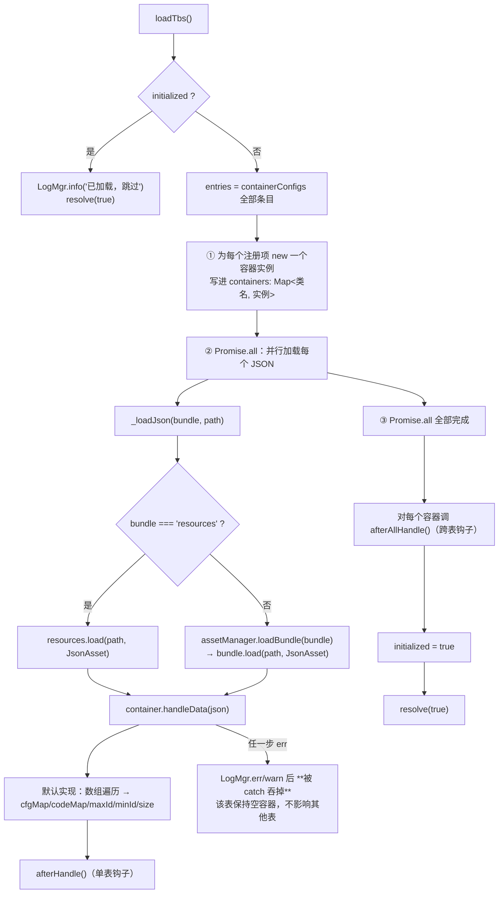
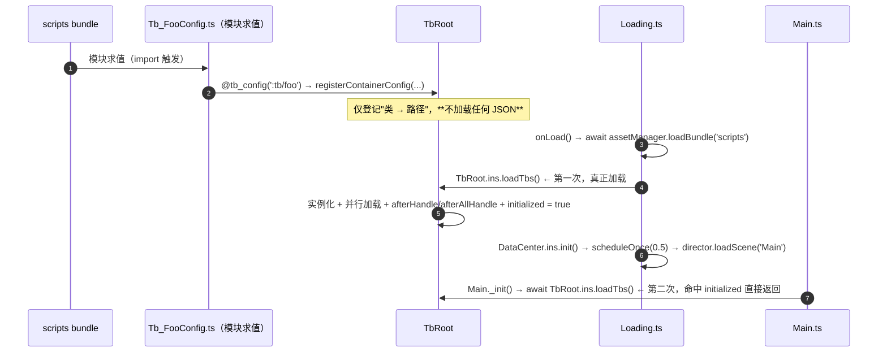
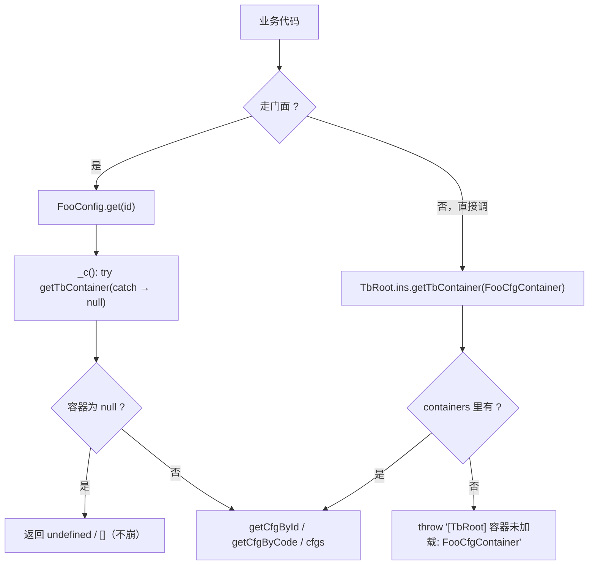

# 配表框架（excel_table）

> 源码：`assets/scripts/platform/excel_table/` ｜ 平台层教程第 10 章
> 相关：`docs/agent-notes/配表与数值口径.md`、`docs/数值配置参考手册.md`、`tools/excel_export/README.md`（Excel → JSON 的编辑流水线）

---

## 1. 一句话说明 / 什么时候用

`excel_table` 是**"Excel 编辑 → 导出 JSON → 运行时按容器装载"**的配表管线，只有三块：

```mermaid
flowchart LR
    X["tools/excel_export/excel/*.xlsx<br/>（唯一的编辑源）"] -->|npm run export| J["assets/resources/tb/*.json"]
    J -->|TbRoot.loadTbs()| C["TbContainer 子类实例<br/>（cfgs / cfgMap / codeMap）"]
    C -->|门面封装| F["game/data/configs/*.ts<br/>HeroConfig / ShopConfig / TaskConfig …"]
    F -->|只读查询| G["业务逻辑"]
```

- 你**新增一张表**时要动的是：`tools/excel_export` 的 schema + Excel → 写一个 `Tb_XxxConfig.ts`（容器）→ 在 configs 里加门面 → 接进副作用导入链。
- 你**改数值**时：只改 `.xlsx` → `npm run export`（改 `assets/resources/tb/*.json` 会被下次导表覆盖，详见 AGENTS.md 的判据速查）。

**什么时候用它**：一切"策划要调的数字"。**什么时候不要用**：运行期会变的状态（那是 `DataModule` / store）。

---

## 2. 源码地图

| 文件 | 职责 | 关键导出 | 行数 |
|---|---|---|---|
| `excel_table/TbRoot.ts` | **管线总入口**：容器注册表 + 加载 + 查询 | `TbRoot`（`ins` 单例） | 142 |
| `excel_table/TbContainer.ts` | 容器基类（数据 + 三种索引） | `TbContainer<T>`（abstract） | 68 |
| `excel_table/TbConfigDecorator.ts` | `@tb_config('bundle:path')` 装饰器 | `tb_config` | 44 |
| `excel_table/ITbDecode.ts` | 解码器接口 | `ITbDecode<T>` | 7 |
| `excel_table/ExcelConfigDecorator.ts` | ⚠ **旧框架残留，已不可用** | `bind_path` / `tb_container` / `tb_decoder` | 41 |

### 2.1 当前注册了哪些容器（全工程 12 个 `@tb_config`）

| JSON（`assets/resources/tb/`） | 容器（`game/excel_table/`） | 门面（`game/data/configs/`） |
|---|---|---|
| `units.json` | `Tb_UnitConfig.ts` | `HeroConfig.ts` |
| `attributes.json` | `Tb_AttributeConfig.ts` | — |
| `abilities.json` | `Tb_AbilityConfig.ts` | `ShopConfig.ts`（肉鸽技能） |
| `modifiers.json` | `Tb_ModifierConfig.ts` | `ShopConfig.ts` |
| `relics.json` | `Tb_RelicConfig.ts` | `ShopConfig.ts` / `EquipmentConfig.ts` |
| `battle_constants.json` | `Tb_BattleConstConfig.ts` | `BattleConstUtil`（在 `battle/core/`） |
| `shop_constants.json` | `Tb_ShopConstConfig.ts` | `ShopConfig.ts` |
| `shop_draw.json` | `Tb_ShopDrawConfig.ts` | `ShopConfig.ts` |
| `kill_buffs.json` | `Tb_KillBuffConfig.ts` | `ShopConfig.ts` |
| `tasks.json` | `Tb_TaskConfig.ts` | `TaskConfig.ts` |
| `player_levels.json` | `Tb_PlayerLevelConfig.ts` | `LevelConfig.ts` |
| `achievements.json` | `Tb_AchievementConfig.ts` | `AchievementConfig.ts` |

> ⚠ **文档漂移提醒**：`AGENTS.md` 的「`assets/resources/tb/` 现有 9 张权威表」清单里**没有** `tasks` / `player_levels` / `achievements` 这三张。
> 以**磁盘上的 12 个 JSON + 12 个 `@tb_config`** 为准（本章已核对）。

### 2.2 ⚠ 旧框架已死：`ExcelConfigDecorator.ts` 不要用

它导出的 `tb_container` / `tb_decoder` 调的是 `TbRoot.ins.registryContainer(...)` / `TbRoot.ins.registryDecoder(...)`，
而**现在的 `TbRoot` 根本没有这两个方法**（只有 `registerContainerConfig`），一旦被调用就是 `undefined is not a function`。
`ITbDecode<T>` 接口也因此**没有任何消费方**（`TbRoot` 里没有 decoder 注册表）。

**结论**：新表一律走 `@tb_config` + `TbContainer`；`ExcelConfigDecorator.ts` 与 `ITbDecode.ts` 是历史遗留，读到别信、别扩展。

---

## 3. 快速上手

### 3.1 新增一张表的完整步骤（4 步）

**第 1 步：写容器**（`assets/scripts/game/excel_table/Tb_FooConfig.ts`）

```ts
import { tb_config } from '../../platform/excel_table/TbConfigDecorator';
import { TbContainer } from '../../platform/excel_table/TbContainer';

/** 一行配置：必须含 id: number 主键 */
export class FooCfg {
    id!: number;
    name!: string;
    value!: number;
}

@tb_config(':tb/foo')   // ':path' = resources bundle；'myBundle:path' = 自定义 bundle
export class FooCfgContainer extends TbContainer<FooCfg> {
    getTbName(): string { return 'FooCfg'; }
}
```

**第 2 步：写门面**（推荐，且必须用 `try/catch` 容错 —— 见 §8 第 1 条）

```ts
import { TbRoot } from '../../../platform/excel_table/TbRoot';
// ⚠ 必须「值导入」：@tb_config 靠模块求值完成注册（见 Tb_TaskConfig.ts:16 的注释）
import { FooCfg, FooCfgContainer } from '../../excel_table/Tb_FooConfig';

export class FooConfig {
    private static _c(): FooCfgContainer | null {
        try { return TbRoot.ins.getTbContainer(FooCfgContainer); } catch { return null; }
    }
    static isReady(): boolean { return !!FooConfig._c()?.size; }
    static get(id: number): FooCfg | undefined { return FooConfig._c()?.getCfgById(id); }
    static getAll(): FooCfg[] { return FooConfig._c()?.cfgs ?? []; }
}
```

**第 3 步：接进副作用导入链**（在 `assets/scripts/game/scene/Main.ts` 的导入区加一行）

```ts
import '../data/configs/FooConfig';  // 与 ShopConfig / TaskConfig / LevelConfig / AchievementConfig 并列
```

**第 4 步：导出 Excel 并回灌**

```powershell
cd tools/excel_export
npm run export          # excel/foo.xlsx → assets/resources/tb/foo.json
npm run check           # 格式校验
```

### 3.2 查询（运行时）

```ts
import { TbRoot } from '../platform/excel_table/TbRoot';
import { UnitCfgContainer } from '../game/excel_table/Tb_UnitConfig';

const tb = TbRoot.ins.getTbContainer(UnitCfgContainer);  // ⚠ 未加载会 throw
const hero = tb.getCfgById(1001);
const all = tb.cfgs;          // 原数组（注意是引用，别改）
tb.size;                      // 条数
tb.codeMap.get('sniper');     // 需要该行有 code 字段
```

**业务代码推荐只调门面**（`HeroConfig` / `ShopConfig` / `TaskConfig` …），不要直接 `getTbContainer`：门面负责"未加载就返回空"的容错。

---

## 4. API 速查

### `TbRoot`（`TbRoot.ts`）

| 签名 | 参数 | 返回 | 备注 |
|---|---|---|---|
| `TbRoot.ins` | — | `TbRoot` | 惰性单例（第 20-25 行） |
| `registerContainerConfig(type, bundle, path)` | 容器类 + bundle + path | `void` | **由 `@tb_config` 调用**；同名重复注册只 `warn` 并**忽略后一次**（第 37-40 行） |
| `getTbContainer(type)` | 容器类 | `C` | ⚠ **未加载时 `throw new Error('[TbRoot] 容器未加载: ' + 类名)`**（第 53-55 行） |
| `loadTbs()` | — | `Promise<boolean>` | 幂等：已加载则直接 `resolve(true)`（第 63-68 行）；流程见 §5.1 |

### `TbContainer<T extends { id: number }>`（`TbContainer.ts`）

| 成员 | 类型 | 说明 |
|---|---|---|
| `cfgs` | `T[]` | 全部数据（`handleData` 直接引用传入数组） |
| `cfgMap` | `Map<number, T>` | **id → 行**；同 id 会被**后一条覆盖**（第 51 行） |
| `codeMap` | `Map<string, T>` | 仅当行里有 `code` 字段时填充（`String(code)`，第 52-56 行） |
| `maxId` / `minId` / `size` | `number` | 加载时统计；`maxId` 初值 0（第 45-58 行） |
| `getTbName()` | abstract | 子类必须实现（当前实现只是返回类名字符串，**框架内部并未使用**） |
| `getCfgById(id)` / `getCfgByCode(code)` / `getcfgs()` | — | 只读查询（第 24-34 行） |
| `handleData(data)` | — | 默认按**数组**处理；**KV 结构的表必须重写**（见 §7.2）；结束时调 `afterHandle()`（第 40-61 行） |
| `afterHandle()` | 可重写 | 单表处理完后调用 —— 适合建二级索引 |
| `afterAllHandle()` | 可重写 | **所有表**加载完后调用（第 94-96 行）—— 适合跨表关联（例如把属性 id 翻译成名字） |

### `@tb_config(spec)`（`TbConfigDecorator.ts`）

| `spec` 写法 | 解析结果 |
|---|---|
| `':tb/units'` | `bundle = 'resources'`，`path = 'tb/units'` |
| `':tb/units'`（冒号在第 0 位） | 同上（第 33-35 行：`colonIdx <= 0` 都走默认 bundle） |
| `'resources:tb/units'` | 同上 |
| `'myBundle:tb/items'` | `bundle = 'myBundle'`，`path = 'tb/items'` |
| `'tb/units'`（无冒号） | `bundle = 'resources'`，`path = 'tb/units'` |

⚠ `path` **不带 `.json` 后缀**（`JsonAsset` 的加载路径规则）。

---

## 5. 生命周期与流程图

### 5.1 `loadTbs()` 一次加载的完整流程



**四个必须记住的点**：

1. **加载是并行的**，`afterAllHandle()` 才是"全部就绪"的可靠时机。
2. **单表失败不会失败整体**：每个条目自己的 `try/catch` 把错误吞了（第 88-90 行），`_loadJson` 失败也只 `resolve(null)`（第 117/126/132 行）→ 该容器保持 `size = 0`。`Promise.all` 的 `.catch`（第 100-103 行）实际上**几乎不可能触发**。
   → **`loadTbs()` 返回 `true` 不代表每张表都成功**，必须自己校验 `size`（§9）。
3. **`initialized` 是一次性的**：第二次调用直接返回，**不会**补加载"后来才注册"的容器（§8 第 2 条）。
4. `loadTbs()` **没有 reload / unload API** —— 改表必须重启游戏。

### 5.2 注册时机：为什么"副作用导入"是硬要求



**推论**：容器的注册必须发生在**第一次 `loadTbs()` 之前**。工程里有两道保险：
- `Loading.ts:22` 先 `assetManager.loadBundle('scripts')`，再 `TbRoot.ins.loadTbs()`（`Loading.ts:22-32`）；
- `Main.ts:6-12` 与各 `configs/*.ts` 用**副作用导入**显式引入容器模块（`Main.ts:6` 的注释写明"必须在 `loadTbs()` 之前完成"）。

`[推断]` 关于"模块求值到底发生在 `loadBundle` 那一刻还是更早"取决于 Cocos 的分包脚本打包方式，本次未在真机验证；**实践口径按"两道保险都要有"执行**更安全。

### 5.3 运行期一次查询的路径



---

## 6. 与 Cocos 生命周期的关系

| 问题 | 答案 | 证据 |
|---|---|---|
| 依赖 cc 吗 | 依赖 `resources` / `assetManager` / `JsonAsset`（**唯一依赖引擎资源系统的平台模块**） | `TbRoot.ts:1` |
| 是 Component 吗 | **不是**。`TbRoot` 是纯 TS 单例，没有 onLoad/onDestroy | `TbRoot.ts:11-25` |
| 谁在什么时候加载 | **必须有人显式调 `loadTbs()`**；本项目是 `Loading.onLoad()`（第一次）+ `Main._init()`（第二次，空跑） | `Loading.ts:10-32`、`Main.ts:24-28` |
| 配表会随场景卸载吗 | **不会**。JSON 资源经 `resources.load` 加载后由引擎缓存，容器实例由 `TbRoot` 静态持有 → **跨场景常驻**，也不需要重载 | `TbRoot.ts:17`（`containers` 字段） |
| 与 `director.loadScene` 的关系 | 无关：`TbRoot` 不监听任何引擎事件。唯一耦合点是 `Loading → Main` 的启动顺序 | `Loading.ts:15-17` |
| 与 Excel 的关系 | 运行期**完全不知道 Excel 的存在**，只读 JSON | — |

> **启动链的完整时序**（详见第 0 章 §3）：`Loading.scene` → `loadBundle('scripts')` → `loadTbs()` → `DataCenter.ins.init()` →
> `director.loadScene('Main')` → `Main.onLoad`（`frameRate = 60`）→ `loadTbs()`（空跑）→ `BattleConstUtil.markLoaded()` → `showUI(Scene_Menu)`。

---

## 7. 典型组合用法

### 7.1 用 `afterAllHandle()` 做跨表关联

```ts
@tb_config(':tb/kill_buffs')
export class KillBuffCfgContainer extends TbContainer<KillBuffCfg> {
    getTbName(): string { return 'KillBuffCfg'; }

    /** 跨表：把 attr_id 翻译成属性名（此时 attributes.json 已加载完） */
    attrNames = new Map<number, string>();

    afterAllHandle(): void {
        const attrs = TbRoot.ins.getTbContainer(AttributeCfgContainer);
        for (const cfg of this.cfgs) {
            const a = attrs.getCfgById(cfg.attr_id);
            if (a) this.attrNames.set(cfg.id, a.name);
        }
    }
}
```

⚠ `afterAllHandle()` 里**只能安全访问已注册的表**；未注册/未加载的表会 `throw`（这正是"必须 try/catch"的理由）。

### 7.2 KV 结构的表必须重写 `handleData`

`shop_constants.json` 顶层是 `{ 常量名: 值 }` 而不是数组，所以它的容器重写了 `handleData`（`Tb_ShopConstConfig.ts:29-51`），
把对象转成"一行一条"的 `{ id, key, code, value }`，这样 `codeMap`/`getCfgByCode` 才能用（`key` 与 `code` 都设为常量名）。

模板：

```ts
handleData(data: any): void {
    const obj = (data ?? {}) as Record<string, any>;
    this.cfgs = []; this.cfgMap.clear(); this.codeMap.clear(); this.size = 0;
    let idx = 0;
    for (const key of Object.keys(obj)) {
        idx++;
        const cfg = { id: idx, key, code: key, value: obj[key] } as any;
        this.cfgs.push(cfg); this.cfgMap.set(cfg.id, cfg); this.codeMap.set(cfg.code, cfg);
    }
    this.size = this.cfgs.length; this.maxId = idx; this.minId = idx > 0 ? 1 : 0;
    this.afterHandle();          // ⚠ 重写后必须自己调，否则单表钩子不会跑
}
```

### 7.3 三条链路的职责划分（改表时按这张图找地方）


---

## 8. 注意事项与坑

1. **`getTbContainer` 未加载时会 `throw`（不是返回 null）**
   **现象**：某个界面在配表就绪前打开 → 直接抛异常，界面白屏。
   **原因**：`TbRoot.ts:53-55` 主动 `throw`。
   **正确做法**：业务侧**一律通过门面**访问，门面用 `try { ... } catch { return null }` 包住（`TaskConfig.ts:24-30` 是标准模板），取不到就返回空集合。

2. **`loadTbs()` 返回 `true` ≠ 每张表都成功；而且第二次调用不会补加载**
   **现象**：新增容器后控制台有 `[TbRoot] 加载失败 …`，但游戏照常跑，直到某处突然 `throw 容器未加载`；或者把注册代码放到 `Main.ts` 里却永远不生效。
   **原因**：① 每个条目的错误被 `try/catch` 吞掉、`_loadJson` 失败只 `resolve(null)`（`TbRoot.ts:88-90, 113-140`）；② `initialized` 置真后 `loadTbs()` 直接返回（`TbRoot.ts:63-68`），**晚注册的容器永远不会被实例化**。
   **正确做法**：新增容器后必须**同时**做两件事 —— 写 `@tb_config` 容器 + 接进副作用导入链（`Main.ts` 顶部或某个 `configs/*.ts`）；启动后跑一次自检（§9）。

3. **`cfgMap` 同 id 会静默覆盖**
   **现象**：表里有两条相同 id，只有一条能被查到，`size` 却算了两条。
   **原因**：`cfgMap.set(id, cfg)` 无去重（`TbContainer.ts:51`）。
   **正确做法**：靠 `npm run check` 的 id 唯一性校验拦在导表阶段（这是**格式**校验，别跳过）。

4. **KV 表忘了重写 `handleData` → 拿到一个"不是数组的数组"**
   **现象**：`getcfgs()` 返回一个对象，`size` 是 `undefined`，遍历什么都拿不到。
   **原因**：默认实现 `this.cfgs = rawData; this.size = rawData.length;`（`TbContainer.ts:41-43`），对象没有 `length`，循环直接不执行。
   **正确做法**：KV 结构的 JSON **必须**重写 `handleData`（§7.2），并在重写里显式调 `afterHandle()`。

5. **`minId` 对负数 id 不可靠**
   **现象**：全是负数 id 的表里 `minId` 为 0。
   **原因**：`this.minId = 0` 初始化 + `if (i === 0 || id < this.minId)` —— 第一条会正确赋值，所以只有"空表"才会得到 0。`maxId` 同样是 0 初值（`TbContainer.ts:45-58`）。
   **正确做法**：别把 `minId/maxId` 当业务判据，只当调试信息。

6. **`@tb_config` 同名容器重复注册会静默忽略后一次**
   **现象**：两个文件用了同一个容器类名，只有一个生效。
   **原因**：`if (this.containerConfigs.has(name)) { warn; return; }`（`TbRoot.ts:37-40`），key 是**类名**。
   **正确做法**：容器类名保持唯一（`Tb_XxxConfig` 命名已经保证了这一点）。

7. **`path` 写错/带后缀 → 只有一条 warn**
   **现象**：控制台出现 `[TbRoot] 加载失败 resources:tb/foo: …`，游戏继续跑。
   **原因**：同上，失败被吞。
   **正确做法**：`@tb_config(':tb/foo')` 对应 `assets/resources/tb/foo.json`（**不带 `.json`**）；路径大小写敏感（真机与 Windows 表现可能不同）。

8. **`ExcelConfigDecorator.ts` 是坏的，`ITbDecode` 是没人用的**
   **现象**：照着旧文件写 `@tb_container(...)` 报 `TbRoot.ins.registryContainer is not a function`。
   **原因**：`ExcelConfigDecorator.ts:30,38` 调用的方法在当前 `TbRoot` 里不存在。
   **正确做法**：只用 `@tb_config`；不要把 `ITbDecode` 当成"要实现的扩展点"。

9. **改 JSON 不改 xlsx = 白改**
   **现象**：本地调好的数值，下次导表后被覆盖回去。
   **原因**：`xlsx` 是编辑源，`npm run export` 会按 xlsx 重写 JSON。
   **正确做法**：改 xlsx → `npm run export`；脚本改了 JSON 的顺序必须**回灌 xlsx**（`node src/cli.ts json2excel --force --table <表名>`），细节见 AGENTS.md。

---

## 9. 调试手段

- **启动自检（推荐贴进 `Main._init()` 之后跑一次）**：
  ```ts
  import { TbRoot } from '../../platform/excel_table/TbRoot';
  import { UnitCfgContainer } from '../excel_table/Tb_UnitConfig';
  ezgame.info('[TB] units =', TbRoot.ins.getTbContainer(UnitCfgContainer).size);
  ```
  遍历所有容器更省事的方式：加载日志里已经逐表打了一条 `[TbRoot] resources:tb/xxx 加载完成，共 N 条`（`TbRoot.ts:86`）—— **先看控制台有没有这条**，没有就是加载失败。
- **门面自检**：`TaskConfig.isReady()` / `ShopConfig` 同款 `isReady()`，用来在界面上判定"配表还没好"。
- **导表侧校验**：`cd tools/excel_export; npm run check`（格式） / `npm run verify`（Excel↔JSON 往返无损）。
- **定位"容器未加载"**：异常信息里带类名（`[TbRoot] 容器未加载: XxxCfgContainer`），直接查这个类有没有被**副作用导入**。
- **看注册了多少**：`TbRoot` 的 `containerConfigs` 是私有的；临时调试可在 `registerContainerConfig` 里打开被注释掉的那行 `LogMgr.info('[TbRoot] 已注册容器: …')`（`TbRoot.ts:42`）。

---

## 10. 事实依据

1. `assets/scripts/platform/excel_table/TbRoot.ts:11-25` — `TbRoot` 单例与三个私有 Map/标志。
2. `assets/scripts/platform/excel_table/TbRoot.ts:31-43` — `registerContainerConfig` 与重复注册 warn（第 42 行是被注释掉的注册日志）。
3. `assets/scripts/platform/excel_table/TbRoot.ts:49-57` — `getTbContainer` 未加载时 throw。
4. `assets/scripts/platform/excel_table/TbRoot.ts:62-108` — `loadTbs` 的三步（实例化 / 并行加载 / 跨表钩子）与 `initialized` 短路。
5. `assets/scripts/platform/excel_table/TbRoot.ts:88-90` — 单表失败被 catch 吞掉。
6. `assets/scripts/platform/excel_table/TbRoot.ts:100-103` — `Promise.all` 的 catch → `resolve(false)`。
7. `assets/scripts/platform/excel_table/TbRoot.ts:112-141` — `_loadJson` 的 resources / 自定义 bundle 两条路径。
8. `assets/scripts/platform/excel_table/TbContainer.ts:40-61` — 默认 `handleData`（数组格式）+ `afterHandle` 调用点。
9. `assets/scripts/platform/excel_table/TbContainer.ts:63-67` — `afterHandle` / `afterAllHandle` 两个可重写钩子。
10. `assets/scripts/platform/excel_table/TbConfigDecorator.ts:28-43` — `@tb_config` 的路径解析规则。
11. `assets/scripts/platform/excel_table/TbConfigDecorator.ts:5-19` — 装饰器文件头的用法示例（含查询写法）。
12. `assets/scripts/platform/excel_table/ExcelConfigDecorator.ts:30,38` — 调用不存在的 `registryContainer` / `registryDecoder`。
13. `assets/scripts/platform/excel_table/ITbDecode.ts:4-7` — `decode(container)` 接口，无消费方。
14. `assets/scripts/game/scene/Loading.ts:20-34` — 先 `loadBundle('scripts')` 再 `loadTbs()`。
15. `assets/scripts/game/scene/Main.ts:5-12` — 副作用导入的注释与四行导入。
16. `assets/scripts/game/scene/Main.ts:24-28` — `loadTbs()` + `BattleConstUtil.markLoaded()`。
17. `assets/scripts/game/excel_table/Tb_ShopConstConfig.ts:25-51` — KV 表重写 `handleData` 的完整模板。
18. `assets/scripts/game/data/configs/TaskConfig.ts:16-17,24-30` — 「值导入」注释 + 门面 `try/catch` 容错模板。
19. `assets/resources/tb/` — 实际 12 个 JSON（`units/attributes/abilities/modifiers/relics/battle_constants/shop_constants/shop_draw/kill_buffs/tasks/player_levels/achievements`）。
