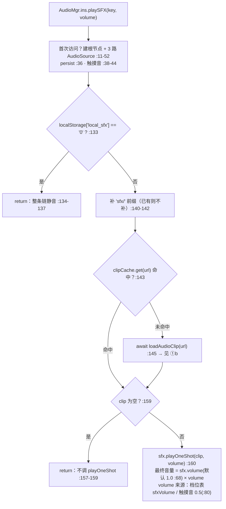
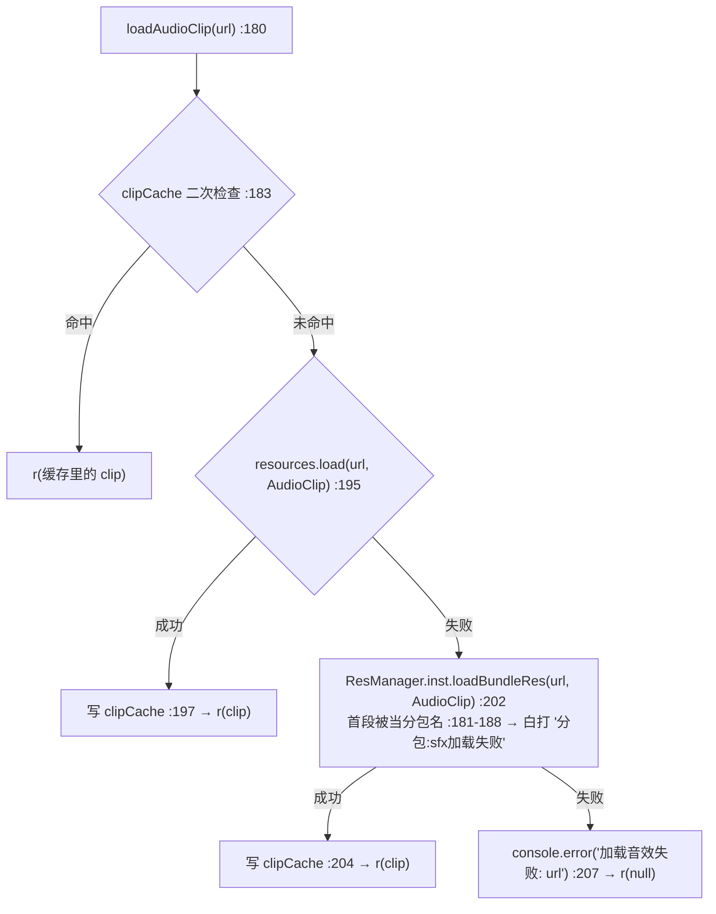
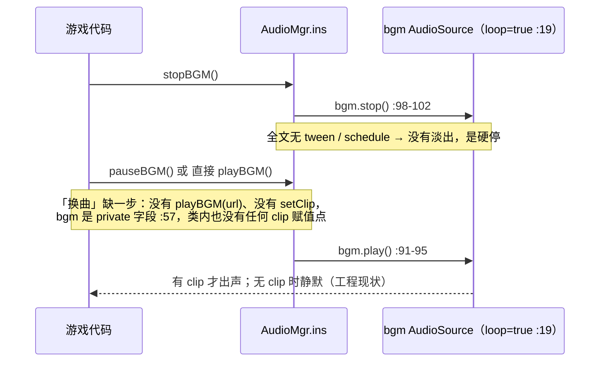

# 音频（audio）

> 源码：`assets/scripts/platform/audio/AudioMgr.ts` ｜ 平台层教程第 11 章

---

## 1. 一句话说明 / 什么时候用

`AudioMgr` 是平台层的**音频单例**：一个 `Component` 子类（`AudioMgr.ts:7`），自己 `new` 出一个持久化节点，在它下面挂三路 `AudioSource`（BGM / SFX / 语音，`AudioMgr.ts:16-34`），对外只暴露一个静态入口 `AudioMgr.ins`（`AudioMgr.ts:11`）。

**什么时候用**：要放一声短音效（命中、暴击、点击、UI）。**什么时候别指望它**：BGM 与语音这两路在工程里没有任何"喂 clip"的入口（`bgm`/`sfx`/`voice` 都是 `private`，`AudioMgr.ts:57-61`），`playBGM()` 只是 `bgm.play()`，没有任何赋值点 → **当前能真正出声的只有 `playSFX`**（`[推断]`：BGM 要落地得先在类内补一个设置 clip 的 API）。

真实的接入点只有一个：战斗场景把 `AudioMgr.ins.playSFX` 作为**回调**注入打击反馈导演，并在进战斗时预加载（`Scene_Game_Stage.ts:793-796`）。

---

## 2. 源码地图

| 文件 | 作用 |
|---|---|
| `assets/scripts/platform/audio/AudioMgr.ts` | 全部实现（255 行）：`ins` 单例、三路 `AudioSource`、`playSFX` / `preloadSfx` / `loadAudioClip` |
| `assets/scripts/game/common/HitFeelConfig.ts` | **音效键与音量的真源**：每档的 `sfx` / `sfxVolume` / `sfxVariants`（如 `:157` T0 = `hit_light` @0.35、`:165` T1 = `hit_crit` @0.70）、非档位两声（`:569-579` attackShot 0.30 / evade 0.40）、变体挑键 `hitFeelSfxKey`（`:595`）、预加载清单 `hitFeelSfxKeys()`（`:613`） |
| `assets/scripts/game/game_stage/entityview/HitFeelDirector.ts` | 决策层（**纯 TS 无 cc**）：播放回调字段 `sfxPlayer`（`:140`）、节流账本 `requestSfx`（`:523-539`） |
| `assets/scripts/game/ui/scenes/scene_game_stage/Scene_Game_Stage.ts` | **唯一接入点**：`import`（`:45`）、`show()`（`:578`）→ `initBattle()`（`:593`）里注入回调 + 预加载（`:793-796`） |
| `assets/resources/sfx/` | 16 个 wav（11 音 + 5 个音高变体）+ 16 个 `.wav.meta`（文件系统实测） |
| `tools/hit-feel-sfx/` | 素材的**离线渲染器**（`design.mjs` / `render.mjs` / `check-drift.mjs` / `audition.html`），口径见该目录 `README.md:3-4` |

---

## 3. 快速上手

下面示例的 import 深度照抄真实接入点 `Scene_Game_Stage.ts:45-46`（该文件在 `assets/scripts/game/ui/scenes/scene_game_stage/`）。

**① 播一声 SFX（带音量参数）** —— 音量缺省是 `1`（`AudioMgr.ts:131`）：

```ts
import AudioMgr from '../../../../platform/audio/AudioMgr';

// 音量 0~1，最终 = AudioSource.volume（默认 1.0，:68）× 这个倍数
AudioMgr.ins.playSFX('hit_crit', 0.7).catch((e) => console.warn('音效播放失败', e));
// 已经带 `sfx/` 前缀也合法（只在缺失时补，:140-142）
AudioMgr.ins.playSFX('sfx/click', 0.5).catch(() => { /* 音效可有可无 */ });
```

**② 预加载（战斗里密集触发时必须）** —— `playSFX` 是"先加载再播"，第一次命中才加载会晚半拍（`AudioMgr.ts:128-129`）：

```ts
import AudioMgr from '../../../../platform/audio/AudioMgr';
import { hitFeelSfxKeys } from '../../../common/HitFeelConfig';

// 清单来自真源（HitFeelConfig.ts:613），不要手写键名数组
AudioMgr.ins.preloadSfx(hitFeelSfxKeys()).catch((e) => console.warn('音效预加载失败', e));
```

**③ 音量设置**：

```ts
import AudioMgr from '../../../../platform/audio/AudioMgr';

AudioMgr.ins.setSFXVolume(0.8); // 写 sfx.volume（默认 1.0，:68 / :216-221）
AudioMgr.ins.setBGMVolume(0.6); // 只作用于 bgm 这一路（:113-118）
```

**④ BGM 播放 / 暂停 / 停止 /「切换」** —— 这三个方法**都没有参数**（`AudioMgr.ts:91/:98/:105`）：

```ts
import AudioMgr from '../../../../platform/audio/AudioMgr';

AudioMgr.ins.playBGM();  // bgm.play()  :91-95
AudioMgr.ins.pauseBGM(); // bgm.pause() :105-109
AudioMgr.ins.stopBGM();  // bgm.stop()  :98-102
// ⚠「切换 BGM」在本工程做不到：没有 playBGM(url)、没有 setClip，
//    bgm 还是 private（:57）。真实的换曲 = stopBGM() → 换 clip → playBGM()，
//    中间那一步要先给 AudioMgr 补 API（源码里也**没有淡出**，全文无 tween/schedule）。
```

**⑤ 场景切换时的处理** —— 根节点是持久节点，切场景**不销毁也不重放**（`AudioMgr.ts:36`）；要收声只有三个口：

```ts
import AudioMgr from '../../../../platform/audio/AudioMgr';

AudioMgr.ins.stopAll();   // bgm + sfx + voice 全停  :236-240
AudioMgr.ins.pauseAll();  // 全暂停（切后台可用）    :243-247
AudioMgr.ins.resumeAll(); // 全恢复                  :250-254
// 注意 [推断]：sfx/voice 的 stop()/pause() 只对"用 play() 播的东西"有效，
// 而本工程的音效走 playOneShot（:160）→ 切场景要真静音，靠的是"不再放新声"+ 停掉 bgm。
```

**⑥ 换掉全局触摸音（可选）** —— 每次触摸都会响一声 `click`（音量写死 0.5，`AudioMgr.ts:78-81`）：

```ts
import AudioMgr from '../../../../platform/audio/AudioMgr';

AudioMgr.ins.touchStart = () => { /* 自定义：留空即静音掉点击音 */ };
// 置 null 则退回 defaultTouchStart（:39-43 会判空后调默认实现）
AudioMgr.ins.touchStart = null;
```

---

## 4. API 速查

`AudioMgr`（默认导出，`import AudioMgr from '.../platform/audio/AudioMgr'`）：

| 签名 | 参数 | 返回 | 备注 |
|---|---|---|---|
| `static get ins: AudioMgr` | — | AudioMgr | **是 `ins` 不是 `inst`**（`:11`）。首次访问才创建节点、才注册触摸音（`:12-52`）。同名项目里 `ResManager` 用的是 `inst`（`ResMgr.ts:202`），别顺手写错 |
| `playSFX(url: string, volume: number = 1)` | `url` **不带扩展名**、`sfx/` 前缀可省（`:140-142` 只在缺失时补）；`volume` 0~1，缺省 **1** | `Promise<void>` | 先查 `clipCache` → 未命中 `await loadAudioClip` → `sfx.playOneShot(clip, volume)`（`:143-160`）；clip 为 null 时**直接返回**，不调 `playOneShot`（`:157-159`） |
| `preloadSfx(keys: string[])` | 键名数组（可带或不带 `sfx/`） | `Promise<void>` | 只灌缓存不发声；已在缓存里的跳过（`:170-178`）。空数组/null 直接返回 |
| `loadAudioClip(url: string)` | 资源路径 | `Promise<AudioClip>` | public。**先 `resources.load` 再退回 `ResManager.loadBundleRes`**（`:195` → `:202`），顺序不能反，原因见下 |
| `setSFXVolume(volume: number): void` | 0~1 | void | 写 `sfx.volume`；工程里**无调用方**（grep 实测），默认仍是 1.0 |
| `playBGM(): void` | — | void | 仅 `bgm.play()`；**没有参数**，也没有设置 clip 的 API |
| `stopBGM(): void` / `pauseBGM(): void` | — | void | 仅对 `bgm` 这一路生效（`:98-109`） |
| `setBGMVolume(volume: number): void` | 0~1 | void | 写 `bgm.volume`（`:113-118`）；无调用方 |
| `playVoice(index: number): void` | `index` | void | **`index` 参数在实现里完全没被用到**，只调 `voice.play()`（`:224-228`） |
| `setVoiceVolume(volume: number): void` | 0~1 | void | 只存字段、**不写 `voice.volume`**（`:231-233`，与另两路不一致） |
| `stopAll()` / `pauseAll()` / `resumeAll()` | — | void | 三路一起（`:236-254`）；`resumeAll` 调的是三路的 `play()` |
| 字段 `touchStart: Function` | — | — | 公开可替换；非空时优先于默认实现（`:39-43`、`:76`） |
| 字段 `defaultTouchStart: Function` | — | — | 默认实现 = `playSFX('click', 0.5)`（`:78-81`） |
| 字段 `clipCache: Map<string, AudioClip>` | — | — | 缓存键是**补过前缀的 url**（`:85`） |

**为什么 `loadAudioClip` 要先 `resources.load` 再退回 bundle**（源码注释 `AudioMgr.ts:187-194`）：`ResManager.loadBundleRes` 会**按路径首段当分包名**（`ResMgr.ts:176-182`），而音效一律带 `sfx/` 前缀、工程又没有名为 `sfx` 的分包 → 反过来的话每次首载都会白打一条 `分包:sfx加载失败`（`ResMgr.ts:188`）再降级成功。音效放主包（`assets/resources/sfx/`）是有意的：它是主玩法反馈，不该等分包。

**触摸音是怎么挂的、什么时候生效**：`input.on(Input.EventType.TOUCH_START, ...)` 写在 **`ins` 的 getter 里**（`AudioMgr.ts:38-44`），所以它只在"全工程第一次访问 `AudioMgr.ins`"那一刻注册；而全工程唯一的访问点是 `Scene_Game_Stage.ts:794,796`（`initBattle`，由 `show()` 调用，`:578→:593`）→ **从第一局战斗界面开始生效**（`AudioMgr.ts:46-49` 的注释即此意）。它不筛触摸目标：任何一次屏幕触摸都响（按钮、点空地、拖拽都算）。

---

## 5. 生命周期与流程图

**① 一次 `playSFX` 的完整路径**（含音量来源）—— 为控制图幅拆成 ①a 入口 / ①b 加载两半：





**② BGM「切换」时序**（源码没有淡出，照实画）：



---

## 6. 与 Cocos 生命周期的关系

- **是 `Component`**：`export default class AudioMgr extends Component`（`AudioMgr.ts:7`），`@ccclass('AudioMgr')`（`:6`）。
- **不是编辑器里挂的**：`.meta` 的 uuid `6e3947a8-93cb-4268-8ec5-f6fbc6637464`（`AudioMgr.ts.meta:5`）在**任何 `.scene` / `.prefab` 里都搜不到**（grep 实测，只命中 meta 自己）→ 它完全由 `ins` getter 在运行时创建：`new Node("AudioMgr")` → `addComponent(AudioMgr)`（`:13-14`）。
- **它自己 `new` 了三个 `AudioSource`**：分别挂在 `AudioMgr` 根节点下的 `bgmNode` / **`vfxNode`（音效这一路的节点名，`:23`，注意它叫 vfx 不叫 sfx）** / `voiceNode` 上（`:16-34`）；`bgm.loop = true`、另两路 `loop = false`。
- **持久化**：`director.addPersistRootNode(rootNode)`（`:36`）→ 成为常驻根节点，**切场景不销毁**，所以任何场景里拿到的都是同一个实例、同一批 `AudioSource`。
- **它不定义任何 cc 生命周期回调**：整个文件没有 `onLoad` / `start` / `update` / `onDestroy`——创建动作全在 getter 里，生命周期由"第一次访问"决定。
- **触摸音的注册不会撤销**：`input.on(...)`（`:38-44`）没有配对的 `input.off`，单例又常驻 → 进程内一直有效。
- **未用到的 import**：`game` 在 `:1` 被 import，但全文只有 `director.addPersistRootNode` 一处用到 cc 的 director（`:36`）。

---

## 7. 典型组合用法

**① 打击反馈：场景注入播放回调，导演保持纯 TS**（这是本模块最重要的一条组合）

```ts
// Scene_Game_Stage.initBattle()（:788-796）—— 逐字对应源码
this.hitFeel.sfxPlayer = (key, volume) => {
  AudioMgr.ins.playSFX(key, volume).catch((e) => console.warn('[打击反馈] 音效播放失败：' + key, e));
};
AudioMgr.ins.preloadSfx(hitFeelSfxKeys()).catch((e) => console.warn('[打击反馈] 音效预加载失败', e));
```

为什么用回调而不是让 `HitFeelDirector` 直接 `import AudioMgr`：导演是**纯 TS 无 cc 依赖**的决策层，`AudioMgr` 是 cc 组件（`HitFeelDirector.ts:132-139`）——一旦 import 进来，`npm run audit:hitfeel` 就再也不能把它拉进 Node 里真跑（那正是它现在能被真跑的前提，`tools/hit-feel-audit/audit.mjs:1404-1408` 用的就是假播放器 `sfxPlayer`）。

**② 谁决定"响哪一声 / 多大声"**：全部在 `HitFeelConfig.ts` 的档位表（`sfx` + `sfxVolume` + `sfxVariants`），导演只做节流与变体挑键（`HitFeelDirector.ts:523-538`）；`AudioMgr` 只负责"怎么响"。

**③ 节流账本属于导演，不属于平台层**：50ms 内 ≤2 声（`HitFeelConfig.ts:317-319`），超限丢弃并计入 `stats.sfxDropped`（`HitFeelDirector.ts:529-534`）；即使没有播放器也照占格子（`:535-536`）。

**④ 音效键不要手写**：预加载清单用 `hitFeelSfxKeys()`（`HitFeelConfig.ts:613`），它已经把档位 + 出手/闪避 + `click` 全登记了（`:629-631`）。

---

## 8. 注意事项与坑

| 现象 | 原因 | 正确做法 |
|---|---|---|
| 第一声命中音总是"晚半拍"、和画面印痕对不上 | `playSFX` 是"缓存未命中就 `await` 加载再播"（`:143-160`），战斗里第一次命中才去读盘 | 进战斗时先 `preloadSfx(hitFeelSfxKeys())`（`Scene_Game_Stage.ts:796`）；本工程已这么做 |
| 打开控制台看到一行 `分包:sfx加载失败`，然后音效其实又响了 | 老顺序是"先 `loadBundleRes`"，而它按首段当分包名（`ResMgr.ts:181-188`），`sfx/` 不是分包 | 保持现在的顺序：**先 `resources.load`**，失败才退回 bundle（`AudioMgr.ts:187-202`）；音效留在主包 |
| 后期怪群一来，音效糊成白噪音 | 命中是 3 次/秒 × 6 只/批，音频是"每响一声就真的多一路混音"（`HitFeelConfig.ts:312-316`） | 让声音走 `HitFeelDirector.requestSfx` 的账本（50ms ≤2 声、同帧只出最强档），**不要**在业务里直接循环调 `playSFX` |
| 同一次命中响了两声（普攻 + 特攻） | 音效与顿帧/位移走同一条"上一帧事件、这一帧提交"的链路，`mergeFrame` 会合并→同帧只出**最强档**一声（`HitFeelDirector.ts:391-393`） | 想加新声就加进档位表/`HIT_FEEL_SFX_EXTRA`，别绕过导演自己调 `playSFX` |
| 点了按钮，音效也响、点击音也响 | 触摸音挂在全局 `input` 上且**不筛目标**（`:38-44`） | 要给按钮单独配音就把 `touchStart` 换成自定义实现，或接受这一声（本作是有意的，见 `:46-49`） |
| 关不掉音效：`setSFXVolume(0)` 之后还是响 | 音量是 `AudioSource.volume`（`:216-221`），而音效走的是 `playOneShot(clip, volumeScale)`（`:160`）——`0` 其实能静音，但**玩家侧没有开关**：静音靠 `localStorage['local_sfx'] = '0'`（`:133`），而全仓库**只有这一处读、没有任何一处写** | 要做设置项，得在 UI 里写这个键（自建 key 或由宿主 App 注入） |
| 想加 BGM 却怎么调都没声 | `playBGM()` 无参数、只 `bgm.play()`（`:91-95`），而 `bgm` 是 private 且类内无 `clip = ` 赋值点；也没有淡出 | 先在 `AudioMgr` 内补"设置 clip / 淡入淡出"的 API（`[推断]`：这是当前唯一的落地路径），再在场景 `show()`/`exit()` 里配对调用 |
| 真机 / 构建后音效取不到，编辑器里正常 | 素材 `.meta`（含 uuid）没入库 → 构建产物里资源没有 uuid，`resources.load` 取不到（`tools/hit-feel-sfx/README.md:80-81`） | 16 个 `.wav` 与 16 个 `.wav.meta` **一起提交**（当前两者都在盘上） |
| 想用 `setSFXVolume` 做"设置里的音量" | `sfx.volume` 与 `playOneShot` 的 `volumeScale` 是**相乘**关系（`:160`），且工程里没人调过 `setSFXVolume` | 全局音量走 `setSFXVolume`，单声强度走第二个参数（档位表的 `sfxVolume`）；两者都改会双重衰减 |

---

## 9. 调试手段

- **静音整条链**：`localStorage.setItem('local_sfx', '0')` → `playSFX` 会在第一行打 `音效声音为0` 并 return（`:133-137`）。
- **看是否真在响**：导演自己记账 —— `HitFeelDirector.stats.sfx` / `sfxDropped`（`:150`）；没有播放器时也照记（`:535-536`），所以"响了几声"永远可查。
- **素材侧三道门禁**（`tools/hit-feel-sfx/README.md:38-42`）：`node render.mjs --check`（字节层：盘上 wav = 现配方）· `node check-drift.mjs`（口径层：`HitFeelConfig.ts` ↔ 试听页 ↔ 素材集合，**缺文件即失败**）· `npm run audit:hitfeel` 第 **⑰ 组**「音效账本」（`tools/hit-feel-audit/audit.mjs:1350-1351`）。
- **耳朵验收**：`tools/hit-feel-sfx/audition.html`（按档试听 / 两个节奏场景听"合并与节流"，页内自带 响/丢 计数）。
- **加载失败的具体位置**：`AudioMgr.ts:207` 的 `加载音效失败: url`（两条路都失败）与 `ResMgr.ts:188` 的 `分包:xxx加载失败`（bundle 退回路的产物）。
- **改音量后必跑**：`node render.mjs` → `node check-drift.mjs --write`（`tools/hit-feel-sfx/README.md:53-61`）。

---

## 10. 事实依据

1. `AudioMgr.ts:7` — `export default class AudioMgr extends Component`；`:6` `@ccclass('AudioMgr')`。
2. `AudioMgr.ts:11-14` — 单例访问器名是 **`ins`**，且节点在 getter 内 `new Node("AudioMgr")` + `addComponent(AudioMgr)`。
3. `AudioMgr.ts:16-34` — 三个子节点 `bgmNode` / **`vfxNode`（音效）** / `voiceNode`，各 `addComponent(AudioSource)`；`bgmS.loop = true`，另两路 `false`。
4. `AudioMgr.ts:36` — `director.addPersistRootNode(rootNode)`（切场景不销毁）。
5. `AudioMgr.ts:38-44` — `input.on(Input.EventType.TOUCH_START, ...)` 写在 `ins` 的 getter 里；`:46-49` 注释说明"第一次访问 `ins` 时才注册、B4 起从第一局战斗开始生效"。
6. `AudioMgr.ts:131` — `public async playSFX(url: string, volume: number = 1)`，**缺省音量 = 1**；`:140-142` 补 `sfx/` 前缀；`:143-160` 缓存 → 加载 → `this.sfx.playOneShot(clip, volume)`；`:133-137` `local_sfx === '0'` 早退；`:157-159` clip 为 null 时不播。
7. `AudioMgr.ts:170-178` — `preloadSfx(keys)` 只灌缓存、已缓存跳过。
8. `AudioMgr.ts:187-202` — 注释与实现均为"**先 `resources.load` 再退回 bundle**"，并写明原因（`loadBundleRes` 把首段当分包名 → 白打 `分包:sfx加载失败`）。
9. `AudioMgr.ts:66-70`、`216-221`、`113-118`、`231-233` — 三个音量默认 1.0；`setSFXVolume` 写 `sfx.volume`、`setBGMVolume` 写 `bgm.volume`、`setVoiceVolume` **只存字段**。
10. `AudioMgr.ts:91-102`、`:105-109`、`:236-254` — `playBGM/stopBGM/pauseBGM` 均无参数；`stopAll/pauseAll/resumeAll` 作用于三路。
11. `AudioMgr.ts:57-61`、`:73`、`:76-81` — `bgm/sfx/voice` 为 private；`currentBgmId` 是**无任何读写的死字段**；`touchStart` 可替换、`defaultTouchStart` = `playSFX('click', 0.5)`。
12. `AudioMgr.ts.meta:5` — uuid `6e3947a8-…`，全仓库只此一处（grep 实测）→ 组件不在任何场景/预制件里。
13. `Scene_Game_Stage.ts:45`、`:578`、`:593`、`:793-796` — import 路径、`show()` → `initBattle()`、注入 `AudioMgr.ins.playSFX` 与 `preloadSfx(hitFeelSfxKeys())`。
14. `HitFeelDirector.ts:140`、`:523-539` — `sfxPlayer` 回调字段（`:132-139` 说明为何不直接 import `AudioMgr`）、节流账本与 `stats.sfx/sfxDropped`。
15. `HitFeelConfig.ts:157`、`:165`、`:172`、`:179`、`:186`、`:193`、`:200`、`:207` — 八档的 `sfx` 键与 `sfxVolume`（0.35 / 0.70 / 0.65 / 0.60 / 0.65 / 0.85 / 0.90 / 1.00）；`:569-579` 非档位两声；`:595`、`:613` 变体与清单。
16. `ResMgr.ts:176-188` — 分包名取法（首段）与 `分包:xxx加载失败` 的来源。
17. `tools/hit-feel-audit/audit.mjs:1350-1351` — 体检第 ⑰ 组「音效账本」；`:1404-1408` 用假播放器真跑，不依赖音频文件。
18. `tools/hit-feel-sfx/README.md:74`、`:80-81`、`:92-94` — 素材放主包的理由、`.meta` 必须入库、`click` 音量写死在平台层、本批**没有 BGM/语音**。
