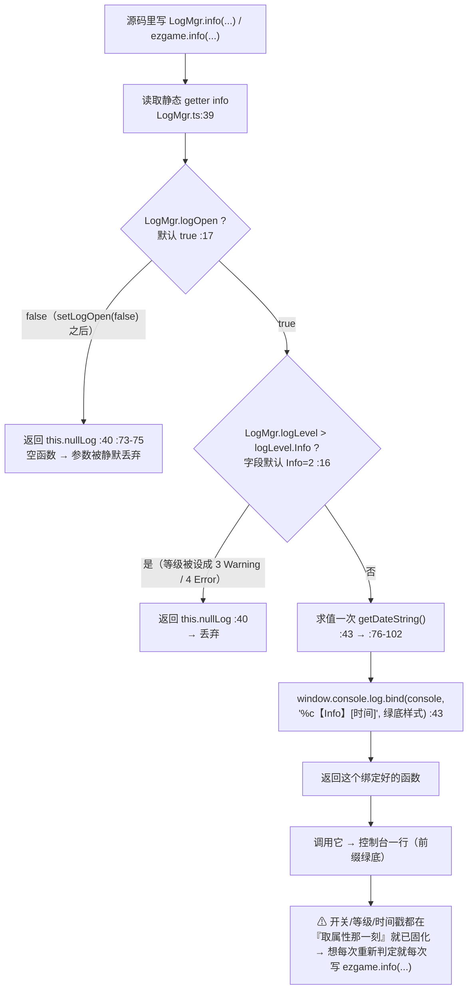
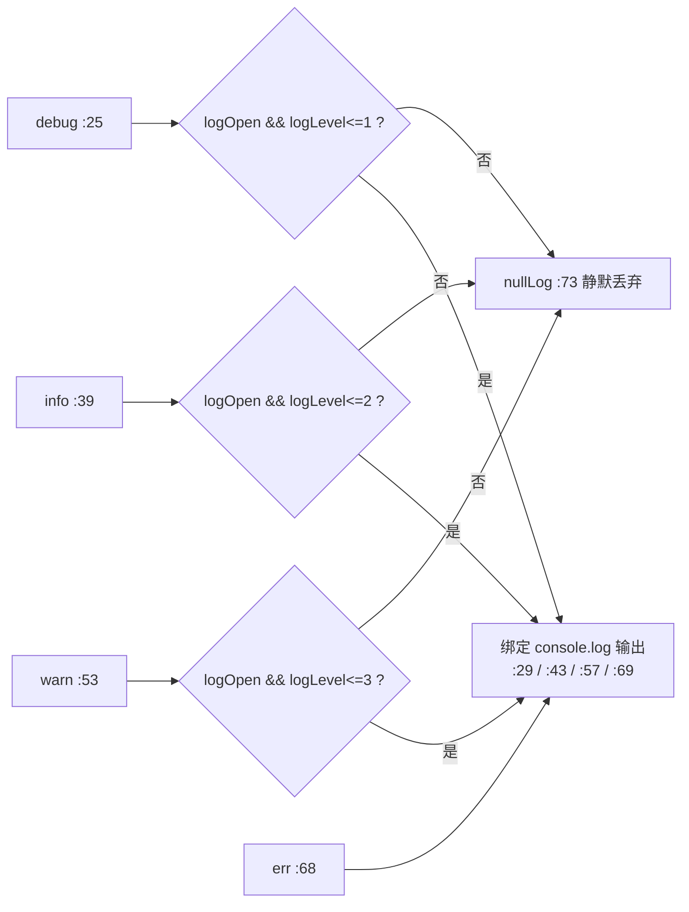

# 日志（log）

> 源码：`assets/scripts/platform/log/LogMgr.ts` ｜ 平台层教程第 12 章

---

## 1. 一句话说明 / 什么时候用

`LogMgr` 是**纯静态类**（`LogMgr.ts:14`，无 import、无 cc 依赖），把 `console.log` 包装成 4 个等级（`Debug/Info/Warning/Error`，`:3-8`），统一加上**彩色前缀 + 时间戳**，并提供一个总开关 `logOpen` 与等级闸 `logLevel`（`:16-17`）；`ezgame.debug/info/warn/error/setLogLevel/setLogOpen` 是它的全局门面（`ezgame.ts:20-44`）。

**什么时候用**：任何要留在控制台里的诊断信息。**平台层内部直接用 `LogMgr`**（`UIManager.ts:10`、`UIScope.ts:50`、`ResMgr.ts:2`、`TbRoot.ts:3`）；**游戏业务层用 `ezgame`**（`Scene_Menu.ts:111`、`View_Game_Stage.ts:413`）。两条铁律：**`err` 没有闸门**（`:68-70`，永远打得出来），**`debug` 默认看不见**（`:16` 默认 `Info`，条件 `logLevel > Debug` 即丢）。

---

## 2. 源码地图

| 文件 | 作用 |
|---|---|
| `assets/scripts/platform/log/LogMgr.ts` | 全部实现（104 行）：`logLevel` 枚举、两个静态字段、4 个 getter、`nullLog`、`getDateString` |
| `assets/scripts/platform/ezgame.ts` | 门面：`debug/info/warn/error` 四个 getter（`:20-31`）转发到 `LogMgr.debug/info/warn/err`（注意第 4 个名字是 **`err`**），`setLogLevel`（`:33-41`）带 `[1,4]` 夹取，`setLogOpen`（`:42-44`）；`:56` 把实例挂到 `window.ezgame` |
| `assets/scripts/platform/ui/UIManager.ts` | 平台层用法样板：`err`（`:80` 未初始化就取单例）、`warn`（`:109` 层级节点缺失）、`debug`（`:115` 注册完成、`:213` 显示视图） |
| `assets/scripts/platform/excel_table/TbRoot.ts` | 配表加载进度全部走 `info`（`:65/:70/:86/:98`），失败走 `err`（`:89/:101`）与 `warn`（`:117/:126/:132`） |
| 其余平台层 | `UIScope.ts:99/168/212`、`ResMgr.ts:81/86/92/101/188`、`ObjPool.ts:47/97`、`BTLoader.ts:56/123`、`AdMgr.ts:95/101/113`、`Tabs.ts:276/301`、`UIComponent.ts:130` |
| 游戏层 | 一律 `ezgame.*`：`Scene_Game_Stage.ts:542/1120/1188`、`View_Game_Stage.ts:218/413`、`Cmp_Heroes.ts:96/255`、`AtlasIcon.ts:149/156/196` 等 |

---

## 3. 快速上手

**① 平台层内部（相对路径 import，与 `UIManager.ts:10` 同款）**：

```ts
import { logLevel, LogMgr } from "../log/LogMgr";

LogMgr.info("[TbRoot] 所有配置表加载完成");      // info（默认可见）
LogMgr.warn("[UIManager] 层级节点缺失：", name); // warn
LogMgr.err("[ResMgr] 分包:xxx 加载失败");        // err（永远打得出来）
LogMgr.debug("只有把等级降到 Debug 才看得见");    // 默认被等级闸丢掉
```

**② 游戏业务层（全局门面，`window.ezgame` 由 `ezgame.ts:56` 赋值）**：

```ts
// 位置：assets/scripts/game/ui/scenes/scene_game_stage/Scene_Game_Stage.ts
ezgame.info(`[Boss] ${def.label} 限时离场（未击杀，不给奖励）`);
ezgame.warn("[战斗] 英雄已阵亡但本局未结束，走兜底结束");
ezgame.error("[英雄页] 加载失败：", path, err);
```

**③ 打开 / 关掉日志**（注意 `setLogLevel` 的参数是**数字**，不是枚举名）：

```ts
import { logLevel } from '../../../../platform/log/LogMgr';

ezgame.setLogLevel(logLevel.Debug); // = 1，此时 debug 才会输出（ezgame.ts:33-41）
ezgame.setLogLevel(6);              // 会被夹到 logLevel.Error(=4)（:34-36）
ezgame.setLogOpen(false);           // 关掉 debug/info/warn —— err 不受影响（:42-44）
```

**④ 想连 `err` 一起静音**：门面没有这个能力，只有改源码（`[推断]`：给 `LogMgr.err` 加上与另外三个 getter 同款的判定，或在发布构建里整体替换）—— 见 §8。

**⑤ 自己包一层（业务层想要"可整体静音的模块日志"）**：

```ts
import { LogMgr } from '../../../../platform/log/LogMgr';

// ⚠ 每次调用都重新取属性，否则开关在"取出函数"那一刻就被固化了（见 §8）
export const logShop = {
  info: (...a: any[]) => LogMgr.info('[商店]', ...a),
  err: (...a: any[]) => LogMgr.err('[商店]', ...a),
};
```

---

## 4. API 速查

`LogMgr`（**静态类，不要 new**；`LogMgr.ts:14`）：

| 签名 | 参数 | 返回 | 备注 |
|---|---|---|---|
| `enum logLevel` | `Debug=1` `Info=2` `Warning=3` `Error=4` | — | `:3-8`。**枚举名与静态字段同名**（都叫 `logLevel`），`:16` 里写的是 `logLevel.Info` 赋给 `LogMgr.logLevel`，读代码时别混 |
| `static logLevel: number` | — | number | 默认 `logLevel.Info`(=2)，`:16`；判定是"**字段 > 该等级** 就丢" |
| `static logOpen: boolean` | — | boolean | 默认 `true`，`:17`；与等级是**与**关系 |
| `static get debug` | `(...args: any[])` | 一个**函数** | 闸门 `!logOpen \|\| logLevel > Debug`（`:26`）；通过时返回 `console.log.bind(..., '%c【Debug】<时间>', 'color: white; background-color: #007BFF; …')`（`:29`）。**默认等级 Info 下它永远是 `nullLog`** |
| `static get info` | 同上 | 函数 | 闸门 `logLevel > Info`（`:40`）；白字 + 绿底 `#28A745`（`:43`） |
| `static get warn` | 同上 | 函数 | 闸门 `logLevel > Warning`（`:54`）；黑字 + 黄底 `#FFC107`（`:57`）。**底层仍是 `console.log`，不是 `console.warn`** |
| `static get err` | 同上 | 函数 | **没有任何闸门**（`:68-70`）：不看 `logOpen`、不看 `logLevel`；白字 + 红底 `#DC3545`。注意名字是 `err`，不是 `error` |
| `private static nullLog(...args: any)` | — | void | `:73-75` 空函数体 —— 被闸掉时返回它，所以"调用了但什么都没发生"，不会报错 |
| `private static getDateString(): string` | — | string | `:76-102`。月份/日期/毫秒的取值与补零**有缺陷**，见 §8 |

`ezgame`（`window.ezgame`，`ezgame.ts:56`；类型声明在 `:48-53`）：

| 签名 | 参数 | 返回 | 备注 |
|---|---|---|---|
| `get debug` / `get info` / `get warn` / `get error` | — | 函数 | 依次转发 `LogMgr.debug/info/warn/err`（`:20-31`）。**门面叫 `error`、源类叫 `err`** |
| `setLogLevel(level: number)` | number | void | 先夹到 `[logLevel.Debug(1), logLevel.Error(4)]` 再写 `LogMgr.logLevel`（`:33-41`） |
| `setLogOpen(open: boolean)` | boolean | void | 直接写 `LogMgr.logOpen`（`:42-44`）；`false` 时 `err` 依然输出 |

---

## 5. 生命周期与流程图

**① 一次 `LogMgr.info(...)` 调用：从等级判断到输出/丢弃**（含两条丢弃路径）：



**② 四个等级的判定矩阵（同一套两条闸门，只有 `err` 例外）**：



---

## 6. 与 Cocos 生命周期的关系

- **没有任何 cc 依赖**：`LogMgr.ts` 全文**一个 import 都没有**（`:1-2` 是空行），不继承 `Component`、也没有 `onLoad/start/update/onDestroy`。
- **唯一的外部环境依赖**是 `window.console.bind(window.console, prefix, style)`（`:29`、`:43`、`:57`、`:69`）与 `new Date()`（`:77`）→ 只要有 `console` 与 `Date` 就能跑。
- **类本身没有生命周期**：静态字段的生命周期 = 模块生命周期（脚本包加载时初始化，`:16-17`）。**导表、场景重载都不会重置它们** —— `setLogOpen(false)` 之后整个会话都是关的，除非再设回来。
- **门面 `ezgame` 挂在 `window` 上**（`ezgame.ts:56`），随模块被首次 import 而创建（`ezgame.ts:1` 还 import 了 cc 的 `error`，但**在文件里从未被引用**，是个无用 import）→ 平台层文件因此**不依赖 `ezgame`**（它们全都 `import { LogMgr }`），这也是体检脚本能直接真跑平台层文件、不必先造一个 `window` 的前提。

---

## 7. 典型组合用法

**① 平台层用 `LogMgr`、业务层用 `ezgame`**（全项目的实际分工）：

```ts
// 平台层（UIManager.ts:109 / :115）
LogMgr.warn(`UIManager 层级节点缺失：${name}`);
LogMgr.debug("UIManager onLoad 完成，已注册层级：", Array.from(this.layers.keys()));

// 业务层（Scene_Menu.ts:111 / Cmp_Heroes.ts:255）
ezgame.warn("[难度选择] 弹窗不可用 → 按当前选择直接开战");
ezgame.info(`[英雄] ${name} ${action}成功（消耗 ${cost} 金币）`);
```

**② 进度类信息用 `info`、失败用 `err`、可疑但可恢复用 `warn`** —— 配表加载是这个三段式的标准样板（`TbRoot.ts:70` 开始、`:86` 每条表一条 info、`:89` 失败 err、`:117` 退化为 warn）。

**③ 跨模块统一标签**：现有代码一律用 `[模块]` 前缀手工拼（`[TbRoot]` `[难度选择]` `[打击反馈]` `[技能槽]` `[Boss]`），没有内置 tag 参数 → 新模块请沿用这个约定，方便控制台过滤。

**④ 降噪**：想临时安静，`ezgame.setLogOpen(false)`；只想留错误，`ezgame.setLogLevel(4)`（两条路径都只影响 `debug/info/warn`）。

**⑤ 不要绕过它写 `console.log`**：工程里存在这类漏网（如 `Scene_Game_Stage.ts:794` 的 `console.warn('[打击反馈] 音效播放失败…')`），后果是**没有前缀、没有时间戳、不受 `setLogOpen(false)` 控制**。

---

## 8. 注意事项与坑

| 现象 | 原因 | 正确做法 |
|---|---|---|
| 关了日志开关，错误还是刷满控制台 | `err` 的 getter **完全没有判定**（`LogMgr.ts:68-70`），另三个都有（`:26/:40/:54`） | 别把 `setLogOpen(false)` 当成"发布版静音"；要彻底静音只能改源码（`[推断]`）或改调用点 |
| 在 DevTools 里用"警告/错误"筛选器一条都筛不出来 | 四个等级**全部**走 `window.console.log`（`:29/:43/:57/:69`），`warn` 不是 `console.warn`、`err` 不是 `console.error` | 按 `【Info】` / `【Warning】` / `【Error】` 文本或颜色过滤；想要真实分级得改 getter（`[推断]`） |
| `ezgame.debug(...)` 写了很多，控制台一条都没有 | 默认 `logLevel = Info`（`:16`），debug 的闸门是 `logLevel > Debug`（`:26`）；**全仓库没有任何一处调用 `setLogLevel`**（grep 实测，只有 `ezgame.ts:33-41` 的定义） | 临时排查时先 `ezgame.setLogLevel(1)`（或 `logLevel.Debug`）；长期需要就把它接进设置/调试面板 |
| 日志里的时间戳月份差 1、日期是"星期几"、毫秒位数忽 2 忽 4 | `getDateString` 用了 `d.getMonth()`（0 基，`:81`）与 `d.getDay()`（周几，`:83`）而非 `getDate()`；毫秒补零逻辑三位分支写的位数不对（`:91-98`：1 位补成 2 位、2 位补成 4 位） | 不要用日志时间戳做性能/时序对齐，用 `performance.now()` 或浏览器 Performance 面板；要修就改这三处 |
| `setLogOpen(false)` 之后某个模块还在刷日志 | 该模块把函数**存进了变量/回调**：`ezgame.info` 是 getter（`ezgame.ts:23`），取属性那一刻就返回了"已绑定好的函数"（`:43`） | 始终**现取现调** `ezgame.info(...)`；只有确实不需要动态开关时才缓存 |
| 打了很久之后拿出来用的日志，时间戳是"创建它的时候" | 同上：`getDateString()` 是在 bind 时求值的（`:43`），绑定函数里已经写死了那串时间 | 一次性日志无所谓；需要精确时刻就自己拼时间或改实现 |
| 从平台层代码里找不到 `LogMgr.error(...)` | 源类里的名字是 **`err`**（`:68`），只有门面才叫 `error`（`ezgame.ts:29-31`） | 平台层写 `LogMgr.err`，业务层写 `ezgame.error`；写错会直接编译不过（`LogMgr.error` 不存在） |
| 想给日志加 tag / 结构化输出 | 现在只有"前缀字符串"与"额外参数"两条路（`:29` 的 `%c` 只作用于第一个参数） | 沿用 `[模块]` 前缀拼字符串；要结构化就先给它加一个带 tag 的入口（`[推断]`） |

---

## 9. 调试手段

- **DevTools 里直接敲**：`window.ezgame` 是全局实例（`ezgame.ts:56`），可直接 `ezgame.setLogLevel(1)` / `ezgame.setLogOpen(false)`，不用改代码重跑。
- **按前缀过滤**：`【Debug】` `【Info】` `【Warning】` `【Error】`（`:29/:43/:57/:69`）。
- **看配表加载进度**：`TbRoot` 把每条表的加载与失败都打出来了（`:70/:86/:89/:98`），这是"配置表到底加载了没"的第一手观测点。
- **看 UI 契约问题**：`UIManager`/`UIComponent`/`Tabs` 的 warn 直接指出缺失的节点名（`UIManager.ts:109`、`UIComponent.ts:130`、`Tabs.ts:310`）。
- **等级闸的意图**：`logLevel.Error`(=4) 是"只留错误"的最小噪声档；`logLevel.Debug`(=1) 是"全开"档（`LogMgr.ts:3-8`、`ezgame.ts:34-39` 的夹取边界就是这两个值）。
- **注意时间戳不可信**（见 §8 第 4 条），别拿它做时序判据。

---

## 10. 事实依据

1. `LogMgr.ts:3-8` — `export enum logLevel { Debug = 1, Info = 2, Warning = 3, Error = 4 }`。
2. `LogMgr.ts:14` — `export class LogMgr`（无 extends、无 import，文件 `:1-2` 为空行）。
3. `LogMgr.ts:16-17` — `public static logLevel:number = logLevel.Info;`（默认 **2**）、`public static logOpen:boolean = true;`。
4. `LogMgr.ts:25-31` — `debug` getter：判定 `!LogMgr.logOpen || LogMgr.logLevel>logLevel.Debug`，通过则 `window.console.log.bind(window.console, '%c【Debug】'+getDateString(), 'color: white; background-color: #007BFF; …')`。
5. `LogMgr.ts:39-45` / `:53-60` — `info`（绿 `#28A745`）/ `warn`（黄 `#FFC107`，底层仍是 `console.log`）的判定与配色，条件分别是 `> logLevel.Info` / `> logLevel.Warning`。
6. `LogMgr.ts:68-70` — `err` getter **无任何条件判断**，永远返回 `window.console.log.bind(... 'background-color: #DC3545' ...)`。
7. `LogMgr.ts:73-75` — `private static nullLog(...args:any){}` 空实现（被闸掉时的返回物）。
8. `LogMgr.ts:76-102` — `getDateString()`；`:81` `d.getMonth()`、`:83` `d.getDay()`、`:91-98` 毫秒补零分支。
9. `ezgame.ts:20-31` — `debug/info/warn/error` 四个 getter 转发 `LogMgr.debug/info/warn/err`；`:1` `import { error } from 'cc'` 在文件内未被引用。
10. `ezgame.ts:33-41` / `:42-44` — `setLogLevel` 先夹取到 `[logLevel.Debug, logLevel.Error]` 再赋值；`setLogOpen` 直接写 `LogMgr.logOpen`。
11. `ezgame.ts:48-53` / `:56` — `declare global { interface Window { ezgame: EzGame } const ezgame: EzGame }` 与 `window.ezgame = new EzGame()`。
12. `UIManager.ts:10`、`:80`、`:109`、`:115`、`:134`、`:213` — 平台层 `import { LogMgr } from "../log/LogMgr"` 及 err/warn/debug 的实际用法。
13. `UIScope.ts:50`、`:99`、`:168`、`:212` — 平台层另一处 `LogMgr.warn` 样板；`ResMgr.ts:2`、`:188` — 资源层 err 样板（`分包:` 那条）。
14. `TbRoot.ts:3`、`:65`、`:70`、`:86`、`:89`、`:98`、`:101`、`:117` — info 报进度 / err / warn 的三段式。
15. `Scene_Game_Stage.ts:542`、`:1120`、`:1188`、`:1745` — 业务层 `ezgame.info/warn` 用法；`:794` — 绕过 LogMgr 直接 `console.warn` 的实例。
16. 全仓库 grep `setLogLevel|setLogOpen`：仅命中 `ezgame.ts:33-44` 的定义，**无调用方**；grep `logLevel` 仅命中 `LogMgr.ts` 与 `ezgame.ts`。
