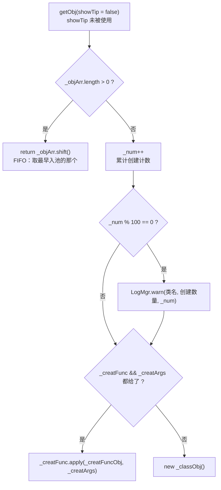
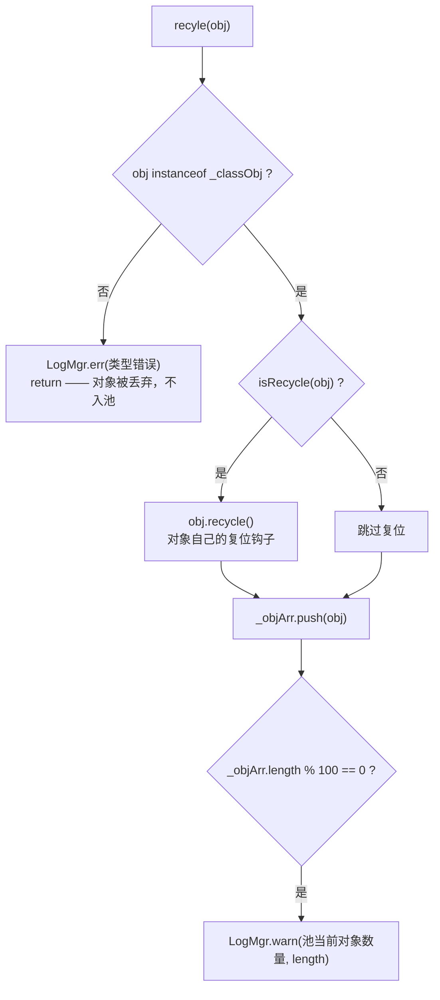

# 对象池（pool）

> 源码：`assets/scripts/platform/pool/` ｜ 平台层教程第 13 章

## 1. 一句话说明 / 什么时候用

`ObjPool<T>` 是一个 **118 行的纯 TS 泛型复用容器**：`getObj()` 从数组头部 `shift()` 出一个旧对象，池空就 `new` 一个；`recyle(obj)` 做一次 `instanceof` 类型校验后 `push()` 回数组。它只 import 了 `LogMgr` 和 `IRecycle`（`ObjPool.ts:1-2`），**完全不依赖 `cc`**，因此它不知道、也不关心自己装的是数据对象还是 cc 节点。

**什么时候该用**（三条同时成立才值得池化）：

1. **对象创建频率高、生命周期短** —— 每波刷的怪、每颗子弹、每条飘字；`new` 的 GC 压力能压过池的复杂度。
2. **对象能被显式复位** —— 有 `recycle()` 钩子（`Recycle.ts:3`）或等价的重置函数，否则复用会带脏状态（§8-2）。
3. **取用/归还的配对点收敛在少数几处** —— 才能保证"借了一定还"，否则池会变成变相的内存泄漏源。

**什么时候别用** —— 低频、长命、无法复位的对象。本项目自己的反例写在 `FloatText.ts:11-12`：「一条提示一个节点（用完即销毁），不做池化 —— 提示是低频交互」。

> ⚠️ **本项目现状（读本章前先记住这条）**：平台层 `ObjPool` 在 game 侧**零调用**。`grep ObjPool` 全工程（源码 + 文档树）只有 1 处命中，就是它自己的类声明（`ObjPool.ts:5`）；`grep "new ObjPool"` 零匹配；`recyle` 全工程也只有定义处（`ObjPool.ts:95`）而没有调用方。游戏的实体池 / 弹道池 / 飘字池**全部是另写的实现**（§7、§10）。

## 2. 源码地图

| 文件 | 行数 | 内容 |
|---|---|---|
| `assets/scripts/platform/pool/ObjPool.ts` | 118 | 唯一的类 `ObjPool<T>`，**default export**（`ObjPool.ts:5`） |
| `assets/scripts/platform/pool/Recycle.ts` | 4 | 唯一接口 `IRecycle`，**named export**（`Recycle.ts:1`） |
| `assets/scripts/platform/pool/index.ts` | — | **不存在**。`platform/pool/` 没有 barrel；`platform/` 根目录也没有 `index.ts`（只有 `reactivity/`、`store/` 有）。所以引用必须写全相对路径，且是默认导入 |

`ObjPool` 的全部状态就 6 个私有字段（`ObjPool.ts:7-17`），没有别的：

| 字段 | 行 | 含义 |
|---|---|---|
| `_classObj: any` | 7 | 构造时传入的类，用于 `instanceof` 校验和 `new` |
| `_objArr: T[]` | 9 | **空闲对象数组**，就是"池"本身 |
| `_num: number` | 11 | **累计创建计数**（只增，不因归还而减） |
| `_creatFuncObj: any` | 13 | 自定义创建函数里的 `this` |
| `_creatFunc: Function` | 15 | 自定义创建函数 |
| `_creatArgs: any[]` | 17 | 自定义创建函数的实参数组 |

## 3. 快速上手

构造函数是**四个参数**，后三个都有默认值 `null`（`ObjPool.ts:27`）：

```ts
public constructor(classObj: { new(...args): T; }, creatFuncObj: any = null,
                   creatFunc: Function = null, creatArgs: any[] = null)
```

所以 `new ObjPool<Bullet>(Bullet, null, null)`（题面那种写法）与 `new ObjPool<Bullet>(Bullet)` 完全等价 —— 两条都走 `getObj` 的 `else` 分支 `new this._classObj()`（`ObjPool.ts:55-57`）。

```ts
import ObjPool from '../../platform/pool/ObjPool';      // 默认导入（类）
import { IRecycle } from '../../platform/pool/Recycle'; // 具名导入（接口）

class Bullet implements IRecycle {
    speed = 0;
    recycle(): void { this.speed = 0; }   // 归还钩子：可选实现
}
```

带自定义创建函数时，**`creatFunc` 与 `creatArgs` 必须一起给**（见 §8-6）：

```ts
const pool = new ObjPool<Bullet>(Bullet, null, null);            // ① 直接 new
const factory = { make: (spd: number) => new Bullet() };
const pool2 = new ObjPool<Bullet>(Bullet, factory, factory.make, [300]); // ② 走创建函数

const b = pool.getObj();      // 池空 → new Bullet()
pool.recyle(b);               // 入池前会先调 b.recycle()（因为它实现了 IRecycle）
```

需要注意 `creatArgs: []`（空数组）是 **truthy**，会走创建函数；而 `creatArgs` 为 `null` 时 `getObj` 会**忽略** `creatFunc`（§8-6）。

## 4. API 速查

| 成员 | 签名（照抄源码） | 行 | 行为 |
|---|---|---|---|
| `getObj` | `getObj(showTip: boolean = false): T` | 41 | 池非空 → `shift()` 返回队首；池空 → `_num++`，`_num % 100 == 0` 时 warn，然后按分支创建 |
| `getPromiseObj` | `async getPromiseObj(): Promise<T>` | 65 | 与 `getObj` 同逻辑，只是结果包进 `Promise`；**没有参数** |
| `recyle` | `recyle(obj: T): void` | 95 | ⚠ **源码拼写就是 `recyle`**（少一个 c）。`instanceof` 校验 → 有 `recycle()` 就调用 → `push` 入池 |
| `clearPool` | `clearPool(): void` | 109 | `_objArr = []` + `_num = 0`。**不销毁、不复位池中对象**，只是丢引用 |
| `isRecycle` | `isRecycle(obj: any): obj is IRecycle` | 114 | 类型守卫，判据是 `'recycle' in obj && typeof obj.recycle === 'function'` |

`IRecycle` 全文只有 4 行（`Recycle.ts:1-4`）：

```ts
export interface IRecycle {
    /** 回收 */
    recycle(): void;
}
```

**签名与实际不符的几处（源码事实，写代码时必踩）**：

1. **`getObj(showTip)` 的 `showTip` 在函数体里从没被引用**（`ObjPool.ts:41-59`）—— 传 `true` 与不传没有任何区别。它的 JSDoc 也只写了 `@param showTip` 而没有说明（`ObjPool.ts:38`）。
2. **`getPromiseObj` 在 JSDoc 里写了 `@param showTip`（`ObjPool.ts:62`），但它一个参数都不收**（`ObjPool.ts:65`）。
3. **`recyle` 在 JSDoc 里写了 `@param showTip`（`ObjPool.ts:92`），签名里也没有这个参数**（`ObjPool.ts:95`）。
4. **`getPromiseObj` 并不是真异步**：`new Promise(r => {...})` 的 executor 是被**同步执行**的，三条分支都在里面直接 `r(...)`（`ObjPool.ts:66-83`）。它唯一"异步"的地方是调用方 `await` 时会过一趟微任务队列。源码注释说"适合异步创建对象的方法"（`ObjPool.ts:63`）指的是**可以拿它去 `await`**，不是它自己做了异步加载。
5. **`recyle` 内部的 `this.isRecycle(obj)` 只在 `instanceof` 通过之后才调**（`ObjPool.ts:96-102`）；`instanceof` 失败就 `LogMgr.err` + `return`（`ObjPool.ts:96-99`），**对象不会入池**。
6. **池里没有"取用时复位"这一步**：`getObj` / `getPromiseObj` 全程不碰对象状态（`ObjPool.ts:41-86`），复位只可能发生在**归还**时，且仅当对象实现了 `IRecycle`。

另外：`ObjPool` **没有公开的 `size()` / `length` / `idleCount()`**。唯一能观察池状态的手段是那两条 `LogMgr.warn`（`ObjPool.ts:47`、`ObjPool.ts:105`），或运行时探私有字段（§9）。

## 5. 生命周期与流程图

**图 1 —— `getObj()` 的取用路径**（`ObjPool.ts:41-59`）：



**图 2 —— `recyle(obj)` 的归还路径**（`ObjPool.ts:95-107`）：



**图 3 —— 一个池对象的完整生命周期**（看清"谁负责复位"）：

```mermaid
flowchart TD
    A["new ObjPool<T>(T, ...)<br/>_objArr = [] , _num = 0"] --> B["getObj()"]
    B -->|池空| C["创建：工厂函数 或 new"]
    B -->|池非空| D["shift()：拿到旧对象<br/>状态 = 上次归还时的样子"]
    C --> E["调用方使用"]
    D --> E
    E --> F["调用方 recyle(obj)"]
    F -->|instanceof 失败| G["丢弃（对象不再受池管理）"]
    F -->|通过| H["recycle() 复位 → push 入池"]
    H --> B
    B -.->|clearPool()| I["_objArr = [] , _num = 0<br/>对象不被销毁、不被复位"]
```

一句话总结职责划分：**`ObjPool` 只做「数组的进出」，复位（`recycle()`）交给对象自己，销毁交给调用方**。

## 6. 与 Cocos 生命周期的关系

**结论：`ObjPool` 与 Cocos 生命周期完全无关。** 依据是它的 import 清单 —— 整个文件只 import 了 `LogMgr` 和 `IRecycle`（`ObjPool.ts:1-2`），没有一行 `from 'cc'`；它不继承 `Component`，没有 `onLoad` / `onEnable` / `onDestroy` 等任何引擎回调，也不注册到场景树。所以：

- **它不会被场景切换自动清理**。换局/换场景时池里囤着的对象不会自己消失。游戏侧是靠场景**显式调用**收口的：`this.monsterPool?.Clear()` / `this.projectilePool?.Clear()`（`Scene_Game_Stage.ts:746-747`）、`releasePrefabs()`（`Scene_Game_Stage.ts:658-659`）。
- **它不感知节点生命周期**。`getObj()` 返回什么就是什么，池不知道对方是否 `destroy` 过。

**池化数据对象 vs 池化 cc 节点** —— 由使用者决定，两者代价差一个量级：

| | 数据对象（如 `Entity`） | cc 节点（如 `EntityView` 所在节点） |
|---|---|---|
| 取用时 | 直接赋值复位即可 | 必须 `node.parent = activeParent` + `node.active = true` |
| 归还时 | `entity.ResetForPool()`（`Entity.ts:162-177`） | 必须 `node.active = false` + `node.parent = cacheParent`（或 `removeFromParent()`）+ `pool.put(node)`（`EntityViewPool.ts:112-116`） |
| 组件残留 | 无 | 事件订阅、计时器、血条/配色都是**池化复用必须复位**的（`EntityView.ts:142-154`） |
| 清池 | 丢引用即可 | 要 `destroy`，否则节点对象还在 |

本项目的真实样例：节点池化走的是**引擎自带的 `NodePool`**（`EntityViewPool.ts:1, 26, 69`；`ProjectileViewPool.ts:1, 25, 52`），而不是 `ObjPool` —— 因为 `NodePool.clear()` 会摧毁池中节点（`EntityViewPool.ts:156「清空节点池（池中节点销毁）」`），这正是 `ObjPool.clearPool()`（`ObjPool.ts:109-112`）不做的第 3 件事。

节点池化时的**复位是显式函数、不是引擎回调**：`EntityView` 只有 `onLoad`（`EntityView.ts:99-101`，整个节点生命周期内只跑一次），每次出池靠 `bind()` 里的第 4 步"打击反馈残留复位"（`EntityView.ts:129-130`）兜底，归还走 `unbind()`（`EntityView.ts:142-154`，退订事件 + 恢复本色原缩放 + 隐藏血条 + 清抖动残留）。`EntityView.unbind()` 在语义上**就是** `IRecycle.recycle()` 的等价物，只是它没有被声明成 `IRecycle`、也没有被 `ObjPool` 调用。

> 如果某天要用 `ObjPool` 池化节点：因为它没有 `onEnable` / `onDisable` 之类的钩子，`active = false` 是否触发引擎的 `onDisable`、以及"只丢引用不 destroy 的节点会不会被 GC 连带回收底层节点"，都需要你自己验证。**本仓库里没有任何 `ObjPool` 池化节点的代码可参照**，这两点标记为 `[推断]`。

**如果游戏的实体池不是用 `ObjPool` 实现的 —— 确实不是。** 游戏侧两套池各自独立实现（§7），`ObjPool` 一次都没被 `new` 过。

## 7. 典型组合用法

### 7.1 真实用例：它们和 `ObjPool` 是什么关系

**结论先行：三个用例都跟 `ObjPool` 没有代码关系 —— 它们自己另写了一套。**

| 用例 | 自己是什么 | 用 `ObjPool` 吗 | 证据 |
|---|---|---|---|
| `EntityViewPool.ts` | 表现层池：`Map<prefabPath, cc.NodePool>` + `Map<uid, EntityView>` + `Map<path, Prefab>` | ❌ 否 | 只 import `cc` 与本地模块（`EntityViewPool.ts:1-3`），无 pool 引用 |
| `ProjectileViewPool.ts` | 同上，弹道版（与上者几乎逐行同构的 159 行） | ❌ 否 | 只 import `cc` 与本地模块（`ProjectileViewPool.ts:1-3`），无 pool 引用 |
| `MonsterPool.ts` | 组合器：把 `EntityPool`（逻辑）+ `EntityViewPool`（表现）配成一对 | ❌ 否 | 它 `new` 的是 `EntityPool` 和 `EntityViewPool`（`MonsterPool.ts:68-69`） |

**① `EntityViewPool.ts` —— 表现层节点池（与 `ObjPool` 无关，自己写）**

按预制件路径分桶（`EntityViewPool.ts:26`），`acquire` 时 `pool.get()` 取节点、空了才 `instantiate`（`EntityViewPool.ts:72-75`），`release` 时 `active=false` + 移到 `cacheParent` + `pool.put(node)`（`EntityViewPool.ts:112-116`）。它比 `ObjPool` 多做的三件事，正好是节点池化的必需项：**异步预制件竞态防护**（`_viewRecycled` 标记，`EntityViewPool.ts:52, 61-64, 98-99`）、**节点分层**（活的挂 `activeParent`、死的移 `cacheParent`，`EntityViewPool.ts:77-79`）、**预制件缓存 + 预加载**（`preload`，`EntityViewPool.ts:137-151`）。

**② `ProjectileViewPool.ts` —— 弹道表现层池（与 `ObjPool` 无关，同上另写）**

结构、命名、回收路径与 ① 一致（`ProjectileViewPool.ts:55-58, 89-96`），区别是竞态标记叫 `_viewAlive`（`ProjectileViewPool.ts:40, 48, 78`）、活跃表按 `projectile.id` 建（`ProjectileViewPool.ts:28`）。**它是 `EntityViewPool` 的一份复制粘贴**（159 行 vs 191 行），两者没有共享基类 —— 这是"自己另写一套"的直接代价。

**③ `MonsterPool.ts` —— 场景层唯一入口（与 `ObjPool` 无关，是组合器）**

它本身不是池，而是**把两个池的取用/归还顺序收敛到一处**（`MonsterPool.ts:12-25`）：

```ts
acquire(def: UnitCfg, kind?: UnitKind): Entity {
    const entity = this.entityPool.acquire(def, kind);   // 1) 逻辑实体
    this.applyPlaceholderBody(entity, kind);             // 2) 占位体型/碰撞半径
    this.statScaleHook?.(entity, kind);                  // 3) 难度缩放（必须在挂表现前）
    this.viewPool.acquire(entity, MONSTER_PREFAB, this.activeParent); // 4) 挂表现
    return entity;
}
release(entity: Entity): void {
    this.viewPool.release(entity, this.cacheParent);     // 先还表现
    this.entityPool.release(entity);                     // 再还逻辑
}
```

（以上节选自 `MonsterPool.ts:81-103`。）它内部的两个池分别是：`EntityPool`（`game/battle/EntityPool.ts:30`，纯 TS，`Map<number, Entity[]>` 按 unitId 分桶，`pop/push`）和 `EntityViewPool`。**两个都不用 `ObjPool`。**

场景侧的接线只有 4 行（`Scene_Game_Stage.ts:771, 776-777`）：`new MonsterPool(ctx, monsterParent, monsterCacheParent)` → 注入 `statScaleHook` → `new ProjectileViewPool()`。取用/归还在 `Scene_Game_Stage.ts:1309`（弹道 acquire）、`1670/1676`（弹道 release）、`1721`（怪物 release）、`2320`（怪物 acquire）。

### 7.2 游戏侧四处池的取舍（真实权衡）

| 池 | 池化什么 | 分桶键 | 为什么这么选 |
|---|---|---|---|
| `EntityPool`（`EntityPool.ts:30-65`） | 纯逻辑 `Entity` | `unitId` | `Entity` 构造时建 4 个子系统（`EntityPool.ts:12-16`），复用后子系统只建一次；`uid` 保持不变（`Entity.ts:22`、`EntityPool.ts:21`） |
| `EntityViewPool` / `ProjectileViewPool` | cc 节点 + `EntityView` | 预制件路径 | 省 `instantiate`/`destroy`；必须处理异步加载与节点分层 |
| `DamageTextLayer`（`DamageTextLayer.ts:71-73`） | **纯数据** `DamageTextItem` | 单一 `free` 数组 | 整层共用一块 `Graphics`（1 draw call），所以"池化的是数据，不是节点"（`DamageTextLayer.ts:28, 72`） |
| `HitVfxLayer`（`HitVfxLayer.ts:94-96`） | **纯数据** `VfxItem` / `ShardItem` | 两份 `freeItems` / `freeShards` | 同上，且带上限（`HitVfxLayer.ts:506, 511`） |

后两者的取用/归还各只有两行（`DamageTextLayer.ts:260, 300-302`；`HitVfxLayer.ts:499-507`），形如 `this.free.pop() ?? ({} as T)` / `if (this.free.length < N) this.free.push(it)` —— **这其实就是 `ObjPool` 的语义，只是内联手写了**（多了两道"池上限"，`ObjPool` 没有）。这反过来解释了为什么 `ObjPool` 零调用：**游戏侧需要的分桶键、上限、异步竞态保护，`ObjPool` 一样都不提供。**

### 7.3 什么时候该用对象池（判据）

动手前过这 4 条，**第 1、2 条同时成立才谈得上收益**：

1. **创建频率**：是否每帧 / 每秒多次创建？本项目怪物是每波刷新、弹道每次攻击都建（`Scene_Game_Stage.ts:1309`），飘字每次受击都建 —— 都够格。反例是"点一次出一条"的 `FloatText`（`FloatText.ts:11-12`）。
2. **是否持有 cc 节点**：持节点 → **优先用引擎 `NodePool`**（清池时会销毁），并且必须自己写"隐藏 + 换父 + 复位组件"三件事；不持节点（纯数据）→ 一个数组 + `pop/push` 就够，用不用 `ObjPool` 差别只在"要不要那两条 warn 日志"。
3. **是否需要重置状态**：能写出一个可靠的复位函数吗？`Entity` 的答案是 `ResetForPool()`（`Entity.ts:161-177`，22 行逐个字段归零）+ `Reinit()` 里"先清空上一轮"（`Entity.ts:122-126`）；`EntityView` 的答案是 `unbind()`（`EntityView.ts:142-154`）。**写不出复位函数就别池化** —— 脏状态会比 GC 更贵（§8-2）。
4. **是否有上限**：`ObjPool` 只增不减（§8-5）；真要用它，必须自己在外面卡住"池内数量 ≤ N"或定期 `clearPool()`，否则高峰期的峰值对象数会被永久持有。

## 8. 注意事项与坑

**① 归还在 `instanceof` 处失败 → 对象被丢弃，但调用方拿不到任何信号**
现象：代码看着"还回池了"，池里却没有，下一帧又 `new` 一个，`_num` 一路涨。
原因：`recyle` 的第一件事是 `if (!(obj instanceof this._classObj))`，不通过就 `LogMgr.err` + `return`（`ObjPool.ts:96-99`）—— 有日志、但**没有异常、没有返回值**，调用方无从感知。
正确做法：确认"创建走工厂、归还也走同一个类"，尤其是用工厂函数造出**普通对象字面量**（不是该类的实例）时，`instanceof` 一定失败；用 `pool.isRecycle(obj)` 或自定义校验替代不可行（`isRecycle` 判的是 `recycle` 方法，不是类型，`ObjPool.ts:114-116`）。

**② 从池里取出的对象带着上一轮的字段（脏状态）**
现象：怪出场就是残血 / 弹道出生就带着上次的速度 / 血条带着上一只怪的残血长度。
原因：`getObj` / `getPromiseObj` **只在归还时**（且仅在对象实现了 `IRecycle` 时）才调 `recycle()`（`ObjPool.ts:100-102`），取用时**一句复位都不做**（`ObjPool.ts:41-86`）。
正确做法：学 `EntityView` 的成对写法 —— 归还时 `unbind()` 全量复位（`EntityView.ts:142-154`），取用时 `bind()` 里再兜底复位一次（`EntityView.ts:129-130`）。游戏侧同一口径的还有 `HpBar`（"对象池复用必须调用"的 `unbind`，`HpBar.ts:150`）、`HitFlash`（"回收：恢复底色与原缩放"，`HitFlash.ts:140`）。

**③ `clearPool()` 只是丢引用，不销毁也不复位**
现象：内存没降；若池化的是节点，节点对象还活着。
原因：`clearPool()` 就两行 —— `this._objArr = []` 和 `this._num = 0`（`ObjPool.ts:109-112`），既没有 `destroy()`，也没有回调对象的 `recycle()`。
正确做法：节点池化改用引擎 `NodePool`（它的 `clear()` 会销毁池中节点，`EntityViewPool.ts:156`），或自己在 `clearPool` 前遍历释放。
`[推断]`：数组被丢弃后、若那些对象不再被任何东西引用，JS 对象会被 GC 回收（cc 节点的底层对象是否随之释放未在仓库中找到证据，需实测）。

**④ `getPromiseObj()` 不是真异步，别拿它等资源加载**
现象：以为 `await pool.getPromiseObj()` 会等预制件加载完，结果拿到一个空对象。
原因：`new Promise(r => {...})` 的 executor 同步执行，三条分支都直接 `r(...)`（`ObjPool.ts:66-83`）；它只是把返回值包了一层。它**连 `showTip` 参数都没有**（`ObjPool.ts:65`），尽管 JSDoc 写了（`ObjPool.ts:62`）。
正确做法：真异步要在池外面包 —— 见 `EntityViewPool.getPrefab()` 的 `resources.load` 回调（`EntityViewPool.ts:175-190`），并配一道竞态防护（异步回来时对象可能已经被回收了：`EntityViewPool.ts:61-64`）。

**⑤ 池只增不减 → 峰值内存被永久持有**
现象：战斗后期内存只涨不落，即使场上怪物数早就回落。
原因：`_num` 只加不减（`ObjPool.ts:45, 70`），归还是 `push` 到数组尾部、**没有任何上限**（`ObjPool.ts:103`）；`_num` 也只在 `clearPool()` 里归零（`ObjPool.ts:111`）。
正确做法：在外层卡上限（游戏侧就是这么做的：`DamageTextLayer.ts:301`、`HitVfxLayer.ts:506` 都写了 `if (free.length < 上限) push`），并在换局时显式清池（`Scene_Game_Stage.ts:746-747`）。

**⑥ 只给 `creatFunc` 不给 `creatArgs`，`getObj` 会静默忽略你的创建函数**
现象：明明配了工厂函数，`getObj` 却走了 `new`（或反过来，`getPromiseObj` 走了工厂）。
原因：`getObj` 的条件是 `if (this._creatFunc && this._creatArgs)`（`ObjPool.ts:49`）—— **两个都要有**，否则落到 `new this._classObj()`（`ObjPool.ts:55-57`）；而 `getPromiseObj` 的条件只有 `if (this._creatFunc)`（`ObjPool.ts:74`），`creatArgs` 只影响内层传不传参（`ObjPool.ts:75-79`）。**两条路径在这种参数组合下行为不一致**。
正确做法：工厂函数一律连 `creatArgs` 一起给（哪怕是 `[]`，空数组是 truthy），或者干脆不用工厂、只用 `new`。

**⑦ `getObj` 里有一个永远走不到的 `else` 分支**
原因：外层已经保证了 `_creatArgs` 非空（`ObjPool.ts:49`），内层又判了一次 `if (this._creatArgs)`（`ObjPool.ts:50`），所以 `ObjPool.ts:52-54` 的"不传参调用"这半边是死代码。`getObj` 的 `creatArgs` 语义就是"必传"。
正确做法：知道这件事就行（别指望 `getObj` 支持"只传函数不传参"）；要那样用就换 `getPromiseObj`。

**⑧ `isRecycle` 是 public，直接传 `null` 会抛异常**
原因：实现是 `'recycle' in obj && ...`（`ObjPool.ts:115`）。`recyle` 里它是安全的（前面 `instanceof` 已经排除了非对象，`ObjPool.ts:96`），但外部直接 `pool.isRecycle(null)` 会触发 JS 的 `TypeError: Cannot use 'in' operator`。
正确做法：把它当内部工具用；外部判空后再调。

**⑨ 池是 FIFO 队列，不是栈 —— 永远先拿到"最老"的那个对象**
原因：取用是 `shift()`（数组头部，`ObjPool.ts:43`），归还是 `push()`（数组尾部，`ObjPool.ts:103`）。所以池里如果长期囤着对象，你拿到的是**最久没被用过**的那个。
正确做法：如果对象持有资源引用、缓存、或者时间戳之类的"新鲜度"敏感数据，取用时必须显式刷新（同 §8-②）；这也意味着"脏状态"问题不会因为多跑几轮而自愈。

## 9. 调试手段

1. **两条内置日志**（唯一的官方探针）：
   - `LogMgr.warn(this._classObj.name, "对象池创建对象数量:", this._num)`（`ObjPool.ts:46-48`、`ObjPool.ts:71-73`）—— `_num` 是**累计创建数**，每满 100 打一条。它涨得快 = 池没吃住复用（可能全在 §8-① 丢弃了）。
   - `LogMgr.warn("对象池当前对象数量:", this._objArr.length)`（`ObjPool.ts:104-106`）—— 池内堆积量，每满 100 打一条。注意这条**不带类名**，多个池同时跑时分不清是谁。
2. **日志开关**：`LogMgr.logLevel` 默认 `Info`（`LogMgr.ts:16`），`warn` 的门槛是 `logLevel > Warning` 才静音（`LogMgr.ts:53-60`），所以默认**看得见**；`LogMgr.err` **根本没有开关**（`LogMgr.ts:68-70`），一定会打。
   ⚠ 两者都是 `window.console.log` 打的（`LogMgr.ts:57, 69`），**不是 `console.warn` / `console.error`** —— 如果你在 DevTools 里按 Warn/Error 级别过滤，会什么都看不到。
3. **运行时探私有字段**（没有 `size()` 接口时的唯一办法）：`(pool as any)._objArr.length` / `(pool as any)._num`。TS 的 `private` 只约束编译期，运行期照样读得到。
4. **对照游戏侧的做法**：池化实现都留了公开的调试读口 —— `MonsterPool.activeCount()` / `idleCount(unitId)`（`MonsterPool.ts:105-118`）、`EntityViewPool.activeCount()` / `getView(uid)`（`EntityViewPool.ts:122-130`）。刷怪日志里就把空闲数打了出来（`Scene_Game_Stage.ts:2333`）。**要给 `ObjPool` 加探针，就照这个形状加**（`idleCount()` 等价于 `_objArr.length`）。

## 10. 事实依据

**平台层源码**

1. `assets/scripts/platform/pool/ObjPool.ts:1-2` —— 仅 import `LogMgr` 与 `IRecycle`，**无 `cc`**，证明它是纯 TS 容器。
2. `ObjPool.ts:5` —— `export default class ObjPool<T>`（默认导出；导入须用默认导入语法）。
3. `ObjPool.ts:27` —— 构造函数四参签名 `(classObj, creatFuncObj = null, creatFunc = null, creatArgs = null)`。
4. `ObjPool.ts:41-59` —— `getObj` 全流程；`showTip` 在函数体内零引用。
5. `ObjPool.ts:42-43` —— 池非空走 `shift()`（FIFO）。
6. `ObjPool.ts:45-48` —— `_num++` 与 `_num % 100 == 0` 的 warn。
7. `ObjPool.ts:49` 与 `ObjPool.ts:55-57` —— `_creatFunc && _creatArgs` 双条件；否则 `new this._classObj()`。
8. `ObjPool.ts:50-54` —— 内层 `if (this._creatArgs)` 是死分支（外层已保证非空）。
9. `ObjPool.ts:65-84` —— `getPromiseObj`：`async` + `new Promise` 同步 executor；无参数。
10. `ObjPool.ts:74` —— 这里只判 `this._creatFunc`，与 `ObjPool.ts:49` 的双条件不一致。
11. `ObjPool.ts:95-107` —— `recyle`（拼写如此）：`instanceof` 校验 → `recycle()` → `push` → 每 100 warn。
12. `ObjPool.ts:96-99` —— 类型不符时 `LogMgr.err` + `return`，**不入池**。
13. `ObjPool.ts:100-102` —— `isRecycle(obj)` 通过才调 `obj.recycle()`。
14. `ObjPool.ts:104-106` —— 第二条 warn 不带类名。
15. `ObjPool.ts:109-112` —— `clearPool()` 仅清数组与 `_num`，不销毁不复位。
16. `ObjPool.ts:114-116` —— `isRecycle` 的判据是 `'recycle' in obj && typeof obj.recycle === 'function'`。
17. `Recycle.ts:1-4` —— `IRecycle` 全文（`recycle(): void`）。
18. `assets/scripts/platform/log/LogMgr.ts:16-17` —— `logLevel` 默认 `Info`、`logOpen` 默认 `true`。
19. `LogMgr.ts:53-60` —— `warn` 受 `logLevel > Warning` 门控，且用 `window.console.log` 输出。
20. `LogMgr.ts:68-70` —— `err` 无任何门控，必打，也是 `console.log`。

**「`ObjPool` 是否被 game 侧使用」的 grep 证据**

21. `grep ObjPool` 全工程（源码 + 文档树；`temp/`、`library/` 里也没有它的编译产物）→ 仅 1 处：`assets/scripts/platform/pool/ObjPool.ts:5`（自身声明）。**无 import、无使用**。
22. `grep "new ObjPool"` → **0 匹配**。
23. `grep IRecycle` → 3 处，全在 pool 目录内（`Recycle.ts:1`、`ObjPool.ts:2`、`ObjPool.ts:114`）；**无游戏侧实现者**。
24. `grep recyle` → 仅 `ObjPool.ts:95`（定义）；**无调用方**。
25. `grep "platform/pool"` → 仅两处文档命中：`docs/游戏开发术语速查手册.md:642`（"对象池 … `platform/pool/`，实体与弹道都用"）与 `:896`。**这两条与代码事实不符**（实体与弹道用的是 `NodePool`/自写池），属于过期文档。
26. `assets/scripts/platform/audio/AudioMgr.ts:147-156` —— 唯一的使用痕迹：整段被注释掉的 `this._soundPool.getObj();`（wx 平台分支）。**目前是死代码**。
27. `assets/scripts/platform/` 下没有 `index.ts`，`pool/` 也没有 barrel —— 全工程没有任何中转导出。

**游戏侧真实实现（都是自写，不用 `ObjPool`）**

28. `assets/scripts/game/game_stage/entityview/EntityViewPool.ts:1-3, 26, 69, 72-75, 112-116, 156` —— `cc.NodePool` 分桶 + `instantiate` 兜底 + 隐藏换父入池 + `pool.clear()` 销毁节点。
29. `EntityViewPool.ts:52, 61-64, 98-99` —— `_viewRecycled` 竞态标记（异步 acquire 的防护）。
30. `assets/scripts/game/game_stage/entityview/ProjectileViewPool.ts:25, 40, 52, 88-96` —— 弹道池同构实现，竞态标记名 `_viewAlive`。
31. `assets/scripts/game/game_stage/entityview/MonsterPool.ts:48-52, 68-69, 81-89, 100-103, 131-134` —— 组合两个池、acquire/release 顺序、`Clear()`。
32. `assets/scripts/game/battle/EntityPool.ts:30, 33, 40-52, 55-65, 76-81` —— 纯逻辑 `Entity` 池：`Map<number, Entity[]>` + `pop/push` + `Reinit`/`ResetForPool`。
33. `assets/scripts/game/battle/Entity.ts:22, 110-126, 161-177` —— `uid` 池化后仍唯一；`Reinit` 先 `ResetForPool`；`ResetForPool` 逐字段归零。
34. `assets/scripts/game/game_stage/entityview/EntityView.ts:99-101, 107-136, 142-154` —— 只有 `onLoad`；`bind` 显式复位；`unbind` 全量复位（相当于手写的 `IRecycle.recycle()`）。
35. `assets/scripts/game/game_stage/entityview/HpBar.ts:150`、`HitFlash.ts:140` —— 组件级"对象池复用必须调用"的复位入口。
36. `assets/scripts/game/game_stage/entityview/DamageTextLayer.ts:28, 71-73, 260, 299-302` —— 数据对象池（`free` 数组 + `pop` / 带上限 `push`）。
37. `assets/scripts/game/game_stage/entityview/HitVfxLayer.ts:40, 94-96, 499-507, 510-512` —— 两份数据对象池（印痕 / 碎片），同样带上限。
38. `assets/scripts/game/ui/scenes/scene_game_stage/Scene_Game_Stage.ts:658-659, 746-747, 771, 776-777, 1309, 1670, 1676, 1721, 2320, 2333` —— 池的接线、收口、取用归还与调试日志。
39. `assets/scripts/game/ui/scenes/scene_game_stage/cmps/skill_slot/FloatText.ts:11-12` —— "不做池化"的显式反例与理由。
40. `assets/scripts/game/game_stage/entityview/DamageTextLayer.ts:419`、`HitVfxLayer.ts:690-693` —— 被池化的数据类型定义位置。
