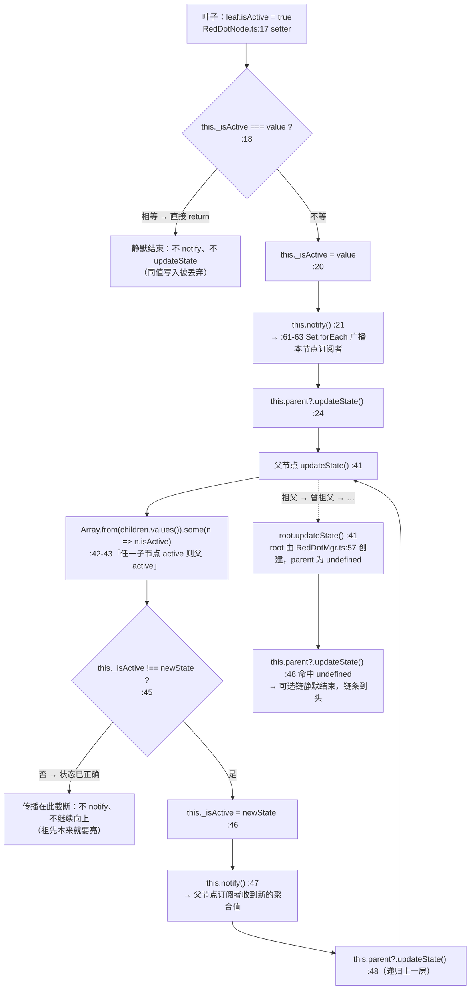
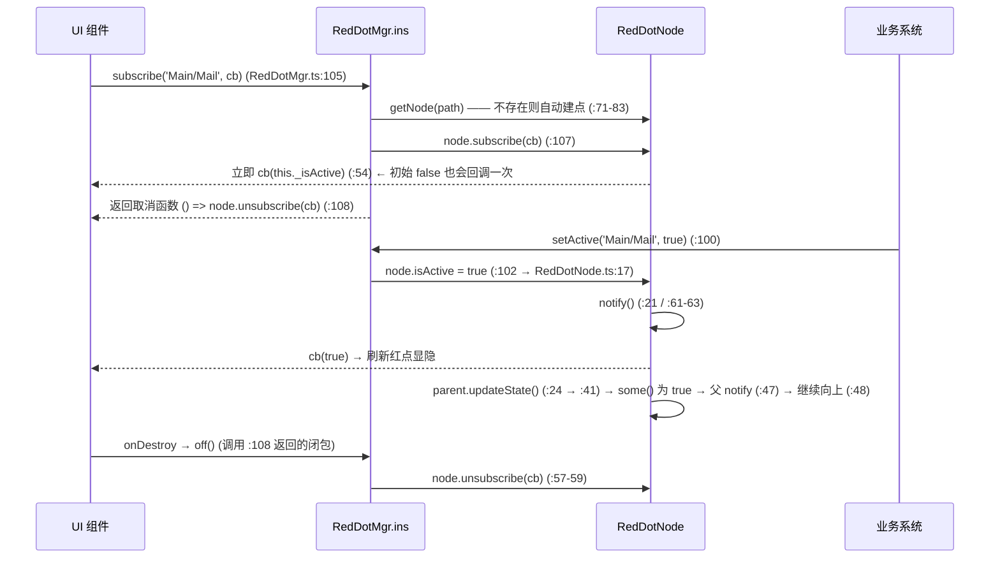

# 红点（red）

> 源码：`assets/scripts/platform/red/RedDotMgr.ts`、`assets/scripts/platform/red/RedDotNode.ts` ｜ 平台层教程第 14 章

> ⚠️ **平台层能力，当前工程未接线。** 全工程 grep `RedDotMgr` / `RedDotNode` / `RedDotCallback`：**除这两个源文件自身，只有一处文档提及**（`docs/成就系统设计.md:433`，原文即"`RedDotMgr` 存在但**全工程尚未接入**"）。脚本 uuid `f58c0a75-e382-407c-a9c9-d60a5c2f9ad5`（`RedDotMgr.ts.meta:5`）在**任何 `.scene` / `.prefab` 里都不存在** → 没有任何节点引用过它；`platform/red/` 也**没有 `index.ts`**（对比 `platform/reactivity/index.ts`、`platform/store/index.ts`），连统一导出都没建。
> 本工程现有的红点是**手写显隐**：`Scene_Menu.ts:191-195` 里 `this.achieveRedDot.active = count > 0`（节点在 `Scene_Menu.prefab:7383` 的 `red_dot`）。第 7 节给出"若要接线，正确姿势是什么"。

## 1. 一句话说明 / 什么时候用

**一句话**：一棵用字符串路径寻址的布尔树 —— `setActive('Main/Mail', true)` 写入叶子，状态沿 `parent` 自动向上传播，任意层级的 UI 都能 `subscribe` 到"我这一支下面有没有亮"。

**什么时候用**：
- **多个叶子条件要汇总成一个入口红点**（主界面 → 邮件 / 任务 / 成就 三个叶子，"更多"按钮上只画一个点）——这正是 `updateState()` 的 `some()` 规则（`RedDotNode.ts:42-43`）在替你做的事；
- 需要**任意深度**的路径寻址（`RedDotNode.ts:41-50` 逐级递归 + `RedDotMgr.ts:71-83` 自动建点，见文件中 `Main/Task/Daily` 的层级说明 `RedDotMgr.ts:29`）;
- 需要一个**不依赖任何 UI 框架**的纯逻辑层（它是纯 TS 类，见 §6）。

**什么时候别用**：
- 只有**一个**静态布尔要显隐 → 直接 `node.active = x`。本工程的成就红点就是这么做的（`Scene_Menu.ts:191-195`），并明确"不引入新框架"（`docs/成就系统设计.md:433`）；
- 需要**数字角标 / 排序 / 已读去重** → 本模块 `isActive` 只有布尔（`RedDotNode.ts:6`），没有计数与优先级语义。

## 2. 源码地图

两个文件都极短（147 + 65 行），下表即全文骨架：

| 位置 | 内容 | 要点 |
|---|---|---|
| `RedDotMgr.ts:1-2` | `import { error } from "cc"` + `import { RedDotCallback, RedDotNode }` | **整个模块唯一的 cc 依赖**（且是个坑，见 §8-10） |
| `RedDotMgr.ts:36-53` | 文件头 JSDoc 用法示例 | 与实现一致，可当速查（含 `removeNode` 的内存泄漏提示） |
| `RedDotMgr.ts:55-64` | `class RedDotMgr`（**非 Component**）+ 静态 `ins` 懒加载单例 | 首次访问 `ins` 才 `new`（`:60-62`） |
| `RedDotMgr.ts:57` | `private root = new RedDotNode("root")` | **root 显式无 parent** → 传播的终点 |
| `RedDotMgr.ts:66-68` | `parsePath` | 按 `/` 切分并**丢掉空段**（`''`、`'/'`、`'//'` 都得到 `[]`） |
| `RedDotMgr.ts:71-83` | `getNode(path)` | 逐段 `getChild`，**缺失即 `addChild` 自动建点** |
| `RedDotMgr.ts:86-98` | `removeNode(path)` | 见 §8-1（中间层级缺失时**删的不是你以为的那个节点**） |
| `RedDotMgr.ts:100-103` | `setActive(path, isActive)` | 转发给 `node.isActive` setter |
| `RedDotMgr.ts:105-109` | `subscribe(path, cb)` | **返回取消函数** `() => node.unsubscribe(callback)` |
| `RedDotMgr.ts:111-125` | `resolvePath(...names)` | 拼 `A/B/C`，空参数抛错（写法有 bug，§8-10） |
| `RedDotMgr.ts:128-147` | 注释掉的 `RedDotExample` 与另一份示例 | 内含 `find('Main/Task/Daily/RedDot')` 这类**与本模块无关**的写法，勿照抄 |
| `RedDotNode.ts:1` | `export type RedDotCallback = (isActive: boolean) => void` | 回调签名（同步、无第三参） |
| `RedDotNode.ts:3-11` | `children: Map` / `_isActive` / `callbacks: Set` / `readonly parent?` | parent 由 `addChild` 注入，`readonly`（`:9`） |
| `RedDotNode.ts:13-25` | `get/set isActive` | **同值直接 return**（`:18`）→ `notify()`（`:21`）→ `parent?.updateState()`（`:24`） |
| `RedDotNode.ts:27-31` | `addChild(key)` | `new RedDotNode(key, this)`，**不触发任何状态更新** |
| `RedDotNode.ts:33-35` | `removeFromParent()` | 只 `parent.children.delete(name)`，**不 updateState**（§8-2） |
| `RedDotNode.ts:37-39` | `getChild` | 直接查 Map |
| `RedDotNode.ts:41-50` | `updateState()` | **`some()` 聚合**（`:42-43`）+ 判等（`:45`）+ notify（`:47`）+ 递归向上（`:48`） |
| `RedDotNode.ts:52-55` | `subscribe(cb)` | 入 Set 后**立即 `callback(this._isActive)`**（`:54`） |
| `RedDotNode.ts:57-59` | `unsubscribe(cb)` | 从 Set 删 |
| `RedDotNode.ts:61-63` | `notify()` | `Set.forEach` 同步广播当前值 |

> 注：`platform/red/` **没有 `index.ts`**，导入必须打到具体文件；`red` 目录下也只有这两个 `.ts`。

## 3. 快速上手

```ts
// platform/red 没有 index.ts，导入要打到文件名
import { RedDotMgr } from '../../platform/red/RedDotMgr';

// ① 业务侧写入（路径任意深度，中间层级自动创建）
RedDotMgr.ins.setActive('Main/Mail', unreadCount > 0);

// ② UI 侧订阅：返回值就是取消函数；回调会立刻收到一次当前值
const off = RedDotMgr.ins.subscribe('Main/Mail', (on) => { this.dot.active = on; });

// ③ 退订（漏了就是跨场景脏回调，见 §8-9）
off();
```

聚合层不用你算：上面写完，`Main` 这个节点会因为 `some()` 规则自动变 `true`（`RedDotNode.ts:42-43`），订阅 `'Main'` 的入口按钮跟着亮。

## 4. API 速查

| API | 签名 | 位置 | 语义 / 坑 |
|---|---|---|---|
| `RedDotMgr.ins` | `static get ins(): RedDotMgr` | `RedDotMgr.ts:59-64` | 懒加载单例；**跨场景常驻**，`loadScene` 不会重置 |
| `setActive` | `(path: string, isActive: boolean): void` | `RedDotMgr.ts:100-103` | 同值**静默无操作**（不回调、不传播，`RedDotNode.ts:18`） |
| `subscribe` | `(path: string, callback: RedDotCallback) => () => void` | `RedDotMgr.ts:105-109` | **立即回调一次当前值**（`RedDotNode.ts:54`）；返回值是取消函数 |
| `getNode` | `(path: string): RedDotNode` | `RedDotMgr.ts:71-83` | **写操作**：路径不存在会建点；`getNode('')` 返回 root |
| `removeNode` | `(path: string): void` | `RedDotMgr.ts:86-98` | 中间层级缺失时删错节点；匹配不到时静默 no-op（§8-1） |
| `resolvePath` | `(...nodeName: string[]): string` | `RedDotMgr.ts:111-125` | 拼路径；空参抛错，但用的是 `new error()`（§8-10）；**全工程无调用方** |
| `node.isActive` | `get/set isActive: boolean` | `RedDotNode.ts:13-25` | setter 是"写 + 广播 + 向上更新"三合一 |
| `node.updateState` | `(): void` | `RedDotNode.ts:41-50` | public，可手动重算（`removeFromParent` 后需要它） |
| `node.subscribe` | `(cb: RedDotCallback): void` | `RedDotNode.ts:52-55` | 无返回值；重复订阅**同一函数**被 Set 去重，但立即回调会触发两次 |
| `node.addChild` | `(key: string): RedDotNode` | `RedDotNode.ts:27-31` | 手动建子节点（一般用 `getNode` 即可） |
| `node.removeFromParent` | `(): void` | `RedDotNode.ts:33-35` | **不 updateState、不清 callbacks** |

## 5. 生命周期与流程图

### 5.1 状态传播链（叶子置 true → 逐级向上 → 根节点）



三个可验证的要点：

1. **传播是"变才走"**：`:45` 的判等为假时既不 `notify` 也不再向上（`RedDotNode.ts:45-49`）——所以从叶子到根**不会**无脑走满全程，在第一个"本来就该是这状态"的祖先处截断。
2. **每一层的值都由 `some()` 决定**，不是由"是谁变了"决定（`RedDotNode.ts:42-43`）。
3. **终点是 root**：root 没有 parent（`RedDotMgr.ts:57` 用单参构造），`:48` 的可选链在 root 处自然结束。

### 5.2 一次完整的 UI 订阅 → 点亮 → 退订



### 5.3 叶子置 false 之后，父节点会不会自动变 false？

**结论：取决于兄弟节点，不取决于你刚写的那个叶子。** 去源码推演：

| 情形 | `updateState()` 内发生了什么 | 结果 |
|---|---|---|
| 兄弟里还有活跃的 | `some()` → `true`；`:45` 判等 `true !== true` 为假 | 父**保持点亮**，且**不 notify、不再向上**（正确语义：这一支下还有东西） |
| 所有子节点都已 false | `some()` → `false`；`:45` 为真 → `:46` 改写、`:47` notify、`:48` 继续向上 | 父**自动熄灭**，并逐级向上重算，直到某个祖先本来就该亮（截断）为止 |
| 值本来就是 `false` | setter 在 `:18` 直接 return | 什么都不发生（连一次广播都没有） |

推论（由 `RedDotNode.ts:41-50` 直接推得）：**父节点的熄灭是"最后一次子节点变化"的副产物**。所以只要没有任何子节点再变，父节点就会停留在上次算出来的值上 —— 包括 `removeNode` 删掉唯一活跃子树的情况（`removeFromParent` 不调用 `updateState`，§8-2）。

复现命令（1 行）：`setActive('A/B',true); setActive('A/C',true); setActive('A/B',false);` → `A` 仍为 `true`；再 `setActive('A/C',false)` → `A` 变 `false`。

## 6. 与 Cocos 生命周期的关系

- **它不是组件**：`RedDotMgr` 是普通类（`RedDotMgr.ts:55`，无 `extends Component`、无 `@ccclass`），`RedDotNode` 也是（`RedDotNode.ts:3`）。所以**没有** `onLoad/onEnable/onDestroy/update` 任何一个生命周期钩子，也不挂在节点上、不需要场景存在 —— 从任意模块（包括无 cc 依赖的逻辑层）都能 `RedDotMgr.ins.xxx`。
- **它依然依赖 cc 模块**：`RedDotMgr.ts:1` 从 `"cc"` 导入 `error`（只被 `resolvePath` 用）。因此想在纯 Node 脚本里跑这个文件必须先 stub `cc`；而 `RedDotNode.ts` **零 import**，可以单独在 Node 里直接跑（见 §9）。
- **生命周期归调用方**：谁 `setActive` 谁负责清账，谁 `subscribe` 谁负责 `off()`。模块本身没有 `clear/dispose`。
- **单例跨场景常驻**：`RedDotMgr.ins` 是模块级静态单例（`RedDotMgr.ts:56-64`），`director.loadScene` 不会销毁它 —— 上一局留下的 `Main/*` 状态在新场景里**照样是亮的**。要么在场景入口显式重置（`removeNode('Main')` 之后再 `setActive`），要么保证每次进入都重算全量状态。
- **与宿主 UI 组件的正确挂法**：`subscribe` 放 `onLoad`（或需要显示时），退订放 `onDestroy`。本工程有"表现层 `onDestroy` 里绝不碰别的组件"的铁律（`AGENTS.md`）—— 红点退订只是从 `Set` 删一项（`RedDotNode.ts:57-59`），不触碰别的组件，是安全的；但**回调里**给已销毁节点赋值不安全，务必加 `isValid` 守卫（§7 示例已加）。
- **广播是同步的**：`notify` 在 `setActive` 的调用栈里直接执行（`RedDotNode.ts:21`、`:61-63`），不是下一帧。所以"设置红点 → 等一帧再看 UI"是错的；反过来，**回调里再改状态**会重入（§8-13）。
- **自动建点不会惊动任何人**：`addChild`（`RedDotNode.ts:27-31`）只往 Map 里塞，不 `updateState`、不 `notify`，所以 `getNode` / `subscribe` 一个新路径**不会**让父链变亮 —— 只有真值变了才传播。

## 7. 典型组合用法

### 7.1 UI 组件订阅 → onDestroy 退订（完整可编译）

```ts
import { _decorator, Component, Node } from 'cc';
import { RedDotMgr } from '../platform/red/RedDotMgr';   // 按你的目录深度调整
const { ccclass, property } = _decorator;

@ccclass('MailButtonRedDot')
export class MailButtonRedDot extends Component {
    @property(Node) dotNode: Node = null;
    private off: (() => void) | null = null;

    onLoad() { this.off = RedDotMgr.ins.subscribe('Main/Mail', this.onDot); }
    onDestroy() { this.off?.(); this.off = null; }   // ← 漏了这行 = 跨场景脏回调 + 引用泄漏

    private onDot = (active: boolean) => { if (this.dotNode?.isValid) this.dotNode.active = active; };
}
```

配套的业务侧只需一行（放在"未读数变化"的唯一收口处，与 `AGENTS.md` 里"一个功能一个键/唯一收口"的口径一致）：

```ts
RedDotMgr.ins.setActive('Main/Mail', DataCenter.ins.mailData.getUnreadCount() > 0);
```

### 7.2 层级聚合：叶子写、入口订阅，中间层零代码

```ts
// 三个叶子各写各的（三条业务互不认识）
RedDotMgr.ins.setActive('Main/Task/Daily', dailyDone < dailyTotal);
RedDotMgr.ins.setActive('Main/Task/Weekly', weeklyDone < weeklyTotal);
RedDotMgr.ins.setActive('Main/Mail', unread > 0);

// 入口按钮只订阅聚合层 'Main'：任一叶子亮则亮（some 规则），全灭才灭
RedDotMgr.ins.subscribe('Main', (on) => { this.moreBtnDot.active = on; });
```

### 7.3 与响应式层配合（可选，本工程更常见的写法）

若要接进本工程的 `reactive`/`store` 体系，正确关系是：**store/DataModule 是唯一真源，`setActive` 只是它的一个 `watch` 出口**，不要在别处再手写 `setActive`（否则两处状态会分叉）：

```ts
this.scope.watch(() => DataCenter.ins.achieveData.getClaimableCount(),
    (n: number) => RedDotMgr.ins.setActive('Main/Achievement', n > 0));
```

这正是 `Scene_Menu.ts:169-172` 现在的写法，区别只是那里直接改 `node.active`（`Scene_Menu.ts:191-195`）而没走 `RedDotMgr`。**若要把成就红点切到本模块，改的就是这两行**。

## 8. 注意事项与坑

1. **`removeNode(path)` 在中间层级不存在时，会删掉另一个节点（源码推演，务必看）**
   `removeNode` 的循环（`RedDotMgr.ts:89-94`）在 `getChild` 取不到时**不中断、也不报错**，只是让 `node` 停在上一层继续消费后面的段名：
   ```
   树：root/A/C 存在；A/B 不存在
   removeNode('A/B/C')  →  i=0 命中 A        (node=A)
                           i=1 'B' 取不到    (node 仍是 A，未中断)
                           i=2 'C' 命中      (node=A/C)
   → 最终删掉的是 A/C，不是 'A/B/C' 下的任何东西
   ```
   也就是说：**路径里任何一段缺失，后续段名会被"接"在最后一个匹配成功的前缀上**。全路径都匹配不到时 `node` 仍是 root，被 `:95` 的 `node != this.root` 守卫挡住 → **静默 no-op**（不抛错、不返回布尔）。`removeNode('')` / `removeNode('/')` 同理（`parsePath` 得 `[]`，循环体不执行）。
2. **`removeFromParent()` 不会重算父节点**：`RedDotNode.ts:33-35` 只做 `parent.children.delete(name)`，没有 `updateState()`。所以删掉父节点唯一的活跃子树后，**父节点仍然亮着**（脏状态），需要手动 `parent.updateState()`（它是 public，`RedDotNode.ts:41`）。
3. **删点不会通知任何订阅者，并且之后同路径会"复活"成新节点**：`removeNode` 不碰 `callbacks`；此后 `setActive('A/C', ...)` 会走 `getNode` 的自动建点分支（`RedDotMgr.ts:77-79`）**新建**一个 `_isActive=false` 的节点。老订阅者持有的是**旧节点对象**（`subscribe` 的闭包捕获的是 `node`，`RedDotMgr.ts:107-108`），从此永远收不到通知，UI 会卡在上次的值上；而 `off()` 也只能作用于旧节点。**要么别删有订阅者的子树，要么删之前先让订阅者退订。**
4. **`subscribe()` 会立刻回调一次当前状态**（`RedDotNode.ts:54`，在 `callbacks.add` 之后无条件调用）。好处：UI 不必自己先读一次初值。坏处：`subscribe` 一个**从未设置过**的路径也会拿到一次 `false`（同时把节点建了出来）。另外，**同一个函数重复 subscribe**：`Set` 会去重（`:53`），但立即回调照样执行两次（`:54` 无条件）。
5. **同值写入被丢弃**（`RedDotNode.ts:18`）：`setActive(path, false)` 对一个本来就是 `false` 的节点**不产生任何回调**。所以别把"设一次 → 靠回调刷新 UI"当作初始化手段，用 §7.1 的订阅立即回调。
6. **父节点能不能自动熄灭，看兄弟**（§5.3 已列全表）：`some()` 的结果才是父节点的新值，`:45` 判等为假时父节点既不 `notify` 也不继续向上 —— 兄弟还亮着，父节点就该亮。
7. **手写父节点的 `isActive` 是"易失"的**：任何子节点的一次变化都会让 `updateState()` 用 `some()` 覆盖你写进去的值（`RedDotNode.ts:41-50`）。父路径只应作为聚合结果存在，**不要**直接 `setActive('Main', true)` 去"点亮整个入口"。
8. **传播会提前截断**（`RedDotNode.ts:45`）：只有"值真的变了"的节点才 `notify` 并继续向上。所以**订阅祖先 ≠ 每次叶子变化都收到回调** —— 祖先值没变就没有回调（这是优点，但这意味着"用祖先回调做埋点"不可靠）。
9. **没有 `clear()` / `dispose()` / `unsubscribeAll()`**：退订唯一途径是 `subscribe` 返回的闭包（`RedDotMgr.ts:108`）。忘记调用 → 回调永久留在 `Set` 里（`RedDotNode.ts:7`），既泄漏引用，又会在 UI 已销毁后继续跑；本工程对表现层的要求是回调内先 `isValid` 再赋值（§7.1）。
10. **`resolvePath` 里的 `new error(...)` 是个真 bug（暂未触发）**：`RedDotMgr.ts:1` 导入的 `error` 是 cc 的**日志函数**（`cc.d.ts:21779`：`export function error(...data: unknown[]): void`），不是构造函数 —— `new error("…")`（`RedDotMgr.ts:113`、`:122`）在运行时抛 `TypeError: error is not a constructor`，TS 侧也会报"没有构造签名"。目前 `resolvePath` **全工程无调用方**（grep `resolvePath` 只命中它自己的定义），所以从未炸；要用请改成 `throw new Error(...)`（全局 `Error`）。
11. **root 不可寻址**：root 的名字虽然叫 `"root"`（`RedDotMgr.ts:57`），但 `getNode('root')` 查的是 root 的**子节点**里名为 `root` 的那个 → 会**新建**一个。`removeNode('root')` 同理永远 no-op（被 `:95` 守卫挡住）。想拿 root 只有 `getNode('')`（`parsePath('')` → `[]`，循环不执行直接返回 root）。
12. **`getNode()` 是写操作，不是查询**：`RedDotMgr.ts:77-79` 会把缺失的路径建出来。所以"顺手读一下有没有红点"会污染树（并让后续 `''` 遍历多出空分支）。**只读查询没有 API**：`root` 是 `private`（`RedDotMgr.ts:57`），外部无法只读访问。
13. **回调里改状态会同步重入**：`notify` 是 `Set.forEach` 同步广播（`RedDotNode.ts:61-63`）。若回调把同一节点的值翻回去，会再次进 setter（`:18` 的同值守卫拦不住"翻成相反值"）→ 两个回调互相触发可无限递归。**回调只读、不改红点本身。**
14. **遍历期间改动集合**：`Set.forEach` 语义下，回调里 `unsubscribe` 自己是安全的（已删除项会被跳过），但在回调里 `subscribe` 新回调会在**本轮**就被访问（同一路径会立刻收到第二次回调）。**别在回调里订阅。**
15. **只有布尔，没有数量**：`_isActive: boolean`（`RedDotNode.ts:6`）→ 想要"红点 + `3` 角标"必须自己另存一份计数（本工程成就红点用的判据就是 `count > 0`，`Scene_Menu.ts:193`）。

## 9. 调试手段

- **预览控制台取不到它**：`RedDotMgr.ts` 全文**没有** `window`/`globalThis` 赋值（对比 `ezgame.ts:56` 的 `window.ezgame = new EzGame()`）→ 控制台里没有全局名字。临时挂一个（**别提交**）：`window.__red = RedDotMgr.ins`，或从你自己的模块里 `import` 后调。
- **打印整棵树**：`RedDotMgr.ins.getNode('')` 就是 root（§8-11）。`children` / `_isActive` / `callbacks` 虽是 `private`（TS 只在编译期约束），运行时仍可读：`[...(RedDotMgr.ins.getNode('')).children].map(([k,v]) => [k, v.isActive])`。
- **单测**：`RedDotNode.ts` **零 import**，可以单独喂给 Node 跑（它不碰 `cc`）；`RedDotMgr.ts:1` 依赖 cc 的 `error`，在 Node 里跑要先 stub 一个 `{ error: console.error }` 的模块映射。
- **复现"父不灭"**：`setActive('A/B',true); setActive('A/C',true); setActive('A/B',false);` → A 仍 true；再 `setActive('A/C',false)` → A 才 false（§5.3）。这是验证本模块语义最快的一条。
- **复现"删错节点"**：建 `root/A/C` 后执行 `removeNode('A/B/C')`，再 `getNode('A/C')` 看它是否已被换新 —— 或直接 `getNode('A')` 观察 `children` 里少的是 `C`（§8-1）。
- **日志口径**：跟工程一起走 `ezgame.debug(...)`（`ezgame.ts:20-21` → `LogMgr.debug`），别用裸 `console.log`。
- **验证立即回调**：先 `setActive(p, true)`，再 `subscribe(p, cb)` → `cb` 会在 `subscribe` 的栈里同步收到 `true`（`RedDotNode.ts:54`）。

## 10. 事实依据

**本模块源码**

1. `assets/scripts/platform/red/RedDotNode.ts:17-25` —— setter：`:18` 同值 return、`:20` 写值、`:21` `notify()`、`:24` `this.parent?.updateState()`。
2. `assets/scripts/platform/red/RedDotNode.ts:41-50` —— `updateState()`：`:42-43` `some(node => node.isActive)`、`:45` 判等、`:46-47` 写值并 `notify()`、`:48` 继续 `parent?.updateState()`。
3. `assets/scripts/platform/red/RedDotNode.ts:52-55` —— `subscribe` 里 `callback(this._isActive)` 立即回调（`:54`）。
4. `assets/scripts/platform/red/RedDotNode.ts:33-35` —— `removeFromParent()` 只 `parent.children.delete(this.name)`，无 `updateState`、无回调清理。
5. `assets/scripts/platform/red/RedDotMgr.ts:57` —— `private root: RedDotNode = new RedDotNode("root")`（单参构造 → 无 parent，传播终点）。
6. `assets/scripts/platform/red/RedDotMgr.ts:71-83` —— `getNode` 在 `getChild` 为空时 `addChild`（`:77-79`），是写操作。
7. `assets/scripts/platform/red/RedDotMgr.ts:86-98` —— `removeNode`：`:90-93` 取不到子节点时不中断、`node` 停在上一层；`:95-97` 仅当 `node != this.root` 才 `removeFromParent()`。
8. `assets/scripts/platform/red/RedDotMgr.ts:105-109` —— `subscribe` 返回 `() => node.unsubscribe(callback)`（`:108`）。
9. `assets/scripts/platform/red/RedDotMgr.ts:111-125` —— `resolvePath` 用 `new error(...)` 抛错（`:113`、`:122`）；`RedDotMgr.ts:1` 的 `error` 来自 `"cc"`。
10. `assets/scripts/platform/red/RedDotMgr.ts:66-68` —— `parsePath` 按 `/` 切分并过滤空段（`''`/`'/'` → `[]`）。
11. `assets/scripts/platform/red/RedDotNode.ts:6` —— `_isActive: boolean`（只有布尔，无计数）。

**引擎侧证据（Cocos Creator 3.8.6 声明文件）**

12. `C:\ProgramData\cocos\editors\Creator\3.8.6\resources\resources\3d\engine\bin\.declarations\cc.d.ts:21779` —— `export function error(...data: unknown[]): void`（**函数**，不可 `new`）→ 支撑 §8-10。

**"未接线"的 grep 证据**

13. 全工程 grep `RedDotMgr|RedDotNode|RedDotCallback`：命中仅 `assets/scripts/platform/red/RedDotNode.ts`、`assets/scripts/platform/red/RedDotMgr.ts`（含其注释示例 `:36-53`、`:128-147`）与 `docs/成就系统设计.md:433`——后者原文写"`RedDotMgr` 存在但**全工程尚未接入**"。
14. grep `f58c0a75`（= `assets/scripts/platform/red/RedDotMgr.ts.meta:5` 的脚本 uuid）在整个 `assets/` 下**只命中该 `.meta` 自身** → **没有任何 `.scene` / `.prefab` 引用过这个脚本**（场景/预制件引用脚本一律写 uuid）。
15. `glob assets/scripts/platform/red/*` → 只有 `RedDotMgr.ts`、`RedDotNode.ts` 及两个 `.meta`；**目录下没有 `index.ts`**（对比 `assets/scripts/platform/reactivity/index.ts`、`assets/scripts/platform/store/index.ts` 存在）。
16. 本工程现行红点是手写显隐：`assets/scripts/game/ui/scenes/scene_menu/Scene_Menu.ts:191-195`（`this.achieveRedDot.active = count > 0`），节点在 `assets/resources/prefabs/ui/scenes/scene_menu/Scene_Menu.prefab:7383`（`"_name": "red_dot"`），判据来自 `Scene_Menu.ts:168-172` 的 `AchievementData.getClaimableCount()`。
