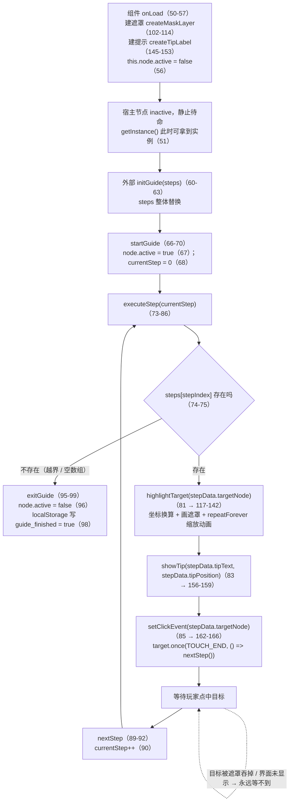
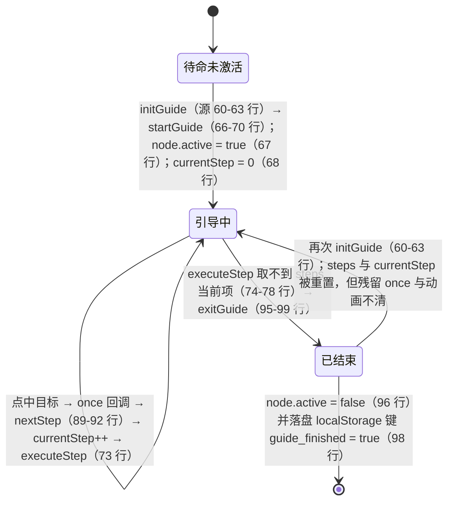

# 新手引导（guide）

> 源码：`assets/scripts/platform/guide/GuideMgr.ts` ｜ 平台层教程第 15 章

> ⚠️ **平台层能力，当前工程未接线。** 全工程 grep `GuideManager` / `GuideMgr`：**除源文件自身，零命中**（`assets/` 下另外两处 `Guide` 是 shader 头注释与 `reactivity/computed.ts:176` 的 vuejs 文档链接，无关）。脚本 uuid `e73cd61f-9cf8-4f51-8b36-93ec55fa6d3b`（`GuideMgr.ts.meta:5`）在**任何 `.scene` / `.prefab` 里都不存在** → 没有任何节点挂过它（而它是 `Component`，不挂节点就永远不会 `onLoad`，见 §6）；`platform/guide/` 下**没有 `index.ts`**。完成状态的 key `guide_finished` 全工程只有写、**没有任何读取方**（grep 只命中 `GuideMgr.ts:98`）。
> 本章第 8 节是**实现完成度体检**：逐条给"现象 → 原因 → 正确做法"，其中"挖洞其实没挖"和"BlockInputEvents 拦不住"两条是**引擎声明文件级证据**，不是猜测。

## 1. 一句话说明 / 什么时候用

**一句话**：一个 185 行的**引导骨架** —— 全屏遮罩 + 提示文字 + 一串 `{targetNode, tipText, tipPosition}` 步骤，玩家点中目标就 `nextStep()`，步骤走完写一条 localStorage 标记。

**什么时候用**：需要一个"从上到下逐步高亮 + 逐步点击"的线性新手引导，且**接受自己补完**（当前实现只有骨架，镂空、点击拦截、动画回收、跳过判定都得自己写，见 §8）。

**什么时候别用 / 用之前必须知道**：
- 你要的是**成品**引导 → 现状不满足，§8 里 15 条里有 5 条是"功能不可用"级别（`:8.1`、`8.2`、`8.3`、`8.4`、`8.6`）；
- 你只想"教一次操作" → 一个带箭头动画的提示框加 `node.active` 就够了，不必引入遮罩 + `BlockInputEvents`；
- **必须先决定挂在哪**：遮罩和提示都是 `this.node` 的子节点（`GuideMgr.ts:113`、`:152`），而 `onLoad` 会把 `this.node.active = false`（`:56`）—— 挂在 Canvas 上等于**一进游戏就关掉整个 Canvas**（§8-15）。

## 2. 源码地图

单文件 185 行，其中 `:169-185` 是**不可执行的死代码**（§8-13）。

| 位置 | 内容 | 要点 |
|---|---|---|
| `GuideMgr.ts:1` | 17 个 `cc` 导入 | 含**未使用**的 `Vec3`（§8-14） |
| `GuideMgr.ts:5-35` | 文件头 JSDoc：基本思路 / 高级优化 / 注意事项 | **是设计意图清单，不是实现清单**（`:29` 的"引导结束后恢复节点原始状态"就没实现） |
| `GuideMgr.ts:36-37` | `@ccclass('GuideManager')` + `export default class GuideManager extends Component` | **是 Component**，必须挂节点 |
| `GuideMgr.ts:38-44` | `static instance` / `steps` / `currentStep` / `maskLayer` / `tipLabel` / `winWidth` / `winHeight` | `steps: any[]`、`currentStep` 初始 `-1` |
| `GuideMgr.ts:46-48` | `static getInstance(): GuideManager` | 只 `return this.instance`，**不做懒创建** |
| `GuideMgr.ts:50-57` | `onLoad()` | 见 §5.3 逐行拆解（建遮罩 → 建提示 → **自锁 `active=false`**） |
| `GuideMgr.ts:60-63` | `initGuide(steps)` | 唯一入口：存 steps → `startGuide()` |
| `GuideMgr.ts:66-70` | `startGuide()`（private） | `node.active = true`、`currentStep = 0`、`executeStep(0)` |
| `GuideMgr.ts:73-86` | `executeStep(i)`（private） | 取不到 `steps[i]` → `exitGuide()`；否则高亮 + 提示 + 挂点击 |
| `GuideMgr.ts:89-92` | `nextStep()`（**public**） | `currentStep++` 后 `executeStep()` |
| `GuideMgr.ts:95-99` | `exitGuide()`（private） | 两行：`node.active = false` + 写 localStorage |
| `GuideMgr.ts:102-114` | `createMaskLayer()` | `Graphics` 画 `color(0,0,0,180)` 全屏矩形 + `BlockInputEvents`；**从不设 `contentSize`** |
| `GuideMgr.ts:117-142` | `highlightTarget(target)` | 坐标换算（`:121-122`）+ "挖洞"（`:125-133`）+ `repeatForever` 动画（`:136-141`） |
| `GuideMgr.ts:145-153` | `createTipLabel()` | 建 `Tip` 节点 + `Label`（24 号、居中），**未设颜色/尺寸** |
| `GuideMgr.ts:156-159` | `showTip(text, position)` | `Label.string` + `setPosition(v3(x,y,0))`（**节点局部坐标**，§8-7） |
| `GuideMgr.ts:162-166` | `setClickEvent(target)` | `target.once(Node.EventType.TOUCH_END, () => this.nextStep(), this)` |
| `GuideMgr.ts:169-185` | `guidTest()` | 未导出、无人调用的示例（`this.buttonNode1` 在模块顶层无意义） |

## 3. 快速上手

```ts
// GuideManager 必须挂在【独立空节点】上（绝不能挂 Canvas，见 §8-15）
import { _decorator, Component, Node, sys, v2 } from 'cc';
import GuideManager from '../platform/guide/GuideMgr';
const { ccclass, property } = _decorator;

@ccclass('GuideBootstrap')
export class GuideBootstrap extends Component {
    @property(Node) startBtn: Node = null;      // 引导目标（必须在界面上且 active）
    start() {
        if (sys.localStorage.getItem('guide_v1_main') === 'true') return;  // 跳过判据自己写
        GuideManager.getInstance()?.initGuide([
            { targetNode: this.startBtn, tipText: '点击这里开始游戏', tipPosition: v2(0, 120) },
        ]);
    }
}
```

步骤数据的形状是**无类型的 `any[]`**（`GuideMgr.ts:39`），字段只有三个，来自 `guidTest` 的示例（`GuideMgr.ts:172-181`）：

```ts
// 每步 = { targetNode: Node, tipText: string, tipPosition: Vec2 }
// tipPosition 是【提示节点相对引导宿主节点】的局部坐标，不是屏幕坐标（§8-7）
{ targetNode: this.shopBtn, tipText: '这里是商店按钮', tipPosition: v2(-100, 50) }
```

调用时机（本工程口径）：**等目标界面已经显示出来再 `initGuide`** —— 目标节点在未激活的界面上时，`once(TOUCH_END)` 永远不会触发（§8-5）。

## 4. API 速查

| API | 签名 | 位置 | 语义 / 注意 |
|---|---|---|---|
| `GuideManager.getInstance()` | `(): GuideManager` | `GuideMgr.ts:46-48` | **onLoad 之前返回 `null`**（`:38` 初值 null，`:51` 才赋值）→ 调用侧用 `?.` |
| `initGuide` | `(steps: any[]): void` | `GuideMgr.ts:60-63` | 唯一入口；整体替换 `steps`，随即 `startGuide()` |
| `startGuide` | `(): void`（private） | `GuideMgr.ts:66-70` | 激活宿主节点、`currentStep = 0` |
| `executeStep` | `(stepIndex: number): void`（private） | `GuideMgr.ts:73-86` | 取不到步骤 → `exitGuide()`（这是唯一的结束路径） |
| `nextStep` | `(): void`（**public**） | `GuideMgr.ts:89-92` | 外部可调；**不会**摘掉上一步的 `once`（§8-11） |
| `exitGuide` | `(): void`（private） | `GuideMgr.ts:95-99` | 关节点 + 写 `guide_finished`；**没有任何清理/还原** |
| `highlightTarget` | `(target: Node): void`（private） | `GuideMgr.ts:117-142` | `!target` 直接 return（`:118`）；"挖洞"实为同色再填（§8-1） |
| `showTip` | `(text: string, position: Vec2): void`（private） | `GuideMgr.ts:156-159` | `position` 为 `undefined` 时抛错（`:158`，§8-8） |
| `setClickEvent` | `(target: Node): void`（private） | `GuideMgr.ts:162-166` | `target` 为 `undefined` 时抛错（`:163`） |
| 完成标记 | `sys.localStorage.setItem('guide_finished', 'true')` | `GuideMgr.ts:98` | 固定 key/固定值；**全工程无人读**（§8-10） |

> 本模块**没有**：跳过、上一步、进度查询、`onDestroy` 清理、步骤数据类型的导出。

## 5. 生命周期与流程图

### 5.1 步骤流转（含"没有下一步骤 → exitGuide"分支）



### 5.2 组件状态与落盘



### 5.3 `onLoad` 逐行拆解（`GuideMgr.ts:50-57`）

| 行 | 代码 | 做了什么 / 后果 |
|---|---|---|
| `:51` | `GuideManager.instance = this;` | 注册单例 —— **这是 `getInstance()` 能返回非 null 的唯一时刻**（`:38` 初值是 `null`） |
| `:52-53` | `this.winWidth/Height = view.getVisibleSize().width/height` | 取"视图窗口可见区域尺寸"（`cc.d.ts:58740-58744`），**只取一次**，之后不再更新（§8-7） |
| `:54` | `this.createMaskLayer()` | 建 `Mask` 子节点 + `Graphics` 画黑 180 矩形 + `fill()`（`:107-109`）+ 加 `BlockInputEvents`（`:112`）+ 挂到 `this.node`（`:113`） |
| `:55` | `this.createTipLabel()` | 建 `Tip` 子节点 + `Label`（`:146-152`），初始空串、位置默认 `(0,0)` |
| `:56` | `this.node.active = false;` | **把自己（连同刚建的两个子节点）藏起来**；`onLoad` 一辈子只跑一次，所以遮罩/提示不会被重建 —— 这是"建好即藏、用时再开"的设计 |

调用链一句话：`initGuide`（`:60-63`）→ `startGuide`（`:66-70`，开节点 + 归零）→ `executeStep`（`:73-86`，高亮 + 提示 + 挂点击）→ 玩家点击 → `nextStep`（`:89-92`，自增后回到 `executeStep`）→ 越界时 `exitGuide`（`:95-99`，关节点 + 落盘 `'guide_finished' = 'true'`）。

## 6. 与 Cocos 生命周期的关系

- **它是 `Component`**：`@ccclass('GuideManager')`（`GuideMgr.ts:36`）+ `export default class GuideManager extends Component`（`:37`）。因此 **必须有人把它挂到场景节点上，`onLoad` 才会执行** —— 没人挂，`instance` 永远是初值 `null`（`:38`），`getInstance()` 恒返回 `null`（`:46-48`），`initGuide` 也就永远没人能调到。**当前工程正是这个状态**：脚本 uuid `e73cd61f-…`（`GuideMgr.ts.meta:5`）在任何 `.scene`/`.prefab` 中都不存在。
- **`getInstance()` 在它 `onLoad` 之前返回 `null`**（源码证据链：`:38` `private static instance: GuideManager = null;` → `:46-48` `return this.instance` → 只有 `:51` 一处赋值）。所以调用侧必须写 `GuideManager.getInstance()?.initGuide(steps)`，或先确保宿主节点已激活（组件在已激活节点上被 `addComponent` 时，引擎会立即激活它并跑 `onLoad`，故此路径下同一帧即可取到实例）**[推断：这条依赖引擎的组件激活时序，未实测]**。
- **`onLoad` 的时序**：`onLoad → onEnable → start`。`:56` 在 `onLoad` 末尾把节点设为 `inactive`，会紧接着触发 `onDisable`；之后再 `active = true`（`:67`）只会走 `onEnable`，**不会**重跑 `onLoad`（引擎语义：`onLoad` 只在组件首次激活时执行一次）。
- **全文件只有一个组件生命周期回调**：`onLoad`（`:50`）。**没有** `start` / `update` / `onEnable` / `onDisable` / **`onDestroy`** —— 后者意味着**没有任何销毁时的清理**：`steps`、`maskLayer`、`tipLabel` 引用、以及挂在目标上的 `once` 与 `repeatForever` 动画都不会被回收（§8-6、§8-11）。
- **"逐帧"的东西只有 tween**：`tween(...).repeatForever(...).start()`（`:136-141`）由引擎的 Tween 系统驱动，**作用在业务目标节点上**（不是本组件的节点）。所以组件被 `active=false`（`:96`）并不会停掉动画 —— 除非目标节点自己也不活跃。
- **遮罩与提示是 `this.node` 的子节点**（`:113`、`:152`）→ 宿主节点的**层级位置**决定了遮罩能不能盖住目标；宿主节点的 **`active` 开关**同时控制这三者。**这就是"挂错节点 = 关掉整个界面"的机制**（§8-15）。
- **初始化顺序**：`onLoad` 里先注册单例（`:51`）再建子节点（`:54-55`）→ 即使某一步抛异常，`instance` 也已经不是 null 了（半初始化状态）。**别在宿主节点的 `onLoad` 里调 `initGuide`**：本组件的 `onLoad` 与宿主组件 `onLoad` 的先后由组件在节点上的顺序决定，不可靠；放在 `start` 或界面显示之后。

## 7. 典型组合用法

### 7.1 最小接线（骨架版，用现状代码能跑通）

宿主节点自己挑：独立空节点；它的 Y 序在目标之**上**才能遮住目标（但要接受 §8-1 / 8-3 / 8-4 的后果）。

```ts
import { _decorator, Component, Node, v2 } from 'cc';
import GuideManager from '../platform/guide/GuideMgr';
const { ccclass, property } = _decorator;

@ccclass('GuideLauncher')
export class GuideLauncher extends Component {
    @property([Node]) targets: Node[] = [];
    onStartGame() {     // 由外层决定何时开始（例如主界面显示完成之后）
        GuideManager.getInstance()?.initGuide([
            { targetNode: this.targets[0], tipText: '点击这里开始游戏', tipPosition: v2(0, 120) },
            { targetNode: this.targets[1], tipText: '这里是商店按钮', tipPosition: v2(0, 120) },
        ]);
    }
}
```

### 7.2 建议的补法（**源码里没有这些**，接线上线前必须自己加）

```ts
// 在 exitGuide / nextStep 里补上收尾：现版本只关节点 + 落盘（GuideMgr.ts:95-99）
Tween.stopAllByTarget(this.lastTarget);              // 停掉 repeatForever（§8-6）
this.lastTarget.setScale(this.lastScale);            // 还原被动画改过的缩放（§8-6）
this.lastTarget.off(Node.EventType.TOUCH_END, this.lastHandler, this);  // 摘上一步的 once（§8-11）
this.tipLabel.getComponent(Label).string = '';       // 清提示文本（§8-12）
```

### 7.3 落盘 key 该长什么样（现状是固定 key，无法区分引导段）

```ts
// 现状：sys.localStorage.setItem('guide_finished', 'true')（GuideMgr.ts:98），且全工程无人读
// 建议：key 带引导 ID + 版本，并在启动时读一次决定跳过
const KEY = 'guide_v1_main';
const done = sys.localStorage.getItem(KEY) === 'true';
if (!done) GuideManager.getInstance()?.initGuide(steps);
sys.localStorage.setItem(KEY, 'true');   // 且要真的有人 getItem，否则等于写给空气看
```

## 8. 注意事项与坑

> 写法：**现象 → 原因 → 正确做法**。标 `[推断]` 的表示无法在本工程内实测（没有场景接线，也没有引擎运行时），其余均为源码行号或引擎声明文件级证据。

### 8.1 「挖洞」其实没有挖出透明区域，只是在同色上又画了一个黑圆
- **现象**：高亮目标看不出被"挖出来"，整片遮罩颜色是均匀的，没有任何透明/更亮的一块。
- **原因**：`highlightTarget` 全程只用**一个**填充色 `color(0,0,0,180)`（`:127`，与 `createMaskLayer:107` 同一个值）；`Graphics` 的 `rect()`（`:128`）之后**没有** `fill()`，真正的填充只有 `:133` 那一次 —— 而 `circle()`（`:132`）与 `rect()` 都是"把子路径压进当前路径"（`cc.d.ts:3272` 圆是"绘制圆形**路径**"、`:3289` 矩形是"绘制矩形**路径**"），最后被**同一个画刷**一次性填掉（`cc.d.ts:3352-3358`：`fill()` = "Fills the current or given path with the current **fill style**"，只有一个颜色）。更关键的是 Cocos 的 `Graphics` **没有**擦除/挖洞能力：整个 `cc.d.ts` 里 `erase` 只命中 LOD 的 `eraseLOD`（`:5503-5506`），`fillRule`/`evenodd` **零命中**；`clear()` 的语义是"擦除**之前绘制的所有内容**"（`:3326-3333`），做不到"只擦一块"。
- **正确做法**：用"画法"绕开，任选其一 —— ① 用 4 块矩形把遮罩拼成"回"字形，中间那块不画（最省事、无新依赖）；② 需要圆洞就用 `roundRect`（`cc.d.ts:3308`）拼边角；③ 把目标节点克隆一份放到遮罩**之上**，视觉上"露出来"；④ 进阶用 Stencil（`cc.d.ts:520` 的 `StencilManager`）或 `Mask` 组件；⑤ 直接用一张"中间带透明洞"的遮罩贴图 + `Sprite`。**不要**再试图省事的"先 fill 黑再 fill 一个别的颜色"。

### 8.2 遮罩只画到"节点原点向右上"，多半只盖住右上角一块
- **现象**：遮罩没有铺满屏幕，或者位置整体偏到某一边。
- **原因**：`graphics.rect(0, 0, this.winWidth, this.winHeight)`（`:108`、`:128`）的坐标是**遮罩节点自身 UITransform 的局部坐标**，原点在节点位置上（`anchors` 默认 `(0.5,0.5)`，引擎 `ui-transform.ts:262`）；而 `winWidth/winHeight` 来自 `view.getVisibleSize()`（`:52-53`），那是**视图窗口可见区域尺寸**（`cc.d.ts:58740-58744`，它的原点由 `getVisibleOrigin()` 给出，`:58750-58754`）—— 两套坐标系不是一回事。本工程 `Main.scene` 的 `Canvas` 节点就在 `(375, 667)`（= 750×1334 的正中心），所以"节点在屏幕中心、`rect(0,0,w,h)` 向右上画"是最常见的情形 → **只覆盖右上 1/4**。
- **正确做法**：`rect(-w/2, -h/2, w, h)`（配合默认锚点），或把遮罩节点放到 Canvas 左下角并把锚点设 `(0,0)`，或最省心：让遮罩是一个带 `Widget` 全屏拉伸的预制件节点，尺寸交给引擎。

### 8.3 `BlockInputEvents` 拦不住点击（"事件拦截"基本失效）
- **现象**：引导期间在屏幕大部分区域点东西，照样触发了底下界面的逻辑（"点击穿透"）。
- **原因**：`BlockInputEvents` 的官方语义是"拦截**所属节点尺寸内**的所有输入事件（鼠标和触摸），防止输入穿透到下层节点"（`cc.d.ts:58501-58508` 原文 "within the size of the node" / "所属节点**尺寸内**"）。而 `createMaskLayer`（`:102-114`）**从头到尾没有设置过 `contentSize`**：它只 `addComponent(Graphics)` + 画图 + `addComponent(BlockInputEvents)`。`Graphics` 不会修改节点尺寸（渲染组件只画，不改 `UITransform`；`Graphics` 走 `UIRenderer`，后者只是 `@requireComponent(UITransform)`，引擎 `ui-renderer.ts:116`；`graphics.ts` 全文无 `contentSize` 赋值）。于是拦截范围 = 该节点 UITransform 的**默认尺寸**（引擎 `ui-transform.ts:260`：`new Size(100, 100)`）—— 100×100，与画出来的全屏矩形无关。
- **正确做法**：给遮罩节点显式设尺寸，例如 `this.maskLayer.getComponent(UITransform).setContentSize(this.winWidth, this.winHeight)`（配合 §8.2 的坐标修正），或者干脆用 `Widget` 对齐全屏；**判断拦截面积时永远以 `UITransform.contentSize` 为准，不是"画了多大"。**

### 8.4 若遮罩真的盖住目标，"点目标继续引导"就永远点不到（死锁）
- **现象**：目标点不动，引导卡在第一步；或者反过来——能点动但引导压根没推进。
- **原因**：两种机制互相打架。事件派发先命中层级更高的遮罩 → `BlockInputEvents` 把传播停掉（`cc.d.ts:58503-58508`）→ 目标上的 `target.once(Node.EventType.TOUCH_END, …)`（`:163`）**根本不会被触发**，而代码里**没有任何**"把点击转发给目标 / 在遮罩上按区域命中"的分支。反过来，如果遮罩没盖住目标（§8.3 那种情况），`once` 能触发，但"全屏拦截"的意图同时失效。**两者不可能同时成立。**（[推断：遮罩与目标的实际层级取决于宿主节点与目标节点在场景树中的先后（Y 序），而当前工程没有任何地方挂过本组件，无法实测]）
- **正确做法**：把"继续引导"的判定做在**遮罩那一层**——在遮罩上创建一个覆盖目标矩形（或整屏）的透明热区节点，用它来 `once(TOUCH_END)`；同时按 §8.1 做真正的镂空，让玩家看得见目标。**不要**指望"遮罩拦截 + 目标监听"这套组合。

### 8.5 引导点击会连带触发业务逻辑；目标界面未显示时引导直接卡死
- **现象**：引导没结束，玩家点的那一下已经把界面切走/开打了；或者目标在尚未打开的界面上，点了半天没反应。
- **原因**：`setClickEvent` 只是在目标上**追加**一个一次性监听（`:163`），既不屏蔽目标原有的 `Button`/`TOUCH_END` 处理，也没有"引导中只放行引导"的开关；另外若目标所在页面 `active=false`，注册在它上面的触摸监听不会参与命中，`nextStep` 永不触发。
- **正确做法**：引导期间用显式状态位（如 `guideRunning`）让业务入口短路，或临时 `Button.interactable = false`；`initGuide` 必须**在目标界面显示之后**调用（本工程 UI 惯例：等 `UIManager` 显示完成 / 在 `BaseView.show()` 之后）。

### 8.6 `tween(...).repeatForever()` 退出时没有停，也不还原缩放
- **现象**：引导结束后目标节点还在"呼吸"；同一步骤重复进入后缩放越来越怪；退出后再进游戏，节点的原始缩放再也回不来。
- **原因**：`highlightTarget` 每次调用都新建并启动 `tween(target).repeatForever(...)`（`:136-141`），而 `exitGuide`（`:95-99`）只有两行，**没有** `Tween.stopAllByTarget(...)`，也没有在任何地方记下/恢复原始 `scale`；`to(0.5,{scale:1.1})` / `to(0.5,{scale:1})`（`:139-140`）用的是**绝对值**，所以最终停在哪个值取决于停在哪一帧，且与设计稿原本的缩放无关。文件头注释 `:29` 写着"引导结束后恢复节点原始状态（如缩放）"，**代码里没有实现**。另外同一步骤被重复执行（回到上一步 / 重开引导）会在同一目标上**叠**第二段 `repeatForever`，两段动画抢同一个 `scale`。`[推断：节点 deactivate 时引擎是否暂停 tween 属运行时行为，未实测；但"退出时没有任何停止调用"是源码事实]`
- **正确做法**：把 tween 存成字段，进入前 `this.lastScale = target.scale.clone()`，`exitGuide` / 切换步骤时 `Tween.stopAllByTarget(this.lastTarget)` 再 `setScale(this.lastScale)`；同一步骤重复进入前先停旧动画。

### 8.7 `tipPosition` 不是屏幕坐标，遮罩也不是同一套坐标
- **现象**：提示文字位置和注释里"相对屏幕"的直觉对不上；换了分辨率/朝向偏移更大。
- **原因**：`showTip` 直接 `this.tipLabel.setPosition(v3(position.x, position.y, 0))`（`:158`）—— 这是**相对引导宿主节点**的局部坐标；而示例注释写的是"提示文字位置（**相对屏幕**）"（`:175`）；`winWidth/winHeight` 又是 `view.getVisibleSize()`（`:52-53`，`cc.d.ts:58740-58744`）这套 view 坐标口径。**三套坐标系混用**。另外 `winWidth/winHeight` 只在 `onLoad` 取一次，分辨率变化（转屏/窗口拉伸）后不更新。
- **正确做法**：统一走"世界坐标 → 目标父节点局部坐标"，即 `UITransform.convertToWorldSpaceAR` + `convertToNodeSpaceAR`（`:121-122` 已经演示了这条链，遮罩那侧是对的）；提示位置若想"贴着目标"，就把目标世界坐标换算到 `tipLabel.parent` 的节点空间再叠偏移，别用 `view` 尺寸直接当坐标。

### 8.8 步骤字段缺一个就抛异常
- **现象**：某一步一执行就 `TypeError: Cannot read properties of undefined`。
- **原因**：`executeStep` 对三个字段**原样透传**（`:81`、`:83`、`:85`），只有 `highlightTarget` 有 `if (!target) return;`（`:118`）；`showTip` 读 `position.x`（`:158`）与 `setClickEvent` 的 `target.once`（`:163`）**都没有判空**。步骤数组是 `any[]`（`:39`），没有类型/校验兜底。
- **正确做法**：进入 `executeStep` 先校验 `targetNode` 与 `tipPosition`（缺了就 `ezgame.warn` 报出来并跳过，符合本工程"失败别静默"的惯例），并给步骤定义一个 `interface GuideStep` 导出，别让 `any` 满天飞。

### 8.9 `target.parent.getComponent(UITransform)` 可能为 null；半径只用了宽
- **现象**：目标节点特殊时直接崩溃，或高亮圈与目标不匹配。
- **原因**：`:121` 无条件对 `target.parent` 取 `UITransform`（场景根节点 / 父节点无 UI 组件时抛错）；`:132` 的半径用 `target.getComponent(UITransform).width / 2`，**只读宽**，非正方形目标的高亮圈对不上。
- **正确做法**：局部变量接住 `target.getComponent(UITransform)` 并判空；半径用 `Math.max(width, height) / 2`，或者干脆按矩形高亮（配合 §8.1 的 4 矩形方案）。

### 8.10 完成状态"落了盘但全工程没人读"，而且是无条件写死
- **现象**：真接上之后，通关一次再进游戏，引导照样从头来（除非调用侧自己另写判据）。
- **原因**：`exitGuide` 无条件执行 `sys.localStorage.setItem('guide_finished', 'true')`（`:98`）—— 固定 key、固定值，不区分"哪一段引导/完成到第几步/版本号"，也不先 `getItem` 判断；**全工程 grep `guide_finished` 只有这一处**，没有任何读取方。
- **正确做法**：key 带引导 ID + 版本（`guide_v1_main`），启动时 `getItem` 一次决定是否 `initGuide`；多段引导用多个 key 或一个结构化值。**光写不读 = 这段代码没有作用。**

### 8.11 `nextStep` 是 public，且推进时不会摘掉上一步的 `once`
- **现象**：引导"跳步"、点一下推两步、或者退出后凭空又推进一次。
- **原因**：`nextStep`（`:89-92`）对任何人开放；`initGuide` 会整体替换 `steps` 并把 `currentStep` 归 0（`:60-70`），但**不会**清理上一次已经挂在目标上的 `once` 监听（`:163`）。只要某一步不是靠"点中该目标"推进的（例如外部按钮调 `nextStep()`、或同一目标连续两步），前一个 `once` 就会残留下来，之后被点会**再推进一步**。
- **正确做法**：`nextStep` 里先摘掉上一步的监听（`off(Node.EventType.TOUCH_END, handler, this)`），或统一改成本工程的 `offNodeEvent` 口径；外部只允许通过 `nextStep` 这种"受控入口"推进，并保证一次只有一个待触发的监听。（好消息：越界是安全的 —— `executeStep` 的 `:74-78` 会走 `exitGuide`。）

### 8.12 `exitGuide` 不重置内部状态，靠"下次 `startGuide` 兜底"
- **现象**：重新引导时能看到上一次的残留（提示文本、当前步号）。
- **原因**：`exitGuide`（`:95-99`）只关节点 + 落盘；`currentStep` 停在越界值、`steps` 仍握着旧数组、`tipLabel` 文本不清。之所以表面看不出问题，是因为 `startGuide` 的 `:68` 会把 `currentStep` 置 0、`initGuide` 会替换 `steps`。
- **正确做法**：`exitGuide` 里显式收尾（清文本、清 `steps`、还原被动画改过的节点、停 tween），不要依赖下一次进入时的兜底。

### 8.13 唯一的"示例"是不可执行的死代码
- **现象**：照着文件末尾的 `guidTest()` 抄，抄不出一份能跑的东西。
- **原因**：`guidTest()`（`:169-185`）没有 `export`、也没有任何调用方；函数体里用 `this.buttonNode1`（`:173`）—— 在 ES 模块顶层 `this` 不是任何组件实例，真调起来会抛 `TypeError`。
- **正确做法**：当作"步骤数据形状的说明"看即可（`:172-181` 的字段名是对的），接线照 §7 从自己的组件里调。

### 8.14 提示文字的默认状态没设置（且 `Vec3` 是无用导入）
- **现象**：第一步 `showTip` 之前，提示会闪现在宿主节点的原点 `(0,0)`；字号/换行一多还会溢出（没有设节点尺寸）。
- **原因**：`createTipLabel`（`:145-153`）只设了 `string = ''`、`fontSize = 24`、`lineHeight = 30`、`horizontalAlign = CENTER`（`:148-151`），**没有**设颜色、没有设节点尺寸、也没有初始位置；位置全靠后来的 `showTip`（`:158`）。另外 `Vec3` 从 `cc` 导入但全文未使用（`:1`）。
- **正确做法**：建节点时就把 `setPosition` / `color` / 尺寸（或挂 `Widget`）定好；`Vec3` 该删（不报错，但属于死引用）。层级方面有一点是**对的**：遮罩先于提示 `addChild`（`:113` vs `:152`），兄弟顺序即层级 → 提示画在遮罩之上。

### 8.15 【最重要】挂错节点 = 一进游戏就关掉整个界面
- **现象**：把 `GuideManager` 拖到 `Canvas`（或任何业务根节点）上后，游戏一启动该节点树整体消失（黑屏/界面全没）。
- **原因**：`onLoad` 的最后一句是 `this.node.active = false;`（`:56`），关的是**它所在的整个节点**及其所有子节点。挂在 Canvas 上就是关掉 Canvas；挂在某个业务界面上就是关掉那个界面。
- **正确做法**：**必须挂在一个专用的空节点上**（建议命名 `GuideLayer`，作为 Canvas 的直接子节点，放在最上层）；同时注意它的层级位置决定了遮罩能否盖住目标（§8.2/§8.4），必要时用 `setSiblingIndex` 调整。

## 9. 调试手段

- **预览控制台里没有全局名字**：`GuideMgr.ts` 全文没有 `window`/`globalThis` 赋值（对比 `ezgame.ts:56` 的 `window.ezgame = new EzGame()`），`getInstance()` 也只是普通静态方法 → 临时挂一个（**别提交**）：`window.__guide = GuideManager.getInstance()`，或从自己的模块里 import 后调。`[推断：预览构建里 cc 是全局，可用 cc.director.getScene().getChildByPath('Canvas/GuideLayer')?.getComponent('GuideManager') 取到，未实测]`
- **看"挖洞"到底画了什么**：把 `graphics.fillColor` 临时改成不透明红（`:107`/`:127`），能立刻看出圆和矩形是**同一片颜色**；更直接的办法是在 `:133` 前后把 `fill()` 换成 `stroke()` + `strokeColor = color(255,0,0)`，用**描边**把路径轮廓画出来 —— 你会看到"矩形路径 + 圆形路径"同属一条路径（§8.1 的现场证据）。
- **量拦截范围**：打印 `this.maskLayer.getComponent(UITransform).contentSize` —— 会看到它跟 `winWidth/winHeight` 毫无关系（默认 100×100，§8.3）。
- **看落盘**：控制台 `sys.localStorage.getItem('guide_finished')` 读、`removeItem` 清；注意当前**没有任何代码读它**（§8.10）。
- **看动画泄漏**：引导结束后盯着目标节点的 `scale`（或 `Tween.stopAllByTarget(target)` 手动停一下，看画面是否立刻"安静"）→ 验证 §8.6。
- **单测不适用**：本模块是 `Component` 且整条链依赖 `cc` 的 `Graphics`/`BlockInputEvents`/`view`，**不能像 `platform/red` 那样丢进 Node 跑**；只能在预览里验证。建议搭一个**最小实验场景**（Canvas + 一个空节点挂 `GuideManager` + 两个 Button），符合本工程"别在真实场景里做实验"的纪律。
- **日志口径**：跟工程一致用 `ezgame.debug(...)` / `ezgame.warn(...)`（`ezgame.ts:20-21` → `LogMgr.debug`），失败路径尤其要打（当前源码里一条日志都没有）。

## 10. 事实依据

**源码（`assets/scripts/platform/guide/GuideMgr.ts`）**

1. `GuideMgr.ts:36-37` —— `@ccclass('GuideManager')` + `export default class GuideManager extends Component`（**是组件，必须挂节点**）。
2. `GuideMgr.ts:38`、`:46-48`、`:51` —— `private static instance = null`、`getInstance()` 只 `return this.instance`、唯一赋值点是 `onLoad` 的 `:51` → **onLoad 前恒为 null**。
3. `GuideMgr.ts:50-57` —— `onLoad` 全部内容：`:51` 注册单例、`:52-53` 取 `view.getVisibleSize()`、`:54` `createMaskLayer()`、`:55` `createTipLabel()`、`:56` `this.node.active = false`。
4. `GuideMgr.ts:60-63` / `:66-70` / `:73-86` / `:89-92` / `:95-99` —— `initGuide → startGuide → executeStep → nextStep → exitGuide` 的调用链与各自实现（`exitGuide` 仅 `:96` 关节点 + `:98` 落盘）。
5. `GuideMgr.ts:74-78` —— `executeStep` 取不到 `steps[stepIndex]` 时调用 `exitGuide()`（唯一的结束路径）。
6. `GuideMgr.ts:98` —— `sys.localStorage.setItem('guide_finished', 'true')`（**完成状态写在 `sys.localStorage`，key = `guide_finished`**）。
7. `GuideMgr.ts:102-114` —— `createMaskLayer`：`:107` `color(0,0,0,180)`、`:108` `rect(0,0,winWidth,winHeight)`、`:109` `fill()`、`:112` `BlockInputEvents`、`:113` `this.node.addChild`；**全文无 `contentSize` 设置**。
8. `GuideMgr.ts:117-142` —— `highlightTarget`：`:118` `!target` 守卫、`:121-122` 世界坐标↔节点坐标换算、`:126` `clear()`、`:127` 同一个 `color(0,0,0,180)`、`:128` `rect`、`:131-132` `moveTo`+`circle`、`:133` **唯一的 `fill()`**、`:136-141` `tween(...).repeatForever(...).start()`。
9. `GuideMgr.ts:145-153` / `:156-159` —— `createTipLabel`（`Label` 24 号 / 居中 / 无颜色设置）与 `showTip` 的 `setPosition(v3(position.x, position.y, 0))`（**节点局部坐标**）。
10. `GuideMgr.ts:162-166` —— `setClickEvent` 用 `target.once(Node.EventType.TOUCH_END, () => this.nextStep(), this)`，无判空。
11. `GuideMgr.ts:39` —— `private steps: any[] = []`（无类型约束）；`:169-185` —— `guidTest()` 未导出、无人调用、函数体用模块顶层的 `this`（`:173`）。
12. `GuideMgr.ts:5-35` —— 文件头 JSDoc 把"挖洞/事件拦截/恢复原始状态/本地存储"写成**设计意图**，其中 `:29`"引导结束后恢复节点原始状态（如缩放）"与 `:30`"通过 cc.BlockInputEvents 阻止误操作"在本实现中**都不成立**（见 8.1/8.3/8.6）。

**引擎声明/源码证据（Cocos Creator 3.8.6）**

13. `…\3d\engine\bin\.declarations\cc.d.ts:58501-58508` —— `BlockInputEvents` 官方注释："This component will block all input events (mouse and touch) **within the size of the node**" / "拦截**所属节点尺寸内**的所有输入事件" → 支撑 §8.3。
14. `…\cc.d.ts:3352-3358` —— `fill()`："Fills the current or given path with the current **fill style**"（只有一个填充色）→ 支撑 §8.1。
15. `…\cc.d.ts:3272` / `:3289` —— `circle`"绘制圆形**路径**"、`rect`"绘制矩形**路径**"（都是往当前路径压子路径）→ 支撑 §8.1。
16. `…\cc.d.ts:3326-3333` —— `clear()`："Erasing **any previously drawn content**"（只能全清，不能局部擦）→ 支撑 §8.1。
17. `…\cc.d.ts` 全文检索 `erase|fillRule|evenodd` —— 仅命中 LOD 的 `eraseLOD`（`:5503-5506`），**没有任何"擦除区域 / 奇偶填充规则"API** → 支撑 §8.1。
18. `…\cc.d.ts:58740-58744` / `:58750-58754` —— `getVisibleSize()` 是"视图窗口可见区域**尺寸**"、`getVisibleOrigin()` 才是原点 → 支撑 §8.2/§8.7 的坐标系口径。
19. `…\3d\engine\cocos\2d\framework\ui-transform.ts:260` / `:262` —— `_contentSize = new Size(100, 100)`、`_anchorPoint = new Vec2(0.5, 0.5)`（UITransform 默认尺寸与锚点）→ 支撑 §8.3/§8.2。
20. `…\3d\engine\cocos\2d\framework\ui-renderer.ts:116` —— `@requireComponent(UITransform)`（`Graphics extends UIRenderer`，见 `…\cocos\2d\components\graphics.ts:62`）→ 解释 `:104` 加 `Graphics` 后 `:122` 取 `UITransform` 不会为 null，同时说明**画图不改节点尺寸**。
21. `assets\scenes\Main.scene:108-113` —— `Canvas` 节点的 `_lpos = (375, 667)`（= 750×1334 的正中心，即 Canvas 局部原点就在屏幕中心）→ 支撑 §8.2 "节点在屏幕中心、`rect(0,0,w,h)` 向右上画只会盖住右上 1/4"这一最常见情形。

**"未接线"的 grep 证据**

22. 全工程 grep `GuideManager|GuideMgr`：仅在 `assets/scripts/platform/guide/GuideMgr.ts` 自身命中（`:36`、`:37`、`:38`、`:46`、`:51`、`:100`、`:184`）；`assets/` 下另两处 `Guide` 是 `assets/resources/shader/gray2.effect:1` 的 shader 文档链接与 `assets/scripts/platform/reactivity/computed.ts:176` 的 vuejs 链接，无关。
23. grep uuid `e73cd61f`（= `assets/scripts/platform/guide/GuideMgr.ts.meta:5`）在整个 `assets/` 下**只命中该 `.meta` 自身** → **没有任何 `.scene` / `.prefab` 挂过它**（场景/预制件引用组件一律写脚本 uuid）→ 它的 `onLoad` 在当前工程里从未执行过。
24. grep `guide_finished` 全工程 → **只命中 `GuideMgr.ts:98` 一处**（只有写、没有读）。
25. `glob assets/scripts/platform/guide/*` → 只有 `GuideMgr.ts` + `GuideMgr.ts.meta`，**没有 `index.ts`**（对比 `platform/reactivity/index.ts`、`platform/store/index.ts` 存在）。
