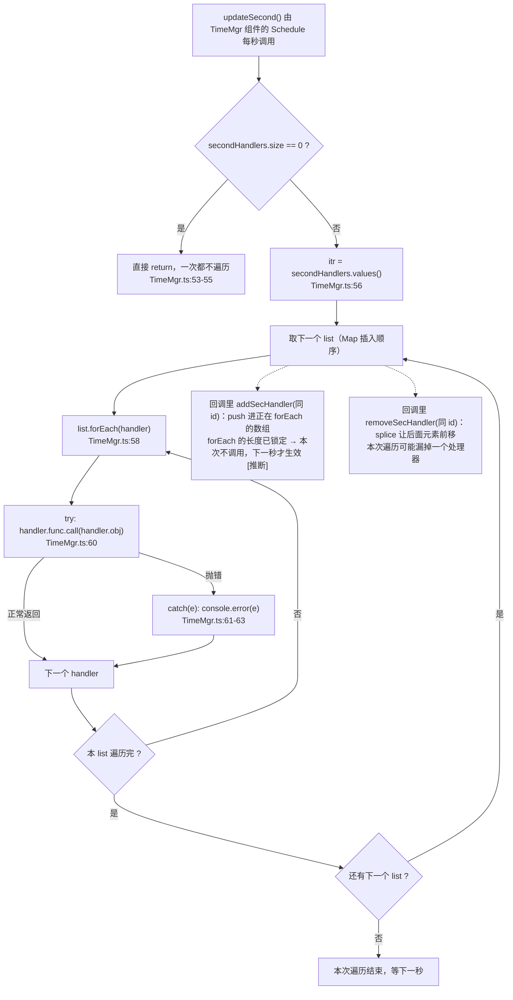
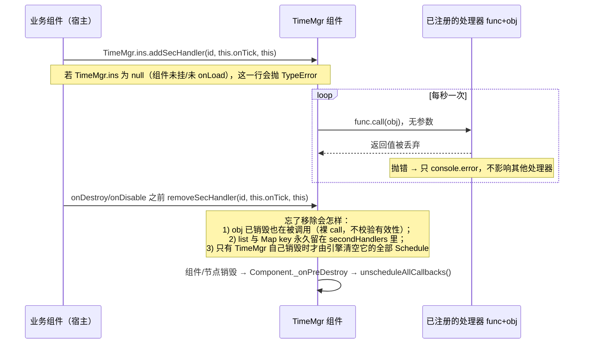
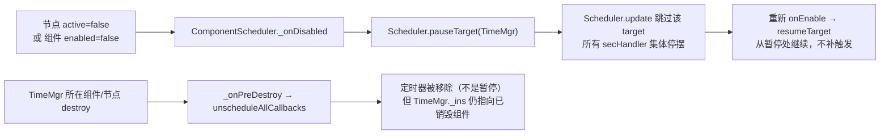

# 定时器（time）

> 源码：`assets/scripts/platform/time/TimeMgr.ts` ｜ 平台层教程第 16 章

## 1. 一句话说明 / 什么时候用

`TimeMgr` 是一个**必须挂在场景节点上**的 Cocos `Component`（`TimeMgr.ts:11-12`）：它在自己身上挂一个 1 秒周期的 `Schedule`（`TimeMgr.ts:30-34, 41`），把「每秒回调」按 **id 分组** 分发给注册进来的 `(func, obj)` 列表（`TimeMgr.ts:23, 52-66`）。

⚠ **本工程未接线**：全工程检索 `TimeMgr` 只命中它自己的文件，脚本 uuid `8fab5ad0-9d26-46ec-977d-abb1ffe34211` 也不出现在任何 `.scene` / `.prefab` / `.ts` / `.json` 中 —— 没有节点挂它、没有代码引用它。因此运行时 `onLoad` 不会执行，**`TimeMgr.ins` 恒为 `null`**（`TimeMgr.ts:13-19` 只在 `onLoad` 里赋值）。证据见 `## 10` 第 13 条。

**什么时候用它（若以后接线）**：

- 需要**整秒粒度**的周期逻辑（每秒回蓝、每秒结算一次的状态、每 N 秒一次的检查），而**不想让每个组件各写一个 `schedule`**；
- 需要「一个时钟驱动很多互不认识的模块」，并且希望**其中一个回调抛错不影响其他回调**（`TimeMgr.ts:58-64` 逐个 try/catch）。

**不该用它**：

- 战斗推进 / 需要吃顿帧或 `dt` 的逻辑 —— 本工程的战斗主循环走 `Scene_Game_Stage.update(deltaTime)`（`Scene_Game_Stage.ts:1104-1111`），`TimeMgr` 的秒回调**既不吃顿帧、也不受 `battleStore.isPaused` 约束**（见 `## 6`、`## 8` 第 6 条）。
- 需要"只跑一次"的延时 —— `startLoop` 无法表达"只跑一次"（见 `## 8` 第 3 条）。

## 2. 源码地图

| 成员 | 位置 | 说明 |
|---|---|---|
| `@ccclass('TimeMgr')` + `extends Component` | `TimeMgr.ts:11-12` | 是组件，**不是**纯 TS 单例；必须有节点承载才会走生命周期 |
| `private static _ins: TimeMgr` | `TimeMgr.ts:13` | 静态实例字段，**只在 `onLoad` 里被赋值**（第 26 行），没有任何地方清空 |
| `static get ins(): TimeMgr` | `TimeMgr.ts:14-19` | `_ins == null` 时 `return null`（第 15-17 行） |
| `private _loopFunc: Function` | `TimeMgr.ts:20` | **死字段**：全文件只有这一处声明，从未被赋值或读取 |
| `private _defaultLoopFun: Function` | `TimeMgr.ts:21` | 存 `updateSecond.bind(this)` 的结果，用它才能 `stopLoop` |
| `private secondHandlers: Map<number, ISecHandler[]>` | `TimeMgr.ts:23` | id → 处理器数组；`ISecHandler = {id, func, obj}`（第 5-9 行） |
| `onLoad()` | `TimeMgr.ts:25-28` | `_ins = this` 然后 `_init()` |
| `private _init()` | `TimeMgr.ts:30-34` | 造 `_defaultLoopFun`，`startLoop(_defaultLoopFun, 1)` |
| `public startLoop(cb, interval?, repeat?)` | `TimeMgr.ts:37-42` | `if(!repeat) repeat = macro.REPEAT_FOREVER` 后 `this.schedule(cb, interval, repeat)` |
| `public stopLoop(cb)` | `TimeMgr.ts:43-45` | `this.unschedule(cb)`，**按函数引用相等**取消 |
| `private updateSecond()` | `TimeMgr.ts:52-66` | 遍历所有 list，逐个 `func.call(obj)`，逐个 try/catch |
| `public addSecHandler(id, func, obj)` | `TimeMgr.ts:69-84` | 三元组去重（第 75 行），重复注册静默返回 |
| `public removeSecHandler(id, func, obj)` | `TimeMgr.ts:85-96` | 找到就 `splice`（第 95 行）；**不删空的 list，也不 delete Map key** |

## 3. 快速上手

⚠ 以下为**示例代码**：本工程目前没有任何 `TimeMgr` 调用方，这段只是为了说明正确用法与移除义务。

```ts
import { _decorator, Component } from 'cc';
import { TimeMgr } from '../../platform/time/TimeMgr';
const { ccclass } = _decorator;

@ccclass('DemoSeconds')
export class DemoSeconds extends Component {
    private readonly SEC_ID = 1001;
    onLoad(): void {
        TimeMgr.ins?.addSecHandler(this.SEC_ID, this.onSecond, this); // 存引用，别内联 bind
    }
    private onSecond(): void { /* 没有参数，this 已被 call 成 obj */ }
    onDestroy(): void {
        TimeMgr.ins?.removeSecHandler(this.SEC_ID, this.onSecond, this); // 引用必须与注册时同一个
    }
}
```

三个要点：① `TimeMgr.ins` 可能是 `null`（组件没挂/还没 `onLoad`），必须判空；② `func` 与 `obj` 要**保存引用**，注册与注销传的必须是同两个引用；③ 回调**没有参数**（`TimeMgr.ts:60` 是裸 `call(f.obj)`，不传 `dt`、不传时间戳），需要 `dt` 就别用它。

## 4. API 速查

| API | 签名（照抄源码） | 语义与依据 |
|---|---|---|
| `TimeMgr.ins` | `static get ins(): TimeMgr` | 未加载时**返回 `null`**，`TimeMgr.ts:14-19` |
| `startLoop` | `startLoop(cb: Function, interval?: number, repeat?: number)` | 转调 `this.schedule(cb, interval, repeat)`，`TimeMgr.ts:37-42` |
| `stopLoop` | `stopLoop(cb: Function)` | `this.unschedule(cb)`，`TimeMgr.ts:43-45` |
| `addSecHandler` | `addSecHandler(id: number, func: Function, obj: Object)` | 同一 `(id, func, obj)` 只存一条，重复注册静默忽略，`TimeMgr.ts:69-84` |
| `removeSecHandler` | `removeSecHandler(id: number, func: Function, obj: Object)` | 找不到就静默返回；找到 `splice(index,1)`，`TimeMgr.ts:85-96` |
| `_defaultLoopFun` | 私有 | `updateSecond.bind(this)`，`TimeMgr.ts:31, 33` |

**参数的默认值与真实语义（已核对 Cocos Creator 3.8.6 的声明与引擎源码，不是凭记忆）**：

- `interval` 省略 → `Component.schedule` 的默认参数是 **0**（引擎 `scene-graph/component.ts:450` 的 `interval = 0`），即**每帧**回调，不是每秒。所以 `startLoop(cb)` ≠ 每秒。
- `repeat` 省略（或传 `0`，因为判断是 `!repeat`）→ 被改成 `macro.REPEAT_FOREVER`（`TimeMgr.ts:38-40`）。
- **`repeat` 是"再重复几次"，总触发次数 = `repeat + 1`**：引擎声明 `cc.d.ts:25668`（`the task will be invoked (repeat + 1) times`）、`scene-graph/component.ts:442`（同句）、`core/scheduler.ts:309`（`_timesExecuted > this._repeat` 才取消）。所以 `startLoop(cb, 1, 2)` 是**共触发 3 次**。
- `macro.REPEAT_FOREVER = Number.MAX_VALUE - 1`（`core/platform/macro.ts:1111`），且引擎用**严格相等**判定"永久"（`core/scheduler.ts:254`），别自己写 `Infinity`。

## 5. 生命周期与流程图

### 5.1 一次 `updateSecond` 的遍历与异常隔离



结论：**异常隔离是逐回调的**（`TimeMgr.ts:58-64` 每个 handler 各自 try/catch），一个处理器抛错不会中断同一 list 里的其他处理器，也不会中断后面的 list。代价是日志里**只有异常对象本身**（`TimeMgr.ts:62` 是裸 `console.error(e)`，不带 id / obj / 时间戳），排查"是哪个处理器炸了"要自己去认栈。

### 5.2 注册 → 每秒回调 → 注销（含"忘了移除"的后果）



**忘了移除的准确后果**（三条，逐条有据）：

1. 回调**照旧被调用**：`TimeMgr.ts:60` 是 `f.func.call(f.obj)`，不检查 `obj` 是否已销毁、是否是有效组件 —— 典型表现是"换局/关面板后仍在跑的幽灵回调"。
2. 该 list 与 Map key **永久留在 `secondHandlers` 里**：`removeSecHandler` 只 `splice`（`TimeMgr.ts:95`），既不判断 list 变空也不 `this.secondHandlers.delete(id)`，同时**没有任何"清空全部"的 API**。
3. 只有 `TimeMgr` **自己**所在组件销毁时，引擎才会把它挂在这一 target 上的全部定时器取消（`component.ts:405-407` 的 `_onPreDestroy` → `unscheduleAllCallbacks()`）—— 也就是说，**只要 TimeMgr 是常驻的，幽灵回调就永远不会自己停**。

## 6. 与 Cocos 生命周期的关系

`schedule` / `unschedule` 是 `Component` 的方法（引擎声明 `cc.d.ts:25676, 25700`；实现 `scene-graph/component.ts:450-468, 496-501`），所以 TimeMgr 的秒时钟**跟着它所在组件的 `enabled` 与所在节点的 `activeInHierarchy` 走**。已核对 3.8.6 引擎源码，链路完整：

- 组件启用：`ComponentScheduler._onEnabled` → `director.getScheduler().resumeTarget(comp)`（`component-scheduler.ts:392-393`）。
- 组件禁用（**含"祖先节点 active 变 false"**这条路径，二者都会走到 `disableComp`）：`_onDisabled` → `pauseTarget(comp)`（`component-scheduler.ts:407-408, 460-467`）。
- 被 `pauseTarget` 的 target，`Scheduler.update` 会**整个跳过**，`Timer.update` 根本不被调用（`scheduler.ts:481`）——所以是**暂停而不是取消**，且暂停期间 `_elapsed` 不累加。
- 组件销毁：`_onPreDestroy` → `unscheduleAllCallbacks()`（`component.ts:405-407`）——**这次是真的取消**，且不可恢复。



**对使用者的四条影响**：

1. **所有处理器共享同一个时钟开关**：`startLoop` 是拿 `this.schedule(...)` 挂在 **TimeMgr 自己**身上（`TimeMgr.ts:41`），所以 TimeMgr 组件一旦被禁用（或它所在节点/任一祖先 `active=false`），**全部** `secHandler` 一起停摆 —— 别人无法单独把自己的秒回调"隔离"出去。反过来说，注册进来的 `obj` 自己是 enabled 还是 disabled **完全不影响是否被调用**。
2. **暂停 ≠ 清零**：`pauseTarget` 期间 `Timer.update` 不被调用（`scheduler.ts:481`），所以恢复后是从暂停处继续，不会一次性补触发多次。
3. **`battleStore.isPaused` 与它无关**：本工程的"暂停"是 `Scene_Game_Stage.update` 开头 `if (this.battleStore.isPaused) { ...; return }`（`Scene_Game_Stage.ts:1104-1109`），它只挡场景自己的帧更新，**不会** `pauseTarget` 任何组件 → 战斗暂停时 TimeMgr 的秒回调**照样走**。
4. **销毁后是僵尸引用**：`_ins` 只在 `onLoad` 里赋值（`TimeMgr.ts:26`），文件里**没有 `onDestroy`**，所以组件销毁后 `TimeMgr.ins` 仍返回那个已销毁的组件（非 null）。此时 `startLoop` 会往一个已销毁 target 上挂定时器，而该 target 的 `unscheduleAllCallbacks` 早已跑过 —— 属于"不会自己停的定时器"。

## 7. 典型组合用法

**组合 A：常驻单例秒表（若接线，宿主应是常驻节点）**
`TimeMgr` 必须挂在**不会被关面板 / 换局 / 切场景顺手禁用或销毁**的节点上：因为它的定时器是组件级 `schedule`（`TimeMgr.ts:41`），而 `onDisable`（含祖先节点 `active=false`）会 `pauseTarget` 掉**全部** `secHandler`（`## 6` 第 1 条）。挂在战斗内容层这类会被反复显隐的节点上是错的。

**组合 B：按 id 分组做"每秒 × N 组"**
`id` 是分组键（`TimeMgr.ts:23, 69-84`），同一 id 下可以有多个 `(func, obj)`。适合"每 5 秒检查一次"这类需求用 **id 当节拍计数器**：每个处理器自己在回调里 `count % 5 === 0` 才干活。注意 **id 基数别太大**：`removeSecHandler` 不删 Map key（`TimeMgr.ts:85-96`），按实体/局内对象 id 动态注册会让 `secondHandlers` 只增不减。

**组合 C：与 `Scene_Game_Stage.update(dt)` 的分工（重要）**
战斗帧循环（`Scene_Game_Stage.ts:1104-1111`）吃的是 `dt`，且受 `isPaused` 与顿帧口径约束（打击反馈的顿帧只缩 `ctx.Tick`，见 `AGENTS.md`）；`TimeMgr` 吃的是引擎的调度 dt，两者**互不影响**。所以：要跟随战斗节奏 / 要能被暂停 / 要能吃顿帧的 → 用场景帧循环；纯"真实世界的整秒" → 才可以考虑 TimeMgr。

**组合 D：注册与注销成对，写在同一个组件里**
`onLoad` 注册、`onDestroy` 注销（`## 3` 示例）。不要写在 `onEnable/onDisable` 里成对增删，除非你清楚"注册表里出现重复条目"的后果 —— 去重是按 `(id, func, obj)` 三元组（`TimeMgr.ts:75`），重复注册是静默忽略，不是报错。

## 8. 注意事项与坑

1. **`TimeMgr.ins` 可能是 `null`**：`onLoad` 之前、组件没挂到任何节点、场景已切走都会是 `null`（`TimeMgr.ts:14-19`）。`TimeMgr.ins.addSecHandler(...)` 直接写会在这些时刻抛 `TypeError`，必须 `?.` 或判空。
2. **销毁后 `ins` 不清空**：没有 `onDestroy`（`TimeMgr.ts` 全文 97 行，只有 `onLoad`），`_ins` 是**僵尸引用** —— `ins != null` 不代表还能用，也不代表定时器还活着。
3. **`repeat` 传 `0` 等于"永久"**：判断是 `if(!repeat)`（`TimeMgr.ts:38-40`），`0` 是 falsy → 被改成 `macro.REPEAT_FOREVER`。`startLoop` **没法表达"只跑一次"**（要一次请直接用宿主自己的 `scheduleOnce`，`TimeMgr` 没暴露这个能力）。
4. **`repeat` 是"重复次数"，总次数 = `repeat + 1`**：`cc.d.ts:25668` / `component.ts:442` / `scheduler.ts:309`。写 `startLoop(cb, 1, 1)` 会触发 2 次，不是 1 次。
5. **`interval` 省略 = 每帧**：`Component.schedule` 的默认值是 `0`（`component.ts:450`），`startLoop(cb)` 会变成每帧回调。要每秒必须显式传 `1`（`TimeMgr.ts:33` 自己就是这么调的）。
6. **它不吃暂停、不吃顿帧**：`battleStore.isPaused` 只挡 `Scene_Game_Stage.update`（`Scene_Game_Stage.ts:1105-1109`），不会 `pauseTarget` 任何组件；顿帧只缩 `ctx.Tick`。拿 TimeMgr 做战斗倒计时/刷怪节拍会被"暂停时还在走"坑掉。
7. **"每秒"是按帧累加的近似值**：`Timer.update` 在 `_runForever && !_useDelay` 分支里判定 `_elapsed >= _interval` 后把 **`_elapsed` 归零**（不是 `-= interval`，`scheduler.ts:288-292`），零头被丢掉 → 实际周期 ≥ `interval`，且随帧率漂移（低帧率下偏差更明显）。
8. **裸调用，不校验有效性**：`f.func.call(f.obj)`（`TimeMgr.ts:60`）不检查 `obj` 是否已销毁、组件是否 enabled。注册者必须自己保证"对象还有效"，否则就是幽灵回调（`## 5.2`）。
9. **遍历期间增删处理器的语义要小心**：同一 id 里 `push` 不会在本次 `forEach` 被调用（`TimeMgr.ts:58` 直接 `list.forEach`，没有做副本）；`splice`（第 95 行）会让本次遍历漏掉一个处理器；从回调里注册**一个新 id** 时，`Map.values()` 迭代器**可能**会在同一轮就访问到它（`TimeMgr.ts:56-57`）。`[推断]`：这三条是 JS 的 `Array.prototype.forEach` / `Map` 迭代器语义，源码没有防御性拷贝，工程内也**没有实测用例**。
10. **`removeSecHandler` 只 splice、不删空 list**：`TimeMgr.ts:85-96` 既不 `delete(id)` 也不判空 → `secondHandlers` 永不收缩，`updateSecond` 开头那句 `size == 0` 早退（第 53 行）在第一次 `add` 之后**基本永久失效**（跑空数组的 `forEach` 不贵，但"从 size 判断有没有活跃处理器"这个直觉是错的）。
11. **异常只进裸 `console`**：`console.error(e)`（`TimeMgr.ts:62`）没有 id/obj 上下文；而且它**绕过了 `LogMgr`**（对比 `AdMgr` 用的是 `LogMgr.warn/err`），所以 `ezgame.setLogOpen(false)` / 日志等级管不住它。
12. **`stopLoop(this.updateSecond)` 停不掉默认循环**：默认循环存的是 `this.updateSecond.bind(this)` 这个**新函数引用**（`TimeMgr.ts:31`），而 `unschedule` 是按引用相等取消（`component.ts:496-501`）。要停默认循环只能传 `_defaultLoopFun`（私有，外部拿不到）—— 换句话说**默认每秒循环对使用者不可停**。
13. **`startLoop` 传内联 `bind` 会导致重复挂表**：`Scheduler.schedule` 按 `callback === timer.getCallback()` 判重（`scheduler.ts:625-632`），每次 `this.fn.bind(this)` 都是新引用 → 会**再挂一个定时器**，而 `stopLoop` 拿新引用也取消不掉原来那个。
14. **`_loopFunc` 是死字段**：`TimeMgr.ts:20` 声明后从未使用，别照着它猜还有别的循环入口。

## 9. 调试手段

- **先确认"到底有没有接线"**：`TimeMgr.ins === null` 就是没接线（或还没 `onLoad`）。判定脚本 uuid 是否被挂：搜 `8fab5ad0-9d26-46ec-977d-abb1ffe34211`（来自 `TimeMgr.ts.meta:5`）是否出现在 `.scene`/`.prefab` 里。
- **看时钟是否被暂停**：`director.getScheduler().isTargetPaused(TimeMgr.ins)` 直接读引擎的 paused 标记（`scheduler.ts:1136-1154`）—— 比"看回调有没有跑"更快定位"是 onDisable 还是回调没注册"。
- **看注册表**：`(TimeMgr.ins as any).secondHandlers` 是私有字段但运行时可读。注意它**只增不减**（第 10 条坑），`size` 不能当"活跃处理器数"，要看每个 list 的 `length`。
- **日志**：只有回调抛错时才会出现一条**裸** `console.error`（`TimeMgr.ts:62`），没有前缀可 grep —— 想定位请在业务回调里自己 `try/catch` 并带上 id。日常开关日志用 `ezgame.setLogOpen(false)`（`ezgame.ts:42-44`）**不影响**这里。
- **排查"回调没被调用"的顺序**：① `TimeMgr.ins` 是否 null → ② `TimeMgr.ins.node.activeInHierarchy` 与组件 `enabledInHierarchy` → ③ `isTargetPaused` → ④ list 里到底有没有这个三元组（注意 `func`/`obj` 必须是**同两个引用**，`bind` 过或箭头函数包过的不是同一个）。
- **`Interval` 漂移自测**：回调里打印 `performance.now()` 差值。预期是"≥ 1s 且随帧率漂移"（`## 8` 第 7 条），而不是精确 1000ms。

## 10. 事实依据

**引用约定**：工程内文件是相对仓库根的路径；凡标注 `…/engine/…` 或 `cc.d.ts` 的行号，均来自本机 Cocos Creator 3.8.6 安装目录下的引擎（`…\Creator\3.8.6\resources\resources\3d\engine\`）—— 引擎源码在 `cocos\…` 下，完整声明是 `bin\.declarations\cc.d.ts`。**注意**：工程里的 `temp/declarations/cc.d.ts` 只有 8 行，它只是一句 `/// <reference path="…\.declarations\cc.d.ts"/>` 转发，行号不在它上面。

1. `TimeMgr` 是 `@ccclass('TimeMgr')` 的 `Component`（不是纯 TS 单例）：`TimeMgr.ts:11-12`。
2. `TimeMgr.ins` 在 `_ins == null` 时返回 `null`，而 `_ins` **只在 `onLoad` 里**被赋值：`TimeMgr.ts:13-19, 26`。
3. 默认每秒循环在 `onLoad → _init` 里建立，回调是 `updateSecond.bind(this)`、间隔写死 `1`：`TimeMgr.ts:27, 30-34`。
4. `startLoop` 的 `repeat` 缺省处理是 `if(!repeat){ repeat = macro.REPEAT_FOREVER }`，再调 `this.schedule(cb, interval, repeat)`：`TimeMgr.ts:37-42`。
5. Cocos 3.8.6 的 `repeat` 语义 = **再重复几次，总触发 `repeat + 1` 次**（已核对声明与引擎源码，非记忆）：`cc.d.ts:25668`、`…/engine/cocos/scene-graph/component.ts:442`、`…/engine/cocos/core/scheduler.ts:309`。
6. `macro.REPEAT_FOREVER = Number.MAX_VALUE - 1`，引擎用**严格相等**判定"永久"：`…/engine/cocos/core/platform/macro.ts:1111`、`…/engine/cocos/core/scheduler.ts:254`。
7. `Component.schedule(callback, interval = 0, repeat = REPEAT_FOREVER, delay = 0)` —— 省略 `interval` 就是**每帧**：`…/engine/cocos/scene-graph/component.ts:450-456`。
8. `addSecHandler` 的 `(id, func, obj)` 去重与静默返回：`TimeMgr.ts:69-84`（去重判据在第 75 行 `o.func==func && o.obj==obj`）。
9. `removeSecHandler` 只 `list.splice(index,1)`，不删空 list、不 `delete` Map key：`TimeMgr.ts:85-96`。
10. `updateSecond` 的早退判据是 `secondHandlers.size == 0`，遍历用 `values()` + `forEach`，每个回调单独 try/catch 且异常只走裸 `console.error`：`TimeMgr.ts:52-66`（早退 53-55、遍历 56-58、调用 60、catch 61-63）。
11. 与 Cocos 生命周期：`_onEnabled → resumeTarget`（`…/scene-graph/component-scheduler.ts:392-393`）、`_onDisabled → pauseTarget`（同文件 `407-408`，入口 `disableComp` 在 `460-467`）、`Scheduler.update` 对 paused target 整体跳过（`…/core/scheduler.ts:481`）、`_onPreDestroy → unscheduleAllCallbacks`（`…/scene-graph/component.ts:405-407`）；**节点/祖先 `active=false` 那条路也是同一个收口**：`NodeActivator._deactivateNodeRecursively` → `compScheduler.disableComp`（`…/scene-graph/node-activator.ts:288-303`，入口 `173`）。据此可判定：**`onDisable`（或所在子树 `active=false`）之后该组件挂的所有 Schedule 都被暂停、不再调度；`onEnable` 恢复；销毁则是彻底取消。**
12. TimeMgr 挂的定时器是"组件级 `schedule`"，所以它天然共享组件的 enabled/active 门闸：`TimeMgr.ts:41` + 第 11 条。
13. **未接线证据**：全工程（排除 `node_modules`/`temp`/`library`/`build`）检索 `TimeMgr` 只命中 `assets/scripts/platform/time/TimeMgr.ts`；`TimeMgr.ts.meta:5` 的 uuid `8fab5ad0-9d26-46ec-977d-abb1ffe34211` 在任何 `.scene`/`.prefab`/`.ts`/`.json` 中**零命中** → 无节点承载、无代码引用 → `onLoad` 不会跑、`ins` 恒为 `null`。
14. `updateSecond` 的回调**不接收任何参数**：`TimeMgr.ts:60`（`f.func.call(f.obj)` 只传 `this`）。
15. 本工程的"暂停"不经过引擎的 `pauseTarget`，只挡场景帧更新 → TimeMgr 秒回调不受 `isPaused` 影响：`Scene_Game_Stage.ts:1104-1109`（`isPaused` 时 `applyBattleShake(0,0); return`）。
16. 战斗主循环用真实 `dt` 推进：`Scene_Game_Stage.ts:1104-1111`；`TimeMgr` 用引擎调度 dt（`scheduler.ts:282-314`）——两套时钟互不影响。
17. `TimeMgr.ts` 全文 97 行，**没有 `onDestroy`**（也没有别处给 `_ins` 赋值的代码），所以 `_ins` 是销毁后仍留存的僵尸引用：`TimeMgr.ts:1-97`（尤其 25-28 与 13-19）。
18. `_loopFunc` 声明后从未使用：`TimeMgr.ts:20`（全文件仅此一处出现）。
19. `LogMgr` 与 `TimeMgr` 无关：`TimeMgr.ts:62` 用的是全局 `console.error`，而 `AdMgr` 用的是 `LogMgr.warn/err`（`AdMgr.ts:1, 95`）—— 所以 `ezgame.setLogOpen` 管不住 TimeMgr 的报错。
20. 工程 `strict: false`，所以 `static get ins(): TimeMgr` 返回 `null` 也能通过类型检查（不必写成 `TimeMgr | null`）：`tsconfig.json:7` + `TimeMgr.ts:14-19`。
