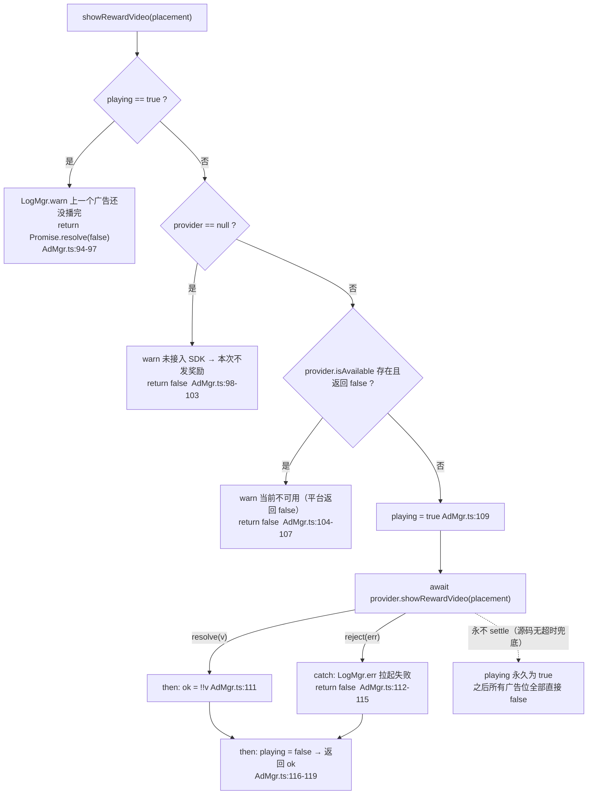

# 激励视频广告（ad）

> 源码：`assets/scripts/platform/ad/AdMgr.ts` ｜ 平台层教程第 17 章

## 1. 一句话说明 / 什么时候用

`AdMgr` 是**激励视频广告的门面（facade）+ 单例**：它把"有没有看完一条广告"收敛成一个 `Promise<boolean>`，把渠道 SDK（抖音 / 微信 / 穿山甲…）完全挡在外面 —— 具体实现由接入方通过 `AdMgr.inst.setProvider(...)` 注入，本工程不绑定任何渠道（`AdMgr.ts:3-19, 51-56, 72-75`）。

**什么时候用**：业务侧需要一个"看完广告才给奖励"的准入判断时（免费刷新、补选、复活、跳过一次冷却…）。业务只认 `true = 看完 → 发奖励`，别的一概不发。

**关键口径（三条，全部来自源码）**：

1. **未接入 SDK 一律返回 `false` → 不发奖励**（`AdMgr.ts:98-103`，`isAvailable` 同样是 `false`，`AdMgr.ts:82-87`）。
2. 这条兜底**曾经返回 `true`**，造成过"没有 SDK 也能白嫖免费刷新"的真 bug —— 文件头把教训写在注释里（`AdMgr.ts:23-27`），见 `## 8` 第 1 条。
3. **本工程目前没有任何 `setProvider` 调用点**（`AdMgr.ts:73` 只在文档注释里出现过），所以运行时 `provider === null`、`hasProvider === false`、**四个已接线的广告位全部不可用**（只会打一行 warn）。证据见 `## 10` 第 3、17 条。

## 2. 源码地图

| 成员 | 位置 | 说明 |
|---|---|---|
| `import { LogMgr }` | `AdMgr.ts:1` | **唯一的 import**，没有 `cc`（见 `## 6`） |
| 文件头注释 | `AdMgr.ts:3-34` | 门面定位、注入示例、`false` 兜底口径、**历史 bug 记录**、用法示例 |
| `type AdPlacement` | `AdMgr.ts:37-48` | 广告位标识（5 个字面量 + `| string`），注释明说**只用于埋点/统计，不参与逻辑**（第 36 行） |
| `interface IAdProvider` | `AdMgr.ts:51-56` | `isAvailable?(placement): boolean` + `showRewardVideo(placement): Promise<boolean>` |
| `class AdMgr` | `AdMgr.ts:58` | 纯 TS 类，不是 `Component` |
| `private static _ins` / `static get inst` | `AdMgr.ts:59-64` | 惰性创建：首次访问 `inst` 时 `new AdMgr()` |
| `private provider: IAdProvider \| null` | `AdMgr.ts:66` | 初值 `null` = 开发兜底态 |
| `private playing = false` | `AdMgr.ts:68` | 并发保护；注释在 67 行 |
| `private constructor()` | `AdMgr.ts:70` | 外部不能 `new AdMgr()` |
| `setProvider(provider \| null)` | `AdMgr.ts:72-75` | 注入 / 替换；传 `null` 退回兜底 |
| `get hasProvider` | `AdMgr.ts:77-80` | `!!this.provider`；**全工程无消费方**（`## 10` 第 16 条） |
| `isAvailable(placement)` | `AdMgr.ts:83-87` | `playing` → false；无 provider → false；provider 没实现 `isAvailable` → true |
| `showRewardVideo(placement)` | `AdMgr.ts:93-120` | 四条出口 + promise 链，**没有超时兜底** |

## 3. 快速上手

### 3.1 平台接入方：实现并注入一个 `IAdProvider`

⚠ **示例伪代码** —— 工程里**没有**真 SDK，`tt` 也不是本工程的依赖；下面照抄的是文件头注释里的示范写法（`AdMgr.ts:9-19`）。

```ts
// ⚠ 示例伪代码（工程内无真 SDK）
import { AdMgr } from './platform/ad/AdMgr';

export function installRewardAds(): void {
    AdMgr.inst.setProvider({
        isAvailable: () => true,                              // 省略也可（AdMgr.ts:86）
        showRewardVideo: (placement) => new Promise<boolean>((resolve) => {
            tt.createRewardedVideoAd({ adUnitId: 'xxx' })
              .onClose((res) => resolve(!!res?.isEnded))       // 中途关闭 → false
              .load().then(() => ad.show());
        }),
    });
}
```

接入方的三条义务（都是源码口径，不是我加的规矩）：① **中途关闭必须 `resolve(false)`**（`AdMgr.ts:54`）；② 任何失败路径都要落到 `resolve(false)` —— **不要 reject，更不要同步抛**（见 `## 8` 第 4 条）；③ `resolve` 的值会被 `!!ok` 强转（`AdMgr.ts:111`），**请老老实实 resolve 布尔**。

### 3.2 业务侧：只看一个布尔

```ts
// 业务侧：看完才发奖励
async function onRefreshClicked(): Promise<void> {
    const ok = await AdMgr.inst.showRewardVideo('relic_refresh');
    if (ok) {
        doRefresh();          // 只有 true 才发奖励
    }
    // false：中途关闭 / 拉不起来 / 已在播放 / 未接入 SDK —— 什么都不做
}
```

**更推荐**的写法是不要直接 `import AdMgr`，而是像三个商店功能类那样**由宿主注入 `playAd` 回调**：`game/battle/RelicShop.ts:97-101`（`playAd(placement): Promise<boolean>`）、`HeroSelect.ts:47`、`BuffShop.ts:60`；宿主实现见 `Scene_Game_Stage.ts:2365-2373`。这样功能类保持"纯 TS 无 cc、不认平台"，也让"广告期间暂停战斗"这类宿主策略有地方放。

## 4. API 速查

| API | 签名 | 语义与依据 |
|---|---|---|
| `AdMgr.inst` | `static get inst(): AdMgr` | 单例，惰性 `new`；**任何时机**可访问（`AdMgr.ts:61-64`） |
| `setProvider` | `setProvider(provider: IAdProvider \| null): void` | 注入/替换；传 `null` 退回开发兜底（`AdMgr.ts:72-75`） |
| `hasProvider` | `get hasProvider(): boolean` | 是否已接真 SDK（`AdMgr.ts:77-80`）；适合当上线自检钩子 |
| `isAvailable` | `isAvailable(placement: AdPlacement): boolean` | `playing` → `false`（84）；无 provider → `false`（85）；provider 未实现 `isAvailable` → **`true`**（86） |
| `showRewardVideo` | `showRewardVideo(placement: AdPlacement): Promise<boolean>` | `true` = 看完可发奖励；其余全部 `false`（`AdMgr.ts:89-120`） |
| `IAdProvider.isAvailable` | `isAvailable?(placement): boolean` | 可选；返回 `false` 时不要给奖励（`AdMgr.ts:52-53`） |
| `IAdProvider.showRewardVideo` | `showRewardVideo(placement): Promise<boolean>` | **`resolve(true)` 才代表看完**（`AdMgr.ts:54-55`） |
| `AdPlacement` | 字符串字面量联合 + `| string` | 5 个既有取值见下；只用于埋点（`AdMgr.ts:36-48`） |

**`AdPlacement` 的既有取值（逐个照抄，`AdMgr.ts:37-48`）**：

| 取值 | 行号 | 语义（源码注释） | 调用点 |
|---|---|---|---|
| `'relic_refresh'` | 39 | 遗物商店：金币不足时看广告免费刷新一次 | `RelicShop.ts:295` |
| `'relic_extra_pick'` | 41 | 遗物商店：本次刷新已选过一次，看广告再补选一个 | `RelicShop.ts:382` |
| `'hero_refresh'` | 43 | 选英雄：金币不足时看广告免费刷新一次候选 | `HeroSelect.ts:201` |
| `'buff_shop_refresh'` | 45 | 击杀商店（Buff 商店）：金币不足时看广告免费刷新摊位 | `BuffShop.ts:221` |
| `'pause_resume'` | 47 | 暂停界面：暂停达到时长后拉起一次 | **全工程无调用方**（`## 10` 第 15 条） |

> 第 45 行的注释写的是"金币不足"，但击杀商店的货币实际是**击杀数**（`BuffShop.ts:205-220` 读的是 `getKillPoints()`）—— 属于注释口径小偏差，不影响逻辑。

**真实调用链（唯一直接调 `AdMgr` 的地方）**：`Scene_Game_Stage.playRewardAd`（`Scene_Game_Stage.ts:2365-2373`）→ `AdMgr.inst.showRewardVideo(placement)`（2368）。三个商店功能类通过 `playAd` 依赖注入接到它：`HeroSelect`（注入 `482`）、`RelicShop`（注入 `494`）、`BuffShop`（注入 `514`）。

## 5. 生命周期与流程图

### 5.1 `showRewardVideo` 的全部分支



### 5.2 商店「金币不足 → 看广告免费刷新」的完整时序

场景：遗物商店面板，金币 < 费用，但还有「广告免费刷新」次数（`adFreeLeft > 0`）。面板按钮的判据来自 `RelicShop.refreshGate()`（`RelicShop.ts:265-267`），点击只向上 `emit(RelicRefresh)`（`ShopRelicsPanel.ts:134-136`），由宿主转交（`Scene_Game_Stage.ts:558`）。

```mermaid
sequenceDiagram
    participant U as 玩家
    participant P as ShopRelicsPanel
    participant S as RelicShop
    participant H as 宿主 Scene_Game_Stage.playRewardAd
    participant A as AdMgr
    participant SDK as 真机 IAdProvider
    U->>P: 点「看广告」按钮
    P->>S: emit(RelicRefresh) → 宿主转交 refresh()
    S->>S: refreshGate() 得 canPay=false / viaAd=true
    S->>H: deps.playAd('relic_refresh')  RelicShop.ts:295
    H->>H: wasPaused = isPaused; isPaused = true
    H->>A: AdMgr.inst.showRewardVideo('relic_refresh')
    alt 未接 SDK / 正在播放 / 平台返回不可用
        A-->>S: Promise.resolve(false) + 一条 warn
    else 正常拉起
        A->>SDK: provider.showRewardVideo(placement)
        alt 玩家看完 close(isEnded=true)
            SDK-->>A: resolve(true)
        else 玩家中途关闭（或加载/播放失败）
            SDK-->>A: resolve(false)
        end
        A-->>S: 布尔结果，且 playing 已复位
    end
    alt ok == true（看完）
        S->>S: roll(true)：adFreeUsed++ → 抽 4 格 → syncCost 更新 adFreeLeft
        S-->>P: slots / refreshCost / adFreeLeft 是 ref → 响应式重画
    else ok == false（没看完）
        S->>S: 什么都不做：不抽、不扣次数、不改费用  RelicShop.ts:295-297
        Note over P,S: 界面**没有「广告进行中」态需要恢复**：<br/>按钮仍是「看广告」可点态，格子与费用原样
    end
    H->>H: then: isPaused = wasPaused（拉起的唯一副作用复位）
```

**"界面如何恢复"的求证结论（在 `RelicShop.ts` 与对应 UI 组件里逐处看过）**：

- `RelicShop.refresh()` 的失败路径是**空实现**：`this.deps.playAd('relic_refresh').then((ok) => { if (ok) this.roll(true) })`（`RelicShop.ts:295-297`）—— 没有 `else`、没有置灰、没有提示。
- 面板侧**不存在"广告播放中"的界面态**：`ShopRelicsPanel` 只做三件事 —— 点刷新 `emit(RelicRefresh)`（134-136）、点关闭写 `panelVisible=false`（139-141）、把判据画到按钮上（121-127）。广告成功/失败**都不需要面板做恢复动作**。
- 广告次数**不会因失败而消耗**：`adFreeUsed++` 只在 `ok` 分支里执行（`RelicShop.ts:307-309`；`HeroSelect.ts:201-206`；`BuffShop.ts:221-226`）→ 失败后 `adFreeLeft` 不变，玩家可以再点一次。
- 唯一需要复位的是**宿主的暂停状态**：`playRewardAd` 在拉起前 `isPaused = true`、在 `.then` 里还原 `wasPaused`（`Scene_Game_Stage.ts:2366-2369`）。注意它是 `.then` 而不是 `.finally`/`try`，**依赖 `AdMgr` 的 Promise 一定会 settle**（见 `## 8` 第 3、4 条）。
- **失败时的用户提示：源码未见专门的界面反馈**，只有一行 `ezgame.info('[广告] <placement>：未看完，不发奖励')`（`Scene_Game_Stage.ts:2370`）。要做"广告没看完 → 飘字提示"属于**界面侧职责**，当前源码里没有这样的代码。

## 6. 与 Cocos 生命周期的关系

**`AdMgr` 与 Cocos 生命周期完全无关** —— 已核对源码：

- 它的**唯一 import** 是 `LogMgr`（`AdMgr.ts:1`），没有 `from 'cc'`；`LogMgr` 自身也没有任何 import，只用 `window.console`（`LogMgr.ts:1-14, 29`）。所以 `AdMgr` 是**纯 TS 类**，不是 `Component`（`AdMgr.ts:58`）。
- 没有节点、没有 `onLoad/onEnable/onDisable/onDestroy`、**不需要挂在场景上**；实例由 `static get inst` 惰性 `new` 出来（`AdMgr.ts:61-64`），第一次访问就存在。
- `provider` 与 `playing` 是**进程级**字段（`AdMgr.ts:66, 68`），不会随场景切换重置 —— 换场景**不会**清掉 provider（这是好事），但也意味着"上一次广告卡住"的状态会跨场景带走（见 `## 8` 第 3 条）。

**为什么它适合做门面**：

1. **调用方只关心一个布尔**（`AdMgr.ts:5-6`），渠道差异（回调式 / Promise 式 / 事件式 SDK）被 `IAdProvider` 收在一层（`AdMgr.ts:51-56`）；
2. **依赖方向正确**：`AdMgr` 不认识业务，业务通过 `setProvider` 反向注入（`AdMgr.ts:72-75`）→ 换渠道不动一行业务代码；
3. **任何时机可访问**：不像 `TimeMgr` 那样受 `onLoad` 门闸限制（对比第 16 章第 8 节第 1 条），所以在任何场景脚本（含"加载配表之前"的启动阶段）里都能 `setProvider`；
4. **兜底语义明确且安全**：默认"没有广告就没有奖励"（`AdMgr.ts:21-27, 98-103`），坏情况下最差是功能不可用，而不是白送资源。

## 7. 典型组合用法

**组合 A：三个商店的 `playAd` 依赖注入（工程现状）**
功能类声明 `playAd(placement): Promise<boolean>`（`RelicShop.ts:101` / `HeroSelect.ts:47` / `BuffShop.ts:60`），宿主在 `onLoad` 里注入 `(placement) => this.playRewardAd(placement)`（`Scene_Game_Stage.ts:482, 494, 514`）。**推荐继续沿用这条**：功能类保持纯 TS，只有宿主这一处认识 `AdMgr`。

**组合 B：广告期间的暂停策略（宿主职责）**
广告是**覆盖全屏的原生层**，所以宿主在拉起前把本局置暂停、回来再还原（`Scene_Game_Stage.ts:2355-2373` 的注释把原因写明了："不暂停的话玩家回来会发现自己已经被怪打死了"）。`isPaused` 会直接让场景帧更新 `return`（`Scene_Game_Stage.ts:1104-1109`）。

**组合 C：刷新按钮的「看广告」表现**
`RefreshGate.viaAd = !canPay && adFreeLeft > 0`（`RefreshGate.ts:39-43`）→ 面板据此把按钮文案改成「看广告」（`RefreshButtonView.ts:154`）并换图标（`AD_ICON_PATH = 'textures/common/ad'`，`RefreshButtonView.ts:33`）。⚠ 这条链路**完全没看 `AdMgr.isAvailable`**（见 `## 8` 第 9 条）。

**组合 D：`ezgame.ad` 快捷门面**
`ezgame.ad` 直接转发 `AdMgr.inst`（`ezgame.ts:15-18`），用于"不 import platform 层"的 UI 代码。**目前全工程无消费方**（`## 10` 第 17 条）。

**组合 E：上线自检**
真机启动流程里断言 `AdMgr.inst.hasProvider === true`，否则打 error / 上报（`AdMgr.ts:77-80` 的注释就是这么定位它的）。这是把"忘记注入 SDK"从"玩家白点没反应"变成"启动即发现"的最低成本手段。

## 8. 注意事项与坑

1. **【真 bug 复盘】没有 SDK 时"静默白送"**
   *现象*：遗物商店"金币不足 → 看广告免费刷新"，在没有 SDK 的环境里点一下就直接刷新了，玩家根本没看到广告。
   *原因*：开发兜底**曾经返回 `true`**（注释原文："这条兜底曾经返回 true（'编辑器里也能把广告流程跑通'）"，`AdMgr.ts:23-27`）。
   *正确做法*：兜底必须是 `false` + `warn`（`AdMgr.ts:98-103`），调用方按 `false` 正常拒绝本次操作，界面上的广告图标与置灰判据按同一语义画（`AdMgr.ts:25-27`）。**任何时候都不要为了"编辑器里跑通"把兜底改成 `true`** —— 那等于给所有广告位开后门。

2. **并发拉起**
   *现象*：连点两次刷新 / 两个广告位同时触发，广告被拉起两次。
   *原因*：`playing` 是唯一闸门（`AdMgr.ts:68`），第二次调用在 `AdMgr.ts:94-97` 直接 `resolve(false)` 并 warn。
   *正确做法*：让所有广告都走 `AdMgr`（别绕过它直接 `provider`）；`false` 要当成"这次没看成"处理，不要重试拉起。
   ⚠ 顺带一条：`isAvailable` **也吃 `playing`**（`AdMgr.ts:84`）→ 如果界面用 `isAvailable` 画置灰，广告播放期间按钮会瞬间变灰，别把它当成"平台不可用"来记。

3. **Promise 永不 resolve → `playing` 永久卡死**
   *现象*：某次广告之后，**所有**广告位都失效（`showRewardVideo` 与 `isAvailable` 全部 `false`），且再也恢复不了；同时本局战斗**永久冻结**。
   *原因*：**源码没有超时兜底** —— `AdMgr.ts:109-119` 只是 `playing = true` 后串了 `.then/.catch/.then`，全文**没有 `setTimeout`、没有 `Promise.race`**；provider 的 Promise 只要不 settle，最后那个复位 `playing = false`（第 117 行）永远不执行。而宿主的 `isPaused = true`（`Scene_Game_Stage.ts:2367`）也等不到 `.then`（2368-2369）→ 场景帧更新被 `isPaused` 挡住（1104-1109），**战斗冻结**。
   *正确做法*：接入方必须在 provider 内部保证**任何路径都会 settle**（含超时、用户长时间不操作、SDK 回调丢失）；若要在门面层兜，得自己加超时把 `playing` 复位（当前源码没有，属于需要新增的能力）。

4. **provider 同步抛错 → `playing` 也卡死**
   *现象*：同上，但只有一次报错、没有日志说"上一个广告还没播完"。
   *原因*：`playing = true` 在 `AdMgr.ts:109`，紧接着第 110 行就去调 `provider.showRewardVideo(...)`。`.catch`（112-115）只能兜 **rejected promise**，**兜不住同步 throw** —— 同步抛错会让 `showRewardVideo` 整体抛出，`playing` 永远停在 `true`；宿主 `playRewardAd` 那侧同样没有 try/catch（`Scene_Game_Stage.ts:2365-2373`），`isPaused` 也停在 `true`。
   *正确做法*：provider 内部把一切异常转成 `resolve(false)`（`try { ... } catch { resolve(false) }`），**绝不在 `showRewardVideo` 里同步抛**。

5. **`ok` 是 `!!ok`，非布尔真值会被当成"看完"**
   *现象*：SDK 返回 `1` / `'true'` / `{}` 也算看完，直接发奖励。
   *原因*：`AdMgr.ts:111` 是 `.then((ok) => !!ok)`。
   *正确做法*：provider 一律 `resolve(true|false)`；别 `resolve(res)` 把 SDK 的原始对象透出来。

6. **`catch` 之后仍会复位 `playing`（这是对的），但别在业务侧重复这套**
   *现象*：有人看到 `.catch` 里已经 `return false`，以为不会再复位。
   *原因/做法*：复位发生在链条最末的 `.then`（`AdMgr.ts:116-119`），`catch` 的返回值会流过去，所以拉取失败也能解锁。业务侧**不要**自己再维护一个"广告中"标志（那会和 `playing` 形成两套真相）。

7. **广告位字符串：命名只影响埋点，但类型不封闭**
   *现象*：`showRewardVideo('relic_refrsh')` 拼错也能编译通过。
   *原因*：`AdPlacement` 末尾有 `| string`（`AdMgr.ts:48`），等于接受任意字符串；而它**只用于埋点/统计，不参与逻辑**（`AdMgr.ts:36`）→ 拼错不会报错，只会让统计里多出一条脏数据。
   *正确做法*：新增广告位统一往 `AdMgr.ts:37-48` 加字面量并写清场景，调用处只写字面量（别用变量拼）。

8. **真机上线前必须注入**
   *现象*：功能"看起来在，但点了没反应"。
   *原因*：全工程 `setProvider` **零调用点**（`## 10` 第 3 条）→ `provider === null` → 每个广告位都 `false` + 一行 warn。**warn 会被日志开关吞掉**（`## 9`），很容易被忽略。
   *正确做法*：启动流程里调一次 `setProvider`，并用 `hasProvider` 做自检（`AdMgr.ts:77-80`）；`'pause_resume'` 这个已定义却没人用的广告位（`AdMgr.ts:47`）要么接线、要么删掉，别留在类型里当"已支持"。

9. **「看广告」按钮在未接 SDK 时仍然可点**
   *现象*：没有 SDK 的环境里，金币不足时按钮显示「看广告」且可点，点下去只多一行日志。
   *原因*：按钮判据 `viaAd = !canPay && adFreeLeft > 0`（`RefreshGate.ts:39-43`）**只看广告剩余次数，不看 `AdMgr.isAvailable`**；`applyRefreshButton` 据此把文案/图标换成「看广告」（`RefreshButtonView.ts:144, 154, 33`）。全工程除 `AdMgr` 自身外没有 `isAvailable` 的消费方。
   *正确做法*：若要让按钮如实反映"广告不可用"，判据里要并入 `AdMgr.isAvailable(placement)`（注意它会被 `playing` 影响，见第 2 条）—— 当前源码没有这层接线，属于已知缺口。

10. **`setProvider(null)` 可以退回兜底；替换是无声的**
    *现象*：后注入的 provider 直接覆盖先注入的，没有警告、没有"只允许注入一次"的保护。
    *原因*：`setProvider` 就是一句赋值（`AdMgr.ts:73-75`）。
    *正确做法*：注入点收敛到**一处**（启动流程）；调试用的假 provider 用完记得 `setProvider(null)` 或删掉。

## 9. 调试手段

- **一眼看有没有接 SDK**：`AdMgr.inst.hasProvider`（`AdMgr.ts:78`）。为 `false` 时所有广告位必然 `false`，不用再往下查。
- **按广告位自检**：`AdMgr.inst.isAvailable('relic_refresh')`（`AdMgr.ts:83-87`）。它同时反映"是否正在播放"（`playing`）。
- **grep 日志前缀 `[广告]`**：四种出口各有一句，可直接定位走了哪条分支 —— 正在播放（`AdMgr.ts:95`）、未接 SDK（101）、平台返回不可用（105）、拉起失败（113）；另外宿主在没看完时还有一句 `未看完，不发奖励`（`Scene_Game_Stage.ts:2370`）。
- **别用"没日志"判断"没走到"**：未接 SDK 那句走的是 `LogMgr.warn`，它受 `logOpen` 与日志等级控制（`LogMgr.ts:53-60`），`ezgame.setLogOpen(false)`（`ezgame.ts:42-44`）会把它吞掉。而 `LogMgr.err` **无条件输出**（`LogMgr.ts:68-70`）→ "拉起失败"总能看见，"未接入 SDK"可能看不见。
- **编辑器里跑通界面流程（有风险，务必记着撤）**：
  ```ts
  // ⚠ 仅编辑器调试：这个假 provider 会让所有广告位直接"看完"
  AdMgr.inst.setProvider({ showRewardVideo: () => Promise.resolve(true) });
  ```
  这正是历史上出过 bug 的那个"白送"形态（`AdMgr.ts:23-27`），**不要**把它留进任何会被构建的分支。
- **排查"卡死"**：如果所有广告位都返回 `false` 且日志里持续出现"上一个广告还没播完"，就是 `playing` 卡住了（`## 8` 第 3、4 条）—— 顺带检查本局是否还停着（`battleStore.isPaused`），因为宿主的暂停复位也挂在同一条 Promise 上。

## 10. 事实依据

1. `AdMgr` 的唯一 import 是 `LogMgr`，**没有 `cc` 依赖** → 纯 TS，不是 `Component`：`AdMgr.ts:1, 58`；`LogMgr` 自身也无 import（`LogMgr.ts:1-14`）。
2. 单例实现：静态 `_ins` 惰性创建 + 私有构造：`AdMgr.ts:59-64, 70`。
3. `setProvider` **全工程零调用点**（只有 `AdMgr.ts:7, 11` 与 `Scene_Game_Stage.ts:2361` 的**注释**提到它）→ 运行时 `provider === null`。
4. `hasProvider` 的语义与实现：`AdMgr.ts:77-80`。
5. `isAvailable` 的三段判据（`playing` / 无 provider / provider 未实现 `isAvailable` 时返回 `true`）：`AdMgr.ts:83-87`。
6. `showRewardVideo` 的四条出口：正在播放（94-97）、未接 SDK（98-103）、平台不可用（104-107）、正常拉起（109-119）。
7. **未接 SDK 返回 `false` → 不发奖励**，且用 warn 而不是静默：`AdMgr.ts:98-103`、口径说明 `AdMgr.ts:21-27`。
8. 历史 bug 原文（兜底曾经返回 true → 遗物商店"金币不足也能免费刷新"变成静默白送）：`AdMgr.ts:23-27`；同类提醒也写在消费侧 `Scene_Game_Stage.ts:2361-2363`。
9. 并发保护 `playing`：字段 `AdMgr.ts:68`，判据 `94-97`；**`isAvailable` 也吃 `playing`**：`AdMgr.ts:84`。
10. promise 链 `then(!!ok) → catch(return false) → then(playing=false; return ok)`：`AdMgr.ts:110-119` —— **`catch` 之后仍会复位**（复位在最末的 `then`，第 116-119 行）。
11. **没有超时兜底**：`AdMgr.ts:93-120` 全文无 `setTimeout` / `Promise.race`（文件共 121 行）→ provider 的 Promise 不 settle 时 `playing` 永久为 `true`。
12. `playing = true` 与调用 provider 相邻，`.catch` 兜不住**同步抛错**：`AdMgr.ts:109-110`（`catch` 在 112-115）。
13. `AdPlacement` 的 5 个既有取值与行号：`relic_refresh`(39) / `relic_extra_pick`(41) / `hero_refresh`(43) / `buff_shop_refresh`(45) / `pause_resume`(47)，并带 `| string` 兜底(48)；注释明确"只用于埋点/统计，不参与逻辑"(36)。
14. 四个真实调用点及场景：`RelicShop.ts:295`（`'relic_refresh'`，金币不足免费刷新，准入判据在 265-267、viaAd 分支 291-294）、`RelicShop.ts:382`（`'relic_extra_pick'`，已选过后的广告补选，次数检查 378-381）、`HeroSelect.ts:201`（`'hero_refresh'`，选英雄免费刷新，成功才 `adFreeUsed++` 203-205）、`BuffShop.ts:221`（`'buff_shop_refresh'`，击杀数不足免费刷新摊位，223-225）。
15. 唯一直接调 `AdMgr` 的地方是宿主包装：`Scene_Game_Stage.ts:2365-2373`（`AdMgr.inst.showRewardVideo` 在 2368）；`playAd` 注入点 482 / 494 / 514；`'pause_resume'` 无调用方。
16. `hasProvider` 与 `ezgame.ad`（`ezgame.ts:15-18`）在全工程**都没有消费方**（除定义处）。
17. 宿主暂停策略：拉起前 `isPaused = true`、`.then` 里还原 `wasPaused`，未看完只 `ezgame.info`：`Scene_Game_Stage.ts:2366-2371`；`isPaused` 会让场景帧更新直接 return：`Scene_Game_Stage.ts:1104-1109`。
18. 未看完时业务侧**什么都不做**：`RelicShop.ts:295-297`；广告次数只在成功时消耗：`RelicShop.ts:307-309`、`HeroSelect.ts:201-206`、`BuffShop.ts:221-226`。
19. 界面表现只看 `RefreshGate.viaAd`，**不看 `AdMgr.isAvailable`**：`RefreshGate.ts:39-43`、`RefreshButtonView.ts:141-155`（文案「看广告」在 154）、广告图标 `AD_ICON_PATH = 'textures/common/ad'`（`RefreshButtonView.ts:33`）。
20. `LogMgr.warn` 受 `logOpen`/等级控制（`LogMgr.ts:53-60`），`LogMgr.err` 无条件输出（`LogMgr.ts:68-70`）→ 未接 SDK 的 warn 可能被日志开关吞掉：`ezgame.ts:42-44`。
21. 面板侧无"广告进行中"界面态：`ShopRelicsPanel.ts:121-141`（点刷新只 `emit`，点关闭只写 `panelVisible`，按钮判据来自门面）——**源码未见**任何广告失败的界面提示，属界面侧职责。
22. **"静默白送"这次修复在工作区尚未提交**：`git diff HEAD -- assets/scripts/platform/ad/AdMgr.ts` 显示 HEAD 版本里是 `LogMgr.warn(…开发兜底按「看完」处理); return Promise.resolve(true);`，且 `isAvailable` 里是 `if (!this.provider) return true;` —— 也就是说 `## 8` 第 1 条的历史 bug **在提交历史里真实存在过**，本文档描述的是当前工作区（已修复）的版本。
