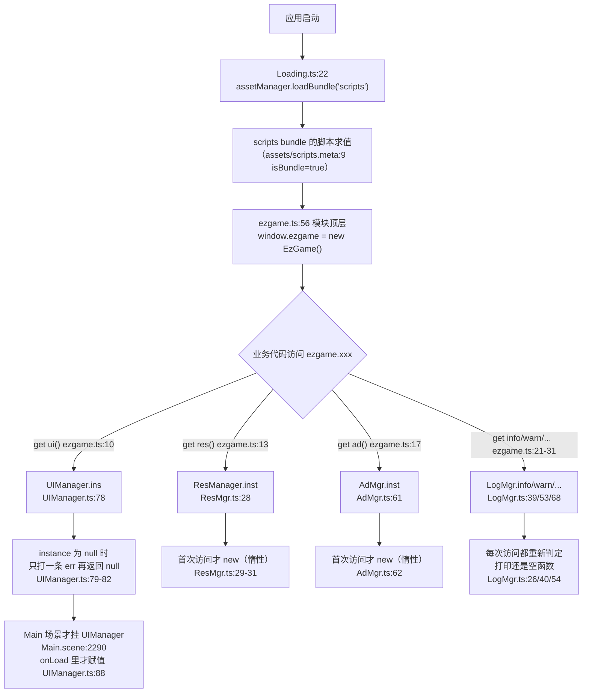
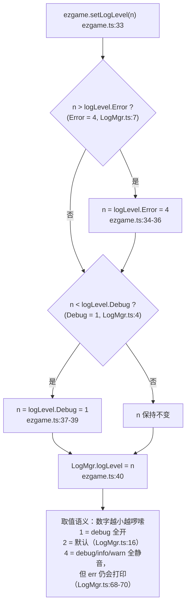

# 杂项工具与全局门面（utils · ScreenAdapter · GameDataMgr · ezgame）

> 源码：`assets/scripts/platform/` ｜ 平台层教程第 18 章
> 相关：`docs/platform-guide/06-fsm.md`（同套写法）、`docs/UI框架使用说明.md`（`ezgame.ui` 背后的 UIManager 全貌）、`docs/agent-notes/工具与工作流.md`
> ⚠ **现状先说**：这一章的 5 个小东西**成熟度差得很远** —— `ezgame` 是全工程重度使用的门面（89 处命中 / 20 个业务文件），`RandomUtil` 有 2 个调用方，`TypeUtil` 只有 1 个函数被用，而 `ScreenAdapter` / `GameDataMgr` / `IManager` **全工程零引用**（§2 表格给了逐项 grep 结论）。所以本章既是"怎么用"，也是"哪些别用、哪些别往里加东西"。

---

## 1. 一句话说明 / 什么时候用

| 小东西 | 一句话 | 什么时候用 |
|---|---|---|
| `utils/TypeUtil.ts` | 5 个类型小工具：判构造函数、取构造名、对象转 `Map`、`JSON` 的 `replacer`/`reviver`（专治 `Map` 序列化） | 只有 `isConstructor` 在框架里被用（`UIManager` 判断"传进来的是类还是实例"）；`replacer`/`reviver` 是"要往 `localStorage` 存 `Map`"时的正解 —— **目前还没人用** |
| `utils/RandomUtil.ts` | `getRandomElements(arr, count)`：Fisher-Yates 洗牌后取前 `count` 个，**返回新数组、不改原数组** | 从池子里"抽 N 个不重复项"（选英雄候选、Buff 摊位） |
| `ScreenAdpater.ts` | 一个 `Component`：在 `start()` 里按"可见尺寸 / 设计分辨率"给自己的节点 `setScale` + `setPosition` | **本项目不要用**（零引用）。它代表的是"手写适配"这条已被 `Canvas` + `Widget` 取代的老路，见 §8-3 |
| `GameDataMgr.ts` | **9 行空壳**：类里只有两行注释"配置数据 / 游戏数据"，零成员、零方法 | **不要用，也不要往里堆逻辑**。数据层的真身是 `game/data/` 的 `DataCenter` + `DataModule`（见 §8-8） |
| `IManager.ts` | 4 行：一个**没有 `export`** 的 `interface IManager { init(); }` | **没有实际约束力**：无导出、无人 `import`、无人 `implements`。当作文档残片看 |
| `ezgame.ts` | 全局门面：模块顶层 `window.ezgame = new EzGame()`，暴露 `ui` / `res` / `ad` / `debug` / `info` / `warn` / `error` / `setLogLevel` / `setLogOpen`，**全是惰性 getter** | 实际只用到 3 个日志函数 + 1 处 `ezgame.res`（见 §2 与 §4.4 的逐成员计数）；**`ezgame.ui` / `ezgame.ad` / `ezgame.debug` / `setLogLevel` / `setLogOpen` 目前 0 调用点** |

`ezgame` 存在的意义只有一个：**把 4 个单例（UIManager / ResManager / AdMgr / LogMgr）收成 4 个短名字**，业务里写 `ezgame.warn(...)` 而不是 `import { LogMgr } from '...'`（`ezgame.ts:9-31`）。

---

## 2. 源码地图

| 文件 | 导出 | 用途 | 是否被工程使用（全 `assets/` grep，排除自身） |
|---|---|---|---|
| `platform/utils/TypeUtil.ts` | `isConstructor` / `getConstructorName` / `convertToMap` / `replacer` / `reviver`（`:1` `:5` `:9` `:19` `:30`） | 类型判定 + `Map` 序列化 | **5 个里只有 `isConstructor` 被用**：`platform/ui/UIManager.ts:12` import、`:244` 调用（判断 `closeUI(view)` 收到的是类还是实例）。另外 4 个**全工程 0 引用** |
| `platform/utils/RandomUtil.ts` | `class RandomUtil` → `static getRandomElements`（`:1` `:2`） | 抽 N 个不重复项 | **被用（2 处调用方）**：`game/battle/HeroSelect.ts:3` import → `:164` 抽英雄候选；`game/battle/BuffShop.ts:3` import → `:238` 抽 Buff 摊位 |
| `platform/ScreenAdpater.ts` | `ScreenAdapter extends Component`（`:5` `:6`） | 手写屏幕适配 | **零引用**：全 `assets/`（含 `*.scene` / `*.prefab`）只有自身 3 处命中（`:1` 注释、`:5` `@ccclass`、`:6` 类声明），**没有任何场景/预制件挂它** |
| `platform/GameDataMgr.ts` | `class GameDataMgr`（`:5`，空类） | 注释写的"数据中心 / 单例" | **零引用**：全工程仅定义行 `GameDataMgr.ts:5` 命中 |
| `platform/IManager.ts` | `interface IManager`（`:1`，**无 `export`**） | 注释意图：给管理器定 `init()` 契约 | **零引用**：全工程仅定义行 `IManager.ts:1` 命中；无 `import`、无 `implements`、无 `export` |
| `platform/ezgame.ts` | `class EzGame`（未导出，`:8`）+ 全局 `window.ezgame`（`:56`） | 全局门面 | **重度使用**：grep `ezgame` 命中 **89 处**（含自身 3 处），落在 **20 个业务文件**里。⚠ 但**没有任何文件 `import` 它**（见 §6）。逐成员计数：`warn` 43 / `error` 23 / `info` 17 / `res` 3（其中 2 处是注释）/ **`ui` 0 / `ad` 0 / `debug` 0 / `setLogLevel` 0 / `setLogOpen` 0** |

一句话读法：**这一章真正在跑的只有 `ezgame` 的日志三件套（+ 1 处 `ezgame.res`）和 `RandomUtil`，半个 `TypeUtil`；另外三个是"在位但没接线"的骨架/残片，`ezgame.ad` / `ezgame.ui` 也还没有调用方。**

---

## 3. 快速上手

### 3.1 用 `ezgame.res` 加载一张图

```ts
import { Sprite } from 'cc';

/** 教学示例：`loadSpriteFrame` 目前工程里 0 调用，但它是 `ezgame.res` 最典型的用法（ResMgr.ts:671） */
async function loadIcon(sprite: Sprite, path: string): Promise<void> {
    const frame = await ezgame.res.loadSpriteFrame(path);
    if (!frame) {
        ezgame.warn(`[图标] 没取到：${path}`);   // → LogMgr.warn（LogMgr.ts:53）
        return;
    }
    sprite.spriteFrame = frame;
}
```

```ts
// 工程里唯一真实存在的 ezgame.res 调用（ShopRelicsItem.ts:279）：远程 URL 才走它
ezgame.res.loadRemoteFrame(path).then(apply).catch((err) => ezgame.error('[遗物面板] 远程图标加载失败：' + path, err));
```

### 3.2 用 `ezgame.ui.showUI` 开界面

```ts
// db:// 绝对路径导入是工程既有写法（View_TaskUI.ts:2-5）
import { View_TaskUI } from 'db://assets/scripts/game/ui/views/task/View_TaskUI';

// showUI 收的是**视图类**（不是实例），返回 Promise<T>（UIManager.ts:125-129）
const view = await ezgame.ui.showUI(View_TaskUI);
// 场景层会顺带关掉并缓存其它非场景层 UI（UIManager.ts:148-153）
await ezgame.ui.showUI(Scene_Game_Stage);
```

### 3.3 用 `ezgame.debug` / `setLogLevel` 打日志

```ts
ezgame.debug('每帧级别', dt);      // 默认被 LogMgr.logLevel(=Info) 挡掉（LogMgr.ts:16, 26）
ezgame.info('一般信息');            // 默认可见（LogMgr.ts:40）
ezgame.warn('可疑但不致命');        // 默认可见（LogMgr.ts:54）
ezgame.error('契约不完整 / 加载失败', err);  // 永远打印（LogMgr.ts:68-70）

ezgame.setLogLevel(1);             // 1 = Debug 全开（ezgame.ts:33-41，下限钳到 1）
ezgame.setLogOpen(false);          // 静音 debug/info/warn —— ⚠ 静音不了 error（§8-2）
```

### 3.4 用 `RandomUtil` 抽 N 个不重复项

```ts
import { RandomUtil } from 'db://assets/scripts/platform/utils/RandomUtil';

const pool = [1001, 1002, 1003, 1004, 1005];
const picked = RandomUtil.getRandomElements(pool, 3);  // 新数组，长度 3，pool 不变（RandomUtil.ts:4, 13）
console.log(pool.length, picked.length);               // 5 3  ← 原数组没被动过

// count 大于池子大小时：返回**整份洗牌副本**（长度 = pool.length），不补 undefined（RandomUtil.ts:13）
const all = RandomUtil.getRandomElements(pool, 99);    // 长度 5
```

### 3.5 用 `TypeUtil` 序列化带 `Map` 的对象

```ts
import { replacer, reviver } from 'db://assets/scripts/platform/utils/TypeUtil';

const save = { level: 3, cleared: new Map<string, boolean>([['1-1', true]]) };
const raw  = JSON.stringify(save, replacer);   // Map → {dataType:'Map', value:[[k,v],...]}（TypeUtil.ts:19-28）
const back = JSON.parse(raw, reviver);         // 还原成真 Map（TypeUtil.ts:30-37）
console.log(back.cleared instanceof Map, back.cleared.get('1-1'));  // true true

// ⚠ 对照：StorageUtil 走的是裸 JSON.stringify/parse（StorageUtil.ts:32 / :20）
//   直接存上面的 save，cleared 会变成 {}，读回来是普通对象而不是 Map
```

---

## 4. API 速查

### 4.1 `TypeUtil`（`platform/utils/TypeUtil.ts`，全文 37 行）

| 函数 | 签名 | 行为（源码） | 注意 |
|---|---|---|---|
| `isConstructor` | `(obj: any) => boolean` | `typeof obj === 'function' && 'prototype' in obj`（`:1-3`） | 类 / 普通 function → true；**箭头函数没有 `prototype` → false**。`UIManager.closeUI` 用它区分"传类"和"传实例"（`UIManager.ts:244-249`） |
| `getConstructorName` | `(obj: any) => string` | `Object.getPrototypeOf(obj).constructor.name`（`:5-7`） | `null` / `undefined` / `Object.create(null)` 会抛 `TypeError`（`:6` 无判空）—— 调用前自己判空 |
| `convertToMap` | `(obj) => Map` | 非对象或 `null` **原样返回**；否则 `for...in` 逐键 `map.set(key, obj[key])`（`:9-17`） | **浅拷贝**（嵌套对象仍是普通对象）；**键一律变字符串**；`for...in` 会带上原型链上的可枚举属性 |
| `replacer` | `(key, value) => any` — 给 `JSON.stringify` 的第 2 参 | `value instanceof Map` → `{ dataType:'Map', value: Array.from(value.entries()) }`，否则原样返回（`:19-28`） | 这是 MDN 上那套 `Map` 序列化写法的原样搬运；`Array.from(entries())` 让键值对变数组才能进 JSON（`:23`） |
| `reviver` | `(key, value) => any` — 给 `JSON.parse` 的第 2 参 | `typeof value === 'object' && value !== null && value.dataType === 'Map'` → `new Map(value.value)`（`:30-37`） | **必须和 `replacer` 成对使用**；见 §8-6 / §8-7 的两个坑（忘记传 / `dataType` 撞名） |

### 4.2 `RandomUtil.getRandomElements`

```ts
static getRandomElements(arr: any[], count = 1): any[]   // RandomUtil.ts:2
```

| 步骤 | 源码 | 说明 |
|---|---|---|
| ① 复制 | `const shuffled = [...arr]`（`:4`） | **不改原数组**，注释原话"复制原数组，避免修改原数组"（`:3`） |
| ② 洗牌 | `for (let i = len-1; i > 0; i--)` + `j = Math.floor(Math.random()*(i+1))` + 交换（`:7-10`） | 标准 **Fisher-Yates**（原地、均匀） |
| ③ 取前 N | `return shuffled.slice(0, count)`（`:13`） | 返回**新数组**；顺序是随机的，但元素是原对象引用（浅拷贝） |

**边界（`slice` 语义，`:13`）**：

| 传入 `count` | 返回 |
|---|---|
| `3`（≤ 长度） | 3 个不重复元素 |
| `99`（> 长度） | **整份洗牌副本**，长度 = `arr.length`（不补 `undefined`，不抛错） |
| 不传（默认 `1`，`:2`） | 1 个元素的数组（**不是元素本身**） |
| `0` | `[]` |
| 负数（如 `-1`） | ⚠ `slice(0, -1)` = **去掉最后一个后的全部元素**，不是空数组也不是报错 `[推断·JS 语义]` |

### 4.3 `ScreenAdapter`（`platform/ScreenAdpater.ts`，全文 33 行）

`@ccclass('ScreenAdapter') export class ScreenAdapter extends Component`（`:5-6`）。**只有 `start()` 一个方法**（`:9-32`）：

| 行 | 做了什么 |
|---|---|
| `:10` | `console.log("scene:" + director.getScene().name + " nodeName:" + this.node.name + "  uuid" + this.node.uuid)` —— **裸 `console.log`**，不是 `LogMgr`（§8-4） |
| `:13-15` | `const screenSize = view.getVisibleSize()` → 注释写着"获取屏幕实际分辨率"（`// 获取屏幕实际分辨率`，`:12`），**但这不是物理分辨率**（§8-5） |
| `:18` | `const design = view.getDesignResolutionSize()` —— 本项目 = 750×1334（`settings/v2/packages/project.json:4-8`） |
| `:21-23` | `scaleX = screenWidth/design.width`、`scaleY = screenHeight/design.height`、`scale = Math.min(scaleX, scaleY)`（"取较小的比例，确保内容完整显示"） |
| `:26` | **`this.node.setScale(scale, scale)`** —— 改的是**挂本组件的那个节点**（脚本里只有 `this.node`，没有别的节点引用） |
| `:29-31` | `offsetX = (screenWidth - design.width*scale)/2`、`offsetY` 同理，然后 **`this.node.setPosition(offsetX, offsetY)`**（只传两参 → z 归 0） |

**副作用清单**：
1. 它是 `Component`，**必须有人把脚本挂到节点上才会执行** —— 而全工程没有任何场景/预制件挂它（§2），所以**这套代码当前一次都不会跑**。
2. 一旦挂上，它会**无条件覆盖自己节点的 scale 和 position**。如果那个节点是 Canvas 的子节点（或自己就是 Canvas），就和引擎的自动适配**对着干**：`Widget` 默认 `AlignMode.ON_WINDOW_RESIZE`（[引擎] `cocos/ui/widget.ts:790`），`widget-manager` 监听 `design-resolution-changed` / `canvas-resize`（[引擎] `cocos/ui/widget-manager.ts:294`、`:297`）后把节点标脏并**重新 `setPosition`**（[引擎] `widget-manager.ts:200`）→ 窗口一变，`ScreenAdapter` 算出来的位移就被盖掉。
3. `:2` 的 `import { ... Widget }` **全文再没出现过**（`:2` 是唯一命中）—— 说明作者原本想让 `Widget` 参与适配，最后没写。
4. 它**没有监听任何 view/screen 事件**：整个文件只有 `:2` 的 import 和 `:9-32` 的 `start`（全工程 grep `view.on(` / `canvas-resize` 在 `assets/scripts` 里 **0 命中**）→ **resize / 分辨率变化时它不会再跑**（§6）。

### 4.4 `ezgame` 的每个 getter / setter（`platform/ezgame.ts`，全文 56 行）

| 成员 | 行 | 返回 / 行为 | 单例是否惰性 |
|---|---|---|---|
| `get ui()` | `:9-11` | `UIManager.ins` | **不是**惰性构造 —— `ins` 是 `Component` 实例，只在 `onLoad` 里赋值（`UIManager.ts:87-89`），**就绪前返回 `null`**（`UIManager.ts:78-83`） |
| `get res()` | `:12-14` | `ResManager.inst` | **是**：首次访问 `new ResManager()`（`ResMgr.ts:28-33`） |
| `get ad()` | `:16-18` | `AdMgr.inst`（注释：平台无关，未接 SDK 走兜底） | **是**：首次访问 `new AdMgr()`（`AdMgr.ts:61-64`） |
| `get debug()` | `:20-22` | `LogMgr.debug`（一个**函数**） | 每次访问都**重新判定**要不要打印：`!logOpen \|\| logLevel>Debug` → `nullLog`，否则 `console.log.bind(...)`（`LogMgr.ts:25-31`） |
| `get info()` | `:23-25` | `LogMgr.info` | 同上，门槛 `logLevel>Info`（`LogMgr.ts:39-45`） |
| `get warn()` | `:26-28` | `LogMgr.warn` | 同上，门槛 `logLevel>Warning`（`LogMgr.ts:53-60`） |
| `get error()` | `:29-31` | `LogMgr.err` | ⚠ **无任何门槛**（`LogMgr.ts:68-70`）：不看 `logOpen`，也不看 `logLevel`，**永远打印** |
| `setLogLevel(n)` | `:33-41` | 先把 `n` 钳到 `[1, 4]`，再 `LogMgr.logLevel = n` | `logLevel` 枚举 `Debug=1 / Info=2 / Warning=3 / Error=4`（`LogMgr.ts:3-8`）。语义是"**数字越小越啰嗦**"：`1` = 全开，`4` = 只剩 err。默认 `Info=2`（`LogMgr.ts:16`） |
| `setLogOpen(b)` | `:42-44` | `LogMgr.logOpen = b` | 一票否决 `debug/info/warn`（`LogMgr.ts:26/40/54` 都判了 `logOpen`），**管不了 err** |
| （全局声明） | `:48-53` | `declare global { interface Window { ezgame: EzGame } const ezgame: EzGame }` | **纯类型声明**：运行时靠 `window.ezgame`，所以**不需要也不应该 `import` 它**（§8-1） |
| （赋值） | `:56` | `window.ezgame = new EzGame()` | 模块顶层，**模块求值即完成**（§5 图①、§6） |

**真实调用点计数**（`assets/scripts` grep `ezgame\.(info|warn|error|debug|res|ui|ad|setLogLevel|setLogOpen)` = 86 处，其中 3 处在注释里 → **真实调用 83 处**）：

| 成员 | 命中 | 真实调用 | 说明 |
|---|---|---|---|
| `ezgame.warn` | 43 | 43 | 工程里最常用的门面成员（"契约不完整 / 静默降级"类告警） |
| `ezgame.error` | 23 | 23 | 只用给"必须留痕"的失败（其中 `Cmp_Achievement.ts:166/177` 是 `ezgame.error(msg)` 转发现成字符串） |
| `ezgame.info` | 17 | 16 | 比 `warn` 少得多；`AtlasIcon.ts:15` 那处是注释 |
| `ezgame.res` | 3 | **1** | 唯一真实调用 = `ShopRelicsItem.ts:279` 的 `ezgame.res.loadRemoteFrame(path)`；另 2 处是注释（`AtlasIcon.ts:32`、`ShopRelicsItem.ts:255`）。注意 `ezgame.res` 的其它方法（如 `loadSpriteFrame`）**目前 0 调用** |
| `ezgame.ui` / `ezgame.ad` / `ezgame.debug` / `setLogLevel` / `setLogOpen` | **0** | **0** | 门面里有、但业务代码一处都没用。广告走 `AdMgr.inst.showRewardVideo`（`Scene_Game_Stage.ts:2368`），界面走 `UIManager.ins.showUI`（`Scene_Menu.ts:73`、`Main.ts:32`）—— **同一个单例的两种写法** |

---

## 5. 生命周期与流程图

### 图① `window.ezgame` 的创建时机 + "全是惰性 getter"



要点：`EzGame` **自己不持有任何单例字段**（`ezgame.ts:8-45` 里没有任何属性声明），所以"门面创建"和"单例创建"是**两件事**；`new EzGame()` 极廉价，真正的取用发生在每一次 `ezgame.xxx`（这也是为什么 `ezgame.ui` 可能是 `null` 而 `ezgame.res` 永远不是）。

### 图② `ezgame.setLogLevel(n)` 的钳制逻辑



两个顺序细节：钳制是**先查上限再查下限**，所以 `n = 99` → 先变 4，再判 `4 < 1` 为假 → 停在 4；`n = 0` → 上限不触发，下限触发 → 变 1。**非整数不会被取整**（`n = 2.5` 就真的存 2.5 → `warn`(3) 被挡、`info`(2) 放行）`[推断]`。

---

## 6. 与 Cocos 生命周期的关系

| 小东西 | 与 Cocos 生命周期的关系 |
|---|---|
| `ezgame` | **模块顶层直接赋值**（`ezgame.ts:56`），不是 `Component`、没有 `onLoad`。它随 `scripts` bundle 的**脚本求值**诞生（`assets/scripts.meta:9` 里 `isBundle: true`；`Loading.ts:22` 加载该 bundle，`:16` 才 `director.loadScene('Main')`）→ **早于任何场景脚本的 `onLoad`/`start`**，也早于 `Main.ts:18`。⚠ 全工程**没有任何文件 `import` ezgame.ts**（grep `from '...ezgame'` / `require` **0 命中**），它能跑到靠的是"bundle 内脚本统一求值 + `declare global const ezgame`（`:52`）在运行时落到 `window.ezgame`"，这一机制细节 `[推断]`。 |
| `UIManager`（`ezgame.ui` 的背后） | 是 `Component`，**挂在 Main 场景**（`Main.scene:2290` 的 `__type__` = `UIManager.ts.meta:5` 的 uuid 压缩形式），`instance` 在 `onLoad` 里赋值（`UIManager.ts:88`）。→ **Loading 场景期间 `ezgame.ui === null`**。 |
| `ScreenAdapter` | 是 `Component`，逻辑**只在 `start()` 里跑一次**（`ScreenAdpater.ts:9`）。源码里**没有** `view.on(...)` / `screen.on(...)` / `director.on(...)`（`:2` 只 import 了 `_decorator, Component, director, view, Widget`），全工程 `assets/scripts` grep `view.on(`、`canvas-resize` 也是 0 命中 → **窗口 resize / 分辨率变化时它不会再跑**，一次算完就定死。 |
| 引擎侧的自动适配（对照组） | 引擎的 `widget-manager` **会**监听 `design-resolution-changed`（[引擎] `cocos/ui/widget-manager.ts:294`）与 `canvas-resize`（`:297`），收到就 `_nodesOrderDirty = true`（`:302`）→ 下一帧重排并 `setPosition`（`:200`）。这正是"手写适配"会打架的原因。 |
| `TypeUtil` / `RandomUtil` / `GameDataMgr` / `IManager` | **纯 TS**：没有 `Component`、没有 `@ccclass`、没有生命周期回调。`TypeUtil` 是 5 个顶层 `function`（`:1` `:5` `:9` `:19` `:30`），`RandomUtil` 是纯静态类（`:1-2`），`GameDataMgr` 是空类（`:5-8`），`IManager` 是接口（`:1-3`）。唯一沾 Cocos 的是 `ScreenAdapter`（`@ccclass` + `extends Component`，`:5-6`）。 |

---

## 7. 典型组合用法

### 7.1 图标降级链：`ezgame.res` + `ezgame.info/warn` 报路（工程里的既有套路）

`game/common/AtlasIcon.ts` 把"图集 → 直取帧 → 旧碎图/远程帧"的三步降级抽成共享实现，并把**命中哪条路**打进日志：

```ts
// AtlasIcon.ts:149 / :156 / :196 的真实形态
ezgame.warn(`${AtlasIcon.LOG_TAG} 图集没取到：${base}（改走直取帧 / 旧碎图路径）`);
ezgame.info(`${AtlasIcon.LOG_TAG} 图集已加载：${path}（${atlas.getSpriteFrames().length} 帧）`);
ezgame.info(`${AtlasIcon.LOG_TAG} 图标命中路径：${kind}（${how}）｜首个帧名：${key}`);
```

`AtlasIcon.ts:15` 的注释点明了这套日志的定位：**"那是唯一能观察到真实路径表的办法"** —— 图标加载是"静默降级"的重灾区，`ezgame.info` 在这里是**可观测性**而不是噪声。

### 7.2 广告 + 日志：只在"看完"时发奖励

```ts
// Scene_Game_Stage.ts:2365-2373 的真实形态 —— 全工程唯一的广告入口
private playRewardAd(placement: AdPlacement): Promise<boolean> {
    const wasPaused = this.battleStore.isPaused;
    this.battleStore.isPaused = true;                       // 播广告期间先暂停战斗
    return AdMgr.inst.showRewardVideo(placement).then((ok) => {   // ← 走的是 AdMgr.inst，不是 ezgame.ad
        this.battleStore.isPaused = wasPaused;
        if (!ok) ezgame.info(`[广告] ${placement}：未看完，不发奖励`);
        return ok;                                          // 只有 true 才发奖励
    });
}
```

门面写法等价（`ezgame.ad` 就是 `AdMgr.inst`，`ezgame.ts:17` → `AdMgr.ts:61-64`），只是**工程里目前没人这么写**（`ezgame.ad` 0 调用点）。未接 SDK 时 `AdMgr` 内部直接 `resolve(false)`（`AdMgr.ts:98-102`）—— 没有广告就没有奖励。

### 7.3 抽候选：`RandomUtil` + 池子

```ts
// HeroSelect.ts:164 的真实形态
this.candidates.value = RandomUtil.getRandomElements(pool, this.candidateCount());
// BuffShop.ts:238 同款（只抽 id，再按 id 取配置）
const ids = RandomUtil.getRandomElements(pool.map((c) => c.id), count);
```

### 7.4 存档里的 `Map`：`TypeUtil.replacer/reviver`（⚠ 目前需要自己接）

`StorageUtil` 走的是**裸** `JSON.stringify` / `JSON.parse`（`StorageUtil.ts:32` / `:20`），所以：

| 想存的东西 | 直接丢给 `StorageUtil` | 正解 |
|---|---|---|
| 普通对象 / 数组 | ✅ 正常 | — |
| `Map` / `Set` | ❌ 变成 `{}`（`Map` 没有 `toJSON`）`[推断·JS 语义]` | 把 `Map` 摊平成 `[key, value][]` 之类**可 JSON 化**的结构再存；若要保留 `Map` 类型，序列化侧必须用 `JSON.stringify(v, replacer)` + `JSON.parse(s, reviver)`（`TypeUtil.ts:19-37`），而 `StorageUtil` 目前**没有**暴露传 `replacer` 的口子 |
| `DataModule` 的 `reactive` 数据 | ✅（工程现状，全是普通对象/数组） | — |

---

## 8. 注意事项与坑

> 格式：**现象 → 原因（带 `文件:行号`）→ 正确做法**。标 `[推断]` 的是从代码/引擎源码直接推导、但没在运行时实测过的结论。

| # | 现象 | 原因 | 正确做法 |
|---|---|---|---|
| 1 | 在 Loading 场景里调 `ezgame.ui.showUI(...)` → 控制台一条 `UIManager 还未初始化就进行获取！`，紧接着 `TypeError: Cannot read properties of null` | `get ui()` 返回 `UIManager.ins`（`ezgame.ts:10`），而 `ins` 在 `instance` 为空时**只打一条错日志然后返回 `null`**（`UIManager.ts:78-83`）；`instance` 要等 `onLoad` 才赋值（`UIManager.ts:88`），而 UIManager 挂在 **Main 场景**（`Main.scene:2290`）→ Loading 场景期间它必然是 `null` | 开界面的代码只在 Main 之后跑（工程现状：`Main.ts:32`、`Scene_Menu.ts:73/138`）；真要早调，先判 `if (!ezgame.ui) return;` |
| 2 | `ezgame.setLogOpen(false)` 之后，`ezgame.error(...)` 还在刷屏 | `get error()` 直通 `LogMgr.err`（`ezgame.ts:30`），而 `LogMgr.err` 的 getter **没有任何 `logOpen` / `logLevel` 判定**（`LogMgr.ts:68-70`），和 `debug/info/warn`（`:26` `:40` `:54` 都判了）不一样 | 想静音就**别用 `ezgame.error`** 装高频噪声（工程里它专门留给"契约不完整 / 加载失败"这类必须留痕的：`Cmp_Difficulty.ts:183`、`ShopBuffItem.ts:99`、`HeroItem.ts:100`）; 需要临时降噪时，只能改代码或重定向 `console.log` |
| 3 | 给根节点/Canvas 子节点挂 `ScreenAdapter` 后，**旋转屏幕或拉窗口**，界面位置跳回原位（或缩放被吃掉） | `ScreenAdapter` 只在 `start()` 改一次 `this.node` 的 scale/position（`ScreenAdpater.ts:26`、`:29-31`），且**没有监听任何 resize 事件**（`:2` 的 import 里没有用到 `view` 的事件，全工程 `view.on(` 0 命中）；而引擎 `Widget` 默认 `ON_WINDOW_RESIZE`（[引擎] `widget.ts:790`），`widget-manager` 监听 `design-resolution-changed`/`canvas-resize`（[引擎] `widget-manager.ts:294`、`:297`）后重排并 `setPosition`（[引擎] `:200`）→ 两个来源抢同一个节点的 position | **别用手写适配**。用 `Canvas`（引擎按 `designResolution` + 策略自动缩放整个画布）+ `Widget`（声明式对齐）。本项目 `settings/v2/packages/project.json:4-8` 已配好 750×1334 / `fitWidth: true` |
| 4 | `ScreenAdapter` 一进场景就打印一行 `scene:xxx nodeName:yyy uuidzzz`，`ezgame.setLogOpen(false)` 关不掉 | 用的是**裸 `console.log`**（`ScreenAdpater.ts:10`），不是 `LogMgr` —— 任何 `LogMgr` 的开关都管不到它 | 首行的调试打印改成 `LogMgr.debug(...)`（或直接删）；这也解释了"关了日志还有输出"：工程里**裸 `console.*` 有一百多处**（grep `console.(log\|error\|warn)` 在 `assets/scripts` 命中 **189** 处，含注释），只有走 `LogMgr` 的输出才是可关的 |
| 5 | `ScreenAdapter` 里"屏幕实际分辨率"算出来的缩放**看起来不对**（常见现象：`scale` 恒等 1、`setScale` 等于没调用） | `view.getVisibleSize()` **不是物理分辨率**，它返回 `_visibleRect`（[引擎] `cocos/ui/view.ts:345-347`），而 `_visibleRect = 视口 / 缩放`（[引擎] `:471-472`）→ **单位是设计分辨率下的点**。本项目 `fitWidth: true`（`project.json:8`）对应 FIXED_WIDTH 策略，其 `scale = 窗口宽/设计宽`（[引擎] `:926-936`）→ `visibleWidth ≡ 750`，于是 `scaleX = 750/750 = 1`，`Math.min(1, scaleY)` 在"屏幕比设计更高的机型"上恒为 1 → `setScale(1)` 是空操作 `[推断]`；只有"比 16:9 更方"的屏幕（如 4:3 平板）才会真的缩 | 要物理/CSS 像素用 `screen.windowSize`（[引擎] `view.ts:301-303`）或 `view.getVisibleSizeInPixel()`（`:353-358`）；要"设计分辨率下的可见尺寸"才用 `getVisibleSize()`（工程里的正确用例：`UIManager.ts:487`、`HitScreenLayer.ts:540`、`Bullet_1.ts:12`、`GuideMgr.ts:52-53`）。**顺手把 `ScreenAdpater.ts:12` 那句注释改对**（现在注释与代码不符） |
| 6 | `JSON.parse(str)` 读回来的"Map"是普通对象 `{...}`，`map.get(...)` 报 `is not a function` | 只传了 `replacer` 忘了 `reviver`（或反之）：`replacer` 只是把 `Map` 摊成 `{dataType:'Map', value:[...]}` 让 JSON 能装下（`TypeUtil.ts:21-24`），**只有 `reviver` 会把它变回 `Map`**（`:32-33`）；少一半就是"摊平了但没折回来"。另外 `StorageUtil` 两个都用不上（`StorageUtil.ts:20`、`:32`） | 两个一起传：`JSON.parse(JSON.stringify(v, replacer), reviver)`；存进 `StorageUtil` 的对象**不要**含 `Map`/`Set`（它没给你插 `replacer` 的口子） |
| 7 | `reviver` 把一个**普通对象**也变成了 `Map`（或抛 `TypeError`） | `reviver` 只看形状：`value.dataType === 'Map'` 就 `new Map(value.value)`（`TypeUtil.ts:31-33`），**不做类型校验**。所以任何业务对象只要恰好长成 `{dataType:'Map', ...}` 就会被误转 —— `value` 缺失时得到空 `Map`，`value` 不是可迭代对象（如 `5`）时抛 `TypeError: Iterator method is not callable` `[推断·JS 语义]` | 用 `reviver` 的场景里，业务字段别叫 `dataType`；或者自己写一个只认自家 tag（如 `__t: 'map'`）的读写器 |
| 8 | 想给"数据中心"加个字段，于是往 `GameDataMgr` 里写 | 它是**空壳**：`GameDataMgr.ts:1-9` 全文只有类声明 + 两行注释（"配置数据" / "游戏数据"），零成员，**全工程零引用**（grep 只有 `:5` 定义行）。往里加东西等于新建一个**没人用的平行数据层** | 局外数据走 `game/data/` 的 `DataCenter`（单例）+ `DataModule`（`reactive` + 自动 `localStorage`，见 `AGENTS.md` 的 Architecture 段）；配表走 `TbRoot.ins.getTbContainer(...)`；局内状态走 `game/stores/`。`GameDataMgr` 保持空壳，或直接删除 |
| 9 | 以为 `interface IManager` 能约束"管理器必须实现 `init()`" | 它**没有 `export`**（`IManager.ts:1`），全工程无 `import`、无 `implements`（grep 只有 `:1` 定义行）；`init()` 连返回类型都没写（`:2`） | 它只是残片，**没有约束力**。要真约束：`export interface IManager { init(): void \| Promise<void> }`，然后让管理器 `implements IManager`。工程现状是各管理器各写各的 `init()`（`ResMgr.ts:53`、`Main.ts:26` 的调用链） |
| 10 | `await ezgame.res.loadSpriteFrame(path)` 在某些路径下**永远不返回**（`await` 挂住、后续逻辑不执行） | `ResManager.loadSpriteFrame` 手写 `new Promise`，只在 `loadBundleRes(...).then(...)` 里 `resolve`（`ResMgr.ts:671-688`），**没有 `catch`、也没有 reject** → 底层加载失败时这个 Promise 既不 resolve 也不 reject `[推断]` | 图标加载一律当"可能不回来"处理：要么用 `ezgame.res.loadBundleRes(path, type)` 自己 `try/catch`（`ResMgr.ts:175`），要么在调用侧加超时/直接走 `AtlasIcon` 那套带降级与日志的共享实现 |
| 11 | 日志时间戳看着不对（月份少 1、日期位置像"星期几"） | `LogMgr.getDateString()` 用的是 `d.getMonth()`（**0 基**，`LogMgr.ts:81`）和 `d.getDay()`（**星期几 0~6**，`:83`）—— 后者本该是 `getDate()` | 所有 `ezgame.debug/info/warn/error` 的 `[时间]` 前缀都**不可信**，排查时序问题别依赖它（修的话改 `LogMgr.ts:83` 为 `getDate()`、`:81` `getMonth()+1`） |
| 12 | 两个业务文件都对同一个名字取了"本地变量缓存"，一处改了另一处没变（或缓存的界面管理器已失效） | 门面**不持有状态**（`ezgame.ts:8-45` 无属性字段），每次 `ezgame.ui` / `ezgame.res` 都是**现取单例**；把结果缓存到模块级变量（`const ui = ezgame.ui`）就绕开了这个设计。`UIManager` 是挂在 Main 场景上的 `Component`（`Main.scene:2290`）、**没有 `addPersistRootNode`**（全工程只有 `AudioMgr.ts:36` 用了持久化节点）→ 一旦 `director.loadScene` 就会销毁重建（本项目 `loadScene` 只出现在 `Loading.ts:16` 与 `SceneMgr.ts:105`，后者全工程无调用方）`[推断]` | 要用就直接 `ezgame.xxx.method()` 连写；`ezgame.res` / `ezgame.ad` 惰性构造，缓存它们**恰好不出错**，但 `ezgame.ui` 缓存会拿到过期组件 —— 统一别缓存最省心 |
| 13 | 写了个 `import { ezgame } from '../platform/ezgame'`，编译报"模块没有导出的成员" | `ezgame.ts` **什么都没导出**：`class EzGame` 前面没有 `export`（`:8`），对外只靠 `declare global`（`:48-53`）声明一个**全局 const `ezgame`**（`:52`）和一个 `Window.ezgame` 字段（`:50`） | 全局直接写 `ezgame.xxx`（20 个文件的写法，如 `AtlasIcon.ts:149`）；**不要 import**。类型靠全局声明即可（想在别处写类型标注就用 `typeof ezgame` —— `EzGame` 这个**类型名本身也没导出**） |

---

## 9. 调试手段

| 想干什么 | 怎么做 | 依据 |
|---|---|---|
| 看门面到底有没有被创建 | 浏览器 Console 敲 `window.ezgame`（应有值）/ 敲 `ezgame.ui`（Loading 场景里是 `null`） | `ezgame.ts:56`、`UIManager.ts:78-83` |
| 打开最啰嗦的日志 | `ezgame.setLogLevel(1)`（= `logLevel.Debug`）⚠ 工程代码里 **0 调用点**，只能在浏览器 Console 里手动敲 | `ezgame.ts:33-41`、`LogMgr.ts:3-8`（调用点 grep：`setLogLevel` 只命中 `ezgame.ts:33` 定义处） |
| 只看错误 | `ezgame.setLogLevel(4)`（= `Error`；注意 `err` 本来就无条件打印） | `LogMgr.ts:68-70` |
| 一键静音（留一个例外） | `ezgame.setLogOpen(false)` —— `debug/info/warn` 全静音，`error` 仍会打印；`ScreenAdapter` 的裸 `console.log` 也拦不住。⚠ 同样 **0 代码调用点** | `LogMgr.ts:26/40/54` vs `:68`；`ScreenAdpater.ts:10` |
| 观察"图标到底走了哪条路" | 看 `[图标]` 开头的 `ezgame.info/warn` 日志（图集已加载 / 图标命中路径 / 图集没取到） | `AtlasIcon.ts:149`、`:156`、`:196`；注释 `:15` 明确说这是唯一手段 |
| 看某个图集/图集里有什么帧 | `ezgame.res.iconAtlasMap`（public `Map<string, SpriteAtlas>`）、`ezgame.res.getAtlasByName(name)` | `ResMgr.ts:802`、`:815` |
| 判断广告能不能发奖励 | `ezgame.ad.hasProvider`（`false` = 没接 SDK，`showRewardVideo` 必定 `false`） | `AdMgr.ts:78-80`、`:98-102` |
| 判断"这个界面现在开着吗" | `ezgame.ui.layers` 是 private，改看 `ezgame.ui.node.children` 或直接看控制台里 `showUI` / `closeUI` 的日志 | `UIManager.ts:58`（`layers` 为 private）、`:115`（`onLoad` 完成日志） |
| 排查"某段代码到底跑没跑" | 临时加 `ezgame.info('[标记]...')` —— 比 `console.log` 好在可被 `setLogOpen` 统一开关；**但别用 `ezgame.error`**（关不掉） | `LogMgr.ts:26/40/54/68` |
| 排查屏幕适配 | 不要靠 `ScreenAdapter` 的那行日志（只在 `start` 打一次，`:9-10`）。用引擎的 `view.getVisibleSize()`（设计单位）/ `view.getVisibleSizeInPixel()`（像素）/ `screen.windowSize` 自己打 | [引擎] `view.ts:345-347`、`:353-358`、`:301-303` |

---

## 10. 事实依据

**平台层源码（本工程）**

1. `assets/scripts/platform/ezgame.ts:56` — `window.ezgame = new EzGame();`（模块顶层赋值）；`:48-53` 的 `declare global`（`Window.ezgame` + 全局 `const ezgame`）；`:8` 的 `class EzGame` **无 `export`**；`:9-11` `get ui()` → `UIManager.ins`；`:12-14` `get res()` → `ResManager.inst`；`:16-18` `get ad()` → `AdMgr.inst`；`:20-31` `debug/info/warn/error` → `LogMgr.debug/info/warn/err`；`:33-41` `setLogLevel` 的两段钳制（`if(level>logLevel.Error) level=logLevel.Error;` / `if(level<logLevel.Debug) level=logLevel.Debug;`）；`:42-44` `setLogOpen`。
2. `assets/scripts/platform/utils/TypeUtil.ts:1-3`（`isConstructor`：`typeof obj === 'function' && 'prototype' in obj`）、`:5-7`（`getConstructorName`：`Object.getPrototypeOf(obj).constructor.name`）、`:9-17`（`convertToMap`：非对象/`null` 原样返回 + `for...in` + `map.set`）、`:19-28`（`replacer`：`value instanceof Map` → `{dataType:'Map', value: Array.from(value.entries())}`）、`:30-37`（`reviver`：`value.dataType === 'Map'` → `new Map(value.value)`）。
3. `assets/scripts/platform/utils/RandomUtil.ts:2`（签名 `static getRandomElements(arr: any[], count = 1)`）、`:4`（`const shuffled = [...arr]`，注释"复制原数组，避免修改原数组"）、`:7-10`（Fisher-Yates 循环）、`:13`（`return shuffled.slice(0, count)`）。
4. `assets/scripts/platform/ScreenAdpater.ts:1`（注释里写 `ScreenAdapter.ts` —— 文件名 `ScreenAdpater.ts` 是拼错的）、`:2`（import 了 `Widget` 但**全文只用这一次**）、`:5-6`（`@ccclass('ScreenAdapter')` / `extends Component`）、`:9`（唯一的 `start()`）、`:10`（裸 `console.log`，输出 scene / nodeName / uuid）、`:12`（注释"获取屏幕实际分辨率"）、`:13`（`view.getVisibleSize()`）、`:18`（`view.getDesignResolutionSize()`）、`:21-23`（`scaleX/scaleY` + `Math.min`）、`:26`（`this.node.setScale(scale, scale)`）、`:29-31`（`offsetX/offsetY` + `this.node.setPosition(offsetX, offsetY)`）。全文**无** `view.on` / `screen.on` / `director.on`。
5. `assets/scripts/platform/GameDataMgr.ts:1-9` — 全文：JSDoc"数据中心 / 单例" + `export class GameDataMgr{` 内**只有两行注释**（`//配置数据` / `//游戏数据`），零成员。
6. `assets/scripts/platform/IManager.ts:1-3` — `interface IManager{ init(); }`，**无 `export`**、`init()` 无返回类型。
7. `assets/scripts/platform/log/LogMgr.ts:3-8`（`logLevel` 枚举 `Debug=1 / Info=2 / Warning=3 / Error=4`）、`:16-17`（默认 `logLevel = logLevel.Info`、`logOpen = true`）、`:26`（debug 门槛）、`:40`（info 门槛）、`:54`（warn 门槛）、`:68-70`（`err` **无门槛**、无 `logOpen` 判定）、`:73-75`（`nullLog`）、`:81`（`getMonth()` 0 基）、`:83`（`getDay()` = 星期几）。
8. `assets/scripts/platform/ui/UIManager.ts:12`（`import { isConstructor } from "../utils/TypeUtil"`）、`:37`（`private static instance: UIManager = null`）、`:78-83`（`ins`：`instance` 为空时 `LogMgr.err("UIManager 还未初始化就进行获取！")` 后**仍返回 `instance`**）、`:87-89`（`onLoad` 里才 `UIManager.instance = this`）、`:125-129`（`showUI<T extends BaseView>(viewType: new(...args)=>T, afterShowCb?, ...args)` → `Promise<T>`）、`:244-249`（`isConstructor(view)` 分流"类 / 实例"）。
9. `assets/scripts/platform/resources/ResMgr.ts:28-33`（`inst` 惰性 `new`）、`:175`（`loadBundleRes`）、`:671-688`（`loadSpriteFrame`：手写 Promise，只 `then` 内 `resolve`，无 `catch`）、`:695`（`loadRemoteFrame`）、`:802`（`public iconAtlasMap`）、`:815`（`getAtlasByName`）。
10. `assets/scripts/platform/ad/AdMgr.ts:37-48`（`AdPlacement` 的 5 个真实广告位）、`:61-64`（`inst` 惰性 `new`）、`:78-80`（`hasProvider`）、`:83-87`（`isAvailable`：无 provider → false）、`:93-118`（`showRewardVideo`：播放中/无 provider/平台不可用 → `resolve(false)`）。

**工程使用情况（grep 结论，均已排除定义文件自身）**

11. `TypeUtil` 只被 `UIManager.ts:12` / `:244` 引用；`getConstructorName` / `convertToMap` / `replacer` / `reviver` 全 `assets/` **0 引用**。
12. `RandomUtil` 的 2 个调用方：`game/battle/HeroSelect.ts:3` → `:164`；`game/battle/BuffShop.ts:3` → `:238`。
13. `ScreenAdapter` / `GameDataMgr` / `IManager` 在全 `assets/`（含 `*.scene`、`*.prefab`）**只命中各自的定义行**（`ScreenAdpater.ts:1/5/6`、`GameDataMgr.ts:5`、`IManager.ts:1`）→ 三个都没接线。
14. `ezgame` 共 89 处命中（含 `ezgame.ts` 自身 3 处），落在 20 个业务文件；其中 `ezgame.<成员>` **86 处**（3 处在注释里 → 真实调用 83 处）。**逐成员计数（PowerShell `Select-String -AllMatches` 全量统计）**：`warn` 43、`error` 23、`info` 17、`res` 3（真实调用只有 `ShopRelicsItem.ts:279` 一处，另 2 处是注释 `AtlasIcon.ts:32` / `ShopRelicsItem.ts:255`）、**`ui` 0、`ad` 0、`debug` 0、`setLogLevel` 0、`setLogOpen` 0**。示例真实调用点（文件:行）：
    - `game/common/AtlasIcon.ts:149`（`ezgame.warn` 图集没取到）、`:156`、`:196`（注释在 `:15`）
    - `game/ui/scenes/scene_menu/Scene_Menu.ts:136`（`ezgame.info` 开战日志）、`:111`、`:134`、`:166`、`:179`
    - `game/ui/scenes/scene_game_stage/Scene_Game_Stage.ts:1120`（`ezgame.warn` 兜底结束）、`:542`、`:1188`、`:1745`、`:1775`、`:2370`、`:2411`
    - `game/ui/scenes/scene_menu/cmps/Cmp_Difficulty.ts:183`（`ezgame.error` 找不到格子模板）、`:151`、`:199`
    - `game/ui/scenes/scene_game_stage/cmps/shop_item/ShopRelicsItem.ts:279`（`ezgame.res.loadRemoteFrame`，**全工程唯一的 `ezgame.res` 调用**）、`:280`、`:292`
    - `game/ui/scenes/scene_game_stage/cmps/skill_slot/SkillSlot.ts:182`、`:127`、`:306`、`:370`、`:371`
    - `game/ui/views/task/View_TaskUI.ts:118`、`:122`
    - `game/ui/scenes/scene_game_stage/cmps/View_Game_Stage.ts:255`、`:260`、`:292`（三处都是"没注入到 XX 门面"的告警）
    - 对照：广告走 `AdMgr.inst.showRewardVideo`（`Scene_Game_Stage.ts:2368`）、界面走 `UIManager.ins.showUI`（`Main.ts:32`、`Scene_Menu.ts:73/138`）→ **门面成员 0 调用，业务用的是同一个单例的直连写法**。
15. `game/data/StorageUtil.ts:20`（裸 `JSON.parse(raw)`）、`:32`（裸 `JSON.stringify(value)`）—— 没有 `replacer`/`reviver` 的口子。
15b. 裸日志口子的规模：`assets/scripts` grep `console.(log|error|warn)` 命中 **189** 处（含注释与 `LogMgr.ts:29/43/57/69` 自己的 `window.console.log.bind`）→ "关日志"只能关走 `LogMgr` 的那部分。
15c. 场景切换面：全工程 `director.loadScene` 只有 `game/scene/Loading.ts:16`（→ Main）与 `platform/scene/SceneMgr.ts:105`；`SceneMgr` 全工程只有自身 5 处命中（`:6` `:7` `:9` `:19` `:21`）→ **无调用方**。持久化节点只有 `platform/audio/AudioMgr.ts:36`（`director.addPersistRootNode`）→ **UIManager 所在节点不持久**；而 Loading 场景里没有任何 `ezgame.ui` 调用。
16. `assets/scripts.meta:9`（`"isBundle": true`）→ `scripts` 是自定义 bundle；`game/scene/Loading.ts:22`（`assetManager.loadBundle("scripts", ...)`）→ `:16` 之后才 `director.loadScene("Main")`；`game/scene/Main.ts:18`（`onLoad` 里 `_init()`）。
17. `assets/scenes/Main.scene:2290` 的组件 `__type__` = `fc130PcLhVK6L4Zz5OIewvY`，它是 `platform/ui/UIManager.ts.meta:5` 的 uuid `fc1303dc-2e15-4ae8-be19-cf93887b0bd8` 的压缩形式，且 `:2299-2316` 挂了 `layerScenes/layerViews/layerPopups/layerDialogs/layerTips/layerTop` 六个层级节点 → **UIManager 挂在 Main 场景**。
18. `settings/v2/packages/project.json:4-8` — `designResolution { width: 750, height: 1334, fitHeight: false, fitWidth: true }`。
19. `game/ui/views/task/View_TaskUI.ts:2-5` 用 `db://assets/scripts/...` 绝对路径 import（本章示例沿用该写法）；`:35-39` `@uiview({prefabPath, layer, single})`。

**引擎源码（Cocos Creator 3.8.6，安装于 `C:\ProgramData\cocos\editors\Creator\3.8.6\resources\resources\3d\engine\`）**

20. `cocos/ui/view.ts:345-347`（`getVisibleSize()` 返回 `_visibleRect` 的宽高）、`:353-358`（`getVisibleSizeInPixel()` = `_visibleRect × scale`）、`:301-303`（`getCanvasSize()` = `screen.windowSize`）、`:316-322`（`getFrameSize()` = CSS 像素，已 deprecated）、`:471-472`（`vb.width = rv.width / this._scaleX` → **`_visibleRect` 是设计单位**）、`:926-936`（`FixedWidth.apply`：`scale = 容器宽 / 设计宽`，viewport = 全窗口）、`:989`（`ResolutionPolicy.FIXED_WIDTH = 4`）。
21. `cocos/ui/widget.ts:790`（`_alignMode = AlignMode.ON_WINDOW_RESIZE` 默认值）、`:132/:138/:147`（`AlignMode` 三个取值）、`:813-814`（`updateAlignment()` → `_widgetManager.updateAlignment(this.node)`）。
22. `cocos/ui/widget-manager.ts:294`（`View.instance.on('design-resolution-changed', this.onResized, this)`）、`:297`（`View.instance.on('canvas-resize', ...)`）、`:302`（`this._nodesOrderDirty = true`）、`:200`（`node.setPosition(x, y, _tempPos.z)`）。

---

### 附：本章的"不确定清单"

- §5 图①里"bundle 内脚本统一求值"这一步是 `[推断]`：`window.ezgame` 需要 `ezgame.ts` 的**模块顶层**被执行（`ezgame.ts:56`），但全工程**没有人 `import` 它**（grep 0 命中），所以只能由 bundle 的脚本求值机制触发；`assets/scripts.meta:9` 的 `isBundle: true` 与 `Loading.ts:22` 的加载顺序是两个旁证。
- §8-5 里"`fitWidth: true` 对应 `FIXED_WIDTH` 策略、进而 `scale ≡ 1`"是 `[推断]`：`project.json` 里**只有 `fitWidth/fitHeight` 两个布尔**，没有写 `policy`；`policy` 的具体数是构建期由编辑器算出来的（引擎读取处：[引擎] `view.ts:122-127` 的 `designResolution.policy`）。**引擎侧"`getVisibleSize()` 是设计单位"这一条是实锤**（`view.ts:471-472`），不依赖该推断。
- §4.2 里 `count` 为负数 / §4.1 里 `getConstructorName(null)` 抛错 / §8-7 里 `new Map(5)` 抛错，都是 JS 标准语义的推导（`[推断·JS 语义]`），未在本工程运行时实测。
- `ScreenAdapter` 是"作者留下的没用上的适配方案"这一定性来自"零引用 + `Widget` 死 import（`ScreenAdpater.ts:2`）"两条证据，**没有找到任何提交说明/文档解释它为什么被弃用**。
- §2 / §4.4 / §9 里的"逐成员调用点计数"（`warn` 43 / `error` 23 / `info` 17 / `res` 1，其余 0）是**当前工作区快照**下的 grep 结果（含 3 处注释命中已单独扣除）；代码一改数字就会变，结论"`ezgame.ui`/`ad`/`debug`/两个 log 开关目前无人用"请以跑一次 grep 为准。
