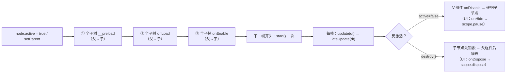

# 集合防御 · 平台层使用教程（`assets/scripts/platform/`）

> **19 章 · 62 张 mermaid 图 · 全部结论带 `文件:行号`**
> 覆盖 `assets/scripts/platform/` 下的每一个模块：它解决什么问题、API 怎么用、**生命周期怎么流转**、什么时候会踩坑、当前工程里到底有没有在用它。
> 这是「现状说明书 + 判据手册」，不是路线图 —— 每一条都能回到源码或引擎源码核实。

---

## 1. 怎么用这套教程

### 1.1 三种读法

| 你是 | 建议路径 |
|---|---|
| **刚接手这个项目** | `00-lifecycle` → `01-reactivity` → `02-store` → `03-ui-core` → `10-excel-table`（这五章覆盖了 90% 的日常改动） |
| **要做一个新功能** | 先看 `00-lifecycle` §5 的**接线现状总表**（确认该用哪层），再跳到对应章节的 §3 快速上手 + §5 流程图 |
| **遇到"改了没效果"** | 直接看 §4 的**接线现状总表**与 §5 的**重要发现**，多半是"这个模块压根没被接线"或"这条路径本来就坏" |

### 1.2 每章统一的 10 节骨架

```
## 1. 一句话说明 / 什么时候用      ## 6. 与 Cocos 生命周期的关系
## 2. 源码地图（表格：文件→职责→导出）  ## 7. 典型组合用法
## 3. 快速上手（可编译示例）        ## 8. 注意事项与坑（现象→原因→做法）
## 4. API 速查（签名→参数→返回→备注） ## 9. 调试手段
## 5. 生命周期与流程图（mermaid）    ## 10. 事实依据（文件:行号 清单）
```
第 00 章是唯一的例外：它是**生命周期总纲**，专门回答"引擎三阶段激活 / 框架钩子挂在哪 / 每个平台模块什么时候创建与销毁"。

### 1.3 事实口径（怎么判断一条结论可不可信）

| 标记 | 含义 |
|---|---|
| `文件:行号` | 直接来自本仓库源码，**行号会随改动漂移**，引用前请以内容为准 |
| `引擎源码 …` | 来自本机 Cocos 安装目录：`C:\ProgramData\cocos\editors\Creator\3.8.6\resources\resources\3d\engine\cocos\`（TS 源码）与 `…\engine\bin\.declarations\cc.d.ts`（API 声明） |
| `[推断]` | 静态推演/合理怀疑，**没有实跑验证**。这类结论在每章 §8/§10 都会显式标出 |
| "全工程 grep 0 命中" | 排查"某能力到底有没有在用"的标准手段，本章各章都给了可复跑的命令 |

---

### 1.4 网页版（图全部是静态 SVG）

```powershell
node tools/docs-web/build.mjs      # → docs/platform-guide/web/（20 页 + 63 张 .svg）
node tools/docs-web/serve.mjs 8799 # 或直接双击 web/index.html（零 JS、可离线）
```

- 左侧是章节导航、每页有页内目录与上/下一章；**每张 mermaid 图都渲染成静态 SVG**，并在页面上内联显示（可单独下载 `.svg`）。
- 图表总览页 `web/diagrams.html` 一页看全 63 张图，点标题可跳到所在章节。
- `web/` 是**生成物**，不要手改；改 `.md` 后重跑构建。构建器与支持范围见 `tools/docs-web/README.md`。

---

## 2. 章节索引

| 章 | 主题 | 源码 | 图 | 一句话结论 |
|---|---|---|---|---|
| [`00-lifecycle`](00-lifecycle.md) | **生命周期总纲** | 引擎 + 全 platform | 5 | 引擎激活是**三阶段批量调用**（`__preload` → `onLoad` → `onEnable`，父先于子）；平台层一半模块是"纯 TS 手动挡"，没有自动清理 |
| [`01-reactivity`](01-reactivity.md) | 响应式系统 | `reactivity/` | 2 | Vue 3 移植版：`watch` **默认同步**且**没有 `flush` 选项**，也没有 `watchEffect`/`nextTick`；开发期警告被删干净 → 写错是静默的 |
| [`02-store`](02-store.md) | 状态管理 | `store/` | 2 | 模块级注册表单例，不落盘、不挂节点、不随场景销毁；**`persist` 两条路都写不进 localStorage**，落盘请用 `DataModule` |
| [`03-ui-core`](03-ui-core.md) | UI 核心（UIManager/BaseView/UIWidget/UIScope） | `ui/` | 7 | `BaseView` 归 UIManager 管、`UIWidget` 归 Cocos 管；`provide` 必须放 `onLoad`（子组件 `onInit` 早于父 `show()`） |
| [`04-ui-widgets`](04-ui-widgets.md) | UI 组件与控件（UIComponent/装饰器/Tabs/Tips） | `ui/` | 3 | `@bind`/`@bindValue` 是本工程**从未使用**的装饰器（且没有 `&` 节点名，用了也绑不上）；`Tabs` 有 2 个真实使用者；`Tips`/`TabItem` 是孤儿 |
| [`05-behavior`](05-behavior.md) | 行为树 | `behavior/` | 5 | **备而未用**（目录外 0 引用）；`Parallel` 当前恒 SUCCESS（实测子节点 0 次 tick）；怪物 AI 是 `game/battle/ai/` 的另一套实现 |
| [`06-fsm`](06-fsm.md) | 有限状态机 | `fsm/` | 4 | **备而未用**（源码注释自述"没有任何调用方"）；层级机的父状态不会保持激活；`fsm_core` 反向 import 了 game 侧两个未使用符号 |
| [`07-event`](07-event.md) | 全局事件总线 | `event/` | 3 | 全局单例包 `cc.EventTarget`；全工程只服务转场进度这一件事（而转场视图当前无调用方）；节点销毁**不会**自动退订 |
| [`08-resources`](08-resources.md) | 资源与分包 | `resources/` | 3 | 真正在跑的是 `resources.load` 直调；`ResManager.loadBundleRes` **永远返回 null**；`BundMgr.ts` 不可编译（14 条 TS2304） |
| [`09-scene`](09-scene.md) | 场景切换 | `scene/` | 4 | **未接线**；`exitScene()` 取栈算法错误、`defaultScene` 没有赋值入口、`enterWithProgressScene` 是空函数 —— 要用先按 §7.1 修三处 |
| [`10-excel-table`](10-excel-table.md) | 配表框架 | `excel_table/` | 5 | `@tb_config` 靠**模块求值**注册 → 新表必须接进副作用导入链；`loadTbs()` 是一次性的，单表失败**不会**让整体失败 |
| [`11-audio`](11-audio.md) | 音频 | `audio/` | 3 | 只有 `playSFX` 一条路能真出声（BGM/语音没有"喂 clip"的入口）；触摸音从第一局战斗起才生效 |
| [`12-log`](12-log.md) | 日志 | `log/` + `ezgame` | 2 | `err` **没有等级/开关闸门**（永远打得出）；`logLevel` 默认 `Info` → **`ezgame.debug` 默认永不输出** |
| [`13-pool`](13-pool.md) | 对象池 | `pool/` | 3 | **零调用**（`new ObjPool` 全工程 0 次）；工程的实体/弹道/飘字池全是另写的实现 |
| [`14-red`](14-red.md) | 红点 | `red/` | 2 | **未接线**；父节点"自动点亮"靠 `some(子)` 规则，且**不会自动熄灭**；工程的成就红点直接用 `node.active` |
| [`15-guide`](15-guide.md) | 新手引导 | `guide/` | 2 | **未接线**；`onLoad` 会把自己 `active=false`，**挂到 Canvas 上会关掉整个 Canvas** |
| [`16-time`](16-time.md) | 定时器 | `time/` | 3 | **未接线**：没有节点挂它 → `TimeMgr.ins` 恒为 `null`；`startLoop` 的 `repeat` 传 `0` 会被当成"未传"→ 永久重复 |
| [`17-ad`](17-ad.md) | 激励视频广告 | `ad/` | 2 | **未接真 SDK**：没有 `setProvider` 调用点 → 4 个已接线的广告位全部不可用（这是**刻意的**，防止"白送"） |
| [`18-misc`](18-misc.md) | 杂项与全局门面 | utils/ScreenAdpater/GameDataMgr/ezgame | 2 | `ezgame` 是模块求值即建的门面（实测只用到 3 个日志函数 + `ezgame.res`）；`GameDataMgr`/`IManager` 是空壳，不要往里堆逻辑 |

> 另有两份**深度长文**与本章互为补充（本章各章末尾都有指针）：
> [`docs/UI框架使用说明.md`](../UI框架使用说明.md)（944 行 UI 细节：9 条配方 + 红线）、[`docs/fsm-tutorial.md`](../fsm-tutorial.md)（33KB 状态机教学，从 if-else 讲到层级机）。

---

## 3. 生命周期速查（30 秒版）



四条最容易记反的：

1. **父的 `onLoad` 早于子的 `onLoad`** → `provide` 放 `onLoad` 才来得及。
2. **`onEnable/onDisable` 会跑很多次**，`onLoad/onDestroy` 一辈子一次。
3. **反激活是"父先"、销毁是"子先"**。
4. **`update` 只在「节点激活 + 组件 enabled + director 未暂停」时被调用** —— "暂停"用 `isPaused` 早退（本项目做法）还是 `active=false`（会连带触发 `onDisable` 与 `scope.pause`），是两种不同的语义。

完整版（含"平台层每个模块什么时候创建/销毁"的总表）：[`00-lifecycle.md`](00-lifecycle.md) §2、§5。

---

## 4. 平台层接线现状总表（**最有用的一张表**）

分三档：✅ 有真实调用方 ｜ ⚠️ 半接线（能跑但有前提/缺口） ｜ ❌ 备而未用（全工程 0 调用）

| 模块 | 状态 | 说明与证据（详见对应章节） |
|---|---|---|
| `reactivity` | ✅ | `DataModule`、`store`、`UIScope` 的 `watch` 全靠它（第 1 章） |
| `store` | ⚠️ | `useBattleStore` 在用；`useUIStore` 无消费者；`persist`/`storeToRefs`/`$subscribe`/`$reset` 实测不可用/零调用（第 2 章 §8） |
| `ui`（UIManager/BaseView/UIWidget/UIScope） | ✅ | 全部界面的地基（第 3 章） |
| `ui`（`@bind`/`@bindValue`） | ❌ | 0 处使用，且工程没有 `&` 开头的节点名（第 4 章 §4.2） |
| `ui`（Tabs/TabItem） | ⚠️ | `Tabs` 有 2 个真实使用者（`Cmp_FuncTabs`/`Cmp_OuterRelics`）；`TabItem`/`Tips` 无实例（第 4 章） |
| `behavior` | ❌ | 目录外 0 引用；怪物 AI 走 `game/battle/ai/`（第 5 章 §6） |
| `fsm` | ❌ | `HeroSelectionState.ts:7-13` 注释自述"没有任何调用方"（第 6 章 §1.2） |
| `event`（GlobalEventMgr） | ⚠️ | 只有转场进度一对收发点，而接收方视图当前无调用方（第 7 章 §2） |
| `resources`（ResManager） | ⚠️ | 只剩 `loadRemoteFrame`（7 件远程图标）是活口；`loadBundleRes` 恒 `null`（第 8 章 §1） |
| `resources`（BundMgr） | ❌ | 不可编译（14 条 TS2304）+ 无人引用（第 8 章 §8-9） |
| `scene`（SceneMgr） | ❌ | 真实切场景是 `Loading.ts:16` 的 `director.loadScene`（第 9 章 §1） |
| `excel_table` | ✅ | 12 张表全走它（第 10 章 §2.1） |
| `audio` | ⚠️ | `playSFX` 在用（打击反馈）；BGM/语音无入口（第 11 章 §1） |
| `log` | ✅ | 平台层用 `LogMgr`、业务层用 `ezgame.*`（第 12 章） |
| `pool` | ❌ | `new ObjPool` 全工程 0 次（第 13 章） |
| `red` | ❌ | 成就红点直接用 `node.active`（第 14 章 §1） |
| `guide` | ❌ | 无调用方、无实例（第 15 章） |
| `time` | ❌ | 无节点挂它 → `ins` 恒 `null`（第 16 章） |
| `ad` | ⚠️ | 4 个业务位已接线，但无 `setProvider` → 恒 `false`（第 17 章） |
| `ezgame` 门面 | ⚠️ | 83 处真实调用里只有 `warn`43 / `error`23 / `info`17 + `res`**1**；`ui`/`ad`/`debug`/`setLogLevel`/`setLogOpen` 全 **0** 调用（第 18 章 §2、§4.4） |
| `RandomUtil` | ✅ | `BuffShop`/`HeroSelect` 抽签在用（第 18 章） |
| `TypeUtil` | ⚠️ | 只有 `isConstructor` 被 `UIManager` 用（第 18 章） |
| `ScreenAdpater` / `GameDataMgr` / `IManager` | ❌ | 未接线 / 空壳 / 无 export（第 18 章） |

> **怎么用这张表**：想引入"框架里明明有"的能力之前，先确认它的状态 —— ❌ 的那些**都没有被验证过**，直接接进生产等于同时接了一份没人维护的代码。

---

## 5. 跨章节的重要发现（会改变你写代码方式的那些）

按"后果严重度"排序，每条都能在对应章节 §8/§10 找到行号：

1. **`store` 的 `persist` 是静默失效的**（两种风格都写不进 `localStorage`）：setup 风格 `JSON.stringify(toRaw($state))` 抛循环引用被空 `catch` 吞掉；options 风格 deep watch 遍历的是非响应式原始对象，回调从不触发。→ **需要落盘的数据请用 `DataModule`**（第 2 章 §8；第 1 章 §8 有同一条的推演）。
2. **`storeToRefs` 对基本类型是"快照"而不是响应式连接**（与源码注释相反）：解构出来的 ref 改了不会回写 store。全工程零调用点 —— 已在文档里改成推荐 `scope.watch(() => store.xxx)`（第 2 章 §4）。
3. **`ResManager.loadBundleRes` 永远返回 `null`**：它依赖的 `addBundleMeta` 全工程 0 调用（唯一调用方 `AudioMgr` 已改走 `resources.load` 兜底）。`BundMgr.ts` 更是**编译不过**（14 条 `TS2304`，符号 `Global`/`EnumBundle`/`MDebug` 全工程不存在）（第 8 章 §1、§8-9）。
4. **`AudioMgr` 目前只有 `playSFX` 能出声**：`bgm`/`sfx`/`voice` 三个 `AudioSource` 都是 `private`，类内没有任何"赋 clip"的入口，`playBGM()` 只是 `bgm.play()`。→ 要加 BGM 得先补一个设置 clip 的 API（第 11 章 §1）。
5. **`LogMgr.err` 没有任何闸门**：`setLogOpen(false)` 关不掉错误日志；而 `logLevel` 默认 `Info` → **`ezgame.debug` 默认永远不输出**（`setLogLevel`/`setLogOpen` 全工程 0 调用）。**另外所有 `ezgame.*` 日志的时间戳本身不可信**：`getDateString` 用 `getMonth()`（0 基）+ `getDay()`（星期几），毫秒补零也写错了（第 12 章 §4、第 18 章 §10）。
6. **`ad` 的"未接 SDK 一律不发奖励"是刻意设计，但修复还没提交**：文件头注释记录了它**曾经返回 `true`** 导致"没广告也能白送刷新"的真 bug；`git diff HEAD -- AdMgr.ts` 显示 **HEAD 里仍是 `Promise.resolve(true)` 的白送版**，当前工作区才是修好的版本。所以看到 4 个广告位全不可用**不是** bug（第 17 章 §8-1、§10-22；别忘了把这份修复提交上去）。
   另有一条更严重的连锁（未实测）：provider 的 Promise **永不 settle** 时 `playing` 会永久为 `true`（`AdMgr` 没有超时兜底），而宿主 `Scene_Game_Stage` 的 `isPaused` 等在 `.then` 上 → **战斗帧更新会被永久冻结**（第 17 章 §8）。
7. **`@bind`/`@bindValue` 在这个工程里是死代码，而且就算用也绑不上**：装饰器的约定是节点名以 `&` 开头，而全工程 17 个 prefab/scene 里**没有一个这样的节点名**。另外 `@bind` 的类型守卫漏写 `.prototype`（那条"只支持 Node"的报错实际不会触发）（第 4 章 §4.2、§8）。
8. **行为树的 `Parallel` 目前恒 `SUCCESS` 且一次都不执行子节点**（`results` 初值 `FAILURE` 同时被当成"已完成跳过"哨兵）—— 子代理在 Node 内存里跑过源码实测确认。同理 `Repeater` 的 `repeatCount` 缺省 `0` → 子节点不跑；`demo.ts` 的 JSON 示例顶层多包了一层 `{root:...}`，与 `BTLoader` 的契约不符（第 5 章 §8）。
9. **`TimeMgr`/`GuideManager` 这类"挂节点才有单例"的组件，没挂节点时 `ins` 返回 `null`**（`TimeMgr` 甚至不做兜底 `new`）。这是"框架里有、但接上去就崩"的典型（第 15/16 章 §1）。
10. **`SceneMgr.exitScene()` 的退栈算法是错的**（`pop()` 后用 `length-2`），且 `defaultScene` 没有赋值入口、`enterWithProgressScene` 是空函数。要用必须先修三处（第 9 章 §7.1、§8-1/2/3）。
11. **`excel_table`：新增一张表有 4 个动作，漏一个就"静默不生效"** —— `@tb_config` 容器 + 门面（带 `try/catch`）+ **接进副作用导入链** + 导出 JSON；而 `loadTbs()` 是一次性的，**晚注册的容器永远不会被实例化**（第 10 章 §5.2、§8-2）。
12. **平台层有一处反向依赖**：`fsm_core.ts:4-5` import 了 `game/game_stage/` 的两个符号（且全文未使用）。想单独复用 `platform/` 时它会先炸（第 6 章 §8-7）。

---

## 6. 维护约定

- **改源码就要想起这套文档**：本目录所有引用都是 `文件:行号`，源码行号漂移后请顺手更新（尤其是 `Scene_Game_Stage.ts`、`Scene_Menu.prefab`、`UIManager.ts` 这几个高频文件）。
- **新增平台模块 → 加一章**，沿用 §1.2 的 10 节骨架；编号取比现有最大号 +1。
- **只写"现状 + 判据"，不写"计划"**：这套文档的价值在于"每句话都能回到源码核实"。计划类内容放 `docs/` 下对应的设计文档。
- **"未接线"要写清楚**：本目录里 ❌ 的模块都带了可复跑的 grep 命令 —— 接线上它们之后，请把对应章节的状态改掉（不要留一份过期结论）。

---

## 7. 相关文档

| 文档 | 关系 |
|---|---|
| [`docs/UI框架使用说明.md`](../UI框架使用说明.md) | UI 的**深度长文**（944 行）：生命周期对应表、通信规约、9 条配方、红线清单。第 3/4 章是它的"平台层视角精简版 + 流程图版" |
| [`docs/fsm-tutorial.md`](../fsm-tutorial.md) | 状态机**教学长文**（33KB）：从 if-else 一路讲到层级状态机。第 6 章是"本项目实际那一份实现"的说明书 |
| [`docs/agent-notes/`](../agent-notes/README.md) | 五个主题的踩坑归档：配表与数值口径 / 技能与战斗系统 / UI 与表现层 / 美术资产管线 / 工具与工作流 |
| [`docs/打击反馈设计.md`](../打击反馈设计.md) | 顿帧/印痕/音效的唯一设计真源 —— 第 11 章的音频链路与它的 B4 批次直接相关 |
| [`docs/游戏开发术语速查手册.md`](../游戏开发术语速查手册.md) | 用户说"手感/有点卡/优化一下"时，先按 §0 要一份可验收的量化描述 |
| [`tools/excel_export/README.md`](../../tools/excel_export/README.md) | 第 10 章的编辑流水线（Excel → JSON → 容器）在工具侧的说明 |
| `assets/scripts/platform/` | 本套教程的对象本体 |
